## Índice

- [Bases diarias vs Bases intradiarias (1440 minutos) - Recordatorio del tema anterior](#bases-diarias-vs-bases-intradiarias-1440-minutos---recordatorio-del-tema-anterior)
- [Introducción al trabajo con canales de Donchian](#introducción-al-trabajo-con---canales-de-donchian)
	- [El sistema original de Donchian y las reglas de las cuatro semanas](#el-sistema-original-de-donchian-y-las-reglas-de-las-cuatro-semanas)
	- [La importancia de acudir a las fuentes originales](#la-importancia-de-acudir-a-las-fuentes-originales)
	- [Uso intradiario y dificultad en tendencia pura](#uso-intradiario-y-dificultad-en-tendencia-pura)
	- [Psicología del trader y tipos de sistemas](#psicología-del-trader-y-tipos-de-sistemas)
	- [Control del riesgo: intradía vs swing trading](#control-del-riesgo-intradía-vs-swing-trading)
	- [Diversificación y la importancia del sistema tendencial](#diversificación-y-la-importancia-del-sistema-tendencial)
	- [🟦 Aplicación práctica: Donchian en Apple AAPL](#-aplicación-práctica-donchian-en-apple-aapl)
		- [Inputs del sistema y objetivo de evaluación](#inputs-del-sistema-y-objetivo-de-evaluación)
		- [Cómo trabajamos una idea: búsqueda dirigida y concepto primero](#cómo-trabajamos-una-idea-búsqueda-dirigida-y-concepto-primero)
		- [Setup de entrada y variantes de ruptura](#setup-de-entrada-y-variantes-de-ruptura)
		- [Evaluación del setup básico y simetría riesgo/beneficio](#evaluación-del-setup-básico-y-simetría-riesgobeneficio)
		- [Segunda prueba: ajuste del rango de riesgo/beneficio](#segunda-prueba-ajuste-del-rango-de-riesgobeneficio)
		- [Configuración monetaria y control de tamaño](#configuración-monetaria-y-control-de-tamaño)
	- [🟦 Aplicación práctica: Donchian en XLK](#-aplicación-práctica-donchian-en-xlk)
		- [Gestión monetaria dinámica](#gestión-monetaria-dinámica)
		- [Regla de entrada](#regla-de-entrada)
		- [Reglas de salida](#reglas-de-salida)
		- [Salida con Stop Loss y Trailing Stop](#salida-con-stop-loss-y-trailing-stop)
	- [🟦 Aplicación práctica: Donchian en XLF](#-aplicación-práctica-donchian-en-xlf)
		- [¿Qué salidas hemos visto ya?](#que-salidas-hemos-visto-ya)
		- [Filtros de entrada](#filtros-de-entrada)
		- [Volatility breakout en META](#volatility-breakout-en-meta)
- [¿Preguntas?](#preguntas)
- [Resumen](#resumen)
	- [1. Fundamentos de la práctica](#1-fundamentos-de-la-práctica)
	- [2. Los canales de Donchian](#2-los-canales-de-donchian)
		- [2.1. Cálculo y variantes](#21-cálculo-y-variantes)
		- [2.2. Lógica de exclusión de la barra actual](#22-lógica-de-exclusión-de-la-barra-actual)
	- [3. Tipos de entrada](#3-tipos-de-entrada)
		- [3.1. Variantes de ruptura](#31-variantes-de-ruptura)
		- [3.2. Configuración mediante inputs](#32-configuración-mediante-inputs)
	- [4. Tipos de salida](#4-tipos-de-salida)
		- [4.1. Salida por media central](#41-salida-por-media-central)
		- [4.2. Salida por trailing stop](#42-salida-por-trailing-stop)
		- [4.3. Salida simétrica (TP/SL)](#43-salida-simétrica-tpsl)
		- [4.4. Salida por canal contrario](#44-salida-por-canal-contrario)
	- [5. Gestión monetaria](#5-gestión-monetaria)
	- [6. Evaluación y optimización](#6-evaluación-y-optimización)
	- [7. Conclusión conceptual](#7-conclusión-conceptual)

---


Hemos cargado file ``03_SersansSistemas_algoritmico\02_practice\02_workshops\12-practice-02\PRACTICA 02.ELD`

```sh
# file : PRACTICA 02.ELD
Strategy  - CURSO - Sistema ruptura acciones
```


## Bases diarias vs Bases intradiarias (1440 minutos) - (Recordatorio del tema anterior)

La semana pasada introdujimos los **canales de Donchian**, y hoy, antes de continuar con ese tema (aunque está relacionado), quiero enseñaros algo que ha pasado esta semana.
Es una de las cosas bonitas del curso: poder seguir la actualidad del mercado en tiempo real.

Durante la teoría, los que hayáis podido asistir, recordaréis que comenté que las bases de datos se podían cargar en **modo diario**.
Incluso recuerdo que alguien me preguntó por qué usábamos, por ejemplo, un gráfico de **500 minutos** o **1.440 minutos** (que equivalen a un día entero: 24 horas × 60 minutos = 1.440).
Eso equivale a una **vela diaria**.

Ahí estáis viendo tres gráficos del Nasdaq:

* A la izquierda, en 1.440 minutos.
* En el centro, en diario.
* A la derecha, en 5 minutos.

Visualmente son muy parecidos, pero no exactamente iguales, como ahora veréis.

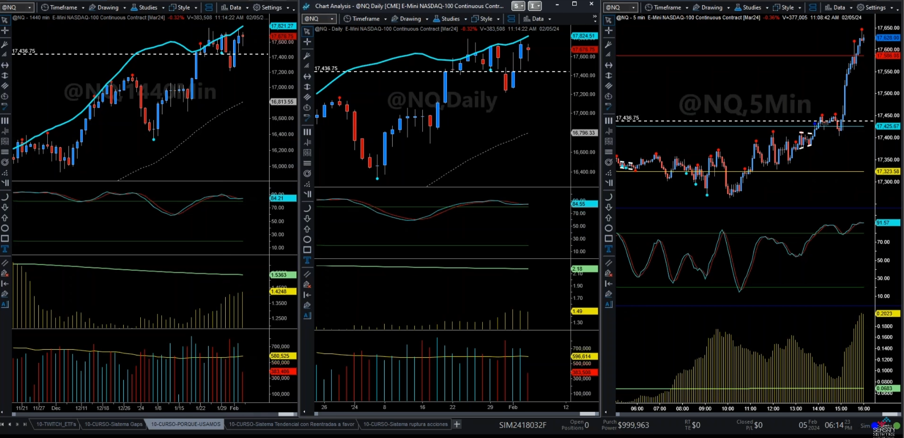

**Temporada de resultados y diferencia entre cierres**

Esta semana ha ocurrido algo interesante. Estamos en temporada de **publicación de resultados empresariales**.
Cuando una gran empresa publica resultados al cierre, pueden producirse movimientos muy bruscos. El **jueves 1**, al cierre, publicaron resultados **Apple, Meta y Amazon**. Meta, en particular, tuvo una subida estratosférica. Esto ocurrió justo después del cierre, alrededor de las **22:15** hora española (15:15 en horario de Nueva York). El contado acababa de cerrar y el futuro seguía cotizando un poco más, hasta las 22:45. Ahí es cuando se produce lo que llamamos el **SETTLE**, el precio de liquidación oficial del futuro.   Ese es el precio que el mercado utiliza como **referencia de cierre diario**.

Aquí lo tengo documentado: podéis ver el gráfico diario a la izquierda y el de 1.440 minutos a la derecha.
En la mayoría de días, ambos gráficos son iguales, pero cuando hay resultados, las diferencias pueden ser enormes.

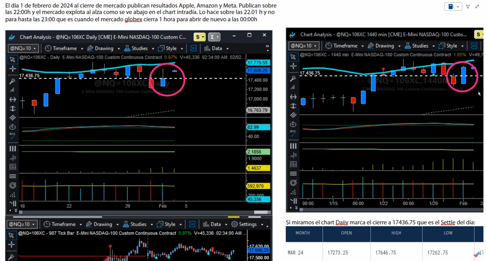

En este caso, la línea blanca en el gráfico (marcada en **17,436.75**) indica el precio de liquidación oficial del futuro. Ese es el precio que todos los fondos usan para su **mark-to-market** diario. Sin embargo, no es el precio real negociado en el mercado durante el día.

De hecho, minutos después del cierre, el precio ya estaba **200 puntos por encima**. Por eso, si operas con un sistema basado en gráfico diario, y usas ese precio de liquidación, tu análisis no refleja la realidad intradía.

**Diferencias entre la base diaria y la intradiaria**

Si usas el gráfico diario estándar, éste no permite cambiar la sesión horaria, y siempre refleja el precio de liquidación oficial. En cambio, si construyes la vela diaria con **datos intradiarios (1.440 minutos)**, reflejarás el `precio real de mercado`, el que se generó con las órdenes reales de compra y venta. Esto es muy importante para los que trabajamos con *sistemas automáticos*:

* La base diaria usa el *settle* (precio calculado por el mercado), no permite modificar la sesion y esta base recoge el precio de liquidacion oficial (en futuros).
* La base intradiaria usa los precios de negociación reales. Deja cambiar la configuración horaria, yo puedo elegir cargar los datos en aquel periodo que yo quiera (pero la diaria no). 

Por eso, es preferible construir las velas diarias con la base intradiaria, ya que muestra lo que realmente ocurrió en el mercado. 

**Ejemplo detallado del caso Meta**  

En el ejemplo concreto de Meta, el precio oficial fue **17,436.75**, lo ves en la linea blanca


pero el precio real en el gráfico intradiario cerró cerca de **17,628**, unos **200 puntos por encima**.

Esto demuestra que, cuando hay resultados, las diferencias pueden ser muy notables.
El *settle* no se conoce en tiempo real; aparece después, cuando el mercado calcula el precio de liquidación oficial.

Por tanto, 
>si un sistema compró intradía porque detectó una señal alcista, pero el *settle* diario se publicó más bajo, al día siguiente ese sistema aparecería “no comprado”.
Esto se debe a que el precio oficial fue corregido posteriormente.

**Recomendaciones para operar con `sistemas diarios`**

> Cuando operamos con sistemas en gráfico diario, y especialmente con datos de **futuros**, es mejor `construir la vela diaria a partir de la intradiaria (1440 minutos)`. Así evitamos los efectos del precio de liquidación oficial (*settle*), que puede distorsionar la operativa. Esto también se aplica a los **ETFs** que replican el índice: cierran a precios similares al *settle*, pero no reflejan necesariamente la reacción inmediata a los resultados de las empresas.

---

**Temporada de resultados y observaciones finales**

Durante estas semanas, hay muchas velas distintas debido a la temporada de resultados.
Normalmente, las velas son parecidas, pero cuando grandes empresas publican, surgen diferencias notables. Esta semana fue un ejemplo clarísimo, y por eso lo documenté para enseñároslo.

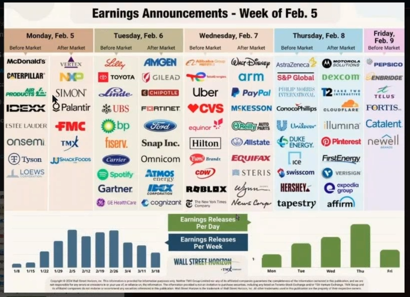

Recordad que publicamos cada semana la imagen con el calendario de resultados (fuente: *Earnings Whispers*). Por ejemplo, esta semana publican McDonald’s, Disney y Pepsi, entre otras. Las grandes tecnológicas ya lo han hecho: Apple, Meta, Amazon, Google, Netflix, y probablemente NVIDIA próximamente.


**Configuración de sesiones y recomendaciones técnicas**

Para terminar, recordad lo siguiente:

* El gráfico de **1440 minutos** equivale a una vela diaria completa. 
* Es recomendable configurar *For bar building, use:* `Session Hours` , para que la primera barra empiece al inicio de la sesión (ahí empieza a contar la barra de 5min, 30' o lo que sea, de 1440' en este caso).

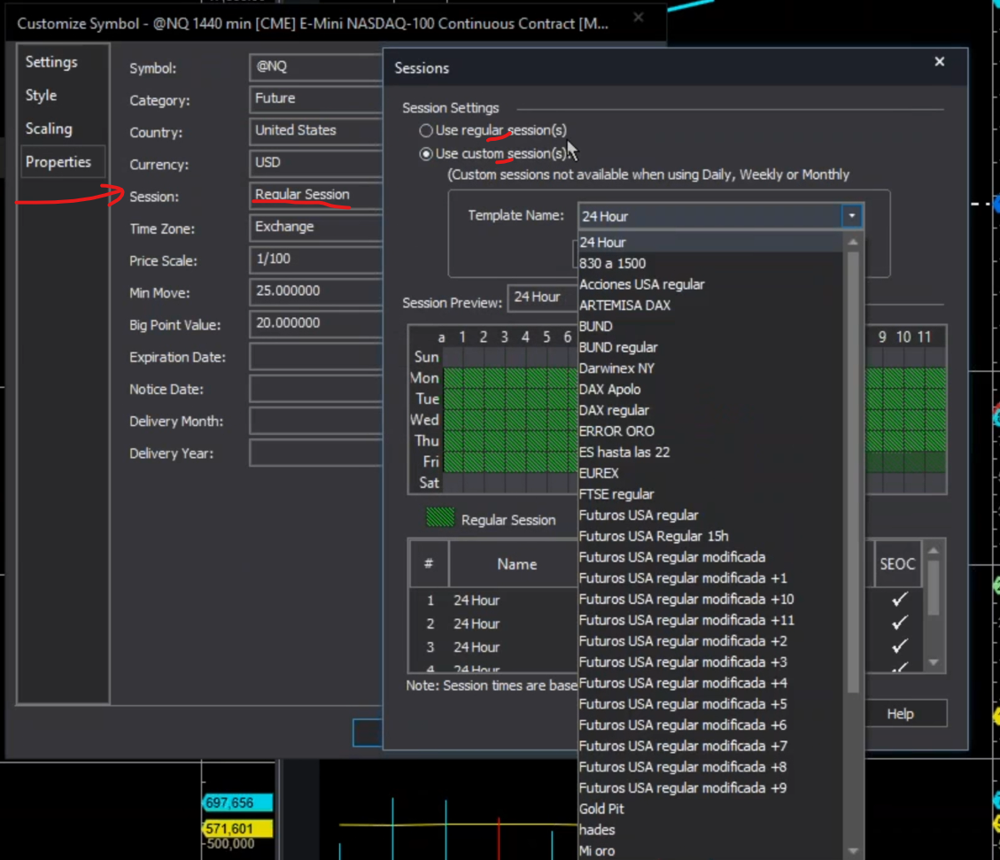

* En los gráficos **intradiarios**, podéis cambiar la configuración de la sesión (por ejemplo, para cerrar el sistema antes del cierre de mercado).
* En cambio, en los **diarios**, no se puede modificar la sesión: siempre recoge la jornada completa.

Esto es otra razón para trabajar con la base intradiaria cuando queréis controlar la hora de cierre o adaptar la operativa.


## Introducción al trabajo con - `canales de Donchian`

Vamos a empezar a trabajar con *Donchian*, a ver hacia dónde nos lleva hoy el tema, y según lo que veamos, haremos una cosa u otra la próxima semana.

He querido empezar por este sistema porque es uno que, más o menos, todos los que llevan un tiempo en los mercados han oído mencionar alguna vez.
Quien nunca haya hecho trading quizá no lo conozca, pero quienes ya tienen cierta experiencia saben que los **canales de Donchian** son bastante conocidos y respetados.

Durante el curso, quien no hubiera oído hablar de ellos antes, ya los habrá visto en la **parte de historia del trading algorítmico**.
A quien no haya hecho todavía esa parte, le recomiendo hacerlo, porque es muy curiosa y está al principio del curso.
En ella hablamos de Donchian, que fue uno de los primeros en operar de forma sistemática —no automática, porque en su época no se podía como ahora—, pero sí con un *enfoque metódico*, con reglas claras, estrategias bien definidas y diversificación en muchos activos (*commodities* y demás).

#### El sistema original de Donchian y las reglas de las cuatro semanas

Donchian utilizaba un sistema muy popular basado en `20 periodos`, que equivalen a `cuatro semanas`.
De hecho, se le conocía como la *regla de las cuatro semanas*.
Él trabajaba principalmente en gráfico semanal y, a partir de su enfoque, nació posteriormente el famoso **sistema de las tortugas** (*Turtle System*).

Tengo preparados algunos documentos sobre esto, que voy a subir también a la plataforma y al Discord.
Veréis una sección llamada “Documentos” donde aparecerán tres archivos que acabo de subir.
Nosotros estamos suscritos a la revista *Stocks & Commodities* y, haciendo un ejercicio curioso, busqué simplemente “Donchian’s” y me aparecieron 58 referencias. He seleccionado tres de las más recientes para compartirlas con vosotros, porque están muy bien y explican el sistema con bastante claridad.

Aquí tenéis los tres artículos:

1. [Stocks & Commodities V. 10:8 (328-331): SIDEBAR: DONCHIAN'S TRADING GUIDES](../../13-practice-03/Donchian-01.pdf)
2. [Using Price Channels](../../13-practice-03/Donchian-01.pdf)
3. [Donchian Breakouts](../../13-practice-03/Donchian-01.pdf)

Estos artículos, en apariencia, reproducen las reglas originales de *Donchian’s Trading*.
No existe un libro oficial de Donchian, pero se sabe que publicó sus ideas en distintos diarios y revistas, y de ahí se extrajeron estos textos.

#### La importancia de acudir a las fuentes originales

Siempre insisto en algo que considero muy importante: cuando utilicéis cualquier indicador o estrategia, id siempre al autor original. La comunidad de trading, con el tiempo, tiende a modificar o simplificar conceptos, a veces ignorando partes esenciales de una regla o de la filosofía del autor. Por eso, leer la fuente original os permite entender el propósito real del creador, su lógica y las condiciones bajo las que diseñó el indicador.

En términos generales, el sistema de Donchian `marca un canal de precios`, y cuando el precio `rompe ese canal`, se interpreta como el `inicio de una nueva tendencia`. Lógicamente, es un sistema más eficaz en activos con *comportamientos tendenciales* y en periodos más largos.

#### Uso intradiario y dificultad en tendencia pura

Personalmente, es un indicador que recomiendo, especialmente para marcar `estructuras de tendencia`.

Sin embargo, cuando se usa de forma *intradiaria*, las cosas se complican un poco. No es imposible, pero lograr una *tendencia pura* en marcos tan cortos es mucho más difícil. En teoría, un `sistema tendencial puro` debe *dejar correr los beneficios*, lo que implica `no tener Take Profits (TPs)`.
Si uno quiere diversificar de verdad, necesita sistemas de este tipo, aunque sean menos cómodos psicológicamente o tengan peores ratios de acierto.

#### Psicología del trader y tipos de sistemas

En las clases teóricas ya comentamos la parte psicológica. Recuerdo que hicimos un ejercicio para medir la *aversión al riesgo*, y la próxima clase os preguntaré los resultados por curiosidad, para ver si coinciden con los ratios esperados.

Normalmente, tanto los traders principiantes como muchos avanzados se sienten más cómodos con `sistemas antitendenciales`, es decir, aquellos con una *alta tasa de acierto*. Por ejemplo, un sistema que acierta seis de cada diez operaciones se percibe como más estable, más tranquilo y psicológicamente más llevadero. Estos sistemas suelen tener *rachas de fallos más cortas* y resultados más regulares, aunque no siempre sean los más rentables.
En general, son estrategias más *intradiarias*, que cierran posición al final del día o incluso antes, y permanecen poco tiempo en el mercado.

Esto no significa que sean mejores, pero es normal que al principio uno se incline hacia ellos. De hecho, muchos traders novatos comienzan por el *intradiario*, y no está mal, porque ahí se puede *controlar mejor el riesgo*.


#### Control del riesgo: intradía vs swing trading

En intradía, si haces bien tu trabajo y diseñas un sistema sólido, puedes controlar mejor el riesgo porque no estás expuesto a los *gaps* entre sesiones. En cambio, si operas en swing o tendencia diaria, estás sujeto a lo que ocurra entre el cierre y la apertura siguiente. 

Imagina, por ejemplo, lo que ocurrió con Meta: quien estaba largo ganó mucho, pero quien estaba corto sufrió un salto de más de 200 puntos en contra.
En cambio, un trader intradiario que cierra posición antes del final del día no queda expuesto a ese tipo de eventos.

Por eso, los traders con cuentas pequeñas o poca experiencia suelen preferir sistemas intradiarios o antitendenciales:
pueden *controlar mejor el riesgo*, tener *menores drawdowns* y *requerir menos capital*.

#### Diversificación y la importancia del sistema tendencial

Ahora bien, si ya estás en ese punto y quieres *diversificar de verdad*, lo mejor que puedes hacer es incorporar un *sistema tendencial puro*.
Un tendencial puro *no tiene TP*; deja correr las posiciones mientras exista tendencia. Puede ejecutarse en gráficos intradiarios, pero debe mantener posiciones entre sesiones si hay continuidad en el movimiento.

¿Puede hacerse tendencia intradiaria?

Sí, puede hacerse, pero ya no sería un tendencial puro: los ratios se acercan más al 50 % o incluso al 40 %.
En esos casos sí conviene tener *Take Profit*, porque vas a cerrar al final del día igualmente.
Esto lo vimos también en la parte teórica del curso.


### 🟦 Aplicación práctica: Donchian en Apple `AAPL` 

En este punto del curso, hemos planteado un *sistema Donchian* basado en datos diarios.
La última vez lo probamos con *Apple*, y hoy vamos a retomarlo con el mismo activo.
Solo he hecho un pequeño cambio: ahora el gráfico está cargado en *1440 minutos*.

Precisamente por eso, esta semana aproveché para introduciros el tema de los cierres y las diferencias entre las bases diarias e intradiarias.
Me vino muy bien que ocurriera el caso de Meta, porque nos permitió ilustrar el concepto de forma visual: un cambio de más de 200 puntos en un solo día.

Si lo hubiera hecho la semana pasada, habría sido menos claro, pero esta coincidencia nos ha servido perfectamente para ver cómo aplicar *el sistema Donchian* en la práctica, utilizando la base intradiaria de 1440 minutos.


**Retomando el sistema y contexto de código**

Tenemos desarrollado el [codigo](../../12-practice-02/PRACTICA%2002.ELD) en EasyLanguage. He trabajado bastante un código con algunas cositas que ya de hecho sirven para varios; esto es habitual —llamadlo manías o prácticas de programación— y os las iré comentando. Evidentemente tenéis los tres PDFs que os he pasado, que también son un “segundo código”, porque es Donchian explicado; pero me refiero a las partes que ahora vais a ir viendo que yo he incorporado al sistema a modo de posibilidades.

#### **Inputs del sistema y objetivo de evaluación**

**Punto 1: muchos inputs y su papel**

El sistema ahora mismo veréis que tiene muchos, muchos inputs.

```sh
input:
	Per_Canal (20),
	Price_Up (Close),
	Price_Dw (Close),
	Bar_Filtro (0),
	OperoCortos (false),
	Filtro_ATR (0.00),
	
	Salgo_Media (false),
	Prc_Stop (0.00),
	Prc_Profit (0.00),
	Prc_Trail (0.20),
	Bar_Exit (0),
	
	Start_Equity (100000),
	MMVar_Start (100),
	MMVar_Profits (100),
	Min_Size (1),
	Max_Size (100000),
	RoundTo (1);
```


Esto es habitual en un sistema: un input es todo aquel parámetro susceptible de ser variado desde fuera del código y también de ser optimizado.

<figure>
  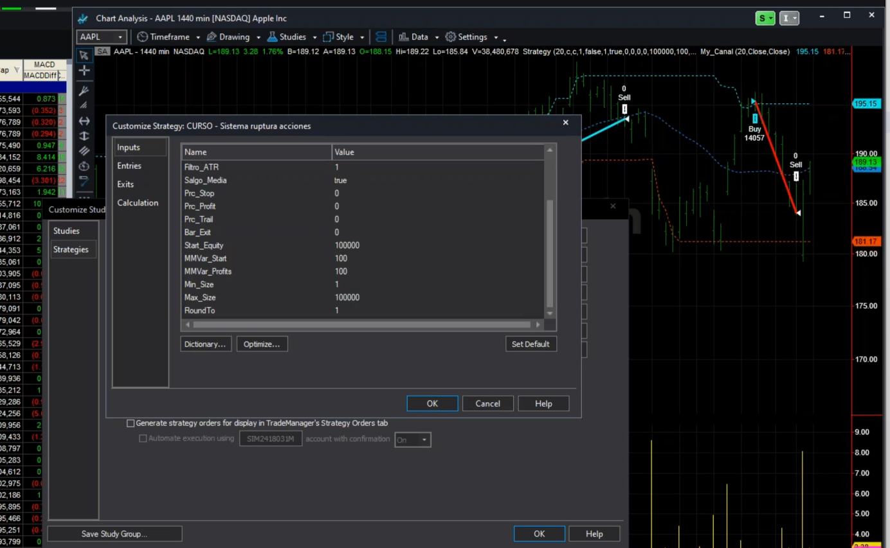
  <figcaption>Figura 1. Nuestros imputs vistos desde TradeStation</figcaption>
</figure>


Pero recordad que no todo input debe ser optimizado; de hecho, casi siempre es así: la mayoría de los inputs son de *configuración* —lo que llamamos “al core”— y no tienen por qué tocarse o, simplemente, como en este caso, son *instrumentales*, es decir, de *análisis*. 

Estamos, podemos decir, en una *fase de evaluación preliminar*, de crear nuestra idea y construir nuestro sistema.
Una forma de hacerlo es implementar varias posibilidades en el código para que, mediante la *observación*, la *optimización* y distintas herramientas, yo pueda ir construyendo la idea, partiendo ya de una ventaja que sé que existe y que he evaluado de manera sencilla; a partir de ahí, la vamos a ir edificando.

**Diario y semanal: pocos trades y optimización instrumental**

En sistemas diarios y más aún semanales (este lo podíamos haber hecho perfectamente semanal, pero no he querido irme de entrada a un extremo; veremos sistemas semanales, pero ahora prefiero un término medio), ocurre que un diario muchas veces tiene muy pocos trades como para permitir un proceso de optimización “al uso” (para elegir parámetros). Aun así, sí puedo realizar optimizaciones instrumentales para analizar información, construir mapas o perfiles de optimización (como vimos con Excel) y ver cómo se comporta el sistema ante distintos parámetros.

Por ejemplo, los canales de Donchian por defecto o definición se calculan en 20 :  pero yo ahora puedo ver cómo va con otras variables 20-19-18, o pasarlo al optimizador, exportarlo a Excel y analizarlo en una tabla. Entonces “optimizo”, pero no para elegir o cambiar el parámetro, sino para entender cómo se mueve el sistema ante cambios. Además, lo puedo hacer en un activo o en varios; a partir de diario es más que recomendable —en intradiario también—, pero en diario diría obligado, y en semanal/mensual, ultra-obligado.  

> ---  
> Es casi imposible trabajar con un solo activo: hay que analizar vía `cestas de activos`, porque no hay suficientes trades; cuanto más alto el timeframe, más universal debe ser la idea.
>   
> ---  

#### **Cómo trabajamos una idea: búsqueda dirigida y concepto primero**

Llegamos a la idea: imaginemos que ya hemos encontrado una idea de sistema. 

**Búsqueda dirigida vs fuerza bruta**

Veremos muchas ideas y algunas mediante código; no tardaremos en hacer una clase de búsqueda de ideas a través del código, pero muy dirigida. La gran diferencia entre nuestras búsquedas dirigidas y los buscadores por fuerza bruta es que aquí la búsqueda está totalmente dirigida, muy cerrada y central. Yo marco cuatro, cinco o seis cosas a buscar y ya las he elegido yo.

El problema de los programas “todo-terreno” es que la búsqueda es tremendamente variable; además, modifican inputs de la propia idea, y eso deriva en sobreoptimizaciones muy fáciles. Aquí también podríamos caer en ello, pero es más difícil, porque parto de un principio, de un concepto.

Ese es siempre lo importante y necesario.

<div style="border-left: 4px solid #f39c12; background: #fff8e5; padding: 10px 15px; margin: 10px 0;">
  <strong>⚠️ Regla</strong><br>
  Una búsqueda dirigida siempre debe partir de un concepto bien definido.
  Evita modificar parámetros sin una justificación teórica clara: la sobreoptimización destruye la validez del sistema y genera resultados irreproducibles.
</div>


#### **Setup de entrada y variantes de ruptura**

> ---
> Hemos cargado el [file]((../../12-practice-02/PRACTICA%2002.ELD)) en TradeStation:
> ```
>```sh
># file : PRACTICA 02.ELD
>Strategy  - CURSO - Sistema ruptura acciones
>```
> Os enseño el código porque ahí voy a explicarlo; pero no es lo importante ahora. El código, como he dicho en la teoría, es una herramienta, ni más: es la forma en que el ordenador me entiende.
>  
> ---


¿Cuál es el setup de entrada general del sistema? Respecto a la semana pasada, he incorporado una pequeña variación, y ahora os voy a explicar las dos o tres variantes que hay de Donchian, o cómo interpretar una ruptura.

> Esto no sirve solo para Donchian: `sirve para cualquier ruptura`.

Hay un componente de gusto y un componente de probar para ver cuál puede ir mejor en cada activo, pero hay bastante consenso.

**Setup: Entrada estándar**

```sh
Inputs:
    Per_Canal(20),
    Price_Up(Close),
    Bar_Filtro(0);

Vars:
    MP(0);

// Alias de posición
MP = MarketPosition;
```

```sh
# TIPICO SISTEMA DE RUPTURA: el cierre supera el m?ximo deL CIERRE DE 20 barras
if Close > 0 and Condition1 and MP <> 1 and (BarsSinceExit(1) >= Bar_Filtro or TotalTrades = 0) then
Begin
	if Close > Highest(Price_Up, Per_Canal)[1] then
 		Buy Contratos contracts Next Bar at Market;
End;
```

Esto viene a decir: si el cierre de una vela es mayor (o igual) que el mayor cierre de las últimas N barras —por defecto 20, marcado por el input `Per_Canal`—, entonces compra en la apertura de la siguiente barra el número de contratos correspondiente.

> **notas** :   
>  
> **Usar ` > (mayor estrictamente)` — la opción más común**  
>  
> `If Close > Highest(Price_Up, Per_Canal)[1] then`
>    
>Cuándo usarlo:  
>* Cuando buscas una ruptura real del canal, no solo tocarlo.
>* Evita entradas falsas por empates (cierres iguales al máximo anterior).
>* Es el estándar en casi todos los sistemas Donchian clásicos y en el Turtle System original.  
> 
>Ventajas:  
>* Más robusto ante datos con cierres repetidos.
>* Genera menos operaciones falsas.
>  
> Desventajas:
> * Puede entrar una vela más tarde (pierde algo de inmediatez).
>  
> ---
>  
> **Usar `>= (mayor o igual)` — ruptura más sensible**
>  
> `If Close >= Highest(Price_Up, Per_Canal)[1] then`
>  
>Cuándo usarlo:  
>* Cuando trabajas con activos poco volátiles o datos redondeados (por ejemplo, precios con pocos decimales).
>* Si quieres más frecuencia operativa y no te importa asumir alguna entrada adicional.
> 
>Ventajas:  
>* Captura rupturas en el mismo nivel exacto del canal.
>* Puede adelantarse una barra antes a una tendencia incipiente.
>  
> Desventajas:
> * Aumenta el ruido y la tasa de señales falsas.
>  
> ---  

Entrada estándar:

<div style="border-left: 4px solid #27ae60; background: #ecf9f1; padding: 10px 15px; margin: 10px 0;">
  <strong>📏 Regla práctica</strong><br>
  En la mayoría de los sistemas Donchian y de ruptura tendencial, se recomienda usar <code>&gt;</code> (mayor estrictamente) para evitar señales duplicadas o falsas. Reserva <code>&gt;=</code> únicamente para activos discretos o series con baja variación de precios.
</div>


```sh
	if Close > Highest(Price_Up, Per_Canal)[1] then
 		Buy Contratos contracts Next Bar at Market;
```

Por qué `[1]`? en `Highest(Price_Up, Per_Canal)[1]` usa el máximo de las últimas N barras excluyendo la barra actual, evitando look-ahead. El look-ahead bias (sesgo de anticipación o de “mirar hacia adelante”) ocurre cuando, sin darte cuenta, tu sistema usa información que en la realidad aún no existía en el momento de la decisión.

<div style="border-left: 4px solid #0077b6; background: #e8f4fa; padding: 10px 15px; margin: 10px 0;">
  <strong>🧠 Nota técnica</strong><br>
  El desplazamiento <code>[1]</code> impide el uso de datos del futuro (look-ahead bias). Cualquier referencia sin este desplazamiento invalidaría el backtest al incorporar información no disponible en el momento real de la decisión.
</div>


La diferencia que he hecho hoy es incorporar el uso del cierre de manera explícita.  El otro día lo dejé con cierres a propósito, porque quería forzar el debate: lo habitual en un canal de Donchian no es usar el cierre como máximo, sino usar el máximo (high).

Esta linea (el canal azul de dochian)  de la siguiente imagen pinta los máximos de 20 velas `pero de los cierres`.  

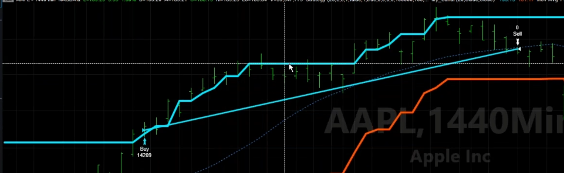

Yo puedo pintarlo de lo que quiera.

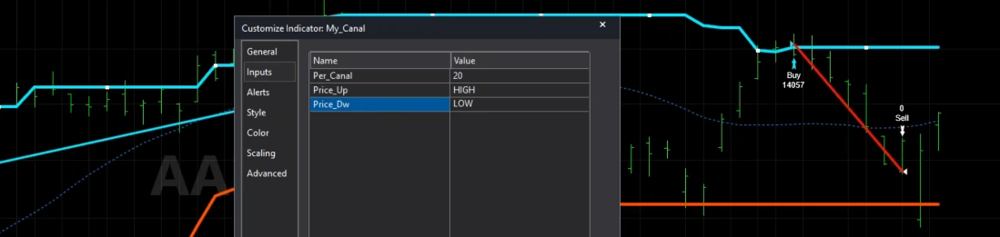

Puedo hacerlo del HIGH y del LOW, que es lo habitual; y en la siguiente imagen ahora sí veréis que es el máximo. Es el máximo hasta la vela en curso (si no, nunca rompería). Se entiende: si cuento el máximo de la vela en curso, no rompe nunca.
Entonces es el 20 hasta el anterior; ahora está hecho con máximos y mínimos: este es el canal habitual.

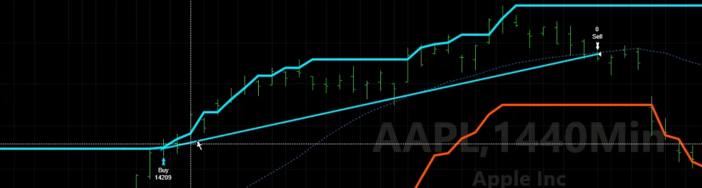


**Por qué priorizar el cierre en diario (y cuándo no hacerlo) - Cierre como señal dominante en diario**

Una de las reglas que nosotros más usamos para elegir esto es que, en diario, cuando trabajamos la base diaria, *el cierre* lo consideramos muy importante; por lo tanto, normalmente —y todavía más en acciones—, preferimos calcular máximos y mínimos con los cierres.

En este ejemplo no lo he probado aún; lo podemos probar ahora; pero creo que funcionará mejor —o, al menos, me genera más confianza y seguridad— que los máximos y mínimos se calculen con cierres. ¿Por qué? Porque el cierre es el final de un periodo. El mercado abre la sesión, acaba a las 22:00, hay una larga pausa y vuelve a abrir. Hay mucho operador intradiario que abre y cierra posición durante el día, y el precio de cierre define mejor que el máximo o mínimo la tendencia de fondo del activo. Esto es especialmente cierto en activos con largas pausas, como las acciones.

En futuros, si la vela diaria está construida con el Globex (23h), seguramente es menos relevante; pero si vas a operar el futuro en horario regular (15:30–22:00), ocurre lo mismo: hay muchas horas de pausa, y el cierre gana importancia. En estos casos, nos gusta trabajar con el campo `Close`, más que con `High`/`Low`.

<div style="border-left: 4px solid #f39c12; background: #fff8e5; padding: 10px 15px; margin: 10px 0;">
  <strong>⚠️ Regla</strong><br>
  En marcos <em>diarios</em>, cuando trabajamos con la base diaria, el <em>precio de cierre</em> adquiere una importancia fundamental. Por ello —y especialmente en acciones—, es recomendable calcular los máximos y mínimos utilizando los cierres. 
  Durante la sesión, muchos operadores intradiarios abren y cierran posiciones constantemente, pero el cierre representa el punto en que el mercado “decide” la dirección final del día. 
  Este valor sintetiza la presión neta de compradores y vendedores y define mejor la tendencia de fondo del activo, sobre todo en instrumentos con pausas largas entre sesiones, como las acciones.
</div>

<div style="border-left: 4px solid #c0392b; background: #fdecea; padding: 10px 15px; margin: 10px 0;">
  <strong>🔍 Criterio operativo</strong><br>
  Cuando el timeframe diario se construye a partir de datos intradiarios, es crucial definir qué campo de precio se usará para los cálculos del canal (Close, High o Low). Este ajuste altera significativamente la lógica de entrada y salida.
</div>

--- 


**Intradía: cierre irrelevante; usar High/Low o Typical Price**

Si fuera `sistema intradiario`, entonces 100% el cierre de una vela de cinco minutos tiene casi cero relevancia; importa entre 0 y 0,1.
Ahí, el cierre no dice nada: o bien usamos *máximos/mínimos*, o un precio centrado como el `TypicalPrice` (media de High, Low y Close: `((H+L+C)/3)` ), que es un precio más centrado.  
  
**Input de cálculo del canal (`Price_Up`)**

```sh
if Close > Highest(Price_Up, Per_Canal)[1] then
	Buy Contratos contracts Next Bar at Market;
```

Como aquí, de entrada, empezamos con acciones, definimos los canales con campo Cierre;   
por eso, en el código, `Price_Up` lo he dejado como input de configuración, para poder cambiar rápido si quiero calcular el canal con Close, High o Low:

```sh
input:
	Per_Canal (20),
	Price_Up (Close),
```

Y lo puedo cambiar desde aquí:

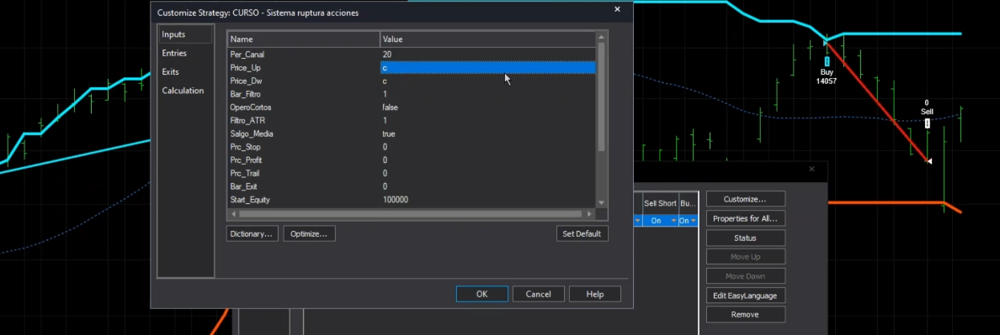

También podría hacerlo con `TypicalPrice`; puedo escribirlo directo:

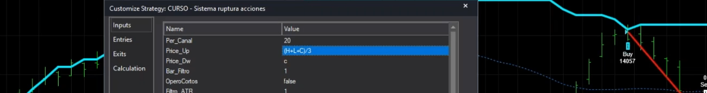

`TypicalPrice` también funciona porque es una función que devuelve un precio en el codigo. Si no existiera como función, me daría error. Cualquier valor que devuelva un precio lo puedo usar ahí.

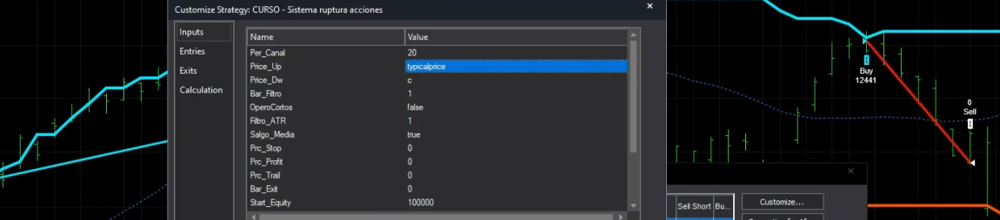


<div style="border-left: 4px solid #2980b9; background: #eaf3fb; padding: 10px 15px; margin: 10px 0;">
  <strong>⚙️ Nota de implementación</strong><br>
  El propósito de declarar un parámetro como <em>input</em> no es siempre optimizarlo, sino <strong>facilitar la experimentación controlada</strong>. 
  Permitir modificar un valor directamente desde la interfaz acelera el análisis comparativo y evita tener que editar el código cada vez que se prueban distintas configuraciones.  
  <br><br>
  En este ejemplo, <code>Price_Up</code> puede alternarse fácilmente entre <code>Close</code>, <code>High</code>, <code>Low</code> o <code>TypicalPrice</code> para observar cómo cambia el comportamiento del sistema.  
  Esta flexibilidad es clave en la fase de <em>evaluación preliminar</em>: se busca entender la sensibilidad del modelo ante diferentes tipos de precios, no optimizar el valor “perfecto”.
</div>

#### **Evaluación del setup básico y simetría riesgo/beneficio:**

Vamos a centrarnos en este punto:

El **cierre** de la vela que ves marcada en la imagen es el que **rompe el canal superior** (línea azul).
Ese *cierre por encima del canal* es el que genera la señal de entrada. Por tanto, el sistema *ejecuta la compra en la apertura de la siguiente vela*. Para que esto funcione correctamente, el *canal* debe **calcularse hasta la vela anterior**, **sin incluir la barra actual**. Si el canal incluyera la vela en curso, el cierre nunca podría superar su propio máximo, y la ruptura no se produciría.

<figure>
  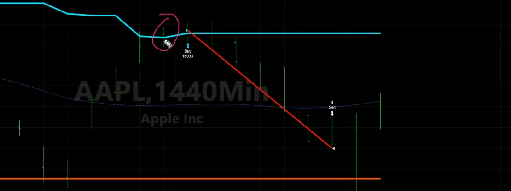
  <figcaption>Figura 15. Ruptura del canal de Donchian y entrada en la barra siguiente.</figcaption>
</figure>

Entonces este ejemplo corresponde al `setup básico`. Por ahora, al sistema le retiramos la salida central para centrarnos solo en la **salida simétrica**, y después analizaremos las demás (salida por media, trailing, etc.).
Empecemos evaluando esta primera configuración:

<figure>
  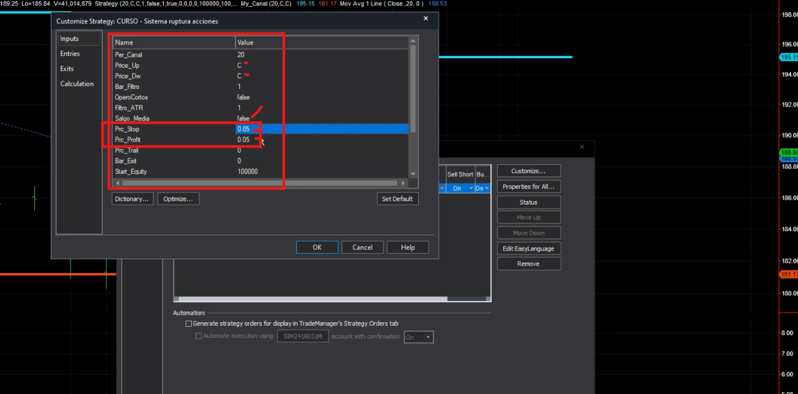
  <figcaption>Figura 16. Configuración base del sistema con riesgo y beneficio simétrico.</figcaption>
</figure>

En esta prueba hemos fijado un **riesgo (Stop)** y un **profit target** idénticos:
ambos al **5 % (0.05)**.
De este modo, el sistema solo puede cerrar posiciones mediante esta salida —no hay cierre por número de barras, por trailing stop ni por ninguna otra condición—.

El objetivo es **igualar el ratio win/loss**, para evaluar el comportamiento puro del setup sin sesgos externos.
Esta configuración sirve para medir la **eficiencia del patrón de entrada** sin interferencia de gestión monetaria.

```sh
# menu chrt TradeStation
Data → Strategy Performance Report
```

<figure>
  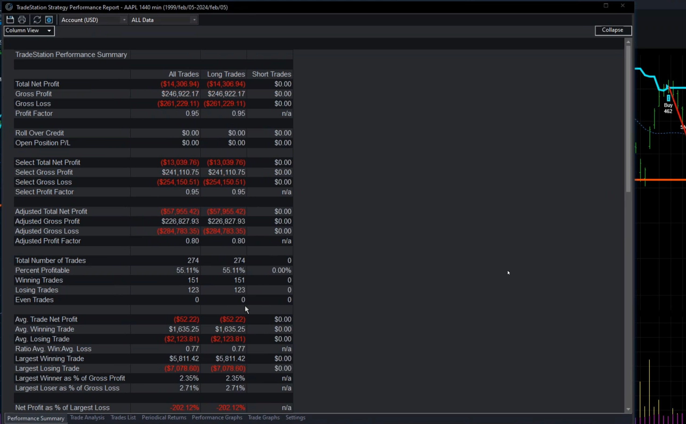
  <figcaption>Figura 17. Resultado inicial del setup simétrico (0.05 / 0.05): sistema en pérdidas.</figcaption>
</figure>

En esta configuración inicial el sistema arroja pérdidas:

* **Total Net Profit:** ($14,306.94) — valores en paréntesis (rojos) indican pérdida.
* **Profit Factor:** 0.95 → por debajo de 1, el sistema pierde más de lo que gana.
* **Avg. Trade Net Profit:** ($52.22) → pérdida media por operación.

Por tanto, el **setup base no es rentable** en este punto.

---

#### **Segunda prueba: ajuste del rango de riesgo/beneficio**

Aumentamos el rango a **0.10 / 0.10**, manteniendo la simetría pero con un espacio más amplio para que las operaciones respiren.

<figure>
  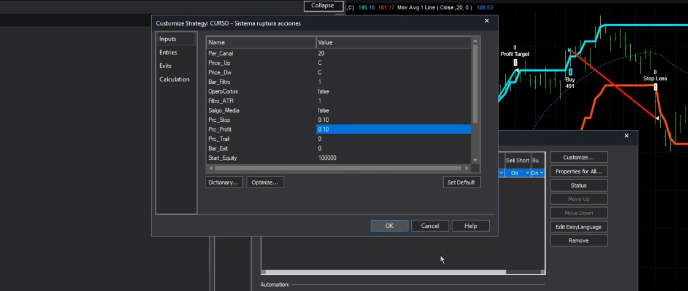
  <figcaption>Figura 18. Ajuste de riesgo y beneficio al 10 %.</figcaption>  
</figure>

Con esta modificación los resultados mejoran significativamente:

<figure>
  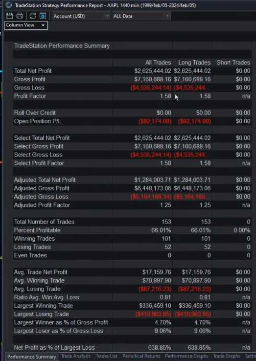
  <figcaption>Figura 23. Performance con 0.10 / 0.10 — mejora sustancial del Profit Factor y tasa de acierto.</figcaption>
</figure>

**Interpretación:**

* **Win Rate (Percent Profitable):** 66.01 %.
  → Dos de cada tres operaciones resultan ganadoras.
* **Ratio Win/Loss:** 0.81
  → Cada pérdida media es un 20 % mayor que una ganancia media, pero el alto porcentaje de acierto compensa.
* **Profit Factor:** 1.58
  → Muy sólido. Por cada dólar perdido, el sistema gana 1.58.

Esto demuestra que el **setup de entrada es sólido**, aunque aún con margen de mejora en la gestión de riesgo monetario.

---

#### **Configuración monetaria y control de tamaño**

Ahora bloqueamos el número de acciones para uniformar la gestión monetaria.
De este modo eliminamos distorsiones provocadas por el cambio de precio del activo a lo largo de los años (acciones de Apple desde pocos dólares hasta más de 180 USD).

```sh
Properties for All...
```

<figure>
  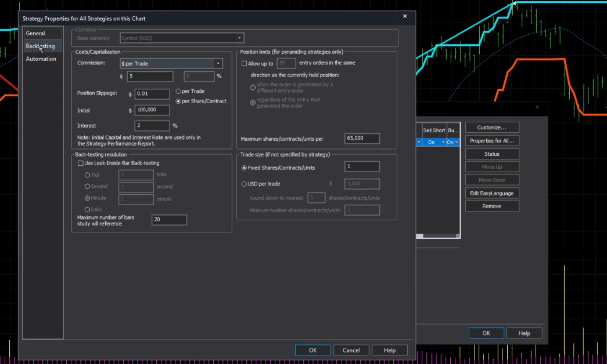
  <figcaption>Figura 20. Propiedades generales de backtesting en TradeStation.</figcaption>
</figure>

```sh
Customize...
```

<figure>
  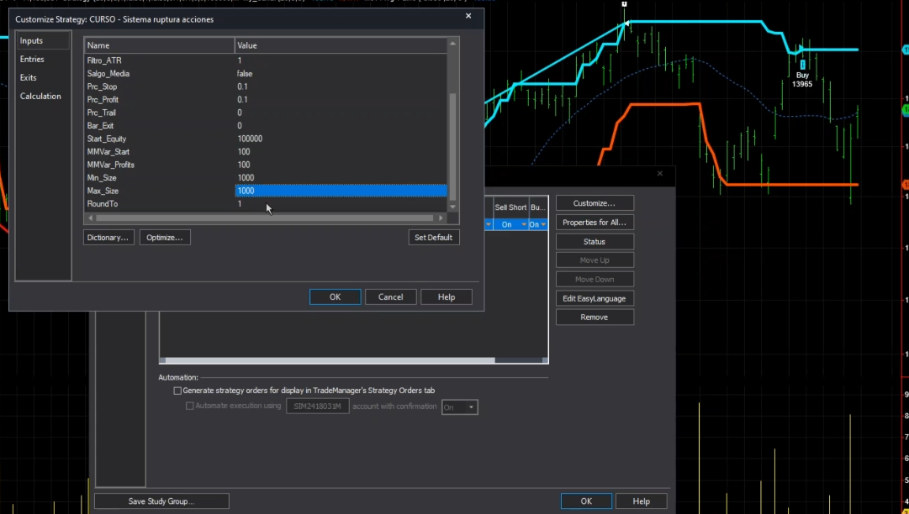
  <figcaption>Figura 21. Bloqueo de número de acciones para pruebas uniformes.</figcaption>
</figure>

Fijamos el tamaño a **1,000 acciones** constantes.
Esto permite comparar trades históricos de forma homogénea y mantener un riesgo porcentual estable.

<figure>
  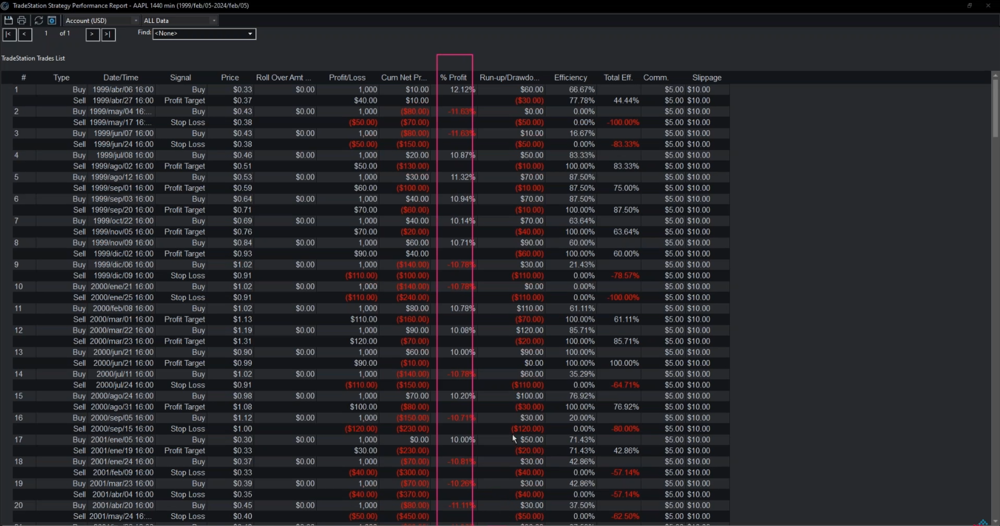
  <figcaption>Figura 22. Efecto del bloqueo de tamaño: homogeneización del riesgo relativo.</figcaption>
</figure>

Aun así, observamos que las variaciones monetarias entre épocas siguen siendo elevadas:
las operaciones mantienen un **riesgo relativo del ~10 %**, pero el valor absoluto varía con el precio del activo.

Si hubiésemos expresado el Stop Loss en **valor monetario fijo**, los ratios serían más estables.
En esta fase, sin embargo, lo importante es la coherencia porcentual del riesgo.

Lógicamente en dólares a medida que va avanzando pues cambia cambia bastante porque depende bastante del precio el activo estamos hablando ya de estamos dando de lo que tengo cargado 25 años los cargados 25 años pues claro tenemos compras aquí a céntimos y compras aquí a 180 dólares entonces el problema de las acciones es muy importante entonces la diferencia es gigantesca los trade son del orden del 10 por ciento pero el valor monetario no recuerdo el valor monetario no es del orden del 10 por ciento es imposible si lo hubiéramos hecho el STOPLOSS en valor monetario ecualizaría mejor en ese sentido en el sentido de los ratios pero ahora mismo eso me da igual no me importa simplemente era para que lo para que lo ecualizado a un nivel de riesgo en porcentaje igual o muy parecido y aquí como tenés eso me lo calcula luego yo en excel lo podría calcular como quisiera ya lo visteis que lo hicimos y con muchos muchos fitness y demás pero aquí el ratio me lo calcula pero bueno todo caso ya se ve que es claramente claramente tiene un avg y un porcentaje de aciertos bastante bastante elevado es decir el setup de entrada en sí es es bueno es bueno es es claramente bueno y permite seguir trabajando con él que es lo que lo que queremos 

> ---
>**Conclusión parcial:**  
>El setup base, con una ruptura Donchian clásica (`Close > Highest(Price_Up, Per_Canal)[1]`) y gestión simétrica 0.10 / 0.10, >demuestra una **estructura robusta**:  
>una tasa de acierto del 66 % y un profit factor superior a 1.5.
>Esto confirma que la **lógica de entrada** tiene validez estadística y es apta para seguir construyendo sobre ella —por ejemplo, >añadiendo filtros direccionales o salidas adaptativas—.
> 
> ---


### 🟦 Aplicación práctica: Donchian en `XLK`

Como ya comentamos, es esencial probar el sistema en distintos activos.
Aquí lo aplicamos sobre el **ETF sectorial de tecnología `XLK`**.  

Mientras se carga el gráfico en TradeStation, volvemos brevemente al código:

#### Gestión monetaria dinámica

He incorporado una **gestión monetaria dinámica**, es decir, una lógica que ajusta el número de contratos en función del capital disponible y del precio del activo.

```sh
{ Money Management }
Profits = NetProfit + OpenPositionProfit;

If AbsValue(Close * BigPointValue) > 0 Then
	Value1 = AbsValue(Close * BigPointValue)
Else
	Value1 = 0.01;
	
Contratos = ((Start_Equity * MMVar_Start * 0.01) + (Profits * MMVar_Profits * 0.01)) / Value1;
Contratos = IntPortion(Contratos / RoundTo) * RoundTo;
Contratos = MaxList(Contratos, Min_Size);
Contratos = MinList(Contratos, Max_Size);
```

Esto, como recordáis, es especialmente recomendable en activos con gran variación de precio, ya que permite ajustar el tamaño de las posiciones a lo largo del tiempo.  
De lo contrario, un mismo número de acciones implicaría riesgos completamente diferentes.

```sh
# chart TradeStation: doble click en icono de entrada de la estrategia
Customize Studies & Strategies > Properties for All...
```

<figure>
  
  <figcaption>Figura 20. Propiedades generales del backtesting en TradeStation.</figcaption>
</figure>

```sh
Customize Studies & Strategies > Customize...
```

<figure>
  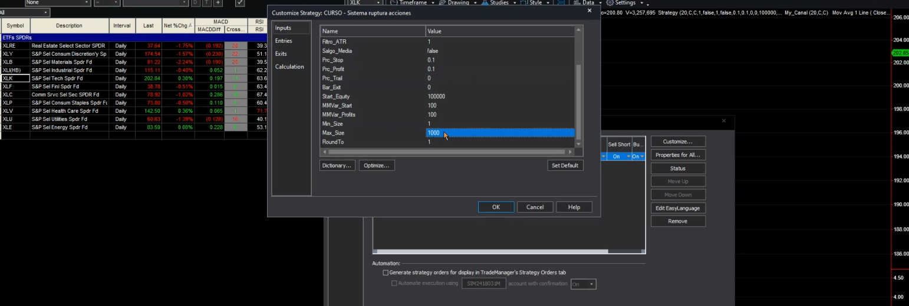
  <figcaption>Figura 24. Personalización de parámetros monetarios del sistema.</figcaption>
</figure>

La lógica implementada es muy sencilla y puramente nominal (no basada en riesgo o volatilidad):

```sh
Contratos = ((Start_Equity * MMVar_Start * 0.01) + (Profits * MMVar_Profits * 0.01)) / Value1;
```
En esta parte del codigo, la fórmula invierte aproximadamente el **100 % del capital disponible** en cada operación, ajustando el tamaño en función del precio del activo. Cuando el precio sube o baja (por ejemplo, de $1 a $300), el número de acciones se recalcula automáticamente, manteniendo una exposición constante en porcentaje.

> ---
> La estrategia está haciendo gestión monetaria dinámica, es decir, el número de contratos o acciones (Contratos) no es fijo, sino que se recalcula en cada operación según el valor total de la cuenta (equity) y el precio del activo (Close).
> 
> Es decir, cada vez que cambia el precio del activo, cambia el tamaño de la posición, para mantener una exposición más estable en términos de porcentaje de la cuenta. Cuando el precio sube o baja (por ejemplo, de $1 a $300), el número de acciones se ajusta automáticamente. De esta forma, el sistema mantiene la misma exposición en porcentaje, aunque el precio del activo cambie drásticamente. Cuando el precio sube o baja (por ejemplo, de $1 a $300), el número de acciones se ajusta automáticamente:
>
>| Precio de acción | Capital  | Nº acciones aproximado | % invertido |
>| ---------------- | -------- | ---------------------- | ----------- |
>| $1               | 10,000 $ | 10,000 acciones        | 100 %       |
>| $300             | 10,000 $ | 33 acciones            | 100 %       |
>
> 
>Si usaras un *lote fijo* (por ejemplo, 1.000 acciones) durante 25 años de datos:
>
>* Cuando Apple cotizaba a *$1*, 1.000 acciones = *$1.000* invertidos (poca exposición).
>* Cuando Apple vale *$300*, 1.000 acciones = *$300.000* invertidos (enorme exposición).
>
>Eso distorsiona completamente los resultados del backtest, porque *el riesgo y la exposición crecen con el precio del activo*.
>
>La gestión monetaria activada corrige eso: *normaliza la exposición* a un porcentaje constante del capital (por ejemplo, 100 %).
>Así, el riesgo y el rendimiento se mantienen proporcionales en todo el histórico.
>
>No significa que el sistema esté apalancado o que eso sea lo ideal para operar real.
>Significa que, para fines de *backtesting y comparación*, la estrategia:
>
>* ajusta el tamaño de cada operación para reflejar un *porcentaje constante de capital*,
>* permite comparar períodos históricos con precios muy diferentes (de $1 a $300) sin que el resultado quede distorsionado,
>* y facilita calcular ratios, drawdowns y rendimientos relativos en *Excel* después.
> --- 

Por eso, esta aproximación es más razonable para estudios históricos, aunque no sea el enfoque exacto que usaríamos en operativa real.
Permite **comparar resultados entre épocas** sin que los precios extremos alteren la evaluación del sistema.

---


#### Regla de entrada

La entrada sigue siendo la ruptura clásica de Donchian:

```sh
Begin
	if Close > Highest(Price_Up, Per_Canal)[1] then
 		Buy Contratos contracts Next Bar at Market;
End;
```

Es decir, cuando el **cierre actual** supera el **máximo de las últimas N barras (por defecto 20)**, se compra en la **apertura de la siguiente**. Este tipo de entrada es la base del *Donchian Channel Breakout* clásico.

El activo `XLK` (tecnología) es altamente tendencial a largo plazo, por lo que el lado largo tiende a generar resultados positivos de forma más estable.

#### Reglas de salida

Tal y como está configurado ahora mismo, , el sistema **entra solo por Donchian** y **sale por un Take Profit del 10 %**.

<figure>
  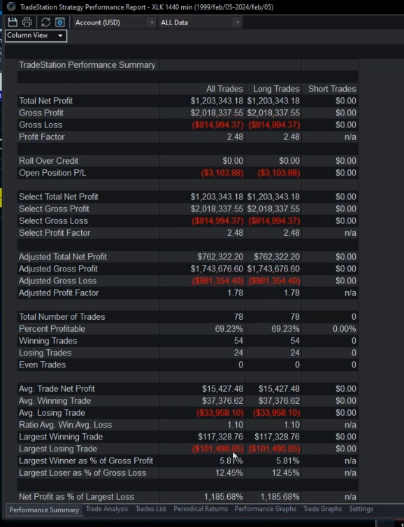
  <figcaption>Figura 59. Performance de la estrategia Donchian sobre XLK Take Profit del 10 %.</figcaption>
</figure>

<figure>
  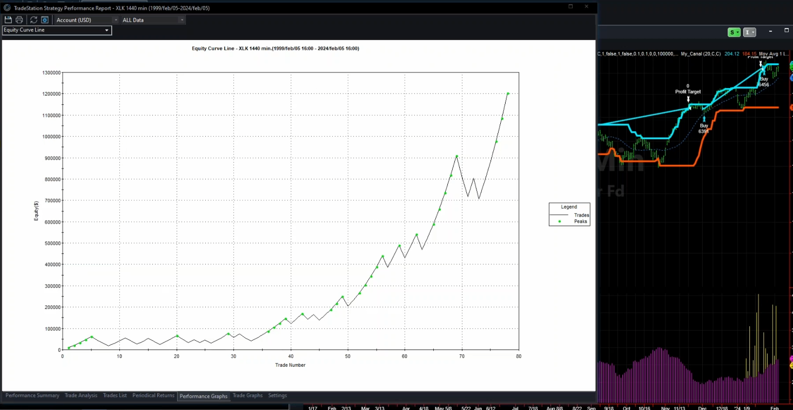
  <figcaption>Figura 26. Aplicación de la estrategia Donchian sobre XLK.</figcaption>
</figure>


<figure>
  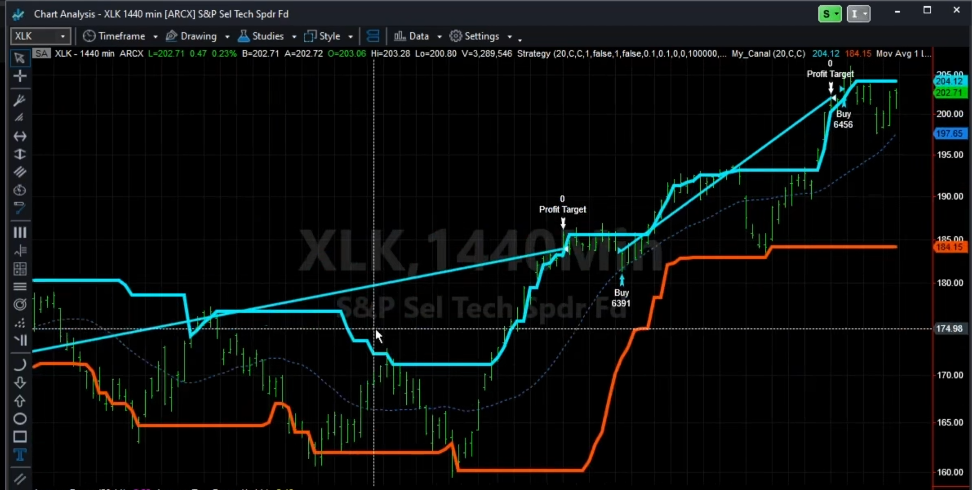
  <figcaption>Figura 27. Señales de entrada y salida por TP del 10 %.</figcaption>
</figure>

El Donchian original no define una salida precisa; muchos autores interpretan que la posición debe mantenerse **hasta una ruptura contraria**, lo que implica una salida muy tendencial.  
  
En cambio, aquí incorporamos una **salida por media central**, más reactiva.

<figure>
  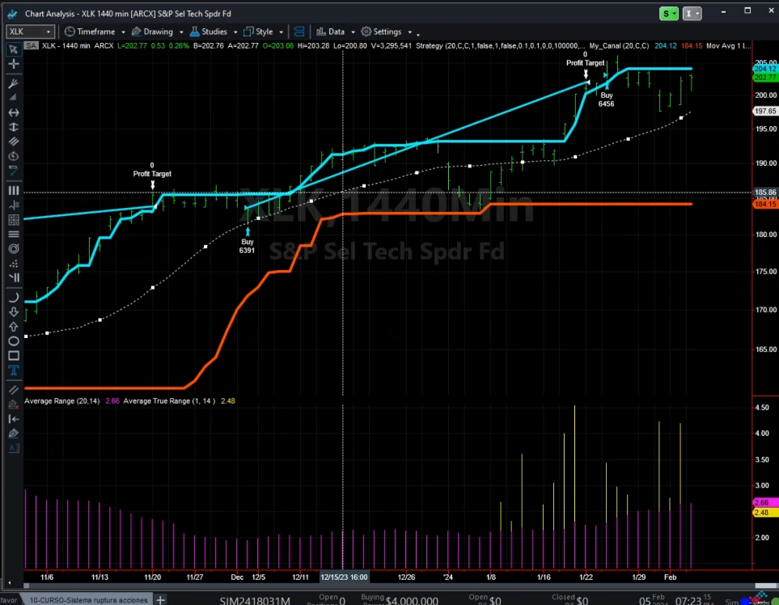
  <figcaption>Figura 28. Visualización de la media central como posible salida.</figcaption>
</figure>

<figure>
  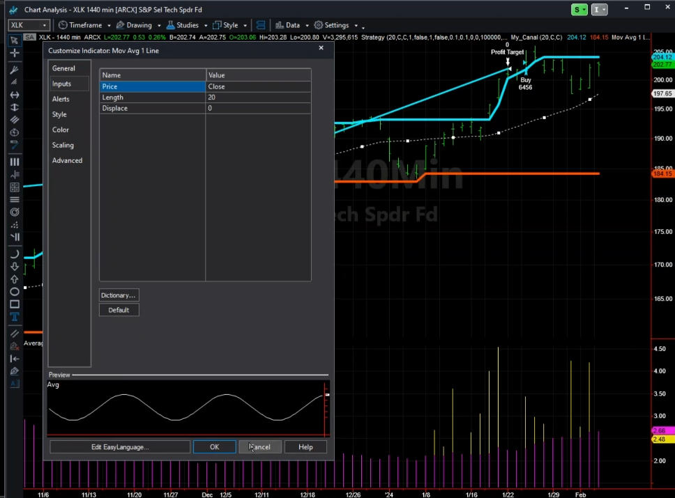
  <figcaption>Figura 29. Donchian con media de 20 cierres como línea de salida alternativa.</figcaption>
</figure>

Esta media blanca representa la media de los **20 cierres previos**, coincidiendo con el período del canal Donchian.

**Salida por media central 20 cierres previos con SL/TP 10%:**

```sh
input:
	Salgo_Media (false)
```
Este control booleano (`Salgo_Media`) permite **activar o desactivar** fácilmente esta regla desde los parámetros del sistema.

```sh
// salida por la media central del canal Donchian
If Salgo_Media Then
Begin
	If Close < Average(Close, Per_Canal) Then
		Sell next bar at Market;
		
	If Close > Average(Close, Per_Canal) Then
		Buytocover next bar at Market;
End;
```

Además también tiene metido el SL/TP 10% que se lo podría perfectamente quitar.

<figure>
  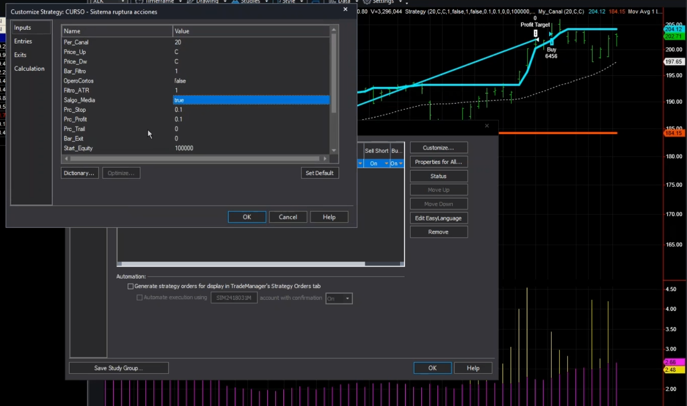
  <figcaption>Figura 31. Activación de la salida por media central (booleano True/False), con SL/TP 10%. </figcaption>
</figure>

<figure>
  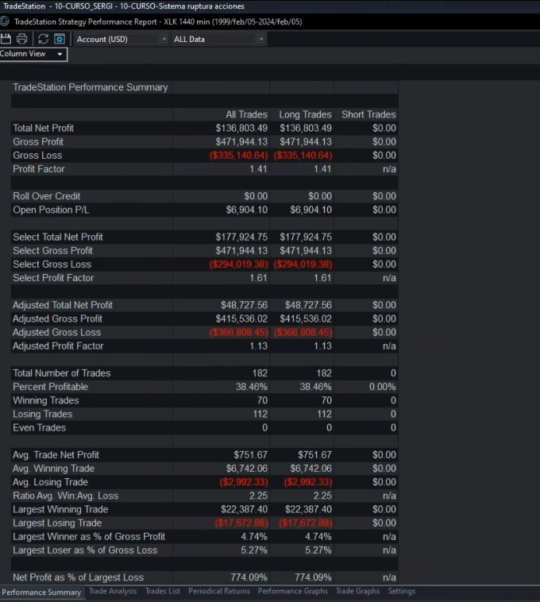
  <figcaption>Figura 31. Performance con salida por media central (booleano True/False) y con SL/TP 10%. </figcaption>
</figure>


---

**Salida Versión tendencial: por media central 20 cierres previos (sin TP/SL):**

Ahora desactivamos el Stop y el Take Profit (ambos a 0) para dejar que el sistema **siga la tendencia completa**.

<figure>
  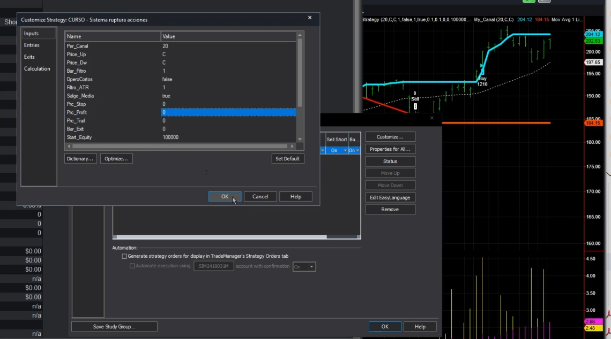
  <figcaption>Figura 32. Desactivación de Stop/Profit para comportamiento puramente tendencial.</figcaption>
</figure>

De este modo, las operaciones permanecen abiertas hasta que el precio **pierde la media central**, o bien se produce una señal opuesta. Esto permite capturar grandes tramos de tendencia, aunque también implica soportar retrocesos más amplios.
También `se podría poner en el lado corto`, veríamos como degrada mucho, pero puede hacerse. 

luego por supuesto todo esto lo evaluaremos ahora simplemente lo estamos planteando vamos planteando posibilidades posibilidades que son de donde las sacas pero estas las saco de la de la de la de la conferencia me dices hombre la entrada en este caso hay muchas que las sacaré completas de manuales ella ya hablo de este libro y veremos esto no es este libro bueno seguramente seguramente casi todos los libros manuales completos van de DONCHIAN'S y este libro habla de todos así ahora no recuerdo yo estoy seguro que habla de DONCHIAN'S es que entonces bueno no está sacado específicamente de él pero también está ahí están esos artículos que habéis visto stock&commodities está por internet vale pero DONCHIAN'S como tal no es un setup claro de entrada que tenga una salida pero sabemos que es una entraba tendencial la estamos probando en gráfico diario y por lo tanto pues al final puedo salir o bien no salir o bien no salir no salir por tp y poner solo stop o bien salir mediante alguna salida también un poco lenta como la media también podría probar y lo probaremos salir y habilito otra vez la salida esta no le meto el tp y le saco por esto de un 5% y ahora sólo va a salir si cae un 10%


#### Salida con Stop Loss y Trailing Stop

Otra variante que probamos consiste en mantener el TP deshabilitado y salir únicamente con **Stop Loss o Trailing Stop dinámico**.

<figure>
  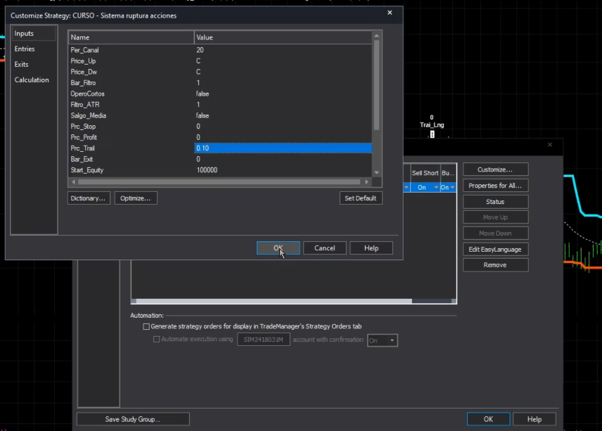
  <figcaption>Figura 33. Activación de Stop dinámico (Trailing Stop) con 10 % de SL</figcaption>
</figure>

Un *Trailing Stop* actualiza continuamente el nivel de salida a medida que la posición avanza a favor.
En el caso de posiciones largas, se mueve con el **High** (máximo alcanzado), restándole un porcentaje definido (por ejemplo, 10 %).
Esto permite capturar el movimiento principal y proteger beneficios sin salir prematuramente.

```sh
// Trailing Stop
If Prc_Trail > 0 Then
Begin
	If MP <> 1 Then
		Trailing_Long = 0;

	If  MP <> -1 Then
		Trailing_Shrt = 99999;
	
	Begin
		if MP = 1 then # Para posiciones largas
		begin 
    		Trailing_Long = maxList(Trailing_Long, High - (High * Prc_Trail));
    		Sell ("Trai_Lng") next bar at Trailing_Long stop;
		end;

		if MP = -1 then # Para posiciones cortas
		begin 
    		Trailing_Shrt = minList(Trailing_Shrt, Low + (Low * Prc_Trail));
    		BuytoCover ("Trai_Shrt") next bar at Trailing_Shrt stop;
		end;
	End;
End;
```

Así, el trailing protege beneficios acompañando el movimiento favorable del precio, sin reducir nunca la distancia una vez que el precio se aleja en contra.


Un 10% de SL es un trailing un poquito más holgado un poquito más holgado y de hecho en larga en tendencia larga hay muchos autores que hacen esto 20%

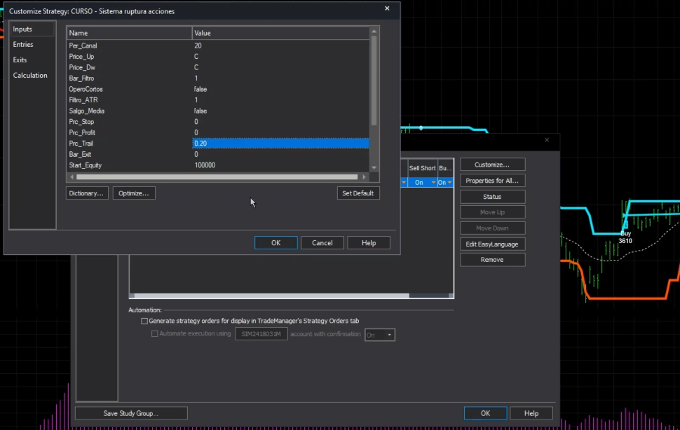

salen a 20% consideran que es una tendencia bajista y se salen a 20% de caída que es bastante pero como todo tiene su parte buena y su parte mala quiere decir que vas a devolver mucho al mercado pero te va a mantener tener dentro en las grandes tendencias la única manera de mantener las grandes tendencias es esa, pues es demasiado te va a dar un drawdown muy elevado pero como como vais a ver el retorno da muchísimo retorno es el que retorno da muchísimo retorno 

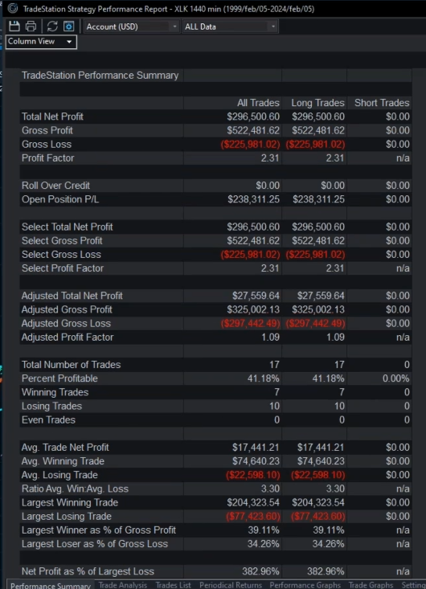

da profit factor de 2,31 sólo 17 operaciones pero al final pues se consigue subir 

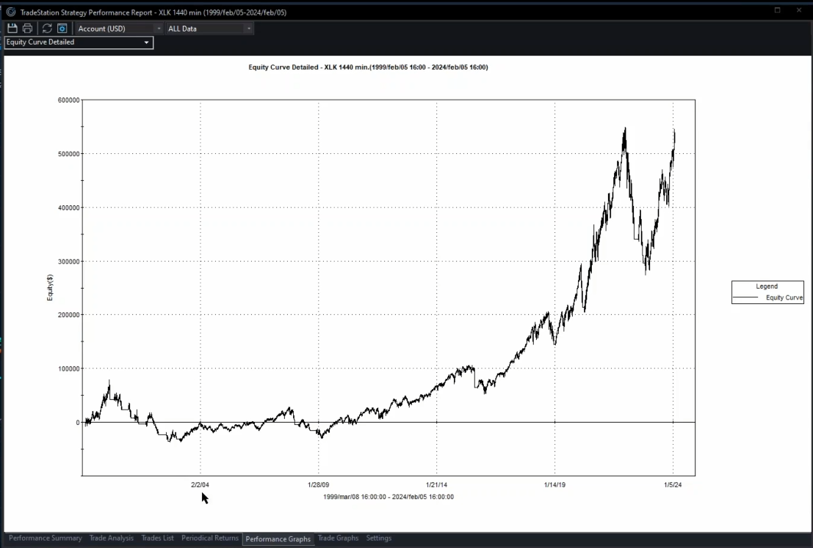

el problemas cuando hay toda esa costa de dada pues como vais a ver bastante elevados bastante elevados de 60 porcientos y demás 

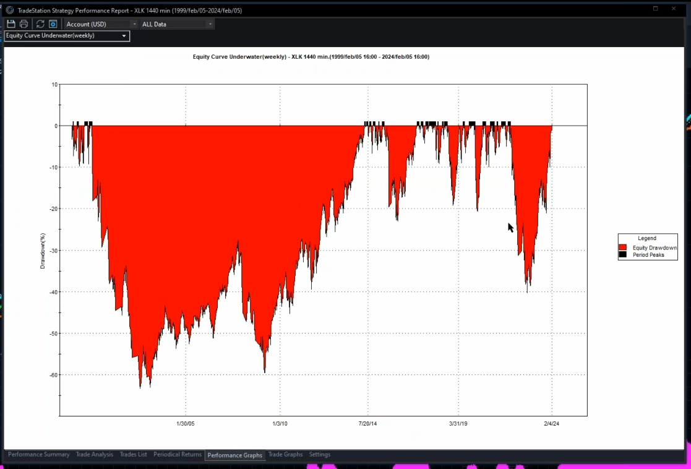

este es el ejemplo no tiene por qué ser en este caso tan extremo para nada para nada es recomendable así pero es el caso extremo de lo que os decía de tendencia así sí que voy a tendencia puro y veréis ahí que tengo un ratio de aciertos del 41% es ahora como es tendencial puro porque porque deja correr mucho los beneficios acierta 41 por ciento de las operaciones pero tiene un ratio avg loss de 3.30 espectacular muy elevado más de cada tres veces lo que pierde 

pero claro se deja mucho en el camino y provoca grandes riesgos.

> **nota** :
> Este se podría dejar como un setup de salida en tendencia y luego buscar uno más rápid,o 
> simplemente usar este bastante más acelerado como ya teníamos puesto por ejemplo la mitad en 10% 

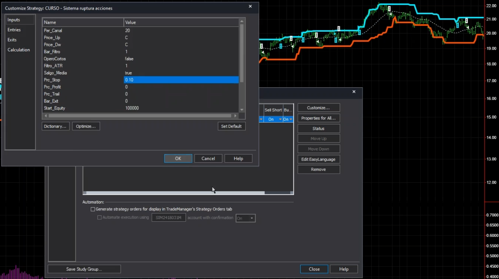


donde va a seguir siendo tendencial pero menos va a seguir siendo tendencial pero a ver qué va a estar ahí seguramente 45 por ahí quizás 

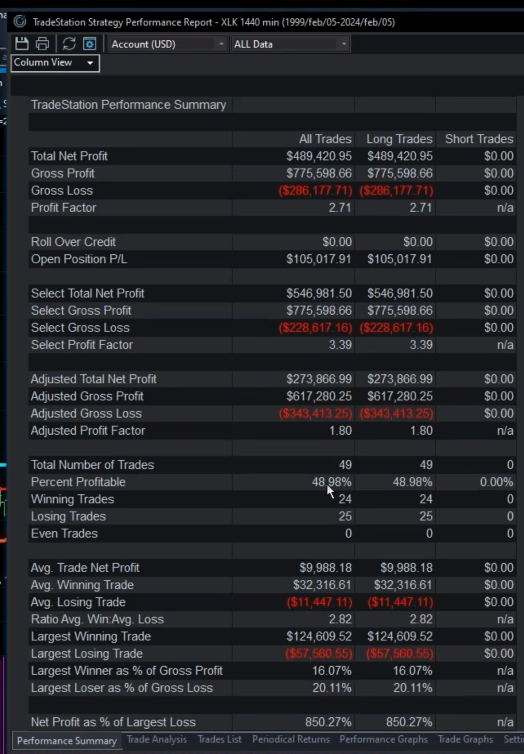


49% de profitable incluso se acerca bastante al 50 ya está casi equilibrado ahí en acierto con fallos pero con un average de casi 3 en 2.80 como veis un profit factor muy elevado ha bajado el drawdon prácticamente la mitad 

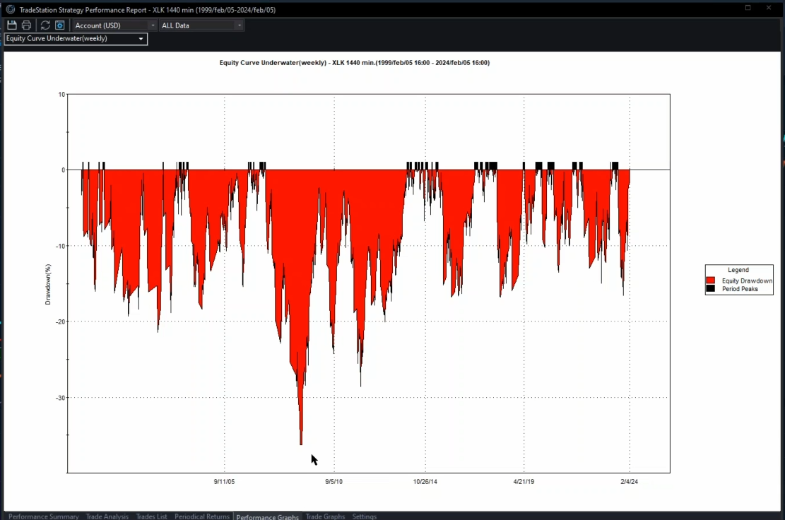

pero al final está controlando un poco mejor el riesgo. **esta es entraba DONCHIAN'S salida trailing nada más** nada más 


<div style="border-left: 4px solid #2980b9; background: #eaf3fb; padding: 10px 15px; margin: 10px 0;">
  <strong>⚙️ Nota de implementación</strong><br>
  <br>
  Este sistema, tal como está planteado, constituye un <em>setup</em> que probablemente —esto tendremos que evaluarlo— sería válido por sí mismo.  No me refiero necesariamente a esta configuración concreta de <em>inputs</em> de Donchian y <em>trailing stop</em>, sino al conjunto estructural del sistema.  Fijaos que, en este punto, estamos manejando esencialmente dos <em>inputs</em> principales. Hay más elementos, pero ahora mismo la atención se centra en esos dos.  
  <br><br>
  Si quisiéramos construir un <strong>mapa de optimización</strong>, lo haremos más adelante; no quería introducirlo todavía para mantener el enfoque conceptual.  
  En la próxima sesión, trabajaremos precisamente eso: veremos cómo plantear la optimización, cómo configurarla correctamente y cómo interpretar los resultados.  Hoy el objetivo era <strong>definir las variantes del sistema</strong> —dejarlas estructuradas— para que, en la siguiente fase, podamos analizarlas cuantitativamente.  
  <br><br>
  Este <em>setup</em>, con entrada por <strong>Donchian’s</strong> y salida por <strong>trailing stop</strong>, ya podría considerarse un <strong>sistema completo</strong>.  
  <br><br>
  A partir de aquí, el proceso consistiría en:  
  <ol>
    <li>Evaluarlo de forma preliminar.</li>
    <li>Verificar que tanto la entrada como la salida funcionan correctamente en distintos activos.</li>
    <li>Confirmar que el comportamiento mantiene coherencia (“cara y ojos”) en diferentes contextos de mercado.</li>
  </ol>
  <br>
  Una vez hecho esto, pasaríamos a analizarlo mediante una <strong>optimización controlada</strong>, permitiendo cierta oscilación en los parámetros.  
  Esto es importante, como expliqué antes, para observar cómo varía el rendimiento y poder construir un <strong>perfil o mapa de optimización</strong>, algo muy útil para comprender la sensibilidad del sistema.  
  <br><br>
  No es necesario usar la optimización para cambiar parámetros —por ejemplo, sustituir 20 por 18—; puede hacerse, pero no es su único propósito.  
  <br><br>
  <div style="border-left: 4px solid #f1c40f; background: #fff9e6; padding: 10px 15px; margin: 10px 0;">
  <strong>Recordad esta idea fundamental:  </strong>
  <br> 
  la optimización no sirve únicamente para elegir parámetros óptimos, sino para estudiar el comportamiento del sistema y analizar sus datos en profundidad.
</div>
</div>

Entonces, este sería un posible *setup*.  
En este caso, lo tengo cargado sobre un **SPDR**, que no deja de ser un índice.  
Podemos verlo también aplicado a otro activo dentro de este mismo *setup*, que —recordemos— es un sistema basado en **Donchian’s**. En los **ajustes (`Settings`)**, se observa lo siguiente:

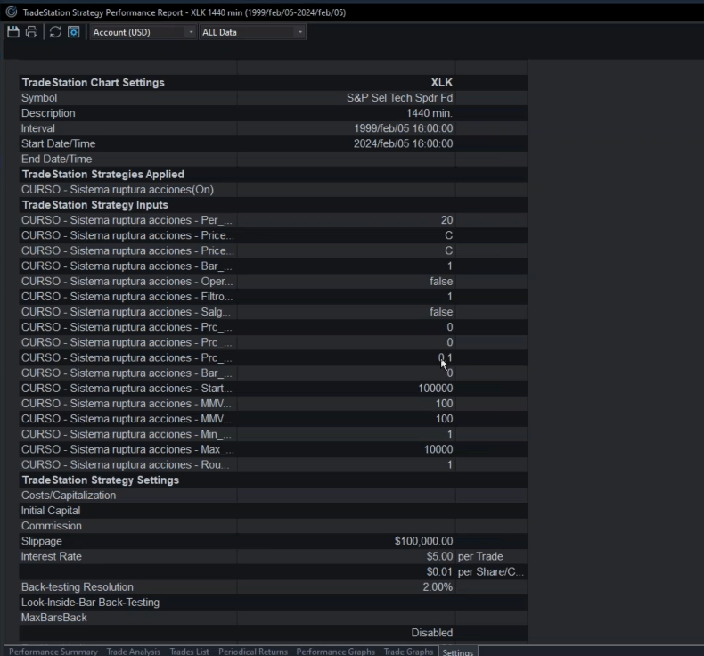

* **Donchian’s con cierres** (no con máximos o mínimos).
* **Salida por *trailing stop*** al **10 %** desde el máximo alcanzado durante la operación.
* **Exposición total (100 %)** del capital disponible.
* **Comisión simulada:** 5 USD por *trade* (coste estándar por operación).
* **Deslizamiento (*slippage*):** un *tick* añadido por operación.
* **Capital inicial:** 100 000 USD.
* **Gestión monetaria:** exposición calculada dividiendo el capital disponible entre el precio de cierre actual.
  Es decir, si la cuenta comienza con 100 000 USD, se divide esa cantidad por el precio de cierre para determinar cuántas acciones se pueden comprar.
  Este cálculo se actualiza dinámicamente en cada operación, de modo que siempre se utiliza aproximadamente el *100 % del capital* en cada entrada.

Este es, por ahora, el planteamiento de referencia.  
Más adelante revisaremos otras configuraciones, pero este punto de partida ya nos ofrece un *Profit Factor de 2.71*.
Por ejemplo, puedo aplicarlo al ETF `XLF` que es un activo muy líquido, con un volumen elevado y adecuado para este tipo de pruebas.

Mientras tanto, os comento las **otras variantes del código** (no activas en este momento).  Os comento porque este podría ser un setup? Podría serlo porque 

* estoy en un diario y sé que tengo seguramente pocos trades y, 
* por lo tanto, no quiero añadir demasiadas restricciones, demasiados filtros, 
* y no quiero, básicamente, complicarme la vida.  

Entonces, de entrada, quiero probar un setup muy básico y sencillo: si con él puedo ganar dinero y controlar el riesgo, vale.

**Enfoque tendencial**   
Partimos de un planteamiento *tendencial*:   si queremos capturar grandes movimientos, debemos *dejar correr los beneficios*. Y para dejar correr los beneficios, *no debemos cerrar por Take Profit*. El control del riesgo se realiza con un *stop dinámico tipo trailing*, que se mueve junto con el precio. Esto permite proteger las ganancias sin limitar el recorrido de la tendencia.

¿Podría usarse otro método? Sí: podría emplearse un `Parabolic SAR`, o un `trailing anclado a cierres`, o uno que solo devuelva un porcentaje de las ganancias desde el máximo. Existen múltiples variantes, pero esta versión —basada simplemente en el máximo y un porcentaje fijo— es *limpia, intuitiva y con un solo parámetro*: el porcentaje de distancia al máximo. Sencillo, claro, eficiente. La idea clave es esta: **las reglas deben ser simples**.  No es necesario construir un *trailing* con tres o más variables; solo complica el sistema sin aportar valor real.

Este tipo de salida podríamos haberla diseñado cualquiera, sin importar el nivel de experiencia.
La entrada procede de una fuente pública (revistas especializadas) y el *trailing stop* es igualmente estándar: ya está implementado como función nativa en la propia plataforma. Por eso, es una **salida muy sencilla y transparente**, perfecta para un primer *setup* robusto y verificable.

<br>

---

<br>

### 🟦 Aplicación práctica: Donchian en `XLF`

Seguimos con más opciones, ya me ha cargado el sector financiero `XLF` que es tremendamente volátil 

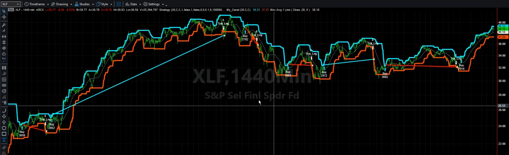

vale vamos a ver cómo queda con este mismo setup que tiene run-ups chulos con este 10% le da margen le da un margen interesante pero es aquí falsas entradas también que se las traga con patatas vale pero seguramente es bastante bastante profit 

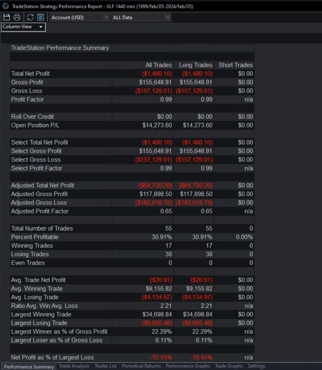

`no es profit`, no es porque mira que lo parece aquí seguramente es por la parte final 

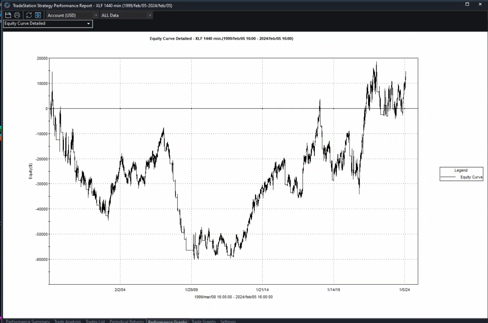

tiene un coste de comisiones muy elevado pero bueno se va adaptando se va adaptando el tema es que cuando compras muchas acciones que ahora te meten mucha mucha mucha slippage pero si si esta fase es tremendamente volátil que la caída se los traga se los traga todos 


### ¿que salidas hemos visto ya?

Bien, continuamos analizando las demás posibilidades. El otro día recordaréis que ya implementé la *salida por tiempo*, una opción que personalmente me gusta mucho. Sin embargo, si lo que buscamos es un *setup tendencial*, debemos asumir que no hay demasiadas alternativas: al final, hay que dejar correr el mercado y ver hasta dónde llega.

Las combinaciones posibles son limitadas, pero eso no es algo negativo. De hecho, *una de las ventajas de tener pocos parámetros —o casi ninguno— es que el sistema conserva un margen real de optimización y de elección*. Más adelante hablaremos en profundidad de los *grados de libertad*, pero por ahora basta con entender que cuantos menos parámetros intervengan, más fiable será la evaluación y más robusto el comportamiento del sistema.


**salida por un número n de barras**

```sh
// salida por tiempo, n barras
If Bar_Exit > 0 Then
Begin
	if MP = 1 and barssinceentry > Bar_Exit then
		sell("TimeL") next bar at open;
	
	if MP = -1 and barssinceentry > Bar_Exit then
		BuytoCover("TimeS") next bar at open;
End;
```

**¿Qué salidas hemos visto ya?**

`Bar_Exit (0)` ya la implementamos el otro día.  
En esta sesión hemos visto:  
`Prc_Stop (0.00)` – porcentaje de stop  
`Prc_Profit (0.00)` – porcentaje de profit  
`Prc_Trail (0.20)` – porcentaje de trailing stop  
`Salgo_Media (false)` – salida por la media central  

La *salida por la media central* está actualmente activada.
Esta salida utiliza la *media central del mismo período que el canal de Donchian*, es decir, calcula la media de los últimos *n* cierres (por defecto, 20).

---

### salida en el canal contrario

También podríamos haber definido una *salida en el canal contrario*, una alternativa más de largo recorrido.
Esa opción, de hecho, ya está implementada, porque *TradeStation* permite hacerlo de forma muy sencilla gracias a su estructura de programación.

Ahora vamos a activar los *cortos*:

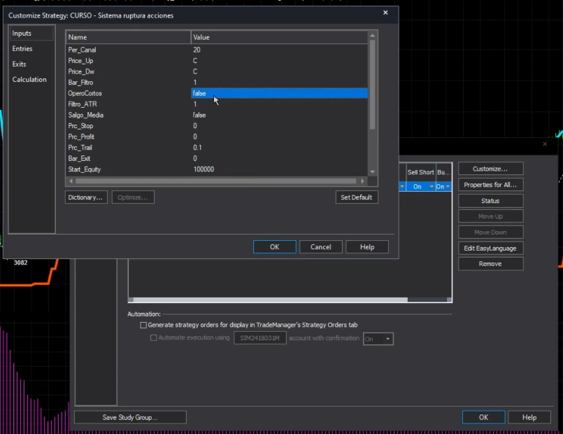

Para ello, contamos con una variable booleana (`OperoCortos`) que controla si el sistema puede o no abrir posiciones cortas.
Al establecerla en `true`, el sistema podrá operar también en corto.

Sin embargo, podemos hacer algo interesante: *usar la señal del corto para operar en largo*.
Es decir, aunque el sistema detecte una señal bajista, podemos reinterpretarla para entrar en el lado opuesto.
Esto permite estudiar cómo se comporta la estrategia al *invertir las condiciones de entrada*, aprovechando las rupturas en dirección contraria.

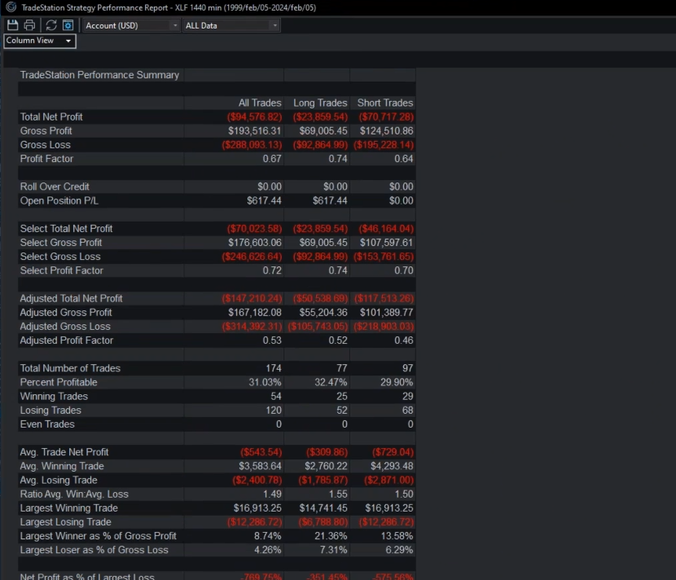

Como se ve, el corto aún rinde peor que el largo, lógicamente, pero lo que voy a hacer es que la regla del corto y el `sell short` se usen solo para *exit only*.

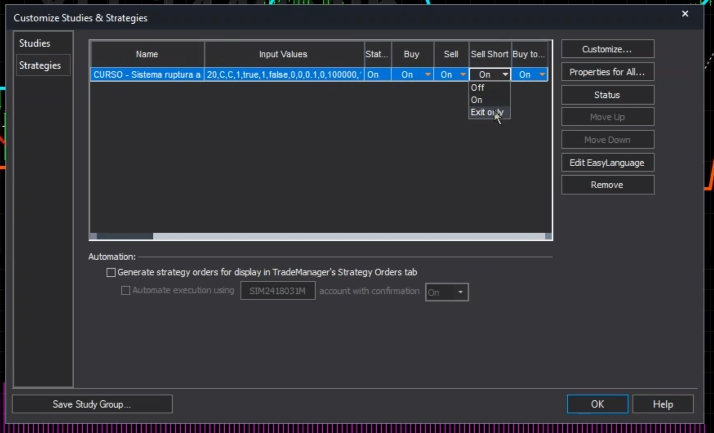

De esta manera, la regla del corto se utiliza para cerrar, junto con el stop correspondiente.
Así, en el momento en que se produce una ruptura por la banda inferior, la posición también se cierra —además del trailing que tenga activo—.

El trailing podría eliminarse, y ese sería el caso extremo: entrar largo por la banda superior y salir únicamente por la inferior.
Esa sería *la versión más tendencial de todas*, porque, cuando el sistema entra en una tendencia fuerte, tarda mucho en cerrar por debajo del canal.

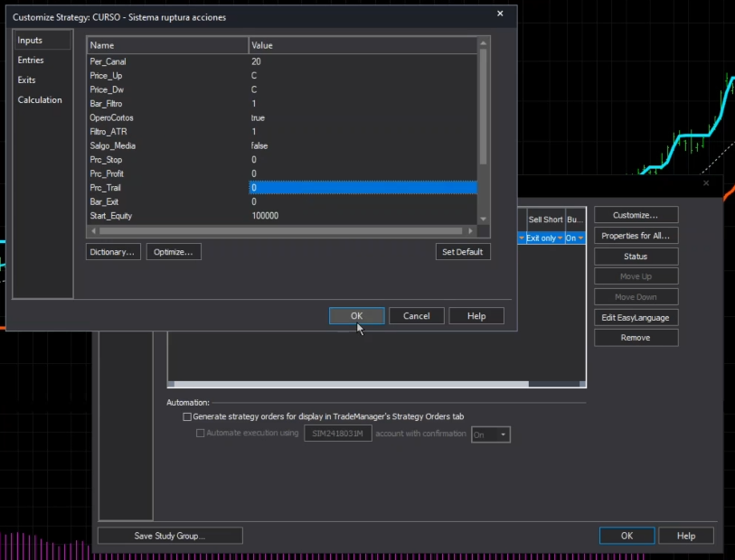
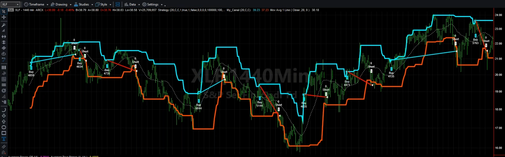

Aun así, sin *take profit*, obtiene 41 aciertos, pero no genera beneficios, probablemente por un conjunto de comisiones elevadas.

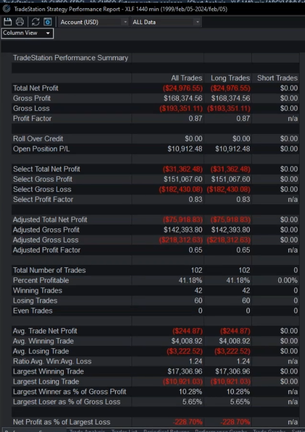

En la primera parte del histórico, se hunde durante 2008–2009 —la crisis de Lehman Brothers—, donde realiza muchas entradas durante la caída que no consigue evitar.
Esa es la clave de cualquier sistema: *no va a ganar dinero en mercados hostiles, pero tiene que sobrevivir*.
En esta versión, no lo logra del todo: después tiene buenos momentos, pero no logra compensar las pérdidas anteriores.

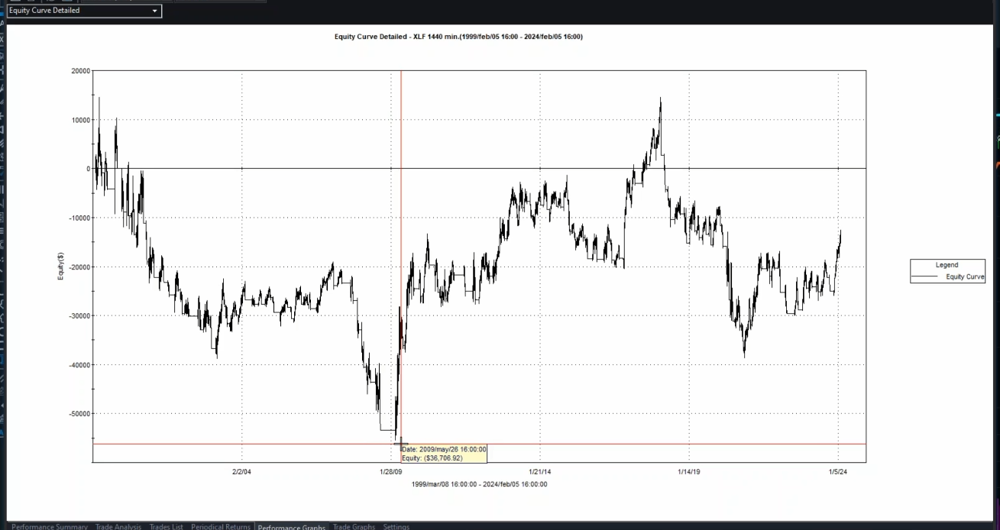

<div style="border-left: 4px solid #f1c40f; background: #fff9e6; padding: 10px 15px; margin: 10px 0;">
<strong>Regla fundamental:</strong><br>
Evitar el daño en mercados adversos.  
<br><br>
Esa es la esencia de cualquier sistema robusto: no tiene por qué ganar dinero en todo tipo de entornos, pero debe ser capaz de resistir y preservar el capital cuando las condiciones del mercado son desfavorables.
</div>
<br>
<div style="border-left: 4px solid #2980b9; background: #eaf3fb; padding: 10px 15px; margin: 10px 0;">
  <strong>Composición global del portafolio:</strong><br> 
  Podría convertir el sistema en una versión no puramente tendencial, es decir, una variante que no busque capturar toda la tendencia completa. 
  Este enfoque puede tener mucho sentido en determinados contextos, especialmente desde una perspectiva de cartera.
  <br><br>
  Recordad que, al final, <em>todo depende de la composición global del portafolio</em>.  
  Si mi cartera ya cuenta con suficientes sistemas tendenciales, quizás me interese introducir un modelo 
  <em>más equilibrado o mixto</em>, uno que mantenga un comportamiento intermedio —por ejemplo, con una tasa de acierto más cercana al 50 %— 
  y que <em>no asuma el mismo nivel de riesgo</em> de dejar correr tanto las operaciones.
  <br><br>
  También puede ocurrir lo contrario: si tengo demasiadas estrategias tendenciales, añadir un sistema más 
  <em>estable o de reversión parcial</em> puede ayudar a <em>diversificar el perfil de riesgo</em>.
  En ese caso, el objetivo sería construir un sistema <em>semi-tendencial</em>: uno que siga operando rupturas de tendencia, 
  pero que <em>no persiga extenderlas indefinidamente</em>, sino capturar solo una parte del movimiento, 
  aportando así mayor estabilidad al conjunto de la cartera.
</div>

Volviendo al resto de las salidas vistas hasta ahora:

`Bar_Exit (0)` – salida por tiempo (ya implementada).  
`Prc_Stop (0.00)` – salida por stop-loss porcentual.  
`Prc_Profit (0.00)` – salida por take profit porcentual.  
`Prc_Trail (0.20)` – salida por trailing stop porcentual.  
`Salgo_Media (false)` – salida por la media central.  


### Combinación práctica de salidas: media, tiempo y stop porcentual

...entonces vamos a desactivar los cortos; lo voy a dejar así para que salga por la media, va a salir por el `true`.
Le pongo que, como mucho, esté por ejemplo 10 días, y que salga por la media.

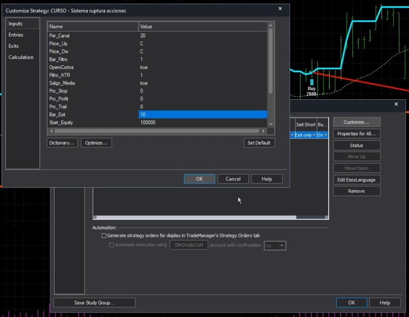

Y entonces, pues bien, sale o bien por la media o bien tras 10 días.
En este caso, esto no tendría mucho sentido; tendría más lógica usar *una u otra* —o bien la salida por la media, o bien la salida por la banda—, pero no ambas simultáneamente.
Por ello, anularía la salida por cortos (que activa la media y la banda contraria) y podría añadir un *stop* del 5 % para movimientos más rápidos.

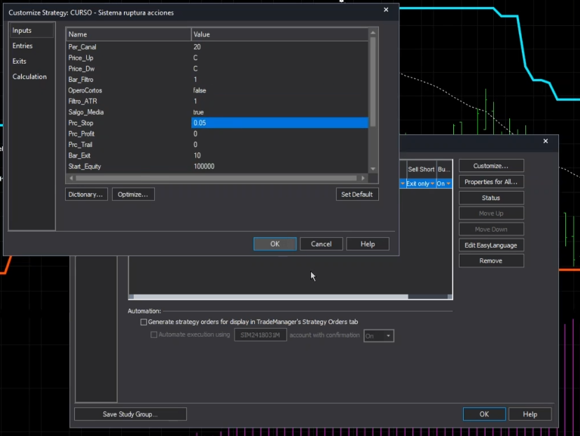

En resumen: *salgo por tiempo o por pérdida del 5 %, o por la media; no salgo por el canal contrario.*
Vemos que se trata de un *setup muy distinto*, realmente un sistema que permanece poco tiempo en el mercado y busca *entradas rápidas y de corta duración.*

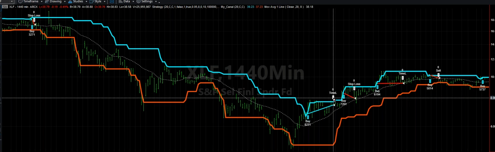

Incluso aquí tendría más sentido, porque ya estoy fijando un tiempo de salida.
Además, voy a añadir un *profit target*:

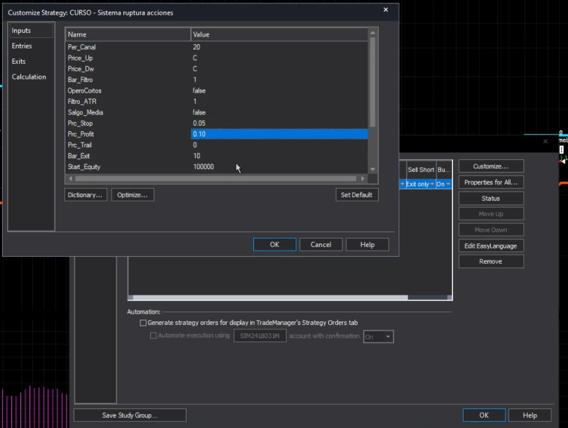

En este caso, usaré un ratio 2:1 —*profit* de 0.10 y *stop* de 0.05—.
Más adelante explicaré otra cosa que solemos hacer: relacionar ambos, de forma que uno sea múltiplo del otro (por ejemplo, *1:1 o 2:1*).
Así, tengo 0.10 de *profit*, 0.05 de *stop*, y desactivo la salida por media y por tiempo.

Esta es una configuración bastante habitual: una *combinación de stop, take profit y límite temporal*.
Es decir, si ninguno de los dos primeros se activa en un número determinado de barras, la operación se cierra igualmente.
Es una estructura muy común en sistemas *de rotura rápida o momentum*, donde el objetivo es capturar impulsos breves.

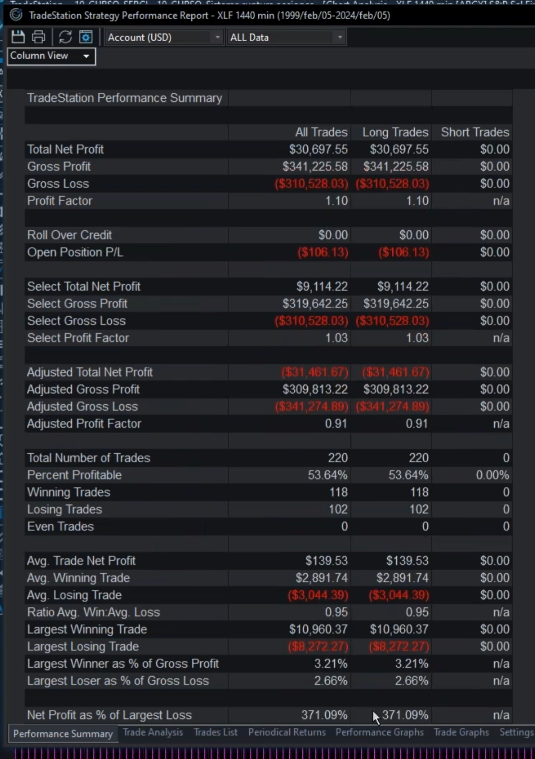

Con este enfoque, el sistema mejora ligeramente: aguanta mejor los periodos adversos, aunque sigue mostrando debilidad estructural, especialmente en el ETF financiero.

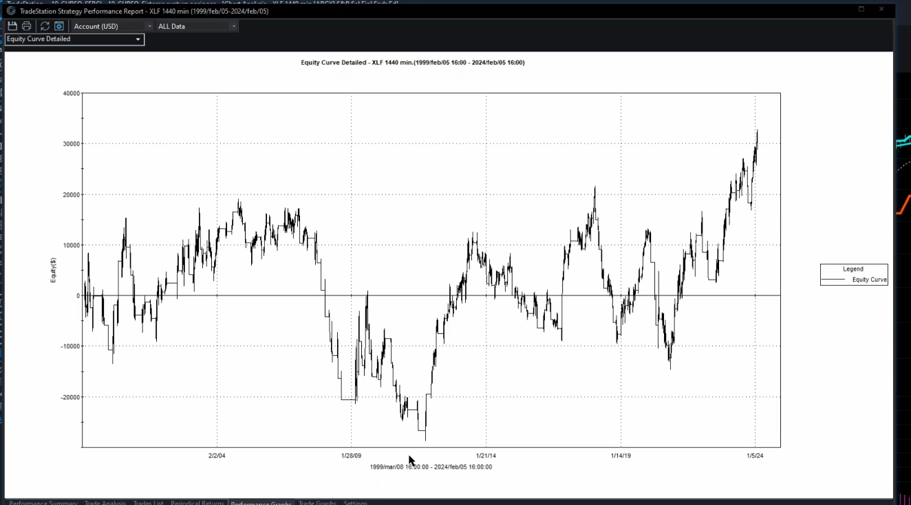


### Filtros de entrada

En este mismo *setup*, para no complicar demasiado la explicación, repasaremos algunos posibles filtros de entrada.

#### Filtro que evita reentradas inmediatas `Bar_Filtro`

El primero es un filtro diseñado para evitar que ocurra lo que se observa en la imagen: una *reentrada inmediata* tras una salida.
Es decir, una vez que el sistema cierra una operación, debe esperar un número determinado de velas antes de volver a entrar.

Esto tiene bastante sentido, ya que, sin ese control, el sistema podría caer en un bucle de entradas y salidas continuas, generando ruido y sobreoperación.
Este filtro se gestiona mediante la variable `Bar_Filtro`.

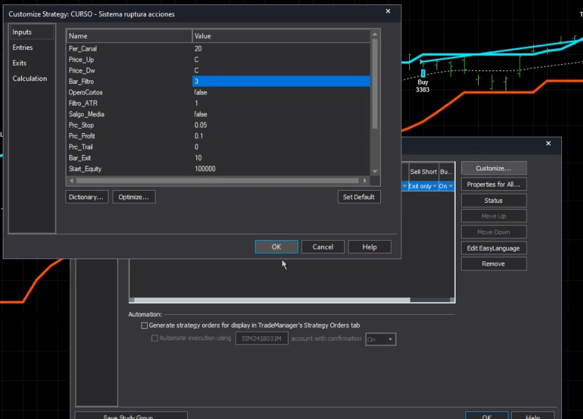
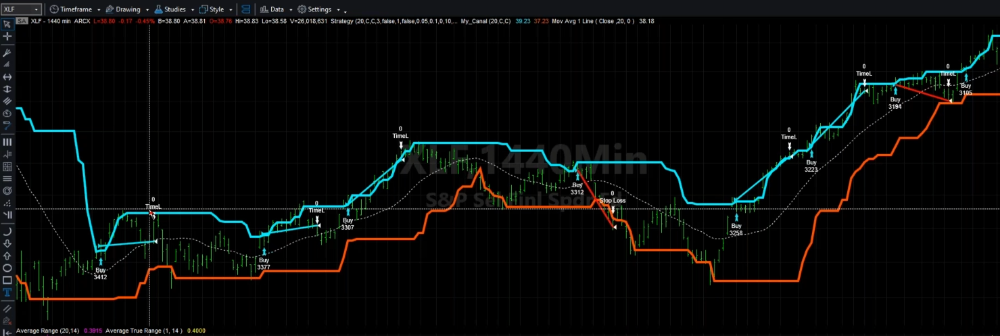

Ahora, como se observa, el sistema espera al menos tres barras antes de permitir una nueva entrada.
Este tipo de filtros es habitual y recomendable, especialmente para quienes programáis estrategias: evita que un sistema entre y salga en la misma vela, lo cual no tiene sentido operativo.
Una buena práctica consiste en establecer siempre una condición mínima de espera entre operaciones, utilizando `BarsSinceExit`.

```sh
// TÍPICO SISTEMA DE RUPTURA: el cierre supera el máximo del cierre de 20 barras
if Close > 0 and Condition1 and MP <> 1 and (BarsSinceExit(1) >= Bar_Filtro or TotalTrades = 0) then
Begin
	if Close > Highest(Price_Up, Per_Canal)[1] then
 		Buy Contratos contracts Next Bar at Market;
End;
```

El fragmento `or TotalTrades = 0` asegura que la condición también se cumpla si el sistema aún no ha realizado ninguna operación.
La variable `TotalTrades` cuenta el número total de operaciones cerradas y permite controlar la lógica del sistema desde el inicio.
Es un filtro menor, pero útil para garantizar la coherencia de la secuencia de operaciones.

#### Filtro de volatilidad

El siguiente filtro es algo más elaborado y, de hecho, uno de los más importantes.
Ya hemos mencionado en la parte teórica que *la volatilidad es uno de los vectores más potentes* tanto para operar como para gestionar el riesgo y ajustar la exposición monetaria.
Puede utilizarse como filtro, como medida de gestión o incluso como componente principal de una estrategia.

En este caso, todavía no se ha implementado, pero podría incorporarse fácilmente una condición basada en volatilidad: por ejemplo, exigir que la vela actual sea *más o menos volátil que las anteriores* antes de permitir una entrada.
Este tipo de filtros ayudan a calibrar las condiciones del mercado y a evitar señales falsas durante fases de compresión o exceso de ruido.

#### Filtro basado en tipo de precio

Además, conviene recordar que el *canal de Donchian* puede construirse de varias formas según el tipo de precio que se utilice para calcularlo. Hasta ahora hemos visto la versión donde la condición de entrada se cumple cuando *el cierre supera el máximo de las últimas n barras*.  

Sin embargo, existe otra variante igual de válida:

```sh
// Buy Contratos contracts Next Bar at Highest(Price_Up, Per_Canal)[1] stop;
```

En esta alternativa, la orden de compra se coloca directamente *en el nivel del canal superior* —es decir, en el valor de `Highest(Price_Up, Per_Canal)[1]`— sin esperar a que el cierre lo supere.
De esta forma, el sistema mantiene una *orden stop activa en el canal* durante todo el tiempo, esperando que el precio la ejecute cuando se produzca la ruptura real.

La diferencia es conceptual:

* En la versión anterior, el sistema necesita *confirmación por cierre*.
* En esta, el sistema actúa *de forma anticipada*, ejecutando la entrada al tocar el canal.

Ambos enfoques son válidos, y la elección depende del tipo de sistema que se quiera construir: uno *más conservador y reactivo* (por cierre confirmado) o uno *más agresivo y anticipativo* (por ruptura intrabarra).


Todo el rato la orden es la línea la línea azul hasta que entra luego ya no. 

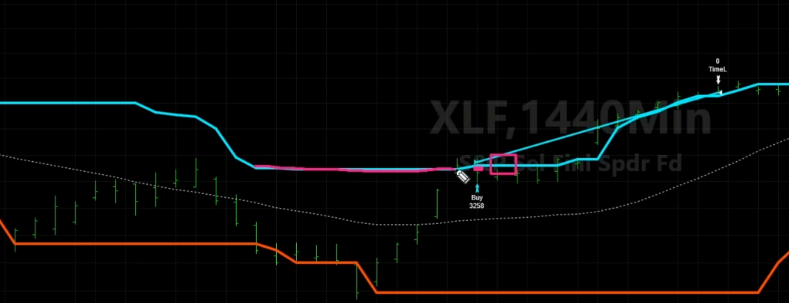

es otra posibilidad es una posibilidad que opera más más rápida con más fallos a mí me gusta bastante así como está como está puesta ahora pedirle un cierre por encima pero es depende es depende realmente. de hecho lo que os decía lo que os decía antes va todo un poco relacionado y lo que también lo dije en las prácticas esto es verdad que se cultiva con la experiencia en el sentido común que muchas veces ya digo se cultiva mucho con la con las experiencias en experiencia es complicado tener sentido común en algo porque al final se va adquiriendo por propia experimentación 

en lo que os decía antes de los cierres en relación al gráfico diario y demás en el gráfico diario así que yo creo que creo no creo que nos gusta más esta manera que hemos planteado aquí es decir que cierre por encima de la banda pero en entraría entraría seguramente iríamos más a directamente al canal. contando que te vas a quedar dentro o sea que vas a salir al final del día de acuerdo como máximo en el que buscas una explosión que buscas una explosión ahí sí ahí sí que entonces todavía es más será más importante filtrar 

pero es verdad que cuando vas a la intradía sobre todo si vas a timeframes cortos filtrar ya no es tan problema y tal puede ser un problema puede serlo porque si yo tengo solo 200 operaciones filtrar empieza a ser complicado por el número de por el número de tres que voy a obtener porque al final filtrar quita trades y es muy fácil caer una sobreutilización es tan fácil que casi es mejor es más recomendable no hacerlo no no no filtrar 

pero si yo me voy a entraría esto la tortilla se gira mejor tengo mil trades o tengo quinientos trades o tengo dos mil trades tengo mil bueno si filtro me quedo con 600 700 si no tengo tampoco muchos inputs probablemente puedo conseguir a un sistema robusto con esas cifras entonces cuando yo me voy a entraría a filtrar ya no es tan problema entonces ahí sí que a lo mejor iría más al stop directo pegado a la banda pero a ver qué filtro usaba para entrarle más en unas notas pero al cierre en gráfico diario quizás mejor así como se ha planteado es decir pedirle que haga un cierre por encima de la barra al final estoy confirmando que el precio rompe una secuencia de máximos. 

podría pedirle más cosas podría pedirle dos cierres si quisiera por código podría programar que fueran dos cierres o podría programarle ese es un filtro bastante bastante interesante y que hemos de hecho usado hacerlo todavía más conservador pero aquí ya digo no tenemos muchos trades pero si tú lo necesitaras podrías pedirle que toda la vela estuviera por fuera es tremendamente exigente y con un canal de venta seguramente tendría que ser un canal más corto nos va a costar mucho conseguirlo nos va a costar mucho conseguirlo que toda la vela cierre por encima del canal vale esto es más típico con con medias o con bandas de bollinger de acuerdo pero con un canal de DONCHIAN'S es complicado conseguirlo puede ser o que al menos que el cierre y el cierre lo es el mínimo también buscar varios varios campos o alguna cosa de este tipo alguna cosa de este tipo pero ya digo con bandas muy lentas es muy difícil con bandas muy lentas es muy bueno 

**atr**

entonces volviendo ya explicado la otra opción de la del DONCHIAN'S de acuerdo que siempre decido ir contra la banda de acuerdo contra la banda en stop vamos a ver ahora la otra era un filtro de volatilidad de acuerdo que para eso está puesto este atr, los sistemas de breakout vale los sistemas de breakout o sea vamos a ver en la volatilidad donde tengo yo mis notas 

la única diferencia entre el range y el true_range es que el range es el rango de toda la vela sin contar el gap anterior, es decir, high menos low, eso es el range, high menos low, y el true range es el high menos low, pero si hay gap cuenta el close anterior, ¿se entiende? se entiende un poco la idea, es decir, o sea, el range,  el range es esto, ¿ves? high menos low, el true range en cambio, el true range, bueno, es el true high menos el true low, es más fácil en el que tengo yo, es más fácil en el, y esto es exclusiva, el normalizado, ¿qué hace eso? normalizado, que esto es nuestro, esto es, 

```sh
var: double NATR (0); 
NATR = List(H) - L, C[1] - L, H - C[1]) / TypicalPrice * 100;
NormalizedTrueRange = NATR
```
lo único que lo dividimos por typical price, como yo os había dicho antes, pero es el mayor de tres, el high menos low, que eso sería el range, pero también el cierre anterior menos el low, o el máximo anterior menos el cierre anterior, este es el valor del true range, esto ahí en código supone lo que os he dicho, que es la diferencia entre el máximo y el mínimo, pero tiene en cuenta el cierre anterior, para restarlo a bien el high o bien el low, o bien el low, entonces cuando haya un gap lo considera, es decir, donde se ve muy claro, por ejemplo aquí, mirad, 

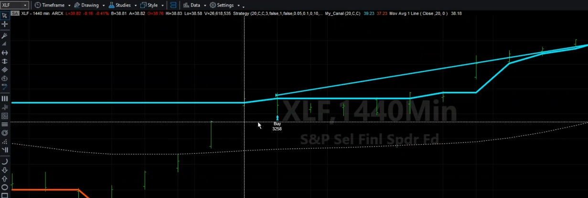


el true range de esta vela es la diferencia entre el máximo y el cierre, en cambio la del range sigue siendo solo el máximo y el mínimo de esta vela, entiende, ¿verdad? el máximo menos el cierre es el true range, el máximo menos el low es el range, esa es la única diferencia entre el range y el true range, entonces se puede hacer el average true range y el average range, porque es el average de los distintos range o el average de los distintos true range, , En la imagen, esto no es más que uno encima del otro, porque eso al final lo que relaciono es la volatilidad de la vela actual con relación a la volatilidad anteriores, de acuerdo, 

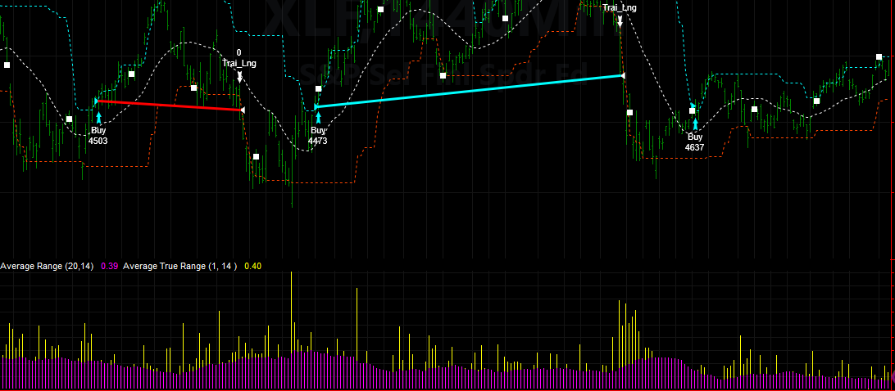


esto es un filtro que al final busca una cosa que a veces es contraintuitiva, sabéis que la volatilidad, la volatilidad es totalmente círclica, aquí se ve realmente con bastante claridad, voy a ocultar ahora el de uno, voy a ocultar un momento el de uno para explicaros esto, para explicaros esto, luego lo vuelvo a poner, la volatilidad es cíclica, de manera más, hay activos que más, activos que menos, al final esto es un índice, pero es financiero, que está bastante sometido a una época concreta, 

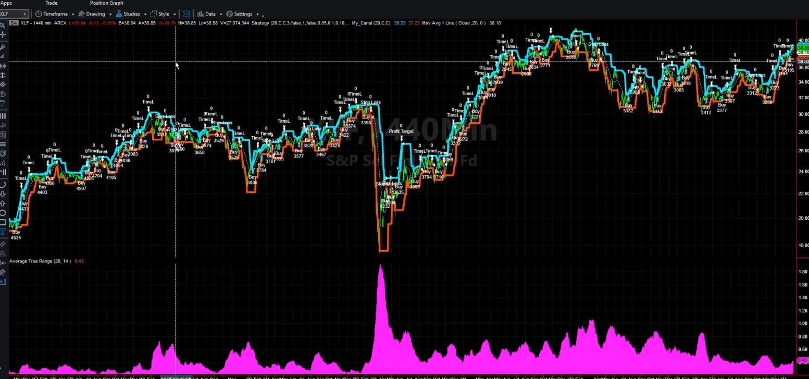

y de hecho aquí no lo vemos del todo bien, lo vais a ver mejor en el que tenemos nosotros el normalizado, en este se ve muy bien, lo voy a poner para verlo, luego lo quitaremos, luego lo quitaremos, este ahora lo voy a ocultar también para verlo mejor, que me interesa explicaros esto, que es de concepto, aquí se ve un poco mejor, este gráfico está bastante roto, no roto porque esté roto, sino porque al final tuvo unas volatilidades tan brutales, y casi no hay nada comparable a ello, pero bueno, la volatilidad como veis es bastante cíclica, hay momentos que entra como veis en momentos de mucha volatilidad, luego de poca, entonces es bastante cíclica, creo que se ve bastante claro, tiene sus picos del 8 a 9, que son bastante bestias, y esta rayita que veis es el 2,03%, no sé si se ve bien, es un media histórica, pero es la media histórica de este concreto que es el sector financiero, 

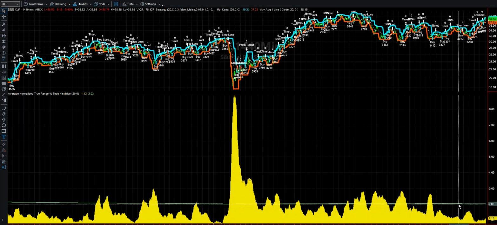

entonces al final los sistemas breakout, que es lo que estamos buscando ahora, y esto aplica más a los breakouts que a los tendenciales, es decir, aquí como es un breakout lo he aprovechado para explicaroslo, pero sinceramente aquí no creo, no creo que lo podamos aplicar por lo que os decía, primero porque conceptualmente es un poco más dubtoso, más dudoso, tiene un pequeño matiz, ahora os lo explico, pero sobre todo por lo que os decía antes el número de trades, que vamos a tener que juntar activos, va a ser más complicado, no digo rotundamente no, pero digo que es más difícil y más arriesgado, cuando vamos a sistemas diarios, y ya no te digo semanal o mensual, 

entonces conceptualmente ¿por qué? porque al final el sistema breakout, donde es ideal, es lo que os decía en los temas intradiarios, por ejemplo, este mismo sistema, que ya lo veremos más adelante, cojeremos este mismo y haremos estas pequeñas modificaciones que hemos hecho para intradiar, lo probaremos en intradiar, por ejemplo, lo podemos probar por ejemplo en el oro, un activo tendencial, en el petróleo, lo probaremos los dos, trataremos de sacar, a ver si lo sacamos, un donchian que nos funcione en el oro y en el petróleo, pero lo buscaremos como breakout solo, no como tendencial, aquí ahora hemos partido tendencial, estamos viendo todas las posibilidades, pero como os he dicho para el día siguiente lo trabajaremos sobre todo como tendencial y trataremos de evaluarlo como tendencial. 

Si fuera breakout, volatilidad y breakout, entonces la diferencia principal entre un tendencial por volatilidad y breakout es simplemente que el volatilidad y breakout le busco cerrar pronto, es decir, busco una explosión de volatilidad, la cojo y me voy para casa, deacuerdo, eso es un poco planteamiento, en cambio el tendencial busca largas tendencias, por lo cual necesita activos con buena tendencia, que las acciones no es el mejor, de hecho este sectorial va mal porque como veis aquí simplemente no hay tendencia, es decir, el gráfico está en el mismo sitio, estos son años y está en el mismo sitio, 

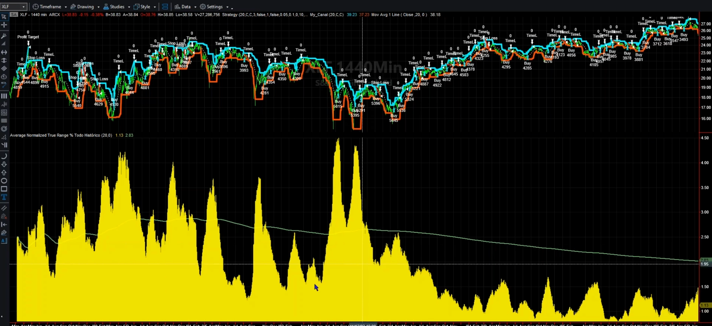

al final gana algo de altura, pero realmente no tiene nada que ver, como habéis visto en la tecnología, dejaros el precio arriba, está en 38 y al principio del gráfico está en 19, ni tan solo ha doblado en años, es el 2000, cuando habéis visto el nasdaq apple que estaba por debajo de uno y estaba en 300, pero es claro, le cuesta porque buscamos tendencia en algo que no tiene tendencia, entonces claro, pero es al olmo, eso es lo primero, trabajar en mercado que funciona, pero bueno, se ha querido probarlo porque ya sabía que era hostil, quería verlo, 


a lo que iba, entonces en un volatilidad y breakout al uso yo busco una explosión de volatilidad y cuando se da una explosión? como la volatilidad cíclica, cuando es más probable que haya una explosión o que haya una rotura que sea buena, es tras un periodo de contracción, tras un periodo de contracción, por lo tanto a mí, contrariamente a lo que defienden muchos manuales, que defienden que las roturas tienen que ser con volatilidad, bueno, es que sí que tiene sentido el concepto de que tiene que ser con volatilidad, pero realmente tienen que ser en un momento donde la volatilidad no sea alta, en un momento donde la volatilidad no sea alta, porque si la volatilidad ya es alta es probable que el movimiento ya se haya dado, por esto os decía que es más dudoso y más contradictorio con un tendencial, porque un tendencial por definición entra tarde para salir aún más tarde, es decir, un tendencial entra cuando hay tendencia y ahí sí que es más dudoso y puede ser que entres en un inicio de una tendencia que empiece una expansión de volatilidad y acabe siendo buena tendencia, pero no en un volatility breakout que lo que yo busco es una expansión de volatilidad, si la expansión de volatilidad ya se ha producido es señal de que probablemente el mercado ya ha desarrollado un movimiento tendencial y por lo tanto nuestra configuración probablemente será menos eficaz, 

así que es en las fases de contracción de la volatilidad cuando el mercado aún no ha desarrollado el movimiento, ahí es donde sí que yo sé que no ha desarrollado el movimiento y por lo tanto lo aunque pueda parecer contraintuitivo en un volatility breakout que no es exactamente este, eso es diario lo que explicaba ahora, aprovecho para introducirlo porque como os digo la principal diferencia entre un volatilidad y un tendencial prácticamente es las salidas, la entrada puede ser igual, la entrada puede ser igual, por eso lo explico aquí cambiaría bastante la salida, 

entonces aquí veis un poquito el ejemplo que os digo, 

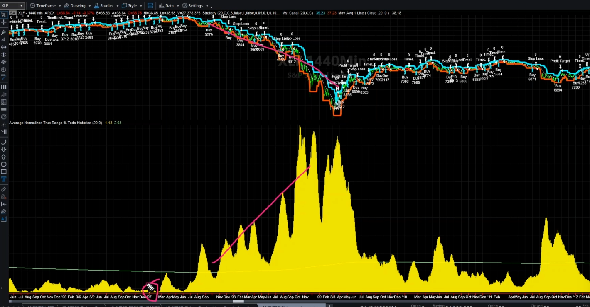

aquí yo tengo una clara tendencia y viene acompañada de una clara subida de volatilidad, entonces me puede decir hombre pero sí pero aquí todavía queda mucha tendencia, bueno sí claro esto una vez visto todos listos claro pero es verdad que ya se ha desarrollado el movimiento, en tendencia tendría sentido pero si yo busco explosiones es más probable que hayan explosiones en la parte del circulo que aún no se ha dado, es decir en el circulo bajo que en el circulo segundo más arriba donde ya se dio la explosion. . se entiende eso es un poco el concepto 


y por lo tanto os puedo asegurar que los volatility breakout como funciona mejor es con filtro de volatilidad que detecte cuando es baja en relación a la histórica ¿y cómo podemos implementar esto? pues realmente muchas maneras como casi todo el concepto este es el concepto de acuerdo el concepto es yo en un volatility breakout me interesa más entrar aquí a lo ideal es aquí, 

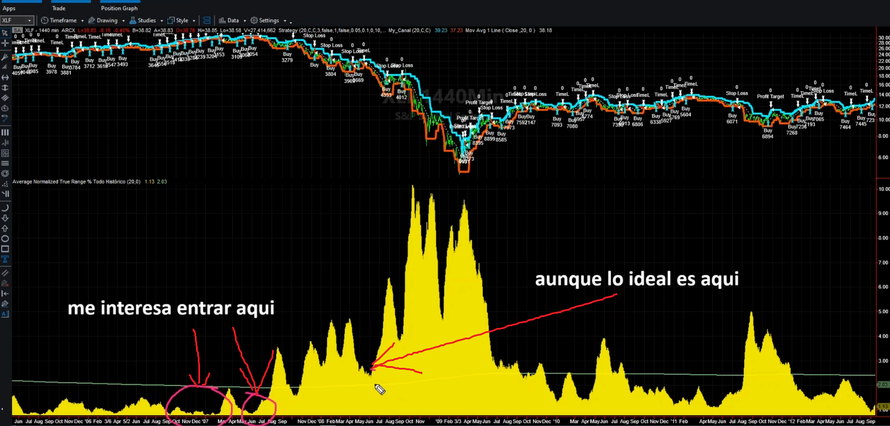

entonces a mí me interesa es,o suelen ir mejor en esa de esta manera además tiene menos riesgo porque estamos entrando en volatilidades más bajas y tienen menos riesgo 

¿cómo podemos implementar esto en el código? vamos a cambiar de activo porque este ya hemos visto que sobre todo el lado largo es bastante dudoso como volatilidad y breakout vamos a bueno cualquier acción es bastante explosiva bueno hemos visto lo de lo de facebook no pues mira vamos a ver a ver qué tal facebook por meter otra que vaya cargando y mientras vamos al código vale 

#### volatility breakout en `META` 

yo tengo este filtro que lo tengo aquí 

```sh
//Filtro de volatilidad
If Filtro_ATR > 0 then
	Condition1 = TrueRange < AvgTrueRange(22)[1] * Filtro_ATR
else
	Condition1 = true;
```

como que el `TrueRange` que al final ya habéis visto lo que era es el rango de una vela sea menor que el true range el `AvgTrueRange` del periodo del canal que son 20 por efecto si fuera otro pues se cambiaría calculado la vela anterior esto lo que decía antes y le añado un filtro le añado un multiplicador a este a este vector para poder trabajarlo que si lo dejo en uno quiere decir que simplemente la volatilidad de esta vela sea menor que la volatilidad de las últimas 20 si modifico esto pues puedo modificar la sensibilidad de cuánto  hago esto grande, pequeño, este pero así por defecto lo puedo dejar en uno creo que creo que creo que es como está 

y este sería un posible filtro de volatilidad 

```sh
# TIPICO SISTEMA DE RUPTURA: el cierre supera el m?ximo deL CIERRE DE 20 barras
if Close > 0 and Condition1 and MP <> 1 and (BarsSinceExit(1) >= Bar_Filtro or TotalTrades = 0) then
Begin
	if Close > Highest(Price_Up, Per_Canal)[1] then
 		Buy Contratos contracts Next Bar at Market;
End;
```
esto como lo añadido yo a la regla de entrada posiblemente a la entrada es que antes había dicho que es que no estuviera no le daba muchas vueltas a esto porque me daba igual pero lo repasamos ahora la condición para entrar largo en realidad era que condición 1 fuera true pero lo tenía activado en todo para que no molestara condición 1 es esto que he dicho es decir que la volatilidad esté como yo creo que es más favorable para que haya una ruptura buena si no prefiero entrar, si la condición 1 no da true no entraría que es esta volatilidad, 2 que no esté largo, que haga menos de tres barras o una que haya salido del mercado a que como mínimo perdón haga tres barras y que al menos haya hecho una operación. 

esa es la regla para entrar cuando esto es afirmativo si el cierre es mayor que la banda entra si no se da esto que esto ya digo el único cambio que implementamos ahora es este filtro de volatilidad de acuerdo este filtro este filtro de volatilidad , vale yo de entrada tengo como voy a breakout voy aquí sí que vamos más bien a tp vamos a suponer que saliera en 10 velas y dejamos los filtros así

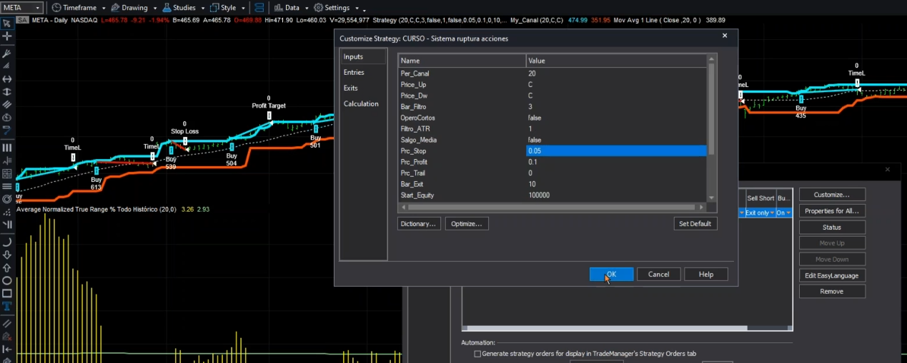

aquí por defecto tal como está ahora que es más un volatilidad breakout que está 49% de profitable 

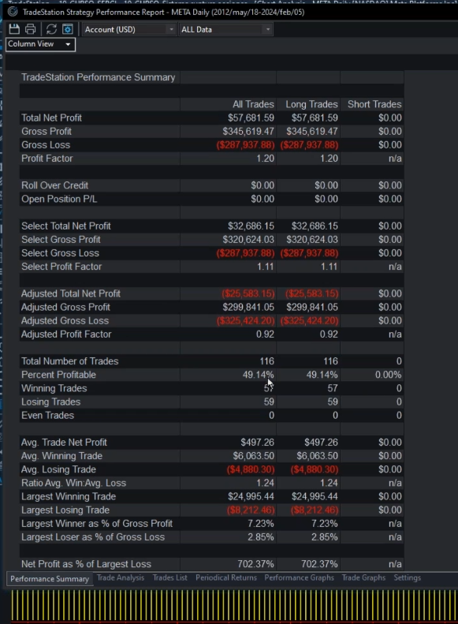


está ahí justito porque porque le he puesto el doble si ahora lo igualo si yo ahora si yo le igualo le igualo tp y esto los dos los pongo al 10 

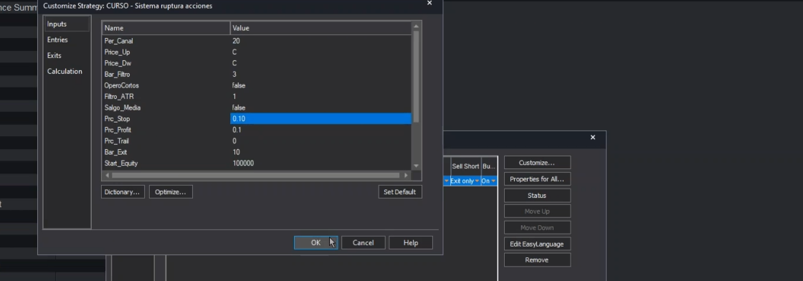

ahora solo quiero que salga y a veces que se va solamente abajo y que salga en 10 

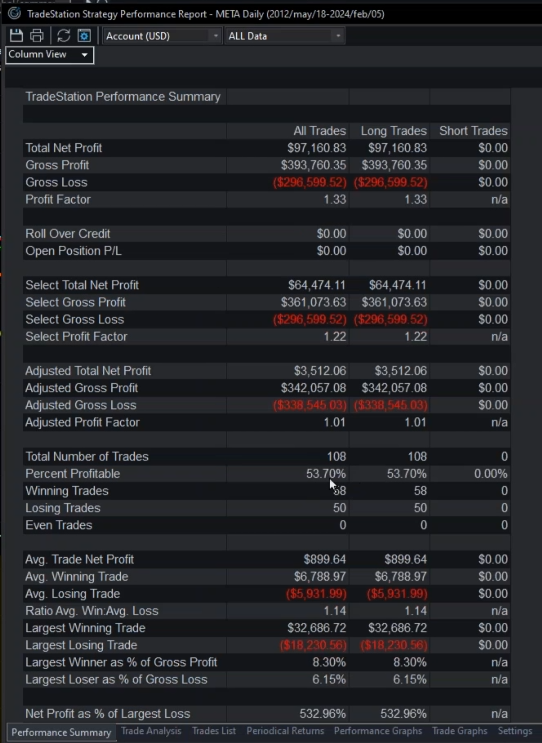


pero si estoy en 53% ya lo he hecho más más breakout que ya no tiene ratios sentenciales ya está ahí más más justito vale y al final pero es que muchas veces sale por 10

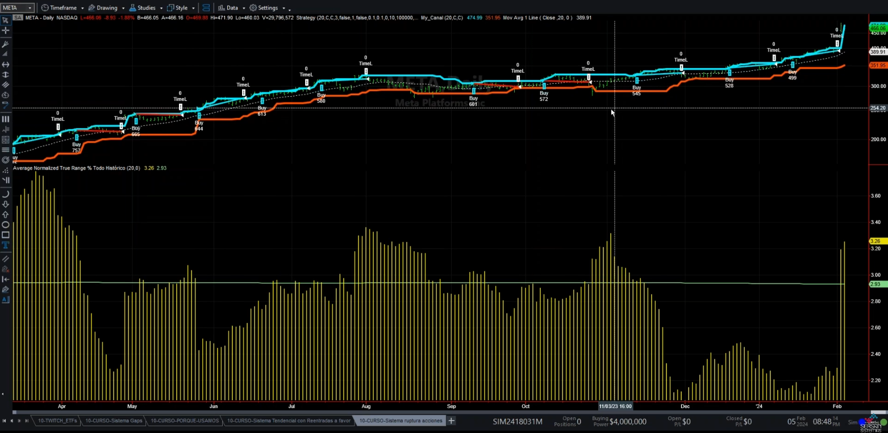

al final estoy buscando explosiones que no que no pilla porque no hay tanta explosión en el diario que eso sería y alguna aquí ves pero la mayoría al final no explota pues vamos en 10 velas de sales no quiero quedarme en el mercado 

pero ahora le implemento le implemento este otro este otro filtro a ver qué efecto qué efecto provoca estoy con 133 de profit factor ahora activo la condición no estaba activa y tengo fijaros 108 trades se va a bajar seguramente 


el max bar me ha petado el max bar esa es una opción, miro más atrás de 25 para ver cómo quedaba 

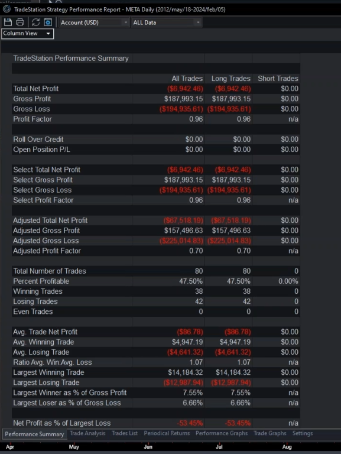

bueno un poquito mucho peor mucho peor así ya perdió 23 trades en este caso va mucho peor esa condición ahora que ver que la tengan uno el `Filtro_ATR`

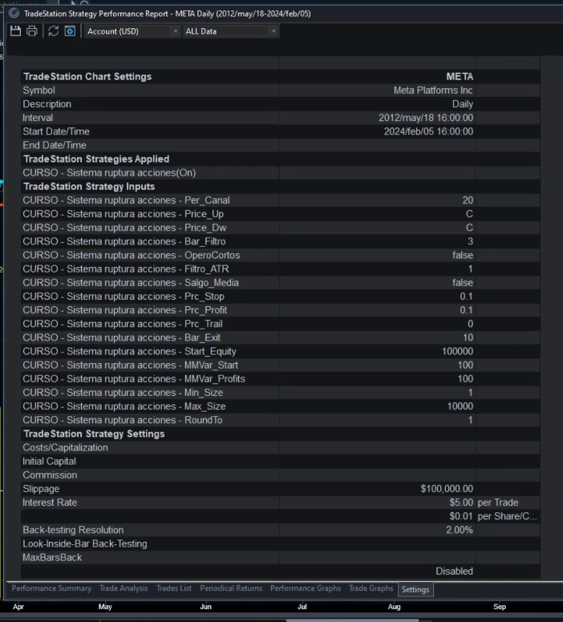

y realmente quitarle la salida por tiempo a ver que provoca

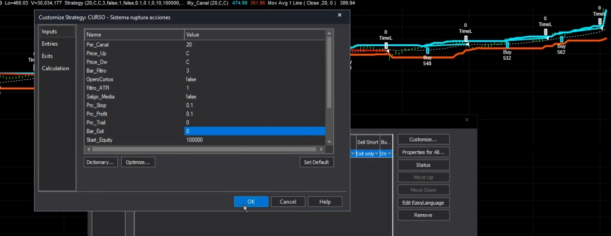


que solo va a 10% de stop y 10% de tp 

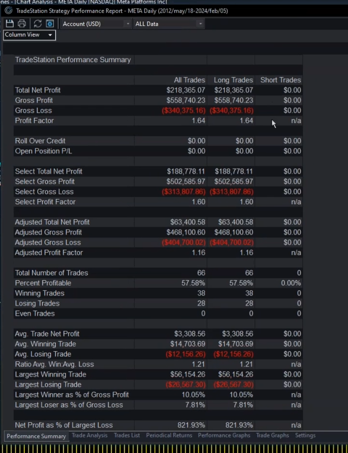


el % de aciertos ahora es prácticamente elevado es 57% ya lo hemos convertido entrando en ruptura lo hemos convertido en una antitenencia totalmente. al final las salidas como yo os comenté es lo que marca mucho el carácter 

ahora vuelvo a **activar el filtro** que nos provoca 

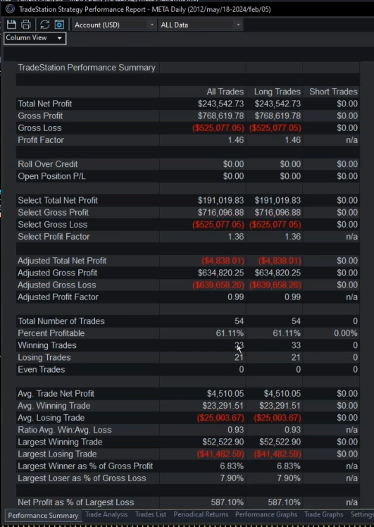

sigue peorando un poco el ratio profit factor, aquí en principio no parece rentar así la opción por defecto esto sí que en estos casos habría que ver normalmente va por debajo de uno por debajo de uno con esto mide también un poco el carácter 

vamos a hacerle muy rápido muy breve y esto es instrumental totalmente simplemente para ver cómo oscila 

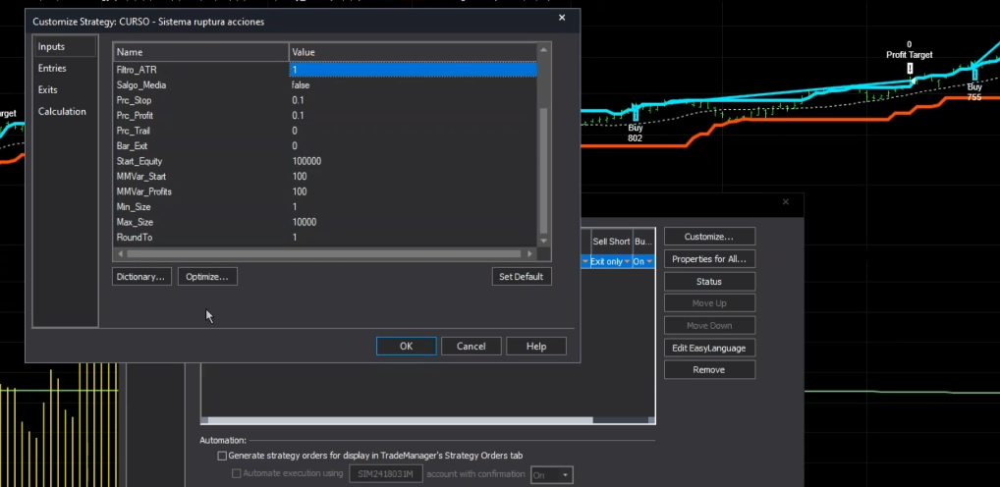  
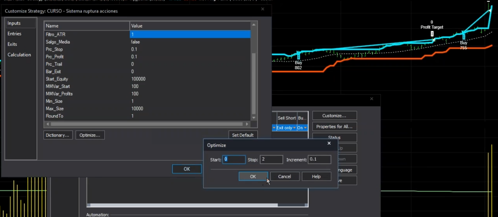

nada bueno entonces hacemos más antecedencial claro, si fijaros aquí 

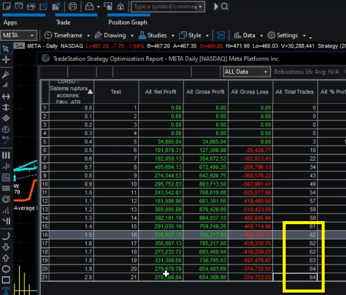

veis que en estos no actúa 64 64 1.5 y donde en uno y medio filter a poco... no no lo quiere en este caso facebook no lo quiere no quiere este filtro de volatilidad. En este caso no no no le aportaría no le aportaría nada pero ya digo ya os digo esto normalmente es más útil en tendencia y no quiere decir en todos los activos que vaya a funcionar. al final la volatilidad es bastante característica en cada cada índice y realmente ya incluso visualmente fijaros que es es es muy abrupto facebook las acciones en sí siempre son mucho más volátiles que los índices y son bastante complejas de operar para otras volatilidad 

al final recordar que siempre sobre todo nosotros al principio a no ser que te podamos en una cartera gigantesca no es recomendable operar en acciones siempre más recomendable operar índices al menos en estos tipos `sbr` que hemos dicho aquí tienes el que equivale al nasdaq 

Vamos a gargar el QQQ 

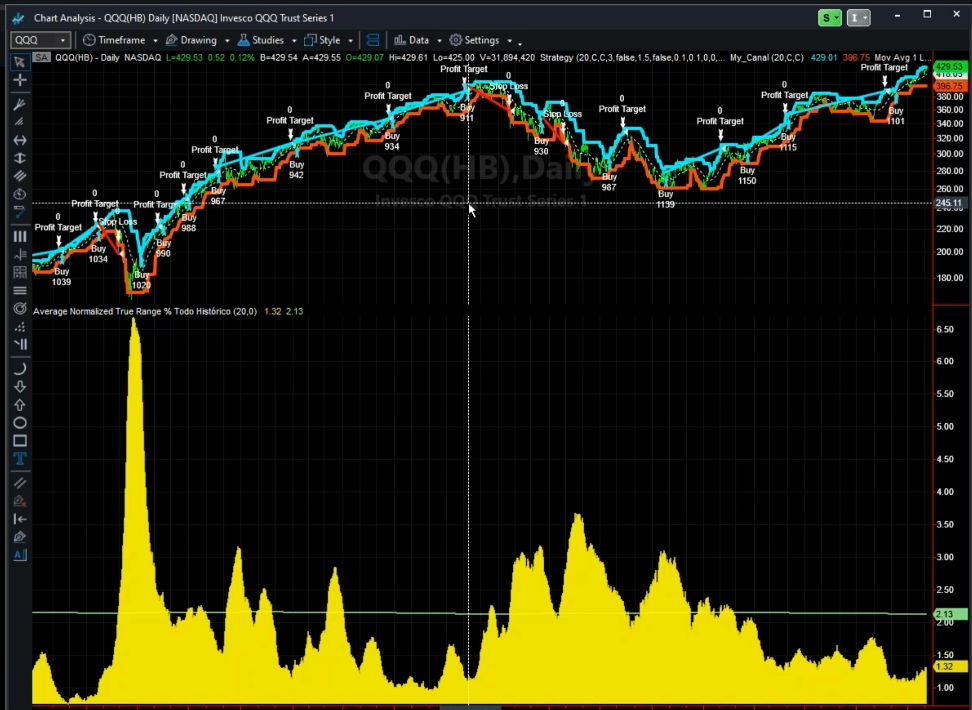


a ver aquí qué tal qué tal se nos da aquí ahora estamos otra vez con volatilidad con tres barras seguramente con ratios por encima del 50 por ciento en 61 porque estoy entrando en ruptura pero estoy cortando los beneficios estoy cortando los beneficios y por eso al final hago más no hago más trade pero realmente no dejo correr los beneficios 

**ahora vuelvo a activar el filtro** 

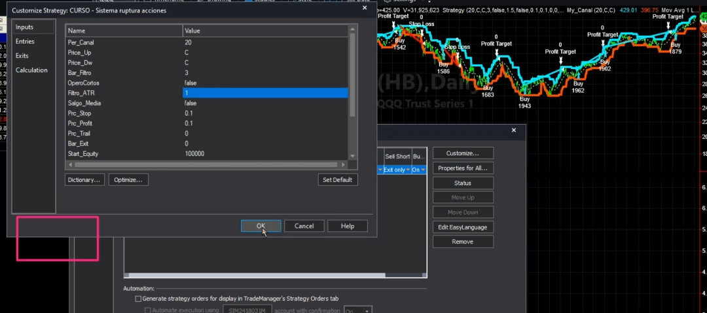

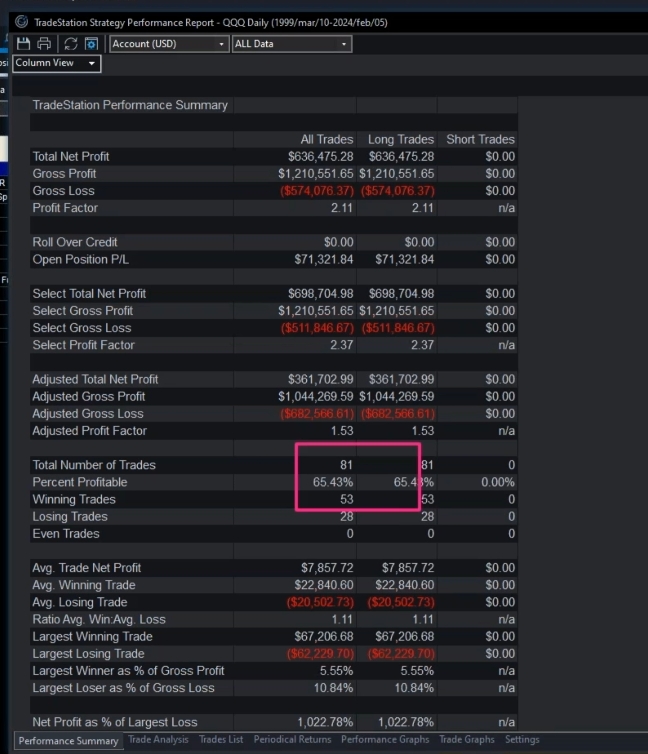

veis aquí sí que hay una mejora tiene dos 211 con 81 trade 

**le quito el filtro**

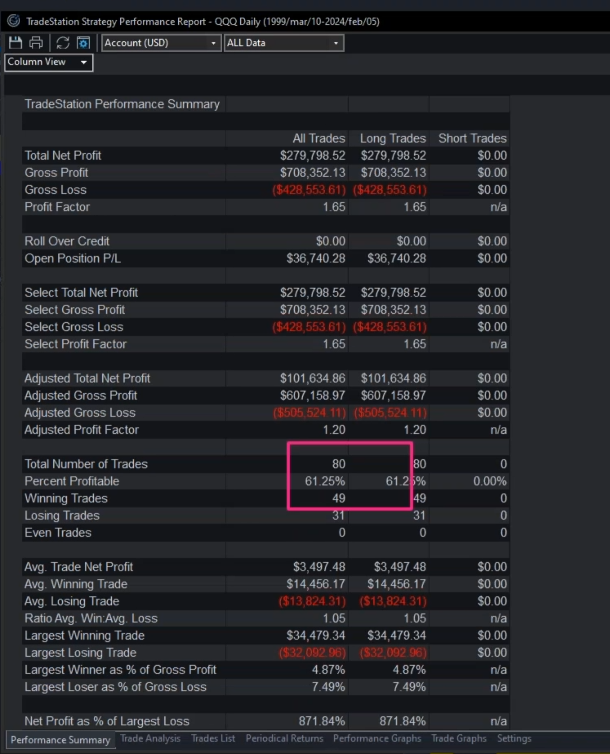

tiene 1.65% Profit Factor con 80 trades es el cambio es notable de 2.11% a 1.65% aquí sí que se nota bastante el sesgo de volatilidad es decir simplemente le he dicho **sólo entra cuando la volatilidad es un poquito más más baja** 

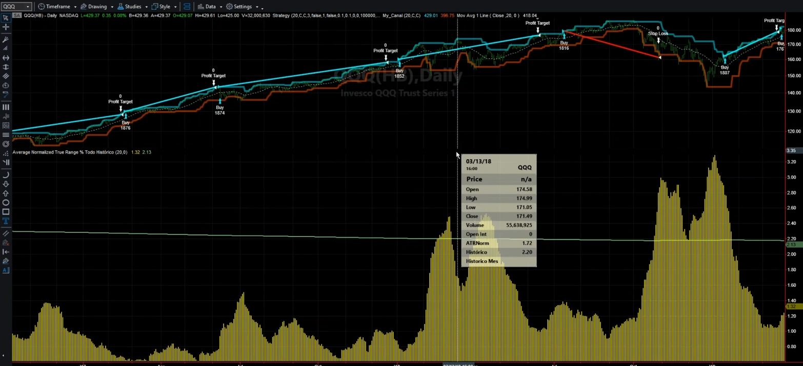

una cierta mejora una cierta mejora de seguramente las entradas y eso que aquí va muy largo va muy largo tp en esto realmente está bastante tendencial pero aún así pues ya veis que aporta cierto cierto valor 


si le forzamos mucho que salga muy rápido mucho mas aquí le forzamos que salga muy rápido le pongo 0.5 y 0.5 de SL y TPpero otra vez simétricos es decir estoy forzando a que se comporte bastante anti tendencialmente porque no le dejo correr rápidamente lo saco lo saco lo saco vale 

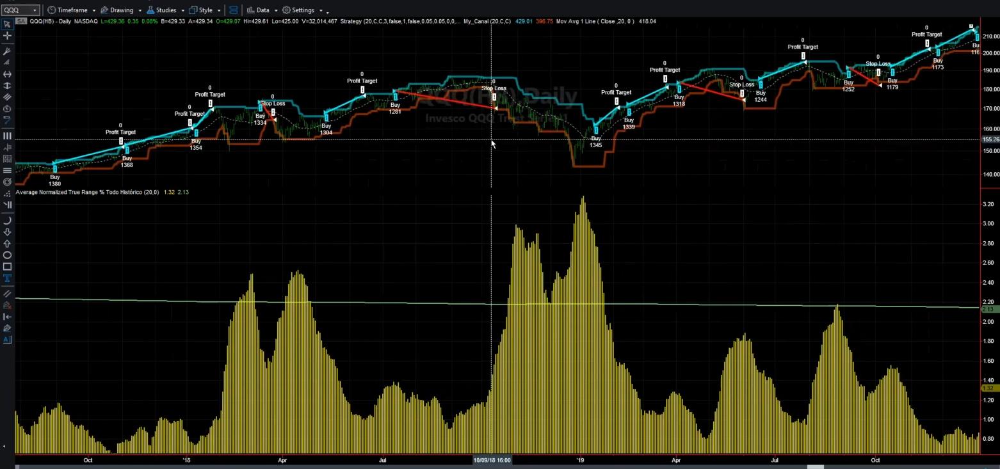

pero aún como es un activo que ha subido mucho pues se da profites interesantes 

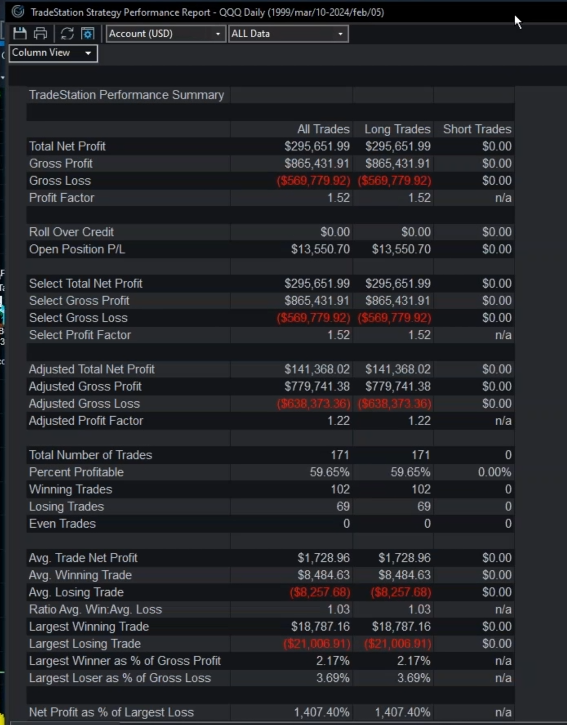

he hecho vamos a activar los cortos ya para acabar vamos a activar los cortos activar los cortos pero le vamos a dejar cortos normales 

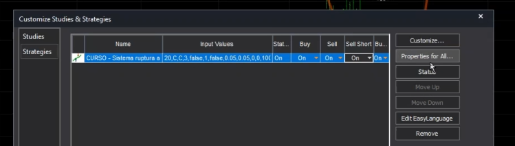

cortos puros a ver qué tal qué tal es capaz de gestionarlo 

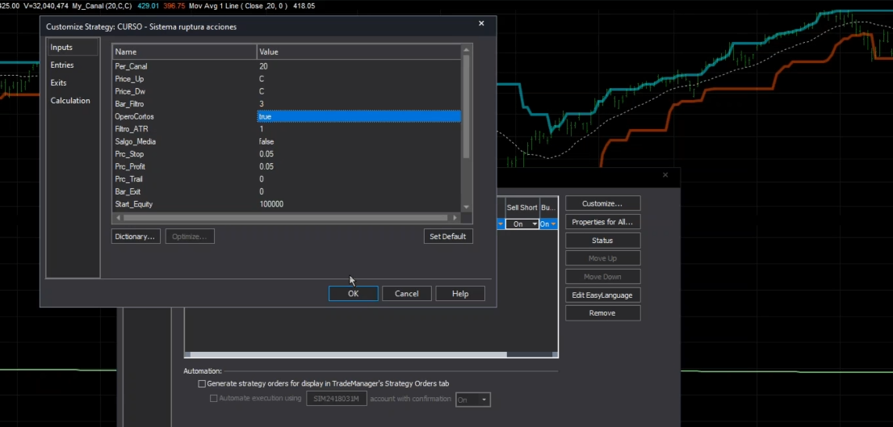

con stp simétrico luego le subiremos el profit 

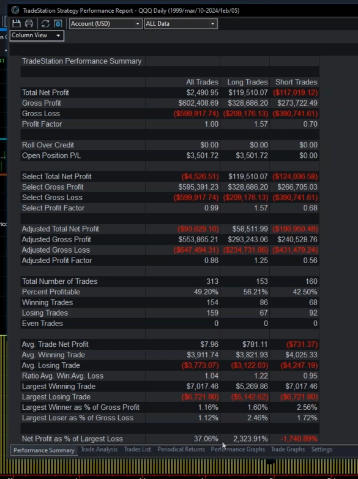

lógicamente pierde lógicamente pierde pierde pierde bastante con los cortos no consigue no consigue lógicamente la tendencia al alza es fuerte y le hemos dado muy pocas opciones para salir más que tp y stop que hemos dejado poco margen en cortos en renta variable se pueden hacer nosotros hacemos los que nos seguís lo sabéis pero realmente tps es muy cercanos y de hecho funciona más bien dejarle un poco más de margen y la tp es como que ir al tp al tp rápido y la tp rápido porque si no no da margen para para cortos hay que ir un poco un poco al revés 

pero ahora lo que me interesaba lo quería ver era un poco activar ahora **activar ahora el filtro ATR aquí** con el corto activado ver qué efecto tenía 

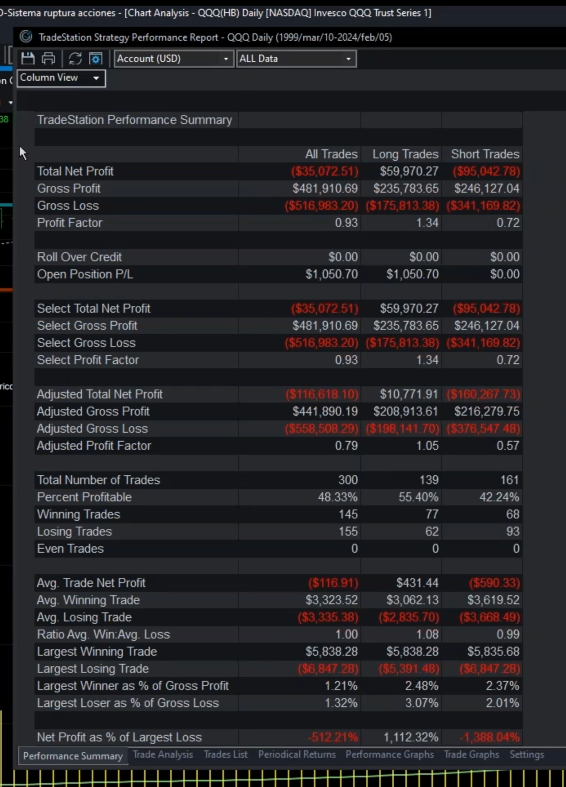

ahora estamos en uno aquí sí que empeora con el corto activado no consigue mejorar con el filtro volatilidad y es normal porque la volatilidad del largo del corto se comporta de manera muy distinta seguramente requerirían un filtro un filtro distinto y para un sistema diario es enviable es decir esto ahora lo estamos mirando en el diario pero como ya os he comentado he querido introducirlo porque al final he desarrollado el concepto de tendencial y volatility breakout en el mismo mismo día y hoy lo que me interesaba era esto desarrollar este concepto 

iremos desarrollando los conceptos de distintos sistemas usando ejemplos porque eso es la parte práctica un poco de la teoría y luego por supuesto hacer los sistemas completos bien hecho o sea este ahora el próximo día lo desarrollaremos como tendencial como he dicho pero yo he querido introducir la la parte de tendencia volatility breakout de cómo de cómo funciona y cómo ese punto en común que tienen de prácticamente pueden usar la misma entrada pero las salidas lo cambia todo la salida 

## ¿preguntas?


**ejemplos de mecanismos para la identificación de tendencia el lateral santo bueno no santo grial** 

**Ejemplos de mecanismos para la identificación de tendencia y del régimen lateral —el falso “santo grial”**

En realidad, ese es uno de los grandes temas, y lo abordaremos más adelante con profundidad. Tengo previsto dedicar una clase completa exclusivamente a los **regímenes de mercado**, que en el lenguaje técnico se refieren justo a lo que mencionas: los distintos **estados o combinaciones entre tendencia y volatilidad**.

Podemos clasificar el mercado, de forma general, en **seis tipos principales**, resultado de la combinación de tres direcciones —alcista, lateral y bajista— con dos regímenes de volatilidad —creciente y decreciente—. Podrían establecerse divisiones aún más finas, pero esos seis estados describen bastante bien la mayoría de comportamientos de mercado.

Con ellos es posible diseñar **filtros** que permitan identificar y controlar en qué entorno nos encontramos, y actuar en consecuencia. Es un camino de estudio profundo, que incluye herramientas avanzadas como el **VIX** o la **estructura del VIX**, las cuales pueden emplearse como filtros de volatilidad. No obstante, ese tipo de análisis lo veremos más adelante, cuando el grupo tenga una base más sólida, porque implica cierta complejidad técnica.

Por ahora, lo importante es comprender el **concepto general de filtro de volatilidad**: se trata de limitar las operaciones cuando la volatilidad es demasiado alta o demasiado baja, o bien cuando está creciendo o decreciendo. Estas magnitudes, en función del sistema, pueden ser filtros muy útiles y están estrechamente relacionadas con la idea de **régimen de mercado**, que conecta directamente con tu pregunta.

En cuanto a los mecanismos para detectar una **tendencia lateral**, ya hemos tratado algo en teoría y realizaremos prácticas específicas más adelante. De momento, he preferido que en estas primeras sesiones os centréis en desarrollar sistemas completos —porque sé que es lo que más os motiva—. En las siguientes fases volveremos a ejercicios de **búsqueda de ideas**, donde encajará también este tema.

El estudio de los regímenes de mercado está ligado al **perfil del activo** y al tipo de estrategia: en entornos tendenciales, buscamos rupturas; en entornos laterales o de reversión, el enfoque es distinto. Para identificar estas condiciones, pueden utilizarse indicadores clásicos como el **ADX** o el **ATR**, que permiten medir la fuerza de la tendencia y la volatilidad relativa de cada activo.

Por ejemplo, en la práctica he mostrado el uso de estos indicadores normalizados junto con su valor histórico como referencia:

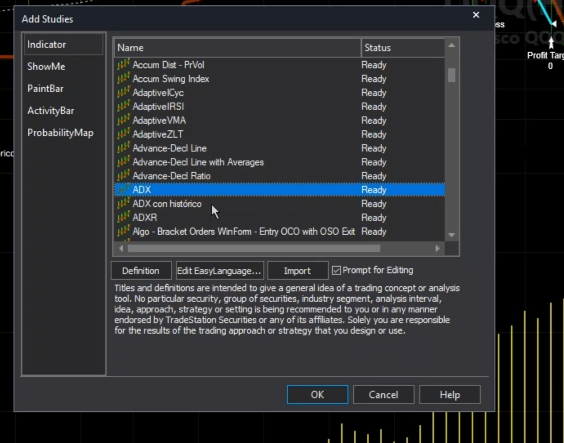
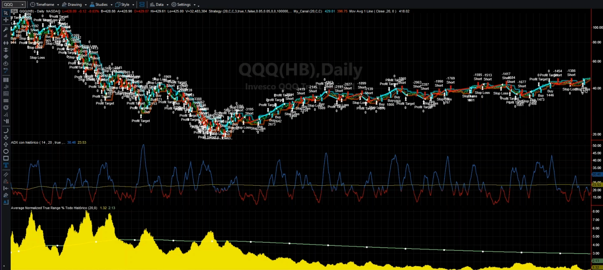

Al comparar activos mediante sus medias históricas de ADX o ATR, es posible estimar cuáles presentan **mayor comportamiento tendencial**. Sin embargo, conviene recordar que las medias suavizan los datos y que las diferencias entre activos no suelen ser muy grandes: la mayoría se mueve en rangos de valores entre **17 y 22**.

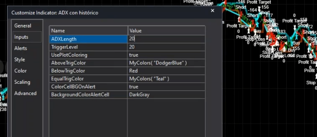
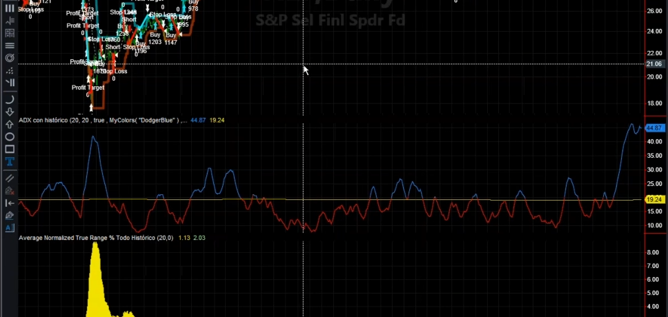

En general, la relación entre **tendencia y volatilidad** es clave: los sistemas *breakout* (ruptura) funcionan mejor cuando la volatilidad crece, mientras que los sistemas de **reversión a la media** se benefician de la contracción de la volatilidad. El verdadero reto es identificar correctamente en qué punto del ciclo se encuentra el mercado, y eso —como veremos— no es nada sencillo.

Por ahora, nos centraremos en **evaluar y consolidar el sistema actual**, para posteriormente decidir si formará parte del conjunto de estrategias que compondrán el **portafolio final** del curso. En próximas sesiones lo analizaremos a fondo y valoraremos si cumple con los criterios necesarios para integrarlo.

## Resumen

### 1. Fundamentos de la práctica

La práctica 03 se centra en comprender y analizar los **canales de Donchian** como estructura base de un sistema de ruptura tendencial. El objetivo principal no es construir un sistema final, sino **asimilar los conceptos** que definen su comportamiento, sus entradas, salidas y los factores que condicionan su rendimiento.

El enfoque es progresivo: primero se define la lógica básica del canal y las condiciones de entrada, luego se añaden distintos tipos de salida y finalmente se introducen los elementos de gestión monetaria y optimización. Todo el desarrollo está orientado a entender **cómo se comporta un sistema simple en distintas condiciones de mercado** y cómo se puede evaluar su consistencia antes de complejizarlo.

---

### 2. Los canales de Donchian

Los canales de Donchian representan un **envelope de precios** que delimita los extremos del mercado durante un periodo definido (por defecto, 20 barras). Conceptualmente, marcan los puntos donde el precio ha alcanzado un máximo o mínimo relativo dentro de una ventana temporal. Estos límites permiten identificar cuándo el precio se escapa de su rango habitual y, por tanto, puede estar iniciando una nueva tendencia.

#### 2.1. Cálculo y variantes

El canal puede construirse tomando distintos campos del precio:

* **High/Low:** es el cálculo clásico, mide el rango total del movimiento intradía y capta rupturas más agresivas.
* **Close:** se usa cuando se trabaja con base diaria, ya que el cierre resume la decisión final del mercado del día.
* **TypicalPrice:** opción intermedia, suaviza el efecto de los extremos intradía.

Cada elección tiene implicaciones conceptuales: el uso de *Close* introduce un enfoque más estable y orientado a la tendencia general; *High/Low* es más sensible y rápido para detectar rupturas, aunque genera más ruido.

#### 2.2. Lógica de exclusión de la barra actual

En el código y en la construcción del canal se excluye la barra actual (`[1]`) para evitar el sesgo de anticipación (*look-ahead bias*). Conceptualmente, esto garantiza que las decisiones se basan solo en información que estaba realmente disponible en el momento de la ejecución. Si el canal incluyera la barra actual, una ruptura nunca sería posible, porque el valor máximo del canal se actualizaría instantáneamente con el nuevo precio.

---

### 3. Tipos de entrada

El sistema implementa una **entrada estándar de ruptura**: cuando el cierre actual supera el máximo de los últimos *N* cierres, se abre una posición larga al inicio de la siguiente barra. Es la expresión más simple de un sistema tendencial.

#### 3.1. Variantes de ruptura

Existen dos variantes en la condición de entrada:

* `>` (mayor estrictamente): exige una ruptura real, evita duplicidad de señales y es más conservadora.
* `>=` (mayor o igual): más sensible, puede anticiparse una barra antes, pero introduce mayor ruido.

El concepto detrás de esta elección es **definir la naturaleza de la señal**: si se busca una confirmación (ruptura clara) o una anticipación (ruptura tentativa). Ambas aproximaciones son válidas según el activo y la volatilidad del mercado.

#### 3.2. Configuración mediante inputs

Los parámetros de entrada (`Per_Canal`, `Price_Up`, `Bar_Filtro`, etc.) se declaran como *inputs* para permitir un análisis flexible. Conceptualmente, esto no implica que deban optimizarse, sino que se puedan **explorar distintos escenarios de comportamiento** del sistema sin modificar el código. El objetivo es facilitar el aprendizaje empírico mediante la observación de resultados bajo condiciones variadas.

---

### 4. Tipos de salida

El módulo de salidas tiene distintas configuraciones que permiten evaluar cómo se comporta el sistema al modificar su forma de cerrar las operaciones. Las salidas se analizan no como parámetros de beneficio, sino como **métodos de control del riesgo y de lectura del cambio de fase del mercado.**

#### 4.1. Salida por media central

Esta salida utiliza la media móvil de los mismos períodos que el canal para cerrar la posición cuando el precio vuelve hacia el centro del rango. Representa una lógica de **reversión parcial**: el sistema deja correr la tendencia mientras el precio permanece por encima de la media, pero cierra cuando pierde impulso y regresa a su zona media.

#### 4.2. Salida por trailing stop

El trailing stop es un **mecanismo adaptativo de protección**. A medida que el precio avanza a favor de la posición, el stop se actualiza siguiendo al máximo alcanzado, restándole un porcentaje fijo (`Prc_Trail`). Esto permite conservar parte de las ganancias acumuladas y limitar la pérdida en caso de retroceso. Conceptualmente, el trailing combina libertad y control: deja correr las tendencias, pero no permite que se reviertan completamente.

#### 4.3. Salida simétrica (TP/SL)

Las pruebas con riesgo y profit simétrico buscan equilibrar el ratio win/loss. Conceptualmente, este enfoque permite evaluar la **efectividad de la señal de entrada** sin que la salida condicione el resultado. Si la entrada tiene sentido, incluso con TP y SL iguales, el sistema debería mostrar una ligera ventaja estadística.

#### 4.4. Salida por canal contrario

Aunque no se implementa directamente, se menciona como salida “natural” del Donchian clásico: salir cuando el precio rompe el canal opuesto. Es la opción más tendencial, pues mantiene la posición mientras la tendencia persista y solo revierte al detectar un cambio completo de dirección.

---

### 5. Gestión monetaria

El sistema incluye un módulo básico de **gestión monetaria nominal**, donde la exposición se ajusta en función del tamaño de la cuenta y del precio del activo. El número de contratos (`Contratos`) se recalcula para mantener una exposición constante (por ejemplo, el 100% del capital disponible).

Conceptualmente, esto permite **normalizar los resultados históricos**, evitando que las variaciones del precio (de $1 a $300, por ejemplo) distorsionen las métricas de rendimiento. El objetivo no es apalancar, sino **mantener la proporcionalidad del riesgo y del retorno** a lo largo del tiempo. Esta aproximación facilita la comparación entre distintos periodos y activos, y proporciona una visión más coherente de la efectividad del sistema.

---

### 6. Evaluación y optimización

En esta fase, el propósito no es encontrar el mejor conjunto de parámetros, sino **entender cómo responden las variables del sistema** ante los cambios. Este tipo de análisis se denomina *optimización instrumental* o *de observación*. Permite construir mapas de sensibilidad que revelan zonas estables, ineficiencias o comportamientos anómalos.

La **búsqueda dirigida** es un principio fundamental de este enfoque: se parte de una idea concreta, bien delimitada, y se exploran variaciones controladas. A diferencia de la búsqueda por fuerza bruta, que genera sobreajuste, aquí el análisis está guiado por hipótesis previas basadas en el comportamiento esperado del mercado.

---

### 7. Conclusión conceptual

El estudio del sistema Donchian en esta práctica muestra que un modelo simple, basado en rupturas de rango, puede capturar la estructura esencial de las tendencias de mercado. A través de sus variantes de cálculo, tipos de entrada, salidas y gestión monetaria, el alumno comprende que **un sistema no se define por su complejidad técnica, sino por la coherencia entre sus reglas y su propósito**.

La práctica enseña a observar cómo cada decisión —el uso del cierre frente al máximo, la elección del tipo de ruptura, el modo de salida o la forma de dimensionar posiciones— transforma la naturaleza del sistema y su interpretación del mercado. Este análisis sienta las bases para fases posteriores donde se abordarán filtros, optimizaciones más profundas y comparaciones entre activos y temporalidades.


