## Comentario a Alejandro y sobre porfolio

Alejandro comentaba el tema de porfolio que echaba en falta alguna parte avanzada. Bueno, ya te comenté, Alejandro, tomamos nota y bueno, pues a medida que avancemos hacia la parte porfolio, que lógicamente todavía falta, porque quiero antes hacer bastantes estrategias más y pues ya veremos, a ver si podemos resolver un poquito esa inquietud que tienes. Hoy, de hecho, vamos a trabajar este sistema en 100 acciones en el Nasdaq, pero no con la finalidad de hacer un porfolio sobre ella, sino con la finalidad de validar la idea, de ver si el sistema funciona, etcétera, etcétera, ¿vale? Pero un poco otro camino que ya os comenté, que son **sistemas que tienen poca frecuencia operativa, pues una de las maneras de validarlo es juntando activos**, y este es lo que vamos a hacer un poco con este sistema. ¿Podría hacerse por otro camino? Bueno, podría hacerse, pero a nosotros en este tipo de sistemas nos gusta mucho este método, es decir, meter todo el Nasdaq 100 o en una cesta de ETFs o en todo el SP500, en un montón de acciones que, lógicamente, pues se comportan de su manera, pues tratar de validar la idea ahí.

## Entrevista de Iván y debate metodológico

Iván, que es gestor de Emerging Funds, es una gestora que tiene oficina en distintos sitios, en Nueva York, en Dubái, es, la verdad que es todo con la suerte de que sea amigo personal, además de colega de profesión, y es un trader excelente, como ha demostrado en su, en el concurso, que es el mismo que ganó la Rey Williams, año pasado que lo ha ganado, ¿no?

Abrí el debate ahí un poquito, pero lo que quería es que vierais, como ya os he dicho insistentemente, la teoría que nosotros os explicamos cómo hacemos nosotros las cosas, y os hemos explicado algunas que también no hacemos, ¿de acuerdo?, porque hay que explicar, hay que explicarlo todo y explicar lo que nosotros pensamos. Pero hay distintos caminos para llegar a Roma, y además en lo esencial, en lo esencial os aseguro que estamos 100% de acuerdo, porque es lo esencial, es lo esencial, ¿de acuerdo?, y de ahí no hay variación.

El hecho, como por ejemplo, cuando os expliqué, si os acordáis, el BRAC, y os dije que el BRAC, en mi opinión, a mí, no tiene mucho sentido, pero no tiene mucho sentido, lo que quiero decir es el nombre, ¿de acuerdo?, es decir, al final un BRAC, el BRAC es, es decir, una optimización convencional es muy parecida al BRAC, ¿vale?, y si tú haces una optimización convencional y le sacas 4.000 trades, y no tiene muchos grados de libertad, de verdad, seguramente no hace falta World Forward, ¿vale?, pero hazlo, ¿de acuerdo?, no está de más, no está de más.

> **Backtest – Re-optimization – and – Combination**  
> El BRaC es una metodología alternativa al Walk-Forward Analysis (WFA).  
> Su objetivo es el mismo: evaluar la robustez de un sistema sin sobreajustarlo.  
> Pero lo hace con un enfoque algo diferente: reoptimiza varias veces el sistema y combina los resultados en lugar de “caminar” bloque a bloque por el histórico.

> **Walk-Forward Analysis (WFA)**  
> Es un método de validación y optimización de estrategias de trading.  
> Sirve para comprobar si una estrategia que ha sido optimizada en el pasado sigue funcionando en datos nuevos, sin caer en overfitting (ajuste excesivo al histórico).  

Al final la mayoría de traders utilizamos varios métodos de evaluación, y realmente si están bien hechos, hay varios que son útiles, y es verdad que para algún tipo de sistema puede venir mejor, puede venir otro, pero la idea está clara, y acordaros cuando os dije, **significación estadística**, **representatividad de la muestra**, esto es los [cimientos de la metodología clásica](), y también es lo que hace Iván.

Él, por ejemplo, no le gusta World Forward, a Kevin le gusta, a Andrea Humbert, por ejemplo, tampoco le gusta World Forward, es decir, hay distintos, hay distintos, como os digo, opiniones, y demás. A mí el Cluster World Forward me gusta mucho, ya trataremos de hacer en este sistema, como tal, no lo vamos a hacer, porque ahora a medida que avance la clase lo veréis, los problemas que te vas encontrando, pero en otros sistemas sí que lo haremos, haremos un World Forward al uso, pero en este no lo vamos a hacer como tal, y podemos acabar validando la idea, igual, ¿de acuerdo?, es decir, ahí está un poquito el tema.


## Plan de trabajo técnico de esta sesion

Recordar el sistema que es simplemente un [canal de Donchan **(13-practice-03)**](../../13-practice-03/transcripts/practica_03_menu.md), 

el pseudocódigo de hecho en palabras no es más que tenemos una banda arriba de los n cierres anteriores, por efecto, acordaros que Donchan hablaba de 20 porque era más o menos un mes, más o menos cuatro semanas, más o menos la regla de cuatro semanas. Y entonces en este caso como eran acciones pues nosotros decidimos hacerlo con los cierres, se podría perfectamente haber hecho con el máximo, hoy no lo he probado, no lo he cambiado, el otro día ya lo jugamos un poco con ello pero lo vamos a dejar en el cierre pero podría ser que fuera mejor el máximo, ya digo que no he trabajado a fondo ese concepto, lo he dejado en el cierre porque a nosotros en acciones el cierre en gráfico diario normalmente el cierre le damos bastante importancia y por lo tanto pues ya nos parece bien trabajar con el *canal de cierres*. El canal de cierres también está la parte baja porque el sistema permite hacer cortos aunque no lo he trabajado, eso de hecho es lo que os voy a dejar para el que quiera trabajarlo para casa y ver a ver qué puede hacer.

Planteamos en el código distintas salidas pero hoy vamos a trabajar solo el **trailing**, también tenemos en el código planteado 
* salir por la **media central**, está planteado está 
* también salir en n barras
* salir en un stop porcentual 
* salir en un tp porcentual 
* y está planteado un trailing.

Pero como ya comentamos y vamos a evaluar un tendencial puro y para eso necesitamos dejar con los beneficios si ponemos *tp* no vamos a cumplir ese requisito y por lo tanto decidimos solo entrar hoy es lo que vamos a mirar entrar por cierre por encima del canal y salir solo por trailing. Esta es la única salida. Además hablamos muy de pasada porque ya comenté que os lo enseñaría un filtro que hoy vamos a probar este filtro *atr* que simplemente es si el true range de la vela actual es menor que el true range medio mensual por un multiplicador

```sh
//Filtro de volatilidad
If Filtro_ATR > 0 then
	Condition1 = TrueRange < AvgTrueRange(22)[1] * Filtro_ATR
else
	Condition1 = true;
```

este multiplicador lo vamos a estudiar pero que al final acabaremos dejando en 1, porque era la idea pero como ya os comenté a veces podemos hacer optimizaciones instrumentales para ver para coger información de la variable y este es un claro ejemplo 

### 1ro : Evaluar el canal

Empecemos por el principio el principio cual es el principio? el principio es evaluar el canal evaluar el canal ya lo hicimos por un lado con con igualando el stop si os acordais igualando el tp creo que pusimos 0.5 pusimos uno a nivel de evaluación preliminar y hicimos un pequeño estudio rápido para ver si conseguimos seguir adelante por la señal de entrada así que vimos que parecía tener cierta ventaja y hoy hemos continuado avanzando en esa idea pero ya con la versión trailing esta es la primera estudio que hemos hecho vamos a presentar 4 estudios 

**la ficha** - [link](../../15-practice-05/OPTI4.xlsx)

Tenemos aquí la fichita en excel enseñaré trabajo en sí el portfolio trader pero antes empezamos por la ficha   
Vamos a optimizar o estudiar o a testear el sistema de ruptura de acciones en todo el nasdaq cien, en las cien acciones que hoy cotizan en las acciones cuidado aquí que esto no quiere decir que estemos haciendo una buena simulación ha pasado de cartera porque no hemos tenido en cuenta las deslistadas y la puntuación que hay, pero nosotros estamos validando el sistema no estamos montando una operativa en el NASDAQ100, estamos evaluando el sistema, podíamos hacerlo en apple podíamos hacerlo en microsoft podíamos hacerlo en google pero eso tendría pocos trades y nos dejaría sin prácticamente margen de maniobra para poder analizar los parámetros porque habría una significación estadística que para nosotros no sería suficiente y una manera de hacer esto es evaluar todas las acciones a la vez de tal manera que el sistema tenga que tener un comportamiento bueno en la mayoría de ellas porque seguro que no ganan todas, al final pues puede de esta manera consigues mayor número de operaciones y estaremos de acuerdo que son que es un activo homogéneo entre sí comparable y que tiene si bastante correlación entre sí, aunque ya veréis que curiosamente al final cuando os muestre un perfomance report completo de una de una buena de la combinación por ejemplo que de que acabaríamos eligiendo para operar, y veréis que realmente muchas acciones de las acciones entre sí no tienen tanta correlación con el operando el sistema de resultados mensuales no tienen tanta pero eso lo veremos al final 

bien aquí tenemos un poco todos los inputs que hay puestos en el en el sistema nosotros aquí sólo vamos a trabajar estos que os voy a marcar en **rosa** 

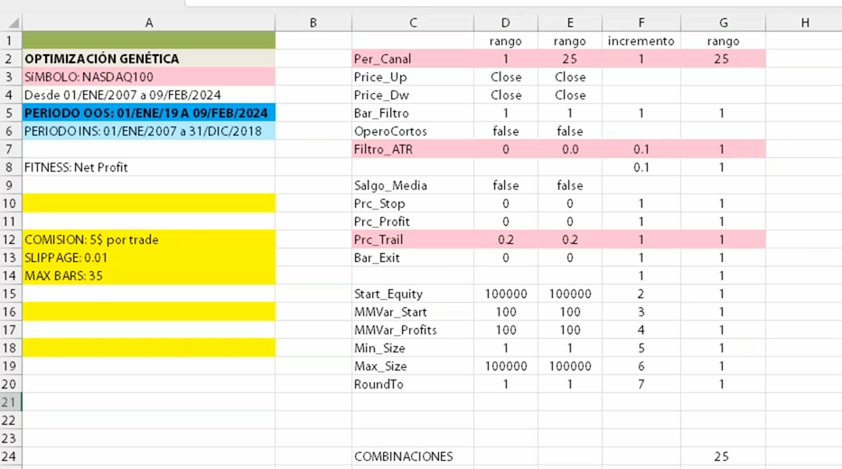

vamos a trabajar 
* `Per_Canal` - el periodo del canal que esa es la que vamos a hacer en esta primera 
* `Prc_trail` - trailingy y probaremos 
* `Filyro_ATR`- el filtro de acuerdo pero es el filtro a ver si tiene algún sentido o no 

Nada más por el momento, nada más.
Se podría —y de hecho *debería*— evaluar también la parte *corta* del sistema.
Nosotros hoy no lo hemos hecho, pero recomiendo que lo hagáis: quien tenga la capacidad técnica, que lo pruebe; y quien no, que lo trabaje al menos de forma conceptual. La próxima semana comenzaremos algo nuevo, pero haremos también un pequeño repaso a esta parte: el *lado corto* del sistema, para ver si realmente tiene sentido operarlo o qué ajustes podrían hacerse para hacerlo viable.

En esencia, la idea sigue siendo la misma: el *canal de Donchian* puede colocarse tanto arriba como abajo. De hecho, ya está implementado también en la parte inferior, y en teoría sería operable de igual manera. Sin embargo, en la práctica **no se comporta igual**, porque el mercado de acciones tiene un sesgo alcista muy marcado. Es posible operar el lado corto, sí, pero hay que hacerlo de una forma muy concreta, y *tendencialmente* no suele ser una de ellas.

Una de las cosas que no hemos hecho aquí —pero que veremos más adelante, cuando trabajemos la práctica de búsqueda de señales y evaluación de activos— está relacionada con la teoría que ya comentamos:
si te planteas un *setup* tendencial, lo lógico es aplicarlo sobre activos que, por naturaleza, sean más tendenciales.

¿Son las acciones ese tipo de activo esencialmente tendencial?
No exactamente. A nivel de índice, no lo son tanto; sin embargo, **a nivel de acción individual sí lo son bastante más**. A nivel de índice, las acciones muestran tendencia en el largo plazo, pero cuanto más bajas de *timeframe*, más el mercado de *equities* se vuelve *antitendencial*.
Por eso, muchos sistemas que operan sobre acciones —especialmente los que trabajan índices bursátiles— acaban comportándose más bien como **sistemas antitendenciales**, o versiones adaptadas a ese enfoque, y no como sistemas *tendenciales puros*, que son más propios de materias primas, divisas o acciones en contado, donde sí pueden capturarse tendencias amplias y sostenidas.


Vamos un poco al concepto, que es este, y este es el concepto. Entonces, ¿cómo hemos evaluado esto? Bueno, lo hemos evaluado a través de *Portfolio Trader*, que es este programa que forma parte de *MultiCharts*.

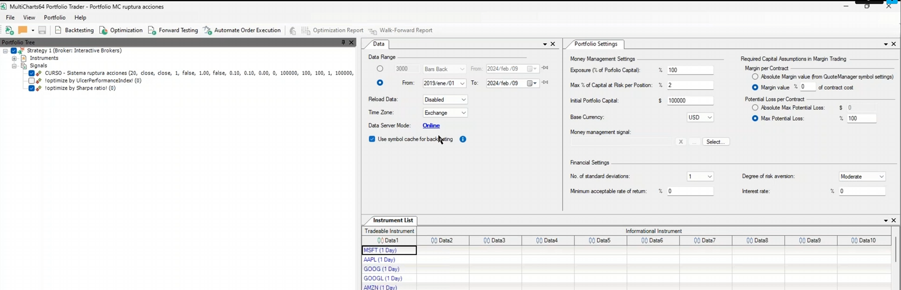

Como decía, es el programa que hemos usado, aunque podría emplearse cualquier otro. Al final, lo que hemos hecho aquí —y ahora os explico— puede aplicarse en cualquier plataforma, quienes tengáis la posibilidad de hacerlo.

Hemos trabajado, como se ve en el Excel, con un periodo *in sample* que va desde el inicio de 2007 hasta finales de 2018, y a partir de ahí, es decir, desde principios de 2019 hasta el pasado viernes, hemos usado el periodo *out sample*.
Podría haberse añadido un tercer periodo, y ya os he comentado que muchos autores lo hacen, llamándolo periodo de validación. Perfecto. Nosotros no lo hemos hecho porque nuestros procesos suelen durar bastante tiempo: imaginad que empezáramos a estudiarlo ahora y siguiéramos durante semanas o meses; esa observación continua fuera de muestra equivaldría a una especie de *paper trade*. En esa fase, ya estaría validado. Solemos hacerlo así, pero también es correcto dejar un tercer periodo; no es una práctica incorrecta en absoluto.

* Hemos adoptado cinco dólares por *trade*, que es aproximadamente lo que cobra hoy en día *TradeStation*. Aunque tiene distintos planes, este es un plan común para la mayoría. Si haces más volumen, incluso puede resultar más barato.
* Y hemos asumido un *tick* de *slippage*.

Hemos optimizado. Bueno, realmente lo hemos hecho de forma exhaustiva: hemos puesto *net profit*, pero en realidad, cuando haces una optimización exhaustiva, eso no importa porque se recogen todos los datos.
En cuanto a *Portfolio Trader*, como os decía respecto a las plataformas, tiene algunas limitaciones a nivel de *backtesting*: por ejemplo, la información que ofrece es algo más pobre en términos de análisis. Su *Walk Forward* es bastante deficiente en configuración, especialmente en su versión *portfolio*. La versión para sistemas individuales es bastante mejor; ya lo veremos más adelante.
En cambio, tiene una gran ventaja: puede conectarse al mercado. Es decir, puedes completar el montaje del sistema, hacer *forward testing*, dejarlo en simulación —más adecuado para sistemas intradiarios, quizá— e incluso operar en tiempo real.

Además, *Portfolio Trader* permite configurar reglas de prioridad por código dentro del propio portafolio. Por ejemplo, si finalmente fuéramos a operar las 100 acciones, podríamos establecer criterios para decidir cuáles ejecutar: las 10 que entren primero, las 10 que cumplan una determinada condición extra del portafolio, etc.
Este tipo de configuración no es el objetivo ahora, pero lo comento ya que estamos viendo el programa. Más adelante, cuando trabajemos con portafolios de forma específica, entraremos en detalle sobre todo esto.

entonces 
* hemos puesto es un 2% a cada acción con una cuenta de 100 mil dólares hemos metido 2% de máximo a cada a cada acción por lo tanto permitiendo apalancar en el caso de que de que sea el caso y nada más  
* luego ya las reglas del sistema propiamente que ya que ya conocéis en el sentido de cierre por encima de la banda y un trailing stp 

en esta primera optimización claro cuando tú evaluas recordar la teoría una entrada hay que hacer una asumción para la salida, bueno yo le puse 20% de 20% de trailing, podemos haber puesto 10%, da igual, le puse 10% de los decía que es pobre porque esos son los datos que facilita a nivel de portfolio 

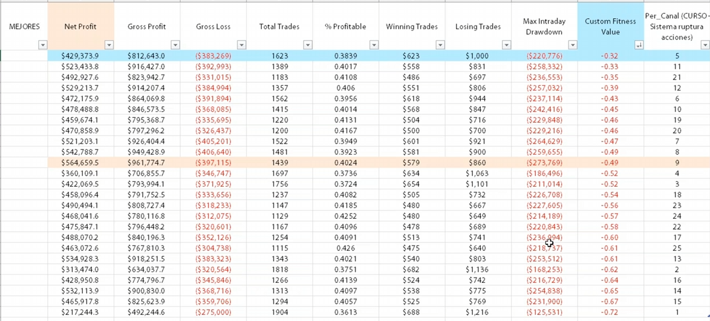

Bueno, se le puede incorporar un **CustomFitnessValue**. Es cierto que aquí necesitamos crear uno propio, ya que el que viene implementado por defecto en *MultiCharts* utiliza un **Sharpe Ratio*e ratio*.
Eso que veis justo en *Fitness Value* realmente es el **Sharpe Ratio*e ratio*, ¿de acuerdo?
En su momento habíamos pensado en usar el *Sortino ratio*, pero finalmente no lo hicimos porque este ya está incluido por defecto.
Así que utilizamos ese valor para el *Sortino*, y ahí fue cuando nos dimos cuenta de que no era un cálculo a nivel de *portfolio*, sino de *sistema individual*.
Por lo tanto, los datos que devuelve no son correctos.

Aun así, para este ejercicio sigue siendo un dato útil. Creo que la lectura que ofrece probablemente es extrapolable y resultaría bastante similar en caso de aplicarse correctamente al *portfolio*, pero técnicamente no lo es. Cuando trabajas con un portafolio, hay que tener en cuenta que existen reglas de prioridad: el motor de *Portfolio Trader* evalúa barra a barra, pasando todos los sistemas por cada una de ellas, y luego aplica las reglas de gestión monetaria definidas a nivel global.

Por eso, el **Sharpe Ratio*e ratio*, el *Sortino ratio* o cualquier otra métrica de rendimiento no pueden calcularse sistema a sistema. No se suman. Deben calcularse sobre el rendimiento consolidado del *portfolio*.
Y eso, actualmente, no está implementado en la plataforma, así que habría que programarlo manualmente. No lo habíamos notado antes; pensábamos sinceramente que ya lo hacía. Pero no, y por tanto hay que volver a construir este cálculo del **Sharpe Ratio*e ratio* desde cero.

De todos modos, para el objetivo actual, nos sirve. No nos da el **Sharpe Ratio*e ratio* real del *portfolio*, es decir, hoy no conocemos ese valor exacto, pero sí es válido como referencia comparativa entre *sets* de parámetros —por ejemplo, para determinar si el canal de 8, 10 o 14 funciona mejor—. En ese contexto, sí consideramos que tiene relevancia.

Lo explico así con total franqueza para que se entienda el motivo de este valor negativo que aparece.
Tiene sentido porque no es el **Sharpe Ratio*e ratio* real del portafolio, sino la media de los ratios de los sistemas individuales, lo que distorsiona completamente el resultado.
El cálculo correcto debería hacerse sobre los rendimientos agregados del *portfolio*, aprovechando la diversificación que aportan las distintas acciones entre sí.

Aun siendo el mismo sistema, ya se aprecia que existe cierta descorrelación entre los componentes del conjunto.
Por supuesto, es algo que puede mejorarse, pero aun así muestra una ligera pero relevante diversificación interna.

---

Bien, los datos de la imagen *003.png* son los resultados obtenidos al optimizar únicamente el canal de Donchian en el periodo *in sample*.
Esta es la misma optimización mostrada en el Excel, pero recogida solo para el *in sample*.

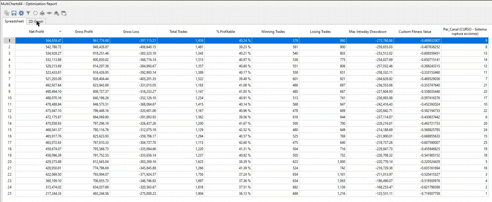
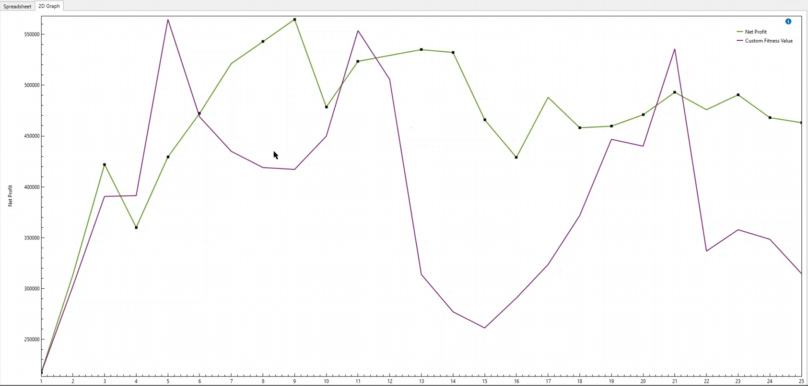

De acuerdo, aquí lógicamente solo tenemos una variable y, por tanto, no podemos generar un gráfico en 3D, pero sí en 2D. En el eje izquierdo tenemos el `Net Profit` o el `*Sharpe Ratio*e` —este **Sharpe Ratio*e falso*, como lo llamaré para que se entienda—, que, aunque su valor absoluto carezca de sentido, creemos que a nivel comparativo entre *sets* sí tiene relevancia. Y también está el *Net Profit*.

En realidad, aquí no existe una *función fitness* como tal, porque se incluyen todas las combinaciones posibles: solo hay 25, y por lo tanto se muestran las 25. 

La *función fitness* es necesaria únicamente cuando hay que elegir entre muchas alternativas —por ejemplo, si tengo 1.000 combinaciones y quiero quedarme con 200, necesito un criterio para decidir cuáles conservar—.
Pero si voy a conservarlas todas, entonces la función *fitness* es irrelevante.

En este caso, si quisiera analizar los datos en Excel, podría calcular cualquier métrica adicional directamente a partir de los resultados de cada optimización. Por tanto, no es necesario definir una función *fitness* específica. Esto suele ocurrir cuando el número de variables o *inputs* es pequeño, lo cual facilita el análisis.
Aquí, de momento, hemos definido tres *inputs* posibles, aunque solo estamos trabajando con uno para centrarnos en evaluar la *entrada*, sin que los resultados se vean afectados por las *salidas*.

En otras palabras, dejamos la salida estática, con el filtro de volatilidad desactivado (`0`) y la salida por *trailing stop* fija en `0.20`, de modo que no varíe. Así podemos observar de forma aislada el comportamiento del canal dochian por sí solo.


Tenemos por un lado como veis el dato `insample` 

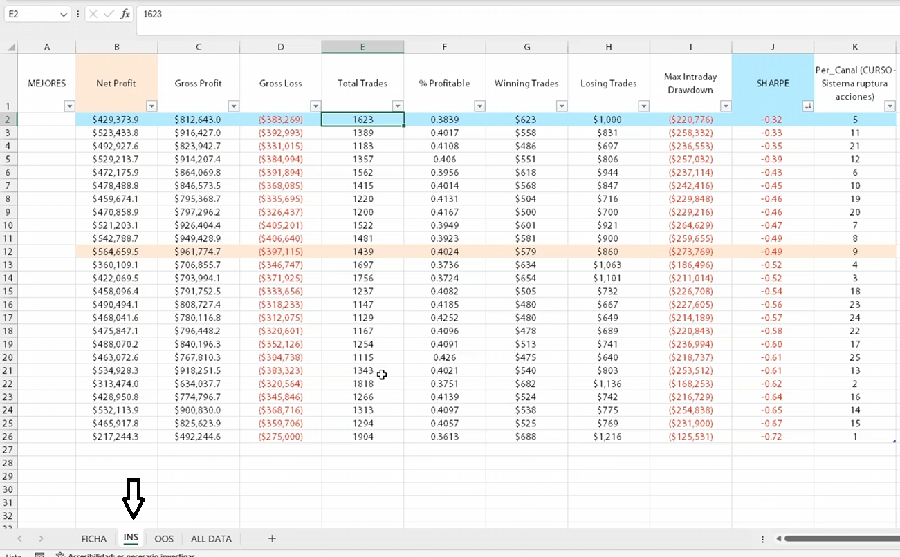

en el dato en sample aquí   


ya estamos viendo que en el gráfico que se aprecia claramente que en el retorno , que es el **verde**, hay bastante estabilidad, y marcamos esa zona aparentemente bastante buena con bastante estabilidad del insample, y en el *share* la **lila** podemos decir que hay estas dos tres zonas con picos muy altos y un pico cae dentro de la zona marcada del retorno.

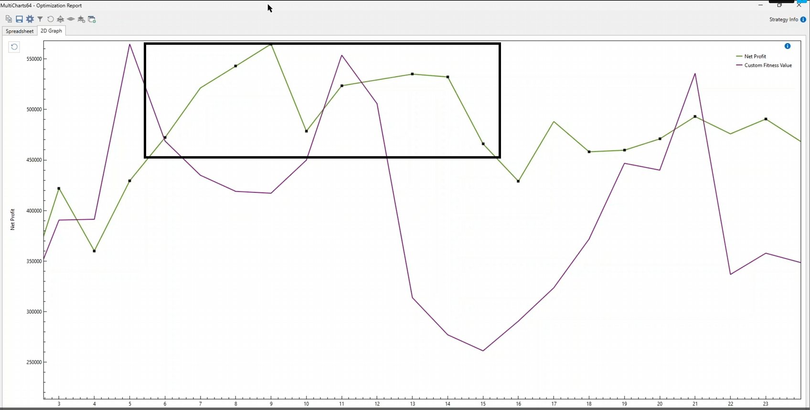


vamos a ver el mismo en **out of sample** siempre es el que nos da más información... aquí también hubiera sido interesante que en esa práctica no la no la hemos hecho pero si al final fuéramos a operar haríamos esta misma optimización invertida, lo explicamos que nos gusta mucho este ejercicio es decir hemos hecho insample de 2007 a 2018 y a outsample de 2019 a 2024 así simplificando mucho pues bueno esto total eran unos 17 años 17 años vale pues hacemos más o menos entre 4 y 5 pues haber hecho de 2007 a 2011/12 dejarlo esa parte outofsample y hasta ahora insample, al revés, outofsample al final y outofsample al principio y luego comparar el outofsample que os sale de esa manera que os sale de la otra y coger esa esa información porque cuando salen iguales eso sí que es una prueba fantástica de robustez. 

porque en un sistema tendencial como éste es verdad que hay 100 acciones todos estos datos al final hay mucho sesgo de muestra la práctica hablamos mucho mucho de ello si yo tengo un activo como esta 

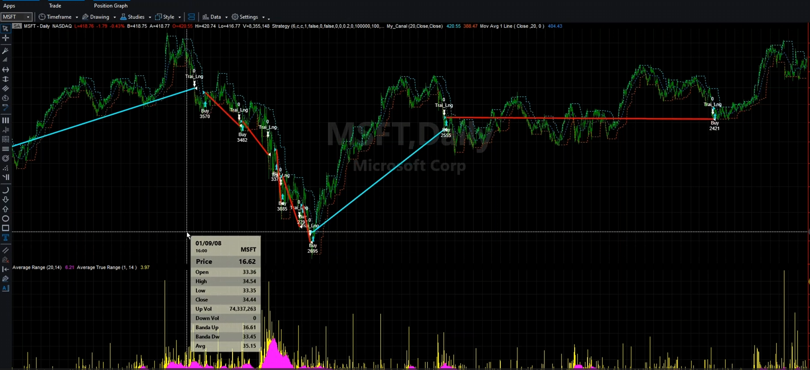

aunque es verdad que este caso ya está en este caso creo que aplica bien aplica bien porque tienen en el periodo el insample que empieza en 2007 nada más empezar pues tienen la crisis de la crisis del 2008 2009, aquellos pues que ya estuvieras en el mercado recordaréis. Es interesante esta esta mezcla porque ese ese mercado sí que es común puede haber acciones que tengan otros porque no lógicamente las 100 no tienen la beta que tienen microsoft o que tiene apple o netflix que son acciones que tienen bastante beta con el mercado pero pero claro la mayoría la tienen la mayoría la tienen y por lo tanto ahí sí que en esas crisis sistémicas de 2008 2009 y el tema del covid 2020 ahí sé que cayeron todas, de acuerdo? o para todas se me entiende prácticamente todas .A nosotros nos gusta mucho hacer esta doble este doble juego por delante y por detrás del outofsample.

---


tenemos el gráfico, prácticamente a medida que la **linea verde** aumenta va degradando.   
Es verdad que el outofsample aquí plantea cierto problema que tampoco lo es tanto al lado del insample porque menos operaciones por lo normal... pero ya vamos viendo que la parte baja del canal aunque en este caso por ejemplo el outofsample con **valor 1** (ultima columna primera instancia) lo hizo bastante bien de hecho el que más dinero gana y a medida que va aumentando el canal va perdiendo va perdiendo rendimiento teniendo insisto el trailing fijo 
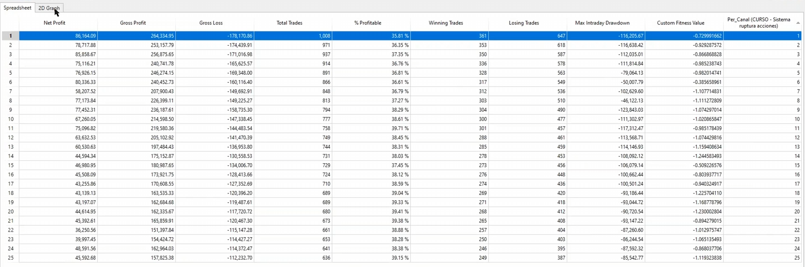

aquí vemos el pico claro sobre todo el `*Sharpe Ratio*` es aquí en 6 vemos un pico que es verdad que hay un salto importante al 7, 5, 6, por ahí podía estar podía estar bien.

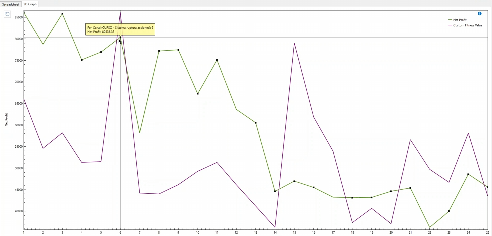

vamos a acabar de ver el all data 

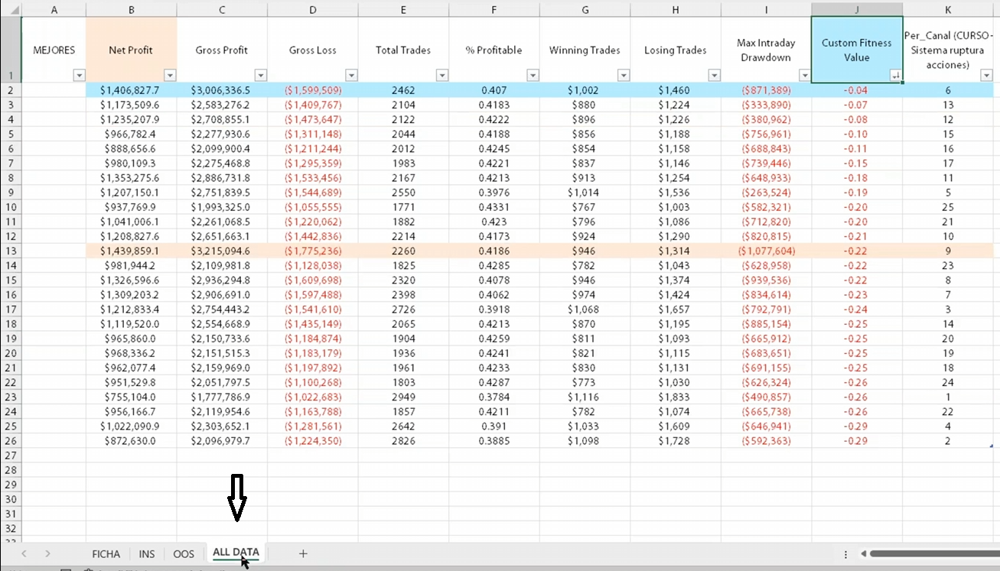

uniendo los dos porque al final ahí se incorpora un poco todo y donde además tenemos una muestra pues que ronda las de 2000 operaciones las 2000 operaciones fijaros que ahí pues bueno estamos en esa zona de 6 y 10 

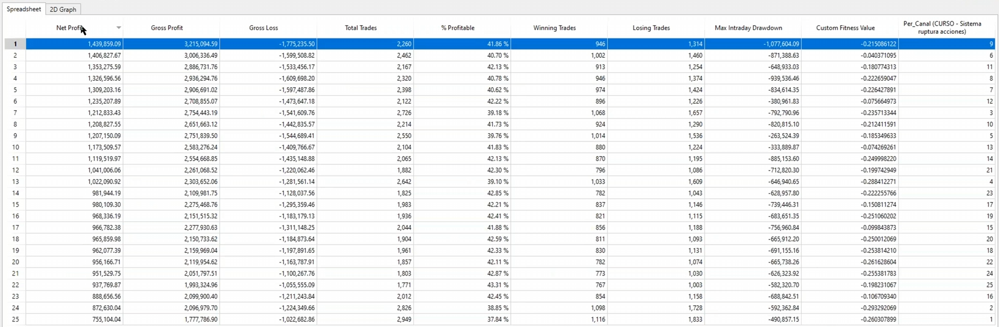
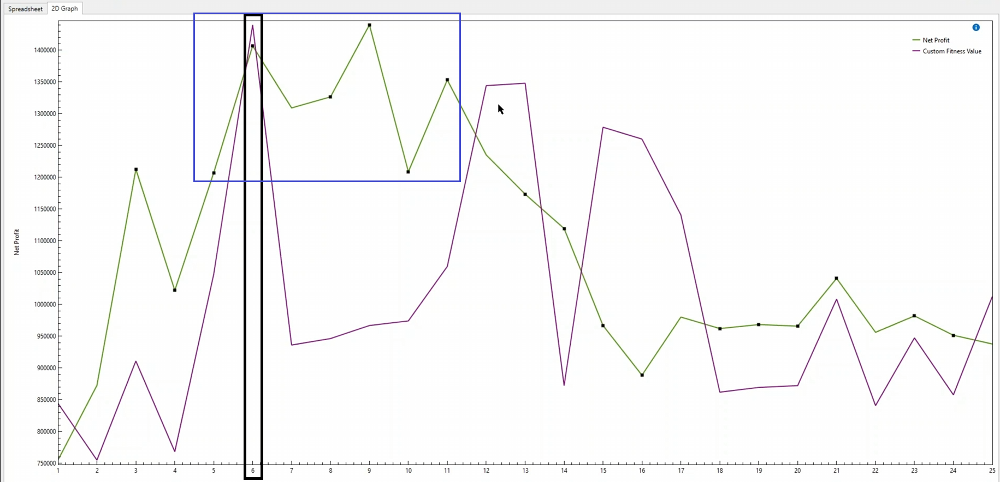


Es bastante estable, el DONCHAIN en sí es bastante estable fijaros que la zona podemos decir que... luego lo veréis optimizado todo todo junto ya lo veremos... pero es bastante estable canal de noche es bastante es bastante estable y en esta zona entre 5 y 10 pues está ahí bastante estabilizado. Aquí para irnos para irnos para elegir uno de momento de cara a evaluar la salida, pues he cogido el 6, podríamos haber elegido otro, de acuerdo? es decir no tiene no tiene tampoco una brutal importancia en este este momento de acuerdo? pero el 6 me ha parecido un buen equilibrio y es el que he decidido bloquear para evaluar la salida. Luego ya veremos un performance report de todo de todo esto puesto en conjunto. 

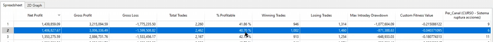

El 6 fijaros que al final tienen 2462 trades, 40% de aciertos, típico, típico tendencial, vale? luego ya veremos más datos porque aquí simplemente pues nos sirve a nivel de compararse de acuerdo no nos sirve de mucho más 

¿como hemos evaluado el cómo hemos evaluado el trailing? como os digo bloqueando el 6... ahora os muestro el excel de esta segunda optimización 

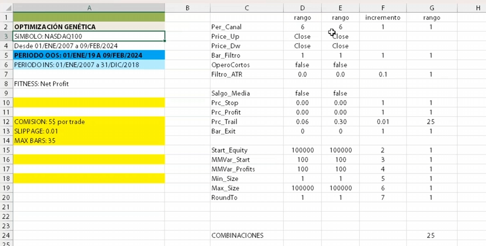

simplemente aquí pues lo que os digo es la misma cantidad de datos las mismas cien acciones bloqueamos el canal en 6 y dejamos oscilar también 25 incrementos `Prc_Trail - rango entre 0.06 y 0.30` el trailing, hemos puesto 25 en uno y 25 en el otro, para que tuvieran la misma capacidad de variación 

aquí tenemos los datos in sample 

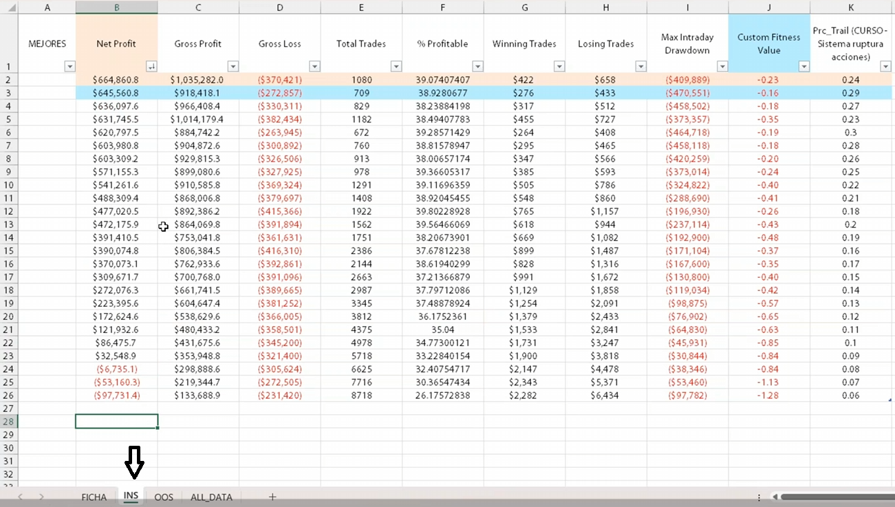

aquí sí que se aprecia claramente que los datos bajos deteriora muchísimo es decir el trailing realmente deteriora mucho a la medida que lo acercas mucho claro estamos hablando de un sistema tendencial opera muchísimo 7000 6300 trades se lo lleva todo en comisiones y sale demasiado rápido realmente no tiene no tiene sentido habría que verlo evaluado desde bastante más arriba como mínimo mínimo 0,10 y 0,15 y hasta más de 0,30 quizá para verlo (hablando la columna **K** refiriendonos de la columna **B** net profit)

porque al final lógicamente estamos en diario lo que quiere es que corran los los beneficios pero nosotros también nos interesa protegernos y protegernos de las caídas de acuerdo que es el problema al final lógicamente si evaluamos solo net profit va a querer mantenerse dentro por eso hay que evaluar alguna cosa más y aquí tenemos este ratio de *Sharpe Ratio* que no nos de una buena lectura nos sirve para este cometido que os digo 

y vamos a ver el in sample 

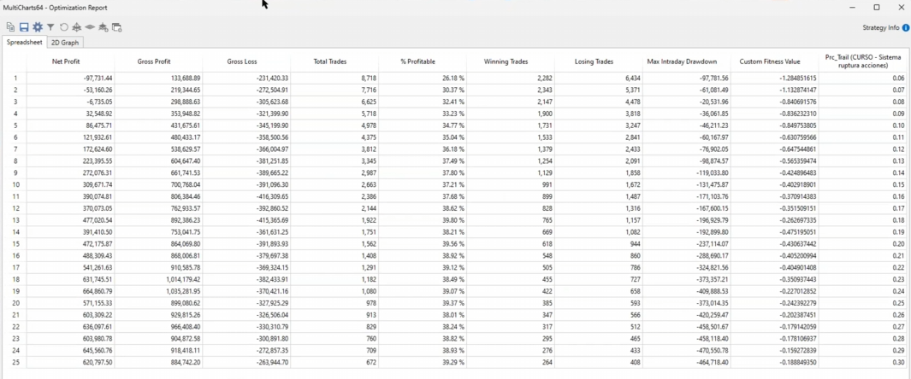

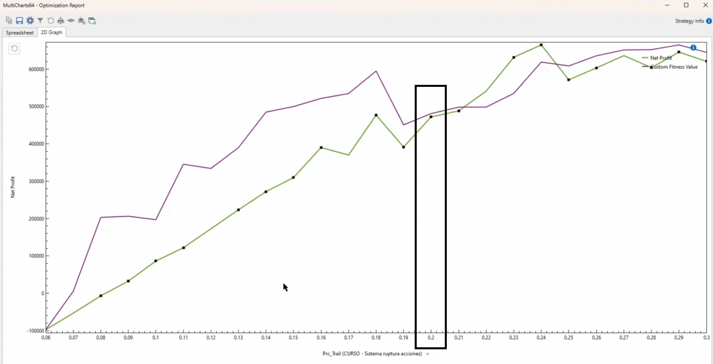

este en este perfil es bastante distinto a la anterior porque en el anterior el donchain era bastante bastante armónico porque todo el rango mostraba cierto rendimiento y aquí pues claramente no es así tiene los valores bajos pues prácticamente no tiene sentido hasta que no llega a la zona de 0.20, 0.20 y algo, nos estabiliza en un cierto rendimiento lo cual pues como os digo habría tenido sentido dejarlo ir un poquito un poquito más, un poquito más, pero bueno lo hemos dejado ahí está hasta el 0.30 que ya creo que es suficiente, bueno ahí habéis 0.20 está bien es el que habíamos puesto antes por la que habíamos visto la evaluación preliminar la zona de 0,20 pues puede estar bien la verdad que 0,20 de momento no apunta a ir a ir mal. 

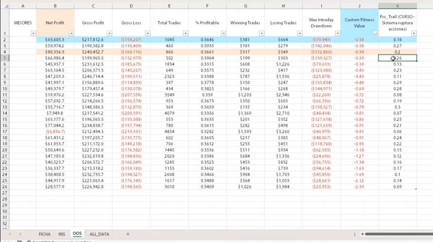


si miramos el *out of sample* y nos fijamos fijaros que ya por este "*Sharpe Ratio* falso" (columna **K**) instancias 0.18 0.27 0.26 esa zona y si nos fijamos en net profit ordenado pues clava el máximo 0.20 0.21 0.26 0.18 es decir más o menos la misma la misma zona . Vamos a ver este este gráfico 

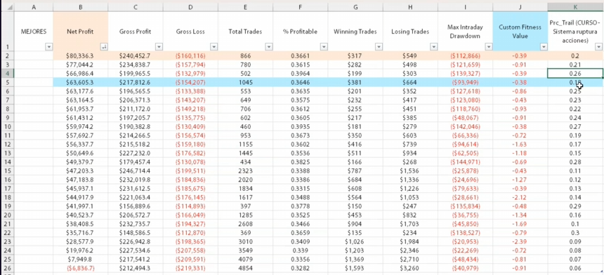

Vamos a ver este este gráfico 

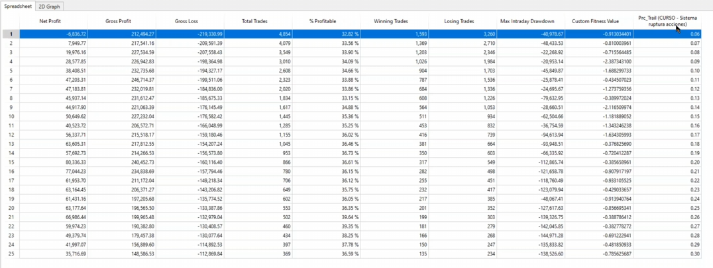
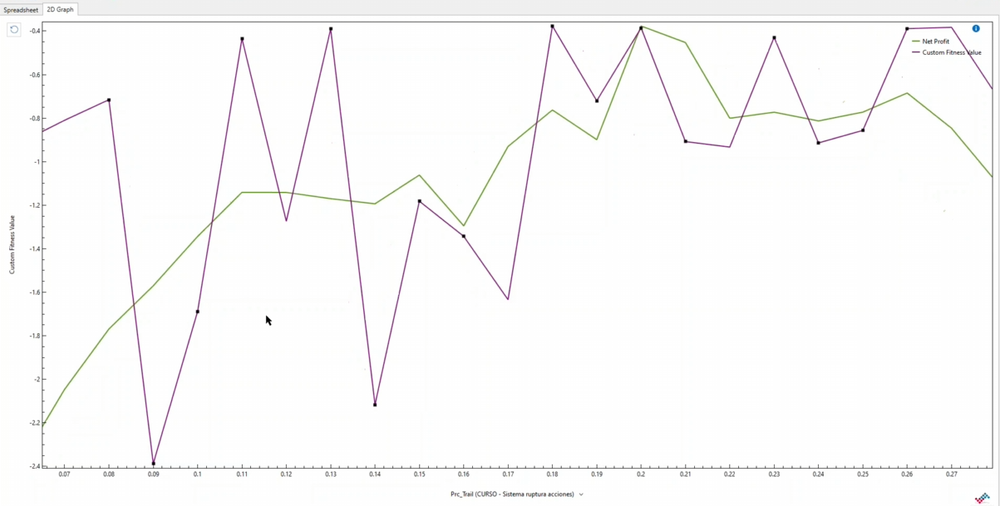

vemos aquí el gráfico pues lo que veis, claramente los las partes bajas pues este especie de *Sharpe Ratio* sí que es bastante volátil pero ya veis que no es estable es el clásico ejemplo donde se ve que no es estable que varía mucho que puede tener un valor bueno pero lo siguiente no etcétera y habéis que en la parte final sí que estabiliza y estabiliza en valores en valores altos, veis claramente entre 0.20 0.25 todos son valores buenos todos son valores buenos y donde además recogemos una cantidad importante de trades estamos hablando todavía en este dato fuera de muestra *out of sample* de 900 800 trades de ese orden (mira las columnas K en la instancia 0.2 su columna trade) 

y si ya recogemos los dos unidos 

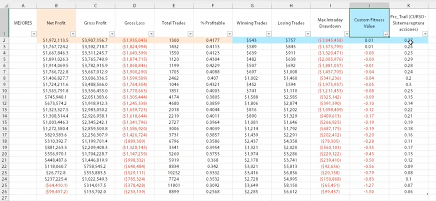

pues nuevamente tenemos que se va muy arriba en 0.27 (columna K instancias de profits) el que más tirando hacia arriba 0.27 0.26 0.25 bastante bastante alto pero aquí a ver que os la abro este gráfico 

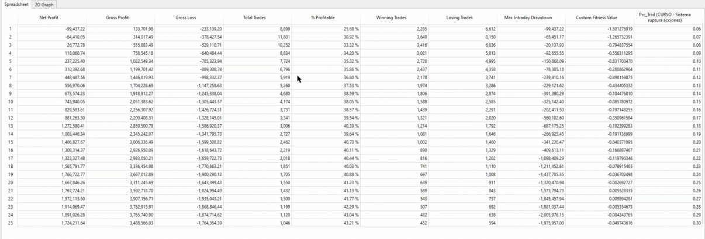
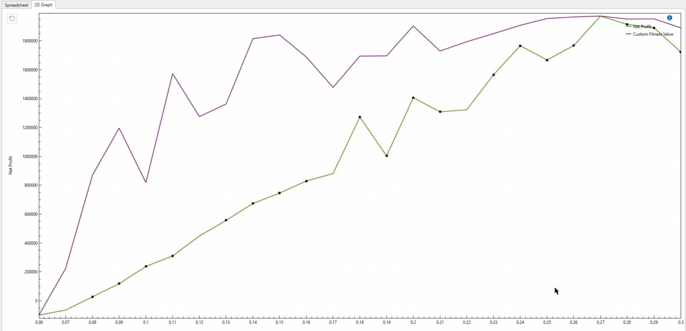

es el que tienen más trade si por lo tanto es el que está pues más más estabilizado pero aquí se aprecia actualmente esta tendencia que ya veía bien veis en el insample, bueno pues a partir de 0.20 podríamos haber elegido uno uno más alto pero al final hemos preferido bloquear el 0.20 aunque repito podríamos haber cogido otro si os fijáis aunque los que dan mayor datos 0.26 0.25 también el 0.20 fijaros que tiene el doble de operaciones 

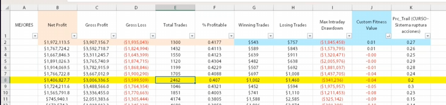

siguen manteniendo mantienen bastante buen equilibrio de acuerdo se está bien acompañado se nota que hay bajada que vuelve a subir es decir bastante estabilizado y tiene muchos trades nosotros en este tipo de situaciones solemos tirar siempre a más operaciones solemos tirar más a más operaciones porque nos tira mucho la significación estadística, entonces aquí aunque estemos hablando viendo mejores resultados en profit con 1500 trades con 1300 trades la zona de 0.25 por ejemplo, porque tampoco lo granularíamos demasiado esto a 0.26 0.27 0.20 0.25 podríamos también haber elegido perfectamente estos quee están bien tiene un mejor resultado pero tiene como veis 900 trades entonces siempre que estamos ante esa dicotomía siempre cogemos más tradse siempre cogemos más trade aunque suponga un poquito menos rendimiento porque porque más trades significa mayor significación estadística y también significa mayor respuesta ante cambios en el mercado aunque gana mucho menos nuestra eeccion de 0.2 fijaros el drawdown que es bastante bastante menos 

si tiene sentido hacerlo porque realmente como hay gestión monetaria hay un 2 por ciento y las salidas son porcentuales realmente el capital está bastante ecualizado aunque no sea en porcentaje de acuerdo pero aún así no nos convence del todo que no sea en porcentaje de acuerdo? pero no nos convence del todo... pero bueno ya digo que no no está mal tampoco hacerlo está mal... 

La columna añadida **L** es lo que mucha gente llama un recovery factor que es net profit partido por por drawdown

*All data*
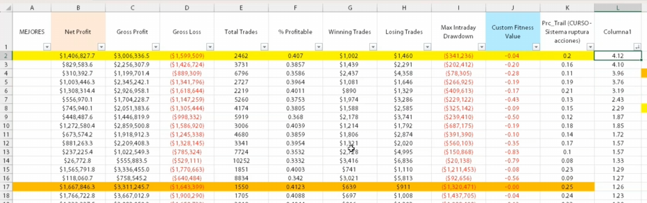

la verdad con los datos que tenemos aquí pues es de las pocas cosas que podemos hacer de acuerdo y pues podrías podrías hacerlo y como veis 0 20 es el que mejor que acualiza sin haberlo hecho pues ya ya veis ya veíamos que esa zona es la que la que equilibra porque porque tiene muchas operaciones y tener muchas operaciones normalmente mejora la respuesta ante ante hablando de un tendencial hablando de un tendencial mejora mejora la respuesta ante caídas y demás, claro, hay que estimar bien los costes de acuerdo? hay que estimar bien los costes porque dices tú estimas que prefieres operar mil trades más pero eso solo te va a servir si has estimado bien los costes y si realmente tienes un tik de deslizamiento podrías hacer ahí también una prueba de sensibilidad deberías de mirar bien esto y probarla también en dos tics "es decir bueno pues mira no lo tengo claro voy a volver a hacer la optimización con dos tics en vez de un tic a ver qué tal a ver cómo lo veo" de acuerdo? y si ves que no lo ves claro pues podrías entonces decantarte más al 0.25 ; Pero nosotros aquí nos quedaríamos con el con el 0.20 porque 2400 operaciones con dos inputs solo además optimizados de manera separada está realmente realmente bien que es esto luego no quiere decir que lo operamos en las 100 acciones de esto ahora perfectamente podríamos luego pues operar las 10 acciones de mayor capitalización por ejemplo por elegir un criterio no debería de operar las 100,  también podría hacerlo pero que no es obligatorio no quiero decir que esto lo estamos haciendo para validar la estrategia para tener una mayor significación estadística pero no es obligatorio que luego en nuestro plan operativo o usemos todas las acciones 

pues aquí hemos bloqueado 0 20 

*in sample*
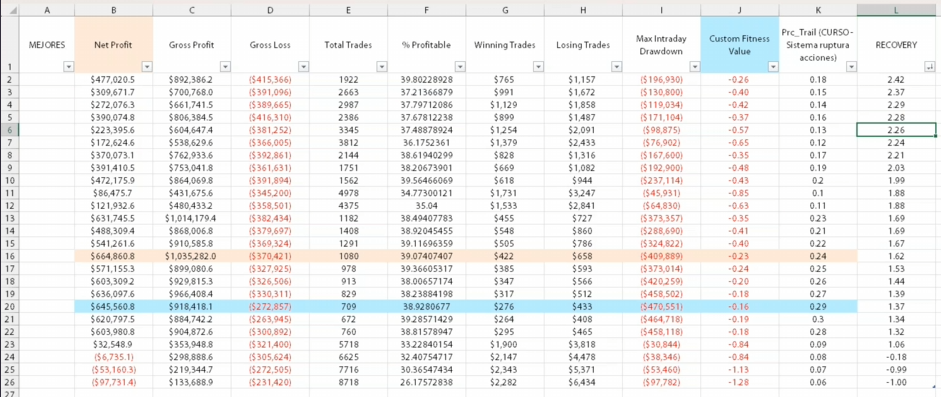

0 20 está a mitad de a mitad de tabla en el caso *out of sample* 

*Out of sample*:  
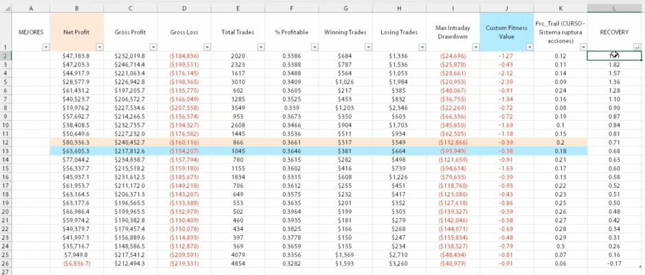


**filtro volatilidad**


vamos con la tercera. La tercera hemos ido a probar un filtro que es totalmente opcional y no es obligatorio, pero hemos querido ver, hemos querido ver porque queríamos introduciros un filtro volatilidad aquí para un tendencial y así pues ya explicároslo, pero como digo no es obligatorio, pero lo hemos probado. Bueno, para ver un poco cómo oscilaba, que este sí que teníamos muy claro que no le íbamos a dejar este nivel de granularidad, pero queríamos ver un poco, queríamos analizar cómo se movía, se movía el tema de acuerdo, y hemos dejado el 6 fijo, hemos fijado el 20 y hemos dejado el filtro ATR que es el multiplicador.

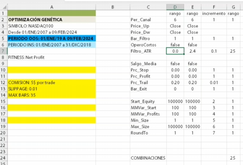


ahora os voy a enseñar en el gráfico. Ha quedado claro. También hemos dejado oscilar 25, vale. Esto, esto cómo funciona, vale, esto cómo funciona?

En el gráfico, aquí abajo, fijaros, tengo dos ATRs pintados: es el de 22. ¿Por qué 22? Bueno, porque es un mes más o menos, sin más, no lo hemos optimizado. Al final lo que queremos es ver si la volatilidad va a variar, nos hace un filtro. Volatilidad lo que hace es comparar la volatilidad actual con la volatilidad de x periodo. Hay varias maneras de hacerlo: eso que te crea la desviación estándar, hay algún estudio con el VIX que espero en el curso poder mostrar alguno, de acuerdo, con la curva del VIX, método poco avanzado y creo que no tocaba en este momento del curso, y este es un método sencillo que al final tiene bastantes… aporta, aporta valor. Aporta más valor en los sistemas de ruptura y a tendenciales que no en tendencia pura, pero bueno, lo hemos querido meter para explicároslo y ya está, y se puede usar.

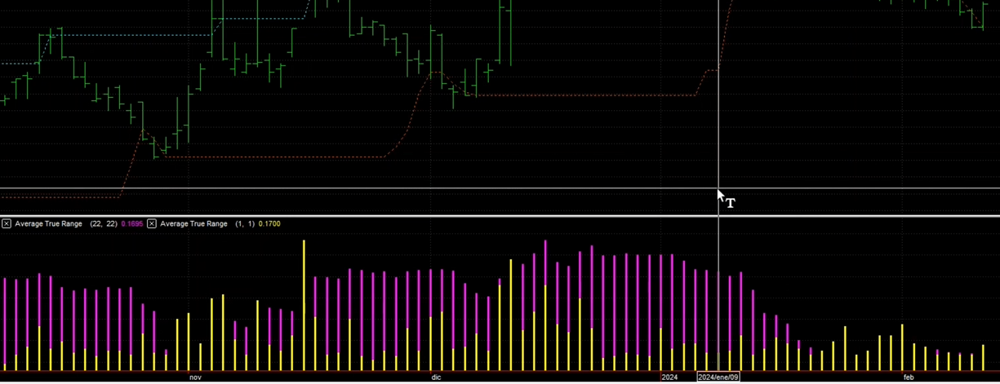


simplemente comparar, lo que os digo, la volatilidad actual —la volatilidad de hoy, de la vela actual, es Apple— y pues la volatilidad de hoy es la barra amarilla, con la volatilidad media del último mes. Como veis es bastante más alta, es decir, está haciendo todos estos últimos días, como veis, está teniendo una volatilidad baja, de acuerdo, para su volatilidad media del mes. Y esto es lo que evaluamos simplemente, de acuerdo. Ese filtro consiste en el código simplemente en que, si esa volatilidad por un multiplicador —que vamos a suponer que es uno, vamos a suponer que el multiplicador es uno, con lo cual no es importante decir que es la volatilidad— si esa volatilidad de hoy es menor que la volatilidad de todo el mes, si eso se cumple, es decir, si la volatilidad de hoy es menor, entonces puedo operar. Si la volatilidad es mayor, no.

```sh
//Filtro de volatilidad
If Filtro_ATR > 0 then
	Condition1 = TrueRange < AvgTrueRange(22)[1] * Filtro_ATR
else
	Condition1 = true;
```

esto es el filtro podemos decir natural para ir largo en tendencia, porque normalmente sabemos que el mercado sube con poca volatilidad y baja con más volatilidad. Entonces, cuando la volatilidad está alta, normalmente —por eso está el filtro así— lógicamente habrá veces que no, pero normalmente el mercado está nervioso, el mercado está tenso y así no se sube, de acuerdo. El mercado tiende a subir tranquilo. Es verdad que cuando hay una vuelta del mercado bajista, pues ahí esto puede hacerte… este filtro que a lo mejor tardes un poco en volver al mercado hasta que no se tranquilice, pero bueno, pues perfecto. No, al final lo que hace es tratar de eliminar operaciones cuando hay volatilidad elevada, es decir, cuando la volatilidad de hoy es más alta que la media.

podría incluso probarse con más, que en vez de la del mes fuera la del trimestre. Es decir, estaría bien, es decir, estaría bien porque a lo mejor “es que no, yo sabes que como voy de largo plazo prefiero evaluar contra la volatilidad de más periodos”. Lo podemos, lo podemos mirar. Hemos hecho con un mes, pero hubiera tenido perfectamente sentido hacerlo con más. Con lo que os digo, porque al final, pues yo que sé, vais a ver que se vuelve mucho más tranquilo. No le pongo pues 60 días, por decir algo. 60 días es que, pues, se vuelve más estable, de acuerdo, se vuelve más estable. Seguimos teniendo una volatilidad baja pero se vuelve un poquito más… bueno, más como decirlo… más rígida.


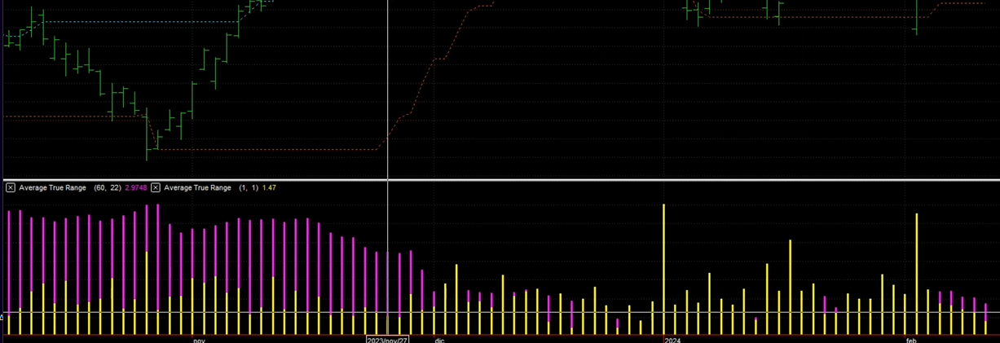


no, pero al final tiene más periodos recogidos, entonces tendría las dos cosas sentido y habría que evaluar un poquito muchas acciones.

he dejado el *Filtro_ATR* (excel) de 0 a 2.40 por dejar 25, pero ya os digo que no en este caso no le vamos a hacer; queríamos simplemente analizarlo, ver un poco el mapa.

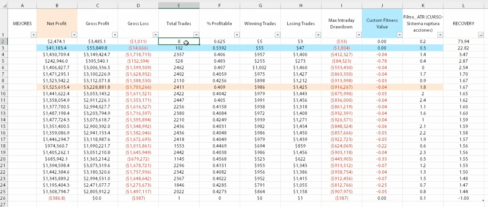

y ese 73.94 (**L**) fijaros es el clásico ejemplo de poca significación estadística. Este, con un 0.2 multiplicador, pero tampoco… que realmente no opera nunca. Entonces bueno, no, lógicamente no tiene sentido. En la columna ATR con cero, con cero para que lo tengáis en cuenta, equivale a no usarlo. Es decir, cero, este valor que os marco equivale a no usar filtro. Es la versión sin filtro y da un recovery de 2.54. Aquí coloca muy bien.

hay alguno que coloca ligeramente mejor —ligeramente, sí, no, incluso bastante mejor— pero también el no usarlo queda bastante equilibrado. Vamos a ver el mapa, vamos a ver el mapa en *in sample*.

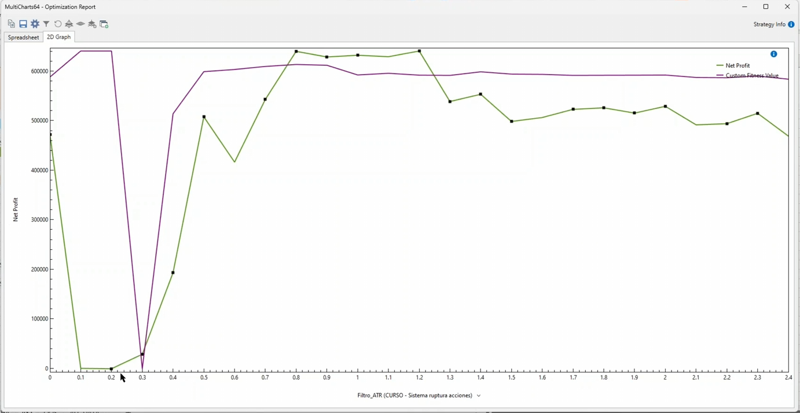

aquí el 0.1, pues, queda esta bestial bajada y a partir de ahí, pues a partir de 1, estabiliza mucho por *Sharpe Ratio* y sí que aquí, entre la zona de 0.9, 1, 1.1, es donde tienes… es decir, en 1, de acuerdo. Ahí está claro que nos quedaríamos con 1, que es lo que os decía. Este realmente nunca lo dejaríamos así. Lo podemos usar en 0, en 1, en 2, si me apuras un 1 y medio, vale. 1 se suele hacer así: el ATR, un ATR y medio, 2 ATRs, 3 ATRs, de acuerdo. No vamos a ir a 1,3 ATRs, os decía del sentido común y la lógica en cuanto a los incrementos, de acuerdo. No vamos a poner 0,33 ATRs, vale, porque eso es una sobre optimización de manual, de acuerdo, manual.

El recovery —recovery simplemente el nombre, no importa porque no en todas las plataformas se llama recovery— de acuerdo, es net profit partido por drawdown. Vale. Y esto, como el drawdown está negativo, se multiplica por menos 1, se cambia de signo para que no tenga un valor negativo. Pero es net profit partido por drawdown. Vale. Net profit es lo que han ganado los cien —el sistema aplicado a las cien acciones— y el drawdown es el que ha tenido el portfolio. Esto sí que es del portfolio, está bien, de acuerdo, está bien calculado. Por lo tanto, al final, es un buen estimador de retorno-riesgo.

en Tradestation está el TSI, que es justamente este ratio multiplicado por los winners, que es el número, el porcentaje de ganadoras de trades acertados, vale. Es otro ratio que se llama TradeStation Index, que es de este estilo. Vale. Cuando hablamos de las funciones fitness, pues hablamos muchísimo de esto: de retorno y drawdown, y hablamos de retorno-riesgo. De muchos, y os dije que todos tienen mucha correlación y que a nosotros nos gusta mucho el sortino, vale. Trabajé muchos sortinos, ¿os acordáis? Y también nos gusta bastante loopy, vale. Los iremos viendo durante el curso, de acuerdo, los iremos viendo, no os preocupéis.

Aquí me interesa ir introduciendo las cosas poco a poco, y en este sistema tendencial —que acordaros hablamos que es para un perfil de medio-largo plazo, que no necesita una implicación, una dedicación continua, que no quiere estar todo el día pendiente del mercado— pues bueno, buscamos de entrada una estrategia de este estilo y decidimos usarlo por Donchian porque había salido mucho en el curso. Haremos muchas más cosas y veremos distintos ratios, pero al final es un ratio de retorno-riesgo, de acuerdo. Que al final casi siempre son los que son más interesantes, de acuerdo. Ratios de retorno-riesgo. Porque al final retorno es lo que nos interesa ganar, pero el riesgo nos interesa mucho controlarlo, porque cuando uno no controla riesgos se va a tomar viento a la farola. Entonces no queremos irnos a tomar viento del mercado, y sobre todo cuando uno empieza debe fijarse más que nada en el riesgo, porque el riesgo es lo que nos saca de la partida, es lo que nos envía para casa y no podemos permitir que nos envíen para casa, de acuerdo. Eso es lo que no podemos permitir bajo ningún concepto, y por eso es vital, vital, vital controlar el riesgo.


ale vamos al *out of sample* estamos evaluando el filtro estamos evaluando el filtro por si solo habiendo bloqueado el canal habiendo bloqueado el canal en seis que francamente podría haber estado en otro y en 0.20 el tréiling que también habían varios pero sé sí que pues por ahí parecía equilibrar bastante bastante bien 

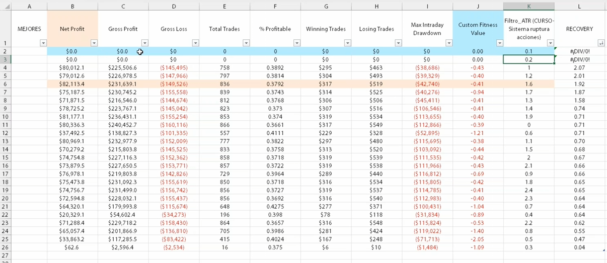

aquí hay combinaciones como habéis visto antes 0.1 0.2 pues el *out of sample* en este caso dan 0 y fijaros tiene divisor por 0 porque es que no llega ni a operar el *out of sample* no no hace no hace trades, pero aparte de eso es que en *out of sample* justo el valor 1 es el que queda mejor colocado en el retorno en retorno riesgo. 

vamos a ver el mapa el mapa 
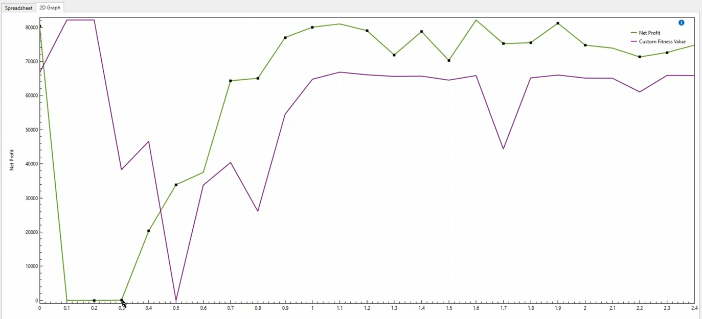

la parte baja pues no vale la pena ni comentarlo y a partir de ahí 0.9 1 1.1 1.2 1.5 toda esta zona que ahí ha cuidado el caso 1.7 veces para que empieza a degradar en la zona de 1 la verdad que está bastante 1 1 2 está bastante bastante cómodo bastante cómodo ahí también aquí en el recovery pues se aprecia poco eso es el recovery al final se aprecia un poco eso el 0 coloca bien en 0 coloca coloca bien. 

---

vamos a ver en el alld data que es donde al final siempre hay más trades por lo tanto más significación estadística y que al final recoge la parte optimizada y la parte no optimizada está bien analizar el old data no penséis que la teoría que lo hicimos al final está bien comparar el sample comparar el sample es muy importante perfil de optimización acordaros y bastante interesante esto de el *out of sample* por delante el *out of sample* por detrás moverlo de acuerdo mover la muestra que es parecido a lo que hace el braque pero nosotros no le hemos puesto nombre pero pero es parecido a lo que hace el braque y pero al final la elección puede perfectamente hacerse con el All data de acuerdo pero siempre que haya significación y que sea concordante con lo que hemos visto en el *out of sample* y el insample final eso es la unión de los dos 

De hecho Kaufman y es lo comparto una cosa es la variación de la cosa y es la selección de parámetros él decía "yo para elegir los parámetros cojo la optimización hasta ayer" solo decía Caudman hasta ayer porque porque me interesa me interesan los todos los datos disponibles yo ya he evaluado el sistema considero que es robusto considero que la franja de optimización imaginaros aquí la zona de entre 6 y 12 por ahí o vale y el trailing pues lo voy a dejar ya fijo en 0.20 voy a ver el canal bueno pues a lo mejor optimizo sólo el canal con 0.20 filtro el filtro en 1 y el trailing en 0 20 y le voy a optimizar solo el canal le meto todo el histórico que tengo y le meto hasta el último día y con eso elijo... puedo perfectamente hacer eso. sería un comportamiento correcto con la idea ya validada con la idea ya validada y considerada robusta y en la zona que yo voy a voy a operar y ahí la elección la haría mirando varios casos miraría sortino de acuerdo? insample outofsample de distintos ratios miraría aquí recovery pero podría hacerlo con el all data y optimizado hasta el último día perfectamente 

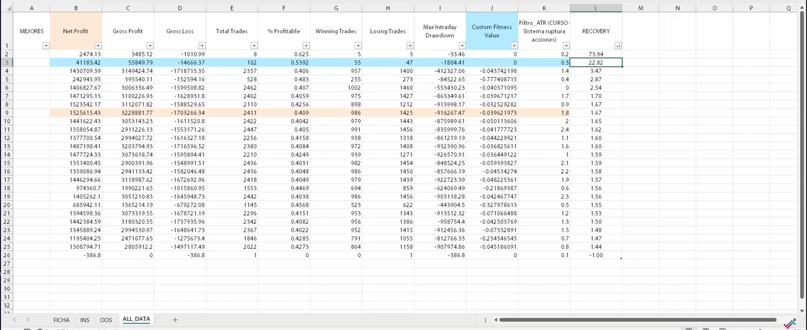

aquí veis lógicamente los primeros con un recovery muy alto porque no operan pero luego pues ya nos vamos a ir 1.4,  0.4, 0... aquí el 1 cae un poquito más nos sale en recovery también puntual de hecho el recovery sale bastante mejor el 0 bastante mejor el 0 que el que el 1. Con lo cual aquí operarlo o no está dudoso está dudoso está dudoso, por qué dudoso bueno es algo que es normal porque eso que os digo en los tendenciales puros es no son los filtros no son tan eficaces donde son muy eficaces en los temas de breakout en los temas de breakout que este lo haremos breakout no hoy lo podemos plantear pero no lo hemos analizado que hemos hablado de él pero como breakout es probable que aporte más es probable que aporte que aporte más aquí es discutible aquí es discutible pero lo queríamos explicar y ver cómo lo hubiéramos analizado que es un poco al final de acuerdo no no metido a saco todo optimizado y a ver qué nos sale no claro lo veremos eso también ahora veremos todo optimizado a ver qué nos ha salido  

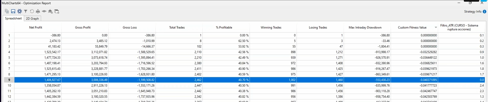

vamos a ver el mapa y lógicamente los valores bajos pero ahí veis a partir de 1 pues queda bastante estabilizado lógicamente el 0 el 0 también está ahí pues bastante alto vale pero aquí eso 0 o 1 de acuerdo no hay no hay más es el es el juego que yo que yo haría un poco el 0 o 1 por recovery aunque es un tanto precipitado no no es tan este no es tan concluyente esto, recovery tampoco es la panacea quiero decir que si recovery no da, pues ya no... no no es así hay otros factores pero se dieron poco los dos candidatos de acuerdo aquí tenemos 2.400 y tenemos 2.200 

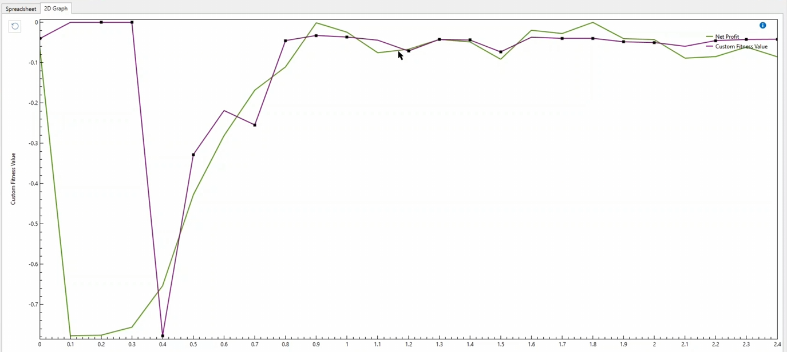

aquí en 1.4 vale en 1.4 

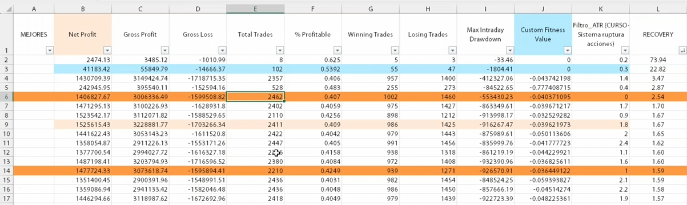

yo aquí francamente con esta información no lo veo muy claro que habría que realizarlo un poco mejor pero sí que perdemos 206 trades... en un filtro es para perder trades... cuidado...si es lo que pasa que fijaros que ganamos un poquito de un poquito de profit pero perdemos drawdown... entonces a costa de ese ese profit no no sales ganando, realmente no acaba de conseguir reducir el riesgo que es quizá donde más debe actuar el filtro de acuerdo? saqué un filtro al final que estoy buscando yo estoy buscando pues evitar trades negativos es verdad que mejora el porcentaje de acierto que es lo lógico pero no mejora el drawdown esto habría que profundizar un poco más 

podemos hacer "maesto" vamos a intentar mirarlo "maesto" había pensado cuando hagamos la pausita de cinco minutos tratar de montarlo y lo podemos lo podemos mirar pero yo con esta información en el filtro la verdad no lo veo bien le he hecho toda junta porque porque quería mostraros el mapa 3d de acuerdo queríamos el mapa 3d y entonces hemos hecho esta opti junta ¿que es la opti junta? pues el canal de 1 a 25 el trailing de 6 a 30 que de 6 hemos visto que no pero por hacer la misma y el filtro 0 o 1  simplemente es decir no o sí pero con uno. también quizá mejor en vez de 22 a mejor va mejor poniéndole más más un periodo mayor, la verdad que no lo hemos mirado pero podríamos podemos directamente mirarlo nos llevaría mucho rato, y puede ser porque a lo mejor simplemente la volatilidad de un mes pues es una comparación demasiado cercana pudiera ser, pero pero vaya así justito, sí que da una cierta mejora pero no en el recovery da una cierta mejora rendimiento pero el drawdown empeora asi que no me no me convence porque -un filtro es sobre todo sobre todo para mejorar el perfil de riesgo- 

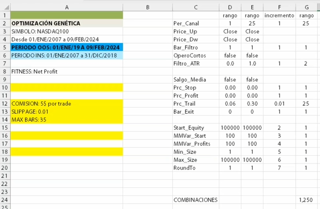

pero bueno hemos hecho esa optimización aquí ya tenemos 1250 combinaciones con las 100 acciones ya es un poquito más intensiva pero realmente por los grados de libertad que hay se podría hacer podría hacer pero bueno yo he preferido enseñaros asi para que la vierais paso a paso vale 

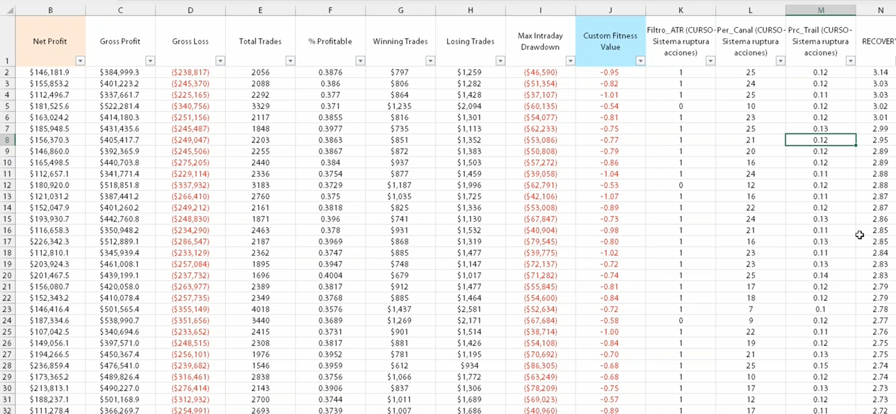

bien tenemos aquí el insample y aquí fijaros que nos da en el insample nos da el mejor el filtro activado 25 (**L**) y 0.12 (**M**) decir bastante distinto lo que hemos elegido en muy distinto.

vamos a ver el mapa de esto in sample aquí podemos ver el mapa en 2d mirando a una variable 

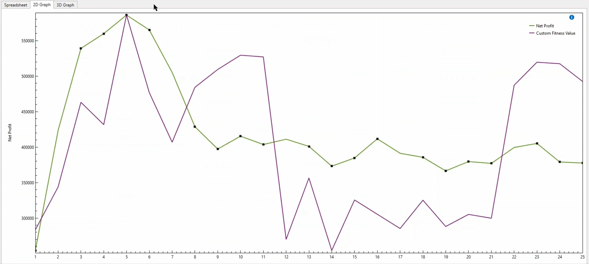

o podemos mirar el mapa en 3d esto sería bloqueando el 1  

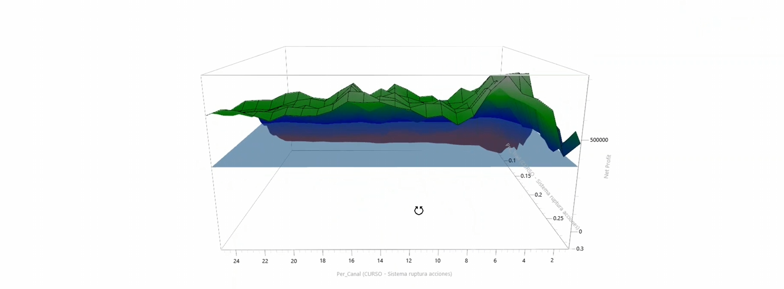

lo que os decía el canal vez canal es muy estable 


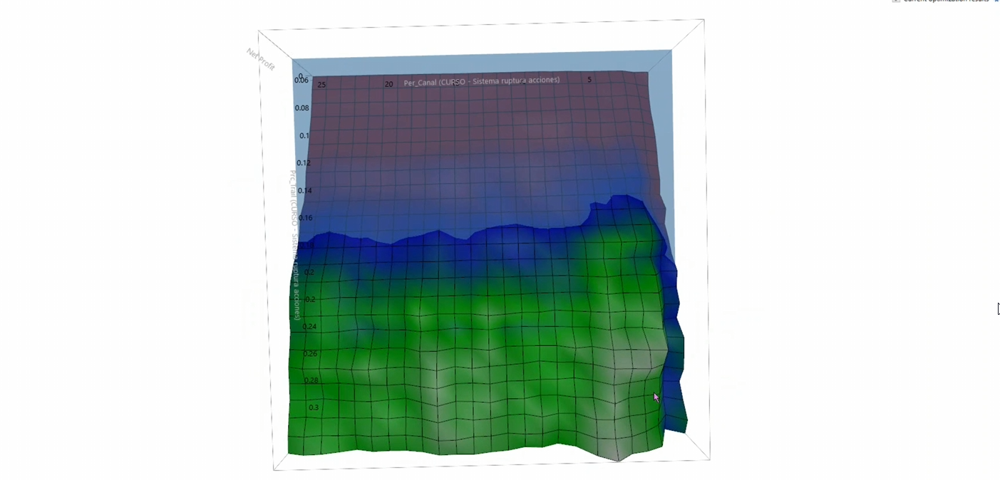
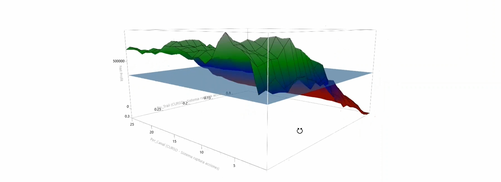
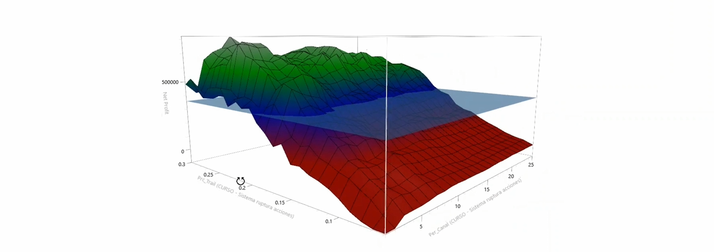

acordaros lo que lo hicimos en excel esto es lo que vemos en excel que ya os lo comenté multichats lo hace porque no tenemos en excel también lo podemos hacer en excel pero multichats lo incorpora es bastante interesante 

aquí en las partes bajas del canal como degrada muchísimo pero a partir de 5 o 6 ya es bastante estable bastante estable 

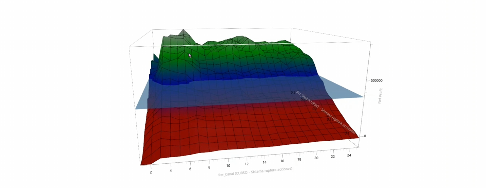


y la **zona del filtro ATR 1 en (0.20)** sí que hemos quedado un poco bajo parece que es más alto pero lo que les decíamos de los trades pero hay que verlo hay que verlo 0 20 está ahí al borde degradar está al borde de degradar está un poquito justito pero 20 es un poquito justito ese es con el con el filtro activado 

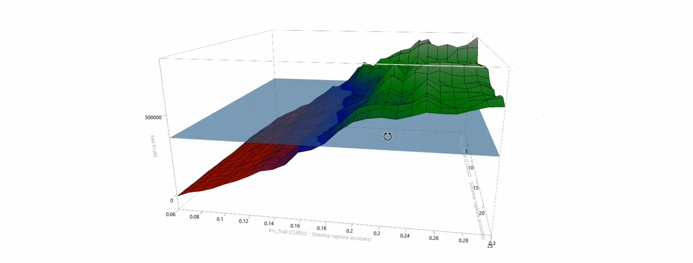
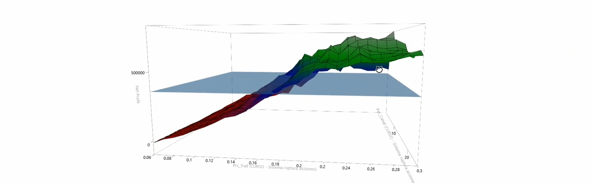
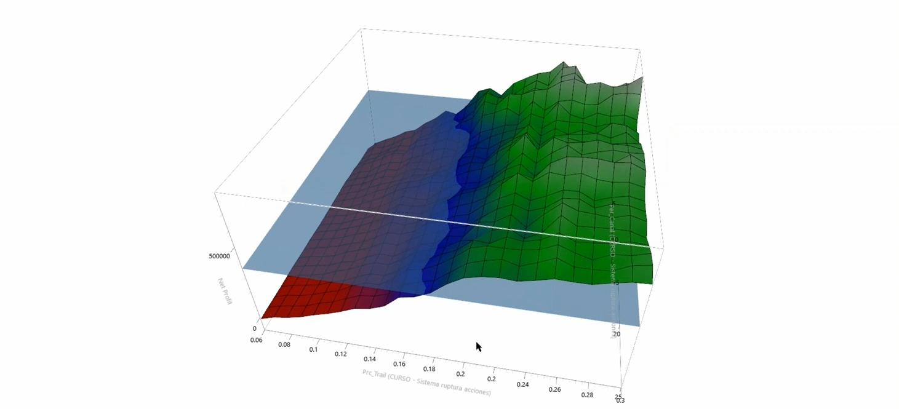

**A partir de ahora** con el **`filtro 0` - desactivado**   

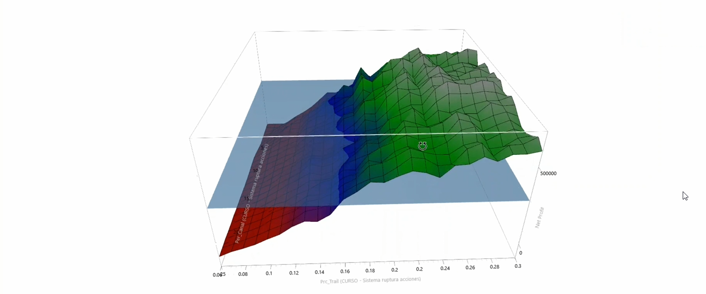

fijaros y con el filtro desactivado parece que alarga un poco más esta zona de 0.2 parece que parece que la llenura llega un poquito más allá 

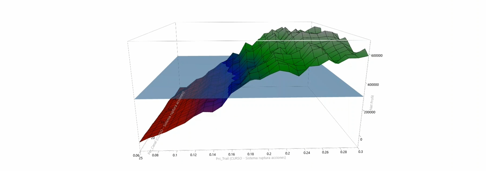

El perfil es muy parecido 


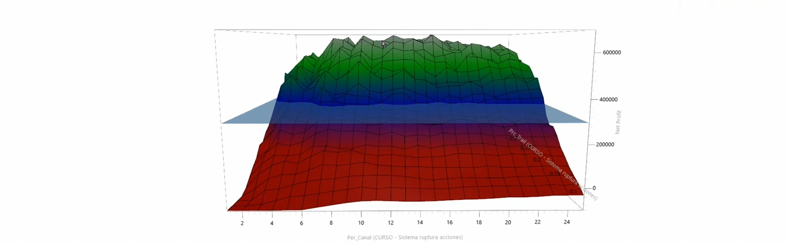

pero ya vemos que todo pues toda esta zona 0.20 0.25 en el caso del filtro y donchian pues ya digo desde 6 7 8 10 20 es decir es muy estable es muy estable tiene pocas pocas diferencias 


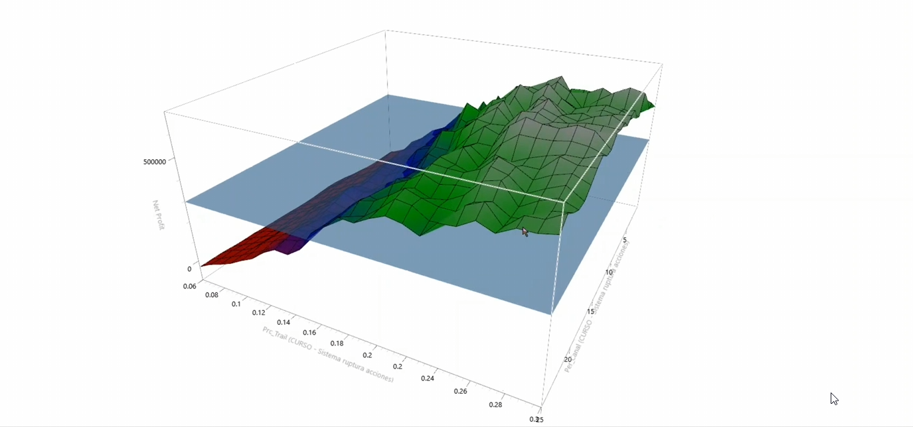

desde 6 7 8 10 20 es decir es muy estable es muy estable tiene pocas pocas diferencias 


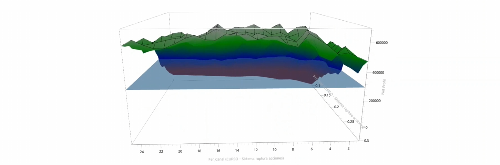
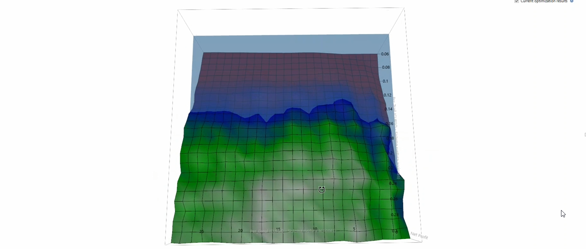


Al final que está indicando lo que muestra es estabilidad está simplemente es estabilidad lo que es lo que queremos esto es lo que llamamos un mapa de optimización que hay muchos nombres en la literatura dependiendo de nombres pues más guays como todos pero esto es el mapa de optimización de toda la vida que hemos hecho que nos vas a ver más sensibilidad de variables a mí que me interesa pues variables que su vez sus vecinos estén bien decir esto es bien esto es bien 

para el lado del canal para el lado del traling `Prc_Trail` parece que degrada más 


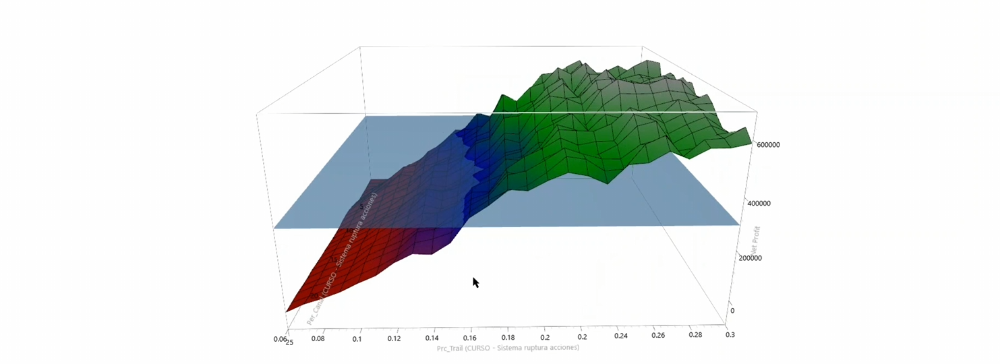


pero tiene un punto falso porque como lo hemos granulado tanto la mente nos esga un poco por eso viene bien el watermark este 

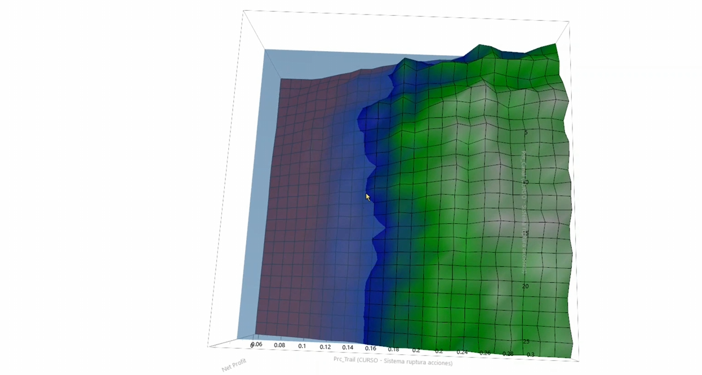


para evitar no ver un poco eso no nos esga pero realmente también es bastante grande la zona también es bastante grande tenemos una zona aquí en el lomo de la parte verde realmente grande que sí que quizás más 0.25 habría que estudiarlo mejor esto yo me he quedado en el 0.20 por lo que os he dicho los trades porque considero tener suficiente margen todavía para caerme mucho pero es verdad que 0 25 se ve más cómodo a nivel de estabilidad se ve más más cómodo y que incluso el 6 lo mismo 

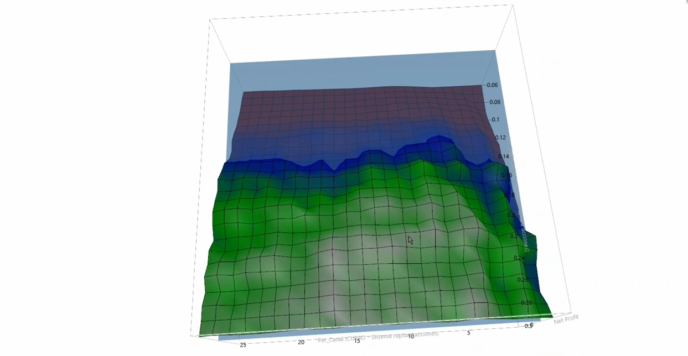

en 6 quizá se ve un poco más cómodo la zona de 15 de 12 12 0 25 quizá parece más estable parece más estable en este gráfico de ese orden pero bueno que estamos en el insample 

vamos ahora al *out of sample* a ver qué conclusiones sacamos aquí 

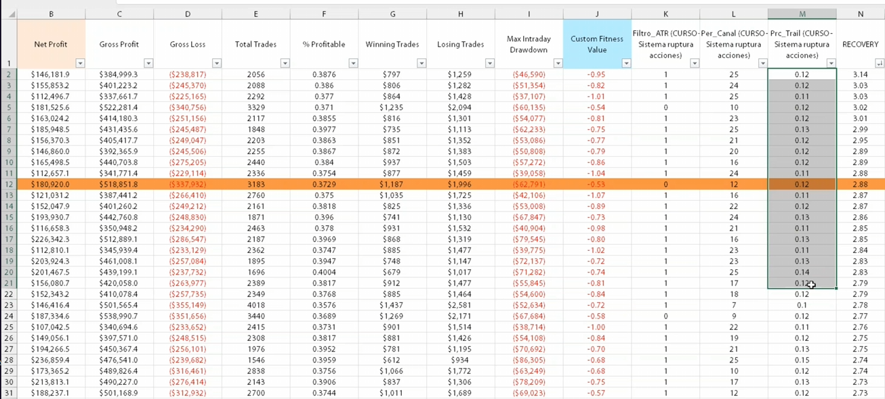


lo que hemos dicho aquí parece en el mapa a mí lo que veo un poquito más estable es esta zona aquí más o menos es **12** es este **12** por ahí 16 pero 0.12 0.11 claro es que hay mucho trailing ahí todos están ahí es en la zona de recovery alto **no 0.12 no! perdón cero 20 pico perdón perdón me equivocaba!** esto es demasiado bajo 


fijaros que ahí nos están saliendo que los mejores da muy bajo 0.12 da un recovery recovery de equilibró entre retorno y riesgo da muy bajo que estamos mirando en el `profit` podíamos mirar también recovery por el recovery no porque no lo no le metió en el modelo podría mirar drawdown por ejemplo vale podría mirar a drawdown

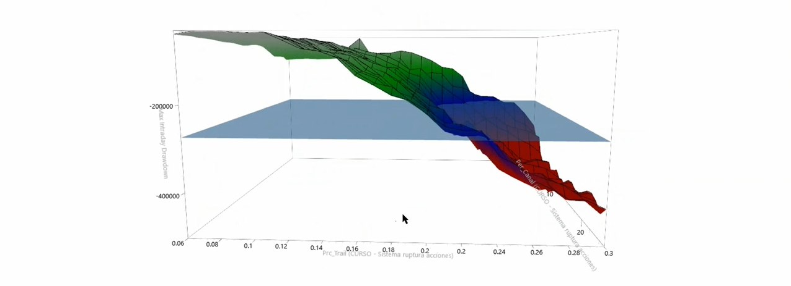


ese es el `drawdown` que fijaros que cambia completamente el el `profit` lo da en la parte alta el drawdown lo da bajo en el 0 a 0.8 

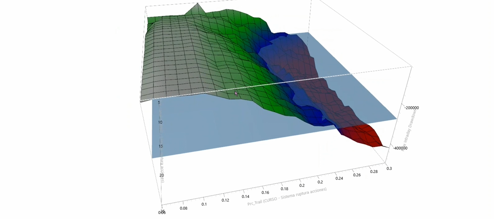

por eso viene bien el recovery no lo lo podía haber metido como fitness pero no lo he hecho entonces ahora no lo puedo lo podía hacer pero no lo tendría que hacer lo podía ver con un archivo para que prepararlo y no lo tengo listo lo que sí que podemos meter aquí es el el *Sharpe Ratio* el ***Sharpe Ratio* este falso** que tenemos pero bueno pero ya digo que es es es falso pero pero sirve un poco 

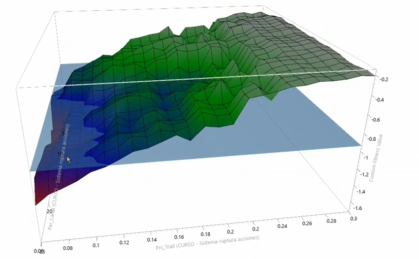


veis como al final lo que os digo en esas zonas sigue tirando más para el profit y aquí se ha igualado más ya no es tan dramático la caída porque porque el riesgo en la parte baja también lo considera bajo cuando lo consideraba pero estaría bien bien verlo en el recovery que un poco lo vemos aquí pero pero eso que os digo el recovery cambia un poco pero por net profit ahí el mapa en el profit está bien está bien está bien también teniendo cuenta donde saldrá el drawdown, pero recovery estaría estaría muy bien pero fijaros cómo estabiliza en este este *Sharpe Ratio* 

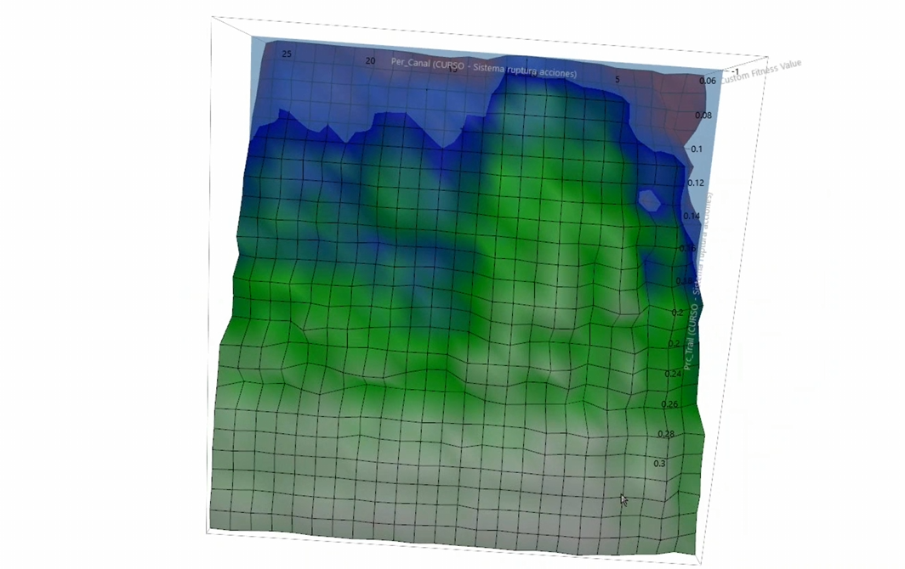

la zona ya se vuelve absolutamente plana plana plana tanto con 0 como con 1 ATR

se nota planísima realmente es enorme no aquí hay un poco de cráter pero pero si es ahí de la zona 0 25 es donde empieza la zona plana lo que pasa que está ahí también lo de los trades 

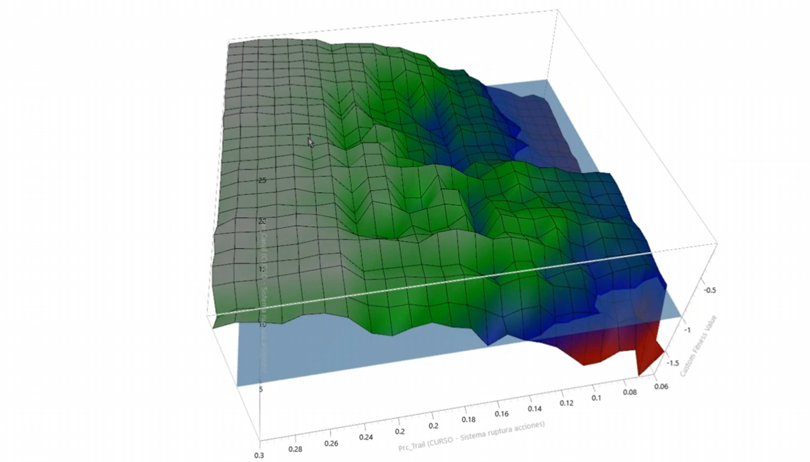


bueno este es el insample,  
vamos ahora a ver el *out of sample*  

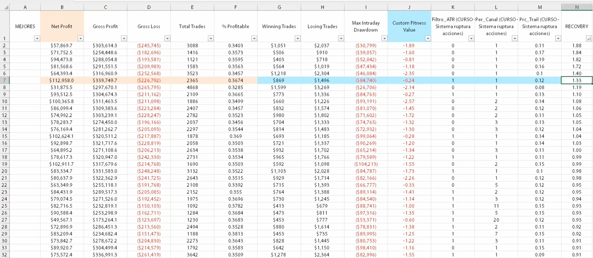

es muy muy interesante, un poco para que veáis cómo tenemos que analizar los sistemas de este tipo, que al final tienen pocas operaciones. Lo que hacemos es juntar acciones y, a través de ellas —que esto quiere decir que no va a ir óptimamente en ninguna, pero va a tener un buen equilibrio entre todas— por tanto es más robusto, mucho más robusto adaptarse a todas que adaptarse a una aparentemente mejor. Adaptarse a una, sí claro, si tienes la certeza de que el ajuste va a ser igual en el futuro, sí, pero esto se explica mucho en la teoría: al final no tenemos certeza sobre el futuro, tenemos que tratar de poner las probabilidades a nuestro favor y eso pues lo hacemos sobre todo priorizando la robustez, y como con este ejemplo que estoy poniendo.

bien, aquí en el *out of sample* bajamos número de trades, y aquí fijaros que el mayor recovery lo da a cero, el canal en uno y 0 11 por decir súper rápido, operando un montón. Pero fijaros que, pues, bajando bastante el rendimiento pero también el drawdown… y cuidado, también el drawdown. Interesante, ¿no? Aquí en la mayoría, todos, porque como ni fijaros que están en el 1, en el 2, en el canal… el canal súper súper bajo, hasta que no llegas aquí 11, 5, 20, no empiezan a aparecer algunos otros. Pero realmente lo dan los sets que son muy muy rápidos.

Aquí, insisto, que convendría hacer más sensibilidad al *slip* y tener claro que uno puede ser —dependiendo de qué acción— un poco justo, un poco justo. De hecho, en los futuros muchas veces metemos uno y medio aunque es… depende, porque aquí vamos, compramos en realidad en la apertura. La apertura tiene mucha, mucha volatilidad, entonces no necesariamente el *slip* de apertura tiene que ser contrario, porque como vamos en ruptura pero de datos de cierre, a veces entra mejor. Es decir, no es un *slip* como claro, pero hay que contar que de media lo normal es que sea negativo, pero habrá muchos que serán positivos en este tipo de entrada. 

Es aquí lo que os digo ya las optimizaciones como que no son tan claras porque porque hay demasiadas variables de acuerdo y por eso lo que lo que os he enseñado de esto paso a paso no siempre es mejor de esta manera no hacerlo de manera independiente que también se puede hacer y podemos también sacar conclusiones con una opinación global no existe mal pero es mejor práctica hacerlo una a una de acuerdo a hacer conceptos independientes primero el canal para la entrada luego para la salida 


bien vamos a ver el mapa *out of sample* - estamos en `Net Profit` 

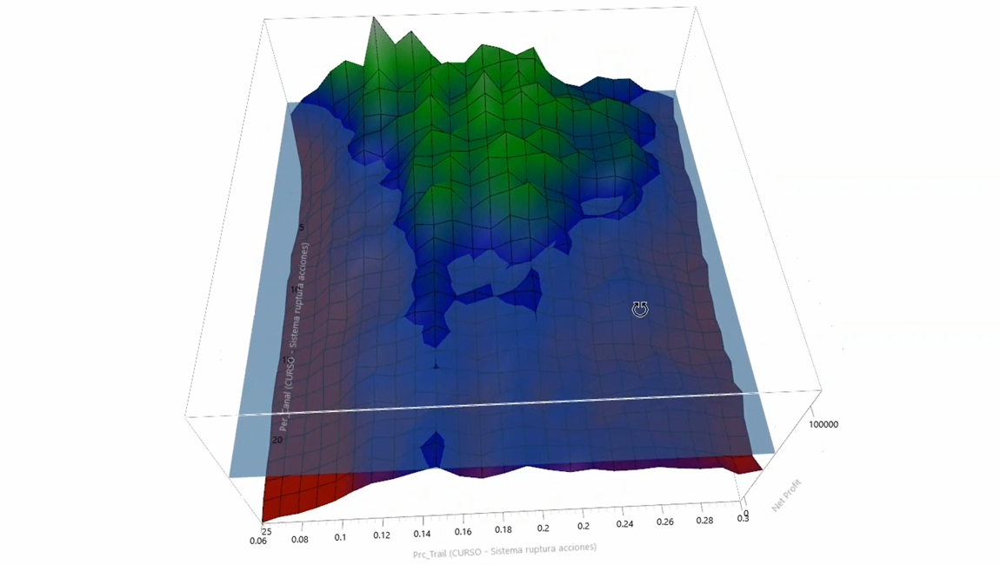  


fijaros que hay los vértices los vértices del `trailing` (Prc_Trail) no ya se vuelven más ásperos los vértices más ásperos estamos con el filtro activado pero el filtro es activado es parecido 

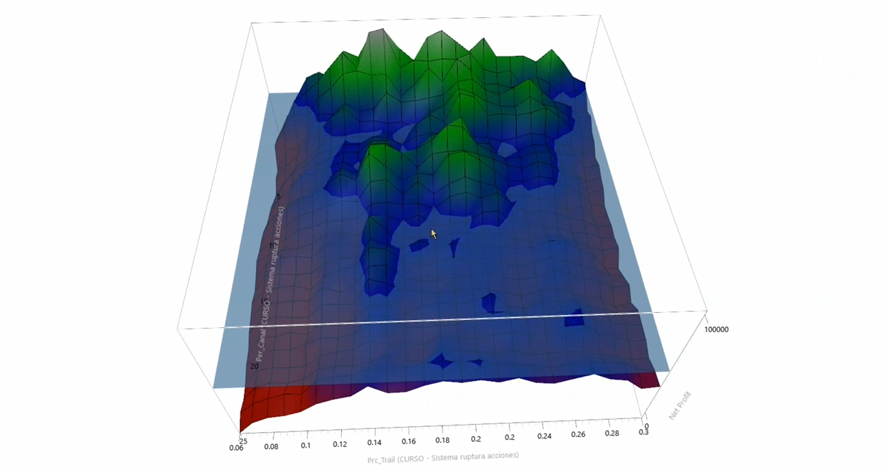  

cambia un poco pero es parecido, el `netProfit`  que cae a medida que se va para hacer el canal 

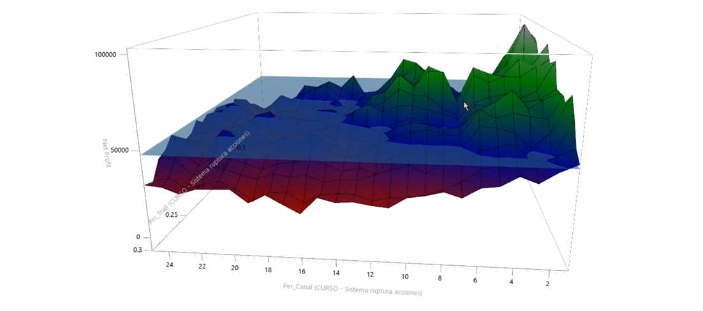

aquí es un poco al revés lo que hemos visto antes que el canal corto rápido bueno también porque está afectado por la última parte de mercado los últimos años y pues bueno nos ha interesado ahí ser más rápido 

aquí si metemos drawdown vamos a ver el gráfico por `drawdown` 

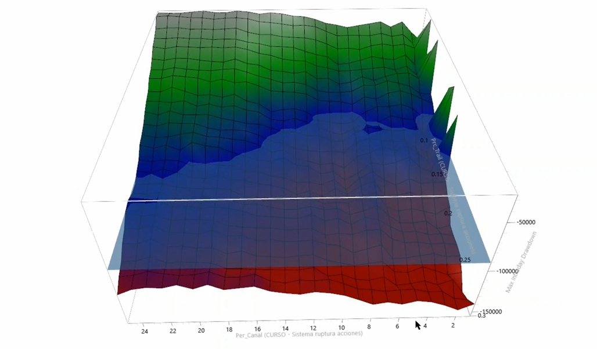

como cambia, se vuelve absolutamente extraño, donde quiere el canal aquí todo lo contrario, es el canal muy elevado, muy elevado, y con un `trailing` muy rápido, de acuerdo? muy rápido, eso es lo que quiere, para no tener drawdown 

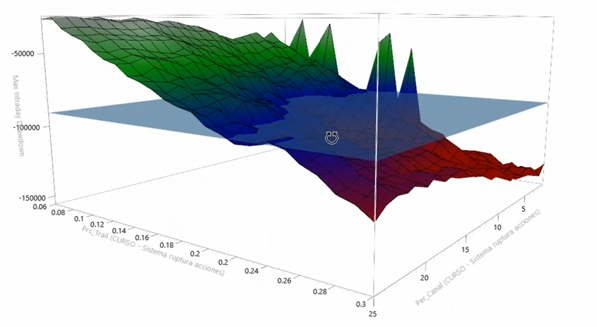

lógicamente a nosotros nos interesa el equilibrio porque solo el drawdown por si solo pues no aporta 

vamos a ver este *Sharpe Ratio* falso que tenemos 

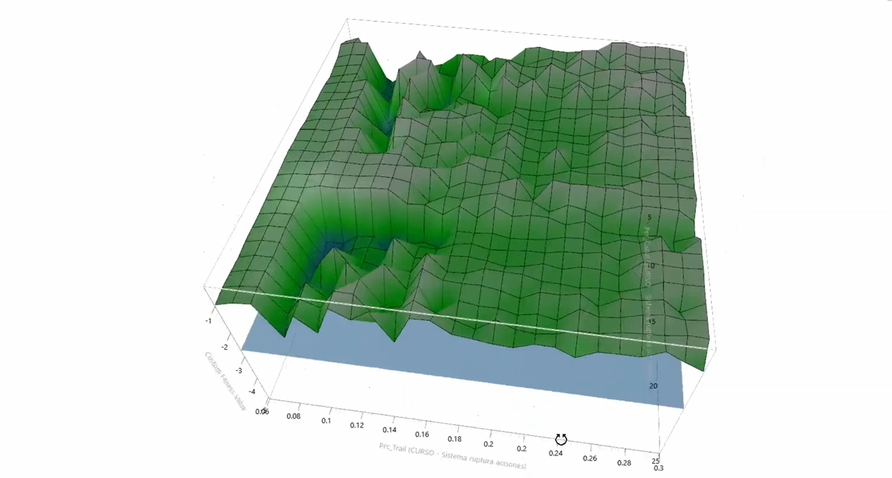

mucha estabilidad muy extraño también mucha mucha estabilidad aquí pero más riesgo como veis en el canal corto 

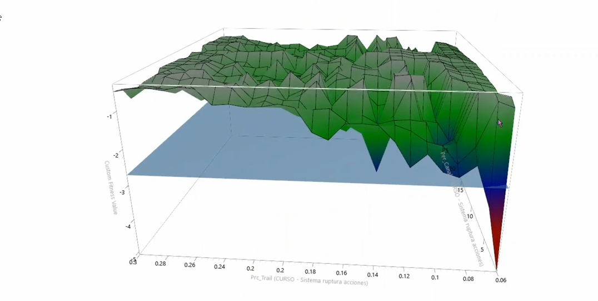

curioso es que línea recta tira aquí con el trailing fijo, porque te saca muy rápido seguramente sale vuelve a entrar sale vuelve a entrar sale vuelve a entrar y hace muchísimas operaciones pero bueno de esa manera pues ha conseguido evitarse la seguramente las correcciones 

**vamos a ver el `alldata`** tiene poco la información de ambos 

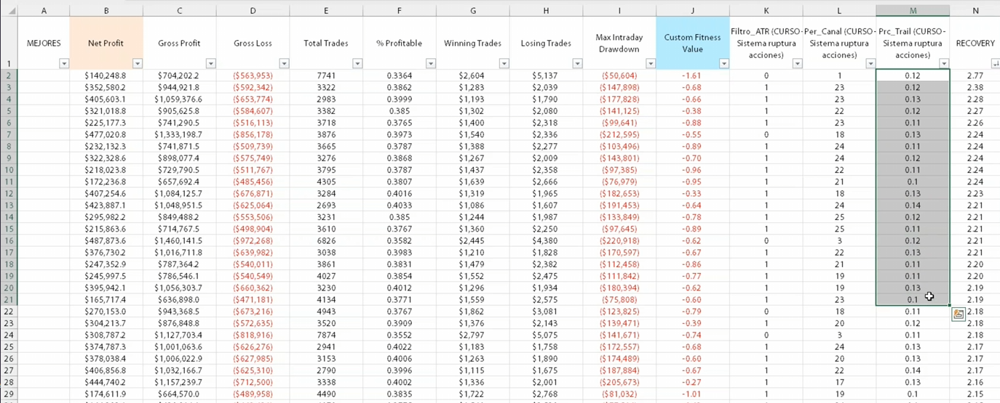

pues tenemos en `Per_canal` una sola en el 1 y se va rápidamente ya la zona de 20 el canal, alternando entre 0 y 1 no tiene muchos sesgo ahí. El `trailing` más bien bajito claro ser más bien bajito que un poquito más de rapidez poquito más de rapidez y con muchísimos `trades` muchísimos muchísimos trades vamos a ver el mapa 

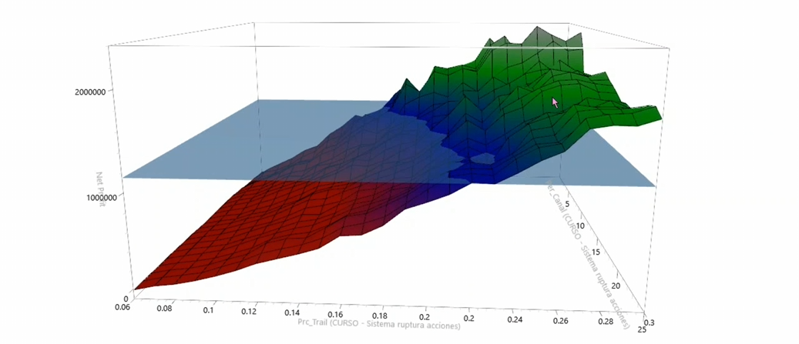

aquí estamos ahora con `1 de filtro` que pues vemos inicial subida por `net profit` como pues lógicamente bueno lógicamente degrada mucho al principio en ese ese trailing tan rápido. 0,20 todavía está justo ahí parece que 0 25 es mejor profit se ve como se estabiliza 

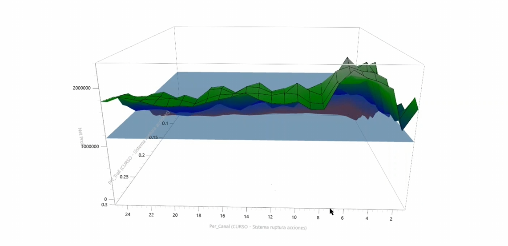

y aquí sí que aparece el canal ya más bajito 

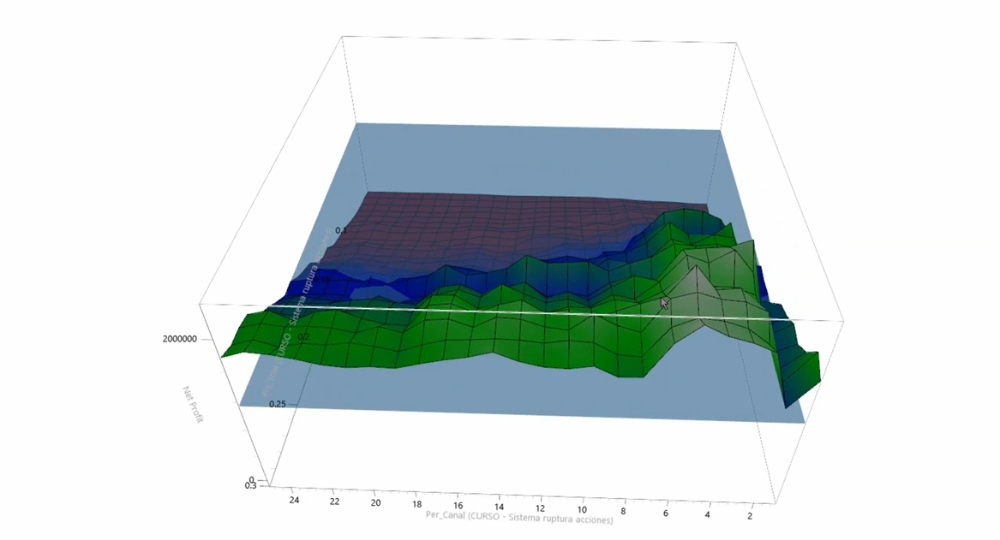


es el canal aparece ahí más bajito está más bien en 4, 5 y 6 un pico pero baja rápido y cuidado bajar rápido y bajar rápido y mirar qué peligro tiene la derecha el cercano, parece mejor esta zona de 8 ,10 porque la zona de 4, está muy sensible muy sensible muy muy sensible y además con ese trailing 

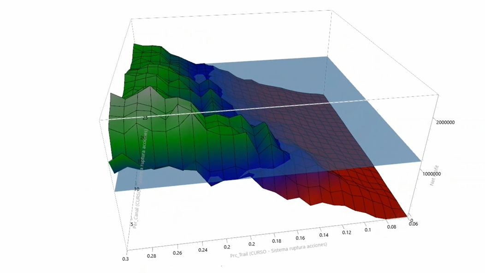

ahí al 0 30 acordaros ya operando poco operando poco 

si lo vemos en `drawdown` ser al revés 

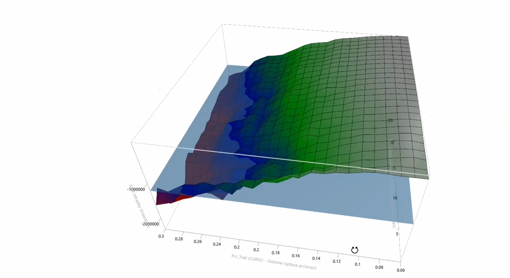

es totalmente inverso es totalmente inverso llanura planísima y con con el con el trailing muy muy muy bajo haciendo un montón de operaciones pero con muy poco retorno como habéis visto antes tanto en 0 como en 1 de filtro ,acuerdo tanto en 0 como entonces pues no equilibra 


aquí el único dato que tenemos un poco para ver mixto es el `*Sharpe Ratio* falso` 

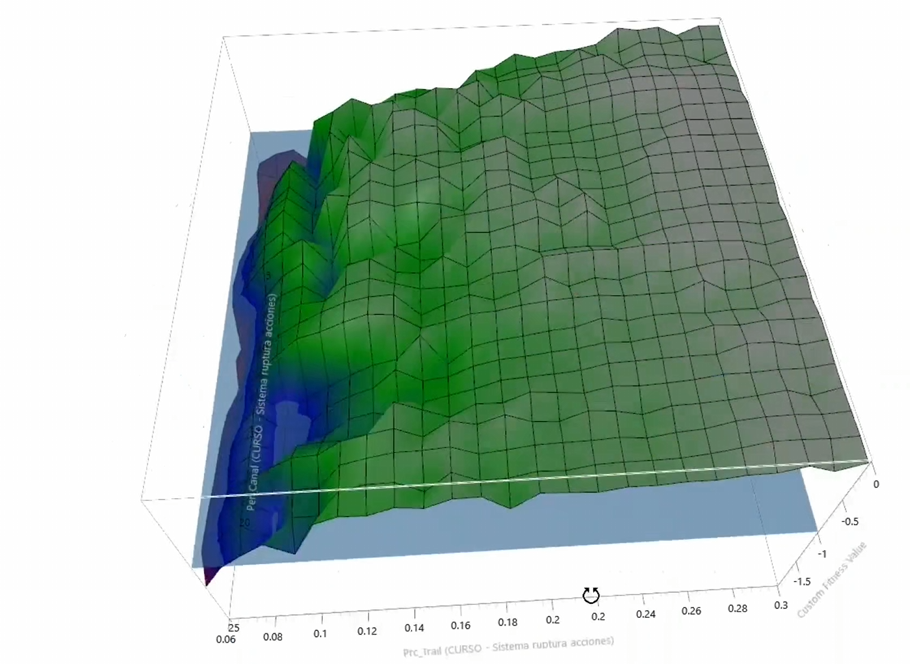

este que tenemos es el único que podemos usar un poco de retorno riesgo de lo que nos permite a nivel de porfolio es un sistema individual tienen más margen y fijaros que aquí pues sí ya vemos que el donchain da igual casi que casi da igual que donchain cojamos y que el trailing lo queremos elevado 

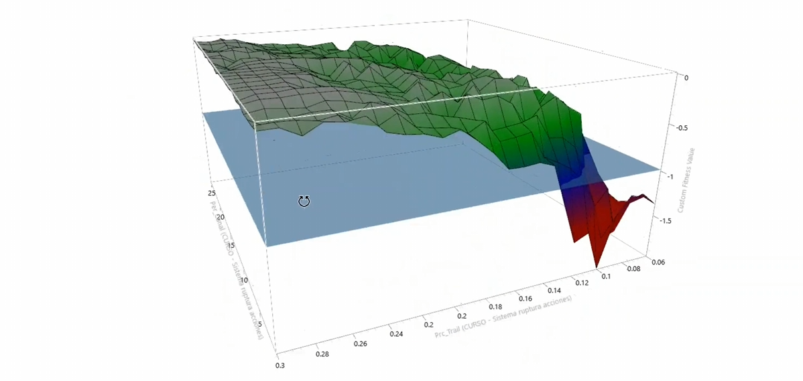

es verdad que aquí sí que el 0 20 parece tener margen tener tranquilidad está por aquí pero más establecer o 25 de acuerdo así que viendo estos datos sí que quizá parece mejor el 0 25 que 0 20 

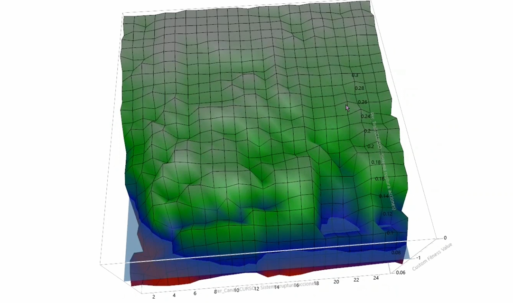
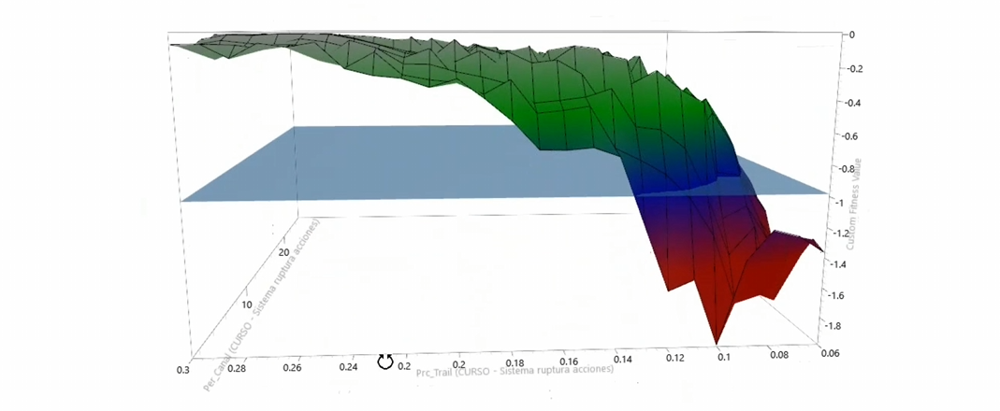


---

Todo esto es cuanto a las optis que ya tenía preparados :

Al final un gráfico 3d es una representación de parámetros lo hemos visto en la teoría excel aquí ya lo habéis visto con multichars ya os lo dije que teníamos viendo todo de distintas fuentes porque lo que importa son los conceptos no no pensé no queráis aprenderlo todo en un sistema porque vamos a ver muchos al final es la la idea es una zona estable es la estabilidad sin más no tiene no tiene más que otro otro criterio aquí en mi opinión el procedimiento más correcto era es decir la opti 1 luego la opti 2 y la opti 3 que finalmente decidimos no aplicar el filtro os he querido hacer esta última 4 para que la veréis toda junta pero es mejor práctica hacerlo de la de la de la otra manera es mejor práctica hacerla que más 

no nos quedemos ahora con elegir el grafico 3d exacto aparte que ahora voy a ir a multicharts vamos a coger más más información más información en el mapa en el mapa hay veces que nos servirá muy bien para elegir y hay veces que nos servirá poco para elegir pues la zona pero por dónde van los tiros y luego yo como ya os he dicho puedo acabar elegir en el excel excel o multicharles en otra herramienta me puede servir un poco para ver la zona elegir el valor exacto a veces no me resultará evidente hay veces que sí veces que sí el mapa es una excelente herramienta de sensibilidad de parámetros decir para ver por dónde van los tiros por dónde van los tiros pero no es sota sota caballo y rey sota caballo rey la elección final acordaros cuando vimos cuando vimos las clases en la teoría que teníamos una excel que hacíamos trabajando en insample el outofsample el old data por un equilibrio de datos y demás esto al final nosotros nosotros esto final ahora y ahí voy ahora y lo acabaríamos de afinar en "maestro" porque porque a mí la información que me da multicharles es fantástico porque va muy rápido optimizando es fantástico porque tiene los mapas pero los datos que me da del portfolio son son pocos, entonces como eso maestro me da más pues por eso acabó maestro.

**vamos ahora a abrir "Maestro"** 

Entonces tenemos aquí el sistema de ruptura aquí tengo el vamos a ver o configurado todo igual 

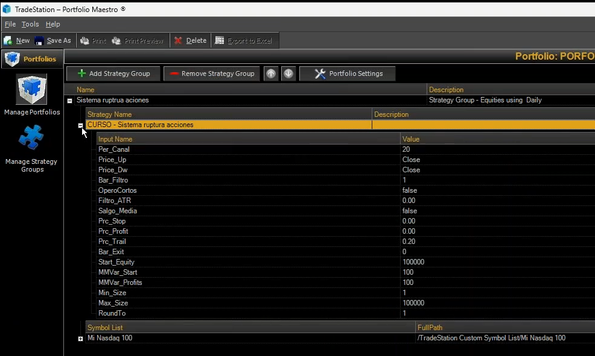

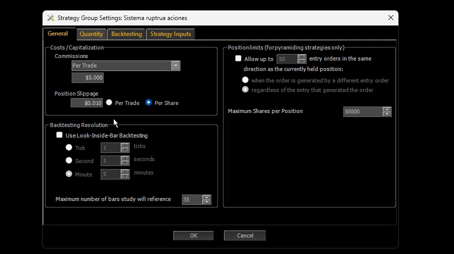

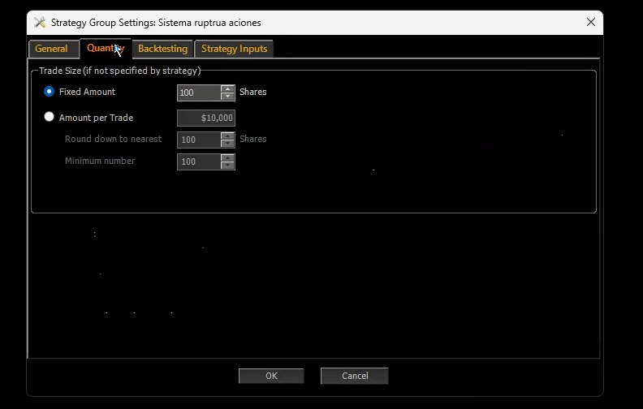

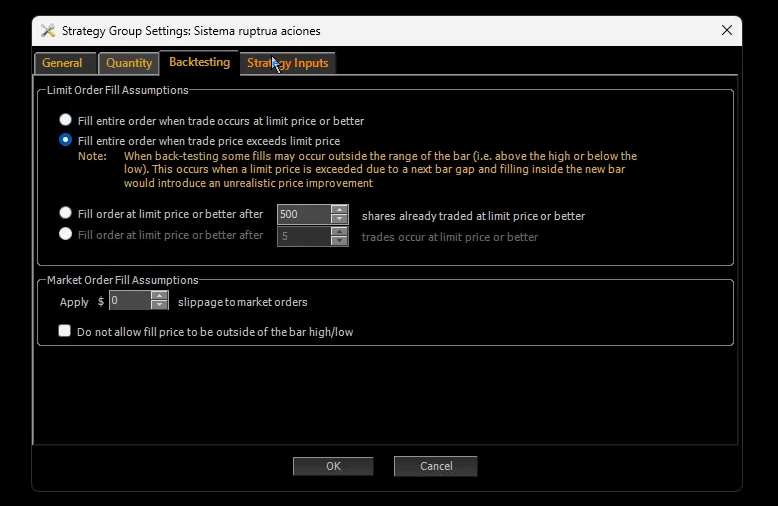

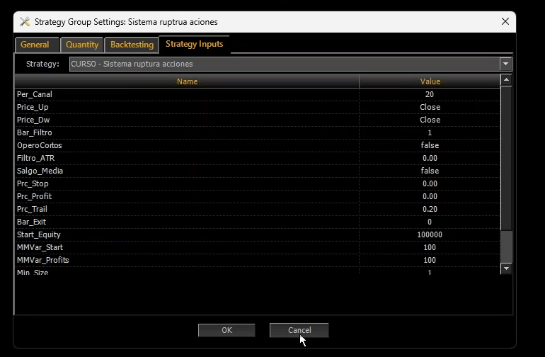

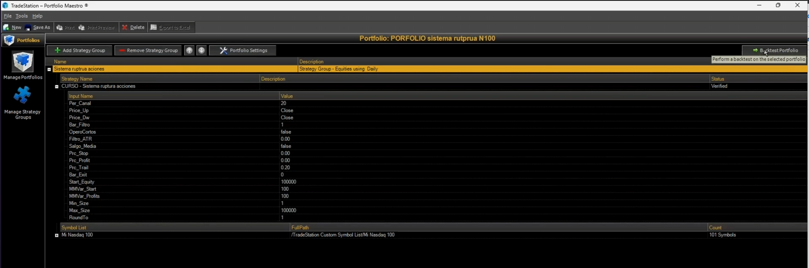

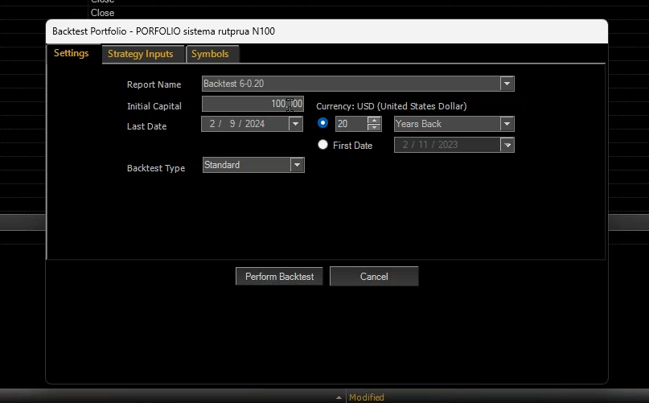

ya vamos a hacer de momento un 602 con 100 mil vamos a hacer hasta el viernes pero se lo habéis pasado 20 años vamos a hacer un par o tres de portfolios rápidamente con esta información que teníamos a ver dónde tengo el excel pero esto no por un lado tengo este y por otro lado tengo el excel que ahora no sé lo he cerrado el excel este es por aquí por recovery era en el filtro vamos a hacer una cosa vamos a desactivarlo de momento vamos a ir sin filtro que es verdad que por recovery y lo vamos a hacer primero uno con el primero que teníamos que era 6 0 20 0 0 0 0 0 20 está todo bloqueado vale vamos a ir con 2% a cada acción y eso no sí nos va a tardar un poco nos va a tardar un poquito ese problema que tiene maestro es que esto la verdad que es un problema realmente potente pero que teóricamente se ha quedado muy atrás y a nivel de procesamiento de información es súper lento es súper lento otro día también trataremos de enseñarnos algo con con cual analyzer que es un poquito más rápido 100 vamos a ver que lo tengo configurado todo igual ya vamos a hacer de momento un 6 0 2 con 100 mil vamos a hacer hasta el viernes pero se lo habéis pasado 20 años vamos a hacer un par o tres de portfolios rápidamente con esta información que teníamos aquí a ver dónde tengo el excel pero esto no por un lado tengo este y por otro lado tengo el excel que no sé lo he cerrado el excel este es por aquí por recovery en el filtro vamos a hacer una cosa vamos a desactivarlo de momento vamos a ir sin filtro que es verdad que por recovery y lo vamos a hacer primero uno con el primero que teníamos que era 6 0 20 0 0 

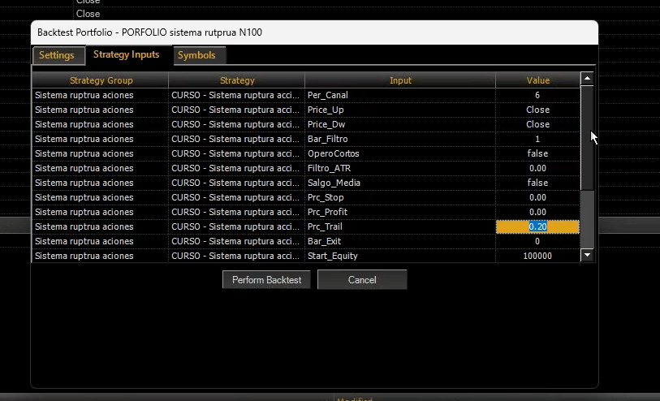

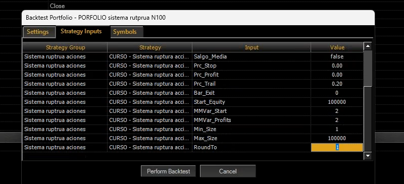

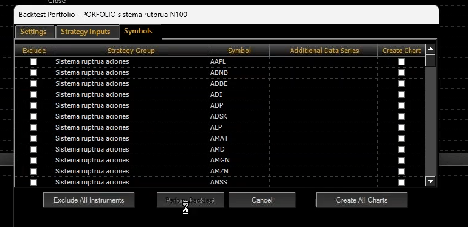

y así nos va a tardar un poco, ese problema que tiene maestro es que esto la verdad que es un problema realmente potente pero que teóricamente se ha quedado muy atrás y a nivel de procesamiento de información es súper lento es súper lento otro día también trataremos de enseñarnos algo con con Quantanalyzer que es un poquito más rápido 


bien lo bueno que tenemos aquí es podemos mirar mucho más por ejemplo la exposición que hemos ido teniendo 

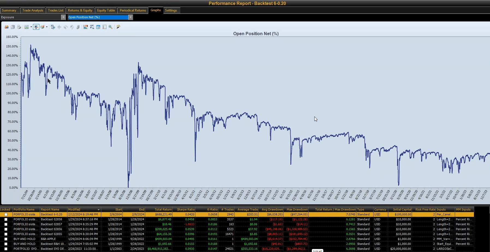

150 en algún momento pero algo tengo en el mone management mal . Voy a usar el de Maestro que por fix x fractional que para acciones va muy bien 

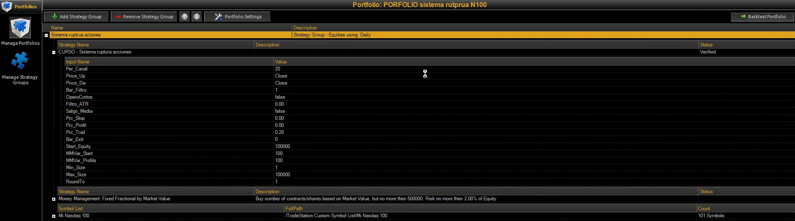

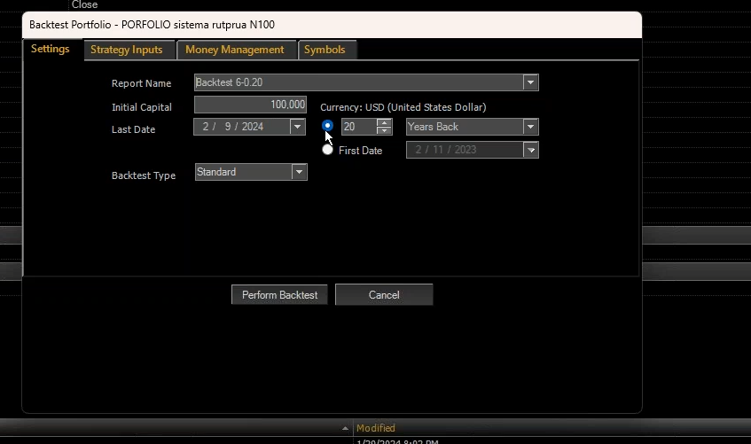

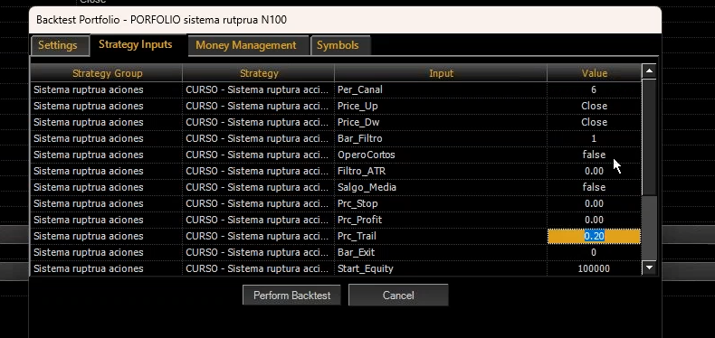

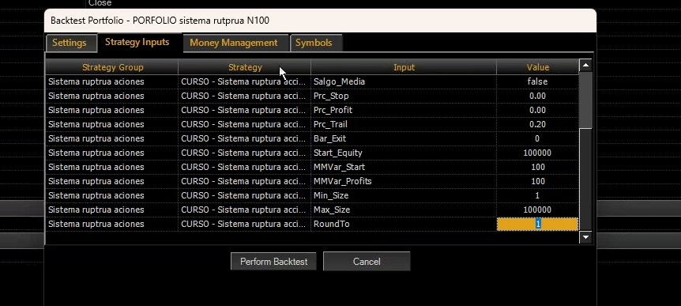

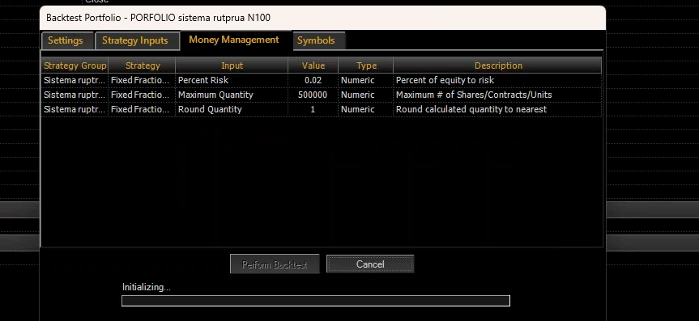

vamos a probar la cartera 6, 0.20, 0, que es la que habíamos elegido inicialmente para ir avanzando en las validaciones pero que la verdad que no tengo claro que se la mejor ahora lo veremos combinado con los mapas 

ahora está mucho más expuesto, ahora ha ido creciendo un poco , y bueno hemos ido a 1 y medio hasta dos veces de exposición

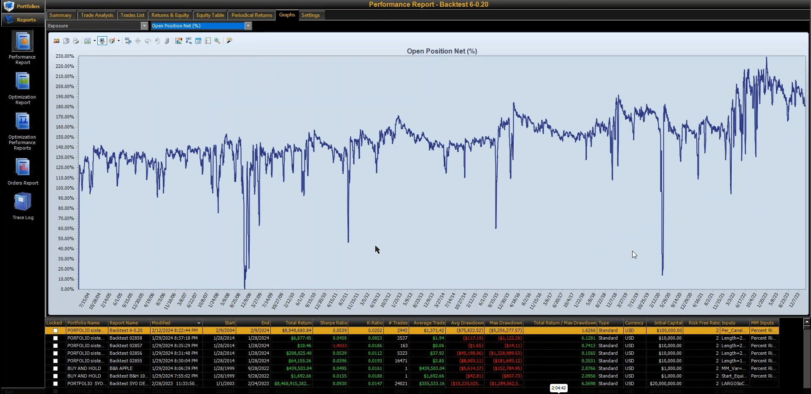  
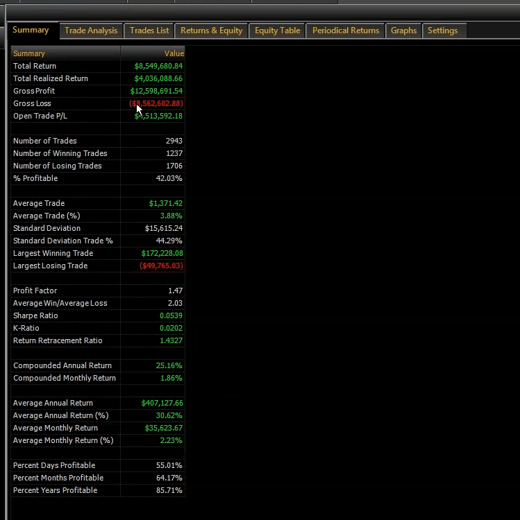  

aquí una de las cosas interesantes que podemos ver es esto es esto 

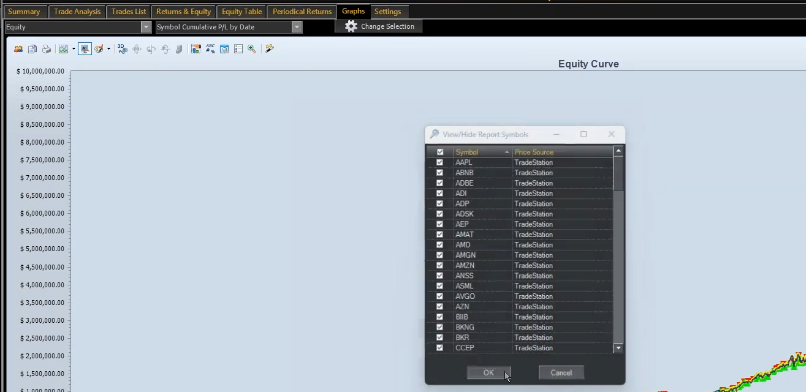
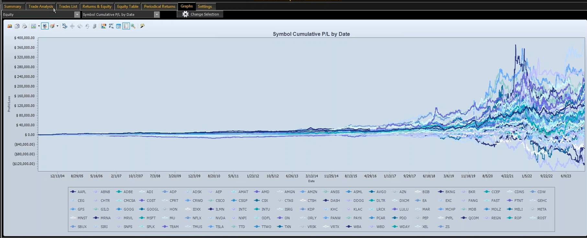

que realmente hay muchas acciones que al final es 6 20 , nos quedamos con este vamos a comparar 2, 3 portfolios distintos con este setup un momento vamos a hacerlos primero y luego los comparamos

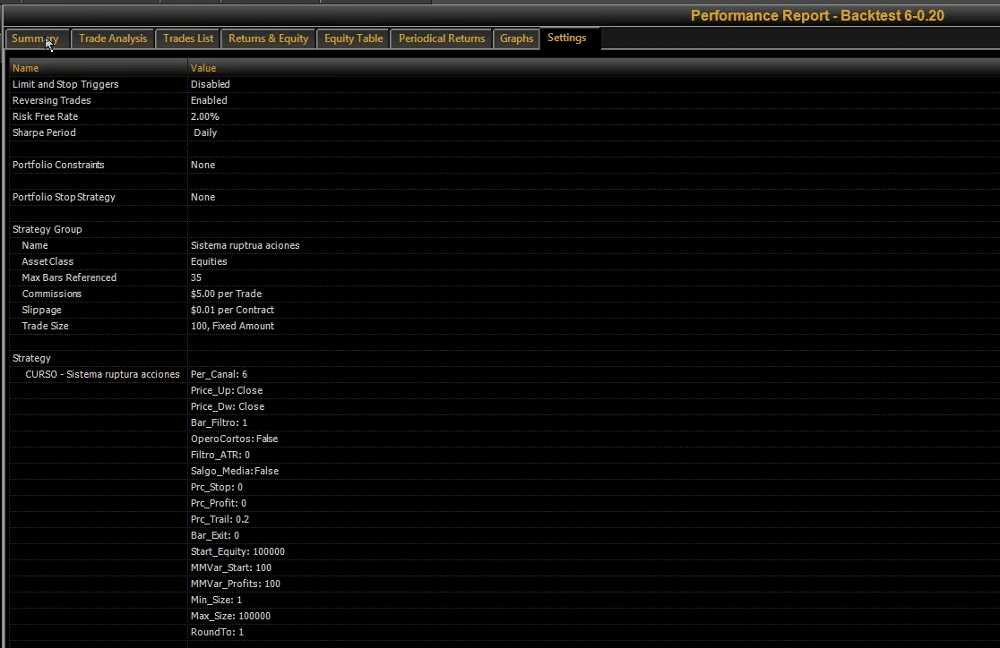

un momento vamos a hacerlos primero y luego los comparamos pero no vamos a ver vamos a ver qué tal no convergen, vamos a volver a verlo 

aquí si miras por este este char que tenemos si la miramos 6, 20 sería más o menos por aquí,

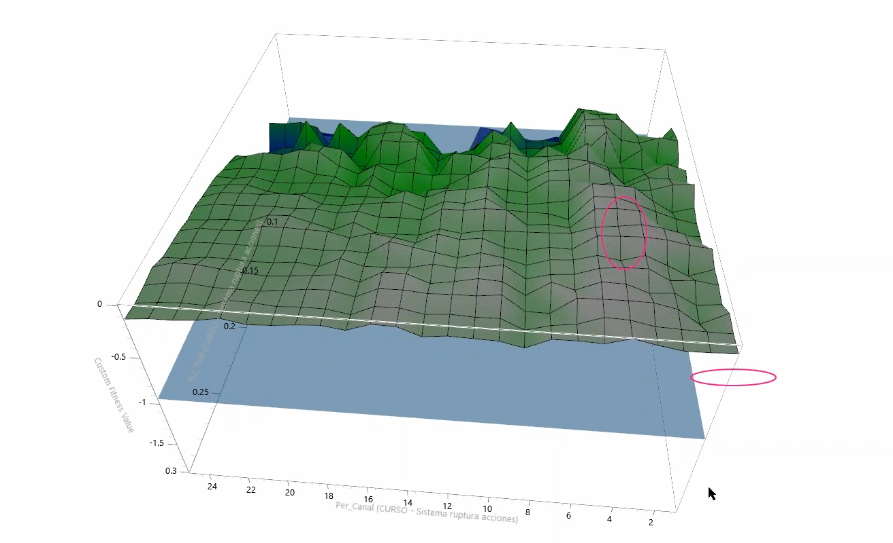
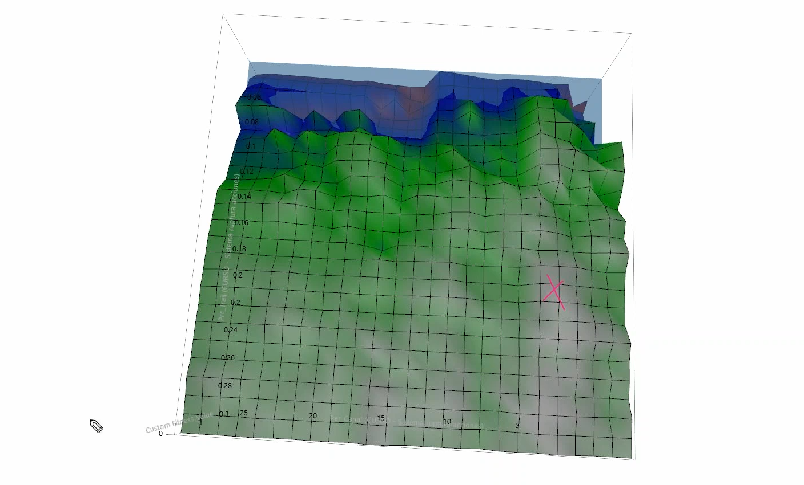

es más o menos vale más o menos esta tenemos pero si miramos el excel puramente por datos por recovery realmente le gusta mucho más aquí 

pero ahí vemos que tanto por *Sharpe Ratio* como por retorno degrada muy rápido quien gana ahí? y el drawdown, pasa que el drawdown, en la teoría lo hablamos bastante todos los ratios que tienen el drawdown el denominador al final el que dirige el ratio es el drawdown, porque como hace de divisor, tira muchísimo de la tira muchísimo del ratio para él vale y acaba viéndose muy afectado el **tsi** lo trata de corregir añadiendo los winners al numerador vale que eso hace que los sistemas que aciertan más que aciertan más pues suban un poco en el ratio es verdad que aquí vamos para el próximo día me gustaría ver en este en esta cartera que nos da sortino para para todo el rato porque ahí ahí es donde realmente tenemos un buen equilibrio vale un buen equilibrio vamos a ver si sí para para el próximo día casi con total seguridad que lo que lo tendremos porque hemos visto el problema que tiene el que tienen ellos preinstalado y lo vamos a corregir y trataremos de traerlo 

pero con esa información realmente en este mapa para eso decía que no siempre vas a poder elegir es complicado elegir porque realmente es casi da igual, bueno casi da igual me refiero en toda esta zona planicia 

`Per_Canal vs CustomFitnessValue`
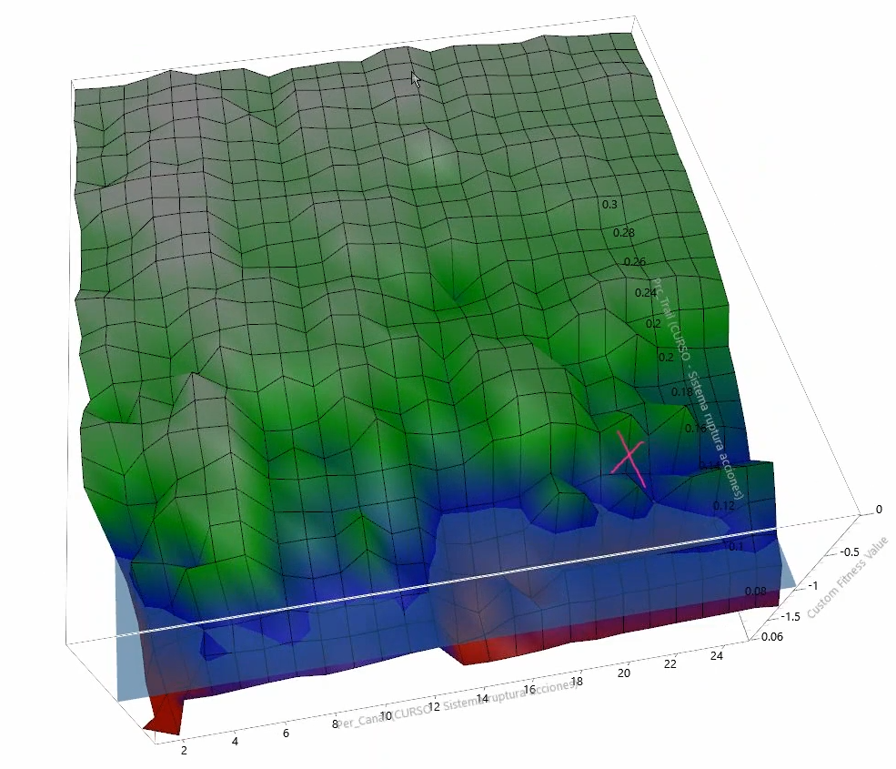


vale si luego y ahí ya te fijas el retorno `net_profit` es donde ya te vas para arriba, decíamos que interesaba más el trailing el porcentaje de trailing más más a 0 25 porque en el 0 20 incluso estaba estaba justo pero bueno el 0 20 al final acaba ha sido un poco un equilibrio entre lo que quieren los ratios de de drawdown lo que quieren los ratios de de retorno riesgo porque al tener el drawdown el denominador tira mucho de él y el profit el profit quiere un muy elevado 


si ordenamos sólo por profit vale fijaros 

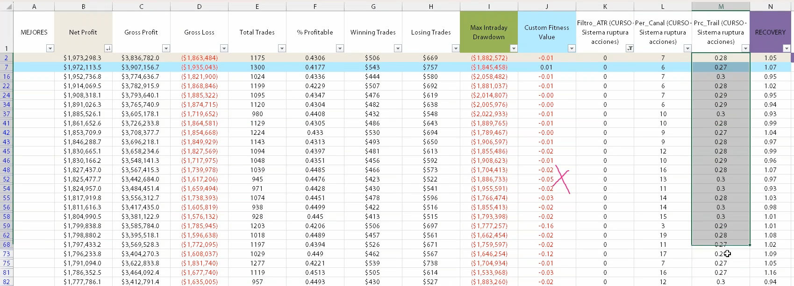

un poco más grande todo el rato 0.28 0.27 0.30 he bloqueado que no haya filtro vale que no haya.

Si en cambio ordeno por drawdown lo contrario 0.7 0.8 0.7 0.6, lo más bajo 

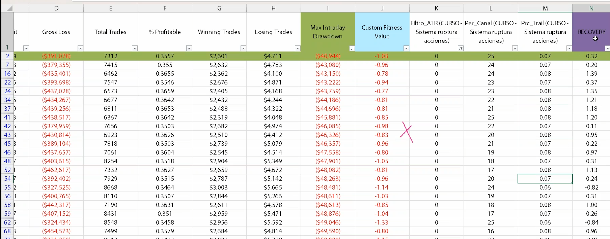

si ordenamos recovery busca el término medio pero el drawdown tira mucho 

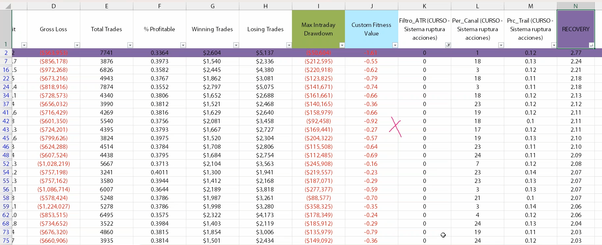

por eso al final este `*Sharpe Ratio*` (J) aunque es un poco como os he dicho antes falso, ahí cambia es verdad que también da los saltos por retorno pero hay poca diferencia de esos valores están todo el rato alrededor del 0 

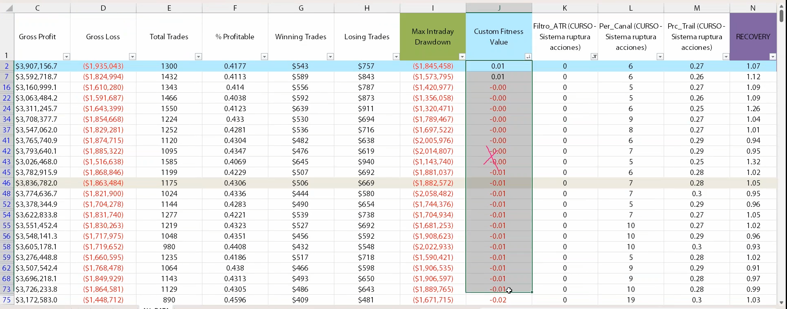

todos estos es lo mismo es prácticamente lo mismo todo esto hay muy muy poca variación de acuerdo de mi poca variación en el dato de 6 y 10 pero también bastante elevado el tréil . pero ya digo con muy poca con muy poca variación pues al final nos hemos quedado con un compromiso 


vamos a ver vamos a hacer rápidamente porque es un buen ejercicio hemos hemos hecho este del 6, 20 y ahora vamos a ver todos estos , vamos a ver por ejemplo el que mejor retorno da,  es el **canal** primero 

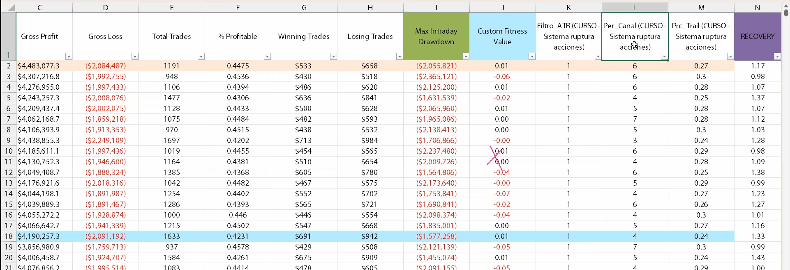

vale sería 6 0.27 , 1 vale lo voy a poner que es bastante parecido al que voy a dejar la gestión monetaria igual para no tocar nada vamos a hacer 6 0,27 1 

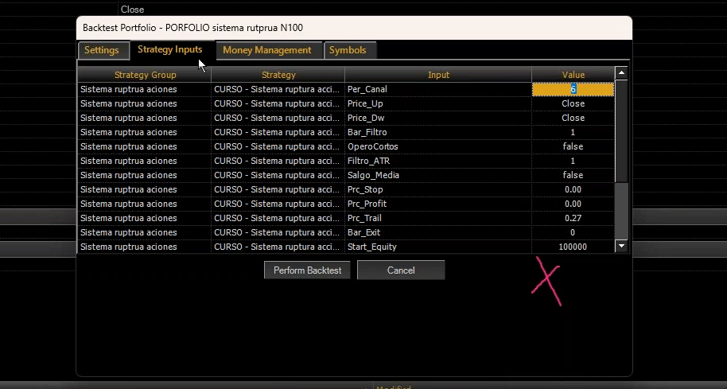
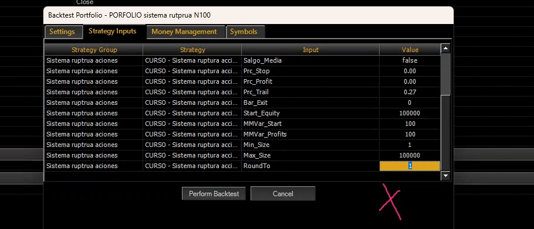
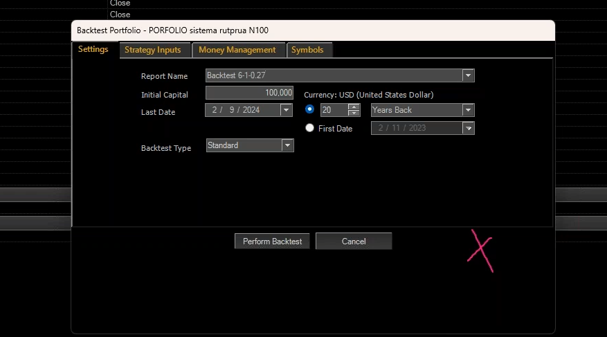
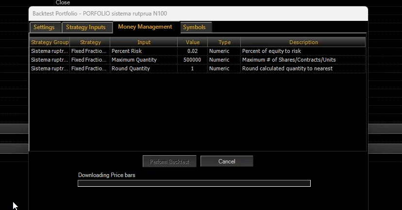

dejamos toda la gestión monetaria como hemos hecho el otro para poderlos comparar 


**el que menor drawdown obtiene**   
(sort excel por drwandown) que es muy es muy raro ya os lo digo. sería por `canal 25` ahora viene el `filtro 1` y luego el `traiing 0.07` 

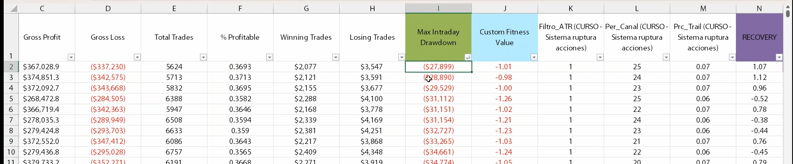

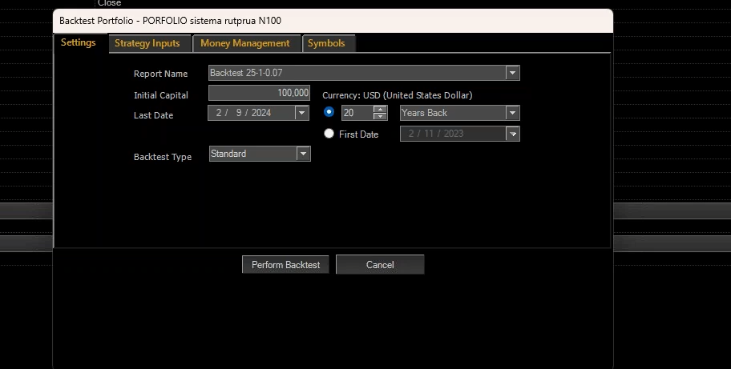

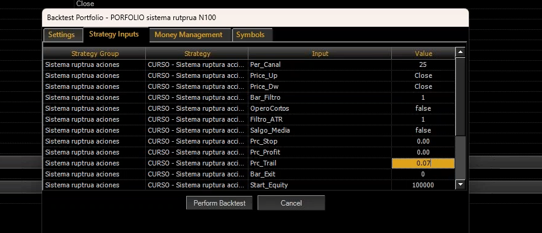

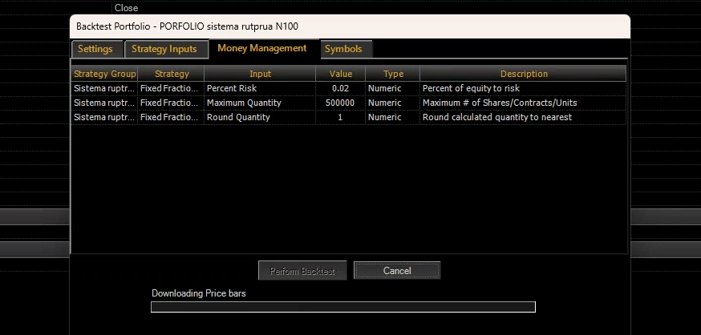


**el que mejor *Sharpe Ratio* tiene**  
que es `4` `1`  `0.24` 

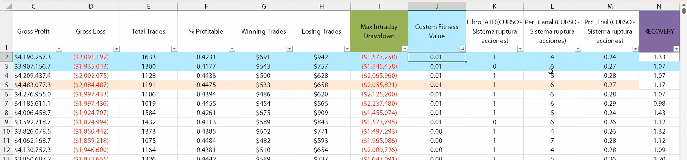

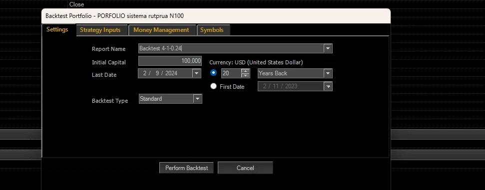

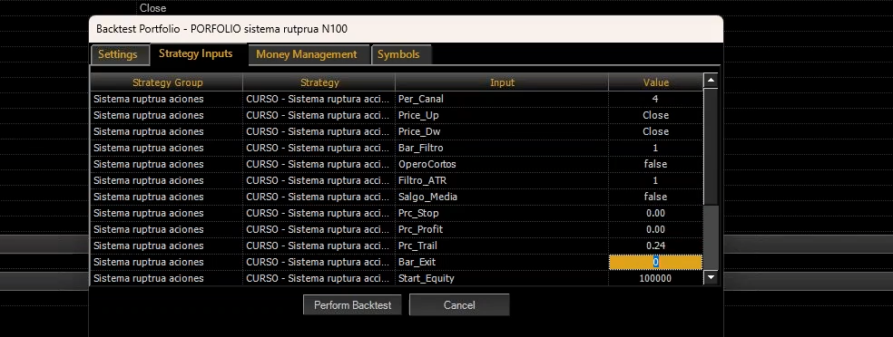

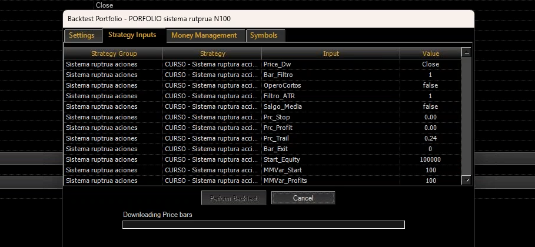


ahora toca el de 1 que era el raro

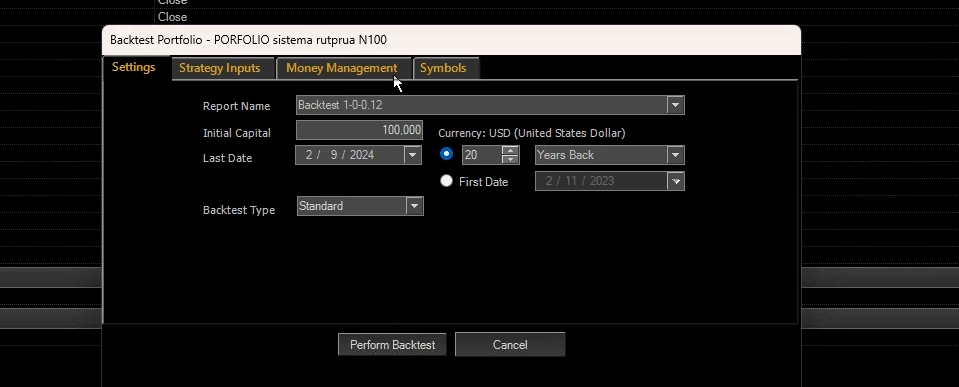

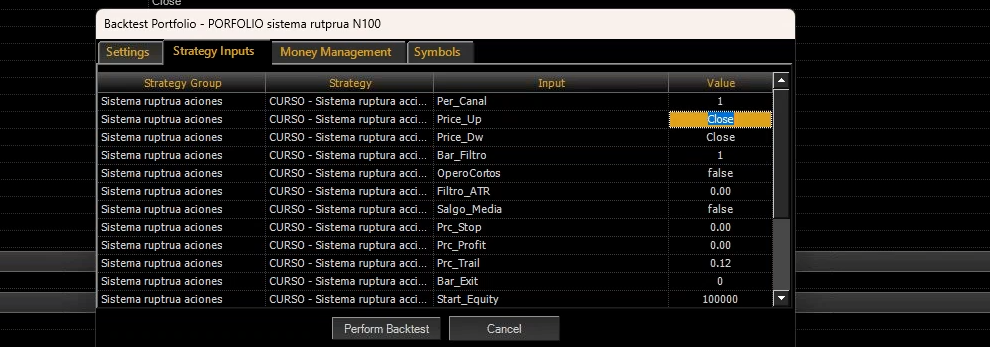


luego los comparamos 

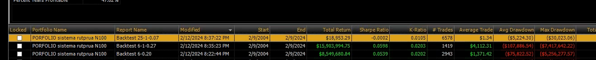


esta optimización de *porfolio trader* tiene tiene ese problema da pocos datos entonces los tienes que construir tú, el problema es lo que os digo que al ver este problema con `*Sharpe Ratio*`  no hemos podido utilizar el sortino que usamos para las estrategias sueltas entonces hay que hacerlo para Portfolio porque pensamos que valía pero hemos visto que no. entonces hay que hacer el sortino para portfolio y a veces lo que hemos hecho es hacer varias, lo bueno es que modificar es muy rápido y como el coste fitness el costo fitness es una fórmula que tú puedes programar al final le puedes meter varios pasadas recoges varios uno pues le ponen sortino, *Sharpe Ratio*, y el que quieras los pasas todos al excel y entonces ahí es donde ya tienes tú para hacer distintos cálculos o ratios que puedas calcular directamente en el excel, de momento sólo puedo calcular el recovery utilizar este *Sharpe Ratio* que insisto que no es el valor correcto pero sí que es extrapolable a para hacerla para hacer la selección 


para este era el 4 ya sólo me queda uno más raro y ahora podremos comparar datos entre ellos vale 1 0 0 se lee bien el maestro la pantalla ahora ahora ahora no me siguen por cierre pero esto es instrumental y no no merece mucho la pena pararse mucho en explicaros todo esto es al final simplemente estoy haciendo todo el porfolio con unos ex concretos trataré de dejarlo mañana a ver si me acaba porque ese fin de semana he intentado dos veces que maestro me hiciera toda la optimización completa pero esta optimización que hemos hecho multicharts también se puede hacer pero en multicharts he tardado unos en hacer la larga de esto tardado unos 15 minutos y maestro se ha colgado después de llevar cada una de ellas como 20 pico horas y no había acabado esta es la relación y era lo mismo en verdad era lo mismo mismo código todo igual y esa esa es un poco la comparación no entonces que ya os lo había comentado alguna vez es un drama de maestro pues es la sola que es que ya digo es súper potente luego a nivel de informes es brutal  ahora ahora veréis todos los datos que nos saca está fantástico y los hemos revisado bueno hay uno por ejemplo que no está bien ya lo pasamos pero pero esto sí que sí que están bien y bueno pues es la lástima 

**comentaba frank que la selección del filtro atr volatilidad lo hecho entre 0 y 1 pero que 1 y 4 tenía mejor que decir** que estaba una zona robusta de estar sería mejor pues sí pero ahí a mí me parece podríamos podríamos trabajarlo un poco un poco más pero me parece sobreoptimizarlo me parece demasiado los filtros a mí de norma me cuesta meter filtros y a este tendencial para la ganancia que he visto ya ya comentado creo que no se lo metería no se lo metería pero encima si lo metes tiene que ser o no optimizado o muy poco sabes es decir esa el filtro es la manera de sobre utilizar más porque es cuando tú ya tienes tu sistema vamos a suponer 6 0 20 es vale venga y ahora le meto un filtro que me va a eliminar los malos hostias eso dicho así no te suena a una cosa fácil de sobre optimizar porque al final le vas a quitar los cientos tres cientos o cientos es igual sabes que está muy bien no quitar la parte mala pero pero el problema es que estás aumentando el riesgo de que de que de que sea una sobre optimización aunque en el mapa parece robusto aunque en el mapa parece robusto que entiendo lo que dices y tienes sentido no te digo que no pero le daría más vueltas porque le daría más vueltas y ya digo granular lo tanto explico es como el filtro no 0.20 ya te digo yo lo sé optimizado los todos en 0.25 porque porque vierais el mapa bien granulado pero realmente tampoco me gusta es decir en un sistema en diario con mil y pico trades de verdad prefiero ir de 0. 0.5 en 0 0.5 sabes es decir ir a buscar tanto el detalle explico 0.21 0.22 0.23 me explicó? es decir al final recuerda que lo que estás viendo es lo que ha ido mejor en el pasado entonces ya te digo al final elegir siempre el mejor el que y esa ya te digo el tema del incremento es una cosa que es quizá la que más... tu cuando tienes un canal una media esto es muy evidente porque va de uno en uno vale aqui sí que no hay mucha historia pero cuando tienes filtros y cosas así que tú puedes hacer 0,1 0,2 pero si por puestos ya podríamos hacer 0.01 0.02 0.03 y por qué no 0,0001 0,0002 sabes me entiendes hay que hay que cortarlo ya sé que tenía muchos pero el filtro otro no tenía tantos o sea de cambiar el filtro cada 300 o sea has cambiado 300 o sea eso el sistema tiene los 400 con el filtro en 0 o el filtro en 1 y de 0 a 1 cambia 300 y de 1 a 4 igual cambiaba 200 ahora lo miramos 


El que tú dices es el de la linea verde, que te ha gustado es este como en verde vale este a ti te ha gustado porque bueno te ha dado un recovery bastante más elevado mejorado ha mejorado sobre todo porque tienes ahí 1 430 este sí que te ha bajado el drawdown

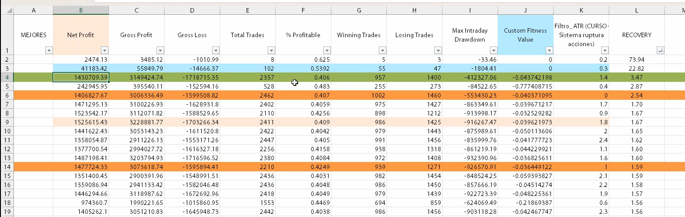

pero de éste (instancia filtro ATR 0) a éste (linea verde) que tienes 100 trades de diferencia entre ellos o sea poner ese filtro o no ponerlo son 100 trades de diferencia y gana un poquito más y baja el drawdow, y dices "está muy bien" bueno sí claro, si de aquí cinco años eso se mantiene, es verdad, ahora eso es seguro que se mantendrá no, la realidad es que eso no es seguro, "bueno, tampoco no es seguro el cero?" pues decir... bueno ya pero el cero le he quitado un grado de libertad, al final no no he añadido variabilidad a la que yo meto `0` estoy metiendo una tr o sea se metió en una condición más al sistema porque este `atr` no trabaja stoy ignorando el atr yo aquí le estoy ya asumiendo que cuando el atr de un día con el atr de un mes por multiplicado por una 4 sea mayor no pere y de esa manera le he quitado 100 trades, que es un trade por acción de media, trade por acción entonces... no, no, no es una certeza, es que esto va así o sea no no no es una certeza o sea no es no es que yo te diga esto seguro que luego no irá no no para nada no te lo puedo decir no sería serio decirte eso no lo sé seguro pero estoy añadiendo un grado de certidumbre más para el beneficio que me da no me renta... me explico... es decir para el beneficio que me dan no me renta a mí no me parece suficiente para yo para añadir grados de libertad para añadir posibilidades al sistema de oscilar de que siempre que añades inputs, como mínimo añades una y a veces son varias porque es la condición o sea es el valor del atr y que atr de hoy sea menor que la atr mensual eso no es un grado de libertad son como minimo dos para añadir dos necesito necesito que me convenza mucho pero de todas maneras lo estudiaría más decir miraría esto miraría esto en el gráfico muchas acciones y la otra cosa que ahora no hemos hecho es esa... que ahora lo vamos a hacer el maestro, lo miraria un poco y un poco pero también lo miraría en el gráfico, nosotros miramos mucho pero miramos mucho ahora esto lo miraría el gráfico en distintas acciones miraría el gráfico ya lo haremos ya lo haremos aunque no lo hagamos hoy lo haré porque a esto tengo que volver para necesito ver un sortino ahí para estar más cómodo entienes entonces necesito verlo lo veré pero el filtro no es no es no es ni concluyente ni granulandolo al 1.4 si el filtro 

**¿si el filtro quitar a 500 trades sería más válida entiendo?** si sería más válido si si sería más válido sería más válido en este en el caso de los filtros es un poco es un poco al revés y por eso es como lo diría no es que sea contra el tuitivo es contra el tuitivo para lo que he explicado. me está diciendo siempre contra más trades mejor vale pero ahora me dices que si el filtro quita más es mejor y que quedamos bueno las dos cosas son verdad las dos cosas son verdad quiere decir que para que el filtro me quite tengo que tener muchos antes si no ya no me vales es decir si tengo mil ya no filtró me entiendes ya no filtró ya no ya no estoy suficientemente cómodo para que eso baje más me explicó entonces pero evidentemente el filtro valida el filtro valida quitando el filtro valida actuando las reglas para evaluarlas tiene que tienen que implicar cambios si no si no implica cambios no está validada y la significación pasa por ahí vale porque cada regla tenga un número de trades donde actúen y en distintos momentos distintas condiciones de mercado etcétera significación y representatividad significación y representatividad significación la dan las estadísticas representatividad la de actuar en distintos mercados vale por eso que ahora lo hemos metido 20 a esto para ver esta curva en 20 

---

bien aquí tenemos un resumen 

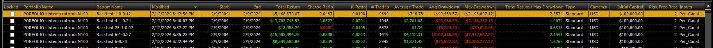

vale de entrada aquí *ratios que no valen para* nada el esto que veis aquí si lo veis es el **total retorno partido por máxima drawdown* aquí no vale para nada aquí no vale para nada porque bueno vale bueno habiendo hecho  gestion monetaria vale un poco porque al final es lo que os decía antes es decir el drawdown no lo puedo meter en porcentaje que es verdad que aquí como yo he regulado en 100 acciones y vengo con gestión monetaria que es muy importante muy importante porque porque es muy importante porque si venís aquí a ver la lista de trades 

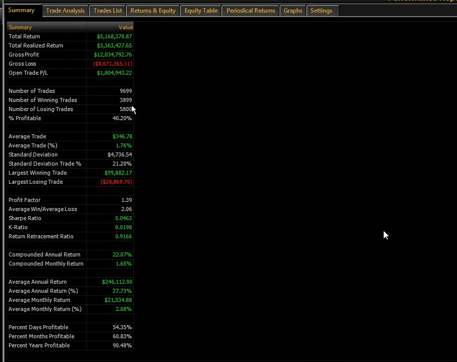

pues yo al final he ido exponiendo si tú multiplicas por ejemplo, da igual, esta acción, hemos comprado 60 por 33.14 al final he comprado 1988 dólares que es más o menos el 2% que habíamos hablado al inicio 2000 dólares vale entonces si yo siempre he ido exponiendo esa misma cantidad pues es mejor sería mejor el porcentaje sí pero como yo siempre voy exponiendo bueno un 2% de la cuenta ya estoy haciendo porcentaje porque ahora tengo 100.000 2% pero cuando tenga 200.000 pues será el doble pues ya voy exponiendo siempre una cantidad que depende del porcentaje gracias a ese 2% 2% entonces las cantidades están más o menos ecualizadas pero como lo mismo que se ha hecho en el excel os he dicho no está mal recovery sirve pero sería mejor aún en porcentaje sería mejor 

vale pero aquí como ya tenemos esa tenemos `shad`, el `RR` calculado, tenemos algunos datos más que nos sirve,  tenemos el `drawndown` real   
  
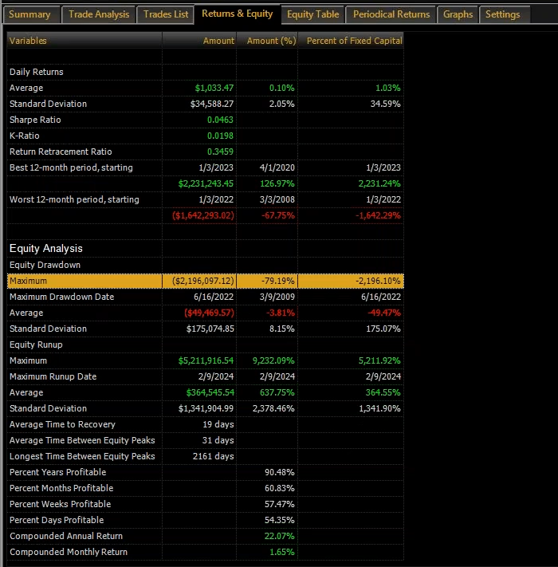  
   
aquí muy elevado porque porque hemos metido la exposición a casi el 200 hemos metido un poco un poco elevado a la exposición pero aquí sí que tenemos el triple r `Return Retracement Ratio` a `0.34` 

aquí tenemos a `0.92` fijaos como cambia


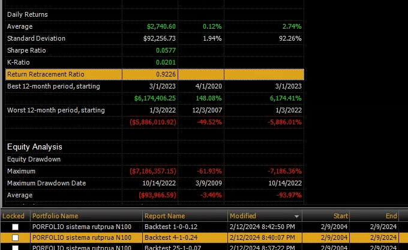  

`Return Retracement Ratio` a `0.006` 

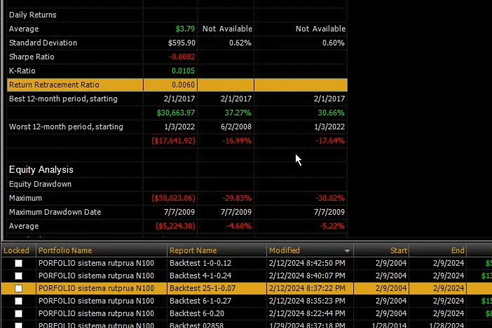  

`Return Retracement Ratio` a  `1` 

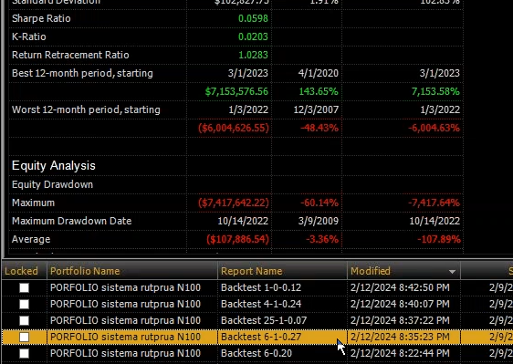  

los cambios son bestiales 

el uno es `6` `1` `0.27` ese era el primero bueno el que era por `net profit` era por net profit al final equilibra bastante curiosa ver a los cero de la onda de 60 la otra tenía un 70 70 y pico 

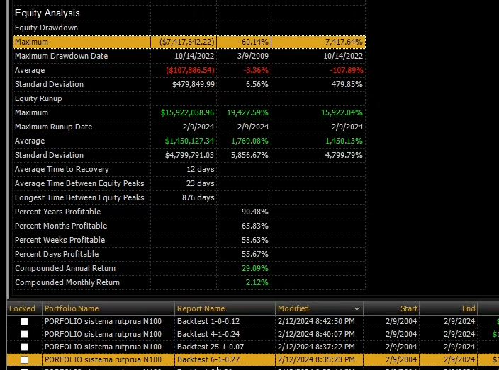  

como está muy expuesto sí sí sí está muy expuesto está muy expuesto fíjate estamos componiendo 25 29 por ciento 


**¿Error detectado?**

¿como es posible un `Total Retrun` ($18953) tan bajo con el `25` `1` `0.07`?  

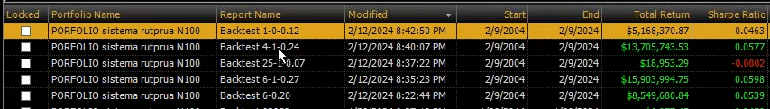  

En el sumario fijaros simplemente profit factor aquí tenemos 1.39

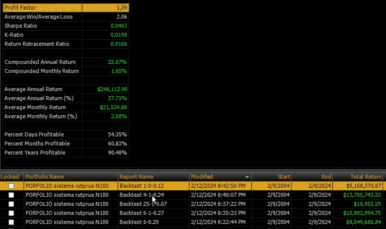

aquí tenemos 1.59


aquí tenemos 1.02

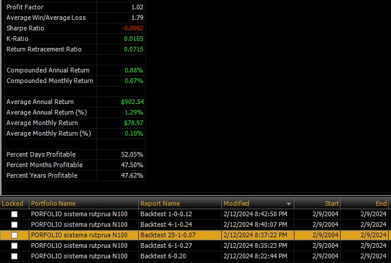

aquí tenemos 1.73

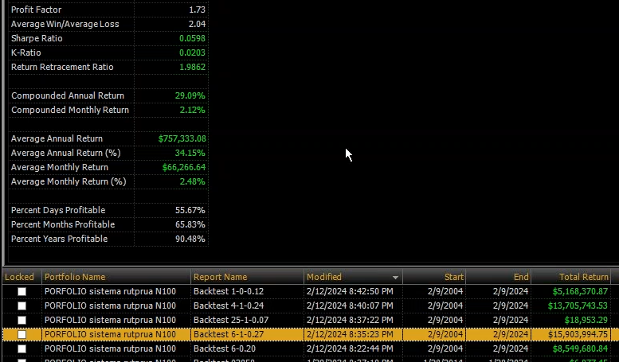

aquí tenemos 1.47

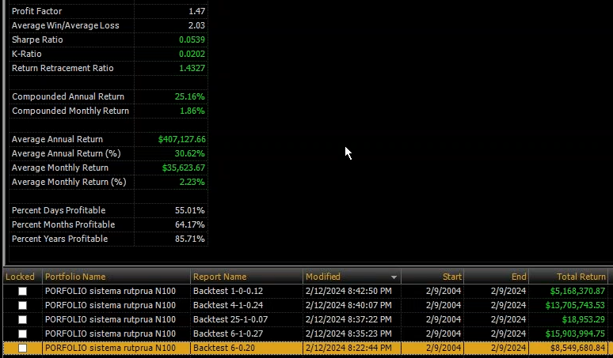  

*(Backtests sobre el sistema Donchian en Nasdaq 100)*

| Backtest      | Profit Factor | Sharpe Ratio | Avg Win / Avg Loss (R) |
| ------------- | ------------- | ------------ | ---------------------- |
| **1-0-0.12**  | **1.39**      | 0.0463       | 2.06                   |
| **4-1-0.24**  | **1.59**      | 0.0577       | 2.07                   |
| **25-1-0.07** | **1.02**      | –0.0002      | 1.79                   |
| **6-1-0.27**  | **1.73**      | 0.0598       | 2.04                   |
| **6-0.20**    | **1.47**      | 0.0539       | 2.03                   |


<div style="border-left: 4px solid #f39c12; background: #fff8e5; padding: 10px 15px; margin: 10px 0;">

<strong>⚠️ ¿como es posible un `Total Retrun` ($18953) tan bajo con el `25` `1` `0.07`?</strong><br>

<div style="padding-left: 25px;">

La clave está en cómo interactúan los tres parámetros: `25 – 1 – 0.07`  
* *Período del canal* = 25 barras  
* *Filtro de volatilidad ATR* = 1  
* *Trailing stop* = 7 % (0.07)  

la combinación es por naturaleza muy poco adecuada para un sistema Donchian tendencial aplicado a acciones. Donchian funciona bien cuando detecta rupturas *tempranas*, no rupturas tardías. Con veinticinco días de canal, el sistema entra cuando el movimiento ya está maduro o directamente agotado. Esta estructura resulta especialmente desfavorable para un sistema de ruptura diario en acciones.

*1. **Un canal de 25 barras es demasiado lento en acciones***

* se generan muy pocas señales
* la entrada llega muy tarde en la tendencia
* gran parte del impulso ya se ha consumido cuando el sistema activa la operación

*2. **El filtro ATR = 1 elimina muchas entradas buenas***
Este filtro exige que la volatilidad de hoy sea menor o igual que la volatilidad media del último mes.
En muchas acciones del Nasdaq, los días de ruptura auténtica suelen ir acompañados de un repunte de volatilidad.
Como consecuencia, el filtro impide entrar justo en las rupturas más potentes.
Resultados típicos:

* se descartan las rupturas buenas
* solo se ejecutan rupturas débiles o irrelevantes

*3. **Un trailing del 7 % es demasiado ajustado para un sistema diario***
Un trailing tan estrecho salta con facilidad ante cualquier retroceso normal del precio.
Los retrocesos del 3 % al 6 % son habituales en acciones; con un trailing del 7 %, la salida se produce antes de que la tendencia logre desarrollarse.
Esto genera una secuencia de operaciones pequeñas, casi ningún trade grande y relaciones riesgo/beneficio muy pobres. El resultado típico es un Profit Factor cercano a 1.  

*4. **La interacción entre los tres elementos es especialmente problemática:***    
|                | Efecto                                    |
| -------------- | ----------------------------------------- |
| *Canal 25*     | Entrada tardía                            |
| *ATR = 1*      | Filtra las rupturas fuertes (las mejores) |
| *Trailing 7 %* | Sale demasiado pronto                     |

Con tantas restricciones simultáneas, el sistema:

* reduce drásticamente el número de operaciones
* pierde diversidad dentro del portfolio
* limita la exposición útil
* y reduce la probabilidad de capturar movimientos de gran tamaño

Cuando el número de operaciones es bajo, no hay forma de que unas pocas ganancias compensen la larga secuencia de pequeñas pérdidas o salidas prematuras. Por eso esta configuración muestra beneficios tan reducidos: la estructura matemática del conjunto bloquea precisamente los elementos que hacen eficaz a un sistema Donchian.
</div>
</div>
<br>
<div style="border-left: 4px solid #f39c12; background: #fff8e5; padding: 10px 15px; margin: 10px 0;">
  <strong>⚠️ ¿Por qué la configuración `6-1-0.27` ofrece beneficios altos?</strong><br>

<div style="padding-left: 25px;">

La estructura de esta combinación encaja de manera natural con el comportamiento de un sistema Donchian aplicado a acciones en gráfico diario. Cada parámetro se ajusta a las propiedades reales del mercado.

1. **Canal de 6 barras → rupturas tempranas y frecuentes**
	* detecta rupturas recientes
	* permite entrar muy pronto en los movimientos
	* captura microtendencias antes de que se agoten
	* genera un número elevado de operaciones
	* incrementa la diversificación entre las cien acciones del portfolio

	En acciones, donde las tendencias suelen ser más cortas e irregulares, los canales Donchian breves resultan más eficaces. Mientras que veinticinco días de canal obligan a entrar cuando el movimiento ya está avanzado, seis días permiten incorporarse justo cuando el impulso comienza. El resultado es claro: más operaciones, rupturas más limpias y captura anticipada del movimiento.

2. **ATR = 1 → filtro suave que no elimina las buenas entradas**  
A diferencia del mismo filtro aplicado a un canal de veinticinco días (donde eliminaba las rupturas realmente útiles), aquí ATR=1 funciona muy bien porque:  
	* la volatilidad previa a una ruptura temprana suele ser baja
	* se descartan rupturas ruidosas que no evolucionan en tendencia
	* se mantiene un equilibrio adecuado entre calidad y frecuencia operativa

	*Con un canal corto, ATR=1 actúa como un filtro de calidad.*  
	*Con un canal largo, ATR=1 se convierte en un filtro que destruye señales.*  

3. **Trailing del 27 % → permite dejar correr la tendencia completa**  

	Este parámetro es probablemente el más determinante.
	Un trailing del 27 %:

	* no salta ante retrocesos normales
	* deja espacio para que la tendencia se forme y avance
	* permite capturar movimientos amplios
	* evita salidas prematuras
	* concentra la mayor parte del beneficio en unas pocas operaciones grandes

	Con un trailing del 7 %, como en *25-1-0.07*, la estrategia no puede respirar.
	Con un trailing del 27 %, sí.

	En los sistemas tendenciales, una minoría de operaciones genera la mayoría del beneficio.
	Un trailing amplio hace posible que esas operaciones “grandes” aparezcan, de ahí el incremento del Profit Factor y del retorno compuesto.

4. **La combinación *6-1-0.27* crea un ciclo óptimo**

	El ciclo completo funciona así:  
	* *Canal 6* → múltiples oportunidades y entradas rápidas
	* *ATR = 1* → filtra rupturas de baja calidad pero permite las buenas
	* *Trailing 27 %*  
	→ convierte las mejores rupturas en tendencias rentables  
	→ facilita profit factors altos  
	→ reduce el drawdown relativo  
	→ potencia los resultados agregados del portfolio  
</div>
</div>
<br>


vamos a ver el siguiente día si podemos sacar el sortino vía portfolio porque no está no está sacado 

Aquí `6-0.20` ya el *Sherpe Ratio* ya lo tenemos positivo y aquí lo que pasa que realmente la exposición es un poco elevada teníamos que haberla regulado más 

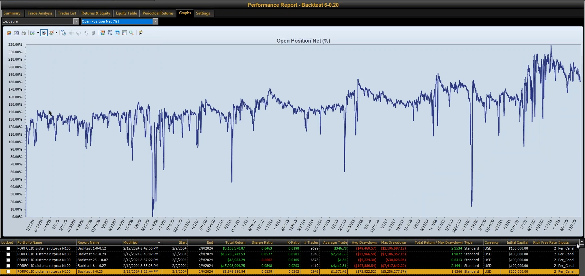  

hemos llegado a exponernos al 200% , dos veces nos ha apalancado hasta dos veces claro tenemos niveles de drowdown muy jeves a nivel de portfolio tenemos drawdowns bastante bastante elevado


| Backtest      | Profit Factor | Sharpe Ratio | Avg Win / Avg Loss (R) | Max Drawdown (%) |
| ------------- | ------------- | ------------ | ---------------------- | ---------------- |
| **1-0-0.12**  | 1.39          | 0.0463       | 2.06                   | **–79.10 %**     |
| **4-1-0.24**  | 1.59          | 0.0577       | 2.07                   | **–61.39 %**     |
| **25-1-0.07** | 1.02          | –0.0002      | 1.79                   | **–29.83 %**     |
| **6-1-0.27**  | 1.73          | 0.0598       | 2.04                   | **–60.14 %**     |
| **6-0-0.20**  | 1.47          | 0.0539       | 2.03                   | **–63.58 %**     |


**Recordar que no está no estamos evaluando el portfolio para operarlo así, estamos evaluando la idea por evaluando la idea y luego ya decidiríamos cómo lo operábamos** 

aquí tenemos muchas acciones en negativo lógicamente luego una vez el sistema está validado yo luego lo operaré a lo mejor no necesariamente las 10 mejores pero así que serán de las mejores de acuerdo es decir al final yo valido la idea en las 100 acciones porque eso me da mayor robustez digamos que la idea la pongo más a prueba en acciones incluso no han ganado 

  

incluso aquí incluso en el portfolio trader que no es tan no me dará tanta información pero este mismo mirar para que veáis la comparación que es interesante de ver pero pongo aquí 


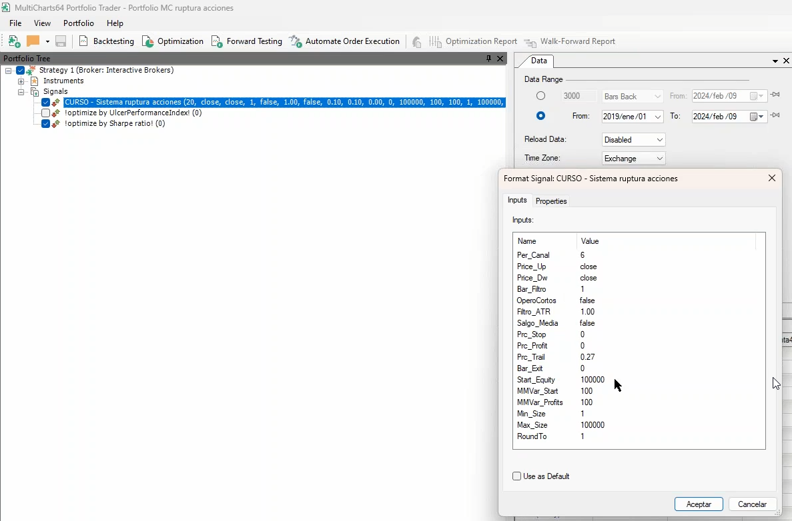  

y ahora se le hacemos backtest y aquí ya veréis que cambia mucho la cosa aquí también tengo el money management a mente portfolio 2 por ciento está bien 

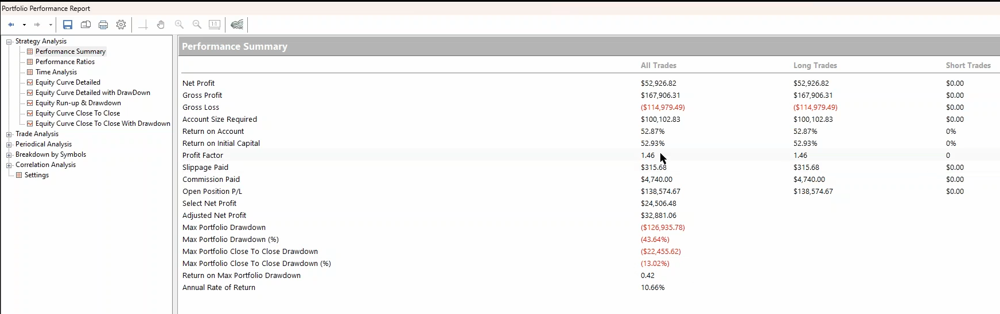  

aquí ya hemos controlado mejor porque le hemos expuesto hemos controlado la exposición claro también tiene un factor de 146 y ganar 52 mil poco claro todo lo uno depende del otro no uno depende del otro pero aquí por ejemplo mirar lo que os quería enseñar antes la correlación de los retornos mensuales de acuerdo de todas las 100 acciones 

  

fijaros que hay datos en negativo porque hay acciones que pierden que pero que siendo todo en el nasdaq 100 claro es que apel con microsoft tiene 0.66 apel con google 0 48 con amazon 0.55 con envidia 0.32 con facebook 0.29 que son acciones directoras de acuerdo están ordenadas están ordenadas por capitalización vale que es decir que todas las que veis primeras son acciones super top para elegir y fijaros su nivel de correlación bajar aquí no sé si se llega a ver bien esperados que os voy a poner el foco lo que sea mejor con el foco es ahí fijaros ahí veis microsoft mirar la columna para abajo es 0 66 0 67 0 53 0 69 0 56 0 55 0 40 con tesla pero 48 0 36 0 39 0 68 51 es decir es el mismo sistema en el mismo frame vale sus correlaciones mensuales son relativamente moderadas pero no son 0.8 0.9 está bien tiene una diversificación moderada que es muy mejora lógicamente 

entonces aquí fijaros que ya con una exposición más controlada tenemos datos de retorno poquito más estables 

  

es una curva muy muy justo bastante virgen pero es un sistema muy justo pero con este nivel de `profit factor` ese nivel de retorno acepta algo de `apalancamiento` y tiene algo de mejora por por delante 

vamos a meter desde el 2007 al 2% mira vamos a meter un 3% de Max capital risk y nos vas a poner un poquito más 

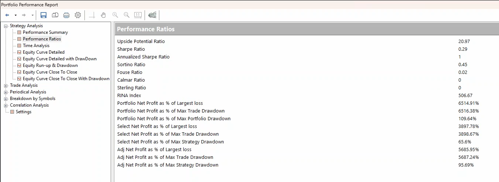 


y veis ya tenemos un *Sharpe Ratio* calculado bien a 0.29 Sortino 0.45 es decir el *Sharpe Ratio Annualized* al uno es un *Sharpe Ratio* bajito es un sistema justo pero bueno poco a poco lo podemos hacer crecer a uno el sistema de hecho este set simplemente es el de mayor retorno no es el que mejor equilibra 

aquí ahora podíamos mirar mirar varios pero y hemos mejorado un poquito 

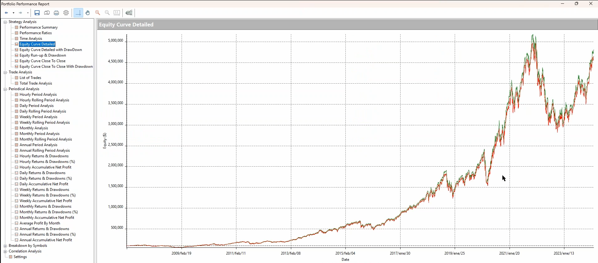 

ha sufrido bastante aquí porque es verdad que con este nivel de de ratio del trailing pues le cuesta le cuesta salirse esto ya os digo habían sets este set tiraba más para el retorno pero teníamos alguno que tiraba un poco más al equilibrio no aquí podíamos encontrar alguno que mejorara este caida del 2022 a cambio de mejor un retorno un poco peor es un poco la que hay que fijaros hemos ganado un poco de histórico como tenemos ratios negativos en varios varias acciones 

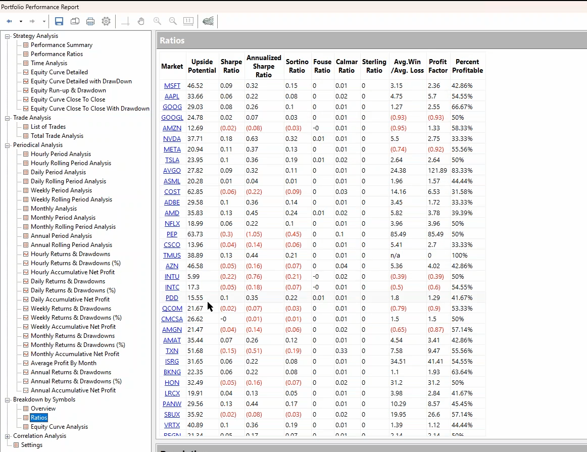 


a los ves en facebook perdemos dinero en google en una de las google también 


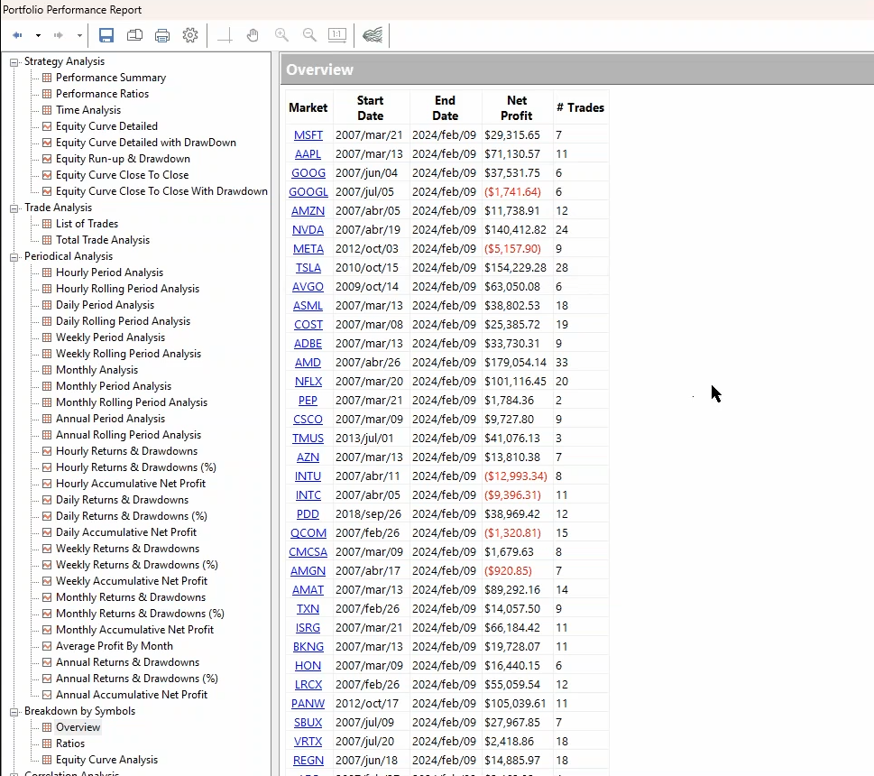 

porque al final tienen muy pocas acciones con este nivel de exposición con este canal y con este ratio realmente opera muy poco cada una de las acciones de acuerdo pero muy poco por eso al final nos vemos obligados a meter pues un análisis global que al final nos pueda meter más acciones para que al final nos pueda meter 1.100 trades desde el 2007 desde 2007 nos mete 1.100 trades 

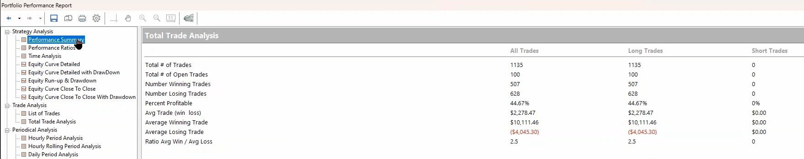 

todavía no dejamos un set elegido porque me gustaría me gustaría poder ver una optimización en el sarte para el sortino de porfolio que aquí sí que lo veo pero no lo veo optimizando porque es una cosa bastante extraña por parte de multicharts ahí en los foros de multicharts están con varios mensajes al respecto es decir que tienes *Sharpe Ratio* metido como función tienes sortino metido como fines y que a mí no lo tienes como fines ya por defecto de optimización es un poco extraño es porque si ya lo tienes metido dentro del programa o sea lo das ese ratio lo das lo puedes perfectamente usar como ratio de iana porque es un dato que estás calculando si tú me lo estás calculando y aquí pero curiosamente lo da para el performance pero no lo da como ratio de iana lo tienes que meter tú por código y el que tienes metido por sistema nos sirve por lo que os decía tienes que hacer específico de porfolio de acuerdo entonces tienes ese problema pues es un tanto curioso pero pero así es.

---

Para la próxima sesión vamos a tomar una decisión respecto a este sistema tal como está, es decir, en una configuración de *full tendencia*. Quien quiera —y quien tenga los recursos, el software y los conocimientos necesarios— también puede hacer alguna propuesta adicional. Es *súper bienvenida* como ejercicio para casa, porque quiero empezar a mandar algunos.

La regla de entrada es simplemente esta, no tiene más:

```sh
//Filtro de volatilidad
If Filtro_ATR > 0 then
	Condition1 = TrueRange < AvgTrueRange(22)[1] * Filtro_ATR
else
	Condition1 = true;


//TIPICO SISTEMA DE RUPTURA: el cierre supera el m?ximo deL CIERRE DE 20 barras
if Close > 0 and Condition1 and MP <> 1 and (BarsSinceExit(1) >= Bar_Filtro or TotalTrades = 0) then
Begin
	if Close > Highest(Price_Up, Per_Canal)[1] then
 		Buy Contratos contracts Next Bar at Market;
End;
```

Es decir: *cierre por encima del canal*, que está calculado por cierres y por el número de velas. En la apertura de la siguiente vela compra. Para evitar compras en acciones con cierres negativos, hemos añadido este `Close > 0`, porque en muchos años puede pasar. Ese `Close > 0` funciona como filtro: si vale 1, actúa como filtro; si el filtro vale 0, es *true* y no actúa.

También comprobamos que no esté comprado (`MP <> 1`) y que se cumpla el `Bar_Filtro`, que es simplemente una regulación para evitar reentradas inmediatas: que al menos haya pasado una vela desde la última salida para que no compre en la misma vela en la que cerró.

La condición `TotalTrades = 0` está puesta para permitir la primera operación del sistema, porque si no, al requerir que `MP <> 1`, no compraría nunca en la primera barra.
Es una conexión típica que se suele incluir para que el sistema pueda arrancar correctamente. Pero, en esencia, la regla de entrada es esta y no tiene más.

El *trailing stop* que actúa es este de aquí:

```sh
// Trailing Stop
If Prc_Trail > 0 Then
Begin
	If MP <> 1 Then
		Trailing_Long = 0;

	If  MP <> -1 Then
		Trailing_Shrt = 99999;
	
	Begin
		if MP = 1 then
		begin // Para posiciones largas
    		Trailing_Long = maxList(Trailing_Long, High - (High * Prc_Trail));
    		Sell ("Trai_Lng") next bar at Trailing_Long stop;
		end;

		if MP = -1 then
		begin // Para posiciones cortas
    		Trailing_Shrt = minList(Trailing_Shrt, Low + (Low * Prc_Trail));
    		BuytoCover ("Trai_Shrt") next bar at Trailing_Shrt stop;
		end;
	End;
End;
```

Si el `Prc_Trail` es mayor que cero, se inicializa la variable y ya está.
Cuando el sistema está largo, el *trailing* se actualiza como el valor máximo entre:

* el *trailing* que ya tenía calculado (que solo puede subir), y
* el máximo de la vela (`High`) menos ese máximo multiplicado por el porcentaje del trailing.

Ese cálculo define el precio del stop dinámico. Con esta condición te aseguras de que el *trailing* **solo pueda subir**; nunca baja. No está basado en ATR —aunque podría hacerse así—, pero en este caso hemos querido hacerlo mediante porcentaje porque es mucho más sencillo. Más simple no puede ser: es un *trailing stop por porcentaje* totalmente directo y funcional.

---

Vale y visto aquí por ejemplo en el gráfico de alguno de ellos para acabar viendo alguno lo vemos aquí en un momento en cualquiera , ahora estamos viendo 6 con el filtro en 1 y 0.27 

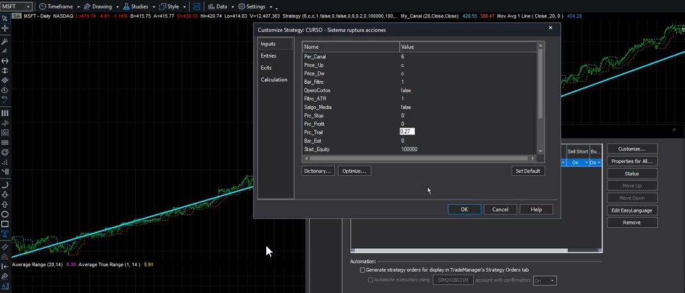 

ya veis claro es un sistema que deja correr 

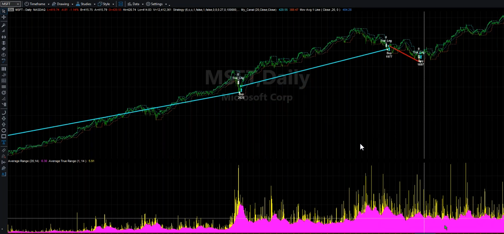 

deja correr se ha comprado deja correr el sistema de muy largo plazo por eso la única manera de evaluarlo es metiéndolo en varias acciones de acuerdo y que cuando el mercado va a entrar lateral pues sufre sufre mucho porque hay que fijaros acaba entrando otra vez el canal no está bien ajustado y vuelve a entrar 

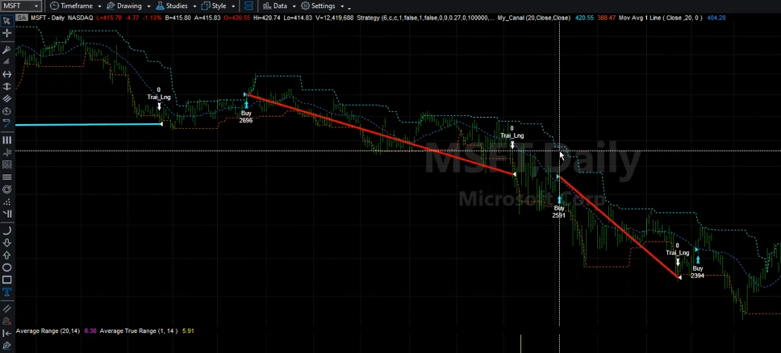 

el canal no está no está bien no está bien porque no están 6 están `Per_Canal 20` 

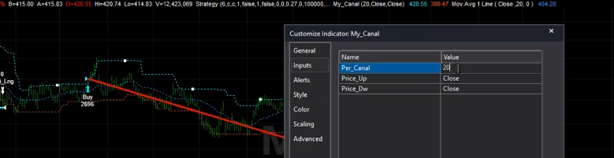 
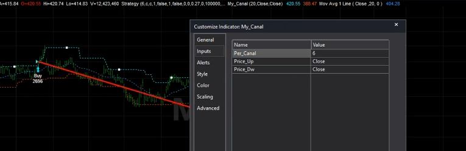
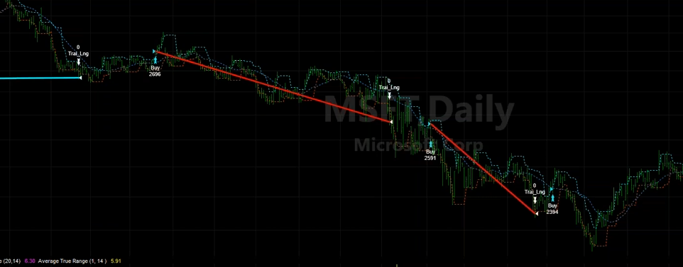  

6 es muy rápido entrar muy rápido esta es la diferencia habéis visto que había varios varias zonas esta esta es la versión súper rápida de entrar habían otras versiones hay que acabar de hay que acabar de elegir aquel que quiera proponer con el código del sistema que le daremos y demás alguna que nos lo envíe nos lo puede enviar lo voy a poner el disco lo puede enviar al email y yo me comprometo a responderle otra cosa que queda pendiente para el día siguiente vamos a hacer esto acabar de tomar una decisión acabar de tomar una decisión con nuestro sortino de porfolio, decisión de parámetros, de esta versión como está, 

¿que hacemos con los cortos? esto es lo que os quería poner para casa unido con esto aquel que quiera en este set up en este código que haría con el lado corto si alguien quiere proponer o quiere trabajarlo o simplemente puede proponerlo bien trabajándolo o bien o bien filosóficamente podemos hacer las dos cosas me valen las dos cosas aquel que quiera trabajarlo porque puede hacerlo ya que lo haga el que no quiera trabajarlo porque no es capaz simplemente que le que lo que lo conceptualice y que diga pues mira yo creo que en los cortos en esta versión haría esto esto esto y porque en acciones en este mismo set up en acciones que hacemos con los cortos 

y luego ya lo que vendría es lo mejor tiene que ver con esto vale es que que otras variaciones hacemos este comentamos que el donchian es un mecanismo de entrar en tendencia pero es un mecanismo muy útil para hacer break out entonces esto ahora con lo que tiene ya en el código se puede hacer breakout se puede hacer un breakout como como haríamos sobre que tratamos de desarrollar 

este serían un poco las cosas pendientes respecto a esta estrategia que deberíamos de liquidarlo ya para entrar en otra en otra cosa 

no le metamos más conceptos ya sé que le podríamos meter un atr le podemos meter mil cosas ya lo haremos de acuerdo el sistema este lo vamos a dejar así con un don chan sencillito entre en la versión tendencial que es muy mejorable lo vamos a dejar así y cortos y haremos un breakout con esta con este código también vale y a partir de ahí seguiremos en otras en otras cosas 


## Preguntas

**¿se puede aplicar trailing stop y stp para la vez asegurando una pérdida esto fija?**   
sí sí sí es es posible y tiene sentido pero en este caso y el sentido a ver depende del tipo que vos es realmente digo eh depende del tipo que vos o sea en el trailing que hemos puesto nosotros en el trailing que hemos puesto nosotros mucho mucho sentido no tiene vale porque ya hemos puesto porque hay muchos el concepto clásico de trailing hay muchas veces que se activa a partir de cierta cantidad pues en esos casos mucha gente sí que usa un stop un stop de seguridad podemos decir acordaros cuando hablamos un poco del esto de seguridad no y que entra ya nada más abrir pues un poco por si se lía no es que me saque no pues no tener que no me saca pero en nuestro caso el telín se activa desde la entrada en el momento del cálculo se calcula del cierre anterior y en el momento que el precio que acaba la barra en que ha entrado ya entra en juego el valor máximo que haya o el cierre anterior o el máximo que haya hecho ese día el máximo que haya hecho ese día actúa de trailing y entonces ya tienes trailing claro que es un 20 por ciento por eso has visto algunos aquí como este o bueno incluso otros peores que se va se va para abajo y a tomar viento a tomar viento. el problema de los tendenciales puros es este que si tú quieres un tendencial puro y quieres tres como esta locura de que te pilla toda la subida no esto pues claro solo ahí dejándolo dejándole tragándote estas cosas 

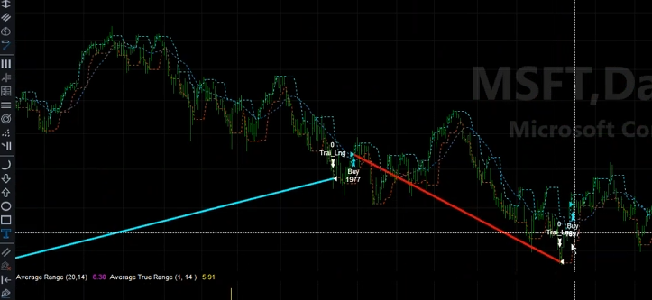 

también ese problema porque si yo le pongo una salida por tiempo que va muy bien y evitará mucho esto que evitará también que pille el recorrido, por eso decía que un tendencial es bastante desagradecido es muy desagració te decía el puro luego están los breakout que también son tipo de tendencial que ya se manejan mejor y que este lo haremos también en mercado vale? entonces conceptualmente si se puede pero en esta configuración tal como está no tiene demasiado sentido porque ya actúa siempre. 

este lo que pasa que le da mucho margen le da mucho margen pero este desde el primer momento que entra ya va calculando aquí le calcula un 27% 

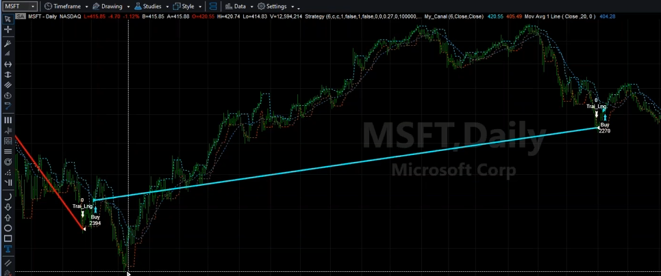 

pero no ha saltado ahora para que veas este aquí le pongo 10 por ciento y seguramente salta 

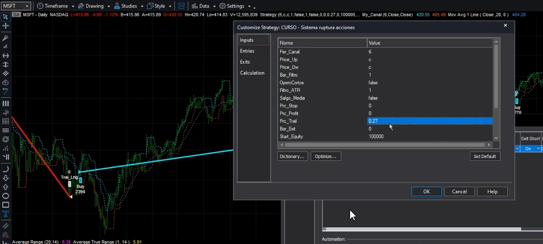 
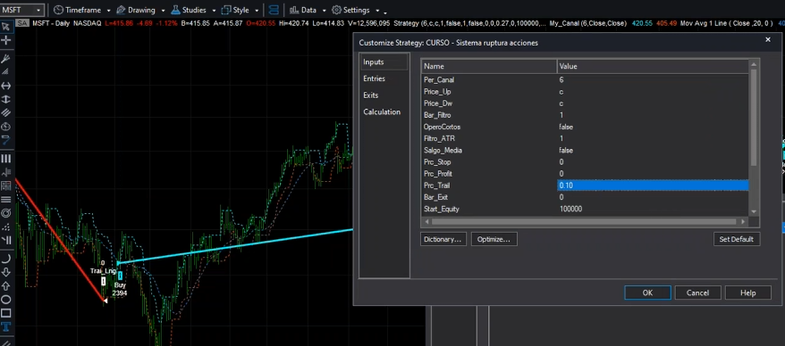 
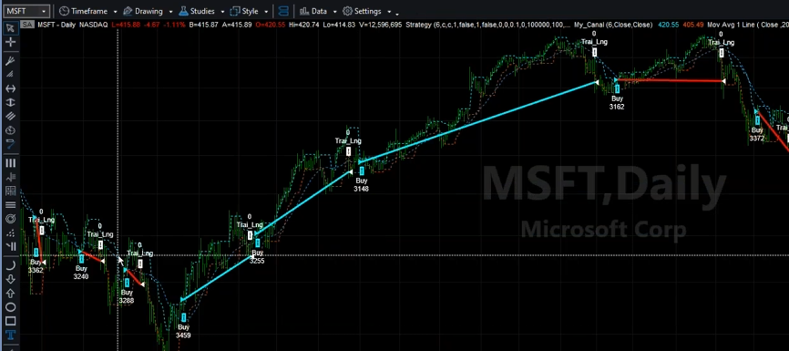 

salta ahí salta aquí salta aquí es un poco la idea no es claro yo lo tengo siempre siempre calcula este este que hemos hecho nosotros imagínate que le pongo 005 no va a parar de salirse todo el rato 

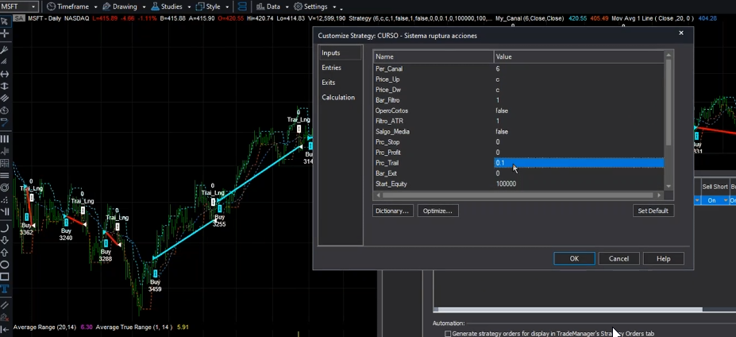 
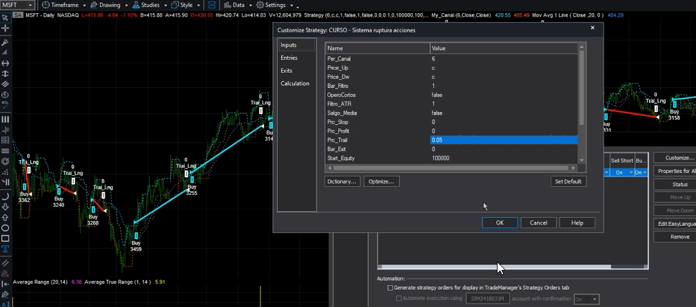 
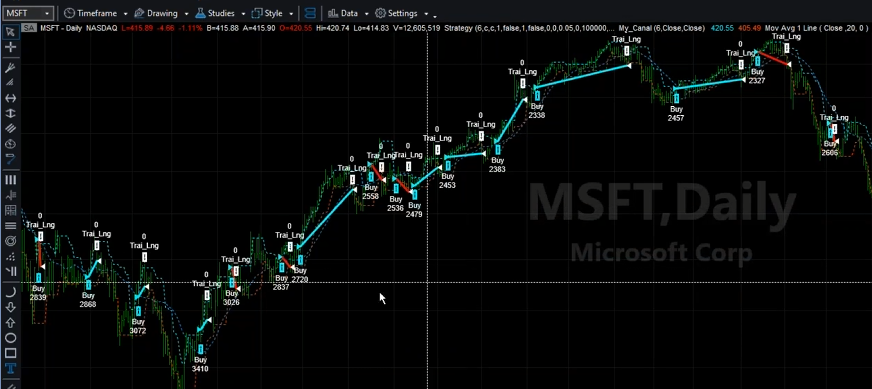 


ves ya cambiado completamente el sistema es otro sistema no para entrar a salir a salir a salir a salir a salir que cuesta mucho porque el precio va haciendo sus oscilaciones y alguna vez oye y ahora un trocho grande pero la mayoría de veces no porque se va a salir todo el rato y ahí está el equilibrio de los tendenciales este es el problema en los tendenciales que para pillar largos recorridos y no caer en esto hay que dejarlo sufrir claro que hay maneras de utilizarlo más para evitar las otras pero un tendencial puro es uno de los casos de trelling aunque ya os lo comenté en la teoría es verdad que trelling acopla bastante acopla bastante pero en porcentaje acopla menos entonces acopla bastante quiere decir que lo lo vas a lo metes ahí pero 25 y luego empezarás a ver que a veces ha degradado ha degradado 


**es que el trelling hay veces que se va directo a pérdidas igual por el cierre o algo y hace más de lo configurado**   
que te pierde más de lo que tienes esperado que es decir? depende cómo lo tengas votado si lo pones desde el principio si lo pones en principio que se siempre puesto en mercado al final claro te puede pillar un gapos aquí en este caso vas a tendencia y te vas a tragar claro los resultados el otro día lo hablaba en el directo del jueves había no sé qué acción había caído 15 pues te lo tragas claro esto hay en acciones tienes ese problema aquí muy diversificado y porque te lo tragas en tendencia tenés el problema pero ya veremos otro tipo de estrategias cuidado es decir al final ahora estamos viendo esta pero pero que tiene su lado bueno y su lado malo al final y por eso la idea es tener varias tener una así tener otra que te lo compensa y ésta te queda enganchada pero a lo mejor tienes otra que había iba corto en petróleo y no sé qué hay que ir diversificando los tendenciales ya digo que son de hecho cuando uno no tiene mucha experiencia son sistemas bastante poco llevaderos vale lo hablamos en la teoría normalmente es más tendencial hay más llevadero un sistema antitenencial porque porque el antitencial no deja no tiene colas largas en cambio los tendenciales o sea con dentro lateral no para de fallar no para de fallar no para de fallar y te devuelve mucho el mercado 


**¿tendencial puro no es usual poner un SL fijado mejor trailing?**  
depende en que que vayas depende en que vayas un esto en un tendencial en un tendencial puro el trailing y generando somos súper amigos de los que los digo estamos ahora empezando las prácticas como el que dice vale es la primera estrategia que hemos hecho vale pero -si algún tipo de sistema va bien el trailing es en el tendencial-  en el tendencial puro si alguno vale va bien este. nosotros operando en live ahora no usamos traling. vamos a SL. pero no es tendencial puro no es tendencial puro en un tendencial puro ya digo el trailing es el caso que más que más sentido tiene sobre todo en acciones sobre todo en acciones buscando el largo recorrido que es un poco la idea este sistema que lo puedes configurar así pero no es la idea ya ese sistema y por eso lo hemos metido en las 100 acciones es que corra. vale es un sistema para correr esta es su idea su sentido y claro es un o sea es un sistema que cuando netflix sube un 200 por ciento lo pilla me entiendes ahora eso tiene un precio me entiendes eso tiene un precio cuando meta está en lateral un montón de tiempo pues te lo tragas ahora en cambio está en tendencia que alucinas pero claro tu imagínate ya en su setup básico que no no no no voy ahora a 6020 vale que solo hablamos y le quito el filtro vale esto ya es configuración básica original sin hacer nada el largo que lleva en meta 


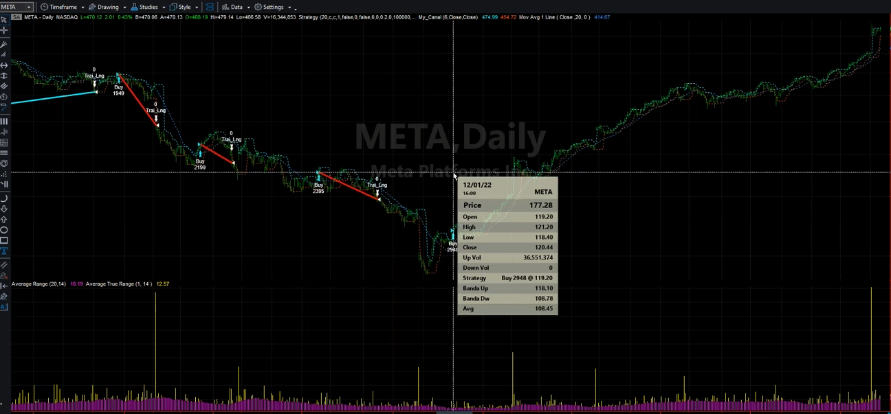 

está comprado ahora mismo en 119.20 están 470 lleva 400 por ciento claro eso sólo lo pillas así sólo pillas así claro a costa de eso aquí se te ha tragado tres hostias que te han dejado la cuenta bonita pero hay que estar dimensionado para ello y cuando está estado en lateral pues está cosido también claro 

bueno en estas etapas ha aguantado muy bien porque claro tiene mucho margen pero hay acciones o yo que sé cuando netflix mira netflix es tremendo porque netflix tuvo ahora sí pero a tener una época hace tiempo y ahí a la tragadita perdona venga comprado en 95 98 y te sacan 300 

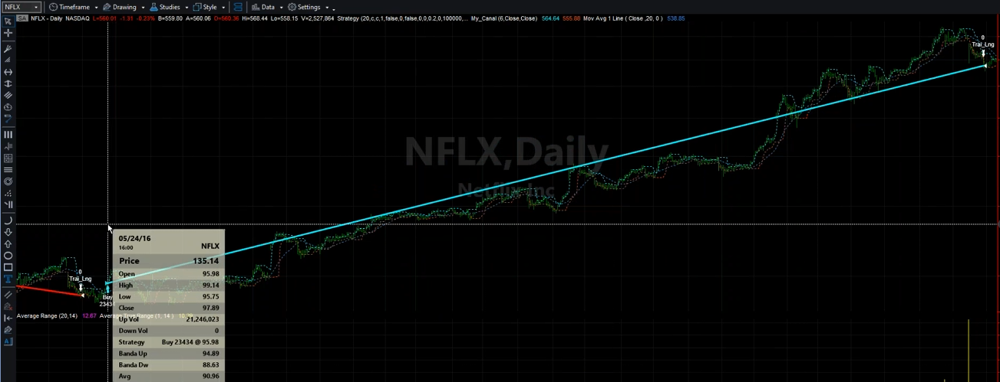 

bueno tiene lo bueno y tiene lo malo pero cuando se pasa una época mala pues te hace polvo pero es aquí el tiempo que está que no hace nada si no si no si no al final coge tendencia en el tendencial 

con SL puro tiene que tener otra salida, si yo aquí este sistema tiene puesto un esto pero como salgo tengo que necesito otras sí o sí porque si no vuelve yo te desactivo el trailing ahora y te pongo el mismo en stop el mismo 0 20 

 

no sale nunca

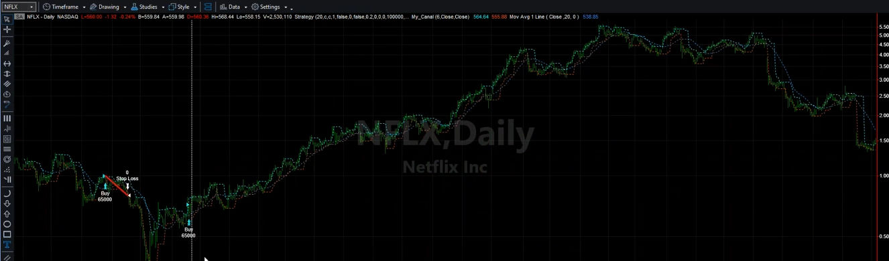 

porque no cae 0 20 el precio de entrada nunca ya tiene que caer 0 20 del punto de entrada, al final no es igual 0 10 necesita otra salida cambio el trailing no el trailing garantiza que no necesita nada más entonces si yo no quiero muchos grados de libertad y demás quiero **simple** trailing me soluciona que sólo puedo usar esa salida yo aquí sólo tengo un donchian y una salida nada más 

**¿pérdidas se podían compensar con el lado corto bastante bien?**   
Cuando hablamos de si las pérdidas del lado largo se podrían compensar operando también el lado corto, la respuesta es que sí, en teoría es posible. Pero en la práctica es muy difícil operar cortos en acciones con un sistema tendencial como este. Es factible, pero muy complicado.

La estructura del mercado lo explica. Las acciones suelen mostrar caídas muy bruscas y recuperaciones igual de rápidas. Es decir, el precio baja fuerte, pero rebota enseguida. Esto hace que un tendencial corto tenga enormes dificultades para mantenerse en la operación: entra bien, el precio cae, pero el rebote lo expulsa casi de inmediato.

Para ilustrarlo, probamos exactamente el mismo Donchian pero aplicado al corto. En cuanto lo activamos correctamente (con el filtro bien configurado), se ve claro: pierde de forma sistemática. No porque el código esté mal, sino porque las acciones no desarrollan tendencias bajistas limpias con frecuencia suficiente. El precio retrocede constantemente hacia la media y rompe cualquier estructura tendencial bajista antes de que pueda generar beneficio.

En un gráfico se ve muy claro: el sistema entra en una ruptura bajista, el precio cae unos días, pero enseguida rebota con fuerza y te saca. Luego vuelve a caer, pero ya estás fuera; el sistema vuelve a entrar tarde, y vuelve a producirse otro rebote que lo vuelve a expulsar. Este comportamiento es habitual en acciones y explica por qué el lado corto, usando un Donchian tendencial, prácticamente no funciona.

Por esta misma razón, no basta con invertir el setup del lado largo. Para operar cortos en acciones suele hacer falta *otro tipo de lógica*, normalmente más rápida en las salidas y en muchos casos con componentes que se acercan más a *mean reversion* que a tendencia pura. Con un tendencial diario clásico, el lado corto acaba siendo estructuralmente inferior.

Incluso en nuestra operativa con el Nasdaq lo hemos visto: el lado corto se puede operar, pero es más volátil y más ingrato, y en varios años (como el pasado) sistemas sólidos como Apolo han acabado perdiendo en cortos a pesar de funcionar bien en largos.


**¿a mejor bajar el frame más tendencia bajista más?** 

Aquí tienes una versión **más clara, ordenada y narrativa**, manteniendo **todas tus palabras y el sentido técnico**, solo mejorando el léxico y la cohesión. No he eliminado información.

---

Sobre si **bajar el timeframe** podría ofrecer más tendencia bajista: bueno, puedes hacerlo, sí, pero también puedes optar por operar *otro tipo de sistema*, Antonio. No hace falta limitarse a buscar tendencia. Perfectamente puedes buscar tendencia en el lado largo y trabajar *anti-tendencia* en el lado corto. Ambas cosas son válidas.

Bajar el timeframe también es posible; no digo que no. Pero hay que entender que el mercado es *fractal*: en el lado corto, si bajas el timeframe, ganarás algunas cosas pero perderás otras. No es necesariamente más sencillo; de hecho, suele ser más difícil. Aunque es cierto que en marcos temporales más cortos puede ayudarte en el *control del riesgo*, sobre todo reduciendo pérdidas cuando la operación falla. En ese sentido, sí puede funcionar mejor. Pero también te expulsará antes de las operaciones, así que no todo es ventaja.

Por eso *tendencia pura en cortos es complicado*. Muy complicado. En el lado corto hay que buscar otro enfoque, más basado en *breakout anti-tendencial*, en rupturas rápidas para salir pronto. Trabajar salidas por tiempo, por take profit, marcar un objetivo total o parcial, jugar con esas opciones. Ese es el camino más práctico.

