## Sobre el backtesting tica a tica y Bar Magnifier

Recordar que cualquier optimización simplemente trata de reproducir, trata de simular lo que habría ocurrido, pero nunca lo va a conseguir exactamente, es muy difícil.

De hecho, para hacerlo habría que hacerlo con lo que TradeStation se llama *lookinside barbacktesting* en multichart se llama *bar magnifier*, pero habría que hacerlo tica tica y tica tica, normalmente no tenemos muchos años, normalmente tenemos seis meses, es complicado tener una base de datos muy larga tica tica, entonces es muy difícil hacerlo tica tica y por lo tanto a veces recorremos a hacerlo en un minuto por eso, porque sí que en un minuto tenemos muchos años y nos es más fácil, pero hay veces que en un minuto no es real tampoco y por eso a veces no pasa, yo lo he visto, yo lo he visto en sistemas de que en un minuto no estaba reproduciendo bien, entonces en este caso el bar magnifier también tendría trampa, pero de todas maneras de todas maneras aquí ya comenta Alejandro que al activar el bar magnifier pues se ha dado cuenta que ya había fallo.

## Debate sobre Sharpe Ratio negativo

Luego también había habido un debate bastante interesante sobre el *sharp negativo* y esto sí que era bastante tema de la teoría y quería aclararlo. Preguntaba alguien qué significaba, si teníamos el negativo; le contestaba otra persona que no podía ser más que si el numerador era negativo. Esto es cierto, pero cuidado: el numerador recordar que tiene dos datos. El numerador —aunque nosotros, por simplificación, a este valor le ponemos cero— en Tradestation **no está a cero**, y eso cambia todo.

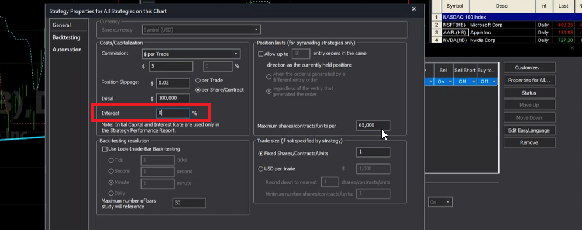

Este valor es el que resta de Sharpe: esto aquí es el interés libre de riesgo, de acuerdo, esto es lo que se resta del numerador. Recordad que conceptualmente tanto Sharpe como Sortino miden *el retorno por encima de la tasa libre de riesgo*. Y esto lo dividen, en el caso de Sharpe, por la desviación típica de *todos* los retornos; en el caso de Sortino, por la desviación de los retornos *negativos*, porque considera que los positivos —con buen criterio en mi opinión— no tienen nada de malo, y por eso Sortino estima solo la desviación de los negativos. Pero en ambos casos, en el numerador, si tú pones aquí un 2 %, él te lo resta.

* Sharpe (anualizado):
  $$
  \text{Sharpe} = \frac{\mu_R - r_f}{\sigma_R}
  $$

* Sortino (anualizado):
  $$
  \text{Sortino} = \frac{\mu_R - r_f}{\sigma_{R^-}}
  $$

Donde $ \mu_R $ es el retorno medio, $ r_f $ la tasa libre de riesgo, $ \sigma_R $ la desviación estándar de *todos* los retornos, y ( \sigma_{R^-} ) la desviación estándar solo de los returnos negativos.

Todo venía de la pregunta: **¿qué niveles de Sharpe son buenos o malos y qué significa un Sharpe negativo?**
De entrada, cuidado con los Sharpe en general: los ratios dependen de la temporalidad. Normalmente siempre nos gusta *anualizar los datos*. Y el que estás viendo tú en Tradestation es *mensual*, por eso ves un ratio muy bajo. Es mensual, pero representa lo mismo que el anualizado si aplicas la transformación.

Por ejemplo, tenías un Sharpe mensual de *0.3*. Si lo anualizas multiplicando por la raíz de 12, te da alrededor de *1*. Esa era la idea original: la cifra parecía pequeña porque era mensual, no anual.

El problema aparece cuando enseñas la curva y dices: *“Hombre, la curva está bien, pero tengo un Sharpe ratio negativo.”*

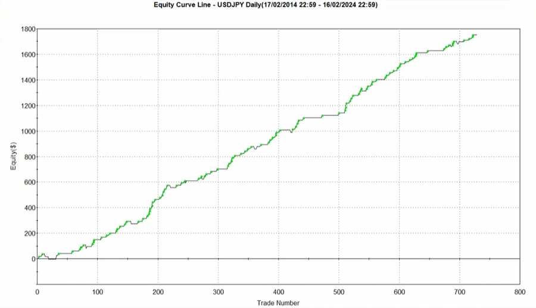
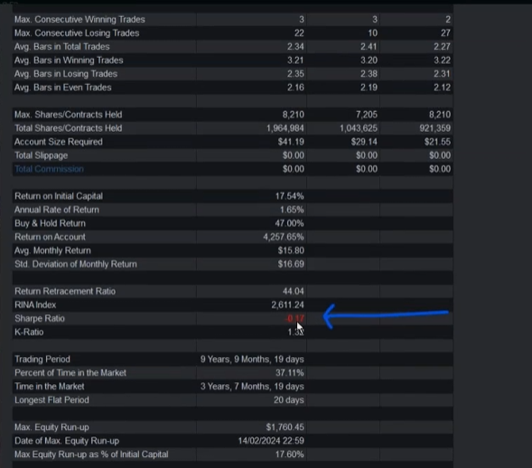

Vale, la curva está bien, **pero no está normalizada**. Que la curva gane dinero está bien, pero: ¿cuánto dinero es? A la izquierda ya se nota que es muy poco. Entonces al final puede ser por un tema de gestión monetaria: te estás exponiendo con muy poca cantidad.

Y si tú le restas un 2 % mensual, le estás metiendo un palo bastante considerable.

Por ejemplo:

* Retorno mensual del sistema: +0.3 %
* Tasa libre de riesgo configurada: –2 %

**Numerador = 0.3 % – 2 % = –1.7 %**  
→ Numerador negativo  
→ Sharpe negativo  
→ Incluso aunque la curva sea positiva.  

Si le pones cero (como hacemos en el curso) verás el Sharpe sin ese ajuste: lo que llamábamos “Sharpe bruto”. Nosotros solemos trabajar eliminando la tasa libre de riesgo para evaluar solo *el retorno del sistema* dividido por *la desviación de los retornos*. De esta manera no se ve alterado por ese componente externo, ya que siempre es igual y no depende del tipo de interés.

Conceptualmente tiene sentido pedir que un inversor rinda más que la tasa libre de riesgo, por eso está en la fórmula. Pero en backtesting, donde la posición monetaria puede ser muy pequeña, tiene efectos distorsionadores.

Entonces ahí radica el problema: seguramente te estabas exponiendo muy poco y si lo apalancas un poco más, ese 2 % mensual ya da para que el Sharpe salga negativo. Te daba negativo porque, aunque los retornos son positivos (aunque sean poco positivos), le estás restando mucho por la tasa libre de riesgo. Por eso te da negativo.

Es interesante comentarlo porque había habido ahí bastante debate, bastante debate sobre el tema, y quería aclararlo.

los ratios de Sharpe que te comentaba a nivel de anualizado a nivel de anualizado a partir de 1 pues se considera un ratio de sharpe válido, y 2 pues bastante potentísimo ,  pero anualizado anualizado recordar que para anualizar esto lo vimos en la clase pero si es mensual multiplicas por raíz de 12 vale si el dato es semanal por 2 semanas y si es diario depende de 252 o 360 es un poco dependiendo del tipo de dato que sea , pero esa es la manera en que anualizamos un dato diario o mensual 

Si tú tienes un 0.4 lo multiplicamos por raíz de 12 nos haría 1.39 deacuerdo 139 0.4 mensual sería uno 1.39 anualizado . entonces ese es el dato de vigilar el tema en las periodos 

**José comentaba que en cortos que no sé si estaba haciéndolo bien o que no le encontraba nada**
A ver, tal como hemos planteado este sistema, no sé cuántos habéis intentado trabajar el lado corto. Nosotros también lo hemos probado —aunque ya teníamos bastante claro lo que iba a pasar—, pero igualmente hicimos una prueba para verificarlo. Y sí: en cortos es muy complicado sacar algo en esta configuración.

Recordad que estamos operando acciones, y las acciones son todavía más tendenciales que el índice en términos generales.
Tienen más desviación, más volatilidad, dejan correr las tendencias con colas más largas y se mueven de forma más abrupta tanto al alza como a la baja.
En este contexto, encontrar algo que funcione en cortos simplemente entrando con un Donchian y saliendo con un stop porcentual o un trailing es complicado. Muy complicado.

Sí, a lo mejor si hubiéramos reducido la cesta de acciones podríamos haber encontrado algo sobre-optimizando, pero así no. Incluso sobre-optimizando sería difícil, porque la muestra es muy variada. Y precisamente por eso estas pruebas son tan buenas: cualquier regla que funciona aquí suele ser realmente robusta, porque la estás probando en muchísimos activos que tienen correlación entre ellos… pero no todos, como ya vimos.
Aun así, en este set-up es muy difícil encontrar cortos rentables en acciones.

En el curso veremos algo al respecto, seguro. En la práctica sí veremos estrategias de cortos en renta variable, pero no será con un canal Donchian, porque Donchian lleva un poco de retraso. Ese retraso, en la operativa de cortos, penaliza muchísimo.

Para cortos en acciones hay que buscar cosas rápidas, mecanismos de entrada que disparen muy pronto. Y Donchian no encaja bien con eso.
Puedes ponerlo en una sola vela, sí, pero entonces ya no es Donchian, es simplemente el mínimo del día —que también puede valer, pero ya no es el concepto Donchian original.

Por eso es tan complicado utilizar un Donchian en acciones y pretender, al mismo tiempo, encontrar estrategias de cortos consistentes.

Pero bueno, quería que os enfrentarais a intentarlo. Alguien lo ha probado —porque me lo ha comentado— y me alegra. Cuando os diga estas cosas: probadlas, porque es como más se aprende.

**el gol forward de Multicharts a mí no me gusta nada.**   
Tiene la ventaja de que es muy rápido, sí, pero aun así no me convence: su interfaz no me resulta cómoda. Me gusta mucho más el de Tradestation, aunque es verdad que es muchísimo más lento; no se puede tener todo. Aun así, este lo voy a mantener porque, lógicamente, durante las prácticas haremos casos de gol forward completo.

También comenté en la otra clase que hubo dos o tres personas que opinaron sobre el tema, pero sois muchos más y os recomendé —y lo vuelvo a hacer para quienes no lo hayáis visto— que veáis el directo de la clase de Robotraider de Iván Sherman. Yo estaré allí en abril dando una ponencia. Ese vídeo es bastante interesante, y en esa ponencia él comenta que no es muy partidario del gol forward. A partir de ahí surgió un pequeño debate sobre el tema.

Para mí, el gol forward sí es importante y sí me gusta, pero tampoco es la panacea universal. Por ejemplo, a este sistema de acciones no le hemos aplicado gol forward, y esto lo comento ahora sobre todo pensando en Alejandro, porque todo lo que me ha ido mostrando y explicando está siempre basado en gol forward. Está bien pasarlo, pero el gol forward —y esto creo que quedó claro en la teoría, pero lo aclaro ahora— es simplemente una prueba de estrés. Hay otras pruebas de estrés posibles, y también pueden ser válidas. Esta es solo una de ellas.

Por eso, no significa que obligatoriamente tengamos que elegir parámetros usando gol forward. Ya dije que es una opción, válida en algunos casos, no tan útil en otros. No siempre es el mejor camino y no tenéis que ir siempre a buscarlo; a veces no merece la pena. El método convencional, la optimización convencional, puede dar un resultado igualmente bueno. Por ejemplo, Iván comentaba que él prefiere hacer validaciones moviendo la base de datos, haciendo pruebas de validación, y después seleccionar los parámetros mediante una optimización convencional.

Nosotros, de hecho, seleccionamos los parámetros de todos los sistemas que operamos actualmente usando optimización convencional, aunque ese sistema haya pasado gol forward. No es obligatorio. El gol forward es una prueba de estrés; hay otras, y esta es solo una más. Se puede usar o no, según convenga.

De todas formas, aclaro teóricamente que yo prefiero claramente el modo anchored (anclado) siempre que sea posible. A veces, el número de trades no permite hacerlo. En ese caso, es mejor probar con anchored que no hacerlo, pero recomiendo anchored siempre que se pueda.

Comento esto porque te veo —hablando de nuevo hacia Alejandro— muy centrado en comparar resultados, cuando el objetivo real del gol forward es otro: estresar la estrategia y comprobar su robustez. Lo que haces en el gol forward es someter la estrategia a cambios constantes de parámetros y a cambios del corte del histórico entre in-sample y out-of-sample, lo cual equivale a que la estrategia ha operado en muchos "mercados" distintos a nivel estructural.

Cuando hablamos del modo cluster, que es el que a mí me gusta —el de un único cluster, por ejemplo 7 runs y 20%—, entiendo que tenga cierto peligro y ahí sí que entraría un poco en el discurso de Iván y otros autores, que defienden que en algunos casos se puede caer fácilmente en sobreoptimización. Pero en el cluster generalizado no lo compro para nada. En la versión completa del cluster, no lo veo así, porque justamente lo que se hace es mover la ventana constantemente: se mueve el número de runs y también el porcentaje de out-of-sample (5%, 10%, 20%, 30%, etc.).

Esto provoca que todo tu histórico quede cortado de formas distintas una y otra vez. Esa es precisamente su fuerza: la estrategia demuestra que pasa la prueba debido a esa versatilidad.

Ese es el objetivo. Solo ese. No es comparar ni no comparar. La pregunta es: ¿la estrategia pasa la prueba o no la pasa? Ese es el objetivo principal. Una vez la ha pasado, ya se evalúa el resto.

Aquí tienes el texto con **léxico mejorado**, más claro, ordenado y fluido, **sin cambiar el contenido ni las ideas originales**, solo corrigiendo estilo, repeticiones y frases confusas. No he eliminado nada importante; solo he pulido y hecho más entendible todo el discurso.

---  
  
**divisas**  
Cuidado, porque la comparación que estás haciendo me hace pensar que no tenemos claro qué significa realmente que un activo sea *tendencial*. Si miramos la renta variable, en términos generales (con excepciones, y en acciones con muchas más), lo lógico es que exista una tendencia alcista a largo plazo. ¿Por qué? Porque las empresas recogen beneficios y están diseñadas para ganar cada vez más dinero. Ese es su propósito de existencia. Por lo tanto, es normal que su tendencia a largo plazo sea crecer.

¿Y por qué caen entonces? Caen porque el mercado se excede, porque las empresas van mal, o por ciclos económicos. Pero su lógica empresarial —igual que la lógica biológica de los seres humanos, que nacen, crecen, se reproducen y mueren— es crecer mientras puedan. Algunas empresas fracasan y cierran, pero las que sobreviven tienden a subir con el tiempo.

`appl`
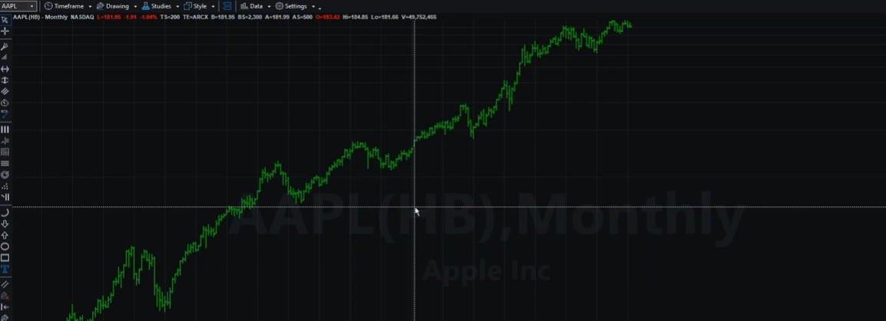
`eur/usd`
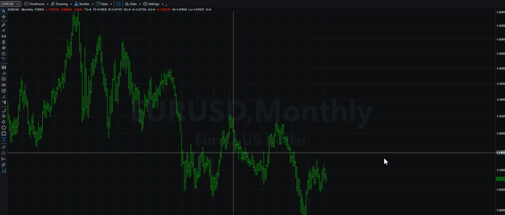

Ahora bien: cuando hablamos de si un activo es *tendencial* o no, nos referimos a otra cosa.
Si observas un gráfico de largo plazo en **divisas**, normalmente no vas a ver tendencia. En la mayoría de los casos se mueven en rango. Quizás alguna pareja de divisas sea más tendencial que otra, pero en general, en teoría, muchas tienden a oscilar lateralmente.

Alberto lo comentaba con buen criterio:
En divisas **siempre** cotiza una contra otra. Hay una divisa principal y una secundaria, y justamente por eso, a largo plazo, el movimiento tiende a ser lateral. Ninguna de las dos puede crecer infinitamente respecto a la otra porque representan economías grandes y relativamente estables.

Aun así, sí existen divisas que muestran cierta tendencialidad, pero si miras un gráfico mensual como este, lo normal es que **no aparezca**:

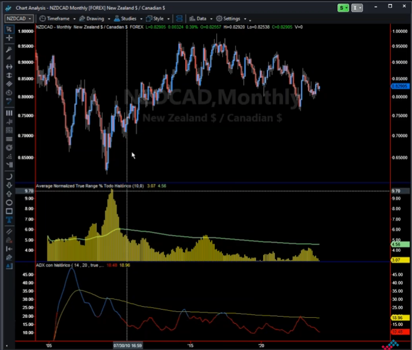

Los datos de **ADX** también reflejan eso: valores 18–19, bastante bajos. Eso confirma que el rango domina. Sin embargo, en diario o intradiario, muchas divisas sí muestran tramos tendenciales claros. Por eso, es verdad que generalizar demasiado fue quizá exagerado: las hay más tendenciales que otras.

Normalmente, los pares relacionados con el yen suelen ser más tendenciales. Por ejemplo, USD/JPY en diario muestra un ADX de 29, lo cual ya indica fuerza de tendencia, aunque igualmente presenta rangos amplios:

Por otro lado, EUR/USD no es especialmente tendencial.
Y aquí es importante entender una regla general (con excepciones, como todo):

Cuanto *más grande* es un activo —y mayor la economía que representa— más controlado tiende a estar su movimiento y más lateral suele ser.

Por ejemplo:

* El *S&P500* es menos volátil que el *Nasdaq*.
* Las *small caps* son más volátiles que las *mid caps* y que las *blue chips*.

Esa relación entre tamaño y volatilidad se replica en divisas:
cuanto más importante es una divisa, más estable tiende a ser, y por lo tanto, menos tendencial en el largo plazo. Entre las 28 principales divisas del mundo —las que solemos mirar— ninguna es propiamente “pequeña”. Aun así, fuera de estas hay pares muy exóticos, de economías pequeñas, que pueden ser extremadamente volátiles y sí mostrar tendencias más claras… pero no son las que normalmente se operan.

En resumen:Sí, en un gráfico mensual la mayoría de divisas se mueven lateralmente.
Pero en diario muchas presentan *buena tendencialidad operable*, y vale la pena explorarlo.

Eso sí: si comparas con un gráfico de equity (acciones), siempre verás en acciones una tendencia alcista a largo plazo. En cambio, en intradía, la historia cambia completamente. Cuando yo hablo de que un activo es tendencial, me refiero sobre todo a *su capacidad para dejar funcionar sistemas tendenciales*, no simplemente a si sube o baja mucho.

**¿existe manera de analizar portfolios de divisas en portfolio maestro?**  no

***Él dice que hablabas de que lo probamos en el nasdaq100 pero que no necesariamente las tenemos que operar en ese que lo que estamos haciendo es probar el sistema crearlo confeccionarlo analizarlo evaluarlo pero luego ya lo montaremos para operar y dije que podrías operar las 10 más capitalización y él comenta que esto no tiene nada que ver con el desempeño del sistema.    Viene a decir que por qué no porque elegir esas y no otras y porque no elegir en base al desempeño?*** 

Bien. Lo primero: no quise dar a entender que deban ser obligatoriamente las de mayor capitalización. Es verdad que el volumen es un factor importante y es cierto que nosotros, como solemos pensar en estrategias con **alta capacidad operativa** (por si algún día necesitamos mover millones sin problemas de ejecución), de forma casi automática nos orientamos hacia activos grandes y líquidos. Pero no es obligatorio. Para nada.

Puedes elegir otro criterio. Pero si escoges por rendimiento pasado únicamente, ahí sí estarías rozando la sobreoptimización. Y lógicamente entiendo que digas: “Es que hay 10 que funcionan de maravilla”. Perfecto, no digo que no puedan estar dentro. Pero yo **no pondría solo esas 10**, porque siempre hay que tener presente el *error*, el *ruido* y el *riesgo de sobreoptimización*. Lo he repetido muchas veces: certeza absoluta no va a haber nunca. Lo único que podemos hacer es acercarnos lo máximo posible a una estrategia que consideremos robusta.

Por eso hay que pensar siempre en el riesgo: Si te equivocas, y apuestas únicamente por las 10 que más ganan, probablemente te pegues un golpe.
Por lo tanto:
— No elegiría *solo* las que más ganan.
— Pero sí, perfectamente *podrían estar* dentro de la selección.

En nuestro caso probablemente escogeríamos las de mayor capitalización por capacidad operativa, porque suelen tener mejor ejecución, menos slippage, más estabilidad, etc. Pero comprendo que ese criterio no tiene por qué ser el único ni el obligatorio. El desempeño puede formar parte de la decisión, sí, pero no debería ser el único criterio.
Ahora, si quieres, volvemos al sistema para seguir avanzando.

***Comenta juan manuel si un mismo sistema con iguales o diferentes inputs se operan en corto y en largo por separado se debe contar como uno o como dos sistemas entonces portfolio?***   

En realidad da igual, pero yo lo consideraría como dos, porque en la práctica los tratamos como sistemas independientes. Esto no significa que todos lo hagan así; de hecho, este tema genera cierta controversia.

Hay quien defiende que un sistema verdaderamente robusto debe funcionar igual de bien en largo y en corto, con los mismos parámetros, y es cierto que cuando ocurre es una señal de fortaleza. Sin embargo, desde el punto de vista práctico y estadístico, suele ser mejor trabajarlos por separado, sobre todo en acciones. En renta variable existe un sesgo estructural al alza que condiciona el comportamiento: las acciones se mueven, crecen y se organizan de una forma muy diferente en el lado corto. Eso hace que un sistema que funcione bien en largo, en la mayoría de ocasiones, no funcione igual en el corto. El ejemplo del Donchian lo muestra de forma evidente: en largo funciona con relativa facilidad; en el corto se vuelve extremadamente difícil encontrar algo que tenga sentido.

Por eso puedes considerarlos como dos sistemas distintos. Ahora bien, si los parámetros son exactamente los mismos, entonces conceptualmente sería uno solo, aunque operativamente podría dividirse en dos módulos. En la práctica casi siempre existen pequeñas variaciones: quizá en el lado largo se aplica un filtro de volatilidad y en el corto no, o quizá se añade una regla específica para el corto. Mantenemos el núcleo común, pero adaptamos ciertos detalles porque el comportamiento del mercado no es simétrico.

Esto mismo ocurre en nuestras propias familias de sistemas, como Némesis, Artemisa o Apolo, donde el corazón del sistema es compartido, pero hay pequeños ajustes según si opera en largo o en corto. En divisas el comportamiento suele ser más simétrico, lo mismo que en algunas materias primas, pero donde menos simetría hay es en acciones. Las empresas, por su propia naturaleza, existen para crecer, y esa lógica se traslada al precio. Por eso cualquier acción relativamente sana presenta un sesgo alcista que hace que sea mucho más sencillo diseñar un sistema que funcione en largo que otro que lo haga bien en el lado corto.

### Venimos de aquí [practica_04](../../14-practice-04/transcripts/practica_04_menu.md)

Ya os comenté que Multicharts tenía un bug en este punto: las fórmulas que incorpora por defecto están pensadas para sistemas individuales y, cuando se aplican a un portfolio, dejan de funcionar correctamente. Da igual; lo que hemos hecho es calcular nuestras propias métricas directamente a nivel de portfolio.

Hemos recalculado tanto el Sortino como el Sortino ajustado. Recordad que el Sortino ajustado incluye aquella corrección de dividirlo por la raíz cuadrada de 2, precisamente para poder compararlo en igualdad de condiciones con el Sharpe y con el UPI (Ulcer Performance Index). El UPI, en esencia, es similar a un Sharpe pero con el Ulcer Index en el denominador. Ya os comenté en la parte teórica que el Ulcer Index me parece especialmente interesante, porque captura de manera muy efectiva la profundidad y duración de las caídas.

El Sortino también es muy útil. Si no tenéis otra métrica más completa, el Sortino sirve perfectamente, pero cuando podemos disponer de Sortino ajustado y UPI, la comparación y el análisis de robustez del portfolio se vuelven mucho más informativos.

entonces al final esto como lo hemos hecho? el multichar es lo que os decía al final en algunas cosas fantásticas y tiene otras pues que no lo son tanto y por ejemplo a nivel de porfolio bueno a nivel de porfolio y a nivel de optimización normal también no te deja hacer como entre ese son un periodo insample y un periodo outofsample en la misma utilizacion, cosa que es muy práctica pero pues no te deja entonces lo tienes que hacer tú que no es lo mismo pero a nivel de análisis ya te ya te sirve.

bueno nosotros simplemente hemos recogido el periodo ensample hemos hecho el periodo oufosample y hemos hecho el periodo all data que los tenéis aquí 

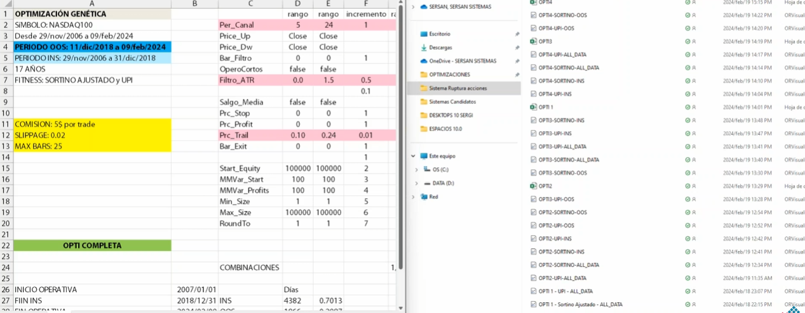

la sesion pasada ya vimos un poquito esto pero recordaros teníamos datos de upi y negativos no teníamos sortino y ahora pues ya tenemos todos estos datos hechos para que juntos podamos tomar una decisión mejor es lo que os decía aquí no vamos a hacer un wordforward vale porque además con una cartera de múltiples activos es muy muy complicado en un sistema que opera realmente tampoco uno de los problemas que tiene el world forward es que cuando corta y es justamente los detractores dicen eso muchos programas de hecho ninguno de estos dos lo hace cierra la operación no hace mal to market entonces claro si te dejan un trade abierto ese trade no cuenta entonces en ese sistema eso es muy crítico porque es de muy largo plazo puede estar meses con una operación encima tienes muchas acciones distintas empiezan en fecha distinta es muy complicado hacer un world forward riguroso en este en un sistema que lo vas a pasar en las 100 acciones nasdaq al final no vale la pena y además como os digo no nos hace falta nos hace falta es decir realmente tenemos una cantidad de información que nos puede permitir considerar que el sistema es robusto sin hacer sin hacer world forward en este caso 

entonces la optimización grande aquí recordar que inicialmente aquí hablamos hemos hecho las las dos cosas otra vez para que veáis la diferencia de acuerdo porque quería y ahora ya tenéis ahí el documento bien y quería generar un debate interesante sobre esto y que os quedará realmente claro para pasar al siguiente vale? 

inicialmente hicimos como hablamos en la teoría de hacer la optimización paso por paso de acuerdo 
* primero per canal vale 
* luego hemos hecho el trailing y 
* luego en vez de hacer el filtro sólo he hecho el filtro con él ATR 

esto es interesante para ver un par de cosas pero también os digo que ese sistema con dos si tú tienes dos inputs con sólo dos normalmente vas a poder hacerlo en una. Porque porque aqui el mapa el mapa ya te va a salir con dos bien y aqui el mapa te da mucha mucha información visual y no tienes ahí mucho riesgo de caer en sesgos o sobre optimizaciones es verdad que en el fondo teníamos tres tres variables pero si tú empezabas sólo por el canal de esta manera nos hemos dado cuenta claramente que ya se veía un poco que en el canal ¿que vemos? 

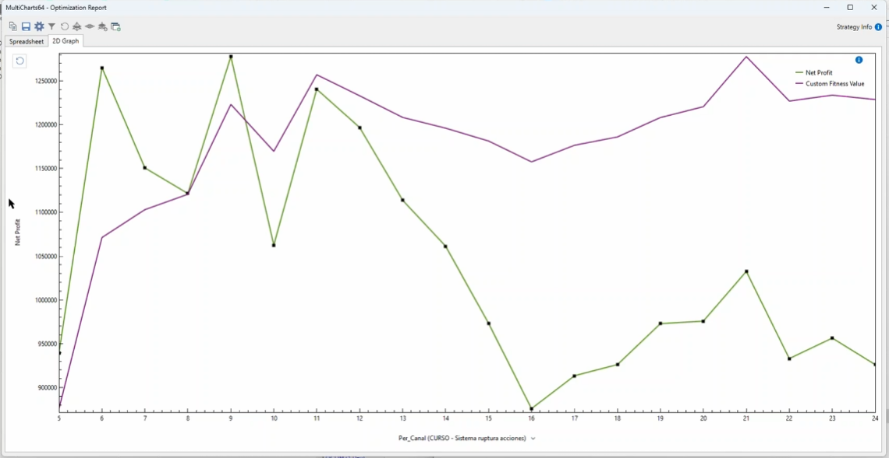

cuando vemos una variable sola quería enseñaros lo por esto lógicamente el aspecto visual es muy sencillo de interpretación vale simplemente tenemos una variable contra otra de acuerdo aquí tenemos el `net profit` pero podemos el `costum finness` tengo los dos lógicamente bueno lógicamente tienen como veis una absoluta correlación es decir al final quiere decir que el riesgo está bastante igualado de acuerdo pero es el tema perdón perdón es la 2 es la que os quería enseñar ahora sí venga hablando del stress ahora sí ahora sí ahora sí esta sí sí justamente ahora vamos a la otra 

aquí vemos simplemente que dejando bloqueado  0.20 el trailing vemos que el canal tiene poca influencia de acuerdo vemos que tienen muy poca influencia en `net profit` aún tiene un poco aunque fijaros la escala cuidado con la auto escala que esto en los mapas es muy importante y es un motivo por lo que uno de los cambios que he hecho no sé si os habéis fijado es en reducir un poco la escala que justamente en el discod le sugería eso alejando cuando preguntaba que le salía un dato demasiado bueno, a lo mejor a veces hay que quitarlos porque a veces están saliendo buenos porque son malos de acuerdo? porque por ejemplo tienen muy pocos trades entonces hay que hay que siempre analizar bien a los datos y tener claro que que a veces tienes que eliminar una parte del histórico, en este caso por ejemplo el otro día estábamos haciendo desde 1 hasta 20 algo y final hasta más arriba aquí hemos empezado en 5 porque porque los de 1 a 5 no me interesan no me interesan rompen el concepto del donchain que yo busco . Si yo lo miro en el gráfico me doy cuenta que no me sirve ese tipo de estrategia , no es lo que yo estoy buscando.

al final el que gobierna directamente la estrategia siempre el trailing, el canal tienen bastante relativa poca influencia y por eso veis luego lo veréis en la múltiple que se verá muy claro es muy estable. 

fijaros en el ratio de custom fitness tiene poca influencia tiene poca influencia 

sí que baja un poco más en los cortos pero a partir de 10 se estabilice casi no cambia nada da lo mismo usar 10 11 12 13 15 que 20 más son nada lo mismo pero me entendéis tiene muy poca muy poca mejora o empeoramiento. 

En cambio en el otro es todo lo contrario 
`sortino - all_data` 

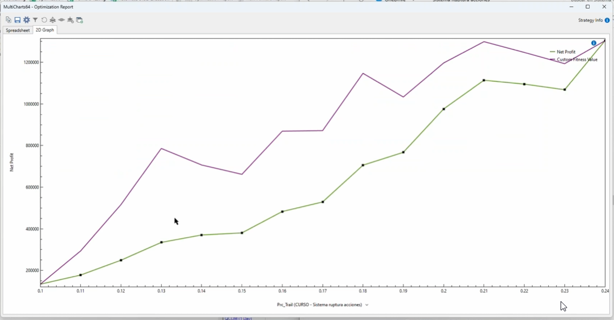

es el contrario el trailing pero aquí dices bueno oye parece que cada vez es mejor ya pero es lo que os decía de la trampa antes con los trades si yo lo llevo hasta arriba cada vez va a ir mejor cada vez es mejor pero me va a hacer menos operaciones y esa es un poco la trampa por eso cada vez va bajando bajando fijaros cómo baja linealmente a medida que sube el parámetro y ordena por el input y es totalmente lineal a relación con 0.10 5000 trades con 0.24 1300 si le pongo 0.35 200 trades hace 206 con 100 acciones que eso no es nada 

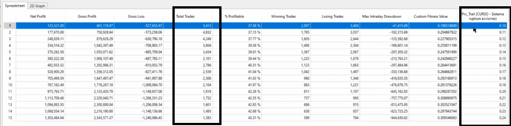

entonces hay que vigilar porque nos podemos hacer trampas esto donde lo vemos lo vemos mirando el gráfico, lo vemos en el gráfico de verdad! que ya lo comenté también en la teoría es una cosa que me choca de algunos colegas que a veces que me dicen que no miran gráficos de verdad no lo entiendo no entiendo porque los datos son muy tramposos a veces sino no les ponemos contexto si yo esto le pongo ahora un trailing de 0.30 un canal de 20 vas a ver las operaciones que os hace en apple es que no hacen... no sale nunca... le pongo 0 40 y me pone largo desde el siglo 14 

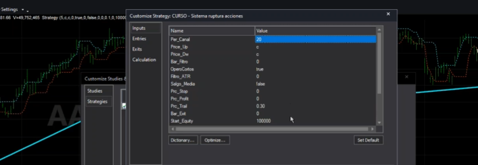
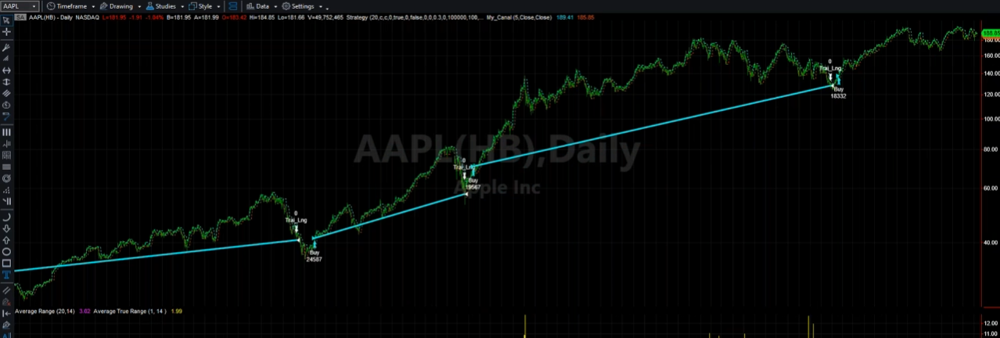

eso es lo que queremos? hombre esos vayan hold!! entonces al final cuidado porque podemos caer no es lo que queremos, Entonces hay que buscar un equilibrio entre significación lo que ya hemos comentado muchas muchas veces entonces tú decides tienes que dirigir un poco la optimización vale? ese concepto lo hablábamos mucho cuando elegía los parámetros acordáis la teoría y decíamos es importante fijarlo limitar y controlar los parámetros tanto los incrementos como los rangos a esto este es un buen ejemplo de eso... yo decidí cortar en 0.24 creo que fue pero 24 ya está hasta aquí no no lo llevo más no lo quiero llevar más arriba porque si no al final sube sube sube y ya está si no me interesa me interesa

---

Este lo hemos hecho con filtro y con trailing vale lo hemos hecho con los dos porque porque poner solo el filtro era un poco era un poco pensaba que sólo tiene sólo le he dejado hacer 4 variaciones de acuerdo sólo le he dejado hacer de 0.5 a 1.5 son 4 combinaciones, 

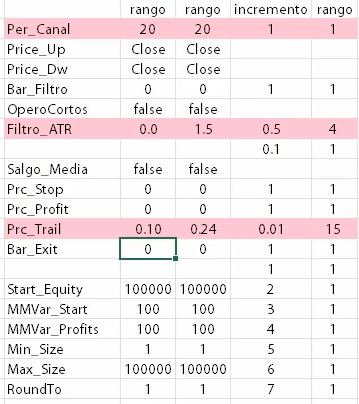

hacerlo solo pues no te queda mucho sentido entonces prefiero combinarlo con el trailing porque como ya ya hemos visto el canal es poco sensible, el canal es una variable que en este caso trabaja poco.  realmente la que la variable más directora o que más marca el rendimiento del sistema es el trailing en este caso, y aquí pues hemos variado con el trailing y como veis la única conclusión que sacas es que el 0.5 que el 0.5 implica 

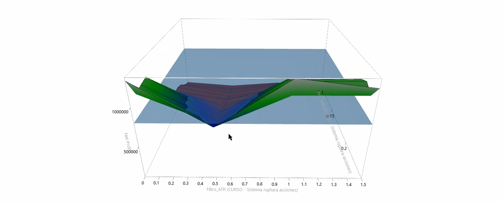

cuidado aquí porque es contraintuitivo 0 5 implica que actúa mucho vale implica que actúa mucho el pese aquí que de pronto 0 con 0 va desde 1600 straights a 5400 vale y en mil que en 0 5 va desde 1300 a 600 de acuerdo realmente donde implica una mayor actuación es decir el filtra mucho trades en 0 5 vale filtra mucho 

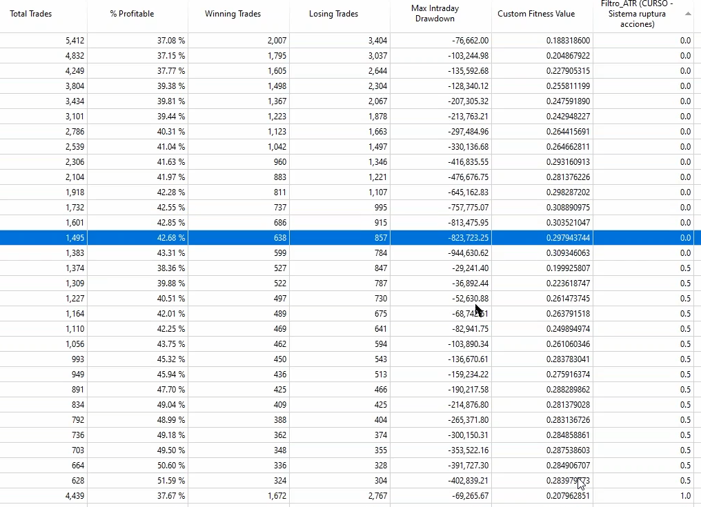

aquí ya vimos que era 0 o 1 ya os lo comenté pero bueno para poder analizarlo y poderlo ver pues prefería hacer esta pequeña variación de hacer 0 5 vale y ver un poco se acero que es sin filtro 0 5 ya veis 0 1 es donde están ahí en 2 también es en a partir de 2 bueno en 1 y medio aún tiene bastante actuación en 2 prácticamente equivale al 0 

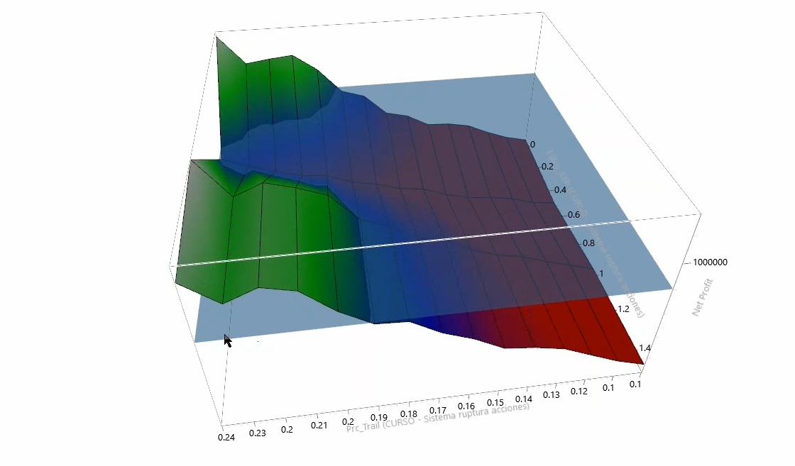

ya es es no os acordáis esta es la regla de la volatilidad la regla de la volatilidad yo creo que al final en 1 para lado largo funciona funciona bastante bastante bien 

En esto pues al final hemos traducido en estos 4 excels que rápidamente os voy a enseñar ahora y luego enseñaremos trabajaremos el que es al final lo hemos recogido en los 4 exces como ya sabéis haciendo este análisis que os enseñe que hacíamos siempre este perfil de optimización os acordáis aquí que hemos hecho? 
* hemos recogido loopy 
* el sortino 
* el recovery que simplemente del profit partido por drawdown 
* y hemos hecho estos variaciones que vimos que hacíamos en la teoría 
* y una suma corrup 
* y una suma sin rop 

Ahora profundizamos en esta estadística descriptiva que salía de Excel; os acordáis de que ya aparece desde aquí, en Datos → Análisis de datos. Eso es bastante útil ponerlo debajo de aquí:

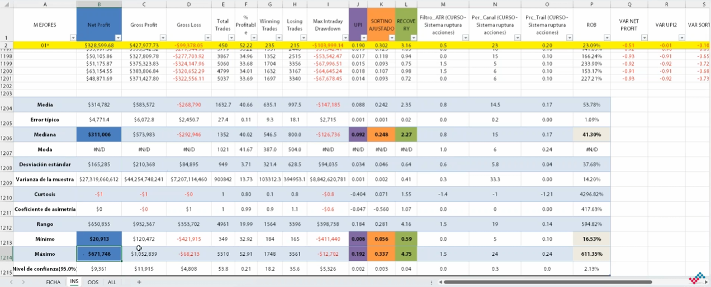

Esto es bastante útil porque, al final, te da valores de media, mediana, moda, kurtosis, te da la desviación, máximo, mínimo… y, a partir de ahí, puedes hacer estos cálculos de variación para simplemente normalizar las variables, porque cada una tiene un rango distinto de actuación.

Con esta división las normalizamos: restamos cada valor del máximo y lo dividimos por él. No es más que calcular el porcentaje que varía respecto al máximo; es decir, cuánto cae cada variable respecto al mayor valor alcanzado. De esa manera queda normalizada.

También podría hacerse —en algunos casos, aunque aquí no lo hemos hecho— fijar ese valor de máximo. Ese valor, este valor máximo, lo puedes limitar tú para compararlas todas igual.

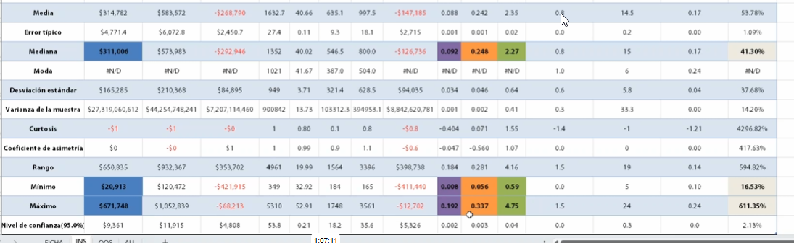

Esto se usa, por ejemplo, cuando quieres elegir sets: imagina que tienes distintas optimizaciones y quieres que todas usen el mismo máximo, para que el valor que salga aquí (media, suma, etc.) sea comparable entre todas ellas. Porque al final este máximo depende solo de este Excel.

Imagina que en otro Excel el máximo fuera 0.7: lo justo sería calcularlo todo sobre 0.7. Esto solo haría falta si los valores máximos fueran muy distintos en cada optimización.

Esto sirve para hacer esta división que hacemos en estas columnas, las que tienen el colorín:

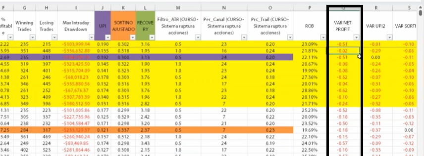

Aquí hemos hecho net profit, UPI, Sortino ajustado y recovery. Repito: variación respecto al máximo. Simplemente ese cálculo: la variación.

Por ejemplo, este varía –0.51 %, este –0.02 %, este –0.51 %, y así sucesivamente. Si ordenas del mayor al menor, verás que el que queda arriba del todo es el mejor net profit, que lo tengo marcado en azul:

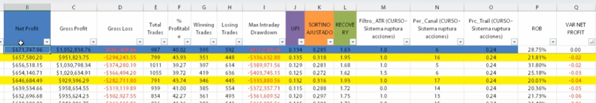

Del mismo modo, si ordeno por UPI, arriba queda el que tiene mejor UPI:

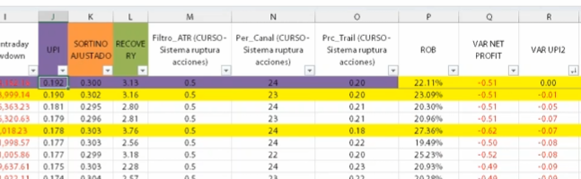

Y si ordeno por Sortino, arriba queda el que tiene mejor recovery, 2.37:

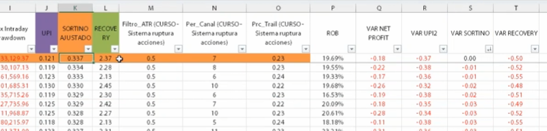

Y así sucesivamente. El valor VAR ROB dejará arriba el que tiene mayor robustez. Cuidado: el VAR ROB lo hemos calculado nosotros, porque Multicharts no nos da esos valores.

Como al final Multicharts no nos proporciona todos los datos, simplemente con los días que hay en el in-sample y los días que hay en el out-of-sample hemos calculado qué retorno da en un periodo y qué retorno da en el otro, anualizado.

Es decir: dividido por 365, multiplicado por los días, y dividido otra vez por 365. No deja de ser una regla de tres para que el dato sea comparable.

En el in-sample tienes unos 400 y pico días; en el out-of-sample, unos 1.300 días. Hay que ajustar para que el beneficio sea comparable año a año. La idea es esa: hacerlo comparable.

Recordad que el robustness index o walk-forward efficiency en algunos programas compara el beneficio anualizado del periodo out-of-sample con el beneficio anualizado del periodo in-sample, porque no podemos compararlos directamente: lo que ganas in-sample es el 70 % del tiempo y lo que ganas out-of-sample es el 30 %.

Lógicamente las magnitudes no son comparables a pelo; hay que ajustarlas por tiempo. Igual que con los ratios: hay que normalizar o estandarizar a un periodo común.

Por eso hemos calculado directamente el robustness, ya que Multicharts no nos lo ofrece.

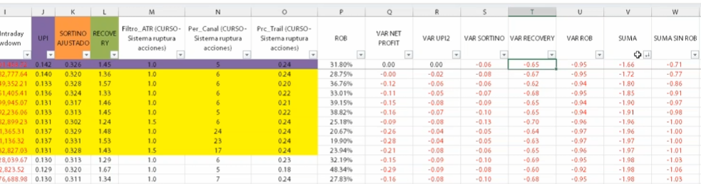

vale y con eso pues hemos sacado aquí pues nuestros ratios de suma que no deja de ser un que parámetro equilibra mejor en todos los ratios no es más que eso es decir porque al final hemos hecho 1 2 3 4 y el rob 5 de acuerdo sería el quinto entonces pues cada input pesa un 20% de acuerdo es decir hacemos una una media de estos estos inputs de acuerdo que podrían ser otros al final normalmente esto si son buenos ratios os van a dar... aquí hemos metido un sortino que depende de la volatilidad de los retornos negativos en el numerador todos son muy parecidos un recovery que depende del drawdown a pelo del drawdown máximo a pelo vale? un upi que depende del drawdown y del tiempo que dura el drawdown vale? y para meterle el retorno a pelo también hemos metido el retorno directo para quitarle un poco de peso porque había mucho peso porque estos tres ratios al final están muy gobernados por el riesgo entonces también hemos metido el net profit a pelo vale para que también aunque eso se ha metido en el profit estaría bien solo estos tres también cuidado no estaría mal no sería mal y habría algún pequeño cambio pero no no sería muy significativo de acuerdo esto al final simplemente marca cuáles son los 10 mejores aquí vale los 10 mejores, no quiere decir que los 10 son los que se han operado vale ahora luego lo vemos eso 

bien entonces que esta era la `opti 1` que acordaros que es la completa 

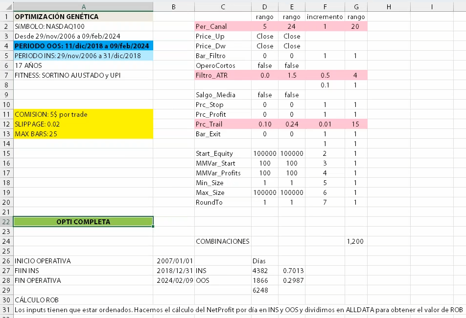

de acuerdo está así que ahora se voy a enseñar el gráfico en el mapa en 3d esta esta es la que mide todos los ratios o sea todos las tres inputs tiene 1200 combinaciones de 5 a 24 el canal de 0 a 1 y medio el filtro atr variando 0 5 es solo 4 y el trailing de 0.10 a 0.24 variando de 1% que nos da 15 combinaciones total 1200 esta es toda ella en insample

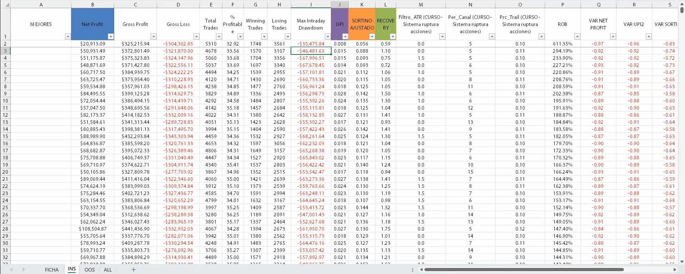

lógicamente lógicamente lo que añade capa de robustes y es interesante es que estos datos sean similares que no ocurre del todo aquí de acuerdo no ocurre del todo aquí decir aquí cuando orleramos por suma en in sample estamos viendo 0 5 1 0 5 1 1 1 bueno sé que hay un podemos decir un predominio de uno pero aparece bastante el 0 5 de puesto aparece bastante el 0 5 si que el canal esto ya lo hemos comentado antes hay una cierta aunque el predominio de zonas altas hay un poco de todo 

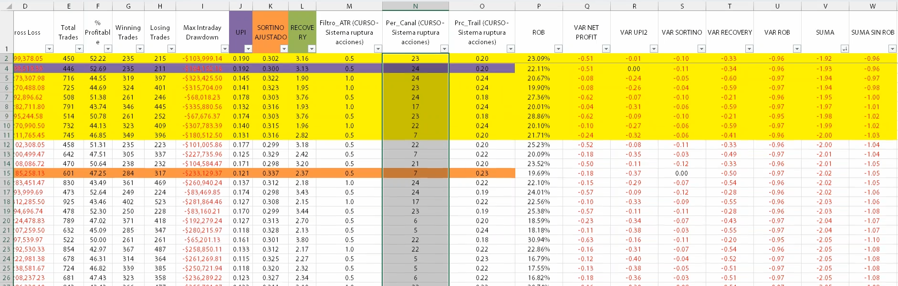

porque al final el `Per_canal` lo que hemos dicho no es muy director y sí que vemos en in sample se habla ahora un `Pcr_trailing` que mayormente se va a la zona alta 0.20 ... 0..18, etc vale mayormente se va a la zona alta como ya lo habíamos visto en el análisis sólo, acordaros que iba a los ratios para allá, pues bueno también en el conjunto aparece igual 

lo que ocurre que si analizamos en el outofsample ¿donde vemos alguna variación?

ahí vemos que sí que el trailing que es el más conflictivo parece también ir zona alta es decir por eso bien vale bien, esto el trailing también se va en la zona alta también se va en la zona alta, pero vemos que el canal se nos va más a la zona baja `Per_Canal` 5,5,5,11,6,9 etc  este es el principal cambio entre insample y out of sample en esta aquí se nos va a la zona baja 

ahora luego vamos a ver ella solo a ver si pasa lo mismo porque esto es las típicos de preguntas que nos tenemos nos tenemos que hacerlo y en principio esto no es preocupante porque ya es lo que hemos visto antes en el análisis solo que no vamos a volver a ver lo que me estoy anticipando que no es muy director este parámetro de acuerdo es muy en todas las zonas va bastante bien de acuerdo así que bueno pues le ha dado aquí pues perfecto pues muy bien pero pero no no es tampoco tremendamente crítico de acuerdo no es tremendamente crítico y de hecho si vemos aquí las los valores que nos da en cuanto a profit pero si aquí arriba estamos $99 100 

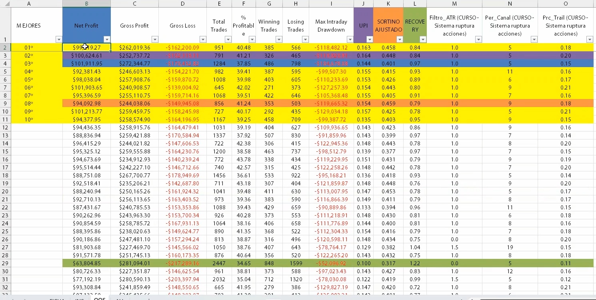

y vamos bajando y estamos en $80k $60k $70k ... y en los ratios en esta suma (**V**)

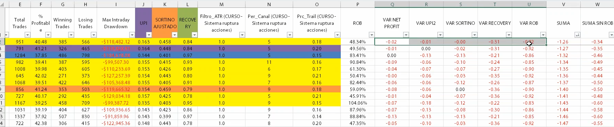

aquí la suma fijaros que el que da menos da menos `-1.26` la suma de todos estos ratios (**Q+R+S+T+U**) vale pero fijaros que no es muy abrupto se va oscilando bastante , si vas viendo y bajando por su columna llega a doblar al final casi llega a afilar bastante aproximadamente la mitad está bien es bastante progresivo es bastante es bastante progresivo 

**`all_ata`**

lógicamente en el `all_ata` el old data al final es todo el periodo junto ¿donde tenía más sentido elegir los parámetros? donde tiene más sentido elegir los parámetros es en el `all_data` en el alldata pero habiendo mirado también que ha hecho insample y outsample y que ha hecho es decir no quiere decir que ignoremos los otros datos pero la elección o sea al final recordar que todas las la mayoría de trabajos que hacemos no son para elegir sets, al final la mayoría de procedimientos que hacemos son simplemente para evaluar la estrategia es decir para considerar que la estrategia es apta para operar vale y cuando llegamos a esa conclusión entonces elegimos set . pero no elegir set es al final todavía no hemos ni hablado de ello entonces pero sí que lo haríamos en all data si consideramos que la estrategia es robusta que nos gusta para operar , no solo eso que tiene un rendimiento aceptable mínimo etcétera etcétera tiene un perfil de riesgo que nos gusta etcétera pueden haber muchos motivos que nos lleven a no operar o si operar esa estrategia pero de momento evaluaríamos simplemente evaluaríamos simplemente la la idoneidad de la de la estrategia.

bien de momento por lo que os digo esta comparación entre in sample y out of sample si que corrobora bastante que el trailing va en esta zona pero hay esa ambigüidad en cuanto al filtro atr sí que en el out of sample se va claramente al uno pero es que todas las primeras son 111 hasta llegar bastante abajo 

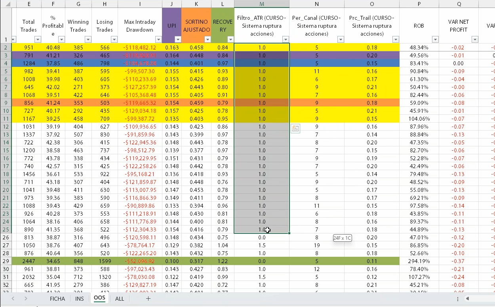

cuando en el in sample pues no estaba tan claro digamos que hay más partida 

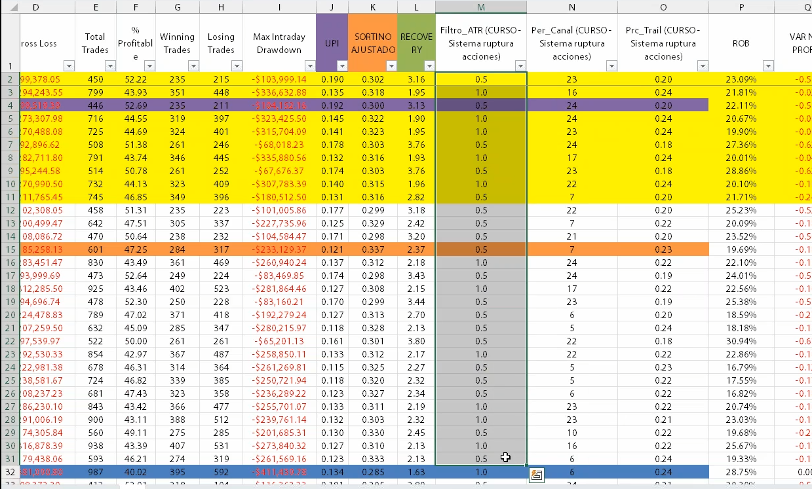

en el all_data usando los dos también aparece el 1 1 y medio pero en general claramente el 1 

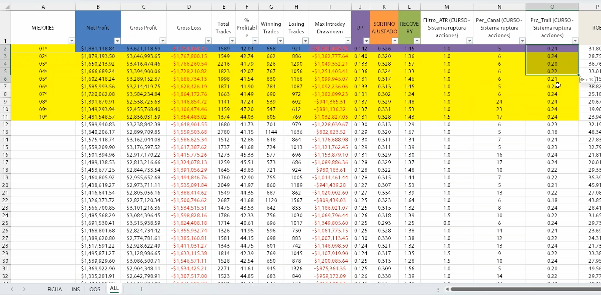

con lo cual sí que ahí parece apuntarse que el 1 es el que más claro y aquí fijaros que en el old data en el `Per_Canal` pues aparecen los dos lados aparecen los que salían más en el out of sample y aparece que salían más y se mantiene ahí muy alto el `Prc_Trailing`  lo quiere muy alto muy alto 

esto ya nos dice una cosa, no es tampoco muy buenas señales, no es muy buena señal, porque porque que nos está indicando? hay que hay que hay que ir aprendiendo a leer a leer las optimizaciones **¿que nos están diciendo?** que nos está diciendo que no quiere salir que veía yo aquí estaba la si yo le pongo aquí 024 

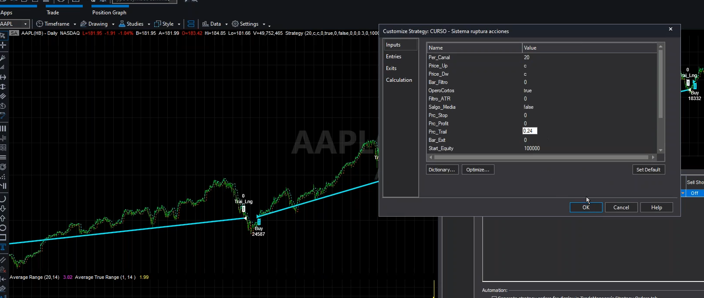

veis que aún tarda bastante en salir pero va saliendo va saliendo algunos casos vale 

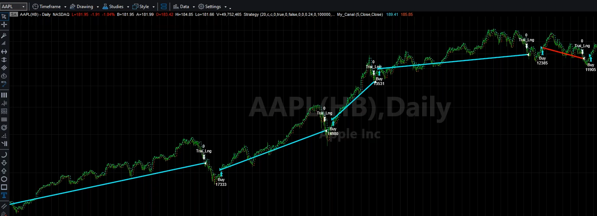

pero fijaros que la mayoría de veces aún me entra más más más caro con alguna excepción importante que esas son las que le cuestionan los que le permiten habrá alguna excepción muy muy importante como esta que hay un salto muy grande 

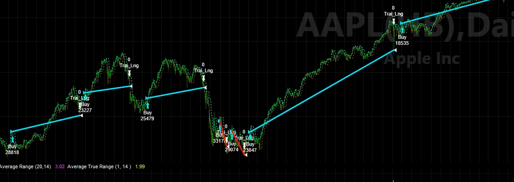

recuerdo que ya justifica seguramente toda la todo esto pero es que los stops como ya sabéis ya os he comentado muchas veces normalmente lo viene a aportar mucho al sistema de términos de retorno pero sí que en términos de riesgo vale pero aquí que se tiene cada vez lo que era mayor quiere decir que no es una salida muy eficiente de acuerdo decir cuando tú tienes este tipo de mapa 

**Una es SORTINO y la otra es UPI filtro con 1**

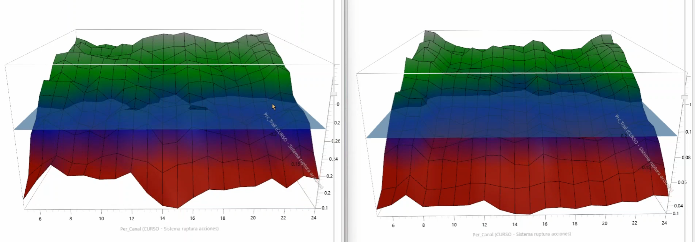
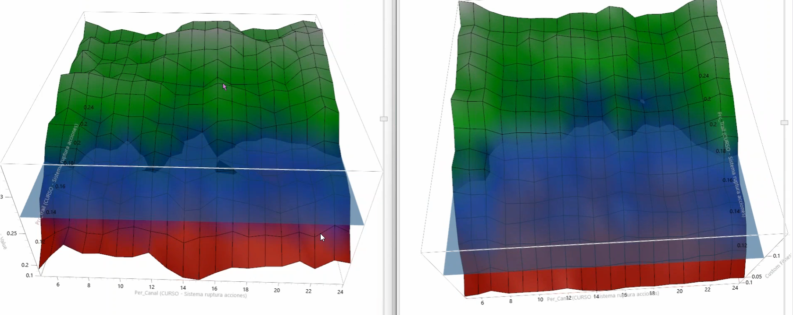
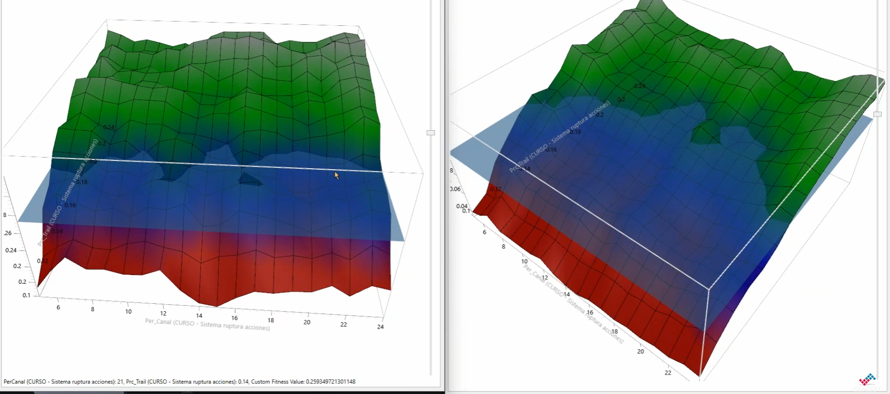

pero como veis es bastante bastante similar al final el objetivo es simplemente ver la estabilidad de los parámetros de acuerdo ver la estabilidad de los parámetros no es otro vale bueno se ven muy estables se ven muy muy estables sobre todo repito el `canal` en lo que decía pero sí que es verdad aunque es verdad que aquí en la zona de 20 parece quiere estabilizar pero parece como quiere ese más más arriba

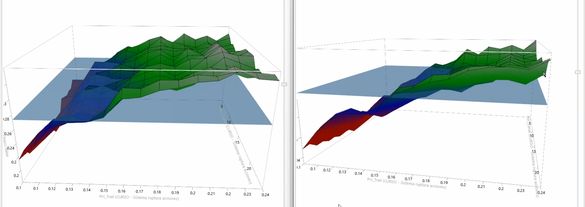

ya por tema de muestra también de velocidad de optimización pues no no queríamos llevarla mucho más arriba pero tampoco estaría mal aquí ahora tampoco estaría mal pues analizar decir pues mira le voy a cortar aquí en 0 18 y lo vamos a llevar bastante más arriba con un límite de trades mínimo pero para ver si sigue sigue con la tendencia arriba 

porque porque si sigue indefinidamente queriendo subir eso es un claro signo de que el stp no es eficiente y que no lo quiere y me puede decir hombre pero eso ya me lo has dicho que suele pasar ya pero no olvidar que ese sistema no tiene otro mecanismo de salida yo por ejemplo esto en apolo por ejemplo el sistema que operamos también ocurre que al final quiere un stp muy alto pero tiene otro mecanismo de salidos apolo puede salir por otros métodos no sólo por stp el stop es como un hard stop y que un hard stop que salta pocas veces pero cuando salta te hace bastante daño, aquí no es el caso que es su único mecanismo de salida le podríamos haber dejado que existe esa posibilidad recordar salir por la media y tampoco estaría mal porque también es tendencial en ese caso y en ese caso al final casi nunca habrá salido por stop, sólo en algún día de volatilidad salvaje que un día que era mucho y tanto pero casi nunca te hubieras salido por stop, siempre te hubieras salido por la media del canal y entonces el canal se hubiera vuelto más director vale? 

>**pdf codigo**
>
>lo dejo también como como ejercicio para que probáis vosotros por cierto no lo no lo abierto pero lo enseño aquí en el [pdf](../../12-practice-02/SISTEMA%20DE%20RUPTURA%20EN%20ACCIONES.pdf) aquellos que ya lo habéis visto lo tenéis ahí está explicada la estrategia y al final está el código digiremos directamente este está ya limpia sólo con lo que usamos no está la media pero podéis ponerla de acuerdo porque quería daros esta la que estamos viendo sólo pura y dura vale si alguien quiere que le pase la cola media pues es bastante sencillo no tiene mucha historia pero si alguien lo quiere se lo pasamos a ver vale pero recordar que teníamos una versión con más salidas esto trailing ahí esto tp y también la salida por el número de barras y por media por número de barras y buscamos un tendencial no me convence como ya os comenté pero en media si tendría sentido si tendría sentido y así el canal se volvería bastante más director bueno lo dejo como digo para que lo probéis vosotros de hacer 

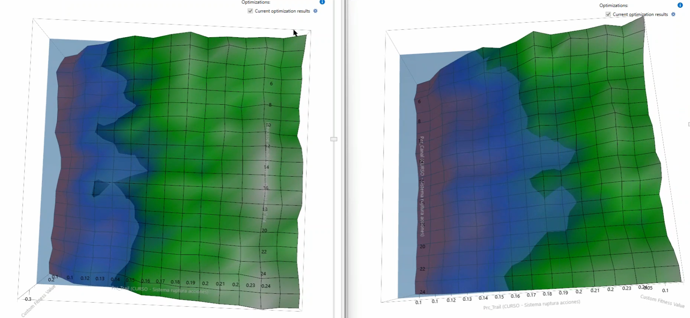

bien entonces aquí el mapa se ve bastante bien la verdad el mapa el mapa en general de los dos tanto por upi como por se ve bastante bien se ve que el `Per_canal` no es director () y se ve que en esta zona de 0.20 0 22 0 24 hay bastante estabilidad de acuerdo? quizá aquí en 0.20 no es donde quizá se ve mejor aunque aquí sí sí parece que también ya podemos aún forzarlo más ahí y veis como si que se quiere cerrar

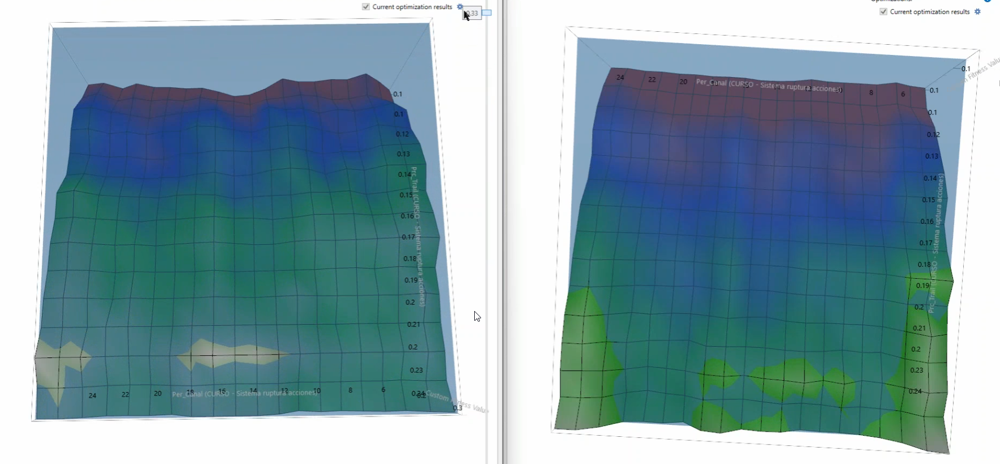

ahí veis entre una planicia y 0 20 es decir esta zona un poco del pico 

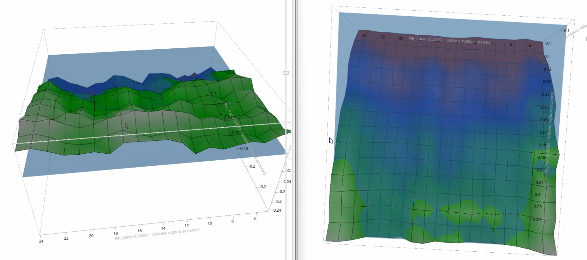

pero bueno todo el todo el 0 20 fijaros que es muy muy muy estable pero bueno cualquier caso ya os digo toda esta zona está bien aquí creo que está fijado en uno 

**Una es SORTINO y la otra es UPI filtro con 0**

ahora se ha fijado en uno vamos a probar por ejemplo en el 0 y el troncero lo que os decía de cuidado con las auto escalas porque al final los gráficos alto escala y por eso os decía que había quitado un poco de aquí también vale había quitado de lo había dejado bajar el 0.10 para que no se me cayera tanto 

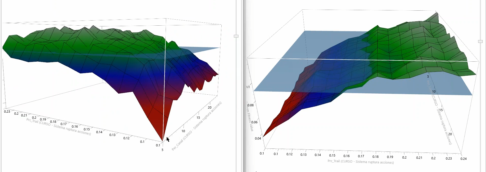

porque si no al final como el gráfico se auto escala el valor mínimo que coges el mínimo que le da entonces se la hace más o menos abrupta entonces por eso hay veces que interesa también cortarlas porque meter mucho más hace que el valor inferior sea muy bajo o el valor superior sea muy alto y como los gráficos auto escalan pues perdemos un poco de vista la dato 

voy a quedarme sólo con el de sortino y así creo que lo podremos ver mejor, ¿ves a la izquierda la escala?? he puesto `fitness_value` es ahí veis el valor de abajo y arriba? 

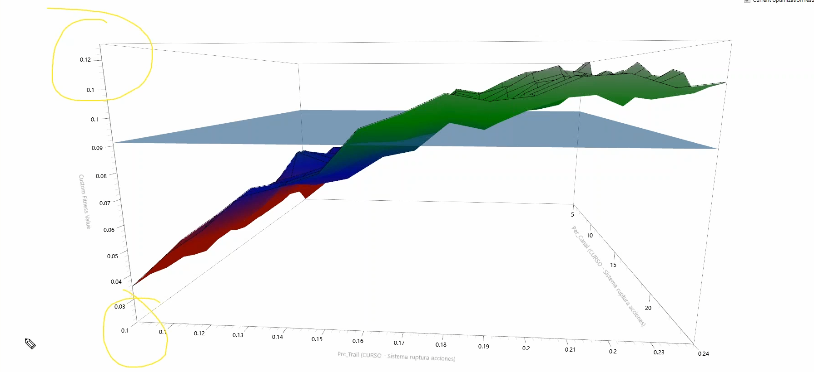

fijaros ahora en **ATR 1.5**... 

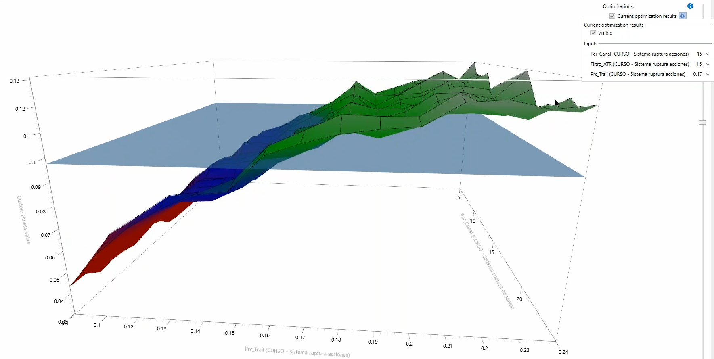

es otro.. como se auto escala yo sigo viendo el dibujo que está muy bien todo muy planito pero está planito más arriba o más abajo entonces es el mismo problema que os digo siempre con los gráficos de acciones o de futuros de que pues se auto escalan y a veces que eso engaña mucho a la percepción de los movimientos parece que no se ha movido parece que se ha movido mucho realmente no se ha movido nada porque tu ves hay un gráfico que tendencia que pasada se ha movido un 0 20 no es nada como el gráfico se auto escala a la pantalla aquí pasa un poco lo mismo y como no te deja limitar este valor sí que te deja elegir la variable y demás pero no te deja elegir el valor y pues te puede pasar te puede pasar eso vale,  para eso también tenemos luego como como habéis visto los datos en excel para poder aquí verlos trabajarlos y aquí podemos ver todos sus valores mucho mejor todo es complementario no sólo una cosa a otra vale no es una cosa u otra 

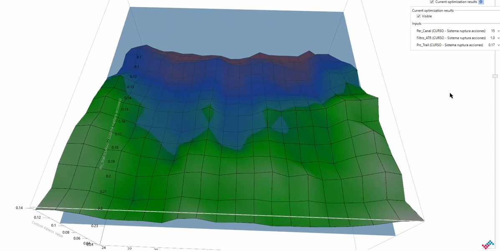

nos dicen cosas distintas aquí vemos un poco como decía estabilidad y en general fijaros que hasta en todos ellos (**ahora ATR 1**) vemos estabilidad siempre habrán unos más que en otros pero todos ellos vemos así lo que sí que viene muy bien para esto 

en definitiva en el excel lo hemos visto bastante claro la zona que parecía más estable de más es en la zona de **uno** aunque eso que os digo en todos va bastante bien bastante en todos los niveles de filtro va va bastante bien no es un filtro muy muy muy potente pero sí que tiene tiene para hacer cierto nivel de mejora yo la verdad cuando un filtro ya os lo comenté sólo aporta una cierta nivel de mejora no soy muy partidario de meterlos

pero bueno esto podemos hacer un análisis añadido es decir que que cambia por ejemplo yo tengo aquí 5024 este 5 0.24 

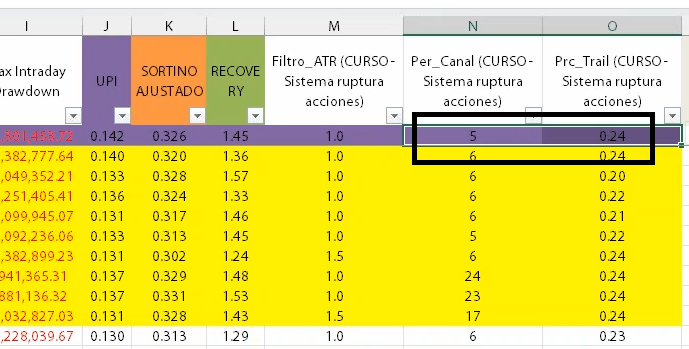

por el **filtro ATR a cero** donde está? la vez donde está? entonces de entrada puedo quitar los otros filtros para que no me molesten 

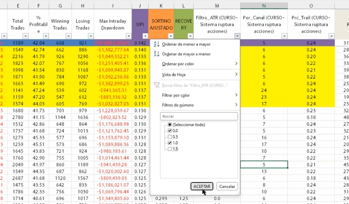

vale y vamos a buscar el 5 por ejemplo 024 que es número 1 ahí está, realmente está muy muy abajo 

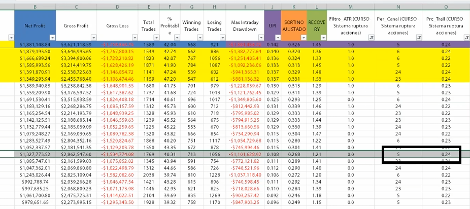

pero a mí me interesa ver los trades si miras el primera instancia (1589) con la seleccionada (1769) bueno sí que son casi 200 trades de diferencia si sí sí que tiene bastante bueno tiene un cierto impacto al final son dos trades por acción aproximadamente de media dos trades por acción entonces sé que tiene cierta implicación y sí que parece aportar bastante mejor a la verdad 

bien entonces para acabar ya esta parte este efecto como has visto antes en el per_canal... fijaros que en este sólo hemos analizado el canal y hemos bloqueado el filtro el filtro en cero 

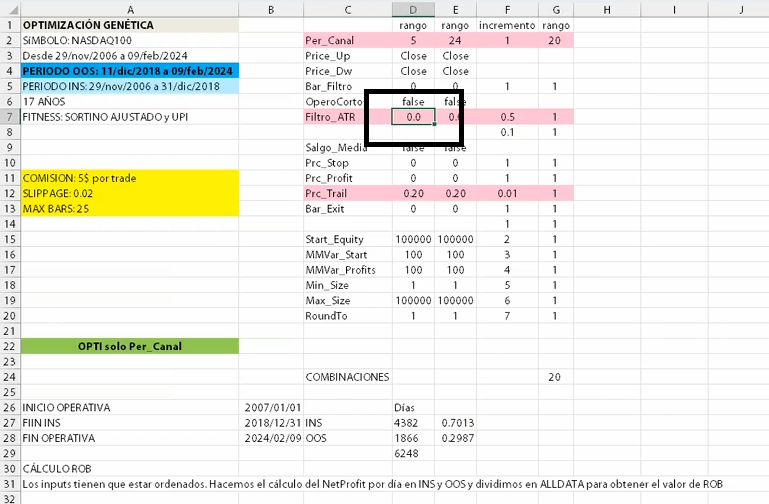

porque esto sí que si estamos analizando el filtro lo metemos al final y hemos dejado el trailing en `0.20` era un valor que no está mal y que vemos sólo el canal de acuerdo estas digamos como podríamos haber empezado a analizar el sistema si no supiéramos por dónde pillarlo voy a ver qué tal va el canal y vemos que en sample ya vemos un poco eso 

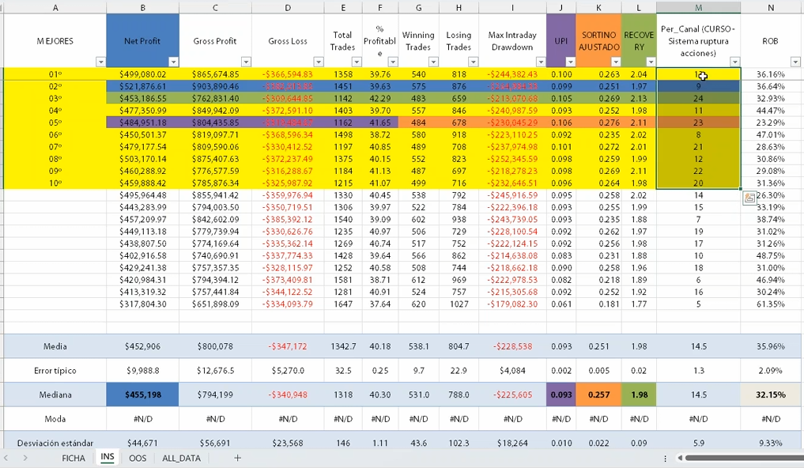

vemos que fijaros tienes 13, 9, 24, 8, no se ve una clara línea no se ve bastante dispersión y en outofsample igual aquí sí que se ve un poco lo mismo 

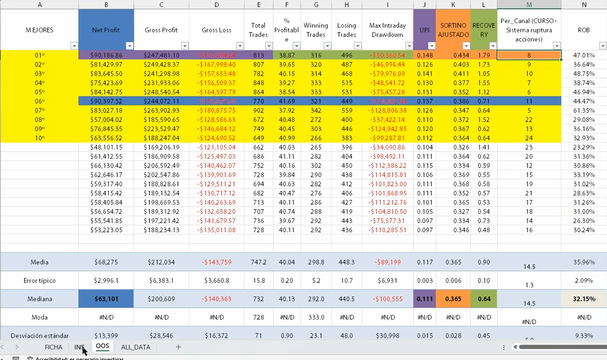

aunque sí que es verdad que el que está arriba es 8, 9, 10, aquí el 8 está el sexto también decir también está muy bien colocado y el 9 está segundo es decir realmente aquí sí que en in sample y out sample sólo el canal fijando en 0 20 el trail en los datos que vemos en in sample y en out sample son muy muy parecidos son realmente muy parecidos el demás retorno fijaros me dan 11 aquí el demás retorno me da 9 el que da un pie sortino me da 23 aquí en cambio da 8 , este sí que no no no concuerda pero en general datos bastante bastante parecidos a la que miramos esta mezcla de equilibrio entre las cuatro variables de acuerdo? en el profit upy sortino ajustados recovery vale? tenemos bastante bastante lo mismo esto es bueno esto es bueno y al final vemos en all_data pues es que hay valores altos y valores bajos que esto es lo que hemos visto al final también valores bajos y valores altos 

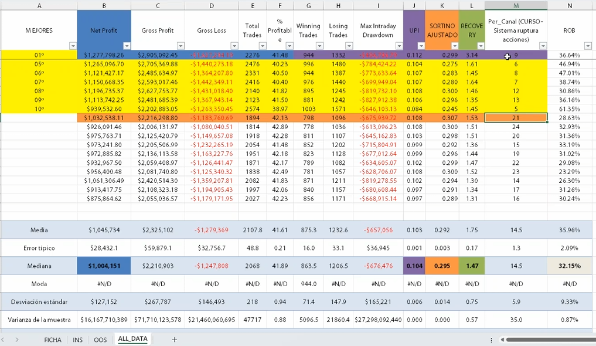

bien cuál elegir si vemos que es lo mismo bueno pero no es fácil no es fácil es verdad que no cuando cuando un sistema... esto también nos pasa bastante a veces en apolo... cuando un sistema es bastante robusto que va muy bien en distintas zonas pues no es fácil no es fácil elegir porque hay que elegir alguno y no y no es sencillo vale, en todo caso sí que lo haríamos ya en definitiva usando los datos completos, de acuerdo, de la de la opti 1, pero esto como ya os comenté nosotros cuando vamos a hacer la elección final no lo hacemos directamente desde aquí ya los quedamos de acuerdo vamos a ver algo más de acuerdo vamos a ver el performance report y vemos algún dato más vemos la curva esto es lo que nos da ya un poco el el filtrado final vale? en este caso sí que lo que ya tenía hecho limpiaría el filtro de acuerdo diría bueno me voy a quedar con cero y con uno, los demás los he usado instrumentalmente pero no me no me interesan de acuerdo los los quito voy a quedarme solo con cero y con uno 

en todos, `insample`, `outofsample`, `all_data`

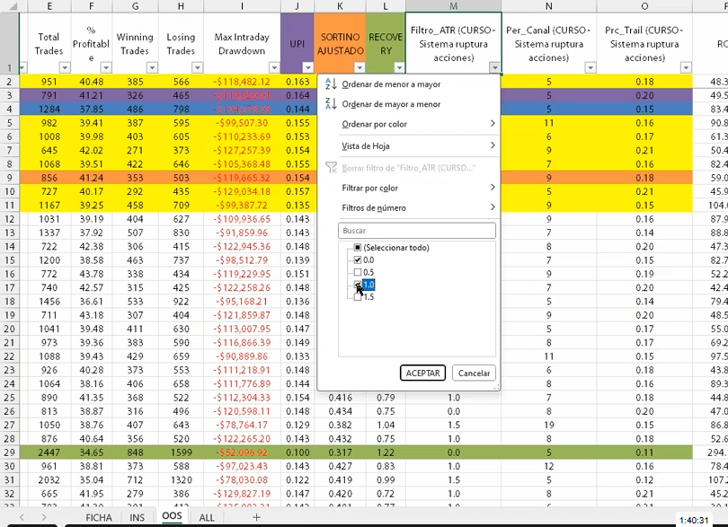

pero sí que mirando aquí sí que en insample y outofsample vemos esa pequeña aparente contradicción en que en insample nos salen canales muy altos 
   
`insample`    
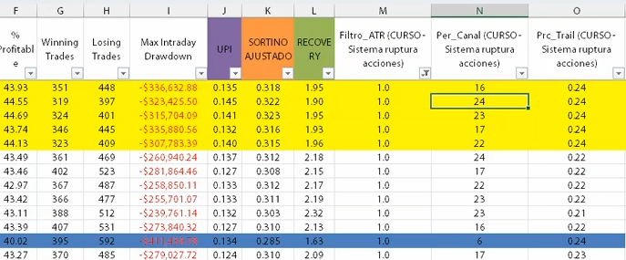     

`outofsample`  y en un outofsample nos salen más bien canales bajos   
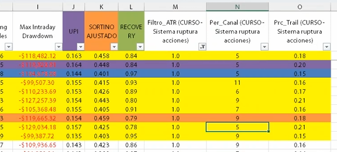    
  
`all_data`  y en el alldata nos sale los dos   
    

pero sí que en el trailing vemos esa tendencia a la zona a la zona alta de 0.22 0.24 

**Maestro**    

aquí sí que también te puede ayudar el mapa que todos estos los llevaríamos y en este caso en un sistema multi activo donde lo acabaríamos de afinar es el "maestro" nosotros esto lo pasaríamos ya el maestro y guardaríamos estos sets que lo vamos a hacer ahora mientras hacemos el descanso vale para ya acabar de tomar la decisión vamos a pasar a algunos sets por maestro he montado el visor que estuviera por favor bien montado y ha hecho uno de prueba y simplemente pues vamos a haber hecho el 1 5 hacer el 1 6 y 4 6 y 0 24 

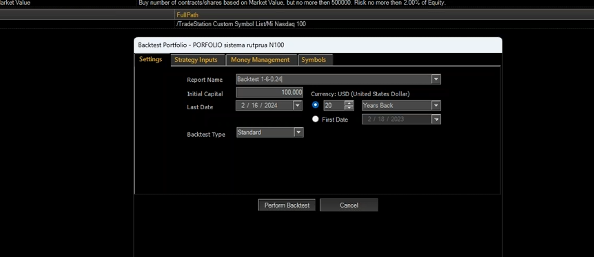  
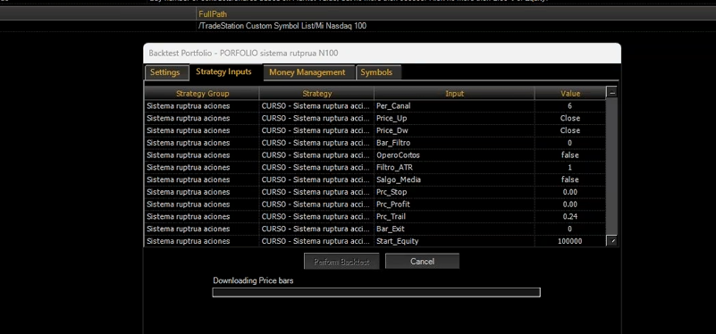      

al final aquí no no sólo pensar que no sólo necesariamente que sí que es verdad que hay un punto objetivo podemos hacer los amarillos los datos objetivos también nos lo hemos mostrado antes pero sí que solemos también mirar la distribución en todas las todos los inputs por separados aquí miramos la `suma` que es un poco el equilibrio de todos pero vez de ordeno por en el `profit` y vemos que se quedan ahí bastantes amarillos en la parte la parte alta está diciendo mucho 

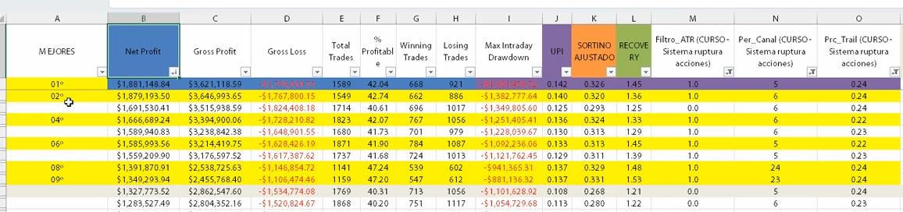  

veo que en UPY pasa un poco lo mismo 

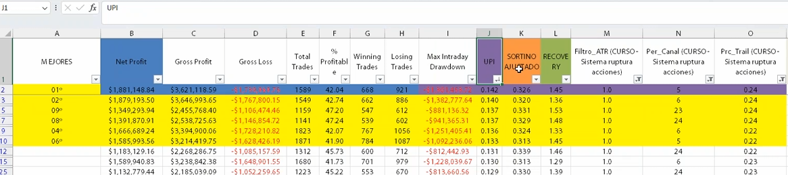  

vemos también que el sortino pasa pero menos los mejores de sortino no están ahí los mejores de sortino no están ahí 

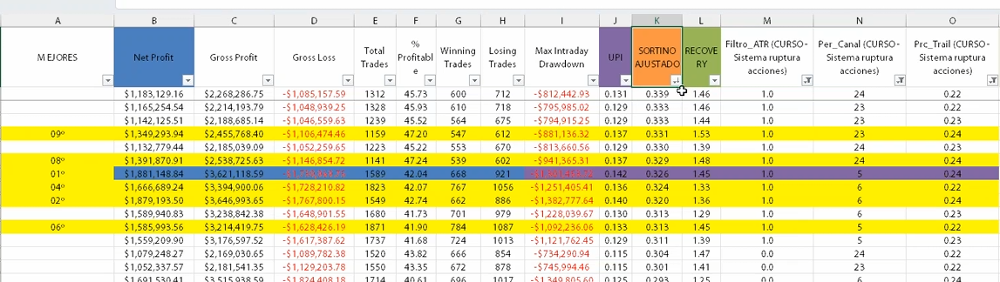  

sí que el mejor de recovery aunque una posición bastante baja 

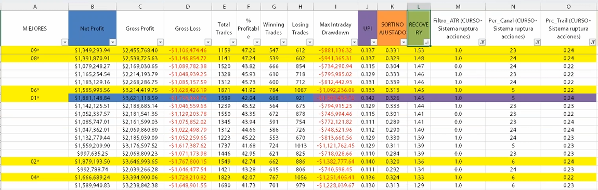  

y aquí `ROB` quedan de hecho un poco más bajo, los hemos mezclado todos quedan bastante bajo para que da bastante bajo, cosa que ya empieza a hacerlo un tanto sospechoso pero no necesariamente lo descarta, que esto es lo que ya os comenté es importante ver cómo se distribuye todos los históricos y es verdad que aunque tratamos de distribuirlo en proporción tiene un poquito más de peso no tendencial la parte más reciente la parte más reciente 

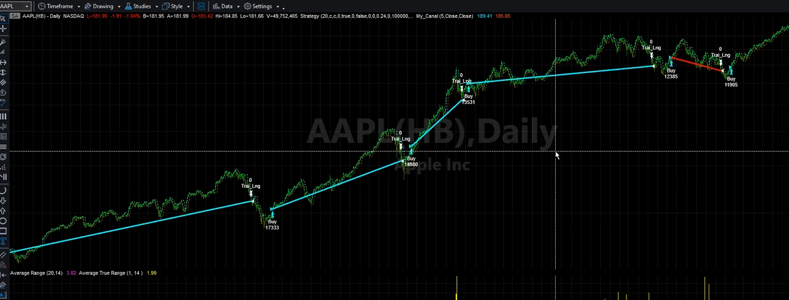    

tiene un poquito más de peso no tendencial porque tiene la parte del covid luego un tramo de tendencia bueno otro más bilateral ahora y en cambio el el in sample sí que es verdad que tiene el 2010 en 2009 que es muy muy duro pero luego tiene una serie alcista espectacular que le mete muchos años favorables así que está ligeramente sesgada el in sample pero bueno lo dimos lo dimos por bueno 

entonces aquí por ejemplo por qué porque el mejor sortino pues seguramente no está no está 0 y 1 normalmente también somos bastante partidarios de **incluir los mejores las variables en los sets** es decir si   

- ya me aparecen el mejor mejor ya me sale, **es el uno**,   
- el mejor profile me sale,  
- el mejor upi también me sale,  
- el mejor recovery también me sale,  
- pero el mejor sortino no me salía  así que lo meto de acuerdo lo meto

     

acuerdo así que lo meto de acuerdo lo meto lo meto y es un 24 `Per_canal`  22 `Prc_Trail` de manera podemos decir artificial y lo marco en naranja 

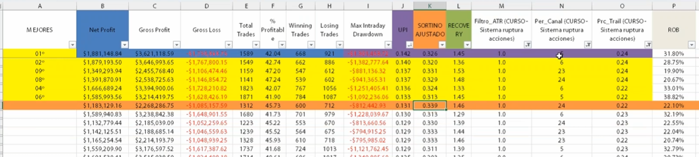     

vuelvo a ordenar por suma 

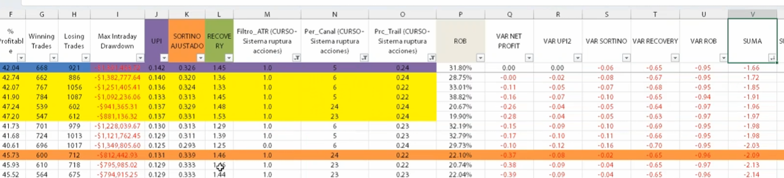    

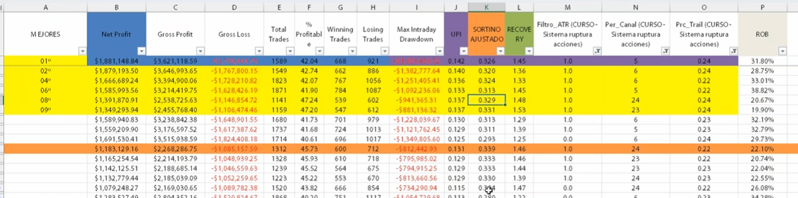 

entonces ahora persigo montando estos últimos y los acabaremos comparando para terminar de hacer una decisión sobre este sistema voy a meter este porque este me gusta bastante no los voy a meter todos porque es lo que importa es la idea, 

voy a hacer solo algunos algunos 

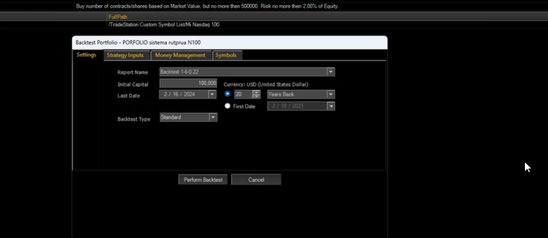  
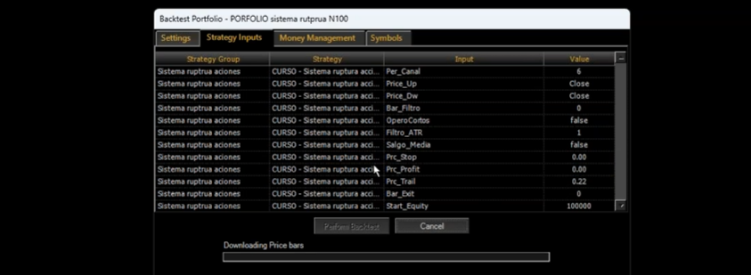   

tarda , lo pasa que maestro nos da una información más que PortFolioTrader, para que lo veáis también porque me interesa pues que vayáis viendo cosas esto también lo veríamos bien msa pero ya lo veremos  otro tipo más de quizá de futuros porque para llevar los 100 históricos a allí nos va a llevar a ser un trabajo tremendo ...  

ya ha acabado este mira voy a hacer otro para que tenga comparativa el el otro el 23 también el que es el mejor sortino esa zona 123 23 pero 24 que también está entre los amarillos 

  

bueno general haríamos todos estos y ya digo los que destacan en algún ratio los que destacan en amarillos todos estos serían los candidatos a llevarlos a ver su performance report completo y esto cuando lo hacemos por sistema lo hacemos así pero lo sacamos de desde normalmente TradeStation o desde MultiChats y sacamos el performance report a excel y ya lo comenté en la teoría de manera independiente Alberto y yo pues analizamos los los performance reports para tomar una decisión 

de todas maneras este sistema ya ahora ya sí que ya lo voy a adelantar yo creo que alguno ya se lo pensaba yo no lo llevaría a operar no es un sistema que operaría su versión actual de acuerdo es decir ya os comenté que vería acabaríamos procesos que llevarían a sistemas operar y que acabarían los procesos que llevarían a sistemas a no operar y lógicamente explicaremos por qué 

porque si no al final ver todo que sale perfecto obras majestuosas y demás es algo relativamente fácil pero no creo que sea el objetivo del curso y de hecho no creo que se aporte nada entonces al final lo que aporta es ver un poco cosas que mejor cosas que van ver las herramientas ver los procedimientos varias veces y repetirnos y a base de verlos verlos entender la filosofía 

habrán en algunos que serán procedimientos con un software con otro de distintas maneras pero pero no lo llevaría no es que esté mal no es que o sea final como os comenté creo que lo vimos en la primera clase esto es al final con que lo con que lo comparas y ahora mismo hecho aquí de 20 años no vale en el vallan hall ya vimos con el nasdaq era imbatible decir imbatible el retorno era una locura mucho más que esto porque porque al final te quedas comprado en un nivel muy son muchos años ya has hecho un interés compuesto alucinante que aquí no conseguimos no conseguimos realmente ganemos no ganamos menos no ganamos muchísimo menos muchísimo menos que buy and hald. 

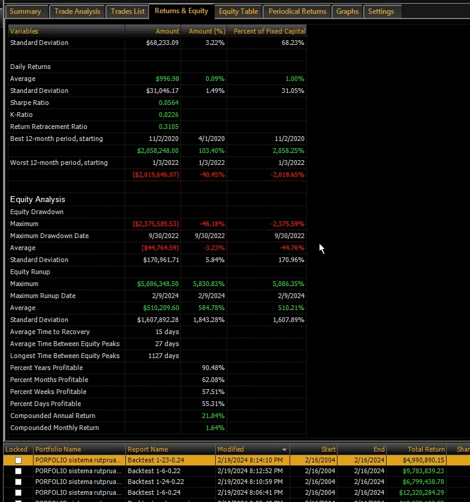  

ahora lo hacemos mejorando el drag down? si mejoramos el drag down mejoramos mucho pero no lo suficiente no lo suficiente podríamos hacer más cosas es decir realmente el sistema querido simplificar la idea tendencial para que vierais el clásico sistema tendencial entrada estructura y con un trailing vale se podrían hacer más cosas y probablemente iría mejor con un con un y con un stop normal sin ser trailing de acuerdo y era te irá yo lo que puede ser probarlo vosotros para dejar este trabajo en todos los sistemas os iré dejando cositas y días para probar probar que tenga un hard stop lo que decía antes y que salga con la media del donchain con la parte media del donchain o incluso otra versión muy hard es ir a la banda contraria del donchain contraria el doncha sería bastante bastante hardcore con hard stop con stop de seguridad 

pero pero así yo personalmente no lo operaría ya digo que sí que mejora el riesgo al vall and hall pero no mejora lo suficiente para para compensar la enorme pérdida de retorno que supone pero bueno final esto es como todo la curva de más fijaros qué curva tenemos 

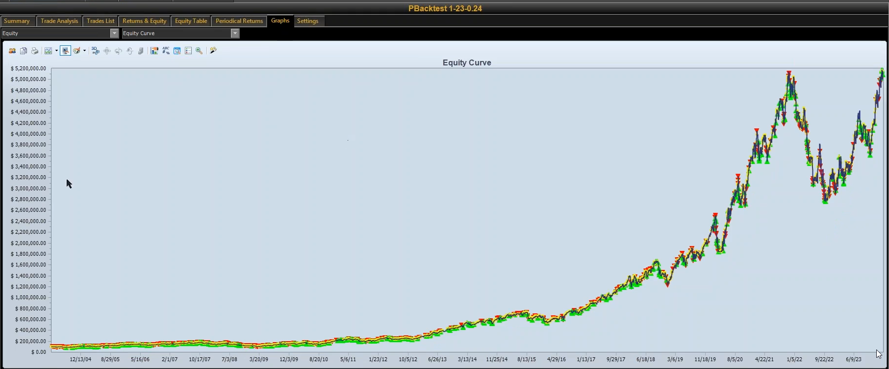  

que aquí uno de los uno de los problemas de este buen programa es aunque sí que se puede hacer en teoría logarítmico pero ya veréis ya veréis el logarítmico que sacamos cuesta una vida y es horroroso es infumable esto es el programa no puedo hacer más hay que ir eligiendo los sexes ya no pero bueno pero al menos a menos la vez el logarítmico que queda mejor mejor porque al final en lineales se ve el drama mucho peor de lo que es 

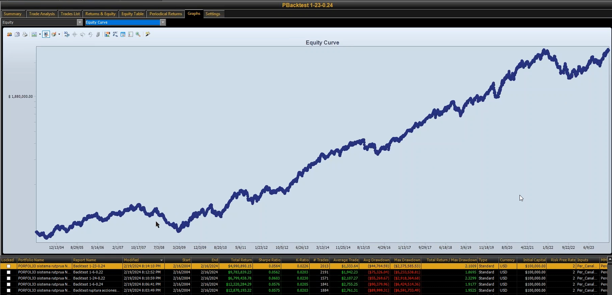

pero bueno que sigue siendo importante estamos hablando de un setup que anualiza 21 por ciento compuesto 

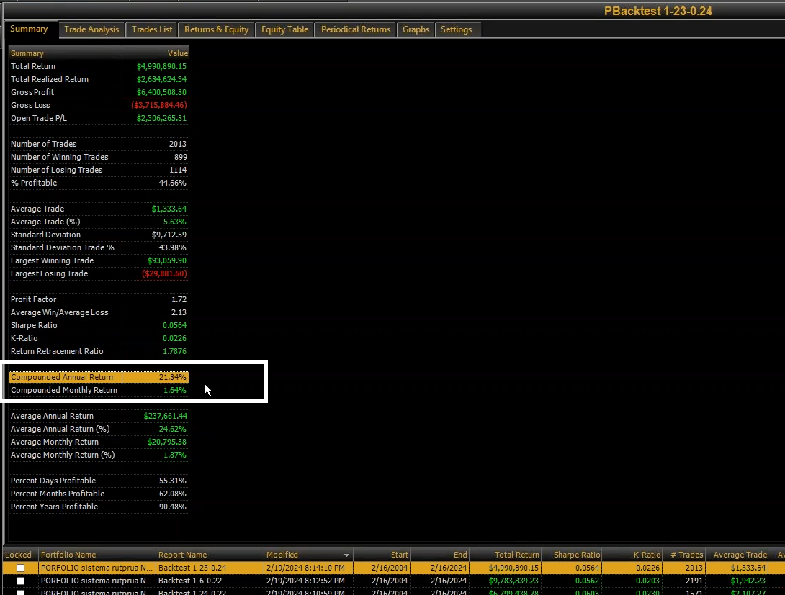

con una exposición que no llega a nunca ser del doble no está mal no es tampoco no está muy mal llega un momento es ponerse a dos veces a palanca dos veces 

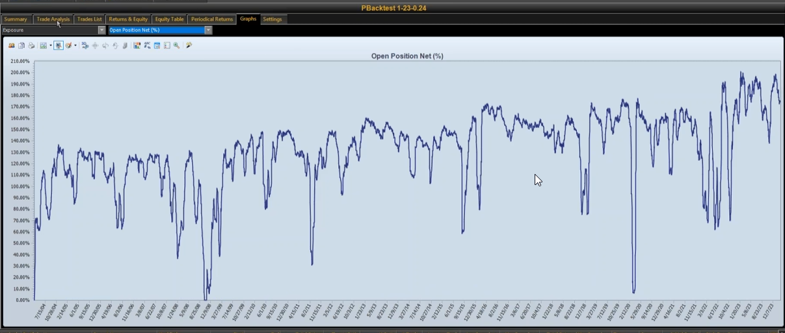

y tiene una de un 46% 

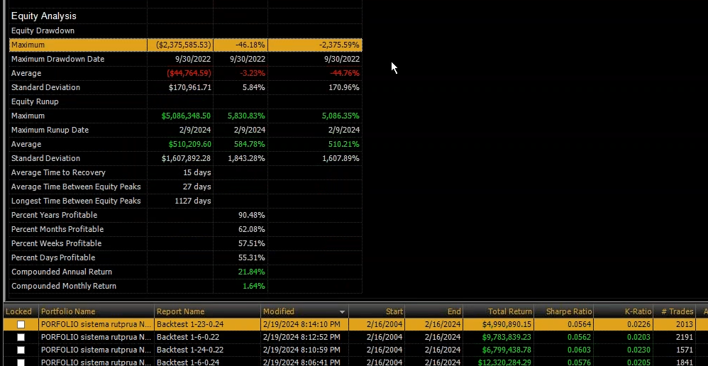

es justo es pobre acuerdo es pobre si hubiéramos hecho 20 y 20 por ejemplo sería mejor bien ahí estaríamos más razonable pero 20 por ciento anualizado con 45 de drawdown es demasiado para mí no sería suficiente no sería suficiente pero bueno la idea inicial la idea inicial de entrada de donchan es totalmente válida donde por ejemplo este sistema incluso así iría probablemente mejores en materias primas seguramente oro petróleo puede ser que fuera soja cosas así pues así podría ser que fuera que fuera bien pero de otras maneras insisto que aún así creo que le plantearía algún cambio le plantearía un cambio para mejorar. 

bien de los sets que hemos hecho para que veáis en el caso que quisiéramos quedarnos con uno como ejemplo hemos empezado por este hoy 

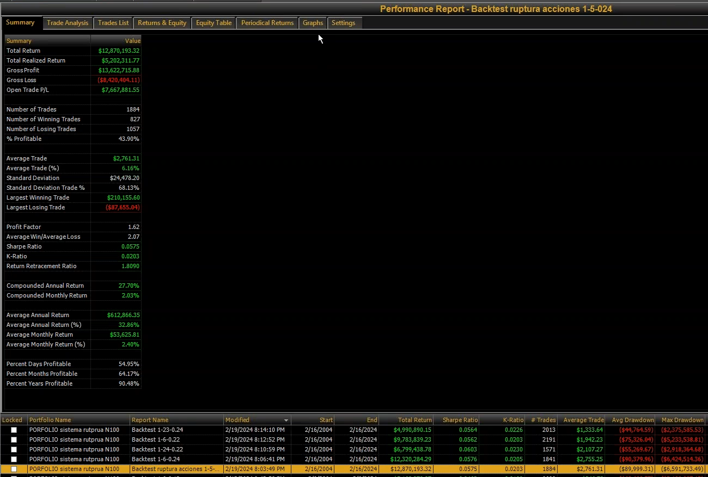

vale y aquí que miramos bueno aquí miramos poco curvas drawdown ratios de retorno riesgo cual nos dan 

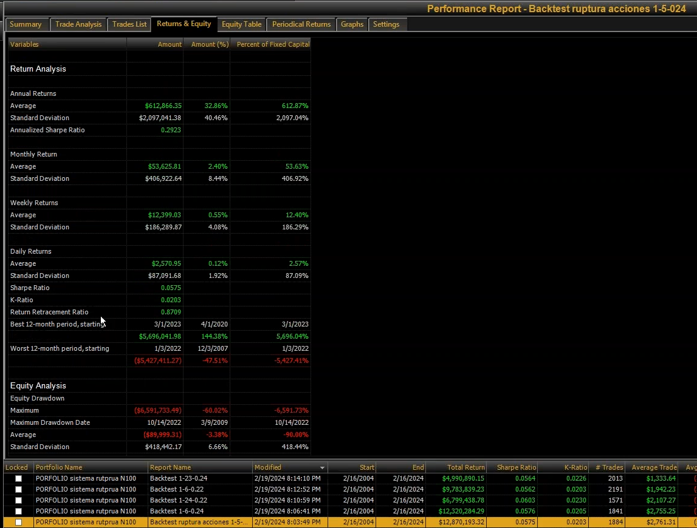

al final aquí de los que no hemos visto aquí 
  
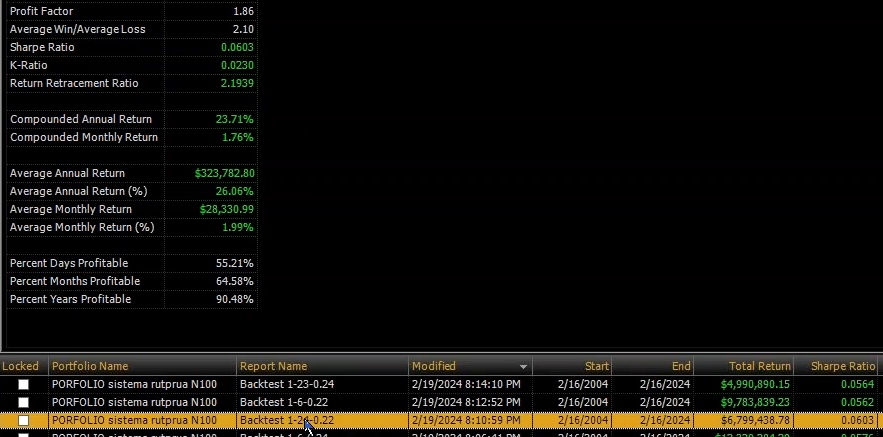  
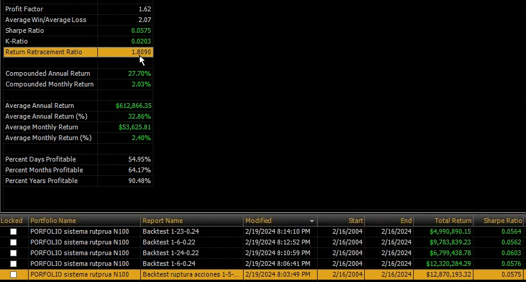  
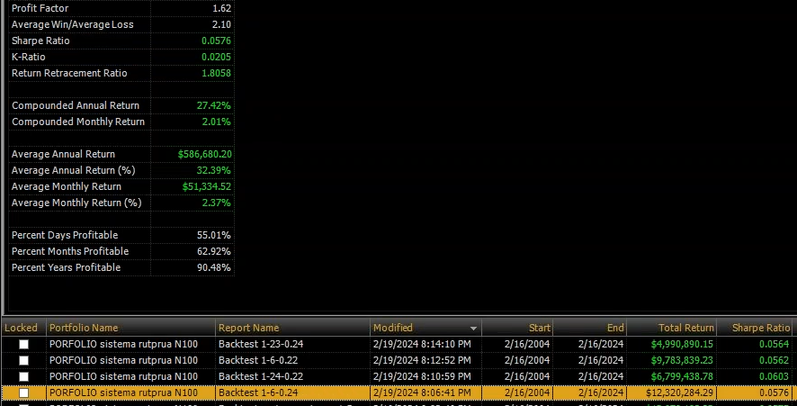  
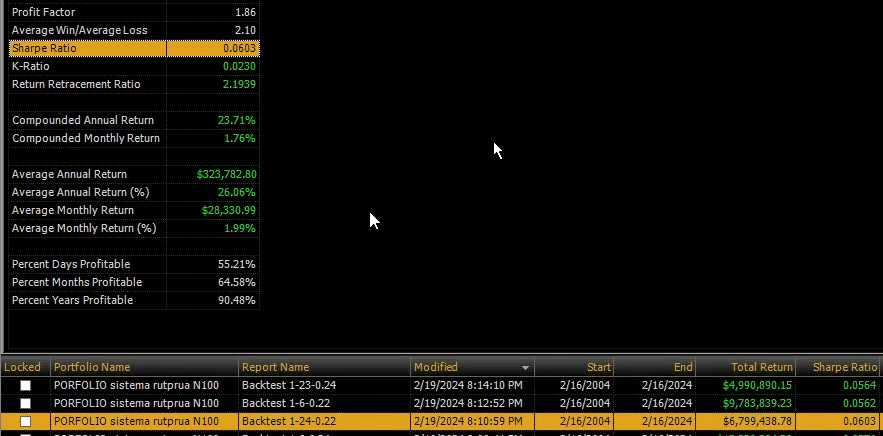  
  

Dentro de esos candidatos, el set `1-24-0.22` destaca porque logra el mejor sortino y también un buen UPI, un RRR cercano a los máximos (2.19) y un compuesto anual del 23.7 por ciento, que es coherente para esta familia de parámetros. Aun así, el drawdown sigue en torno al 44 o 45 por ciento, lo que confirma que el sistema mejora la estabilidad respecto al buy and hold, pero no lo suficiente para compensar la enorme pérdida de retorno que implica dejar de estar comprado todo el ciclo alcista del Nasdaq.

Los otros sets que aparecen repetidamente arriba (1-6-0.22, 1-23-0.24, 1-6-0.24) presentan curvas similares: ganan bastante, el sharpe mensual ronda 0.056 a 0.06, pero ninguno consigue reducir de forma significativa la profundidad del drawdown ni aumentar de forma clara la robustez en las métricas de retracement o en el K-ratio. En conjunto, todos muestran una eficiencia moderada, pero ningún candidato destaca lo suficiente como para justificar operar el sistema en su forma actual.

---

y aún así aquí otro otro línea de mejora la línea de mejora importante, al final simplemente le hemos hecho como decía para validar la estrategia yo en el caso como lo planteara operar que haríamos otro tipo otro tipo de análisis y miraríamos reduciríamos reduciríamos la cesta reduciríamos la cesta 

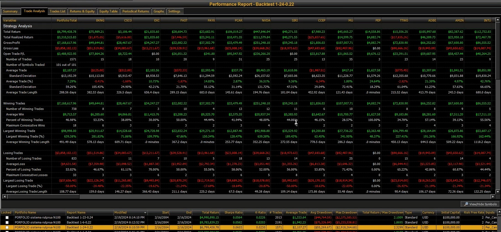 

por ejemplo lo que hemos hablado antes un criterio por supuesto de **rendimiento** sería sería válido otro no menor de **histórico** es decir donde podamos mirar más que ha hecho esa acción porque aquí no todas las acciones tienen el mismo histórico de acuerdo este es un problema aquí no tenemos tampoco sesgo de supervivencia aquí abajo nos ha hecho la t student ya va a hacer el programa automática en la mayoría aunque va a haber salido alguno que no la mayoría ves que te da que sí

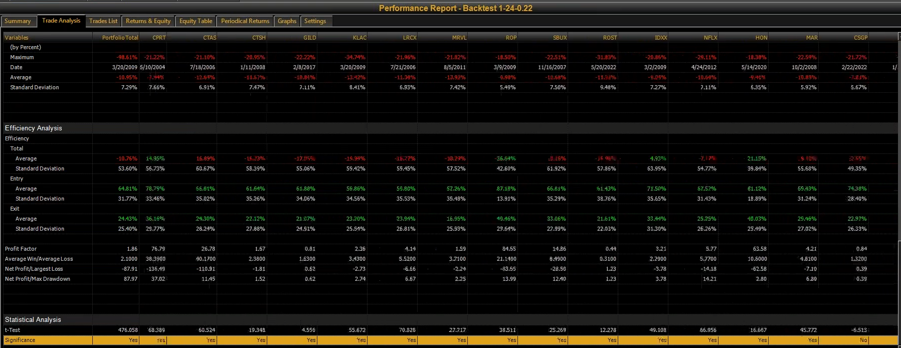 

tienes alguno que no, seguramente pere dinero y saber algunos que tienen perdido dinero otros que ven entonces yo aquí puedo analizar y puedo ver todas las acciones que me gusta el maestro que tengo cien repito puedo ver un poco pues dónde están aquellas las puedo apuntar y puedo tratar de hacerme alguna alguna cesta y ver en esas un poco como ha ido pero pero bastantes, recordarar acciones lo que os dije aquí el riesgo de gap es enorme el riesgo de gap es enorme, gaps del 10% entonces hay que ir a una exposición muy muy baja de acuerdo porque tú has expuesto un 2% y te meten un gap de 10% te has metido un 20% y estar expuesto un 2% es poco, entonces este es el problema por eso tenemos también tanto drawdown porque que te han cazado muchas en algunos momentos han cazado muchas y te las tragas y además cuando hay caídas de mercado globales te las tragas todas claro y te meten un gap y te cosiste el problema de este tipo de estrategias en acciones que cuesta mucho de controlar riesgo con estrategia o sea con sobre optimización es fácil pero en la realidad con estrategias como esta que no están sobre optimizadas porque están miradas en cien acciones no es fácil 

pero aún así fíjate  tienes aquí está que digamos ratio de profit factor por ponerlo fácil no que si no nos vamos a hacer un poco trampas viendo un poco el valor de cada uno profit factor aquí mira esto tenemos 2.59 pero cuando trades tiene? no van a tener mucho las que más van a tener van a tener 20 algo más bueno pues tienes aquí unas cuantas que pueden estar ahí en el ratio de profit factor de 2 que a lo mejor pues merecen una mayor 11 estos demasiado seguramente como si no muchos a bueno es **nvidia** claro miras un cohete claro lógicamente las más volátiles se ayudarán más que hemos metido de todo y eso mejoraría mucho la cartera y esto ya digo son deberes que los dejo a vosotros con esta simple estrategia y ahora probarlo en distintas acciones y lógicamente si tú encuentras una cesta de 20 acciones 

**cómo recomiendo el rebajar el drawdown**  
sobre todo sobre todo con diversificación porque al final o sea el problema de los sistemas tendenciales puros es este es decir si tú tienes un tendencial puro insisto insisto aureli que es demasiado más de 40% pero pero es igual en pongo lo bajar a los 10 puntos porque tal vez tampoco te pido bajarlo al 20 vale una tendencia al pura sabrá tendencial pura que es capaz de ganar esto y esta locura... porque para ganar esto también te has tragado alguna acción que no entonces al final ese es el problema pues ahí lo hemos validado en todas y conseguimos que teng un drawdown muy fuerte y tú ahora podrías podrías aplicarlo a lo mejor a 10 acciones que ya te he dicho que no cogería las 20 al menos no cogería las 20 como estas pero a lo mejor 10 sí que cogería donde ha ido muy bien y tenga bastante histórico cuidado pero luego también cogería algunas que a lo mejor pues no tanto por lo que fuera a lo mejor porque está lateral ese activo pero bueno no tiene por qué estarlo siempre mejor ahora envidia de pronto se acaba esto y no sube nunca más es que al final el problema el problema es que no conocemos el futuro envidia ahora va muy bien ¿ qué va a hacer? irá siempre así ? no sé a lo mejor de pronto no sé tesla de pronto su software de coches que dicen que es el mejor de auto se ponen todos de moda decide que todas marcas  se lo voy a comprar a tesla y tesla automáticamente empieza a vender software a todas las marcas de coches esto me lo he inventado totalmente pero me entendéis entonces 

el tema entonces aquí la diversificación sobre la mejor manera es con una cartera con porfolio a nivel de control de sistema es lo que te digo esto lo expliqué y alguien creo que en el foro en él en él en el chat ya lo comentó el profit target de mejorar a las mejoras a las salidas no que era contraintuitivo algo así bueno no recuerda bueno 

**las salidas el tp es una cosa que mejora más el riesgo de lo que parece mejora mucho**  
y en un tenencial no hay tp, entonces si tú vas a tendencia pura 

se aprende más al error del texto que del acierto y en el curso pues yo también lo planteado así de acuerdo de cómo se aprende más del error pues aquí aprendemos cosas que no son perfectas de acuerdo porque aprenderás más de ellas que enseñar que bien va esto que va bien va aquello

***estoy buscando un sistema en el que digamos me haga me haga un break even y justo en los pares del yen me falla el porcentaje de recorrido que tiene que hacer para que entre en break even y me entra en break even prácticamente al inmediato y cuál es mi sorpresa cuando paso por los pares del yen veo esta maravilla de curva que no solo sucede en esta en muchos otros pares entonces ahora lo estoy intentando validar en mt4 porque claro aquí que haga muy poquito recorrido y ponga break even nos esto hace que pues nunca haya drawdown porque sólo quedan las buenas lo que pasa es que la entrada del sistema no es casi nunca coincide con la entrada teórica que te plantas en el trade station ya sea en el open next buy next bar o bien on close, buy on close. Entonces esto cuando lo intentas replicar en la vida real lo estoy intentando hacer en mt4 no consigues no consigues esto*** 

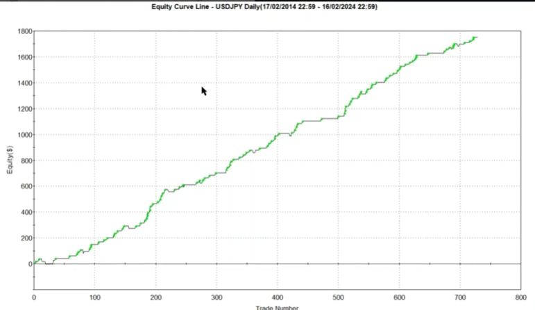 

estás hablando de un error de back test más bien, 

***realmente si tú miras la curva o sea mira esas operaciones que hace trade station y son correctas pero luego en la vida real esas operaciones no se pueden ejecutar o sea nunca se ejecutan ese precio porque en la apertura en forex al día es en daily además la apertura del día siguiente suele haber unos deslizamientos unas rupturas que dan miedo***

claro pero eso es por el tema de spread claro o sea porque en forex tienes bit y ask y no tienes el last entonces ahí en trade station no estás backtestando contra el ask no lo estas backtestando contra el bit y el ask 

***yo no sé cómo se pueda*** 

cuando te quiero decir un error de programación es que estás haciendo algo que no es que no puedes hacer es decir estás leyendo a futuro el error de back test es que no estás consiguiendo replicar la realidad que es justo lo que dices tú no estás consiguiendo replicar la realidad de lo que pasa en el back test

queda entendido, en el forex claro, por cierto aurelí, multicharts permite hacer eso, vale? te lo digo porque eso tradestation no lo permite bueno no lo permite no lo permite en el sentido de dos datas y puedes penalizar con slip page el hecho que también podrías hacerlo así pero es bastante más real te lo voy a mostrar a multichart porque multichart si lo permite multichart si lo permite y creo que te puede venir bien esta característica  

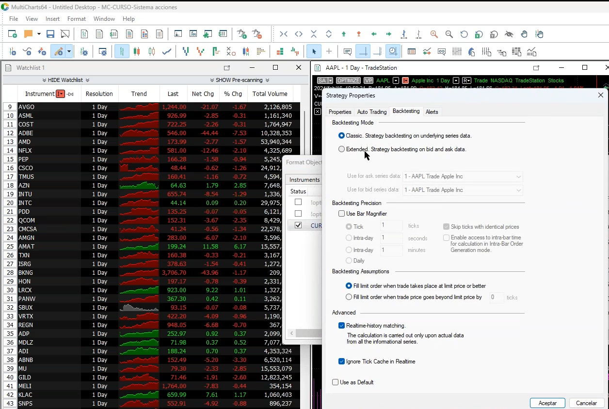 

extendido que es backtest se abre en el bit y el asiento tú le dices que para ask usa esta serie de datos y para beat usa otra que lógicamente también tienes que tener metida en el gráfico entonces tú le puedes meter la serie del beat la serie del ask que puede ser importada puede ser de otro vendor y back testearlo así back testearlo con ask bit y eso será bastante más real eso será bastante más real porque eso te pasa porque la ventaja es estrecha cuando la ventaja es estrecha claro importa importa mucho el bricky even de todas maneras tiene tendencia a tener problemas de este de este tipo porque el break even al uso que se activa a partir de una cierta cantidad muchas veces nos pasa eso que nos ejecuta muy rápido y ahí por un lado tienes que ir a lo que hablábamos antes del lift de acuerdo tener muy claro cómo abre y tener muy claro el slipage a lo mejor tienes que penalizar con muchos slipage si no es reproducible pero de todas maneras el camino más cercano a probarlo va a ser probar esto que te he dicho multicharts si poniendo que tengas multicharts que ahora no lo sé claro si tienes multicharts si tienes multicharts te recomiendo probar esto a probar 

en tradestation sí que tienes, no puedes directamente hacerlo pero podrías hacerlo indirectamente podríamos o sea podrías montarte tú pero no con datos de el, 

arriba tengo el beat el as que abajo tengo el bit 

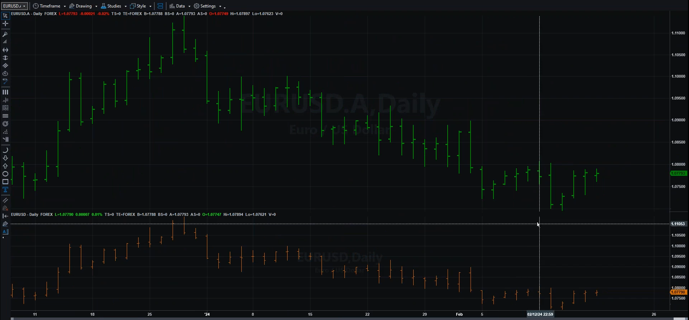 

yo siempre voy a tirar la orden al bit pero como puedo consultar perdón perdón en este en este ejemplo que te estoy mostrando voy a tirar la orden al ask que está arriba pero yo puedo puedo consultar el data 2 acuerdo que es el bit en el data 1 tengo las que en el data 2 tengo el beat ahora mismo como puedo consultar uno u otro pues puedo puedo jugar un poco con eso y ver más cerca de la realidad no sé si me estoy explicando... aunque yo ejecuto arriba puedo hacerlo con una regla que dependa del de abajo entonces penalizar en base a eso mejor. puedes hacer un backtest un poco mejor así 

recomiendo explorar esta esta opción porque al final el problema aquí es este no que en el forex aunque las plataformas de futuros y lo pintan porque va así , en realidad en realidad en el forex no hay aunque sí que hay no hay ask como tal, entiende la idea? aquellos que no estan familiarizados aprovecho para introducir este este concepto está el as que está el beat es que es este spread aquí está pintado ahora el euro a que se es el as que en realidad pero si ahora pinto aquí el euro dólar que va a ser mejor es el que es primario pues ves aquí yo tengo que está el último cruce a 97 pero ves aquí está el as que está a 802 7802 y el beat lo tengo a 7992 entonces yo si compro a mercado lo que hago es atacar el as y si vendo a mercado lo que hago es atacar el beat y entonces bueno como puedo pintar los dos en un gráfico pues puedo tratar de mejorar el backtest con eso exploró un poco ese camino 

**comenta fran pregunta que si quiere hacerlo meta trader se puede considerar un spread más elevado para que compensa el spread de slipage**   
si el problema el el problema real del spread fran de este problema en el fondo no es tanto de reproducir el slipage porque eso es fácil sino de ejecutar la realidad porque si yo yo el de arriba es el as y el de abajo es el beat vale es decir el de arriba para que me entendáis pinta el rojo el de arriba pinta la columna roja entonces al final yo el de abajo me está pintando el en la columna azul esta casilla de aquí vez esta casilla 

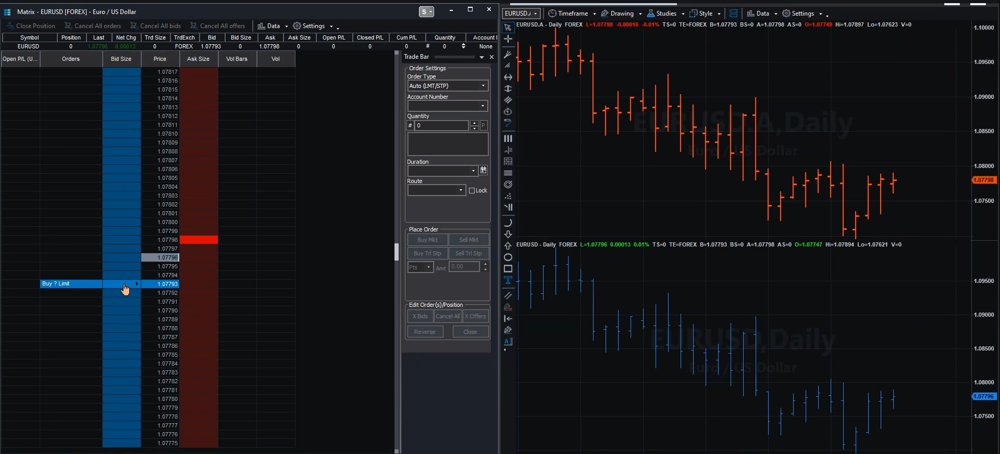 

==sin repasar====

y ese es lo que se va moviendo y eso que no se mueve aquí porque porque tres estes son bueno pero esa esa era la que pinta cada uno vale esa es la que pinta cada uno de acuerdo eso es lo que cada uno va pintando entonces el problema es que yo si pongo el sistema aquí el que sea yo pongo un sistema aquí el cuando compre cuando compre sí que va a reflejar la realidad porque yo compro imagina que tiro a mercado contra las pero cuando venda va a seguir vendiendo contra las y realmente vende contra el beat pero el sistema que va a correr en este gráfico el sistema que va a correr en este gráfico algo que ejecute mucho ahora vale yo compro venda aquí he comprado vale y me dice que he comprado a unos 7 8 1 9 y ese precio probablemente ha sido real porque como es el rojo he comprado en este precio pero este me dice que ha vendido a 1 7 7 5 6 y no es verdad ha vendido más abajo ha vendido 45 ticks por debajo no es verdad ese precio entonces es un problema ya no tanto desde la deslizamiento que lo puedo simular sino que habrá veces que sea el mínimo o el máximo y marque ejecutado cuando realmente no ha ejecutado tienes la idea sea el problema es más de réplica eso a nosotros nos ha pasado mucho este ya lo contado porque al subir los tipos de interés en los futuros ha subido mucho ese spread esa diferencia entre entre el futuro y el cfd porque el cfd el tipo de interés lo tiene fuera o tienen su app en cambio el futuro lo tiene implícito pero ahora es otro tema pero el problema ha sido el mismo vale de que la compra va si yo ejecuto en este gráfico el sistema la compra se hace correcta la venta no y en este es lo contrario la compra no se hace correcta la venta así entonces bueno puedo jugar un poco con eso porque yo como puedo consultar el de abajo cuando calcula un precio de venta estaba para aurel y lo calculo en el de abajo cuando calcula un precio de compro lo calculo en el de arriba y con eso puedes tirar un poco y luego aparte también evidentemente con solucionarlo pero el problema en el histórico tiempo real es simular que realmente ejecutó lo que tocaba y ese problema en el vídeo las que hay es spread que a veces ejecutas por poco cuando ejecutas por poco no puede ser verdad pero puede ser que no vale 

=======

### para acabar el sistema este, el tema de los cortos

vale el tema de los cortos a nivel global es muy complicado lógicamente si lo miras a nivel de algunas acciones lo vas a encontrar y no es difícil no es difícil pero al uso tendencial no. 

Por ejemplo aqui en Tesla fíjate aquí que iría más bien... pues seguramente entradas ritura en un canal grande para entradas a largp plazo, no tráiling, ir a salida puede por tiempo no sé tres cuatro barras, ST 0.05 TO 0.1  me lo invento  todo y a buscar explosiones

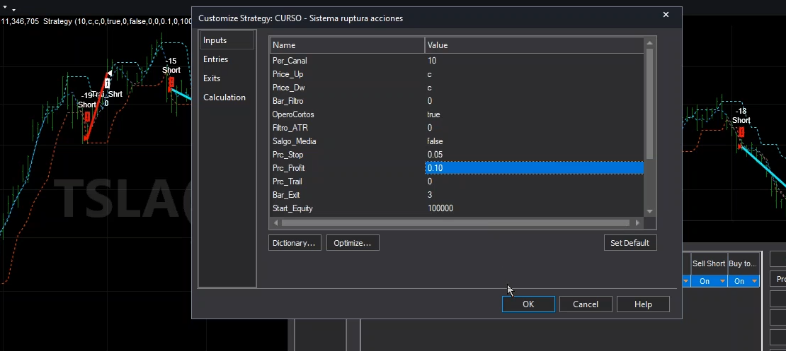 
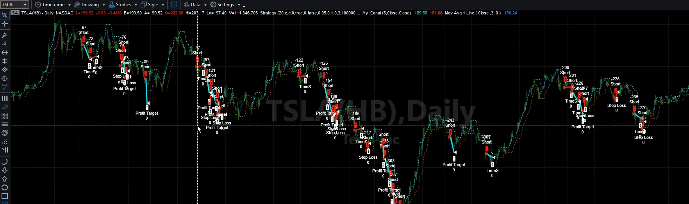 

pero es muy difícil recuerden que el 90% de los traidores es una entrada muy lenta es una entrada muy lenta el don chan y cuando te pilla las buenas no lo vas a dejar correr sabes pero la verdad es complicado te va a tragar muchas malas en ese tipo de entradas es comlicado, es mejor ir a expansión de volatilidad cuando detectes alguna expansión de volatilidad entrar y a un TP no muy alejado. al revés

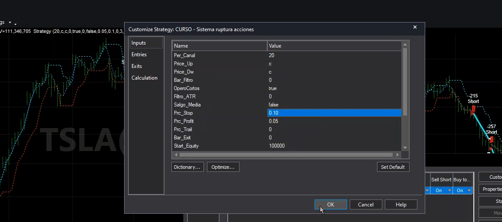 

cuando falle te va a fallar mucho, % de acierto algo pero te fallará mucho... nada... un desastre,,,  es muy dificil y mas en unaca rtera de 100 acciones, es muy difícil entrando con don chan porque es una entrada el principal problema de esta entrada es que es muy retrasada 

**un buen truco para medir un edge sobre Donchain con ST y TP igual** vale pero es verdad que para los tendenciales cuidado pero sí que es un buen es un buen es un buen truco rápido para ver casi ninguna te pasaba del 50 claro y si calculado con atr una unidad por cinco días si el truco es bueno pero es para evaluar la entrada de manera rápida pero es verdad que los tendenciales lo que te digo tienen que correr entonces a veces a lo mejor te puedes probar a darle 2 a 1  dejarle así y de eso stop bueno que ya lo veremos en una clase quiero hacer una clase que tengo que porque la tengo más o menos las clases pensadas y planeadas pero no el orden pensé sobre la marcha no como pide la clase pero como van las preguntas y demás pero sí que hay una que haremos búsqueda de patrones y uno de ellos por supuesto es ese y hay otro que es con la rotura del máximo del día anterior y cerrar al cierre por ejemplo y esto va bien para ver la tendencia de ese activo sabes para ver si las roturas de un día marcan tendencia o no y también lo puedes hacer en intradía para ver si en el intradía y tendencia puedes tener fails pero pero pero al final te dices en intradía si tiene tendencia yo si rompe el máximo de ayer entro largo y al cierre ciego con eso mira si el activo de la inradía tiene tendencia nos salen todas pero muchas acciones de muchos activos te sale veremos cositas de estas un día que haremos con un código lo haremos varias de ellas y nos iremos pasando en distintos activos de acciones futuros de distinto tipo para para veáis distintas maneras de encontrar entradas vale que ya dijimos que veríamos bastantes querido empezar por el doncha porque sé que ha hablado mucho de él en el curso y además es bueno de verdad lo que pasa que tiene sus puntos débiles de sus puntos débiles y que donde va mejor el doncha de salir o sea es lo mismo que has visto en el lado largo que lo podéis explorar en vez de trailing en rotura no lo hemos hecho tal 

pero yo lo dejo ahora bueno da igual porque está bloqueado para cortos pero voy a activar esto

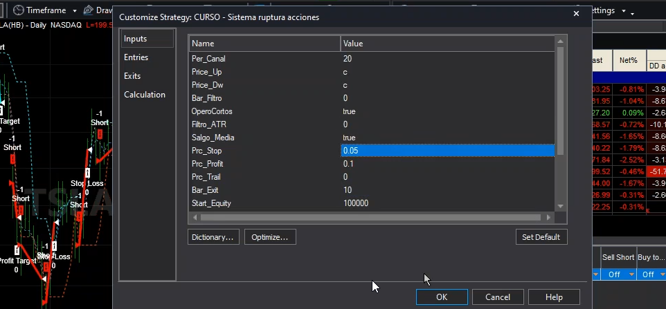 

lo mismo buscar la explosión y salir de buscar la explosión y salir de esto y hasta 20 es demasiado podría ser mejor para 10 pero bueno ya digo es poco sensible el canal como hemos visto es poco sensible con donchian en general esto lo puedes probar las 100 acciones es decir en vez de ir al training o incluso dejando el trailing incluso dejando el trailing hasta suponiendo pocos cambios de la versión actual es decir no mira no no liar, lo mismo que tenías pero al mismo tiempo lo que se ha dicho le pruebas le dejas la media puesta 

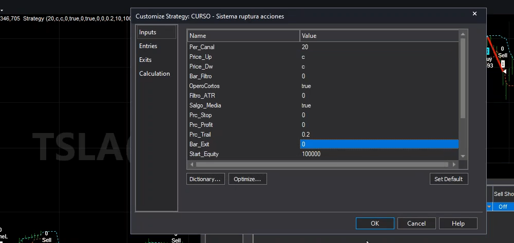 

ya verás que el trailing nos va a actuar casi nunca va a salir algunas veces por traling algunas veces por media 

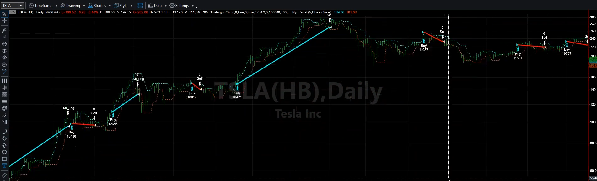 

y así la media se le va a pegar mucho se le va a pegar mucho y esta es otra variante que es un poquito más más rápida y que en muchos actores va a ir muy muy bien pero muy bien también es de dejar correr pero dejar correr menos 

luego ya lo que os decía decir en vez de esto a 10 días esta es la que en muchos roturas se usa eso  y ya está incluso el traling un poquito más más cerrado 

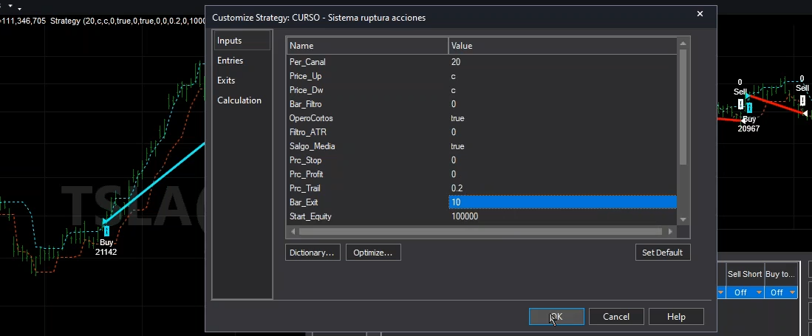 

y os va a salir en muchos veces en tiempo no va a salir el SP per esto va a salir en tiempo y se pueden hacer varias variantes que ya no sean el propiamente tendencial y que va a ir en muchas alguna mejor no irá también pero va a ir para el muy bien en muchas porque porque al final sale el mercado antes tienen distintas maneras para salir, sale por tiempo que sí que algunas veces pues saldrá mal pero pero mucho saldrá bien incluso, nvida que ya veréis aquí no va a ser tan aquí por ejemplo seguramente irá típico pero también en las caídas veis pues como se salen 10 días pues al final se sale 

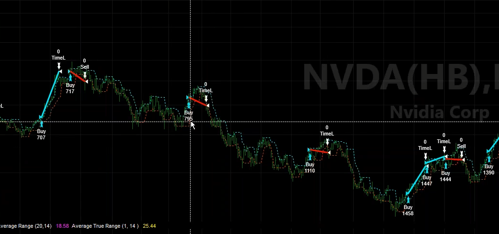 

antes a lo mejor que con él con el donchain pero claro las subidas tendidas se va saliendo se va metiendo se va saliendo se va metiendo pero esta es una variante esto no te va a dar ratios tan tendenciales pero también te va a dar ratios tendenciales este es 46% Profitable, antes no lo hemos mirado antes en maestro pero da 47% en maestro pues mira un da más de lo que pensaba prácticamente da más de lo que pensaba pensaba que daría menos pensaba que daría menos con este set up 44-47% dependiendo del set 44 47 pensaba que daría más de verdad se parece mucho bueno prácticamente el mismo 

seguramente nvidia daba más en ese este es seguramente envidia era de las que más porcentaje daba de acierto digo yo habíamos visto gráfico antes era espectacularmente tendencial claro una locura envidia estará por aquí a nos ha ordenado esto por alfabético no porque es ordenado no sé porque se ha ordenado bueno pues no sé da igual habrá de aquí con porcentaje de acierto es muy alto y habrá con menos 

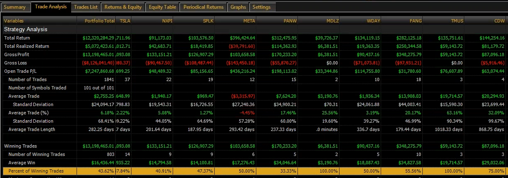 

***¿para realizar los rangos de parámetros pregunta fran es es buen sistema usar que el clínic si lo hacemos no sesgamos la zona paramétrica?***   
darte más explicación que la que te he dado ahora me voy a me voy a liar no sé no sé no sé decirte nada nada más en concreto 

***comenta aureli lo de las tortugas***  
son exactamente un donchan, es exactamente es exactamente lo que pasa que es un don chan, las claves de las tortugas era la gestión monetaria que no no se ha propagado eso no se ha propagado totalmente eso pero pero tenían una gestión monetaria muy estricta y era era lo que iban promediando a favor era una manera de su de fallaron muchísimo después de ciertos megabajos es decir se iban un poco a buscar las envidias entonces la cuando pillaban una envidia la añadían añadían añadían se iban apalancándose en ella y claro los revientas es que los revientas es verdad son acciones es así o sea tú pillas la que lo revienta y es tremendo y se basaban un poco un poco en eso se basan un poco en eso 

enjambre de partículas al final yo no he leído nada ni visto nada súper concluyente que que mejor el algoritmo genético de verdad es que al final y no no creo honestamente si hay algún paper por ahí que se me ha escapado pues pásame lo que lo leeré atentamente pero pero no creo de verdad que incluso ya por mi sentido común de mi experiencia que realmente haya un algoritmo que mejore mucho es la lógica que tiene algoritmo genético la misma que tiene enjambre de partículas y seguramente es al final bien son lógicas de búsqueda de de búsqueda de zonas robustas que que al final todos siguen un poco lo mismo y a mí la de algoritmo genético también me parece muy razonable muy lógica y fomenta totalmente eso bueno siempre hay algo que sale que es mejor en teoría que no sé qué pero realmente es una gran mejora a eso? 

lo que importa son más las ideas entonces el el tema el algoritmo de búsqueda no creo yo que esté ahí la gran cosa no creo la verdad que no pero bueno ya digo al final evidentemente estar muy abierto siempre es muy importante a cualquier cosa nueva tal pero no es lo que es muy antiguo pero prefiero que cualquier cosa que sale ser atento a posibles mejoras no pero pero ya digo muchas al final acaban siendo poco de lo mismo da una vuelta de otra manera mejor más rápido o lo que fuera pero es un poco y no acaban de provocar unas grandes mejoras porque siempre hay gente pues más defensora de una cosa y de la otra y esto pasa mucho lo buscaré si tienes alguna fuente por ahí me la pasas y la la miraré con calma 

pues voy a ir cortando ahora pues quería probar otro un poco más más de intradía así que tengo varios ya no no no no lo seguro pero puede que que hagamos el `orb` o puede que hagamos el rb que tenía pensado hacer intradiliario probablemente con el dax empecemos y veremos lo extrapolamos a más activos vale pero bueno ya no me lo toméis seguro seguro pero pero ese es uno de los que tengo anotados para para hacer uno de revés sobre el dax me gusta mucho un futuro que me gusta mucho vale eso sería intradía así que puede que vayamos con él el próximo día y en todo caso casi con toda seguridad que haremos algo intradía para para entrar un poquito más en cosas de más datos y más poquito más complejas que éstas vale amigos nada más os veo el lunes que viene recordar enviar dudas al discord porque así las podemos compartir entre todos y creo que eso pues añade tenerse aquí la sección de pregunta aquí para añadirlas y tratamos de responderlas tratamos de responderlas bueno algunas aquí y otras en la clase en directo porque creo que aportan a todos vale si alguien todavía no tiene acceso enviarnos un email con el vuestro usuario y os lo os lo daremos nada más amigos hasta pronto que tengáis muy buena semana