Perfecto ✅
Aquí tienes el texto con los **títulos en negrita** y **sin los símbolos `###`**, manteniendo todo el contenido original intacto:

---

**🎙️ Introducción y problemas de audio**

todos los asistentes están en modo de sólo escucha bien yo al final pues os iré respondiendo me ponía es que no se oye nada pero parece que ya se debe oír no a ver se oye no se oye porque me dice abierto que sí soy bien soy escribirlo está comenzando todos los asistentes están en modo de sólo escucha escribo se oye se oye ya que no tiene que el disco el país pues venga a ver invitación es público a ver que tenía por aquí esto es para luego esto aquí y aquí tengo el el discor y aquí tengo las preguntas se me oye distorsionado dice raúl pues no sé no sé si será a ver si alguien más dice por ahí algo si se me oye bien o mal se me debería de ver bien pero claro vayan bien vayan bien

---

**💬 Pregunta de Alejandro sobre sistemas tendenciales**

a ver preguntitas que había bastante bastante cosa por el discor antes de abordar los sistemas intradieros bien comentaba alejandro las voy a ir poniendo las voy a ir poniendo esto se hace más grande aquí de alejandro lo que preguntaba así 

***para evaluar un sistema tendencial que lógicamente funciona mejor en activos potenciales comentaba en el curso que miraba el adx y el atr el adx utilizas la media histórica no te parece este dato un poco sesgado y decía también que si es decir es decir que estás operando en temporalidad diaria y el activo tiene 15 años de historia realmente tiene utilidad la media una vez más útil evaluar si está en tendencia por la media del adx del último año o dos años es que la media cuando hay tanto histórico ya apenas cambia y si el activo cambia es forma de actuar tú no lo vas a estar leyendo***


**📊 Explicación sobre ADX, ATR y comparativa entre activos**

sí bueno el ejercicio que hice que entiendo que te refieres a él en la teoría donde usaba el atr y el adx usaba una media histórica de todos los datos que tiene cargado el adx o el atr que no deja de ser un análisis comparativo comparativo entre distintos activos es un poco su utilidad por eso la tierra era en el porcentaje y porque en puntos pues no te da esa capacidad comparativa y el adx en sí pues ya tiene un valor que ya ya está normalizado por lo tanto ya es comparable entre distintos activos eso es un poco su lectura lo que comentas no es que esté no es que esté mal el adx recordar que al final pretende decir si hay o no tendencia no tanto si es a un lado o a otra aunque el adx se descompone en dos en el de más y el de menos que eso sí que cada uno por su lado pues en teoría tiene bueno en teoría no es que es en teoría es que como todos los indicadores pretenden una cosa pero no siempre no siempre lo consiguen perfectamente pero pero sí el principio es su objetivo y como digo se compone del de más y el de menos

---

**📈 Cómo se interpreta el ADX en distintos marcos temporales**

bueno entonces es un poco a nivel a nivel comparativo hay otras maneras el más el más ortodoxo del más ortodoxo es usar el coeficiente de cursos ya os lo comenté pero no es tan fácil de calcular y al final esto puede ser una manera de hacerlo es verdad que en gráficos aunque yo hice el análisis ahí no es que esté mal hacerlo no es que esté mal hacerlo pero a cuanto más y tiene el gráfico es el más largo plazo más fáciles en contar tendencia vale esto donde se ve más más más claros en el mercado de acciones ahí es es es absolutamente el lugar perfecto para mostrarlo

**🧭 Ejemplo visual de tendencia en distintos marcos (diario, semanal, mensual)**

tú tienes mira esto en el gráfico podemos decir cotidiano que tengo de seguir los futuros se ve se ve bastante bien se ve bastante bien 

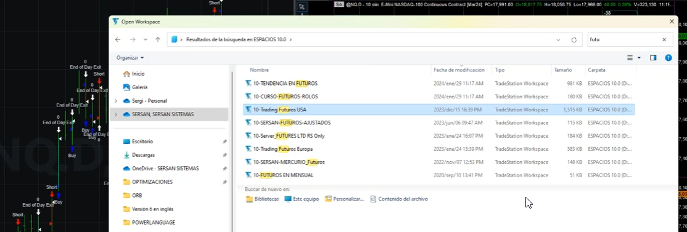

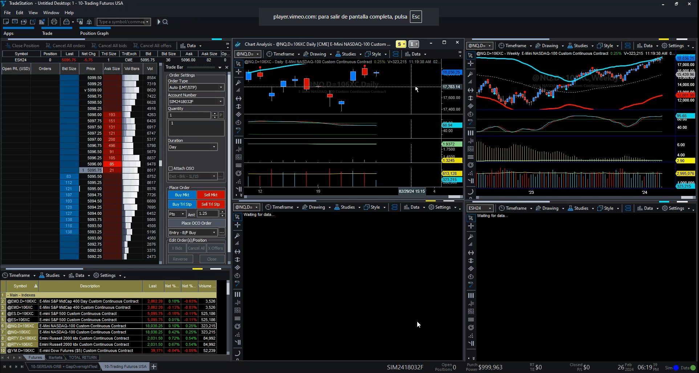

tú en un intra día de acciones la mayoría de días lógicamente no siempre pues el mercado es bastante bien revertir de hecho en acciones pues lo que mejor va es la revelación pero sobre todo en intradía más sobre todo en intradía diario también también pero ya se puede encontrar tendencia vale ya se puede encontrar tendencia y a medida que vamos subiendo el plazo de acuerdo es decir tú tú ves aquí este gráfico en un horizonte diario 

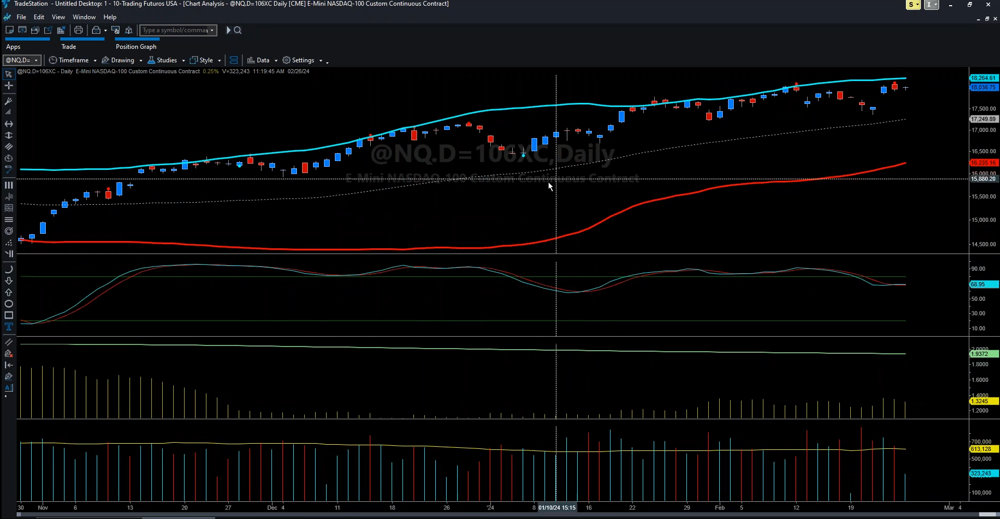

que estamos viendo un gráfico bastante desarrollado y de hecho aquí estamos cubriendo pues un período de barras bastante bastante importante y como vemos tenemos una lateralidad bastante aunque es alcista tenemos una cierta lateralidad podemos decir visual visual es verdad que el hecho de que hayan tantos indicadores que ahora quito pues se agrava este esta sensación no pero a medida quitas indicadores parece más altista 

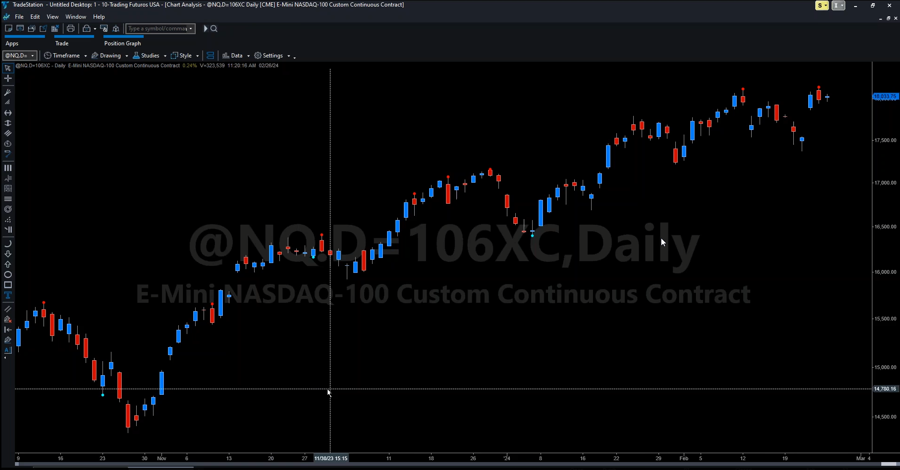


pero ya me entendéis ya me entendéis y a medida que yo amplío mucho amplío mucho prácticamente ya solo me parece que hay una tendencia alcista y esto como mejor se ve pues lo que te digo si tú puedes un gráfico mensual un gráfico mensual pues si es esto es alcista más no poder esto es alcista más no poder aquí se parece súper alcista vale 

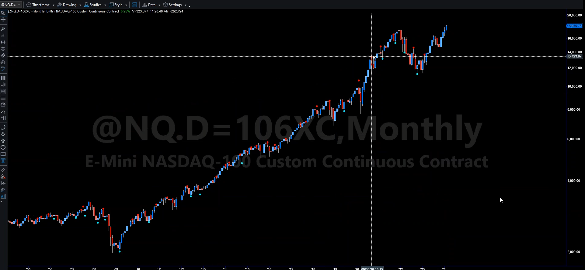

o sea súper tendencial por lo que estoy hablando alcista lógicamente hablando de tendencial pero en este caso pues alcista  
en cambio te digo a la que vamos a la intradia es todo se vuelve mucho más lateral prácticamente es un gap un gap y lateral de acuerdo es un gap y lateral vale 

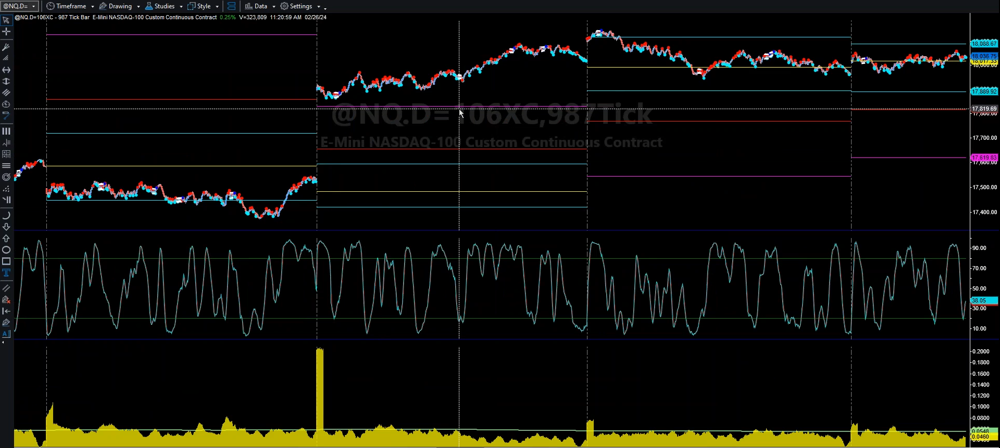

y esto es así es así donde es más pasa un poco en todos los tipos activos pero el equity quizás el que es más paradigmático


**⚙️ Dificultad de detectar tendencia en intradía y tipos de estrategias**

entonces a nivel de a nivel de mirar tendencialidad ya digo en diario y ya no te digo en semanal pues casi todos los activos o son tendenciales o en cualquier caso son más tendenciales que en una que en una temporalidad más corta, en las temporalidades interdiarias realmente no es fácil de contar tendencia en términos generales no es fácil de contar tendencia y ahí normalmente suele ir mejor el `menn reverting` o en el mejor de los casos el `volatilidad y breakout` vale porque al final `volatilidad y breakout` recordar que la teoría lo comentamos no deja de ser un tipo de una especie de tendencial donde lo lo limitamos con objetivos y demás por lo tanto ya pierde su su clara tendencialidad pero digamos que busca entrar... o sea entra tarde como un tendencial... entra rupturas pero ahí volatilidad breakouts que su vida como digo es tendencial es un mecanismo de entrada podemos decir que es muy parecido al de un tendencial pero claro cambian mucho las salidas y eso pues totalmente cambia el comportamiento del sistema

**🧪 Evaluación comparativa y búsqueda de señales tendenciales**

entonces estos análisis que hice en la teoría pues estaban básicamente en gráficos no recuerdo si eran diarios o a lo mejor hasta eran en semanal quizá entonces pues ahí sí que todo es un poco más tendencial pero ahí yo te digo es más bien un tema comparativo Alejandro más bien comparativo comparar un activo con otro el hecho de si mirar en ese hay mucha o poca tendencia vale  

veremos también cuando evaluamos evaluamos no tengo claro exacto si será en tres clases o en cinco vale pero pero haremos una clase donde usaremos un buscador de señales digamos que haremos varias varios setups que nos permiten buscar mecanismos de entrada y que indirectamente también nos sirven para evaluar cómo de tendencial es un activo ya lo he comentado algunas veces más bastante conocida y bastante fácil que simplemente pues en una vela diaria comprar ante la ruptura del máximo del día anterior y cerrar al cierre entonces esto es un indicador de la tendencia y lo mismo para la parte baja y eso es un indicador de la tendencialidad del activo por ejemplo no es decir este tipo de cosas realmente pueden servir para ver hasta qué punto un activo es tendencial vale ante las rupturas y también nos sirve para eso vale entonces hay un poquito varias varias maneras


**📐 Reflexión sobre el sesgo del ADX y comparaciones**

el `adx` de lo que dices tú del sesgo yo lo veo un poco más al revés es decir a medida que si tú reduces el periodo es donde lo vas a sesgar si realmente es cierto vas a ver si en el último año dos años pues ha sido un activo bastante tendencial pero en este ejercicio como te digo lo que mirábamos tratábamos de ver era por comparación que características tenía ese activo con otros comparado con otros vale era un poco la idea

**📄 Comentario de Carlos sobre algoritmos de posicionamiento**

vale que más bueno luego aquí también había comentario este de carlos de que un artículo sobre el algoritmo de posicionamiento con una explicación una comparativa entre `fixed fractional`, `fixed ratio` pues lo tenés que repasar porque la verdad que tengo muchos apuntes sobre eso y cuando volvamos a repasar y tratemos en las prácticas un poco esos temas que ya lo haremos podemos decir más bien de la mano del porfolio que ahora por cierto quiero hacer un comentario respecto y luego luego lo haré y pues ahí lo trataremos más y si un caso ya tenemos material carlos pero ahora mismo tengo es que tengo tengo bastantes pero bueno repasaremos 

**🧰 Pregunta de José Manuel sobre configuración del servidor**

vale jose manuel jose manuel él hablaba de la guía de configuración del server bueno la guía de configuración del server la verdad que sinceramente aquí en la empresa tenemos dudas hasta qué punto es súper útil eso pero bueno bien lo lo lo lo evaluaremos de cara sería un tema más de cara al final vale más de cara de cara al final pero sí que sí que inicialmente queríamos hacer algo al respecto vale pero pero en directo es complicado porque yo no me puedo conectar al server me entiendes no me puedo conectar al server en directo es complejo no sé cómo hacerlo porque porque el porque ves la ip entonces me lo revientas no lo puedo hacer en directo tengo que grabarlo y entonces hacerlo al grabarlo lo puedo editar no y le puedo tapar la ip entonces es un poco la la la tema en directo no es fácil entonces sí que teníamos decisión de hacerlo y de hecho un poco ya explicamos en la teoría pero tenemos ese problema a ver cómo lo cómo lo podemos resolver vale ya le daremos una vuelta

**🧩 Sobre MSA y otras herramientas complementarias**

el respecto a mesa estaría en algún mini tutorial con su uso para que no que casos merece la pena no tiene alternativa entre eso multichars...   
el motivo justamente por el que quiero ir usando distintas herramientas es ese vale que vayáis viendo vosotros y que sin querer pues los vayas aprendiendo o viendo o que luego ya enseñarte cómo buscar en su ayuda etcétera vale entonces msa en el curso lo verás en las pláticas en algunas clases saldrá vale y entonces ahí pues podrás ya ver cómo va y verás cómo lo monto yo etcétera etcétera entonces un poquito lo aprenderás.  

`msa` al tener una que casos merece la pena? es muy baratito y además recordar que tenéis una oferta yo os lo recomiendo mucho os lo digo de corazón por el precio que tiene da mucho recordar que aquí está la oferta de msa haciéndolas de descuento y yo sí lo recomiendo vale porque para la gestión monetaria viene muy bien entonces lo mismo lo puede hacer si lo puedes hacer en otros pero no es igual sabes es muy práctico msa que permite probar muchos algoritmos que se monetarían de manera de manera rápida yo por el precio que tiene de verdad que os lo recomiendo

> Algunos alumnos nos habían hecho llegar que el cupón de descuento de MSA ya no funcionaba. Hemos enviado un email a Adaptrade y nos ha reactivado el cupón de descuento de 100$:
>
>MSA100DSC
>
>Os dejamos información sobre el software: https://www.adaptrade.com/MSA/index.htm
>
>Lo podéis adquirir aquí: https://adaptrade.onfastspring.com/market-system-analyzer-4
>Cambiando el país en la parte de arriba podéis cambiar la divisa de pago si queréis hacerlo.

**🔄 Compatibilidad de código y Portfolio Maestro**
*¿hay alguna forma de trasladar código de la meta trader?*   

no rápida no no hay no no me consta que haya es una pregunta ya reiterada en muchos años y no me consta 

*¿profundizar más en porfolio maestro como usarlo para evaluación preliminar que es el porfolio selección de sistemas?*

bueno la verdad que lo que hemos visto en teoría y veremos en algún momento pero bueno ya iremos viendo iremos viendo como iremos viendo y no que has visto la teoría claro la teoría se ha visto un poco como va maestro y lo que sí que puedo hacer también también apuntamelo alberto porque tengo por ahí una guía bastante buena de maestro y eso sí que podemos darlo porque maestro ha cambiado entre 0 y 0,01 en los últimos años así que es una guía que es antigua pero que está totalmente en vigor porque no ha cambiado nada maestro maestro ya te digo te aviso de como él es un programa muy potente pero te vas a exasperar con él es exasperante porque es tecnológicamente claro todo evoluciona compras un móvil este año y le da mil vueltas al de bueno del año pasado ya no porque ya no avanzan tanto pero le hace tres de da mil vueltas vale yo me lo cambié hace poco y estoy alucinando con lo que dura la batería pero una cosa increíble un cambio lo demás nada es un poco mejor porque ya no cambia tanto pero ya digo la batería es alucinante bueno pues maestro es el mismo hace diez años entiendes, entonces claro, hace diez años pues bueno va iba tirando hace ya cinco decías bueno es un poco pesado ahora ya va pasando el tiempo y te parece una cosa alucinante no evoluciona no mejora y se está quedando atrás que ya en sí está pasando pero maestro es el líder de esto de acuerdo es el líder de esto porque no evoluciona evolucionan me refiero a velocidad velocidad de procesamiento de este tipo de cosas entonces tiene ese problema maestro

**📊 Solicitud de ejemplos prácticos (Juan Morelle) y respuesta**
***sería bien tener ejemplos prácticos de cómo montar, estaría bien tener ejemplos prácticos de cómo montar una matiz en excel para elegir sistemas desco relacionados para diversificar***  

*comentaba también del tema de por solio que quizá pues le faltaba algún tema*   

***Porfolio: recomendación general y equal weight***
en porfolio de verdad y ya sé que hay mucha literatura eso lo voy a decir este porque no voy dando saltos de un tema a otro de verdad que no os calentéis la cabeza lo que mejor funciona y más robusto es `equal weight` vale no os hagáis pajas mentales, lógicamente más optimizaciones en el porfolio y por esto por aquello, vale, porque sí, se pueden hacer 250 cosas, se puede hacer marcó bich, y se puede hacer la frontera eficiente, y no, y se puede hacer el pino puente, vale, pero el problema es si eso será robusto luego, me entiendes, entonces al final, los sistemas en sí ya tratamos que sean simples robustos y tal, y luego a nivel de mezclarlos ya entiendo que haya duda, como lo mezclo, ... pues `equal weight` de verdad `equal weight` no os calentéis, nos calentéis en buscarle ahí las vueltas porque al final yo ya lo entiendo , tú tienes un sistema que es muy bueno porque hemos pasado igual nosotros por ello no tú tienes un sistema muy bueno, y luego va sacando otros, y son una birria, vale, dices, joder cómo lo voy a poner a igual esto no bueno, si es así.. si es birria vs muy bueno, entiende..., claro, es depende de lo que implique muy bueno, si tú me estás hablando muy bueno con 10 años operando en el mercado real, vale, parlemna.. que digamos en catalán... parlemna... ahora si estamos hablando muy bueno a nivel de backtés o con dos meses operativas real... pues no es muy bueno, de acuerdo? es simplemente prometedor,,, nada más,,, muy bueno es en el mercado. entonces como si hablamos de situaciones más o menos comparables en cuanto a más o menos prometedor pero uno lo ves más prometedor, que el otro no te fíes porque el que es muy prometedor de pronto en tan mala racha y resulta que llevas todo el peso y el que era una birria de pronto lo peta tres meses seguidos y tú resulta que lo tenías ahí súper para súper bajo de peso y te atragas,,, entiendes? sólo se ha pasado que se está hablando de la experiencia de errores que uno ha cometido lógicamente porque para eso lleva 20 años y si alguien se piensa que en 20 años hemos cometido pocos errores quiere decir que lleva poco tiempo en el tráiding y porque tenemos muchísimos errores lo bueno es intentar aprender de ellos y que no sean tampoco errores catastróficos de acuerdo que sean errores pues asumibles.

**🧩 Mezcla de sistemas, herramientas y referencias**

entonces al final no es nada fácil tener claro que mezcla de sistemas va a ir mejor, por experiencia yo he llegado a este conclusion y ya sé que no es muy atractiva no es muy guay no que ya sé que gustaría una fórmula y tal que decir ostia esto lo va a petar la cartera sí sí , pues intentamos que eso se pueda dar con los sistemas de acuerdo pero luego ya a nivel de mezclarlo no es fácil. sí que nos apoyamos de herramientas como ya habéis visto maestro como ya habéis visto porfoliotrader como ya habéis visto y veréis también más `msa` y también veréis un poco de `quantanalyzer` vale entonces veremos todo este tipo de herramientas que nos que nos ayudan a tomar una decisión vale? pero ya digo que el equal weighted viene muy bien el cual waited viene muy bien y no hay que perder mucho la cabeza. ya sé que hay otros que defienden otros pero también hay otros que defienden esto es bastante conocidos entre ellos entre ellos que recuerda ahora mismo que espero no equivocarme pero estoy casi seguro que Kevin David recomienda eso estoy casi seguro que `Perric Afman` recomienda eso... os digo porque es complicado garantizarse la mezcla. entonces al final eso te garantiza diversificación y riesgo cubierto. me entiendes. porque a lo mejor no es la mezcla que más dinero va a ganar pero sí que es bastante probable que sea la que menos dolores de cabeza te va a dar. entonces como siempre hay que pensar en es,o en caso de duda el equal weighted te te cubre muy bien, eso pero bueno cuando lleguemos ya discutiremos sobre esto aportaremos y veremos pros y contras y veremos también que claro que se puede optimizar, claro que yo puedo meter ahí una función fitness optimizar el porfolio, hecho lo he hecho y lo puedo hacer igual que viste ya por folio trader que optimizo una variabl,e pues puedo optimizar el management si quiero y en msa lo puedo hacer lo veréis y lo hemos hecho el tema es si yo lo optimizo y lo que sale lo aplico yo lo optimizo o sea que no quiere decir que no optimicemos recordar que optimizamos muchas veces para obtener información, no quiere decir que optimizo y aplico lo que sale al máximo vale, pero sí que me sirve para coger referencias, para ver el optimizador que opina, no que al final es el final optimizador opina en base a los datos no que opina en esa mezcla ya ves que a veces escupe algún sistema, pues porque es una virgen de sistema, por lo que sea no decir vale perfecto él lo escupe, pero yo normalmente intento que lo escupa menos entiendes, porque porque sé que que es que es como os digo que de pronto el que iba fatal con los datos antiguos porque está en una mala época de pronto empezar bien el que va muy bien y hacer mal y así, entonces si depende de tu mezcla resulta que te puede salir ahí te puede ir aún a un drawdown muchísimo peor por culpa de eso no por culpa de eso. cambio le `equal weight` pues cubre un poquito 


***realizaR investigación y puesta en marcha de un sistema con COT***   
esto está previsto esto ya estaba previsto , tenemos varios sistemas sobre los que he hecho y una de las clases que tengo pensada hacer es sobre eso de acuerdo sobre sobre los COT

***cuando tenemos un sistema de evaluación preliminar y queremos ver qué entradas o salidas son las más óptimas se ven probando a mano varias hay alguna manera sistemática de elegir cuál es probar y qué basarnos para tomar unas otras?***   
en evaluación preliminar simplemente buscamos ver si el sistema es apto para seguir adelante, simplemente ya recomiendo ya os comenté básicamente que gane dinero, sí que se suele probar en casi todos los casos incluso en la INTRAentrada y aunque cuesta más que vaya en distintos activos, vale pero es simplemente que es rentable, que la y que el edge es es es explotable, y tiene ventaja, vale? hicimos una clase te recomiendo repasar la una o varias viendo un poco como evaluamos si una ventaja pues tenía cierto tenía ventaja

es un poco la idea para seguir adelante claro tú ahí que miramos es que no no no miramos mucho ahí no se trata de mirar muchos ratios de verdad es simplemente que tú veas que la ventaja tiene potencial. no di unas cantidades porque es que no hay unas cantidades ahí dices oye claro si tú sin comisiones imagínate que no le has puesto comisiones tienes un profit factor de 1.5,,, en ese momento sin haberlo trabajado, por esa bueno 1.5 depende qué tipo de sistema estaría bien un intradía o muchos trades podría estar bien, pero pero seTUP diario por ejemplo sería poco, sería poco, es que depende si sólo evaluas la entrada estaría, bien un sistema acabado completo que ya esté parecido como lo base o igual a como lo base evaluaría al final sería justo, pero un sistema que sólo le evaluas a lo mejor la entrada estaría correcto, vale, entonces, no hay un dato inequívoco al final de evaluación preliminar no deja de ser una especie de prueba más rápida que haces para no perder mucho perder mucho tiempo con cosas que ya no valen para nada, y que se ve rápido que no valen, explico, es decir es más bien un descarte que otra cosa, entonces si tienes dudas sigue para adelante acuerdo, si tienes dudas sigue para adelante, pero es para para descartar rápido podemos decir, yo lo explique largo porque pues lógicamente la teoría lo explica es largo, pero pero muchas veces eso es un momento y además es una cosa continua, que ya tiras con esa y sigues con las siguientes, es continuo no es continuo, un poco muchas veces solapan estos los he ido comentando especialmente los sistemas como hemos estado a diarios y demás ahí es porque el tiempo de procesamiento ya es lento entonces como que no no te aprieta tanto perder el tiempo ahí no el problema es cuando es un intradía que a lo mejor pues evaluarlo cuesta muchas horas de optimización y ahí sí que ya pues es oye si lo ves quieres antes hacer algo sencillo para que te se vaya de medios y no si no lo pasa, no, si no lo pasen no te van a perder un mes de trabajo no decir algo .


**🚀 Paso a real y límites por plataforma; materiales recomendados**
***una vez tenemos un sistema finalizado y queremos pasarlo real, como implementarlo en TradeStation para que operen varios activos diferentes dicho sistema como se hace?***  
bueno esto en sí en varios activos no tiene mayor dificultad, ya intentaré daros ya ya lo he ido haciendo y lo haré a medida que me lo vais pidiendo por ejemplo de maestro que te he dicho te voy a subir un material vale iré iré subiendo algunas cosas sí que os recomiendo es verdad que son antiguos algunos de ellos bueno son antiguos muchos de ellos en nuestra web, en nuestra página web, hay nuestra antigua época que éramos el soporte de tradestation ya os iré ya os iré facilitando el material que pueda que vea que os puede ayudar sobre esto pero de momento os recomendaría a aquellos que estéis muy muy verdes entre ese show ver este vídeo que es un resumen de la serie 10 en castellano y si no pues lo que os digo ver la serie en inglés verla verla en inglés Getting startet 

**🧮 Mínimos de datos, grados de libertad y métricas**
***¿umbral mínimo de trades en diario para que se pueda optimizar, `300`?***  

bueno esto siempre depende de acuerdo siempre depende en principio un sistema en diario a a priori piensa que no se puede optimizar y que si tienen muy pocos inputs y ya o ya es un veterano que ya lo has hecho antes y demás sabes que has podido mantenerlo robusto pues puede ser esa esa cantidad esa cantidad que das podría ser razonable es razonable vale es razonable una referencia que puedes coger son 30, 50, trades por grado de libertad 

<div style="border-left: 4px solid #f39c12; background: #fff8e5; padding: 10px 15px; margin: 10px 0;">
  <strong>⚠️ Regla</strong><br>

La expresión ***grado de libertad*** (en este contexto de trading cuantitativo o modelado estadístico) se refiere a cada parámetro que puede variar o ajustarse durante la optimización de un sistema. 

Cada `input` o `variable` que tú puedes cambiar libremente en tu estrategia (por ejemplo: longitud de una media, distancia de un stop, umbral de entrada, etc.) es un grado de libertad.

***Referencia razonable de 30, 50, trades por grado de libertad :***

* Si tu sistema tiene 2 parámetros optimizables, necesitas al menos 60–100 trades.
* Si tiene 6 parámetros, entonces 180–300 trades.


**📏 ¿Por qué importa esto?**

Porque ***cada grado de libertad requiere suficientes datos (trades)*** para que la optimización sea estadísticamente significativa y no sobreajuste (overfitting).
</div>


vale entonces ahí es que depende mucho porque tú ves es un diario pero no me dices si tienes siete inputs entonces o uno, tienes uno pues normalmente vas bien, vale pero de todo eso hemos hablado mucho en la teoría yo creo que hemos hablado mucho de ello de acuerdo en toda la parte de optimización y demás. 

***qué fines elegir para cada sistema y su opt y por qué condiciones para elegir unos votos en un sistema en cuáles sentarnos en tse o multichar sortino ulcer y los tres favoritos***   
bueno también se ha comentado también se ha comentado en TradesTationn nosotros usamos `tsi`, `expectancy score` y `ppc`; en multichar usamos `sortino` o `sortino ajustado` usaamos `ulcer` hemos usado también `tse` y hemos usado `expectancy` hemos usado `ppc` también programados o sea vale es decir es que al final yo si me dices quedarme con uno en multichar me quedaría con sortino probablemente a mí me gusta el `sortino ajustado` que es aquello que os expliqué multiplicado por raíz de 2 porque al final te permite compararlo compararlo con `shape` pero si más vale 

***que es max bar?*** el max bar es el parámetro mínimo que necesita un gráfico para parar, si tienes cuenta tradestation esto te vas a la ayuda y no sé si por max bar lo voy a contar porque eso al final sabes qué pasa que te acostumas a llamarlo de una manera si bueno este es el de si `maximum bars back setting` vale esto es máximo un bars back setting en la ayuda lo tienes en la ayuda lo tienes así que también hay que buscar un poquito es importante cultivar esa inquietud y esa mentalidad crítica de buscar las cosas vale hay que hacerlo 

el hacer el hacer un curso con un profesional que se dedica esto tiene creo yo mi opinión muchas ventajas pero tiene también una pequeña desventaja vale que por eso es luego cierta comprensión que es que yo le meto muchísimas horas al curso no sabéis cuántas no sabéis cuántas pero claro también tengo que dedicarme a la actividad principal de la compañía entendéis entonces no puedo abandonarla entendéis durante todo este tiempo porque si no pues sería complicado entonces ese es el inconveniente que no es una persona que sólo se dedica a hacer formación a cambio pues pues sabéis que habláis con alguien que sabe de qué habla que tendrás que cometer a sus errores que se habrá equivocado mil veces que será mejor será peor pero que sabe de qué porque lo ha pasado entonces esa es la ventaja la desventaja es que no puede estar el cien por cien del tiempo dedicado a yo entonces a veces que se me olvidan cosas y puede pasar así que en eso sí que os pido un poquito de de comprensión pero sí sí esto lo daremos esto lo daremos

---

**🧪 Walk Forward, cortes y práctica**
***la representación `oos` (out of sample) de ambos lados siempre se coge más 25 menos 25? he vist que a veces se coje 30%?***   
no siempre por defecto el consenso coge más bien 30 realmente depende de los cortes esto yo no sé si jose manuel es que no has acabado la teoría o demás pero te recomiendo volver a verla porque es normal yo de hecho recomiendo a todos que la veis varias veces porque la habéis pagado y desde que acabemos la práctica ya sabes que hay un año hay un año desde que acabemos la práctica garantizado no quiere decir que al año hay un reloj vamos a cortar hay que garantizar a un tiempo y es el que garantizamos vale entonces y y no eso está que te he visto y hablado en la teoría es que no has acabado la teoría o demás pero te recomiendo volver a verla porque es normal yo de hecho recomiendo a todos que la veis varias veces porque la habéis pagado y desde que acabemos la práctica ya sabes que hay un año vale hay un año desde que acabemos la práctica garantizado no quiere decir que la representación autosample de ambos lados siempre se coge más 25 menos 25 y eso que me descoge más 30 no sé qué vas a hacer para que el periodo no no no no no no siempre por defecto el consenso coge más bien 30 realmente depende de los cortes esto yo no sé si jose manuel es que no has acabado la teoría o demás pero te recomiendo volver a verla porque es normal yo de hecho recomiendo a todos que la veis varias veces porque la habéis pagado y desde que acabemos la práctica ya sabes que hay un año hay un año desde que acabemos la práctica garantizado no quiere decir que al año hay un reloj vamos a cortar hay que garantizar a un tiempo y es el que garantizamos entonces y no esto está arre que te he visto y hablado en la teoría hicimos alguna práctica viendo los cortes y la práctica yo creo que ya se ha visto y se verá también no depende un poquito de los cortes o sea de donde tú veas que cortas el histórico, pero sí que el consenso en cuando hacemos optimización podemos decir convencional, pues suele estar ahí en 30%, 25, 30, por ejemplo Pardo también hace una prueba que es 50 50 hace 50 y 50 por los dos lados eso que hacemos nosotros 25 25 que puede ser 30 30 no no importa, no no no no está ahí la gran la gran diferencia, 

***¿wall forward es descalificante si la óptima clásica es buena? wall forward desde cero en práctica? en el curso se dice que es más difícil que en temporalidades altas pasar wall forward?***   
no , en temporalidades altas lo que pasa es que es difícil pasar wall forward porque no hay trades para hacer tantos cortes al final wall forward cluster que es el que a mí me gusta consiste en hacer muchos cortes entonces claro no hay trades para hacer si tú tienes 300 trades como me decías y encima lo cortas en 20 trozos pues claro que va a quedar todo con dificultad de que sea comparable entonces es difícil por eso también es verdad que depende del tipo de sistema lo comentaba que alejandro cree una vez que él no le gustaba el wall forward por eso porque en un tendencial pasa épocas que si pocas que no, es verdad, por eso los cortes tienen que ser lo suficientemente amplios en ese caso para que haya de todo, claro esto esto hay cosas que se cogen un poquito con la práctica, que para eso es la práctica, y con la experiencia lógicamente, es decir por eso yo todo el mundo que me ha preguntado os he dicho el que esté empezando de cero yo creo que puede salir adelante y tener una formación fantástica y quedar muy contento al final del curso, pero que tampoco esperes que acabes el curso ya seas el máster del universo porque hay que hay que practicar, es decir hay que tener experiencia propia,  y al final aquí no se trata de coger los 10 15 o los 20 sistemas que hagamos y llevarlos a mercado, se trata de que cojáis mané de que veáis maneras de conseguir, las cosas como hacerlas para vosotros, que vayáis haciendo vosotros mismos que esa es la gracia que vosotros mismos vayáis haciendo cosas y aportando, 

***¿qué umbrales mínimos nos deberíamos mover para saber hasta qué punto renta intentar pasarlo?***  
yo creo que es bueno y tratar de pasarlo es bueno y tratar de pasarlo pasa que si hay lo que os comenté que hay un mínimo de trades por cluster que el consenso fijan 30 si tienes muchos clusters no es malo ese 30 es 50 mejor pero el 30 es bien es bien sí hay muchos clusters porque no es que sean 30 son 30 más 30 más 30 más 30 más 30 más 30 entonces ese sería un mínimo pero lo ideal es que sea más claro es que sea más pero esa es un poco la referencia que los clusters puedas tener mínimo de 33 de media


***¿duda sobre él sería posible que nos enseñaras el código de un sistema al llegar a x profit mensual deja de operar así como ver el código de un tp loco y su explicación de cuándo sería recomendable implementarlo?***   
cuando hagamos algún sistema tipo iris igual no alberto cuando vamos a un sistema tipo iris igual así de semanal mensual podemos podemos meter esto de tp loco y el profit mensual yo creo que ahí puede encajar bien sí sí sí bueno profit mensual en sí sí no tiene tampoco es excesiva dificultad y el tp loco no es más que el tp loco es literal es literal es un tp pues muy superior a la historia hasta el final es mirando el mfl el `maxin favorable excursión` en una muestra de muchos años con muchos tres en una muestra muy muy larga no pero un poquito donde donde el sistema tiene profits realmente desbocados donde sale madre pues un poco es ahí acuerdo es zonas donde creemos que renta a salirse ,pero ya digo,  si tú tienes a esto yo nuevamente lo aplicaría solo más bien en cartera más bien cuando tengo llevas ante sistemas no es lo mismo tener un sistema o por ejemplo cuando me pongo a hablar de los revés no es lo mismo saldrá una cosa, que es decir bueno cómo lo configuró me renta cortos no cortos ya lo comentaba la teoría y práctica es decir muchas veces lo que tú buscas depende de lo que ya tienes. porque lo que quieres es lo que no tienes. la mejor manera de diversificar es es por estrategia, entonces yo si estoy buscando un orb porque ya tengo una cartera de sistemas que van bien en medio largo plazo incluso entraría en el largo en el largo pues a lo mejor me interesa el corto a lo mejor me interesa el corto y a lo mejor no es el mejor lado del sistema pero bueno yo prefiero que no sea tan bueno pero prefiero que vaya corto porque porque sé que me va a diversificar mejor el porfolio entonces hay un poco lo que lo que quieres  

entonces aquí este tipo de cosas "tp´s locos de cartera" yo solo los aplicaría en caso que tuviera ya una cartera de sistemas que me garantizan que que no me voy a perder un momento, porque hay que vigilar, porque es el tp loco, si te si te vas a salir de las reglas del sistema que un poco te está saliendo haciendo eso, tienes que tener algo que te cubra, es decir o dicho o dicho de otra manera no se lo si yo tengo cinco sistemas a lo mejor dos les pongo tp loco, y tres no, entiendes, es decir, es un poco la idea, si solo tengo uno pues no lo aplico si solo tengo dos seguramente tampoco si tengo tres a lo mejor uno, me entiendes, es decir no no no todo porque al final también eso hay que diversificarlo que diversificarlo todo, epero bueno lo veremos  


## 📊 Funciones fitness y valores umbrales

****una de las dudas que tengo en relación a los valores umbrales de las funciones fitness que utilizamos para evaluar un sistema a partir de qué valor umbral podemos considerar que recovery factor es bueno? La misma con el profit factor, el ratio total return máximo y demás funciones con seres más relevantes gracias***

Hicimos una clase sobre los umbrales, aunque es cierto que no profundizamos demasiado. Di algunas referencias, pero debo decir que no soy partidario de seguir valores de referencia demasiado estrictos.
He visto sistemas que operan con métricas aparentemente flojas, pero que mantienen su robustez con el tiempo. En cambio, hay una parte de la industria que busca referencias excesivamente altas porque asume una degradación muy fuerte en la operativa real.
Personalmente, creo que el camino está en no exigir métricas tan perfectas, sino en lograr que el sistema degrade menos. Es un tema relativo, y lo iremos viendo en la práctica con los datos que obtengamos.

Como se ha visto muchas veces en mis directos, en los backtests es fácil obtener resultados espectaculares, pero ese no es el camino adecuado.
Aun así, vimos algunas referencias orientativas, aunque dependen mucho del tipo de dato: no es lo mismo un resultado de optimización que uno de operativa real o de una simulación de Monte Carlo, que suele reducirse aproximadamente a la mitad.

Por ejemplo:

* El **Recovery Factor** (retorno dividido por drawdown) suele considerarse razonable entre 2 y 3, dependiendo del caso.
  En datos anualizados, es habitual que el retorno anualizado sea similar o algo mayor que el drawdown anualizado. En operativas reales, que el retorno neto anual supere el drawdown es una buena referencia.
* En el **Performance Report**, una regla mínima es que el Drawdown sea menor que el beneficio total (Total Profit) en valor absoluto.
* El **Profit Factor** también depende del contexto:

  * En backtests, valores de 3 o 4 son excelentes.
  * En simulaciones realistas con comisiones, entre 1.5 y 2 ya es correcto.
  * En operativa real, por encima de 1 es perfectamente válido.

En resumen, todo es relativo: cambia mucho según si miramos datos optimizados, reales o de Monte Carlo.
Pero estas son, en general, las referencias más útiles y realistas que puedes tener en cuenta.


***estaba repasando las funciones fitness y le ha venido una idea loca a la cabeza partiendo del *Ratio SQN Sortino* cojo este porque ya tenemos aplicado una corrección por el número de operaciones, aunque se podrían coger el ratio de sortino simplificado filtrando los sets que tengan menos x operaciones y multiplica por barras o días en drawdown barras o días totales del histórico con esta multiplicación penalizamos los sets que están más tiempo en drawdown aplanando las curvas. ¿tiene sentido, puede ser una forma de sobreatomizar ya que tenemos los sets que más se ajustan en la curva aunque supere wall forward optimizer?***

Hay mucha gente que utiliza *ratios fitness* personalizados, y no está mal hacerlo. No está mal, siempre que no se pierda la cabeza con ello. Es decir, no penséis que ahí está la gran clave para construir un sistema robusto. Lógicamente, la función *fitness* tiene su importancia, pero dentro de las que ya habéis visto existen soluciones sólidas.

De hecho, lo que tú has explicado ya existe en forma de un ratio que se llama *Ulcer Index*. Este índice penaliza los conjuntos de datos (*sets*) que pasan más tiempo en *drawdown*, aplanando las curvas. Eso es exactamente lo que hace el *Ulcer Index*, y al final, viene a ser lo mismo.

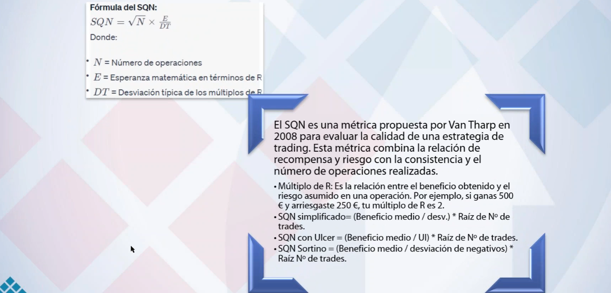

$$
\text{SQN con Ulcer} = \frac{\text{Beneficio medio}}{\text{Ulcer Index}} \times \sqrt{\text{Número de trades}}
$$

En la teoría de base —en los vídeos donde está el *PowerPoint* completo— hay mucho material sobre esto, y muchas de las preguntas que hacéis ya están respondidas ahí.
Cuando vimos el *SQN* o el *UPI*, que deriva del *Ulcer Index*, hablamos bastante sobre volatilidad y sobre *Sharpe*, que es el estándar de la industria.

Si te fijas, el *SQN* con *Ulcer* simplificado se define como el beneficio medio dividido por el *Ulcer Index*, multiplicado por la raíz cuadrada del número de operaciones. Es muy parecido a lo que tú has hecho.
El *SQN* tradicional es el *Sortino* dividido por la desviación de los rendimientos negativos, y en el fondo, todo se reduce a lo mismo: retorno y riesgo. Hay distintas formas de medirlo, pero la esencia es la misma.

El *Ulcer Index* mide exactamente eso que tú propones, y el *Sortino* mide la desviación de las pérdidas. Así que, en realidad, ya tienes las herramientas necesarias. No está nada mal lo que has hecho; es perfectamente correcto.
No veo que ese enfoque favorezca la sobreoptimización. La sobreoptimización suele venir más bien de tener pocos *trades* o de usar una muestra pobre. Pero tu *fitness ratio* en sí no tiene nada de malo: combina retorno y riesgo, y el riesgo también incluye el tiempo que pasas en *drawdown*.

Como te digo, el *Ulcer Index* ya lo mide, y por tanto me parece una elección correcta.
En definitiva, el numerador representa el retorno y el denominador el riesgo. Esa es la idea básica: dividir, no restar. Aunque también existen ratios que restan, como el *Omega Ratio*.

Recordad también la clase en la que vimos el *Sortino* y el *Upside Ratio*, su derivada. Os enseñé la web donde estaban los cálculos y los *papers* asociados. Todos esos estudios son realmente interesantes y amplían mucho la comprensión de estas métricas.


---

## 📘 Estrategias ORB (Opening Range Breakdown)

- [Un alumno aporta este Paper ORB (Opening Range Breakdown)](../Opening_Range_Breakout_ORB_A_Profitable_Day_Trading_Strategy_5_Minutes_SSRN-id4729284.pdf)
- [Resumen Opening Range Breakdown](../Paper%20ORB.pdf)
- [Estrategia ORB básica](../Estrategia%20ORB%20básica.pdf)

Aquí tienes el texto con el léxico mejorado, más claro y fluido, sin perder el tono ni el sentido original:

---

Hay un *paper* que resulta interesante, aunque como ocurre con muchos estudios académicos, le falta un poco de conexión con la práctica. Es decir, está bien, tiene valor, pero le habría venido bien “bajarlo al suelo” y llevarlo un poco más lejos, aplicándolo ya como una estrategia concreta o con ejemplos reales.
Aun así, el *paper* está bien: evalúa correctamente la ventaja y aporta ideas útiles. Si hacéis clic en el enlace, podréis descargarlo; es un trabajo bastante interesante.
De hecho, Alberto ha preparado un pequeño resumen en castellano, que os voy a subir en el material, y también lo publicaremos en Discord.

Nosotros tenemos varias fuentes de referencia. Una de las que más utilizo, como ya he comentado muchas veces, es el libro de Kaufman, muy completo y con prácticamente todo lo necesario.
Además, he intentado hacer varios resúmenes con GPT. En algunos casos el modelo los sintetizó demasiado, así que los he ampliado o reescrito parcialmente para conservar los detalles más relevantes.

Os he preparado tres documentos centrados en *day trading*, todos basados en los libros de Kaufman. Son resúmenes de los capítulos dedicados a sistemas intradiarios, estrategias *ORB* y otros enfoques similares. Ambos libros son muy parecidos, como es lógico, y he tratado de quedarme con lo esencial de cada uno.

En concreto, uno de los esquemas me gusta especialmente; lo he traducido y reescrito entero, porque el resumen automático era demasiado breve y perdía contenido importante.
Los otros dos son más breves, con apenas un capítulo o unas líneas, pero también los incluyo.
Y, como decía, añadiré también la traducción del *paper* que ha preparado Alberto.

Voy a subirlo todo en cuanto tenga un momento. Quizá lo haga durante la pausa, porque si no, no hay manera de avanzar. Pero quedará todo disponible: los tres resúmenes de Kaufman y la traducción del *paper* en castellano.

### Definición de estrategia ORB clásica

Cargo en TradeStation : [PRACTICA_06.EDL](../PRACTICA%2006.ELD)

1. *Curso-ORB Strategy* → es una **estrategia completa** (probablemente la del curso que estás siguiendo sobre la apertura ORB).
2. *TSM 1stHour Breakout Strategy* → otra **estrategia**, también basada en la ruptura de la primera hora.
3. *TSM1stHourBreakout Indicator* → el **indicador** que acompaña a esa estrategia, y que probablemente pinta en el gráfico los niveles de ruptura (líneas de alta y baja de la primera hora).

- [Estrategia ORB clásica](../Estrategia%20ORB%20básica.pdf)

la definición de una estrategia o orb clásica no deja de ser un sistema principio intradiliario vale un sistema de breakout que utiliza el rango principalmente de apertura pero no sólo, se puede hacer con el cierre empezando en el cierre anterior, empezando con empezando con la apertura que es uno típico, o simplemente ignorando el periodo, de acuerdo, ignorando el periodo sino un breakout que tengo uno otro preparado que yo creo que no nos nos dará y seguramente lo haremos el próximo día un breakout que no es open breakout, vale porque uno es revés al final un opening range breakout pues puede ser un volatilidad breakout directo, pero sin centrarse en el opening,  al final un sistema intradiliario es muy parecido a un sistema diario simplemente tiene un par o tres de características que lo hacen especial y dos o tres cositas que suelen ir muy bien en los sistemas interdiarios y que ahora os voy os voy a contar


**Características principales**


- ***en qué *time frame* se va a operar***

La primera decisión esencial en un sistema intradiario es definir en qué *time frame* se va a operar. Esa es siempre la característica básica.
En un sistema diario o semanal no hay debate posible, pero en un sistema intradiario sí: podemos trabajar en 1, 5, 10, 15, 20, 30 o 60 minutos, y ahí es donde comienza la discusión.

Hay operadores que prefieren usar divisiones exactas de hora, para garantizar que todas las velas del día sean iguales. En ese caso, se eligen múltiplos de 30 o de 15 minutos, ya que suelen encajar bien. Sin embargo, en los futuros de Estados Unidos esto no siempre se cumple, porque el mercado no cierra exactamente a una hora redonda (por ejemplo, puede cerrar a las 10:15).
Por eso, si se busca una división precisa, lo lógico es trabajar con velas de 15 o 5 minutos. En cambio, en los mercados europeos, usar intervalos de 30 minutos suele cuadrar perfectamente.

También hay quien prefiere *time frames* que sean divisores exactos de 60, de forma que encajen de manera limpia en la hora.
A mí, personalmente, me gusta utilizar *time frames* poco comunes. No es una decisión crucial —más bien anecdótica—, pero precisamente por eso me gusta salirme de lo estándar.

La razón es que en este tipo de sistemas, al estar basados en pautas de precio y no en noticias, una forma sencilla de *evitar el impacto de las noticias programadas* es no coincidir con los horarios habituales en que se publican: en punto o y media.
Por eso, uso intervalos como 21, 23 o 28 minutos.
Por ejemplo, en la estrategia *Némesis* actualmente operamos en 28 minutos, aunque en el pasado la hemos usado en 21, 60 y hasta 90 y pico minutos.

Reconozco que es una manía personal, pero también una forma de evitar coincidir con muchos otros operadores que usan divisiones convencionales.
Por ejemplo, el S&P 500 (hablo de memoria) tiene alrededor de 450 minutos de negociación regulares al día. Si se quisiese dividir el día completo en partes iguales, se podrían probar varios números que encajen, pero yo prefiero que la última barra quede *casi completa*, sin llegar a serlo.

En definitiva, es una preferencia: usar un *time frame* poco habitual, que probablemente emplea poca gente.
No es algo decisivo, ni mucho menos, pero sí una forma de introducir un pequeño factor diferencial sin alterar la esencia del sistema.


- ***Tendencialidad y reversión*** : 

dos cosas más cosas más que hay que definir en un sistema lo hablaba antes no recuerdo con qué pregunta hablaba de la y lo comentaba luego lo hablaremos en la clase hablando de tendencialidad no tendencialidad cuando hablamos de periodos de más largo plazo normalmente hay más tendencialidad que lógicamente los hay más que otros pero pero es más fácil a medida que bajamos pasa lo contrario ya empieza a predominar más el mean revertir, pero aún así también hay más tendenciales que otros también los hay más tendenciales que otros que suele ser más tendencial de entraría? los bonos pueden ser más tendenciales por ejemplo puede ser un poco más limpios, suelen también hay momentos y momentos pero suele serlo, y en general las acciones son muy poco tendenciales, muy poco, pero también es más tendencial el nasdaq que el dadownjones o es más tendencial el dax que le eurostoxx que eso no hay quien lo mueva 

- ***Volumen, volatilidad y filtros*** 

otra cosa que es más importante en intradía que en diario o que se suele dar más importancia es a la volatilidad y al volumen, que muchas veces son caras de la misma moneda de acuerdo es decir cuando sube el volumen sube la volatilidad cuando sube la volatilidad sube el volumen muy frecuentemente estas dos magnitudes van de la mano de acuerdo muy frecuentemente estas magnitudes dos magnitudes van de la mano de volatilidad y volumen en intradía es suelen ser filtros útiles recordar que en intradía suelo tener muchos trades no me resulta complicado conseguir 2000 3000 5000 trades de acuerdo y por tanto es fácil que tenga margen para filtrar con criterio pero tengo más margen vale porque me es más fácil conseguir significación me es más fácil conseguir representatividad de la muestra, bueno sobre todo lo que me es más fácil es conseguir significación, conseguir representatividad es más fácil en diario de hecho, vale bien entonces volumen y volatilidad uno u otro vale porque si no ya digo suelen ser la misma cosa suelen ser la misma cosa tampoco vamos a machacar ahí poner ahora filtro de volumen filtro de volatilidad y filtro de todo, también es bastante habitual no quiere decir que sea obligatorio contando tips dando tips que se suelen usar más bien en intradía que en el diario

- ***Ventanas temporales***

otra cosa que se suele usar mucho en intradía es ventanas temporales de acuerdo ventanas temporales yo tengo un gráfico de como decía en acciones pues tampoco son tantos minutos pero si yo tengo por ejemplo el nasdaq y lo tengo en horario continuo pues al final tengo como os decía antes pues 1400 minutos o por ahí ,puedo elegir donde los operó no tengo por qué operarlos todos a lo mejor me interesa una ventana concreto,  también en las divisas, se usa mucho también en las divisas se usa se usa mucho operar unas determinadas ventanas, europea por ejemplo eurex que lo tenía por aquí creo preparado ... el dax yo lo puedo abrir aquí por ejemplo yo lo tengo cargado con una sesión que creo que se ure si que va de 8 a 10 de la noche 

pero no sé porque ya lo sabéis un día porque europa siempre ha decidido abrir cuanto más mejor y un día decidió abrir a las dos de la mañana perdón a la una que es una decisión en mi opinión para morir a las marmotas y eso todos los días igual todos los días igual la misma tontería ahí no se mueve nada no se mueve nada 

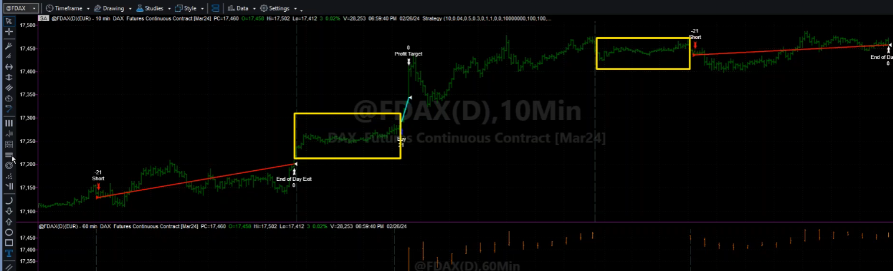

tú eliges donde operar y es frecuente hacerlo frecuente hacerlo vía cambiando la sesión ya por el código del sistema como tú quieras pero tú puedes elegir donde operar en europa lo más habitual es empezar a 8 o 9am no os calentéis en empezar en empezar antes pero también se podría hacer y en eeuu hay gente que lo hace podemos probarlo quiero decir que podría hacer un rango o tú eliges no tú eliges donde operar tú eliges donde operar y es frecuente hacerlo frecuente hacerlo vía cambiando la sesión ya por el código del sistema como tú quieras pero tú puedes elegir donde operar en europa lo más habitual es empezar a 8 o 9 no os calentéis en empezar en empezar antes pero también se podría hacer y en eeuu hay gente que lo hace podemos probarlo o sea con este revelo lo podemos jugar quiero decir, en que tú puedes hacer un rango este que hemos hecho de faufman es parte del rango de la primera hora que es una foto muy típica la primera hora se usa de rango y por cierto yo que eso ya os lo daremos el código que como se ha dicho el original es de kaufman pero hemos desarrollado uno propio pues ya os dejo ahí abierta a aquellos que sepáis programar o que empecéis a hacer pinitos que hagais lo contrario, es decir esto es un open range breakout :


```sh
# TSM 1stHour Breakout : First-Hour Breakout System
#  Copyright 1999-2004, P.J.Kaufman. All rights reserved.
#  (Adapted from M. McNutt, "First Hour Breakout System," Technical Analysis of
#	Stocks & Commodities, July, 1994) 
#
#  SETUP INSTRUCTIONS:
#  1. DATA1 should hold 10-minute bars of a series
#  2. DATA2 should hold 60-minute bars of a series
#  3. DATA3 holds daily data of the same series
#  4. In FORMAT/PROPERTIES do not allow multiple entries in the same direction 

	vars:	Sess1FirstBarDAte(9, data2), Sess1FirstBarHigh(0, data2),
		Sess1FirstBarLow(0, data2), avedayrange(0,data3);
	input: length(10);

	avedayrange = average(high of data3 - low of data3, length) of data3;

	if (time of data2 = Sessionstarttime(0,1) of data2) or
   		(date of data2 > date[1] of data2) then begin
		Sess1FirstBarDate = date of data2;
		Sess1FirstBarHigh = high of data2;
		Sess1FirstBarLow = low of data2;
		end;
	If (Sess1FirstBarDate = Date of data2) and 
   		(time of data2 < Sessionendtime(0,1) of data2) then begin
		if close[1] < Sess1FirstBarHigh then Buy Next Bar  at 
			Sess1FirstBarHigh + 20 point stop;
		if close[1] > Sess1FirstBarLow then Sell Short Next Bar  at
			Sess1FirstBarLow - 20 point stop;
		end;

	if low <= Sess1FirstBarHigh - avedayrange then Buy to Cover Next Bar  at market;
	if high >= Sess1FirstBarLow[1] + avedayrange then Sell Next Bar  at market;
```

<div style="border-left: 4px solid #f39c12; background: #fff8e5; padding: 10px 15px; margin: 10px 0;">
  📈 <strong>Estrategia original</strong><br>
Esta estrategia aplica el concepto clásico de *Opening Range Breakout* (ruptura del rango de apertura) usando tres marcos temporales.

Cada día, en cuanto empieza la sesión, el sistema identifica la **primera barra** y registra su **máximo y mínimo**: ese es el rango inicial de referencia. A partir de ahí, mientras dura la sesión, coloca **órdenes stop** para entrar al mercado solo si el precio demuestra fuerza y rompe ese rango:

* Si el precio supera el máximo de la primera barra, lanza una orden de **compra stop** ligeramente por encima de ese nivel (20 puntos más).
* Si el precio perfora el mínimo de la primera barra, lanza una orden de **venta en corto stop** 20 puntos por debajo.

El tamaño de estas rupturas (20 puntos) actúa como filtro para evitar señales falsas.

Además, el sistema calcula, a partir de datos diarios, el **rango medio de los últimos 10 días**, que usa como referencia para definir salidas.
Una vez dentro del mercado, busca un movimiento equivalente a ese rango medio diario para cerrar la posición:

* Si la operación es corta y el precio cae hasta una distancia igual al rango medio desde el punto de ruptura, cierra la posición en la siguiente barra.
* Si la operación es larga y el precio sube la misma distancia hacia arriba, también cierra la posición en la siguiente barra.

En resumen, la lógica es: *esperar la ruptura del rango de apertura, entrar con confirmación de fuerza, y salir al alcanzar una extensión típica del movimiento diario.*
No usa *stop loss* fijo ni cierre forzado al final del día, por lo que la posición puede mantenerse abierta si no se alcanza el objetivo.

</div>


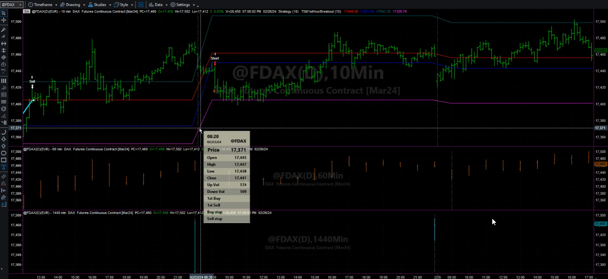

le hemos puesto de 8h a 22h 


los pongo ahí los tres los tres documentitos material para alumnos comentación a ver si me deja para los tres a la vez 2 eba 3 bien seguimos a ver esto que lo tenga bien que he visto que tenía malo la cosa y esto no se ve muy bien aquí de que habíamos el color amarillo que se va un poco mejor estaba con éste y ha tocado un poco las líneas para que las las vieres un poco mejor eso es el dax 12

---

## 🔍 Análisis del sistema ORB en el DAX


También se habla aquí de las *pautas horarias* y de cómo ciertos filtros mejoran los resultados cuando se aplican de forma precisa.
Por ejemplo, uno de los filtros más comunes en estrategias de ruptura es comprobar si existen *pautas previas de congestión*. Este enfoque es muy utilizado, aunque en este sistema concreto aún no lo hemos implementado.

Recordemos que el mercado tiende a moverse en ciclos de *congestión–expansión–congestión–expansión*.
Por tanto, si queremos capturar una fase de expansión, un buen filtro consiste en verificar que el día anterior haya habido contracción.

Una manera sencilla de hacerlo es mediante la detección de una *inside bar* en el gráfico diario.
Una *inside bar* es una vela cuyo rango completo (máximo y mínimo) está contenido dentro del rango de la vela anterior.
Técnicamente, se identifica cuando:

* el máximo de hoy es menor que el máximo del día anterior, y
* el mínimo de hoy es mayor que el mínimo del día anterior.

En cambio, una *outside bar* sería justo lo opuesto: una vela que abarca completamente el rango del día anterior.

---

veamos lo que hace este sistema mira vamos a verlo con este con este corto de aquí vamos a entenderlo y una vez lo entendamos pues ya vamos a ir porque muchas líneas aquí en las líneas que son punteadas las que marcan las señales de entrada lo único que Kaufman tiene  fija una un rango de 20 puntos extra para para entrar es decir es un breakout vale un range breakout que le añade 20 puntos para para entrar entonces este este valor vale está fijado por la primera vela de 60 cuál es la primera vela de 60 esta la naranja 

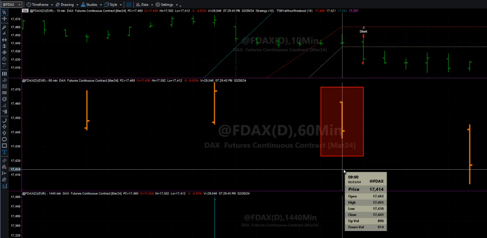

esta vela es la apertura esta vela tiene un rango de máximo de 461 y de mínimo de 436 en principio el sistema así como está ya lo explica el libro en su opción que no deja de ser una muestra decir al final los sistemas prácticamente el 100% de los sistemas queda kauffman son sistemas podemos decir completos el mismo ya el texto te sugiere cosas y tal o sea son poco ideas para que tu explores entonces este es el edge, un mínimo aquí en 436 vale tiene 436 y vais a ver cómo la venta como es menos 20 pues tiene que haber vendido en 416 

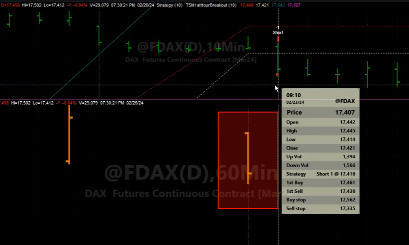

igual no lo veis pero ya lo digo yo short en 416 vale es decir el mínimo que marca en la primera hora menos 20 puntos, esto ya os digo yo igual que os dije que que también lo veréis sistemas de bollinger en ambos lados que lo trabajaremos vale un día, pero cuando hagamos a ver ratio seguramente salimos varios días porque lo haremos en los dos lados del mercado, este también es uno que se puede hacer 

**Exploración inversa y activos adecuados**

entonces os recomiendo que probéis a ver en qué activos seguramente en qué activo irá mejor en un activo más de maen revertir hablábamos antes de incluso les de sp500 activos un poco más pesados, vale más pesados, entonces al contrario, es decir, en muchas ocasiones el rango de la primera hora marca una parte importante de la sesión, no os diría tampoco que entraras directamente a vender a comprar en el mínimo y a vender en el máximo, o incluso en este caso a lo mejor en este caso del dax hablo, a lo mejor cogería el rango desde todo el día que ha hecho toda la noche hasta las 8, 9, le puedes dar un poco más de margen y a partir de ahí sí que compra en el mínimo de ese rango, es decir lo contrario que estamos haciendo ahora, no no operar la ruptura sino operar la reversión, lógicamente con SP y ya está, y ya veréis que varios activos estos va a ir bien contrariamente a lo que estamos haciendo, lo contrario, pero eso a veces lo que os digo siempre explorar las ideas al revés de lo que lo que os dice, vale ser valientes en sentido explorar las ideas al revés porque muchas veces el revés van bien también, en algunos casos, y este es uno de ellos es uno de ellos donde la pauta de reversión de la primera hora a mejor extendiéndola un poco en el premarket pero suele suele ver bien, suele ver bien vale,


**Descripción del sistema actual**

En este momento estamos trabajando con una estrategia de *Breakout*, concretamente un *Opening Range Breakout* definido por el rango de la primera hora de sesión.

Este planteamiento podría haberse implementado de varias formas, pero Kaufman lo desarrolla así por una razón concreta: él utiliza una **regla de salida basada en el rango diario**, y en nuestro código hemos dejado la opción de activarla o no.

Kaufman trabaja con un *time frame* de 10 minutos porque busca una operativa más dinámica, sin esperar una hora entre decisiones.
Primero fija el rango de referencia en el gráfico horario, y una vez termina la primera vela de una hora, empieza a operar sobre velas de 10 minutos.
En su ejemplo, cuando a las 9:00 se completa la primera vela, el precio rompe el rango y entra corto a las 9:10.
En ese caso concreto la operación no resulta especialmente favorable.

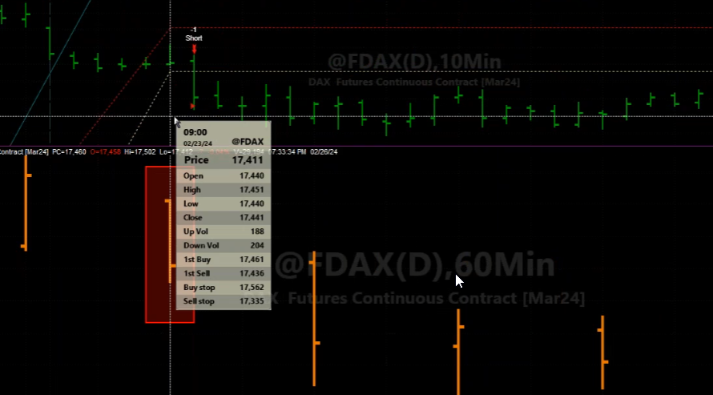

Se observa que la sesión queda rápidamente lateral, sin tendencia clara, y su sistema no cierra posiciones al final del día, por lo que la operación se mantiene abierta.

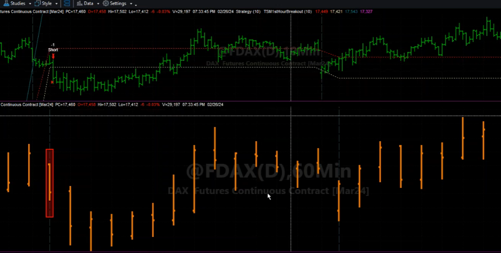

En nuestro código, sin embargo, **sí hemos incorporado el cierre de posición al final de la sesión** (*SetExitOnClose*).

El sistema original de Kaufman fue publicado en la revista *Technical Analysis of Stocks & Commodities* en julio de 1994, dentro de un artículo de M. McNutt titulado *First Hour Breakout System*.
Kaufman lo adaptó posteriormente en su libro *Trading Systems and Methods*, bajo la etiqueta *TSM 1stHour Breakout*, cuyas siglas “TSM” identifican todos los ejemplos derivados del libro.

```sh
# TSM 1stHour Breakout : First-Hour Breakout System
#  Copyright 1999-2004, P.J.Kaufman. All rights reserved.
#  (Adapted from M. McNutt, "First Hour Breakout System," 
#  Technical Analysis of Stocks & Commodities, July, 1994)
```

En esencia, el sistema ejecuta una **compra stop** cuando el precio cierra por encima del máximo de la primera hora más un pequeño filtro (20 puntos), o una **venta stop** cuando el precio cierra por debajo del mínimo menos ese mismo filtro.
El filtro de 20 puntos está definido de forma fija, lo que en realidad es poco práctico: hay activos para los que 20 puntos son muchos y otros para los que son pocos.
No recuerdo con certeza en qué activo se probó originalmente (quizá Alberto sí), pero el *workspace* original debería estar guardado.

En la práctica, lo habitual es **convertir ese filtro en un parámetro de entrada (input)** y expresarlo **en porcentaje**, no en puntos fijos.
De ese modo la escala se adapta al valor del activo —por ejemplo, no es lo mismo un DAX a 14 000 puntos que uno a 5 000— y el sistema mantiene proporción.

Así era la versión original de Kaufman, pero en nuestra implementación actual hemos hecho que el sistema escale correctamente.

**En cuanto a la salida**:    
Kaufman utiliza una medida del *Average Daily Range* (ADR), calculada a partir de *data3*.
Como se ve en el código, obtiene la media de la diferencia entre el máximo y el mínimo de las últimas *n* sesiones (`high - low`, con `length = 10` en este caso).
Ese valor representa el rango medio diario del activo.

A partir de ahí, el sistema usa ese rango como una referencia para determinar **niveles de toma de beneficio (Take Profit)**, más que como un mecanismo de cierre técnico o de stop loss.

Concretamente:

* Si la estrategia está **corta**, cierra la posición cuando el precio cae hasta una distancia equivalente al *Average Daily Range* por debajo del *high* de la primera hora:
  `if low <= Sess1FirstBarHigh - avedayrange then Buy to Cover Next Bar at market;`
* Si está **larga**, cierra cuando el precio sube esa misma distancia por encima del *low* de la primera hora:
  `if high >= Sess1FirstBarLow + avedayrange then Sell Next Bar at market;`

En otras palabras, **no se trata de un stop loss dinámico**, sino de una salida tipo *take profit* basada en la amplitud media de los movimientos diarios.
Durante la sesión, el sistema no contempla una salida contraria ni un cierre forzado: si no alcanza el objetivo, la posición permanece abierta.

En algunos casos, al recalcular los rangos al día siguiente, el sistema puede incluso abrir una posición en el sentido opuesto, lo que da lugar a operaciones consecutivas que van “a la contra”.

El propio Kaufman reconoce en el texto original que esta gestión de salida no es la más recomendable, ya que carece de stop de protección o de cierre al final del día.
Por eso, en implementaciones más modernas (como la nuestra) se suelen incluir opciones adicionales:

* *SetExitOnClose* para cerrar al final de la sesión,
* un *stop loss* fijo o porcentual,
* y una opción para escalar el rango de salida en función de la volatilidad real del activo.

En resumen, la versión original de Kaufman usa el *Average Daily Range* únicamente como un **objetivo de beneficio**, sin control de riesgo explícito dentro del día, lo que hace que su sistema sea más una aproximación conceptual que una estrategia completa lista para operar.

Aqui entra en ruptura y al final hace TP, la salida es un TP calcula del maximo le resta un valor del rango y lo aleja es mas bien un TP. La entrada es esta linea punteada menos 20 puntos y la salida  la linea rosa o la contraria que es azul.

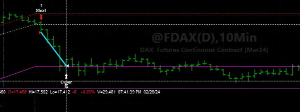


**Elección del tipo de operativa intradía**  

si queremos una entraría puro me refiero al salir o no fin de día lo normal es salir a fin de día vale pero es verdad que no es obligatorio entra un poco lo que os decía antes de que tengo yo y que quiero. al principio este tipo de sistemas son los muy operados empezamos con uno la otra vez más de largo plazo y ahora empezamos uno con más de intraría

este tipo de sistemas por aplastante mayoría es el primero que elegiría es la mayoría de vosotros para empezar a operar tipo de este por qué porque y cerrando fin de día y con sp etc porque porque al final te permite te permite tener seguramente de drawdowns un poco más bajos bueno el dax quizá no pero pero bueno no podemos operar en un futuro un poquito más pequeño en un activo que no se mueva tanto, pero a el minidax el micro pero realmente son sistemas que son más manejables y que normalmente conseguiremos drawdowns más bajos y por lo tanto poderlos operar con una cuenta más pequeña porque requeriremos menos garantías para operarlos, en cambio un sistema que va gráfico diario semanal pues es más complicado por lo tanto la primera elección de un sistema es probable que sea un intradiario de acuerdo por qué? primero porque tenemos la sensación de poder controlar el riesgo mejor y después porque es verdad es verdad que al no asumir el riesgo gub si yo quiero cerrar a fin de día pues voy a poder controlar mejor ese riesgo 


### Implementación de cambios y nuevas configuraciones

**[TSM 1stHour Breakout : Straegy](../PRACTICA%2006.ELD)**

<div style="border-left: 4px solid #3498db; background: #eaf4ff; padding: 15px 20px; margin: 15px 0; border-radius: 6px;">

**1) Visión general**

<ul>
<li><em>Original (Kaufman)</em>: ORB de primera hora con entradas stop ±20 puntos y salida tipo TP basada en ADR (media de high–low diarios). Sin stops explícitos ni cierre al final del día.</li>
<li><em>Código 1 (nuestro)</em>: mantiene la lógica ORB, pero añade escalado por porcentaje, gestión monetaria, límites operativos, filtros y salidas configurables (incluida la salida original opcional).</li>
</ul>

<hr>

**2) Parámetros e inputs**

<ul>
<li><em>Original</em>: un único parámetro <code>length</code> para el cálculo del ADR.</li>
<li><em>Nuestro</em>:</li>
<ul>
<li><code>Porcentaje_Confirmacion_Entrada</code>: confirma la ruptura en porcentaje (escala con el activo).</li>
<li><code>Prc_Stop</code>, <code>Prc_Profit</code>: stop loss y profit target en %. Actúan solo si &gt; 0.</li>
<li><code>salidaOriginal</code>: activa/desactiva la salida ADR clásica.</li>
<li><code>numerodeCierres</code>: cierra al fin de sesión tras n días (0 = desactivado).</li>
<li><code>tradesMaximos</code>: tope de operaciones por día.</li>
<li>Filtros: <code>FiltroBasico</code>, <code>FiltrovolRelativo</code>.</li>
<li>Gestión monetaria: <code>Start_Equity</code>, <code>MMVar_*</code>, <code>Min/Max_Size</code>, <code>RoundTo</code>.</li>
</ul>
</ul>

<p><em>Motivo</em>: pasar de una plantilla académica a un sistema operable, robusto y testeable en distintos activos.</p>

<hr>

**3) Escalado de niveles de entrada**

<ul>
<li><em>Original</em>: offset fijo de 20 puntos sobre el máximo/mínimo de la primera hora.</li>
<li><em>Nuestro</em>: offset por porcentaje sobre el nivel ORB (<code>Sess1FirstBarHigh/Low * (1 ± %)</code>).</li>
</ul>

<p><em>Motivo</em>: 20 puntos no son comparables entre activos/regímenes; el % mantiene proporcionalidad y evita sobre/disparo en precios altos/bajos.</p>

<hr>

**4) Lógica de entrada**

<ul>
<li><em>Ambos</em>: ORB sobre la primera barra horaria; entradas solo durante la sesión.</li>
<li><em>Nuestro extra</em>: respeto de <code>tradesMaximos</code> y <code>MarketPosition = 0</code> para evitar reentradas compulsivas.</li>
</ul>

<p><em>Motivo</em>: control de sobretrading y coherencia con reglas de no duplicar señal.</p>

<hr>

**5) Salidas**

<ul>
<li><em>Original</em>:
<ul>
<li>Corta: cubre si <code>low &lt;= Sess1FirstBarHigh - avedayrange</code>.</li>
<li>Larga: vende si <code>high &gt;= Sess1FirstBarLow + avedayrange</code>.</li>
<li>Efecto práctico: TP basado en ADR; no hay stop ni cierre forzoso.</li>
</ul>
</li>
<li><em>Nuestro</em>:
<ul>
<li>Opción de mantener la salida ADR clásica (<code>salidaOriginal = 1</code>).</li>
<li>Añade <em>stop loss</em> y <em>profit target</em> en % (no trailing).</li>
<li><code>SetExitOnClose</code> condicional vía <code>numerodeCierres</code> para evitar pernoctas no deseadas.</li>
</ul>
</li>
</ul>

<p><em>Motivo</em>: introducir control de riesgo explícito y gobernanza del tiempo en mercado.</p>

<hr>

**6) Gestión monetaria y tamaño de posición**

<ul>
<li><em>Original</em>: tamaño implícito (sin gestión monetaria).</li>
<li><em>Nuestro</em>: cálculo de contratos en función de equity inicial, beneficios acumulados y precio, con límites y redondeo.</li>
</ul>

<p><em>Motivo</em>: simular una operativa realista con sizing estable y acotado.</p>

<hr>

**7) Filtros operativos**

<ul>
<li><em>Original</em>: ninguno.</li>
<li><em>Nuestro</em>:
<ul>
<li><em>Básico</em> (precio &gt; 5, volumen medio diario &gt; 1M, ATR diario &gt; 0.50).</li>
<li><em>Volumen relativo</em> de la primera barra vs su media.</li>
</ul>
</li>
</ul>

<p><em>Motivo</em>: mejorar la calidad de señales; evitar microcaps ilíquidas y sesiones sin “combustible”.</p>

<hr>

**8) Contabilidad de trades intradía**

<ul>
<li><em>Original</em>: permite múltiples señales dentro de sesión.</li>
<li><em>Nuestro</em>: contador diario y límite <code>tradesMaximos</code>.</li>
</ul>

<p><em>Motivo</em>: disciplina, control del coste de transacción y del <em>chop</em>.</p>

<hr>

**9) Métrica de rango**

<ul>
<li><em>Original</em>: ADR = media simple de <code>high - low</code> diario sobre <code>length</code>.</li>
<li><em>Nuestro</em>: ADR sustituido por <code>AvgTrueRange(Per_Media)</code> de <em>data3</em> (más realista al incorporar gaps).</li>
</ul>

<p><em>Motivo</em>: usar ATR como proxy de rango más robusto.</p>

<hr>

**10) Seguridad de cierre**

<ul>
<li><em>Original</em>: no cierra a fin de día; podría pernoctar.</li>
<li><em>Nuestro</em>: cierre por conteo de días (<code>numerodeCierres</code>) y, opcionalmente, <em>SetExitOnClose</em>.</li>
</ul>

<p><em>Motivo</em>: evitar riesgo overnight si la hipótesis es intradía.</p>

<hr>

**Por qué se implementó así**

<ol>
<li><em>Escalabilidad y generalización</em>: porcentajes y ATR permiten portar la lógica entre activos/sesiones.</li>
<li><em>Control de riesgo</em>: stops y cierres temporales reducen colas de pérdida.</li>
<li><em>Calidad de señal</em>: filtros de precio/volumen/volumen relativo.</li>
<li><em>Gobernanza operativa</em>: límites de trades y MM evitan sobreexposición.</li>
<li><em>Reproducibilidad</em>: inputs tipo “switch” activan/desactivan módulos sin reescribir código.</li>
</ol>

<hr>


</div>


### Incorporación de un paper y filtros adicionales

y luego hemos metido al ver este paper que habéis aportado pues hemos decidido probarlo de acuerdo hemos decidido probarlo en el dax no tiene mucho sentido pero pero si en acciones si nos da tiempo lo veremos un momentito 

el paper tenía unos filtros simplemente hemos aportado los filtros no hemos hecho el sistema al uso, hay muchas versiones de este más y yo he probado esta que es la mega básica la mega estándar hay muchas más y ya os digo que veremos más cosas más cosas veremos evolucionar este veremos otros completamente distintos pero bueno que este como habéis puesto ya el paper yo quería partir de este de Kauffman porque me interesa mucho introducir este concepto de open break out que es el original podemos decir no el habéis oído uno orb es esto de acuerdo rb clásico como todo permite un montón de variaciones que hemos visto el porcentaje de sp por un taje de profit podía ser por la tr la entrada podía ser exigirle un movimiento de volatilidad en intradías también se me ha olvidado comentaros una cosa antes es verdad que lo habitual lo habitual en intradía es sistemas que operan mucho que operan mucho y que por lo tanto tienen mucha significación estadística pero también hay algunos intradía que no os lo recomiendo como primera opción pero que sí que como complemento de una cartera pueden venir muy bien vale **sistemas de muy poca actuación**

---

### Sistemas de poca frecuencia y pautas de velas

digamos son sistemas de muy poca frecuencia operativa es decir que buscan sucesos de elevadísima probabilidad de % de acierto muy elevado creo que se ocurre en poco que ocurre en poco pero que tienen % de acierto muy muy alto aún así cuidado hay que validarlo y todo como siempre pero ahí estamos a lo mejor de un número de trades tipo diario sabes tipo sistema diario aunque tienes un montón de barras y analizadas realmente operan una vez al mes o sabes decir cosas que o mirando analizando el gráfico intradía pero que pasa muy pocas veces pautas de velas que os decía este tipo de pautas que os decía hay varios veremos alguna veremos alguna ahora mismo no me acuerdo que lo diga porque ahora mismo no me acuerdo sé que habíamos visto alguno en el pasado nos dos ahora mismo no operamos ninguno de este tipo pero es probable que lo sí que los hay, son normalmente figuras ya os digo de bautas de velas, cuando me refiero de velas quiero decir de precio, como os decía un inside bar pues de dobles y triples y muchos de volatilidad, es decir de recuerdo tenía uno que era de volatilidad pero de rango bestial es decir era un poco parecido a esto que habéis visto ahora de más cero más un filtro, era un filtro enorme, vale era un filtro enorme, que pero que tenían % de acento más grandes y cuando el mercado tiene desviaciones de más de x x desviaciones en la media casi siempre casi lógicamente quiere decir que no siempre casi siempre marca un movimiento,  cuando desvía de desvía de la volatilidad un cierto número normalmente indica el inicio de un movimiento y esto es una pauta de las más sólidas que existe lo que pasa que como os digo tiene una frecuencia operativa relativamente baja tiene una frecuencia operativa relativamente bajo , por eso van bien en una cartera como complemento porque diversifican pero como operativa principal pues es un sistema que entre que tiene poca significación estadística y que tampoco de media va a dar mucho dinero porque opera poco al cual el final se llama que opera poco pues lógicamente pues se puede dar menos menos dinero


### Filtros implementados en el paper

**Filtro básico**

Entonces, como os comentaba, el *paper* original incluía dos filtros principales, y el primero de ellos era el llamado **filtro básico**:

```sh
# Filtro básico usado en el estudio
#	valor superior a $5, volumen medio negociado mayor a 1.000.000 acciones y ATR > $0.50
#
if filtrobasico = 1 then 
Begin
	Condition1 = (Close > 5) and (Average(Volume, 14) of Data3 > 1000000) and (AvgTrueRange(14) of Data3 > 0.50); 
end else Condition1 = True;  
```

Este filtro servía simplemente para **acotar el universo de acciones**, descartando las de baja capitalización o con escaso volumen de negociación.
En la práctica, lo que hacía era eliminar los llamados *penny stocks* o valores “chicharro”, con poco movimiento y baja liquidez, que suelen distorsionar los resultados en este tipo de estudios.

El motivo de aplicar este filtro es claro: las **figuras técnicas y los patrones de ruptura** tienden a comportarse de forma más predecible en **acciones líquidas y con cierto tamaño**, donde el comportamiento del precio es más estable y menos manipulado.
En cambio, en los activos de baja capitalización y bajo volumen ocurre lo contrario: su escasa liquidez provoca que, cuando entra volumen, se generen **movimientos extremadamente violentos**.

Por eso, aunque hay operadores que se especializan precisamente en ese tipo de activos —buscando explotar esas explosiones de volatilidad—, el enfoque del *paper* es el opuesto: **evitar esas acciones** para centrarse en un universo más regular y representativo.

Respecto a los valores de corte elegidos (precio > 5 USD, volumen medio > 1 millón, ATR > 0.5), probablemente responden a una **optimización empírica** realizada por los autores.
No son valores mágicos, sino umbrales razonables que eliminan las acciones de menor calidad operativa sin dejar fuera las que realmente aportan fiabilidad estadística.


**Filtro de Volumen Relativo**

```sh
# Filtro volumen Relativo
#	- Se opera si el valor del volumen de la primera barra es mayor que el volumen medio de las últimas 14	
#
if FiltrovolRelativo = 1 then 
begin 
	Condition2 = sessionFirstVolume > average(SessionFirstVolume, 14); 
end else Condition2 = True; 
```

Este filtro ya no actúa sobre el universo de acciones como el básico, sino que se aplica directamente a la **operativa diaria**.
Su función es identificar si la primera hora de negociación presenta un **volumen significativamente superior al promedio reciente**, lo cual suele interpretarse como una señal de interés institucional o de impulso inicial.

En este caso, la variable `sessionFirstVolume` corresponde al **volumen de la primera barra de 60 minutos (data2)** —la misma en la que registramos el máximo, el mínimo y la fecha de la sesión—.
Ese valor se compara con la **media de los volúmenes de las 14 sesiones anteriores**, lo que equivale a medir si el volumen actual está por encima del promedio de las últimas dos semanas.

La lógica es sencilla:

* Si el volumen de la primera hora es mayor que la media de los 14 días previos → *permite operar*.
* Si no supera esa media → *descarta la señal*.

Este filtro tiene más sentido en **acciones que en futuros**, ya que en el mercado accionario el volumen refleja principalmente la actividad compradora (el dinero que entra o sale del activo), mientras que en los futuros el volumen es **simétrico**: cada compra tiene una venta asociada.

Por eso, en futuros el volumen no siempre indica dirección o fuerza en el mismo modo que en acciones. Allí, a menudo se recurre al *open interest* como métrica complementaria, ya que muestra cuántas posiciones permanecen abiertas al cierre del día, reflejando mejor la presión acumulada.

Perfecto.
La diferencia clave está en **qué representa el volumen** en cada mercado y **cómo se interpreta su desequilibrio**:

---


<div style="border-left: 4px solid #f39c12; background: #fff8e5; padding: 10px 15px; margin: 10px 0;">
  📈 <strong></strong><br>

En **futuros**

* Cada compra tiene una venta: **el volumen es simétrico**.
  Por sí solo no indica quién domina (compradores o vendedores).
* Por eso usas **delta de volumen** (agresivos a mercado vs pasivos en límite).
  → El *delta* te muestra la **intención y agresividad**: si el volumen comprador es dominante, hay absorción o desequilibrio real.
* En resumen: el volumen en futuros **mide participación**, pero necesitas el **delta** o el **order flow** para saber dirección.

---

En **small caps / micro caps**

* El volumen **no es simétrico**: no todo el mundo puede vender corto.
  → Cuando aparece un pico de volumen, casi siempre implica **entrada de dinero fresco** (compradores netos).
* En entornos planos y de baja liquidez, una sola inyección de volumen puede mover el precio bruscamente (efecto *pump and dump*).
* Aquí el volumen sí puede interpretarse directamente como **fuerza direccional**: más volumen = más desequilibrio estructural (compras sin contrapartida).

---

* En **futuros**, el volumen necesita contexto (*delta, footprint, imbalance*) → mide flujo relativo.
* En **small caps**, el volumen **es el propio catalizador** → mide flujo absoluto.

Por eso, un *pump and dump trader* busca **rupturas de volumen inusuales** (spike) como señal de oportunidad, mientras que un operador de futuros necesita **ver quién empuja el precio** dentro de ese volumen.
</div>


**Configuración y optimización del sistema**  
bueno pues nada más el sistema en sí es lo mismo a nivel de entrada, con esa característica, que os fijáis que el rango de apertura de ocho a nueve es esta vela que acaba a las nueve una vela pequeñita 


esto aquí también podría haberse hecho algún filtro de este tipo es decir que si esta vela no es de un cierto rango puedes no entrar se podría hacer algo así pero esto no necesariamente es malo recordar lo que os decía el range breakout no al final de cuando el mercado está colapsado y de hecho aquí lo hace vez el mercado está con poca volatilidad y colapsa colapsa pero lo hace a la baja lo hace la baja  

entonces aquí de momento lo tenemos configurado con cero con la salida original en cero con solo cerrando a fin de día con un trade por día vamos a dejarle tres por día sin filtro básico en el filtro relativo gestion monetaria de momento no estamos dándole muchas vueltas, 100% de la cuenta el dinero disponible, y ya está 

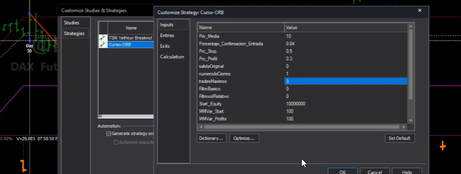

como veis acaba saliendo por ST loss y así hemos hecho pequeñas pruebas no iba para alguna versión que hemos hecho no había ido mal  en el dax el todo 

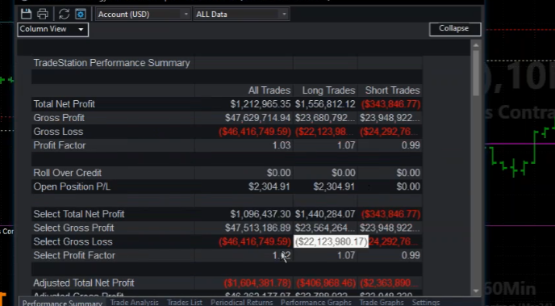  

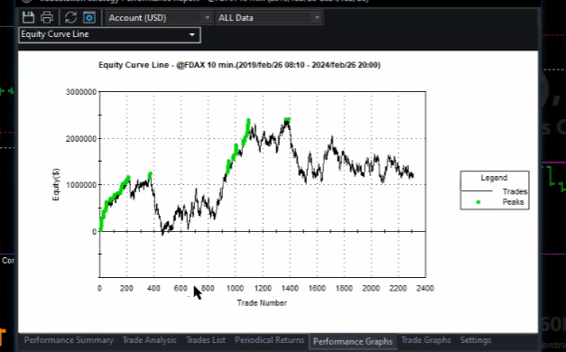  


pero no en esta que está puesta aquí creo que va bastante bastante flojo pero bueno sí que seguramente se podría extraer algo se podría extraer algo de esta de esta idea aunque seguramente dándole un poco más de margen a la entrada y seguramente a lo mejor ajustándolo más bien por volatilidad seguramente hay que ajustarlo por volatilidad

**Salidas por tiempo y ventanas operativas**

y también aunque esta vez no lo hemos implementado puede ser recomendable salir por tiempo 

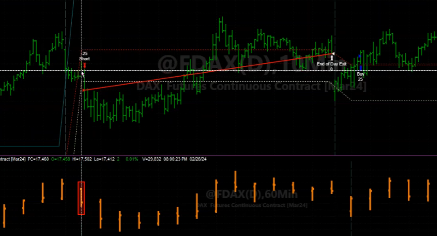  

suele ir muy bien esta salida también ya como se comentaba y luego habría que en este caso la salida por tiempo iría un poco ligado con lo que os decía antes de la ventana operativa vale el dax si si metemos aquí el volumen veréis que tiene una pauta estudiar estudiar el volumen es muy interesante vale no sólo por el tema de que haya liquidez o no de acuerdo es por lo que os decía de esta relación absolutamente clara entre el volumen y la volatilidad de acuerdo entonces una manera indirecta de usar esto es meter volumen meter una media por defecto sale de 50 

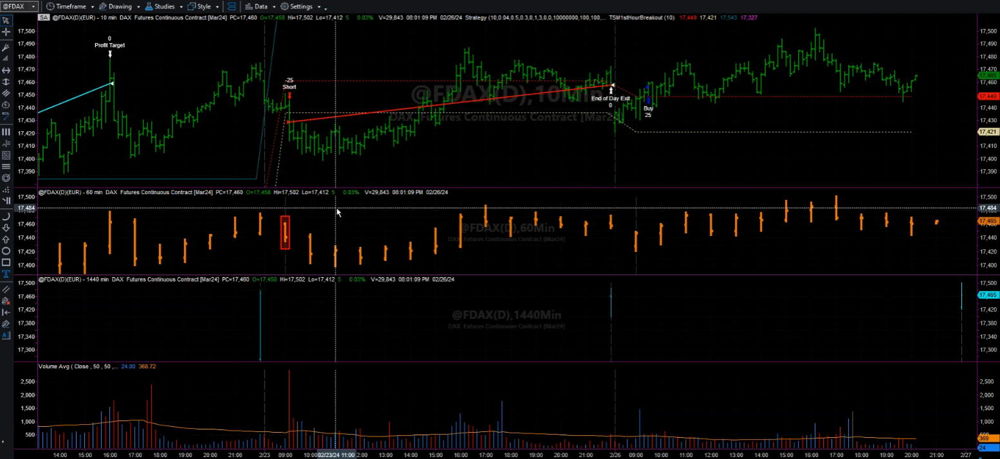  

pues bueno pues usar esa y ver un poquito cómo va cómo va evolucionando el volumen, el dax normalmente en europa el volumen va es bastante estable 

otro camino otro camino que sería no lo he probado pero alguien nuevamente igual que os decía antes de probar esto también os os recomiendo probar el que os digo ahora que es hacer range breakout igual cargar todo el histórico hablando del dax en este caso y definirlo igual pero incorporando también los datos de esta una de la mañana a ocho de la mañana es decir como si todo esto fuera la barra de apertura ,de acuerdo, muchos operadores en eeuu hacen esto, es decir hacen el open range breakout incluyendo el premarket, de acuerdo, incluyendo el premarket

**Variaciones del rango y horarios alternativos**

tengo dudas de si desde la una a la mejor incorporar también la 7 o la 6 o incorporar o hacerlo de 8 a 9 y dejar hasta las 10 entendéis es decir o abrir a las 9 meterlo de 9 a 10 es decir todas estas combinaciones son válidas porque? porque el volumen realmente habría que ver si este volumen que es es ruido absoluto . yo podría al mejor usar también este rango es decir que en vez de fijar solo la primera vela está vale además estuviera contando desde este mínimo 

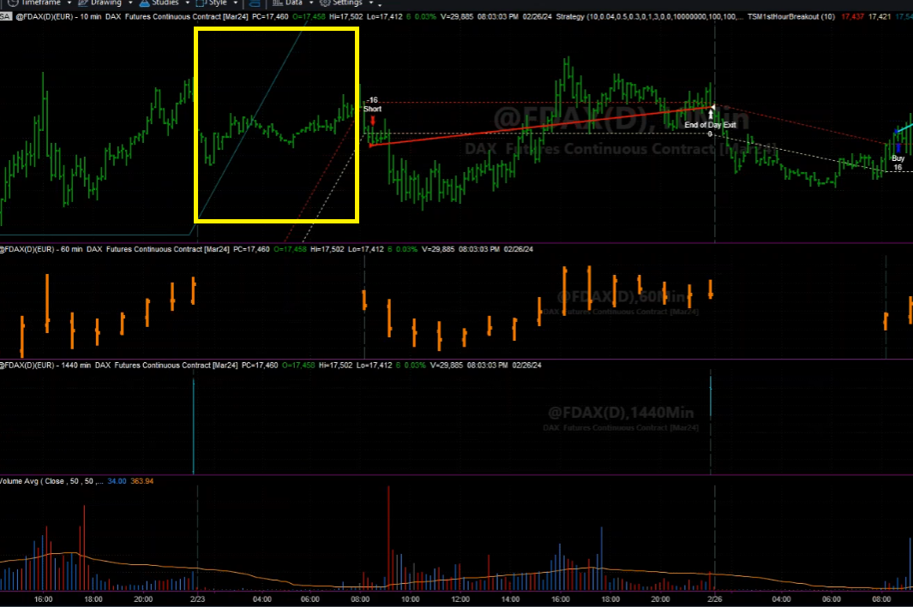 

para que entendáis no es que este día tenga nada especial sino para que tendáis contar este mínimo y el máximo que haya hecho el range break out sería en este caso este vale ese sería aquí se hubiera puesto corto bastante más tarde lo cual peor vale

02:13

**Relación entre volumen, volatilidad y horario**
bien y lo que os decía del volumen es que evidentemente está de 1 a 2 que es muy importante estudiar como decía volumen y volatilidad que van de la misma mano y horario que no va no es de la misma cara pero tiene bastante que ver con esto para analizar en qué ventanas yo no me interesa es decir hay dos maneras a filtrar vale el filtro que siempre se usa más y más intuitivo es filtrar las entradas de acuerdo es filtrar las entradas es decir yo voy a maximizar mis probabilidades no voy a haber ventajas más buenas como hago eso pues decir bueno pues antes hablaba no decir pues voy a operar solo cuando haya una volatilidad determinada de acuerdo voy a operar solo cuando haya un volumen determinado vale o voy a operar solo cuando la estructura de precios no lo que no cuando haya solo una situación que me hable de un mercado en congestión porque yo busco expansión y sé que normalmente tras una congestión ver una expansión entonces cuando vea que haya un poco a volatilidad o cuando vea que haya una insight para lo que os decía antes no con el diario respecto al anterior cosas así no puedo buscar operativas de este tipo para filtrar entradas cuando hablo de filtrar salidas que hago bueno pues donde si yo considero que hay momentos donde el mercado se mueve poco pues yo puedo salirme de acuerdo puedo ya salirme porque considero que si el mercado no ha ido a mi favor en ese caso no normal es que ya no vaya tendéis ese sería un poco la idea

**Ventanas operativas del DAX y ejemplos prácticos**
esto donde es el dax por el dax no es claro porque el dax tiene como dos ventanas tiene tres ventanas operativas de europa europa tiene una apertura bastante movida vale tiene una apertura con mucho movimiento que a veces dura hasta las 10 a veces dura solo unos minutos pero normalmente es esa ese rango que va hasta las 10 o por ahí suele haber bastante movimiento a ver si veo una sesión típica bueno esto es bastante típico a nivel de pauta de volumen vale veis a las 8 puede ya haber un incremento de volumen que aquí parece que no es tanto pero es bastante se queda anulado por el por el el de las nueve que es el grande porque es el grande porque entra el contado vale

**Relación entre contado, volumen y volatilidad**
una guía que te suele ir muy bien también es esto vale en la relación con el contado en eeuu pasa igual cuando no está el contado pues no porque al final estos son subyacentes y cuando no está el contado no está nuestra jefe de acuerdo no está el que manda y entonces al final cuando hay más movimiento siempre es coincidencia con el contado cuando es esto en europa es de 9 a 5 y media acuerdo en eeuu desde 3 y media a 10 por eso hasta ese media entra un volumen absolutamente de locos en los futuros americanos porque entra el contado entra apple entra google entra todo y ahí entra todo el volumen y es donde de verdad se mueve normalmente cuando hay noticias dos y media se mueve mucho pero realmente de esa últimos 15 minutos media hora del mercado está bastante ya tranquilo

**Operativa por ventanas temporales**
bueno 1 o 2 minutos antes ya a veces se empieza a agitar pero empieza a y media y se dispara bueno pues aquí pasa un poquito igual este es un día que voy a acercar para que veas muy muy paradigmático no en el sentido que viene el mercado muerto desde la una bueno se levanta un poquito pero está todo el rato ahí plano no no hay volumen no hay volumen abajo vale plan plan plan plan llega a las 8 fijaros que el volumen empieza a saltar pero el precio no precio poco el volumen ya y ves 8 y 10 fijaros la primera vez las 7 50 estamos hablando ahí de 197 contratos y ha empezado a moverse realmente 7 8 es proporcional a las 8 8 y 5 8 de suele haber un pico porque porque porque ahí se abren los bonos vale y también abre londres vale entonces ahí solemos tener ese ese el bono el bono inglés entonces ahí hay una referencia importante las divisas se animan más entonces a las 8 y veces que ya se anima un poco pero realmente es a las 9 donde entra entre la talla y hay veces que a las 10 se ha acabado la sesión es así de triste es que a las 10 se ha acabado el mercado ya está adiós

**Breakout temprano y cierre anticipado**
y hay operadores que hacen eso operadores que operan un range breakout pero muy justo más cerrado que esto no buscar a lo mejor la hora sino ir en un minuto en 2 en 5 minutos y a las 10 se acaba la sesión operan de 8 a 10 si hay movimiento bien si no hay movimiento hasta mañana en el dax no quieren ya porque porque es muy habitual que de 10 hasta las noticias el mercado esté plano y con poco volumen decreciente que no es que tampoco bueno pero fíjate o sea aquí te mete saberás que en eeuu también baja pero no así de acuerdo luego viene la hora de las noticias que cuando hay noticias ya se anima y lógicamente viene vuelos y lo levanta y lo levanta y ahí empieza otra sesión hasta las 5 que muere 5 5 y media a veces 5 45 muere completamente va hasta las 10 con el mercado americano

**Cierre del mercado y estrategias por sesión**
pero no ser que el mercado americano tire mucho que lógicamente lo sigue el mercado también se queda muerto desde que tampoco suele rentar hasta el final en este tipo de estrategias tú vas en swing esto es otra historia pero tú buscar a este tipo de estrategias entraría buscas probabilidad buscas cierto buscas movimiento breakout volatilidad entonces este ejemplo que pisa aquí es el típico operativa buena de breakout a pillo y para casa y por lo tanto muchas veces puede tener sentido salir porque no porque el precio ha ido mi contra porque haya hecho te peoró imaginaros un día que no he hecho te peoró y ya está ya es que ya está vendido 10 no sé 11 pues fuera a las 11 me salvo esté como esté y hasta mañana o si el cierro esa puedo tener pero yo lo evaluaría con otro sistema

**Estrategias por ventanas horarias (caso Gere)**
esto lo explicó un gere en el año que ganó ganado varios que se presentó al campeonato del mundo que la primera vez que lo ganó creo que fue lo ganó operando sólo el euro dólar pero con sistemas en ventanas distintas es esto que os estoy diciendo exactamente es decir un sistema preparado que va de 8 a 10 otro que va de 10 a 12 otro que va de 12 a 2 porque porque las divisas tienen pautas temporales muy establecidas por cierto me acabo de acabar creo que esa más rugat apúntamelo alberto por favor que le debo el forex estrés y me lo pidió me acabo de acordar ahora me acabo de acordar aurel y quiero que eras tú perdóname me acabo de acordar pues en ese te voy a enviar te voy a enviar lo original que tiene tres station que es muy antiguo pero pero ahí hay unos indicadores que sirve para medir el tiempo espero que funcione porque son muy antiguos y y está está para analizar esto las pautas horarias y tal entonces ahí ya te digo ahí hay muchas estrategias que usan esto porque porque a lo mejor en unas horas opera breakout en otras es más tendencial al lateral y entonces operar reversión me explico entonces si tú sabes que estadísticamente lógicamente no va a ser cada día hay activos que normalmente los tirones el mínimo del día esto lo veremos también no sigo como la teoría diciendo lo veremos pero es que es verdad cuando veamos todo esto como has comentado

**Análisis de horarios y patrones**
antes de distintas pautas veremos varios códigos de este tipo y hay uno que hice un artículo hace tiempo que lo explicaba hace años que esto es un código que lo la primera vez que lo vi luego lo he visto en otros pero fue en el libro de cauman que era analizar a qué horas por ejemplo un activo hace máximos 12 mínimos o cosas así no o los gaps medios de los de los de los activos es decir sin temas son códigos que sacan información a texto para que luego la puedas trabajar y ver por ejemplo que cuántos gaps se cierran cuántos tal a partir de que o sea todo esto información que sacas del histórico de acuerdo entonces esto te permite analizar esto que os digo pues yo sé que me lo invento que el dax cada vez que el gap es de 0 5 lo cierra el 70 por ciento si es un 70 por ciento es un sistema buenísimo entiendes pues bueno pues yo cuando abre con un 0 5 compro me entiendes es menos inventado el 0 5 no que nada lo tome que ya lo miraremos de bien que no me acuerdo como era pero me entendéis o sé que hay activos que el 70 por ciento de sus máximos diarios son a las dos entre dos y dos y media bueno pues yo sé que entre dos y dos y medio si hay un pivo me pongo corto entendéis entonces este tipo de cosas pues este tipo de ventanas va muy bien y por eso os digo que ni entraría es muy habitual usar ventanas

**Estrategias según ventanas horarias**
entonces aquí por ejemplo en este en este caso pues a lo mejor podríamos trabajar esto vale yo hago un open range breakout puedo mirar de filtrar las entradas bien vale y las salidas a lo mejor las filtro de esta manera yo a partir de cierta hora que ya no me renta porque porque yo sé que la mayoría de máximos o mínimos del dac son antes de las dos que luego ya así que a última hora tiene uno muchos otra vez también bueno pues un caso luego a de 8 a 10 a mejor me otro otro sistema y sabes porque si yo sé que ahora mismo no tendría que mirar bien pero era que sí que yo sé que entre las cinco y media 45 ahí suele marcar un mínimo máximo que normalmente me sirve de rango entonces yo ahí ya automáticamente dejo eso como máxima la sesión y si lo vuelvo a visitar vendo ahí yo vendo yo de 6 a 10 de la noche o pero un un mil reversión comprando y vendiendo a lo mejor vendo compro cinco veces en cinco minutos un día el rango va me saco pues nada mejor diez puntos pero oye son de mucha probabilidad porque sé que eso pasa casi siempre por ejemplo no y pues ya digo en las sesiones hay muchas pautas estacionales de acuerdo es decir hay comportamientos bastante recurrentes y analizarlos mediante código y demás es muy interesante

**Patrones estacionales y su uso en estrategias**
que como digo ya lo haremos durante algún día estos y nos permitirá sacar estrategias sacar información para montar estrategias que son sencillas que no dejan de ser breakouts que no dejan de ser mil reversión cosas así pero que están basadas en simplemente el comportamiento natural que tiene el activo en una sesión también las materias primas se da mucho también las materias primas se da mucho las materias primas también se dan a nivel mensual que tienen que ver con la cosecha el gasolio de calefacción pues seré pautas que dependen del ciclo del calor del frío de determinados países final hemisferios al final hay el petróleo pues también inventarios etcétera no hay muchos factores que lógicamente no hay nada que hay funciones siempre pero al final buscamos poner probabilidades a nuestro a nuestro favor no

**Preparación de optimización y control de procesos**
bien entonces aquí teníamos este sencillos estimeta que ahora mismo no sé cómo lo tenía cuánto histórico tengo cargado espérate voy a cargar esto como estaba y mientras vamos a ver el de acciones voy a dejar aquí una optimización puesta 10 minutitos breve que me va a hacer el trabajo creo aunque no sé me da un poco de miedo estoy pensando casi que no lo voy a hacer hemos guardado alguna al final pero tú creo que no no así guardado una yo creo no no me acuerdo espérate que lo miro hemos guardado de acciones no sé si es que se me ha colgado el hecho una aquí que estaba guapa que la he analizado pero se me ha colgado porque cuando se cuelga cuando abres multichars antes de abrir abierto 3d son a veces el access se cuelga porque multichar se alimenta de 3d son de datos entonces depende como cuáles abres antes a veces lo se instabiliza 3d entonces se me ha colgado y no lo he podido guardar entonces pues nada no no no tengo guardados de multichar de lo de acciones pero de no no no no no no apuntado bueno es igual ya lo ya lo ya lo miraremos pero era era era parecida es que ésta era una de ellas a que está puesta era una de ellas

**Ajuste de recursos y optimización en Multicharts**
las maneras ahora he guardado espérate si si he hecho esa todo lo que pasa es que me da miedo meter el procesador porque el multichar no puede regular aquí no puedo me da miedo meter el procesador al 100% estando en directo tienes no pero montar ese son no aquí pero me vas a rediciar a tienes razón lo puedo trucar pues mira lo voy a hacer va vamos a hacerlo lo voy a hacer lo voy a hacer lo voy a hacer y a ver si le pongo la mitad no a ver compatibility no autoconfigure no a ti que un fútbol de tampoco me te vete a no justo que no me ha acordado aquí a ver 8 para el modo todo ocho y ya está bien todo ocho y si yo me he dicho que yo voy a gusto usted se va a esperar ahora lo creo es que lo que me da miedo es que no quedamos atrás no tengo que cerrar multichar no tengo que cerrar este el guardo no sé el mundo lo tengo que cerrar porque si no lo no me lo va a abrir y además de hecho me voy a asegurar que se ha cerrado todo es ahí lo tienes pero tienes ahí lo tienes abierto y no abierto no me nada abierto no bueno sabe por por todo el trato espérate espérate lo va a insultar ya no guardó aquí lo va a insultar ya tenía por favor traer abierto con lo cual era eso que lo que lo tenía abierto vale pues no está a ver si ahora se cierra bien

**Proceso de optimización y control de CPU**
se ha cerrado sacado sacado sacado sacado pues no estaba colgado estaba estaba de paula irá vamos a ver que no se vea la contraseña que tendría que matarlos a todos, no es plan ahora, ahora va a abrir un poco más lento pero lo normal es que no me bloquee el equipo al optimizar, pues creo que no, ¿por? No, sí, ahora ya lo había guardado, ¿a qué te refieres? No, no, esto ya estaba, esto ya estaba, esto ya estaba, sí, sí, esto ya estaba, claro, esto ya estaba, que bueno, lo voy a mirar pero yo creo que ya está, esto está, Eurex, todo bien, todo bien, todo bien, de hecho igual ahora, igual ahora, mira, no, digo, a ver si está la optimización al abrir, no, no, no, no había, no había, no había, además tengo activo el otro, tengo activo el otro, vale, ahora le vamos a dar un poco, candela, vamos a dar candela, aquí nada, estoy pensando que le podíamos dejar de TP su salida, tío, vamos a probar, mira, me gusta esa propiedad, va, venga, pues a mí sí, vamos, esta como era, como la hemos hecho antes, bueno, la que tengo aquí, no, bueno, hemos hecho de darle un poco más, eh, por probar, a ver, voy a hacer genética, pues yo sí, le voy a dejar solo el stop, que tanto no hace falta, que es locura, esta la dejo en cero y le activo su salida y ya está, que se optimizo menos, de tres le voy a dejar tres, va, cierra a fin de día, sin filtros, venga, vámonos, tres mil, va, esto nada, esto en genética, lo dejo todo por defecto, venga, a ver, a ver, me interesa ver cómo va el procesador, venga, aguanta, pues será cinco años supongo, no, pero si son 50, esto en cuanto empiece, lo que le va a costar es cargar los datos, luego empiezan a un misil, bueno, no lo sé, lo que pasa es que le he bajado mucho, pero está a 30 procesadores, aguantando bien, nada, nada, ahí va, 50% procesador, nada, nada, nada, sobrado, sobrado, le podría haber dado más, venga, aguanta ahí, aguanta ahí, 56, ahí 70%, 70% procesador, bueno, pues aguanta ahí, aguanta ahí, mientras no sature mucho, 40%, aguantará, yo creo que aguantaría, porque el go to meeting este es un cohete, sí, ha acabado los narices, para la primera, gemito, tira, tira, no, lo que pasa es que ya sabes que va acelerando, eso es policial, ahora nada, en un minuto, mira, dice que un minuto va a tardar segundos, ahí está, ahí va, 90% era CPU, venga, pero bueno, aguanta bien

**Resultados de la optimización y métricas**
aguanta bien, mientras no se quede 100% bloqueada, y la NVIDIA al 23, podía usar más la NVIDIA, coño, no la NVIDIA, sino la tarjeta NVIDIA, esta NVIDIA no está de cuanto debe valer y alberto, podíamos hacer un trade con las tarjetas gráficas, porque esto, lo que está subiendo NVIDIA igual nos pagan bien y todo, ahí está, venga, nada, todo bien, se ha salvado el directo y todo bien, ahora tenemos aquí el informito, datos bajos de TSI, antes eran más altos, ah, por el TPE, va mucho mejor con el TPE directo suyo, pero bueno, respetar un poco al autor, hombre, respetar al autor, bueno, aquí parece que equilibra un poco, ¿no? equilibra un poco entre todos, aquí lo que buscamos siempre es equilibro, esto lo hacemos en el Excel, pero aquí de mancha pusera buscamos poco equilibrio entre los tres, ves, TSI, que estén altos todos, vale, entonces, el que menos probabilidad entre los tres sería Expectancy, pero entre PPC y TSI, pues un poquito de equilibrio, ahí estaría un poquito más, más o menos el equilibrio, ves, es el mejor TSI, tercero mejor de PPC y bien colocado también en Expectancy, sería esto un poco, 3000 trades, bien, y con 0.10 y 0.01 de entrada, es decir, casi nada, casi nada, casi quiere, será el 0, eh, porque con 0.01 es 0, porque el 0 no lo veo, si lo he usado, si, a ver, aquí el gráfico, mira, por el porcentaje de confirmación es totalmente errático, no tiene ninguna, ninguna dependencia, lo ves ahí, aquí ordena, aquí ahora yo tengo ordenado por Expectancy, ordeno por PPC, que es bastante parecido a Profit, perdón, y ahora, por ejemplo, si yo marco esta columna, aquí los que tienen Session, al hacer el gráfico, estoy viendo por ordenado, abajo, por retorno, y aquí el número de valores de la variable que le he puesto, este es el mapa que tiene Session, que es lo que os decía, igual, igual ya podía poner uno en 3D, ¿no? también, igual podía, calla, que hace un poco que no lo pruebo, ahora resulta que selecciono dos variables y se queda conmigo, eh, ahora verás tú, bueno, te ponen las dos rayas, si, si, esto ya lo sabía, pero digo, ahora verás, me hace un mapa en 3D y me callo, me tengo que comer, pues espérate, eh, que tiene aquí el grafiquito, espérate, porque lo pruebo, así, los cojones, no te imaginas, hace esto en 3D, de hecho, eso es 3D, si os fijáis, pasa que, pues, yo creo que puede mejorar, yo creo que puede mejorar, sí, sí, entonces, por presentaje, ya has visto que no hay, y este, este, que es el, el stop, pues aquí sí que se nota un sesgo para arriba, ¿no? en un poco para arriba, bueno, pues nada, este es un poco, una optimización sencilla

**Análisis de resultados y out-sample**
dándole tres entradas, iba mejor con una antes, eh, mira, ves, aquí he entrado, ya he vuelto a salir, ¿no? esto, nada, esto es muy flojo, esto es muy flojo, 109, tiene comisiones, eh, es flojito, flojito, además, el outchample está completamente roto, eh, no, no, está, no le he mirado los robundes que él lo tiene puesto, eh, está negativo el robundes, tiene robundes muy bajos, tiene estos muy altos, pero con pocos, con pocos traits, pero vamos a hacer una cosa, ahora me quedo con ésta, vamos a exportar ésta, solo el, bueno, no, es igual, mira, me voy a guardar la imagen, yo solo quiero ver una cosa rápida, no me tengo, es nadie, ahora, pero no la veía, la ventana, ¿dónde está la ventana? ahora como tal, tampoco le voy a hacer lo mismo, pero al revés, ¿sabes? le voy a hacer la misma por el otro lado, quiero ver a ver si la muestra está muy sesgada, que aquí no hemos, no hemos analizado la muestra, habría que haber analizado un poquito la muestra y ver qué tal

**Descarga y análisis de papers Open Range Breakout**
eh, 30-0, le dejamos el 30 por delante para ver, pero esto antes lo hemos hecho porque, porque ya digo, queríamos ver un poco el sistema, ya el próximo día lo trabajamos, podemos decir como Dios manda, ¿vale? hoy, hoy era responder preguntas, plantear el sistema, que lo vierais, lo atendierais y empezar a hablar de las entradías, daros los tres documentos, por cierto, recordar que tenéis también más papers, que ya no los he leído, pero entiendo que sean correctos, aquí en el bar había una circulación de papers aquí, cuando iba a la universidad, en el bar circulaban otras cosas, pero aquí se han circulado papers en el bar, con los papers y un vídeo de youtube, tú lo sabes, que he preguntado, no lo he visto, eh, Aureli, lo tengo que ver, no sé qué, me haces un vídeo de Víctor, sé que lo he abierto antes, ya lo sé, pues ahora luego lo miro, a ver qué me has dejado, aquí hay otros papers a mirar y bueno, pues a ver, a ver qué, qué tal salen de, qué tal salen de ahí

**Evaluación de commodities y próximos pasos**
eh, tenía, eh, tenía que mirar, me voy a dejar aquí abierto, también quería ver, a ver qué teníamos en esto con commodities, pero miro, o sea había alguna cosita nueva de, de ORB, pero el próximo día lo, lo miro, bien, solo me han salido 15, bueno, pues, bueno, por ORB 15, a ver, esto está por fecha, venga, he acabado, entonces, como veis, es una maravilla, es la suscripción, mira, ahí tienes, era un minuto, eh, voy a decir que no hay ideas, venga, que analizarlo esto y verlo, a ver qué es, ahí tenéis, un articulito de ORB, en un segundín, mirad todos los que me han salido, cuando es esto, ahí parece que hay una serie ahí, ¿no?, tres de ahí, mira, veis, esto es lo que os he decido, de las pautas de velas, esto es muy, muy habitual, claro, sí, se encuentran cositas

**Documentación de Toby Crabel y Open Range Breakout**
esto ya os lo dije, yo os recomiendo mucho, eh, esto creo que era una serie, me suena, que hubo, ahí está, veis, sí, sí, sí, esto, pues mira, tenemos seis, pues mira, este lo, bajaré esta serie, eh, la pasaré por CGPT, a ver si me hacer unos resúmenes, y os la paso, porque no os puedo, como comprenderéis, no os puedo pasar al original, porque no, no está permitido, entonces ya lo enseño aquí, que no sé si puedo realmente, pero pasaros no puedo, porque, porque lógicamente no está, no está permitido, entonces, eh, podía caer un pequeño puro, que entenderéis que no, no es plan, pero bueno, oye, yo hago un documento mío, ¿no?, he hecho que le va a hacer con CGPT, pero no es verdad, eh, lo que iba era hacerlo yo, eh, y editarlo y crearlo yo, entonces, una cosa creada por mí, creada por mí, la puedo perfectamente compartir, ¿vale? eso es lo que, lo que voy a hacer, utilizando esta documentación, yo voy a crear un artículo propio, que luego os pasaré, ¿vale?

**Análisis final de resultados y conclusiones**
pero esto es interesante, ¿vale?, esto ya ha acabado, vamos a verlo, a ver, a ver lo de arriba que me ha salido, antes hemos elegido 0010, a ver dónde está este ahora, es este, el que hemos elegido antes es este, pero sigue dando mal, mal rebundes, eh, sigue colocando bien en old data, porque lógicamente el old data es el mismo, pero sigue dando rebundes, rebundes bajos, aunque han mejorado los rebundes en general, en general han mejorado, y este mismo, este mismo ha mejorado mucho, claro, antes era negativo, ahora es algo positivo, ¿me estáis hablando a mí?, no, no, bueno, veremos un poquito, como os decía, el próximo, el próximo día, ese es el que nos, lo voy a dejar guardado con este, para tener una referencia, pero sí que parece lo que, lo que decía Alberto, mira, déjame, que me voy a, me voy a quedar, porque antes le había puesto solo uno, ahora le voy a dejar que haga, mira, vamos a hacer otra cosa, porque como esto, como eso solo quiero una, una referencia ahora,


le voy a dejar a esto, esto ya veo que no hace falta tan alto, así que lo bajamos, esto del stock también lo quiere súper bajo, pero me acabo de dar cuenta que no tengo el lift activado, y esto puede hacer un problema con el stock, porque va a tardar un poco más, pero me da igual, va a tardar un poco más, pero me da igual, 001, esto no hace falta tanto, hemos quedado, 025, esto tampoco hace falta tanto, 2, aquí vamos igual, no, lo voy a dejar en 3, lo voy a dejar en 3, porque igual ahora con el lift me doy cuenta que resulta que no valía eso, y le vamos a poner, salir original en 0, cierre a fin de día, y esto lo voy a dejar que os siga entre 1 y 5, ahora le voy a dejar al final, a ver qué tal, le voy a decir que termine en 10, cuando haga 10 consecutivas, que no mejore, que pare, me da igual el valor, quiero encontrar una zona, esto lo hacemos mucho en las optimizaciones de búsqueda, las iniciales, siempre ponemos esta variable en 3, cuando en 10 generaciones no mejora, cuando hace días seguidas donde el mejor no cambia, entonces para, porque no hace falta llegar al final, a mí no me interesa encontrar una zona donde vaya bien, y justamente de esa manera ya me vale, estoy haciendo búsquedas podemos decir de zonas y demás

**Descarga de papers adicionales y cierre de la sesión**
incluso si a veces se pueden aparecer zonas mejores, mientras voy a ir bajando estos pdfs, de toda esta serie de open reach breakout ya si ya lo tengo, playing the open reach breakout part 1, hostia toby cravel tío, toby cravel es un grande del open reach breakout, hostia toby cravel es un grande del open reach breakout, es un auténtico especialista, pues muy buena esta serie que os voy a hacer, si si si toby cravel, de hecho el libro de kauffman, ahora no recuerdo si este, pero tiene sistema de cravel, me lo voy a llamar cravel, está muy bien esta, mira que bien, voy a bajar toda esta serie de cravel, ah no, no estáis viendo, muy bien, si es que de verdad, open reach breakout parte 1, si ya lo he bajado, si, este es el que acaba de bajar, parte 1, de príncipe lo contrase al expansio, esto es o no, no pone el número 2, yo creo que sí, es de cravel también, vamos bajándolo todo, a ver hay que bajar, este es el 8, el 7, parte 8, joder que salto me ha dado esto, está como desordenado no, hay parte 1, aquí parte 1, no, parte 1 ya lo he hecho no, joder, si si parte 1 ya lo he hecho, mira me he empezado por arriba porque eso es un lío maco eh, si si toby cravel, no se tío, no se tío, es eso, bueno pues tras este ejercicio de normalidad tan anormal, valga ver un poco de...

**Reflexión final y próximos temas (BAR y C-BAR)**
parece que va a tardar mucho pero ya veréis como acabará en cualquier momento, yo voy bajando aquí todos los open reach breakout que está esto un poco desordenado, no está fácil, parte 6, la emisión está comenzando, como 05, no, 05 no, si, lo he puesto que pare en 10, Alberto, lo he puesto que pare en 10, cuando 10, cuando no mejore en 10 para entonces, para que llegue a 50 como mucho para ahora, normal es que 50 o así pare, si no oye nos quedamos aquí hasta las 12, 1 de la mañana y no pasa nada tampoco, pero total, por miles de débiles, todavía aguantan todos ahí eh, están atentos, bueno vamos a ir a 05, aquí todos ahí hasta el final aguantando, a ver cómo acaba esto, como se tire alguien del barco, yo voy detrás como el capitán aquel del barco, Ejercicio de normalidad tan anormal, sí, el concordia, con palabras, aunque algo, el espagueti, como se llamaba, escudentini, escadecidi era, no, escachenco era algo de escano, esquetino, ves, ves, era algo de espagueti, ya me salía bien, escatino era, era escaketo era, el escaketo era, no era el escaketo, era el escaqueco, este ya lo he bajado, este ya lo he bajado, este ya lo he bajado, pues no sé si están todos, eso es un poco raro eh, 8, pero 8 ya lo tengo, es el 7-7, este también lo he bajado, este también lo he bajado, por encima habéis visto, pero ahora vamos a profundizar en el bar, en otro video ya hablaremos más profundamente del bar y del C-Bar, este es el mismo que os he enseñado ahora, veremos el bar y demás, para aquellos más avespados, parece que ya estaba calculado, pero bueno, no he hablado mucho de él, porque quería hacer, bueno, pues tras este ejercicio de normalidad tan anormal, pero bueno, ya está, ya está, ya está, ya está, ya está, ya está, ya está, ya está, ya está, ya está, ya está, ya está, ya está, ya está, ya está, ya está.


### Introducción al BAR y C-BAR

**Contexto y continuación del análisis**
por encima habéis visto, pero ahora vamos a profundizar en el bar, luego en otro video ya hablaremos más profundamente del bar y del C-Bar, en el mismo Excel que os he enseñado ahora veremos, veremos el bar y demás, para aquellos más avespados por ahí, me parece que ya estaba calculado, No he hablado mucho de él porque quería hacer un vídeo específico y antes quería explicaros qué es el bar, para aquellos que no hayáis oído nunca hablar de esta medición de riesgo, el bar es value at risk, de acuerdo a sus cifras, valor en riesgo, es una medida estadística, distintos algoritmos de morning management que hay, no os voy a explicar todos aquí en las prácticas si alguien tiene por si a por alguno, he usado muchos más, es un tema sobre el que es un poco donde se acaba de hacer la unión de distinto y esto es un poco donde se acaba de hacer la unión de distinto.

**Revisión de artículos y papers relacionados**
Yo aquí voy repasando todos los artículos de estos con commodities que hablan de la versión, que es una alternativa, un paper guapo, o que podría usarse en otros, en el final lo acabáis de ver calculado para el S&P con un porcentaje de capital, vamos a, ahi lo tienes, bravo, justo acababa de decir que no para, espera que tengo aquí un paper abierto, sell short, hombre, el word de Pevli, tenemos un articulito de Pevli aquí en stockcommodities, short entry, vamos a guardarlos aquí también, intraday breakout strategy, perfecto, perfecto, pues nos viene bien, bajando, bajando también, todo eso he bajado ahí, bueno lo he llamado Krabbel porque parecían de Krabbel todos, pero no, y ese es el último que me falta por mirar ya, ah, estos son cartas que pide la gente, bueno tampoco vamos a bajar las cartas precision code, fashion art by the graphs, pues muy bien, ya está, pues nada, hemos bajado todo, a ver si todos los de Krabbel son buenos, montaremos un paper guapo ahí para ver que hemos visto ahora aquí

**Análisis de resultados con LIFT y rebalanceo**
ahora con el lift la cosa ha empeorado, ha ido a filtros más altos, es lo que me temía, y todo negativo, has visto el auto sample, todo negativo, quería que vea cierto riesgo de ajuste, veo cierto riesgo de ajuste aquí, se ha ido ya a otro sitio ahora, bueno lo voy a dejar guardado con uno de estos, porque el que había antes seguramente estaba afectado por el lift, ese era el problema, bueno así vamos a ver cuál equilibra, vamos a ver cuál equilibra en algo, no veo mucho equilibro aquí en ningún sitio yo, no sé por qué, ah bueno, está cogiendolo, el que más es 980, 980, aquí no, aquí parece, ah bueno, por expectancia no equilibra en ninguno, por expectancia no equilibra en ninguno, se hunde mucho el expectancia, pues nada, lo vamos a dejar aquí, queremos saber qué tal, habría que hacerla así con el lift por el otro lado, ya digo, este era un poco para que lo vieras un poco funcionar y sin más, no queríamos tampoco, pero así ya te digo, no, no está saliendo nada, no es como de grada al final, que ver puede ser circunstancial, eso es lo que siempre hay que mirarlo, pero estamos de acuerdo que la entrada no es una buena señal, entonces hay que tomarse, tomar nuestras precauciones, 05, no, 05 no, así que nada más, lo vamos a dejar por hoy aquí

**Cierre de la clase y planificación próxima**
proceso la clase ahora cuando acabo, yo os he dejado ahí los tres documentitos, la emisión está comenzando, miraremos de traducir todo esto que he encontrado en esto con commodities que ya tenía pensado mirarlo, mirarlo hoy y ver a ver qué nos da, porque esa es mi idea, siempre la otra vez me lo miré, a ver qué nos puede ir dando, que nos podemos ir sacando y también poder daros un poquito de material, nada más nos vemos el viernes, el lunes que viene, si, el lunes que viene nos vemos, quedaran dos días para que cumpla 51 años, y por lo tanto el lunes que viene tomo clase, no sé si tomo el otro, pero el que viene el cuatro tenemos clase, acabaremos este y espero poder acabar este, poder hacer alguna versión de, no sé si este exactamente porque la entrada está muy limitada, pero sí que trataremos, trataremos de que este sea algo aprovechable y en todo caso presentaremos algún range breakout mientras diga aprovechable, de acuerdo, es decir, si no es este porque este es el final, hemos desarrollado la de la primera hora, que así como está hay activos donde funciona cien por cien, pero no necesita activos muy tendenciales y es lo que digo el DAX, bueno ya lo estáis viendo aquí, es lo que os decía, esta pauta tiene movimiento y es complicado todo un día de movimiento, claro que encontraremos alguno, pero es muy complicado, el DAX tiene a morirse pasada la, mira ese es un día fantástico y fijaros aquí y se acabó, 12, y sí que luego sigue tirando, pues seguramente era un día que Wall Street subió lo que no estaba escrito y al final lo va siguiendo, pero es raro tener una tendencia muy limpia, es muy tendiente a erratizar en esas horas post 11, 12 hasta que no llegan las noticias y ahí las noticias ya sabéis que es la locura, entonces es un activo típico para operarlo de entrada y luego es un caso mejor tratar de montar algo con las noticias, aprovechar ahí y subirse las noticias, montar un range breakout en las noticias para seguir hasta la hora de apretar Wall Street y ahí salirse, adiós, adiós muy buenas a las 5 y media, es quizá lo que yo probaría, primera hora, 10 y luego quizá la hora de las noticias un poco antes mirar buscar una rotura y fuera, seguimos el próximo día, buen año el 73, muy buena cosecha, de marzo el 73, hasta el lunes que viene, chao.


