***1.Podrías dar alguna referencia en cuanto a umbrales mínimos y máximos de variaciones de combinaciones posibles para una optimización?***

voy a intentar incidir en cuando cuando lo lo hagamos en un sistema en concreto pero no es fácil dar una referencia una referencia o sea sí que hay una referencia por ejemplo una referencia que solemos que hay bastante consenso en la industria y podemos decir que el sistema debe aceptar una variación del orden de al menos un 10% de los parámetros vale eso se puede ser una referencia es decir de sus parámetros deben poderse mover un 10% y no destrozarse el sistema vale no esto de los sistemas sería por una pequeña referencia que puedo que puedo darte  pero es que no es posible dar una referencia global porque es que no claro o sea primero que todos los parámetros son muy distintos y es depende por eso trataremos de ver sistemas de todo tipo y os animo a en cada caso por ir preguntando para ir cogiendo ese punto de experiencia que es la práctica que te lo da no entonces es complicado complicado porque ya digo varía mucho pero bueno sí que ese rango que te digo de un 10% de variación en los inputs deberían de aceptar vale deberían de aceptar, recordar que lo comentamos en la teoría y lo voy a decir en la práctica no todos los inputs son iguales los hay más delicados que otros depende mucho del tipo de sistema y en un sistema por ejemplo como estamos ahora con esto es revé intradiario donde podemos sacar trades como churros aquí siempre hay más margen de maniobra siempre más margen de maniobra en el sentido de que puedes darle un poco forzar un poco más a nivel de optimizar y demás vale porque y abrir más los parámetros lo que sí que recomiendo bastante prudencia siempre es los incrementos de acuerdo los incrementos no pasaros de la rosca y es buena práctica mirar, por ejemplo los dos aros los tuvimos otra vez revisar, si alguien estuvo el jueves en el directo comenté que el viernes teníamos agujero para revisar apolo y está esta revisión, y de hecho, estuve pensando si si si no no lógicamente todo, pero si puede enseñar algo respecto respecto a ese proceso, y seguramente lo haremos, lo lo tengo que preparar un poco cuando ya lo acabemos, pero pero creo que es un buen ejercicio explicarlo explicar un poco lo sucedido tal y al final que hemos hecho de acuerdo, creo que eso es un buen ejercicio práctico vale un buen ejercicio práctico entonces no para esta pero pero sí que lo creo que lo lo explicaré lo explicaré, porque creo que es muy bueno para para que aprendáis un poquito la vida real del operativa

***2.Cuando tenemos un sistema que ha pasado la evaluación preliminar y queremos ver qué salidas son las más óptimas, tanto de SL como de TP, se deben de ir probando "a mano" varias o hay alguna forma sistemática o un consenso sobre cuáles van mejor según qué tipo de estrategia sean, por ejemplo para sistemas intradías mean reversion funcionan mejor el SL “%” y como TP “end of the day”, o para un sistema en D tendencial long only SL “señal contraria” y tp “por días o tp %”. Es decir como tener una referencia de al menos por cuáles empezar a probar o cuales directamente descartar para agilizar el proceso.***

Bueno, en esto lo que te puedo decir, Juan Manuel, es que —ya sé que me puedes responder “sentido común”—, al final la teoría, cuando hablamos de estos temas, insistía precisamente en eso. Y es verdad, es la realidad. Es cierto que el sentido común, con la experiencia y la práctica, se va educando o adaptando; la experiencia hace que aparezca de manera más clara, o con más criterio, podríamos decir. Pero sí, es así.

Tengo la sensación de que he hablado bastante de esto en la teoría, aunque entiendo que son muchas horas y que no siempre se puede estar igual de atento, ni tú al escucharlo ni yo al explicarlo. Estoy seguro de que si ahora volviera a ver todos los vídeos, diría cosas distintas, me daría cuenta de matices que no destaqué o pensaría: “aquí esto lo habría explicado mejor”. Al final, aunque tengas un guion, hay detalles que van surgiendo de manera natural y que son diferentes.

De todos modos, creo que este tema lo tratamos bastante. Por ejemplo, cuando comentamos la primera estrategia que hicimos de ruptura en acciones. Un sistema tendencial puro, por ejemplo, no debería tener *take profit* (TP). Pero es verdad que eso hace que el sistema se degrade mucho con el tiempo. Por lo tanto, hay que analizarlo bien.

¿Y qué hay que ver exactamente? Lo que siempre os he comentado: ¿qué tengo yo en mi cartera? ¿Es ese mi único sistema o tengo varios sistemas? Si es mi único sistema, probablemente sea mejor que tenga TP, porque eso le va a mejorar los ratios, reducirá el *drawdown*, y en general lo hará más estable.

En definitiva, todo depende. Esa es la realidad: todo depende del contexto y de la función que cumple ese sistema dentro de la cartera.

Ahora bien, un tendencial puro debe dejar correr las operaciones, porque el ratio de acierto lo dice todo. Cuando tienes un sistema con un ratio de aciertos muy alto —imagínate un 70 %—, eso suele corresponder a un sistema de tipo *mean reversion*. Ese tipo de sistema normalmente funciona con *stops* muy alejados o incluso inexistentes. ¿Se entiende? O con *stops* puramente catastróficos, de emergencia, que saltan muy pocas veces.

*Apolo*, por ejemplo, está en un término medio: no llega a ese extremo, a su *stop* le cuesta saltar, pero acaba saltando. Hay casos peores, claro, pero ese es un ejemplo equilibrado.

En cambio, en un sistema *mean reversion* puro lo normal es tener un TP más cercano y un *stop* más alejado. Casi siempre ese tipo de sistemas llevan TP.

En cuanto al tipo de *stops*, te diría que la primera opción para mí siempre es ajustarlos por **volatilidad**. Siempre. Los *stops* basados en volatilidad son, en mi opinión, los más coherentes, porque se adaptan a las condiciones reales del mercado. Yo ya os hablé un poco de todas las opciones, pero si repasas lo que hemos ido diciendo, verás que esto estaba bastante implícito: al final, tienes que adaptarte a los movimientos del mercado, y la volatilidad te permite precisamente eso.


**Stops por volatilidad, debate porcentual vs valor absoluto**

Donde sí que hay cierta controversia, en mi opinión de manera un tanto sorprendente, pero la hay, es en el uso de stops porcentuales o en valor absoluto. Hay bastantes autores que defienden usar el valor absoluto. Esto ya demuestra que no es *sota, caballo y rey*, que no hay una única manera correcta de hacerlo.

¿Por qué? Porque es verdad que cuando haces estudios, optimizaciones y demás, muchas veces consigues mejores resultados con el valor monetario que con el porcentual. Esto es cierto.

Ahora bien, para mí este es el tema importante. Cuando hacéis estudios —y, mira, justamente esta semana, o mejor dicho este mes, estaba revisando uno— quería mostraros esto porque realmente me parecía muy interesante. Creo que estos debates, aunque no sean formales, aportan muchísimo valor.

El bueno de **Andrea Unger**, que no es precisamente un cualquiera sino alguien con mucho prestigio y bastante conocido, escribió un artículo sobre este tema. Ya os lo comenté: hoy tenemos material, y todo lo que tratamos de conseguir lo preparamos y lo trabajamos para daros documentos útiles. Hoy tengo algunos que os daré luego, aunque ese en concreto no lo tenía preparado. Pero bueno, os lo muestro aquí.

Hacía un debate sobre esto: si el stop debía ser *fixed* o *porcentaje*. Y él mismo comenta que, aunque le sorprende, ha obtenido mejores resultados en ***valor absoluto*** que en ***porcentaje***. Lógicamente, solo es una opción más, no es una panacea. Ambos sistemas pueden funcionar si el sistema es bueno, puede ir bien.

El problema, para mí, es que ahí caen en un error, y lo tengo muy claro. Caen en un error porque, seguramente, es más fácil ajustar los datos en valor absoluto que en porcentaje, por distintos motivos. Pero yo no tengo nada claro que eso garantice que en el futuro siga siendo así.

Lo que no he visto nunca es a alguien —por ejemplo, el propio Unger— publicar un artículo diciendo: “Hace cinco años puse el mismo sistema, lo trabajé en porcentaje y en valor absoluto, los puse a operar los dos, y con 20 sistemas distintos, el 70 % de los que usaban valor absoluto funcionaron mejor.” Cuando vea eso, entonces, quizá cambie de opinión. Pero actualmente sigo pensando que no. A pesar de estos estudios —que yo también he hecho, por supuesto—, aunque puedan mostrar algún caso en que el valor absoluto funciona mejor, sigo pensando que no tiene sentido generalizar.

En casos intradiarios, donde la variación del precio no es tan elevada y no se retrocede tantos años, puede tener sentido. Pero cuando vas muy, muy atrás, para mí no tiene ningún sentido. Y aunque los datos muestren mejores ratios, en mi opinión, no tiene sentido, porque los datos demuestran que en el pasado, mirando hacia atrás, consigues mejores resultados, pero eso no significa que, operándolo en ese momento, los hubieras conseguido. Para mí eso es bastante precipitado de afirmar.

En general, no estoy de acuerdo. Hay que investigarlo, hay que tratar de entenderlo, pero no lo compro. No lo compro, especialmente en sistemas que operan en diario y tienen mucho recorrido.

Ahora bien, hay que entender que si ajustas a la ***volatilidad en valor absoluto***, en el fondo ya estás haciendo un porcentaje, aunque no lo estés haciendo directamente. No sé si me explico: el problema es que no es lo mismo un precio en 5 000 que en 10 000 o en 2 000. Ese componente porcentual ya está implícito, y la **volatilidad** también lo tiene en cuenta, porque el rango ya se ajusta.

En el momento en que aplicas un multiplicador al ***ATR***, eso es un porcentaje. Se entiende, ¿no? Es lo mismo hacerlo sobre el *close* que sobre el valor del ATR, que no deja de ser un precio. Eso se entiende. Entonces, cuando trabajas con volatilidad, aunque el ATR sea un valor en puntos, al multiplicarlo ya lo conviertes en un porcentaje: deja de ser un valor absoluto y pasa a ser relativo. No es magia, es simplemente una manera de adaptarte de forma proporcional a los valores que hay en ese momento de mercado. Por tanto, cuando usas **ATR**, estás haciendo porcentaje. Me refiero, en definitiva, a volatilidad.


**Aplicación práctica: mean reversion, intradía y porfolio**
ya te digo un mean reversión tiene tp y stop y y a final de día o no nuevamente te digo de verdad no hay una respuesta mágica o sea un intradía puro el otro día creo que lo comenté joan manuel en principio debe cerrar a fin de día, pero entramos un poquito en lo que te decía porfolio, es decir si tú tienes ya dos sistemas que cierran a fin de día, mejor pues te interesa uno continuo que corra, porque sólo eso le va a dar una diversificación importante, no hay diversificación mejor que las distintas estrategias. 

Ahora si tú empiezas y tú tienes tu primer sistema y tú realmente tienes una cuenta pequeña a suponer y por lo tanto necesitas un drawdown bajo pues pon tp pon sp pon salida fin de día vale por lo todo vale por lo todo porque todo puede ayudar a reducir el riesgo y seguramente también la rentabilidad pero a ti te interesa sobre todo más el riesgo , entonces por lo tanto ponlo todo me refiero tp esto y salida fin de día

**Breakouts: TP y cierre al final del día**
en cuanto a los breakouts pues que es donde estamos ahora, un breakout al final un breakout no deja de ser un tendencial con tp, porque si yo voy a salir a fin de día no tiene sentido no tener tp, no tiene sentido no cerrar a fin de día porque no tener tp porque yo voy a cerrar sí o sí, entonces hombre es pensar que siempre el mercado va a cerrar a favor de tu has abierto la posición es pensar ser muy optimista, por lo tanto si tú ya sabes que tienes que cerrar hombre pues ponte tp y intenta salir en una condición mejor, que habrá días que a lo mejor pues pues pues eso sea cerca del cierre pero muchos no

**Alertas tempranas y workspace de control**

***cómo se podía programar el código para que nos avise el plan de supervisión para ahorita temprana. 4.Sería posible tener el workspace de control para el plan de supervisión en TS mostrado en la teoría?*** 

sí que haremos esta esta parte de acuerdo está esta parte de supervisión y ahí pues lógicamente enseñaremos enseñaremos material claro que es lo que tenemos no podemos enseñar otra cosa

***sí que si tienes bueno una duda no que si tienes un total de 10 sistemas con un capital de 100.000 si por ejemplo tenemos un sistema con un capital asignado de 10.000 pero con 4 sets diferentes mezclamos parámetros traen frames y activos el capital repartido entre los cuatro es 2500 por set y cuenta como a uno de 10 sistemas o se le asignan 10.000 a cada set como si fueran sistemas independientes y cuenta como 4 o 10 sistemas?***

**Plan para tratar porfolio y consideración de sets como sistemas**

el porfolio ya os comenté que sí que haremos lo que pasa que sí que necesito tener 5 7 sistemas hechos vale entonces cuando hagamos entre los que hagamos aquí y los que ya hayamos visto un poco la teoría que nos sirvan y los repasemos en directo la práctica pues trataremos de montar un porfolio y ver estas ver estas cosas pero ya está claro que a nivel de a nivel de porfolio un set de un sistema es un sistema es un sistema vale es un sistema de hecho creo creo que enseñar sí yo creo que enseñar una matriz muestra de segregado donde hay donde se ve algún sistema con mucha correlación eso es justamente eso, es el mismo sistema con otros parámetros, porque porque si eso si eso es robusto es mejor eso que poner el mismo sistema doblado, porque es poca diversificación, es muy poca, pero es alguna, de acuerdo es más que es más que poner el set doblado, pero claro eso te lo tiene que permitir el sistema, lo tiene que permitir el sistema porque tenga varias zonas de trabajo etcétera pero en principio son sistemas independientes.

**Peso de cada sistema y herramientas**
el cómo darle peso a cada sistema esto ha habido varias preguntas ya he comentado que lo ya hable algo en la teoría quizá no profundice mucho en ello pero se pueden tú puedes analizarlo junto con el money management pues nosotros lo puedes hacer con porfolio trader lo puedes hacer con maestro lo puedes hacer con msa que es un programa sencillito y que os recomiendo bastante pero al final no os calentéis mucho de verdad porque yo y esto también lo he leído de varios autores es realmente complicado que en el futuro al menos yo hasta ahora no no he visto cómo no he visto cómo mediante ***procesos de optimización*** que realmente en el futuro acaben aportando mucho de acuerdo aportando mucho, al final poder puedes, porque igual que tú optimizas un sistema, lo mismo tú tienes la cartera de sistemas no tú has hecho todos tus sistemas los mezclas en cualquiera de esos programas y tú optimizas ahí si quieres, puedes optimizar los parámetros, puedes optimizar la gestión monetaria, puedes optimizar muchas cosas, pero no es recomendable, y el peso puedes decir pues mira voy a ver el peso porque al final a mí eso me da un drawdown, y puede haber cierto margen... pues meter sortino, puedes meter sharp vale y tú dices "voy a ver por sharp que mix de sistemas me da mejor" y me sale uno me sale que éste le pongo 10.000 que éste le pongo a que éste pese un 20 que se pesa un 10 y se pesa un 30, vale y yo entiendo que eso es tentador y no digo que que vayan al 100% igual vale a 100% igual pero yo recomiendo que trateis de acercaros bastantes a eso, a lo que llamamos `equal weight` vale igual weight de eso sí ***ajustado por volatilidad*** , es decir al final pensar que el peso que le das a un sistema depende de la volatilidad del activo lógicamente lógicamente, 

ya lo lo veremos de acuerdo cuando lo tratemos discutiremos sobre ello y ya veréis que además hablan opiniones distintas es interesante es un tema muy interesante y que tiene mucho mucho debate vale

**Tratar sets como sistemas independientes y sentido común en el peso**
pero sí que debería que trátalo como sistemas independientes trátalo como sistemas independientes porque en realidad lo son final es de cada uno tiene una curva no por lo tanto cada cada curva es un sistema entonces al final cada mix sistema activo pero es que es el mismo ya pero lo vas a operar con otra combinación de parámetros por tanto la curva no es idéntica no pues es otro sistema vale es otro sistema, ahora también sentido común lo que decía antes en el peso de acuerdo al final lógicamente si sólo tienes uno y tienes cuatro el final hay que entender que estás mal diversificados es evidente es decir al final aunque le pongas en 20 el peso un 20% cada uno en el fondo pues estás de lo mismo 

**Determinación de zonas, histórico, Montecarlo y umbrales**

***5.En la supervisión de portfolio comentas que se trabaja con tres zonas clave de alerta ,las zonas verdes, amarillas o rojas en cuanto a crisis-supervisión, cómo se determinan esas zonas, es para que podamos tener unas referencias de cara al control de nuestros sistemas.***

montecarlo da como un escenario súper hostil de acuerdo la mayoría de sistemas es decir es él es un poco el punto muy negro entonces al final te puede servir para este tipo de cosas de referencia si no también una referencia en un periodo que no se montecarlo por ejemplo es ***dos desviaciones sobre su media*** cosas así vale, dos desviaciones sobre su media estadísticamente suele suele estar bien, la media del ratio que tú mires pues dos desviaciones, y el verde, amarillo, rojo, bueno rojo es que se ha salido de cuerpo y amarillo normalmente pues por ejemplo es lo que nos ha pasado a nosotros ahora vale que bueno uno llegó a tocar llegó a salirse vale, pero pero el resto sabán en amarillo  en zona cercana, hay hay veces que hay veces como el que ni tan solo te saldrá que no te llega a saltar el aviso, pero tú ya lo ves sabes, por lo que yo sí sí me seguís en los directos de tuito que llamo la sensibilidad de los sistemas al final cuando tú llevas un tiempo con un sistema pues tienes como sensibilidad a él, los que tengáis hijos no pues bueno pues ya sabes por dónde peca cada uno ya sabes no, hay cosas que ya las las las ves, pero si no tienes sensibilidad pues tienes ahí tus métricas que saltan de acuerdo que saltan


***6.Anteriormente pregunté sobre cómo montar una matriz en excel para elegir sistemas des correlacionados para diversificar y tener un portfolio lo más óptimo posible y analizar perfil de DD y comentaste que ya se había visto en la teoría. En la teoría se muestra el excel ya hecho sin saber de dónde proviene los datos, entonces me gustaría saber si se hará en la práctica una construcción de un excel teniendo los datos de  varias estrategias buscando sistemas descorrelacionados para formar un portfolio. En la teoría comentas que se verá en la práctica el tema de matrices de correlaciones.***

si si esto será bueno un poco vimos vi una enseñe uno la teoría rápido pero sí sí que cuando hagamos el porfolio lo veremos en excel sí lo veremos en excel porque porque me gusta bastante enseñar el excel porque se ve un poquito más los números de manera más sin tanto software y tanta para hacer nadie se ve un poquito el origen de todo el origen de todo y se entiende creo que se entiende bien así no en excel sí sí que lo haremos si todo esto lo haremos,,, 

***7.Durante la creación de portfolio se habla de que la correlación entre sistemas se puede y/o debe medirse en retorno (diario) y DD, el DD se trata del máx DD o del avg DD el que debemos tener como referencia?***  
***8.Este excel sobre MM se muestra brevemente durante la teoría , se trabajará en las prácticas?***

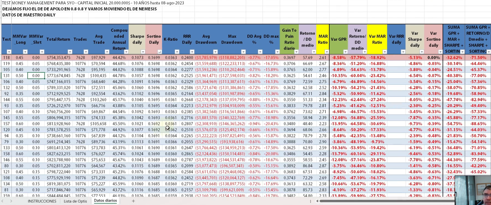

Lo que comentas en el punto 7 está directamente relacionado con el tema del Excel y con la creación del *portfolio*. Cuando hablamos de la correlación entre sistemas —ya sea en retorno diario, semanal o mensual—, lo importante es entender que se puede medir de distintas formas según la escala temporal del estudio.

Normalmente, trabajar en mensual está perfectamente bien. De hecho, creo que la tabla que mencionas la mostré en base a datos diarios de unos diez años, pertenecientes al *maestro daily*, pero eso fue solo un ejemplo. Si los datos están en mensual, también es completamente válido. No hay problema en hacerlo así.

No penséis que siempre tiene que ser en diario; a veces, incluso, trabajar en diario puede tener alguna desventaja, especialmente en estudios muy largos o con muchos sistemas, porque introduce más ruido.

En general, para este tipo de análisis de largo plazo, con múltiples sistemas y series de datos extensas, yo recomendaría trabajar en mensual. Es una escala suficiente como referencia para evaluar correlaciones, retornos y *drawdowns*, y resulta más estable y representativa a la hora de analizar la mezcla de sistemas dentro de un *portfolio*.


**Contexto del paper, escáner y limitaciones de herramientas**

***AMC S.VI-01-Contexto: En el paper "Opening Range Breakout ORB a profitable day trading strategy 5 minutes" analiza una estrategia orb en los primeros 5 minutos del mercado de acciones americanas, concluyendo un pobre retorno en su versión básica y mejorando más que notablemente cuando incorpora el concepto "Stocks in play". Este concepto juega con la métrica del volumen relativo ( volumen de la barra de 5 minutos dividido por la media de volumen de 14 días anteriores ) siendo ésta usada para rankear las acciones. He intentado usar un scanner con un criterio cualquiera (acciones con un roc(1) > 4%) con 3000 acciones con la herramienta SCAN de TS y el tiempo de respuesta ha sido tan alto que lo convierte en invalidante (hipotéticamente hablando, el resultado debería estar listo a los pocos sengundo de finalizar la vela de 5 minutos) para poder tomar una decisión de selección de las X mejores.***


bueno la verdad que escáner nosotros últimamente lo usamos poco es posible que tengas razón o sea Tradestation ya os lo vengo comentando yo confío y es sólo confianza que no tarden en lanzar alguna nueva versión que la convierta en más más capaz vale pero porque tiene el problema de ser de base de 32 bits son algunas cosas como ésta como ésta pues se nota de todas maneras sí que te diré nosotros tenemos este por ejemplo que escaneamos los reteféricos de volumen automáticamente y demás que la única cosa que te puedo decir respecto a esto entiendo que te refieres a escárner en órgano de skin vale es que cuando tú tienes que usar un criterio que si si lengües es tarda mucho más 

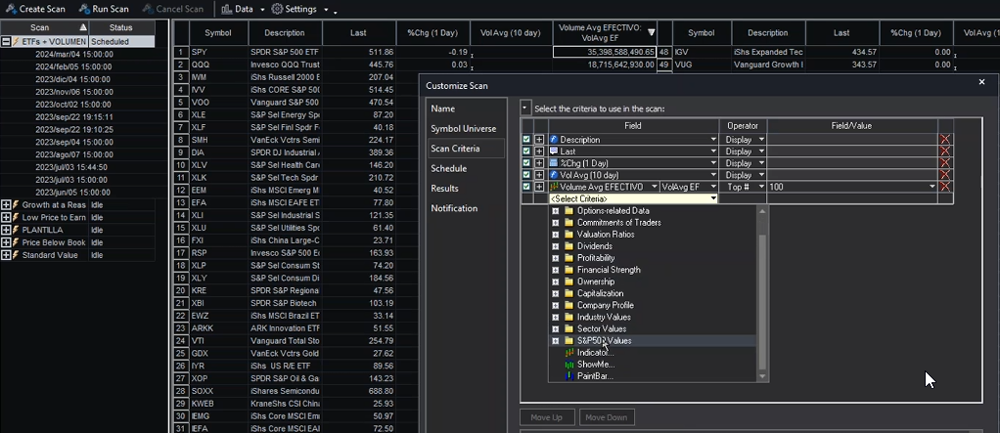

si puedes usar los que tiene pre precreados él vas a conseguir mucha más velocidad eso sí te lo digo por lo demás no te puedo decir también depende de lo que filtres cuántos enseñas vale al final hay algunos que sólo son display display display aquí ves es elegir top 100 vale cuando pones top 100 

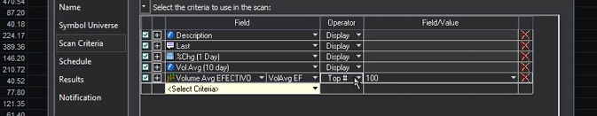

o mayor que un criterio lo que sea vale que hay que no sé si estarás a lo mejor siendo muy muy exigente pero claro si te he entendido bien tú me estás diciendo que estás filtrando 3.000 acciones en 5 minutos no sé cuánto cargas de datos ahí pero claro la vela de 5 pues seguramente es complicado complicado no se habría que mirarlo no sé si es viable o no si viable es segura seguramente este tipo de cosas no es tres se son la mejor herramienta hoy en día porque antes iba muy bien pero lo que digo es que hay esto mira escáner por fue el maestro world for optimizer son herramientas que siempre han estado muy bien pero están igual hace como 10 años que ahora igual pero igual igual, entonces claro vosotros si cogéis ahora un móvil de hace 10 años va a pedales literal literal va a pedales entonces pues ya está ya se ha dicho todo entonces ya se ha dicho todo entonces realmente son herramientas que están bien pero que cosa que no que saben que están muy bien porque están muy bien realmente el concepto pues meter datos fundamentales pero o sea necesita mejorar en procesamiento de datos necesita mejorar en capacidad en recibimiento y maestro quizás la peor porque si es si maestro igual lleva 15 igual entonces ese es un poco el problema

**Consejos de uso del escáner y observaciones sobre TradeStation**

vale entonces si ya lo has probado lo único que te digo es eso que trates de no usar easylengaje y que trates de usar las consultas suyas porque verás que lo hace como en varias fases y verás que la que tarda es la vez de lenguas la si bueno esto que comentas me sorprende que me lo preguntes porque lo que lo he dicho varias veces lo de las sensaciones en la pobreza de rendimiento de la herramienta de escáner terrestre no es en la herramienta de escáneres en varias cosas de lo que te digo que por ejemplo a nivel gráfico a nivel de la operativa para el que operan con el amátex está súper bien visual a nivel de opciones me dicen yo no pero pero me dicen que está muy bien mejoró muchísimo y y a nivel del easy language optimizar y demás también ahí mejoraron bastante porque fue así que usa todos los procesadores pero también también puede mejorar también puede mejorar pero sí sí o sea yo yo tengo la sensación que trae si son no sé el motivo pero se está como quedando atrás porque ya digo hace muchos años es así los años haría falta una versión 11 supongo que ya sea de 64 bit y que mejore un poco algunas de las herramientas que tiene

**Comentarios en vivo: pruebas con Donchian, maestro y optimización genética**

***En el chart no me permite hacerla genética y me la pasa directamente a exhaustive. En el caso del portofolio me responde algo similar. No se si estoy haciendo alde manera incorrecta o puede haber otro motivo. Gracias.***   
vale bueno y hasta luego añadí ahí para el tema de maestro y demás y ahora mientras escribíamos raúl estaba estaba escribiendo ahora estaba escribiendo y decía que ha estado haciendo unas pruebas o optimizar el don chian y ha tenido problemas bueno el maestro no bien bienvenido bienvenido al club tanto evitando estrategias en un chat en un solo activo con porfile maestro a entonces ya no tanto eso ya si bueno esto esto no es un problema para un esto es que no tiene sentido hacer la genética esto no es un problema este aviso que te sale quiere decir que tú has el tú has querido hacer genética una optimización que haciendo la exhaustiva tienen menos generaciones entonces te dice no tiene sentido vale no tiene sentido hacer la genética porque el número de el número que has elegido genético es mayor que la exhaustivo así que te dice te la cambio a exhaustiva esto no es un fallo esto simplemente es que te la cambia exhaustiva y es correcto 


si tú quieres hacer genético por el por la por lo que hemos hablado que quizá por ahí la cosa de que el genético te permite esa búsqueda que a mí por eso me gusta más el genético que otros ratios que otros algoritmos enjambre y esos nombres que alguna vez que no me acuerdo pero genético para mí es que es muy bueno para nuestro tipo de para nuestro problema no para encontrar soluciones a nuestro problema yo creo que el genético es muy bueno es muy bueno entonces si quieres eso pues tienes que abrir más, tienes que abrir más no te queda otro, tienes que o granular más el incremento tienes que hacer que el que la población sea más grande para que todo este diga vale ya la puedes hacer genética.


### ORB, materiales y apertura de datos

* [OPEN RANGE BREAKOUT 2](../CursoORB-02.pdf)
* [Cargamos estrategias a TradeStation](../PRACTICA%2007.ELD)
    * Curso-ORB Rupertacho — Strategy
    * Curso-ORB-02 — Strategy
    * NarrowRange — Function

el pdf vale pero lo vamos a ir viendo en el gráfico el pdf os lo pongo ahí porque así lo podéis vosotros también abrir y ir ir viendo

**Resultados iniciales y carencias a mejorar**
1800 trades nada mal 

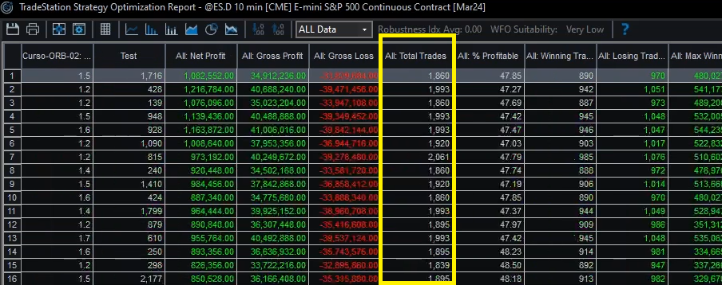

tenemos c6 bastante bajos los c6 bastante bajos si muy muy bajo 

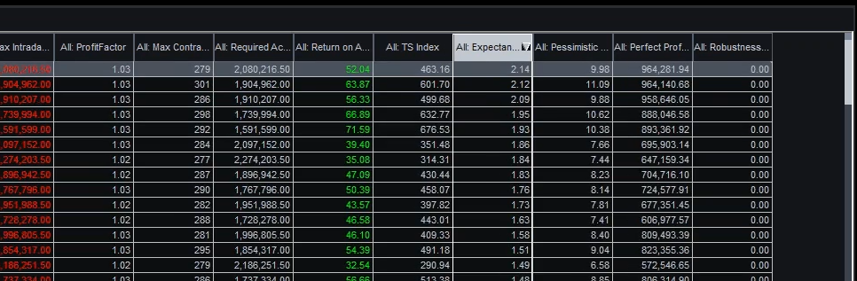
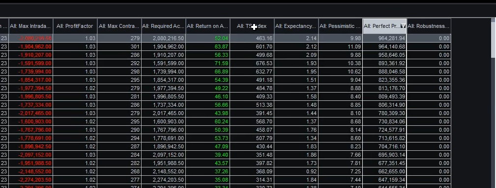
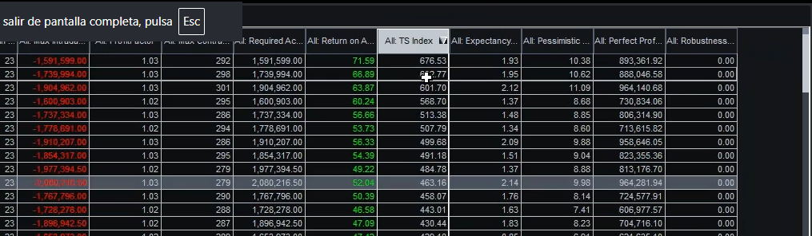


hay un par de cosas que no que no hemos implementado porque todavía no lo hemos hecho y para el siguiente ya metamos que es lo que hablábamos antes no hay SP de volatilidad aquí, al final los tp y estos que hemos hecho son por porcentaje no son por ajustados por atr y es bastante recomendable hacerlo

**Parámetros del sistema y referencia a Kaufman**
bueno volviendo al documento, simplemente veis ahí los parámetros que hemos incorporado las cosas típicas 
- ***ventana la ventana temporal*** en el que vimos del libro de kaufman que es uno de los más clásicos que es basado en el rango de la primera hora basado en el rango de la primera hora  partir de ahí tú puedes montarlo de variando poniendo una hora de inicio de acuerdo poniendo una hora de inicio y un número de barras que en esa hora evalúe vale y eso es lo que hemos hecho aquí tú pones una hora pones las 10 y entonces a partir de ahí puedes trabajarlo poniendo una hora de inicio y un número de barras que en esa hora evalúe y eso es lo que hemos hecho aquí; yo aquí lo he cargado en el sp500 en horarios regular y en 10 minutos y es pobrísimo 

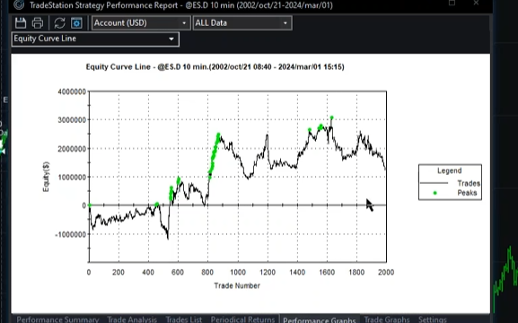
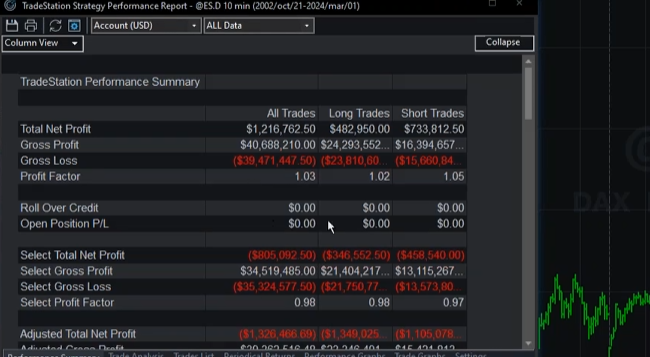


el sistema es realmente pobrísimo no digo tal como está puesto así es pobrísimo es realmente súper pobre 
- con high con low sin filtro entrada 
- tres días de filtro de tendencia y curioso bueno y le metemos 
- 15 dólares de penalización de 15 dólares le metemos 15 dólares cuando tiene una verad straight de 600 
el problema de los interadías siempre siempre es eso pero tiene tiene capacidad de mejora esto se puede conseguir unos revés con una curva bastante más bastante más estable bastante más estable

vamos a repasar el sistema vale vamos a repasar este va para que lo entendáis 

***Curso-ORB Rupertacho — Strategy***

```sh
# Sistema Base para el reto ORBChallenge 2019 by Rupertacho
# Sobre el MiniSP500 @ES.D (velas de 15 minutos)
# https://www.youtube.com/watch?v=nWoqdDlqzl0

vars: HHH(0), LLL(0), RefPrice(0);

if time=1030 Then
Begin
    HHH = Highest(Maxlist(open, close), 8); # en chicago CME abre a las 0830, en NY a las 0930
                                            # Maxlist(open, close) devuelve el mayor valor entre la apertura y el cierre de cada vela.
                                            # Highest(..., 8) busca el máximo de los últimos 8 valores, es decir, el punto más alto alcanzado en las primeras 8 velas (la hora inicial).
    LLL = Lowest(Minlist(open, close), 8);  # Minlist(open, close) devuelve el menor valor entre apertura y cierre de cada vela.
                                            # Lowest(..., 8) busca el mínimo de los últimos 8 valores, o sea, el punto más bajo en ese mismo rango temporal.

    # HHH = Highest(TypicalPrice, 8); # en chicago CME abre a las 0830, en NY a las 0930
    # LLL = Lowest(TypicalPrice, 8);
end;

RefPrice = CloseD(14);

if time >= 1030 and marketposition=0 Then
Begin
    if (close > RefPrice) then //filtro momentum positivo: solo posiciones largas
        Buy Next Bar at HHH stop;


    if (close < RefPrice) then 
        Sellshort Next Bar at LLL stop; //filtro momentum negativo: solo posiciones cortas
End;


Setexitonclose;
```
Aquí se define el rango de apertura (Opening Range):
 * `Maxlist(open, close)` ***devuelve el mayor valor entre la apertura y el cierre de cada vela.***
 esto es una manera de tratar de adelantar la entrada a tratar de adelantar la entrada es decir tiene tiene suficiente capacidad predictiva ver los máximos entre el open y el close si la respuesta es sí normalmente vas a entrar antes que con el `highest` es más seguro pero es verdad que es más lento entonces cuando estamos hablando de sp que no estamos hablando del activo más tendencia del mundo a nivel interdiario pues avanzarse es nosotros esto solemos hacerlo con el `TypicalPrice` solemos hacerlo con el típico el price en vez de usar esto pero busca un poco lo mismo entonces ahora luego lo probaremos luego lo probaremos


### Este es el código [Curso-ORB-02 : Strategy](../PRACTICA%2007.ELD)

```c
{
ORB con filtro de tendencia en diario, filtro NR y
ventana temporal de entrada y salida
chart en 10 minutos, 2 data, usar hora exchange
data2 en daily para calcular el narrow range
}

inputs:
	HoraInicio (0930),
	HoraFin (1530),
	BarrasRango (6), //barras del canal a romper para abrir posición
	PrecioAlto (High),
	PrecioBajo (Low),
	FiltroEntrada (0), //en tanto por ciento, 0 no actúa
	FiltroTendencia (0), //Media de cierres diarios, si es 0 no actúa
	Filtro_NR (0), //numero de barras diarias del Range, si es 0 no actúa
	TradesDia (1),
	Prc_Trail (0), //en tanto por 100, 0 no actúa

	//Gestión Monetaria
	Start_Equity (100000),
	MMVar_Start (100),
	MMVar_Profits (100),
	Min_Size (1),
	Max_Size (100000),
	RoundTo (1);

vars:
	Trailing_Long (0),
	Trailing_Shrt (0),
	RangoAlto(0),
	RangoBajo(0),
	TradesInicioDia (0),
	ContadorTrades (0),
	
	Contratos (0),
	Profits (0);

{ Money Management }
Profits = NetProfit + OpenPositionProfit;

If AbsValue(Close * BigPointValue) > 0 Then
	Value1 = AbsValue(Close * BigPointValue)
Else
	Value1 = 0.01;
	
Contratos = ((Start_Equity * MMVar_Start * 0.01) + (Profits * MMVar_Profits * 0.01)) / Value1;
Contratos = IntPortion(Contratos / RoundTo) * RoundTo;
Contratos = MaxList(Contratos, Min_Size);
Contratos = MinList(Contratos, Max_Size);

if date <> date[1] then // iniciamos día
	TradesInicioDia = Totaltrades; 

ContadorTrades = TotalTrades - TradesInicioDia; //contador de trades cerrados

If Time = HoraInicio then //calculamos el rango y los filtros
Begin
	RangoAlto = Highest(PrecioAlto, BarrasRango) * (1 + (FiltroEntrada / 100));
	RangoBajo = Lowest(PrecioBajo, BarrasRango) * (1 - (FiltroEntrada / 100));
	
	If FiltroTendencia > 0 Then
	Begin
		Condition1 = Close of Data2 > Average (Close of Data2, FiltroTendencia);
		Condition2 = Close of Data2 < Average (Close of Data2, FiltroTendencia);
	end Else
	begin
		Condition1 = True;
		Condition2 = True;
	End;
	
	If Filtro_NR > 0 Then
	Begin
		If Range of Data2 < Average(Range of Data2, Filtro_NR)[1] Then
			Condition3 = True
		Else
			Condition3 = False;
	End Else
		Condition3 = True;	
End;
		
If Time >= HoraInicio and Time < HoraFin and MarketPosition = 0 Then
Begin	
	If ContadorTrades < TradesDia then
	Begin
		If Condition1 and Condition3 then
			Buy Contratos contracts next bar at RangoAlto stop;
		
		If Condition2 and Condition3 then
			SellShort Contratos contracts next bar at RangoBajo stop;
	End;
End;

If MarketPosition <> 0 Then
Begin
	If Prc_Trail > 0 Then
	Begin
		Trailing_Long = 0;
		Trailing_Shrt = 99999;
			
		If MarketPosition = 1 then
		begin // Para posiciones largas
   			Trailing_Long = maxList(Trailing_Long, High - (High * Prc_Trail / 100));
   			Sell ("Trai_Long") next bar at Trailing_Long stop;
		End;

		If MarketPosition = -1 then
		begin // Para posiciones cortas
   			Trailing_Shrt = minList(Trailing_Shrt, Low + (Low * Prc_Trail / 100));
   			BuytoCover ("Trai_Shrt") next bar at Trailing_Shrt stop;
		End;
	End;
	
	If Time >= HoraFin then
	begin
		Sell ("Hora_Long") next bar at market;
		BuyToCover ("Hora_Shrt") next bar at market;
	End;
End;	

SetExitOnClose;
```

vale ese es el código lo tenéis también en el pdf   
```sh
inputs:
	HoraInicio (0930), # ventana horaria
	HoraFin (1530), # ventana horaria
    BarrasRango (6) # cuento seis barras en esa hora calcula el rango previo que yo le diga
```
esto es el sp en horario regular que abre 8.30 en velas de 10 minutos, si le digo a las 10am , 

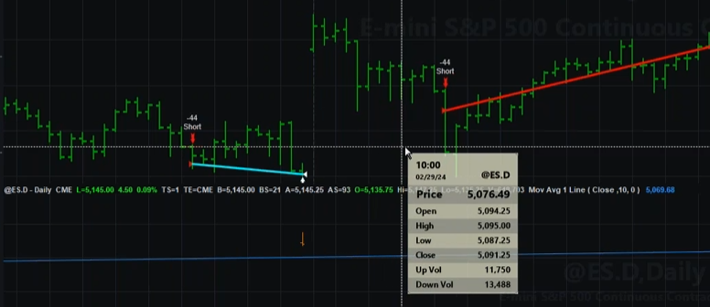


pues cuento las velas hacia atrás, tengo 1 2 3 4 5 6 7 8 y 9 a las 10 tengo nueve quiero hacer así pues algo así 

si no pues puedo definir el rango como quiera lógicamente puedo hacerlo también por optimización pero es verdad que ahí tendríamos que hacer algún algún ajuste porque optimizar las parámetros de velas al no estar en en algebraico es un poco más complicado es un poco más complicado se puede pero hay que hacer una conversión en el código que no hemos hecho pero sé que sé que se podría 

aquí creo que tenemos 10.30 a partir de las 10.30 puede puede operar define el rango de acuerdo y ahí puede operar lo hemos hecho totalmente flexible en el sentido que podéis hasta definir el precio el precio que usa para para calcular el precio la banda alta la banda baja 

```sh
	PrecioAlto (High),
	PrecioBajo (Low),
```

lo que decía ahora tú aquí puedes poner típica el price puedes poner típica el price o puedes poner o sea tú en los inputs de TS puedes poner cualquier palabra reservada o función que como resultado de un número que es un precio al final bueno que de un número él lo va a usar un número que no que en el código no dé un error que cualquier cosa que de un número pues no va a dar error pues al final es está (por ejemplo `Highest(Maxlist(open, close), 8)` )

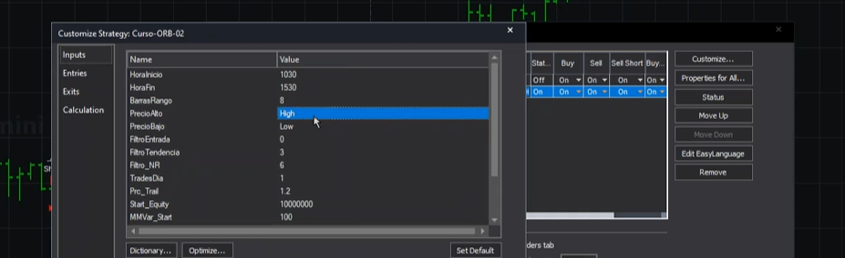

**Control del rango de entrada y hora de fin; utilidad en DAX**
hemos puesto una hora de fin por lo que os decía en el dax no decir bueno pues yo también quiero explorar el controlar el rango de entrada pero también el de salida vale y en el dax es especialmente útil yo os lo comentaba
además de una cosa explorar muy interesante en el dax aquí ahora mismo ese no lo hemos trabajado demasiado pero a lo tengo cargado creo que con sesión regular exactamente pero puedes explorar el dax puedes probar por ejemplo cargarlo desde las 8 cargarlo desde antes y tú a lo mejor por pones operativa a las 10 y le puedes que calcule de 30 barras antes, es de decir que el rango use todo el previo entiendes es un ejercicio que se anima a probar el código es el mismo pero tú puedes cargar la sesión que quieras y le metes regular 

son sistemas que les gusta anticiparse a poner 9 

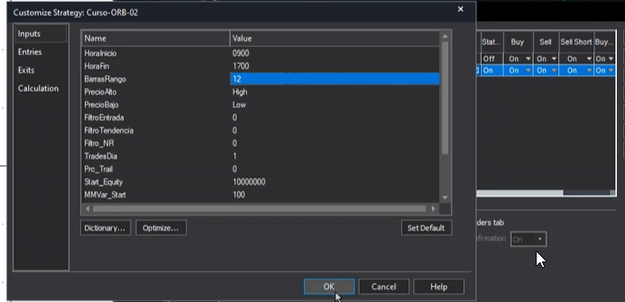

como cada hora son 6 barras de 10' ponemos las dos horas previas de 7 a 9 que define al rango (`Barras Rango`) que estás en filtros de momento es para evaluarlo aquí es lo que os decía por ir rebasando conceptos, 

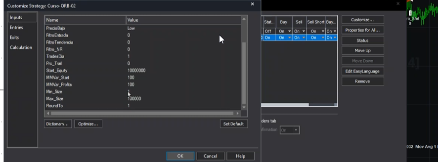

Tú puedes definir la idea así cuando yo os digo incluso aún ***podíamos haberle metido algún filtro más*** no quiere decir que los uses todos faltaría el de volumen por ejemplo vale no quiere decir que los estos pero si los puedes usar para investigar pero hacerlo por separado,,, lo que os decía es decir tú ahora pruebas el sistema buscas tu entrada lo trabajas, trabajas la entrada de distintas pruebas, haces alguna optimización de la entrada, sólo la entrada, y vas haciendo así input por input

fíjate que misil :)) le damos la vuelta y ya lo tenemos

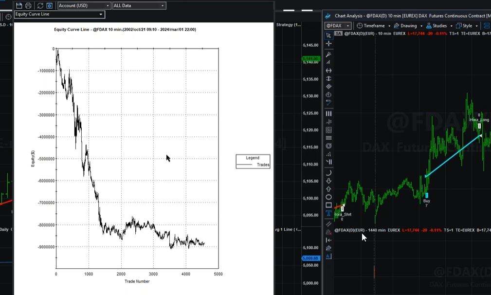

se va a tomar viento la forma espera pero la salida lo tengo cargado todo pero le voy a poner salida también a las ocho 40 a las ocho y media para que pierda un poco más 

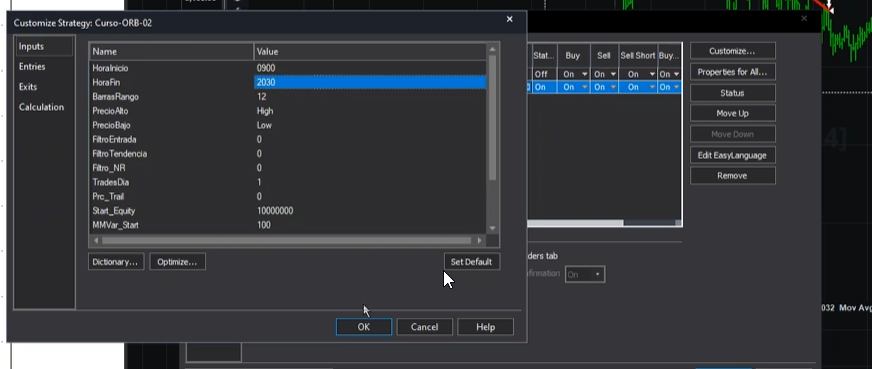

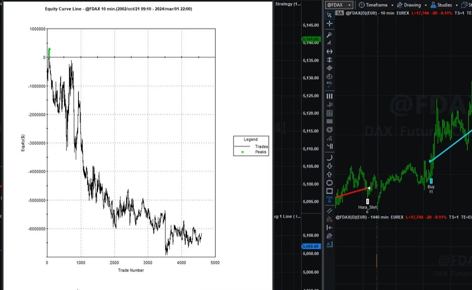

entonces esto es la idea lo bueno que es lo que os digo lo bueno es que los sistemas intradía tienes muchísimo margen de maniobra y aquí hay cargado mucho histórico expresamente todo el que me deja tener TradeStation que es desde 2002, el data2 es para el filtro de tendencia porque le puedes permitir que vaya pero no se ha activado ahora está en bruto a comprar a una hora y vender a vender a la otra, no tiene nada no puede ni salir por otro método, es decir, que realmente que ahora sí tendría bastante mérito en tantos años porque claro no tiene manera de salirse se se equivoca, acuerdo no tiene manera de salirse se equivoca se lo traga, nada más que lo hubieras metido un stop aquí, pues no sé esto mismo le metes creo si solo hemos solo hemos implementado el trailing pero 5% lo normal es que tenga alguna alguna mejora

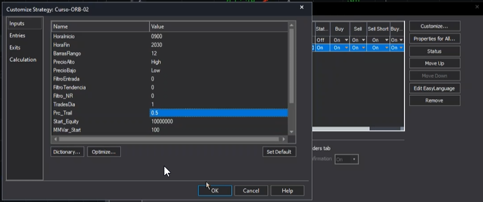
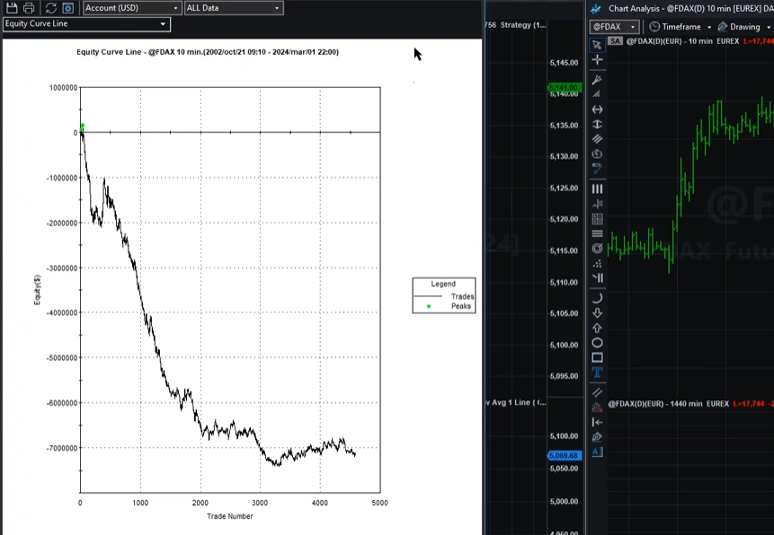

aún va peor, yo sugeriría aquí es explorar el stop fijo que de hecho lo tenía montado y lo sacado al final pero bueno ya digo al final no deja de ser un ejemplo para explicaros conceptualmente la idea vale de todas maneras de este sistema ya os comenté que este sí que tengo la firme intención de entregaros uno que se ha acabado pero me gusta que intentéis vosotros trabajarlo la práctica no sólo consiste, eso sí que era la teoría donde yo soltaba el rollo vale, aquí aquí la idea es que vosotros lo lo tratáis de trabajar bien enTradestation o en otra plataforma igual por eso os paso el código vale por eso os pseudocódigo y os paso el suyo código delante está explicado antes el código está explicado el código de cómo funciona eso es el suyo código vale yo os lo dije os pasaríamos el suyo código entonces os paso lo que hay a partir de ahí yo también durante la clase comentó comentó distintas distintas cosas os explico lo que hace esta versión y os explico también os sugiero otras cosas a probar vale y es lo que vamos a ver ahora


***siguiendo con la explicación de lo que de lo que hace el sistema***  
la entrada es tan sencilla como esa pero tiene cuatro filtros de acuerdo cuatro filtros que se pueden activar o no activar nosotros casi siempre los filtros los diseñamos así, de acuerdo, es decir que el código ya permita activarlos o no, vale un truco muy sencillo ya lo visteis en el otro sistema, era esto que con un valor de cero es simplemente con un simple condición de if filtro tendencia es mayor que cero, vale entonces actúa si es que no, pues no actúa, entonces ya le pasas que es que la condición quede en true para que si no interfiera el filtro de acuerdo, entonces es un pequeño truco que puede servir para para para evaluar un filtro para evaluar un filtro vale

***Descripción de los filtros disponibles***

	FiltroEntrada (0), //en tanto por ciento, 0 no actúa  
	FiltroTendencia (0), //Media de cierres diarios, si es 0 no actúa  
	Filtro_NR (0), //numero de barras diarias del Range, si es 0 no actúa  
	TradesDia (1),  
	Prc_Trail (0), //en tanto por 100, 0 no actúa  

entonces cuáles son los cuatro filtros bueno filtro de entrada es decir un tanto por ciento de acuerdo sobre el canal simplemente hemos añadido esa posibilidad la verdad que lo normal es que se quede en cero yo os lo digo también pero ahí está ahí está vale para si queréis darle un rango está en porcentaje vale un rango al precio vale luego hay un filtro de tendencia de acuerdo un filtro de tendencia que simplemente calcula la tendencia en el gráfico diario vale para permitirle ir solo largo solo corto dependiendo de la tendencia es decir dependiendo de si el cierre del data 2 vale es mayor que la media de n cierres del dato2 vale en el gráfico se ve muy claro es esta media móvil de aquí abajo

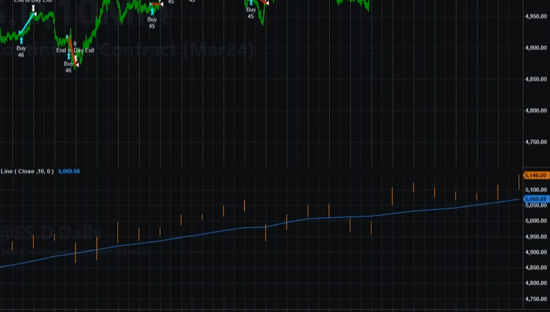

se puede implementar de otra manera y hay distintas distintas opciones vale en el ejemplo que pasó ser el de roberto creo que lo que tiene es un momento vale es ***un cierre menor que cierre anterior*** que eso es un momentum vale eso es exactamente lo que hace el indicador momentum  exactamente, es comparar el cierre de un día con el cierre de el cierre de una barra con el cierre de n barras, momentum de 14 pues es el cierre de hoy con el cierre de hoy o de la barra actual en el time frame que sea con el cierre de 14, vale, entonces puede estar bien hacer de momentum que es un poco no es lo mismo pero es un concepto totalmente análogo, o lo puedes hacer con una nosotros lo hemos implementado con la media movil


entonces simplemente es eso tú le dices si activas el filtro para que en este día por ejemplo vale por ejemplo en este día para que pueda comprar el día anterior tiene que haber cerrado por encima de la media 

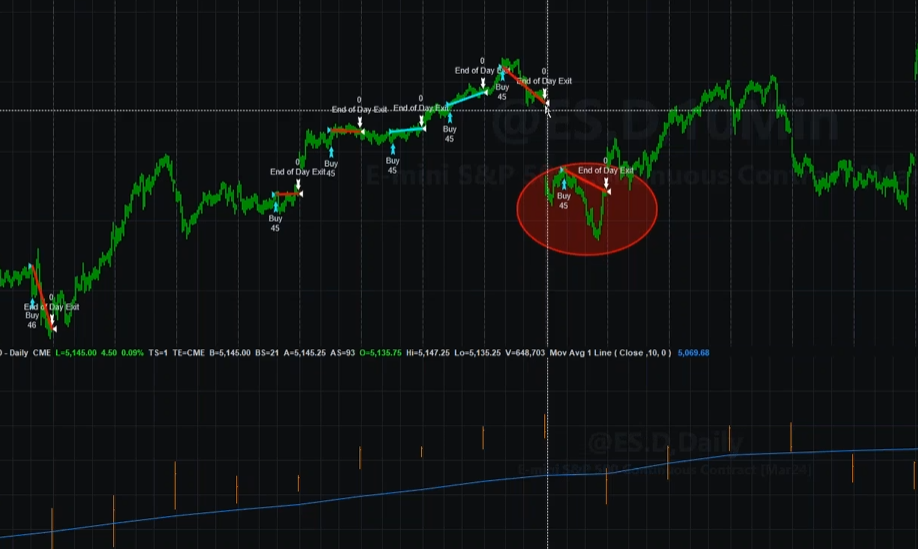

vamos a suponer que le activo no sé cuánto tiene activo ahora tiene activo en tres  (filtro tendencia)

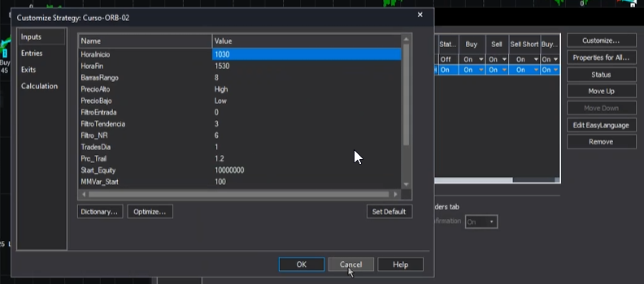

para que sea poco más visual se lo voy a poner en `10` vale igual lo pongo en 10 

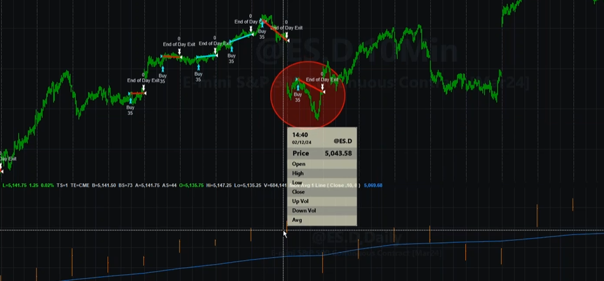

para ir largo en esta acuerdo el día anterior esta esta vela 

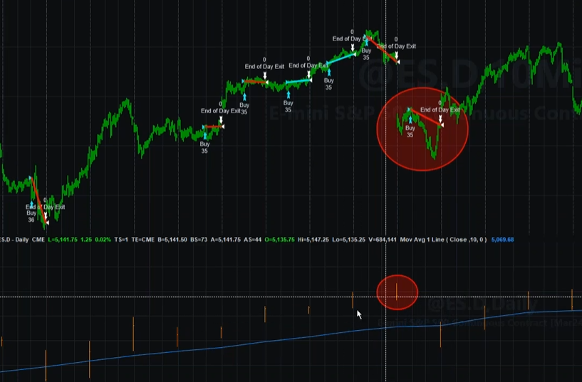

tiene que estar por encima de la media eso es lo que hace ese filtro de tal forma que aquí en esta solo puede ir corto no puede ir largo al día siguiente por eso al final no compra 

se puede activar no se puede activar se puede usar una media se puede usar otra vale es decir eso es ese ese concepto de decir yo voy a favor o en contra

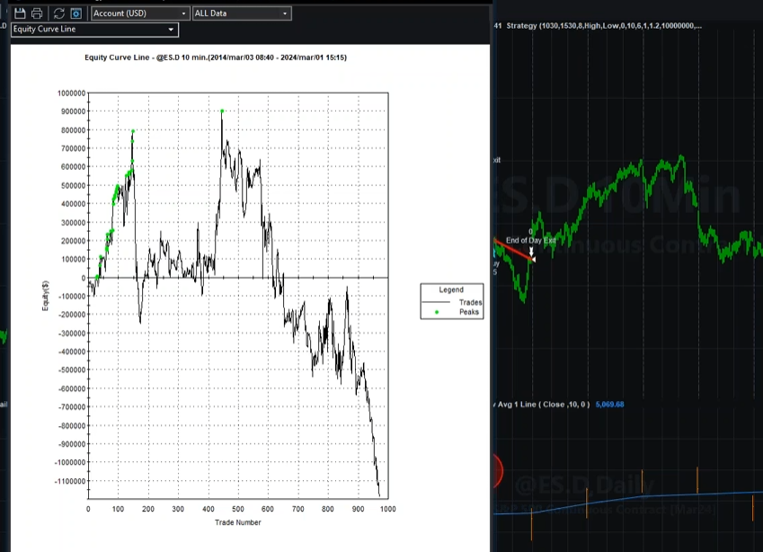

como ves el meterle la media de 10 ha ido mucho peor como veis meterle la media 10 ha ido mucho peor  pero ese es el ese es el filtro de tendencia 

probarlo también el momento es decir al final esto como os digo es es probar y lo bueno en los interiores que se puede probar con cierta tranquilidad pero a menos lo que os decía en los interiores más difícil encontrar señal creo que sí es más difícil encontrar señal la señal es más sucia y también es más fácil hacerse tampas al solitario entonces si uno al final es muy habitual porque no pongo comisiones al final me entiende si yo no pongo comisiones pues mejoro mucho resultado pero mucho resultado eso es así 


**Filtros**

el otro filtro el otro filtro que tenemos después del filtro de tendencia que simplemente compara el cierre del día anterior del data 2 con la media de n barras del data 2 vale tenemos el filtro de `narrow range` acordaros que os expliqué y os comenté que una de las pautas que funciona mejor en general los mercados y por supuesto breakout no va a ser de otra manera es el concepto de expansión contracción

hay varias maneras de mirar esto esta es una esta es una hemos querido implementar esta porque os hablé porque os enseñé los vimos los artículos de ***krabbel*** es uno de los autores que más reconocidos en el tema por por los ORB´s y como vi que estaba en esto con commodities pues ya os adelanto que los t los tenemos vale los tenemos los hemos traducido y demás nos hemos puesto un poco así bonitos vale y ahora los voy a ir subiendo ahí vale como son 8 como son 8 de momento voy a subir voy a dejar ahí 4 bueno espérate que si no si no me cuando acabe esto es los otros subos cuando acabes 

* [1](../ORB%2001.pdf)
* [2](../ORB%2002.pdf)
* [3](../ORB%2003.pdf)
* [4](../ORB%2004.pdf)
* [5](../ORB%2005.pdf)
* [6](../ORB%2006.pdf)
* [7](../ORB%2007.pdf)
* [8](../ORB%2008.pdf)

pero pero bueno al final un filtro de `narrow range` que es simplemente que el rango el rango de la sesión se va estrechando de acuerdo el rango de la sesión el rango viene definido por la diferencia entre el máximo y el mínimo ya tenemos una función que se llama range pero si lo hubieras hecho restando el high del low es lo mismo es lo mismo el rango del data 2 que sea menor que la media de los rangos de las n barras anteriore,s este es un filtro, esto que te está diciendo bueno que el mercado se está contrariendo se está contrariendo también es un filtro que se puede activar en el sistema

**Resultados con comisiones y sin comisiones; trampas comunes**

Este sin comisiones, pues seguramente ha encontrado mejores, mejores resultados; no, habrás encontrado mejores, mejores resultados.

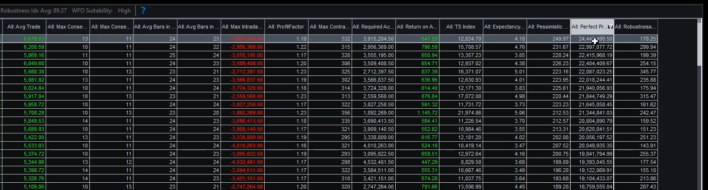
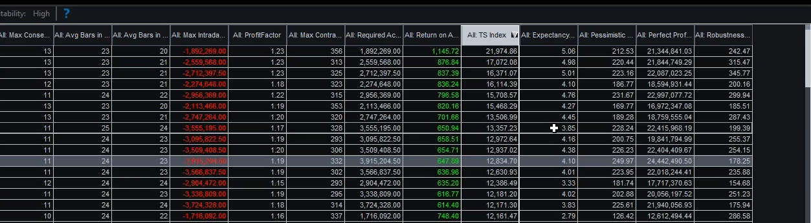
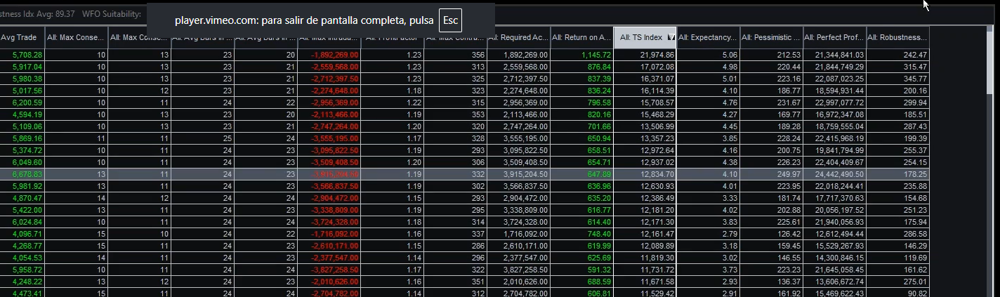
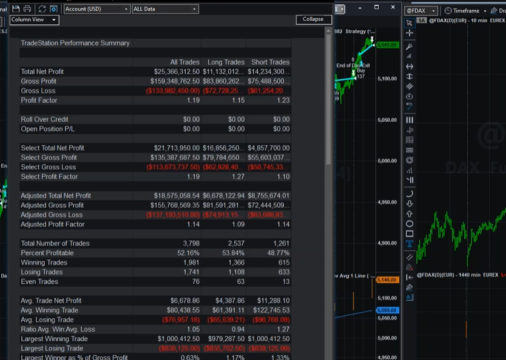

Bueno, y Profit Factor 1.19 sigue estando justito, pero, pues ya mejor; no, tampoco mejor: es lo que decíamos de las trampas al solitario, gente que le gusta hacerlo.

Pero porque sí; ya, si ya te quito estos primeros 1000 del gráfico que ha caído… ya ni te cuento.

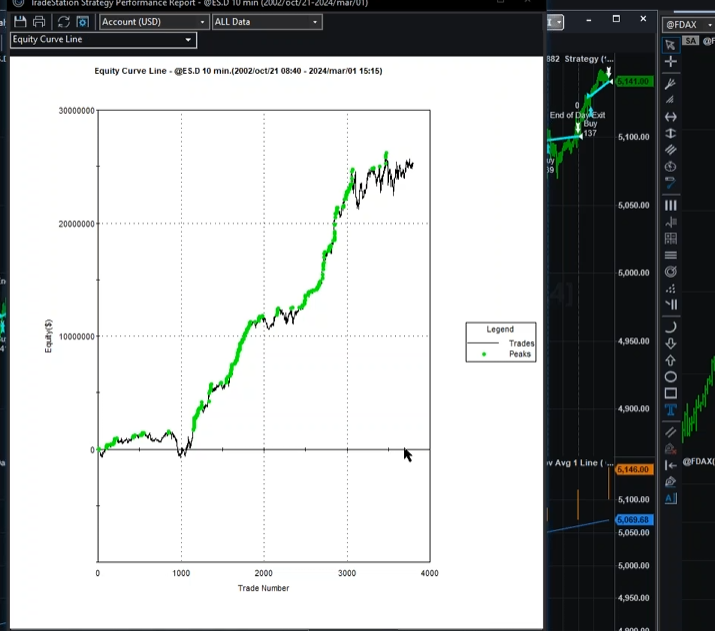

Al final, este sin comisiones y comisiones; entonces ya de una curva más atractiva, pero esa realidad no es verdad.

***abro strategy perfonmance report***
Busco uno que esté bien, el segundo se ve mejor, y doble click al segundo.

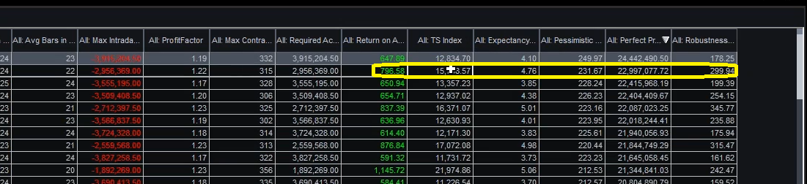

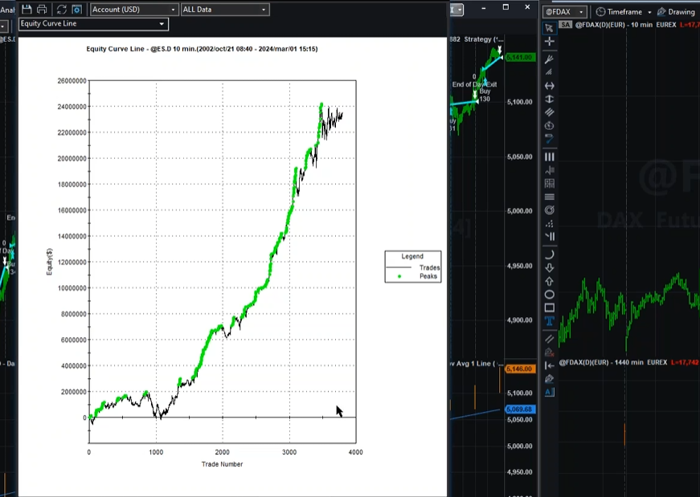

La curva, ya verás, maravilla; Alberto, para maravilla no, pero bueno, le quitamos, le quitamos esta parte; todavía está más trampa: sólo lo que dije, ya lo he hecho muchas veces esto en el curso; no esperéis, porque me niego absolutamente a hacer un curso donde sólo enseñe cosas maravillosas, porque este mismo, verá, te lo cargo desde 2008 y tienes aquí una maravilla; todos contentos, joder, qué bien, qué fenómeno… no tiene comisiones… está optimizado a saco… pero, por lo menos, sirve para hacerse una idea del sistema, pero sin más.

Bueno, este es el filtro de Narrow Range; Krabel explicaba varios, y hay varios autores que hay varias maneras de mirarlo; otro, simplemente, la volatilidad: es decir, que la volatilidad esté bajando, también, es una manera sencilla de evaluar, de evaluar eso, que la volatilidad esté bajando, que la volatilidad actual sea más baja que la volatilidad media de n días un poquito; puede ser otra, otra pauta, pero, en definitiva, por ahí van los tiros en los, los ORB’s; por ahí van los, los tiros de mirar este tipo, este tipo de pautas.
Una es volatilidad o volumen; volumen, vale.
Otro, relacionado con ello, contracción–expansión: bien por una `narrow range`, bien por un `inside bar`, también por un inside bar; es decir, que la vela del día anterior, por ejemplo, tiene su máximo sea menor al máximo anterior y su mínimo sea mayor; que se entiende eso.

Que es un inside bar, para los que no lo tengáis del todo claro: una inside bar, vale, tienes una vela desde que ha abierto aquí, por ejemplo, y ha cerrado aquí, vale; y la del día siguiente, da igual si cierra abajo, arriba; en general, términos generales, igual; pues, esta vela, esta vela es una inside bar, y es un signo claramente de contracción (la vela del día siguiente queda envuelta).


Es una manera de identificar una, una contracción, una contracción; entonces, pues lo mismo que un doji o una vela cercana a un quasi doji, cosas así; o sea, este tipo de filtros se utilizan bastante en los sistemas de breakout, porque se considera que antes que una expansión, viene anticipada por una contracción; entonces, cualquier indicador que mire eso, como os digo, pues lo mismo: volatilidad decreciente, que tú veas una ATR que va bajando, que la volatilidad bajando, vale; pues un mercado así, normal, normalmente, aumenta; pero, normalmente no: lo que haces es aumentar las probabilidades del siguiente, porque, porque cuando haya una rotura de rango, también, incluso, también, hay algunos Volatility Breakouts que podemos llamar open o no, que no sólo utilizan, utilizan el open range, de acuerdo, que basan el range del día anterior; así que pueden mover la ventana, vale; pueden mover la ventana, pueden mover la ventana; es decir, yo puedo usar, puedo usar este rango.
De hecho, los Pivot Points, los Pivot Points, que los conocéis, basan un poco en eso, porque, al final, su cálculo depende del cierre anterior, el máximo, el mínimo anterior; con eso calcula los pivots del día; entonces, al final, es una, es una referencia, y hay muchas estrategias que utilizan, bien sea para, para, para Volatility Breakouts o como para Mean Reversion, porque ya os lo comenté esta semana: lo puedes explorar como Mid Reversion; fíjate aquí.

Aquí, el rango, justo, compré; se va para abajo; ahí tú hubieras vendido.


¿Lo veis? Que es justamente esto: sale del rango, pero vuelve, y ahí vendes; es ese ejemplo clarísimo; aquí sería un corto clarísimo, que, al final, es una, un fallo; y buscarlo, puedes buscar eso también con la estrategia, porque buscas la rotura, buscas el fallo; es decir, cuando sale de un rango y vuelve, él cierra por otra vez por debajo; ahí entras, porque, nuevamente, provoca movimientos fuertes; los fallos provocan movimientos fuertes; ya os lo comenté, que la mayoría de sistemas se pueden explorar en ambos, varios lados, en varios lados.

**Exploración de variantes, salidas y optimizaciones**

Bien, entonces, siguiendo con las, con la explicación del, de la estrategia, siguiendo con la explicación de la, de los filtros que, que hay, este simplemente: el rango.

```sh
If Filtro_NR > 0 Then
	Begin
		If Range of Data2 < Average(Range of Data2, Filtro_NR)[1] Then
			Condition3 = True
		Else
			Condition3 = False;
	End Else
		Condition3 = True;	
```

Aquí lo, lo tenemos, lo tenemos puesto aquí con las, las comisiones; bueno, lo he ido tocando; los parámetros, ya no sé cuáles, cuáles tengo puestos; pero, por ejemplo, si lo dejamos desactivado:

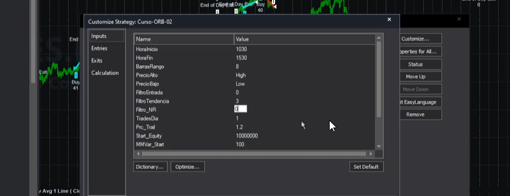

O no; nada, nada; Alberto, no, me he dejado el café aquí a mitad de la… Es ahora; he desactivado el filtro; es opera bastante más.

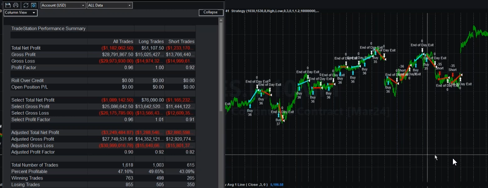

El filtro, pues sí que estaba, estaba aportando, de acuerdo; estaba aportando algo; normal es que aporten algo.

Este es el clásico sistema; por eso me gustaba mucho como ejemplo, y vamos a intentar en este hacer el procedimiento bien hecho, completo; es decir, lo que, lo que, lo que explicaba: es el clásico donde tú empiezas primero evaluando la señal primaria, lo que se explicaba cuando hablamos de las, de las entradas, de acuerdo, de las entradas, de acuerdo; pones unas salidas fijas y vas evaluando la entrada, vale, primero; y luego ya vas a los filtros; es un ejemplo que se ve muy bien la idea.

Que hay cuáles son las variables principales y las dependientes, de acuerdo; cuáles son las principales: sobre, pues lógicamente, el horario y el rango, y, si me apuras, el campo que usas en la barra, de acuerdo, para saltar; que esas, sólo, dejar la entrada.
Entonces puedes dejar la salida fija; podías y recomiendo hacerlo, y, de hecho, para nosotros hacer ese proceso lo vamos a hacer también: meter TP y Stop fijos para poder usar, como hicimos en el de acción, el trailing o no usar el trailing o usar SL y TP; porque, para evaluarlo, viene bien, porque ahí puedes ir a buscar riesgo 1:1 o 2:1, cosas así; pues, puedes evaluarlo mejor; y, si no, salida fin de día, salida fin de día; o salida a una hora bastante avanzada; y hasta ahí evalúas la entrada, haces una optimización, puedes hacer un mapa y ver un poquito en qué horarios jugar, cómo se mueve; y, a partir de ahí, es coger la ventana de entrada independientemente de los filtros; luego ya pasamos a trabajar los filtros fase por fase.


**Optimización y análisis por fases**

Aquí el filtro, supongo, no lo hemos explorado en rangos muy amplios, porque al colocarlo en cortos se vuelve muy sensible. Pero podríamos, por ejemplo, probar con unos diez días, que ya es bastante. En un rango de diez días, los resultados han quedado más o menos similares.

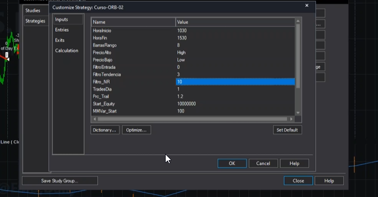

Sin embargo, en un rango de cinco días sí muestra cierta mejora.

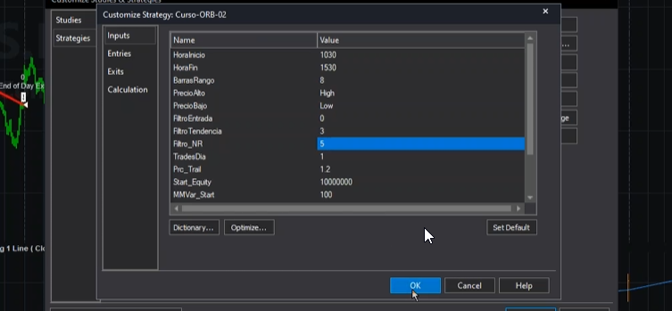
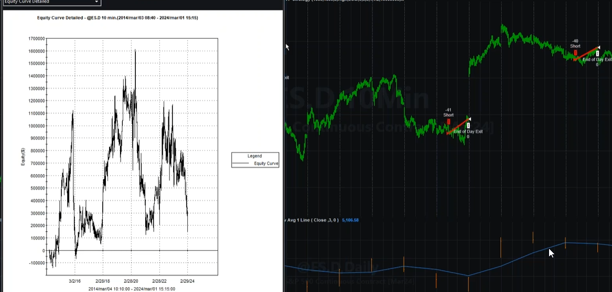

Aun así, habría que estudiarlo a fondo, elaborar un mapa y analizarlo por fases, trabajando sobre múltiples bases para obtener conclusiones sólidas. Este es precisamente el filtro de rango que mencionaba: el filtro *Narrow Range*, bastante utilizado, aunque también se podrían emplear otros como volatilidad, volumen, *inside bars*, *dojis* o distintos componentes de este mismo estilo.

**Control del número de trades, salida y trailing**

En cuanto al número de operaciones que puede realizar por día, en un sistema intradía esto suele controlarse cuidadosamente, igual que las entradas.
Para las salidas, simplemente hemos implementado un *trailing stop* y una hora fija de cierre: cuando la hora es mayor que la definida, el sistema cierra en la apertura de la siguiente vela, a menos que el *trailing* haya cerrado antes.

Este control horario actúa como una medida de seguridad para garantizar que el sistema cierre sus posiciones en el *backtest*, incluso si ocurre algún fallo o el horario termina antes.

Ese es, en esencia, el código explicado. Las únicas variaciones que añadiría serían: probar una versión con *stop* y *take profit* limpios, sin *trailing*, y trabajar un filtro de volatilidad (que personalmente me parece más fiable que el de volumen, aunque ambos son válidos).

A partir de ahí, no hay mucho más. Se pueden explorar distintas ventanas, complicarlo todo lo que uno quiera, e incluso realizar análisis *intermarket* comparando con otros futuros similares —por ejemplo, el Nasdaq—. Pero, en esencia, esto es lo que define un sistema ORB: simple, estructurado y centrado en capturar el movimiento inicial del mercado.


### pruebas con el DAX (futuros)**

Tengo una idea el dax acabando que es es bastante larga ...

**Evaluación del DAX y configuración del tick**
a ver qué hemos encontrado... 

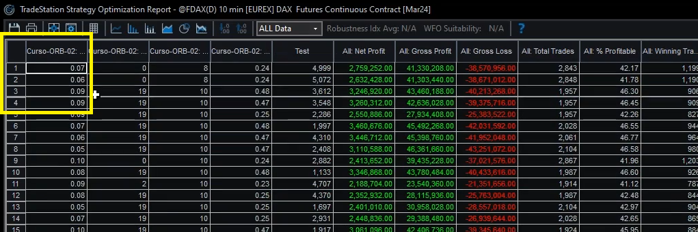

por aquí hubiera puesto un poquito de filtro, no sé por qué me lo olia que en el dax le pondría un poco el dax barre, si además haber ordenado por `Robutnes` 

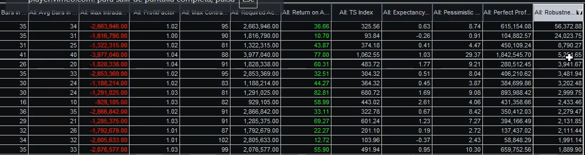

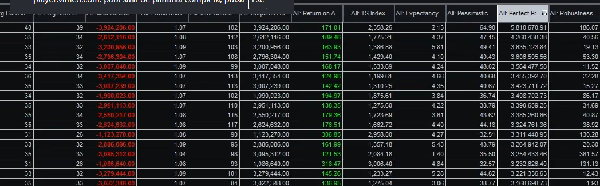

Hago click en la instancia `1` de la primera imagen

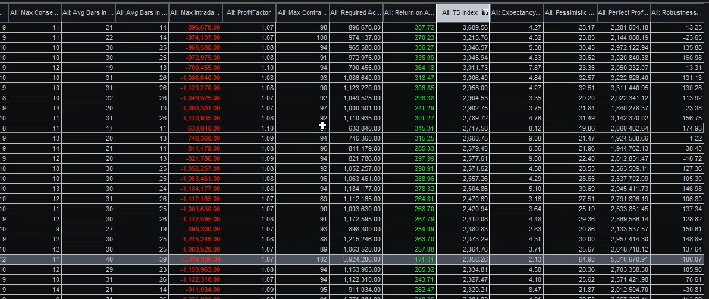

parece bastante descompensada, muchas comisiones, nosotros le metemos un tik entero, bueno igual al dax no le puesto un tic entero ,,,, a ver

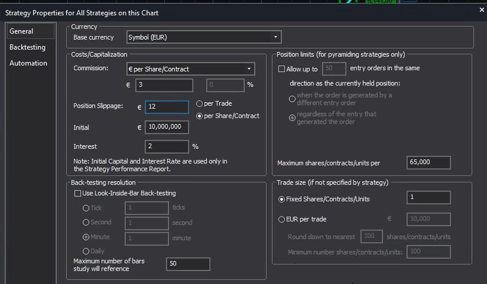

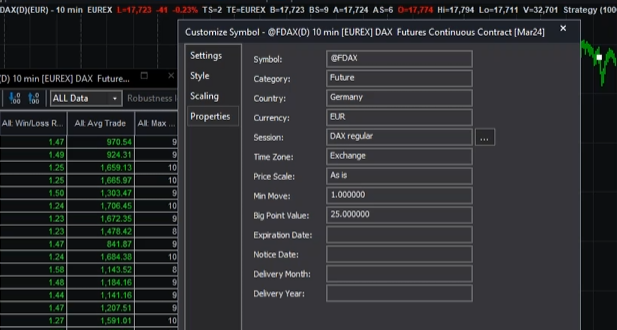

12, un tic, el que va a medio punto es el mini. si va a punto entero 

**Ajustes de stop loss y pruebas adicionales**

es curioso, al no pararla o sea no dejarla parar pues realmente es muy volátil o sea está ***muy dispersa todavía***, realmente no ha centrado nada,  de todas maneras maneras como es más volátil que el que el SP500, aunque sigue siendo una curva súper loca pues sí que tiene algo mejor 

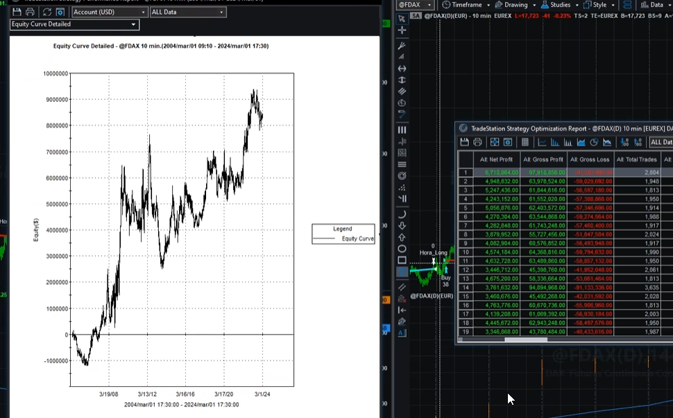

aquí realmente le podíamos meter SP y TP porque yo creo que va a ir que va a ir bastante mejor. Lo hacemos igual que con el tráiler configurado así 

```sh
# Strategy
inputs:
    ...
	...
	Prc_Trail (0), 
	Prc_Stop (0),
	Prc_Profit (0),
```

```sh
...
...
# stop y profit no trailing

SetStopShare; # autostops van por acción

if marketposition <> 0 then { set regular profit-target and Prc_Stop-loss }
begin
	if Prc_Stop > 0 then
		SetStopLoss(EntryPrice * Prc_Stop / 100 * Bigpointvalue);
		
	if Prc_Profit > 0 then
		SetProfitTarget(EntryPrice * Prc_Profit / 100 * Bigpointvalue);
		
end
else { set entry-bar profit-target and Prc_Stop-loss }
begin
	if Prc_Stop > 0 then
		SetStopLoss(Close * Prc_Stop / 100 * Bigpointvalue);
		
	if Prc_Profit > 0 then
		SetProfitTarget(Close * Prc_Profit / 100 * Bigpointvalue);
end;
```

dejo el traling inquieto y así ya lo dejamos 

le he puesto una hora de análisis y con el tipical price, de 9 a 10 que analice ahí y le dejo precio entrada, la tendencia no la ha querido pero se la ahora con el filtro se la voy a meter a meter por si no me va a tener muy pocos combinaciones, 

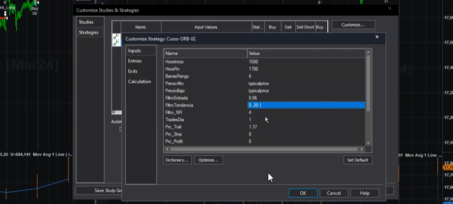

el filtro NR lo dejo, el trailing me lo petó 

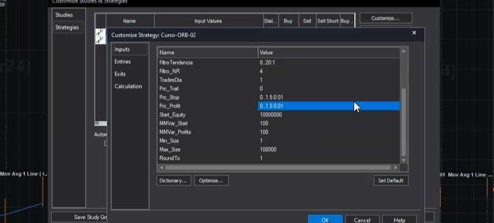

y le optimizamos el SP como tenemos muchos trades le granulo bien (esto sólo para probar habría que hacerlo con un poquito más de análisis que ahora) pero es que no sé por qué me da la sensación que va a mejorar bastante ahora me la puedo comer con patatas pero termina en 15 

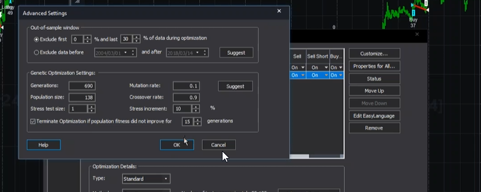  
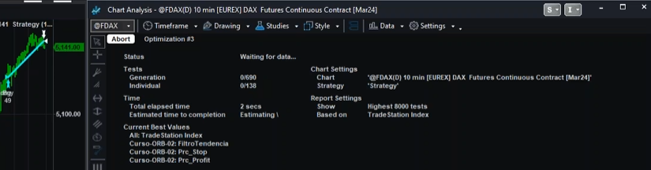  


**Explicación técnica del trailing stop y gestión de órdenes**

No sé si habéis visto los *power*, bueno, ahora ha quedado con el *SP* puesto; ya lo habéis visto: esto no tiene ningún misterio. Fijaos que es muy similar al *trailing* clásico.

El *trailing stop*, cuando estás en una posición larga, va tomando el valor más alto entre el *trailing* calculado previamente (el de la barra anterior) y el nuevo valor obtenido restando al máximo actual un porcentaje del propio máximo.

En otras palabras:

* Si el precio sube, el *trailing stop* se actualiza hacia arriba.
* Si el precio no sube más, el valor anterior se mantiene.

Tan sencillo como eso: el *trailing* se actualiza dinámicamente y lanza la nueva orden de *stop* en la siguiente barra al precio recalculado.

En cambio, el *stop* funciona de manera muy similar. TradeStation ya tiene una palabra reservada que permite hacerlo directamente, así que simplemente la usas. Básicamente, se calcula a partir del **precio de entrada**, aunque la plataforma también ofrece una función que lo referencia automáticamente, lo que simplifica el proceso.

Si no tuvieras esa opción, podrías implementarlo manualmente: guardar el precio de compra y calcular el *stop* como un porcentaje de ese precio (`porcentaje_stop / 100 * valor_del_punto`).
Por ejemplo, en el DAX, donde el valor del punto es 20, se aplicaría esa relación y listo.

**Evaluación del sistema y criterios de validación**

si tú miras en insample ya veis que `rebudness` más bien negativos 

`insample`   
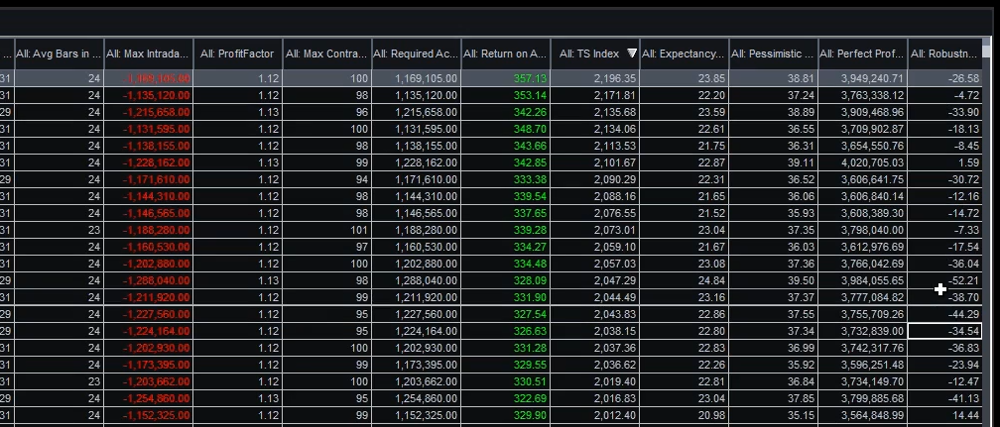  

no hemos mirado esto antes ya sabéis que me gusta os lo expliqué cortar mirar bien donde corta el 70 al 30 es decir hay que ver dónde corta el histórico, porque a veces vemos que casualmente cortamos en una zona donde es súper negativo para para el sistema entonces tiene una clara desventaja 

cuando hay muchos trades es lo que os digo es verdad que se facilita pero cuidado no pensemos porque hay muchos trades pero tampoco hay tantos

`all_data`  
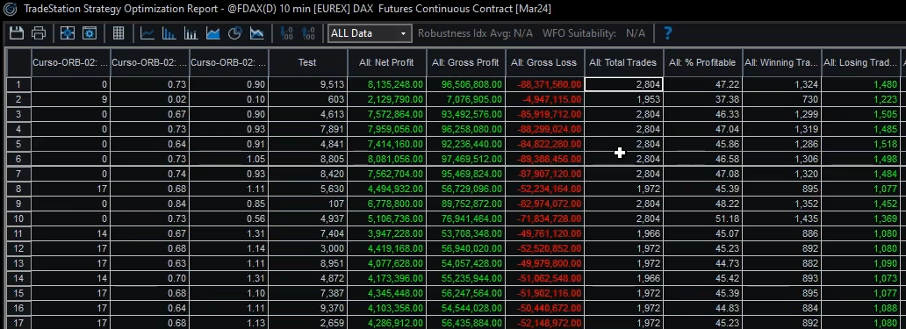 

aquí no con este nivel de trades tampoco podemos optimizar los ocho parámetros y quedarnos tan anchos es decir hay que ir poco a poco lo que decía validando cada variable 

`all_data`  
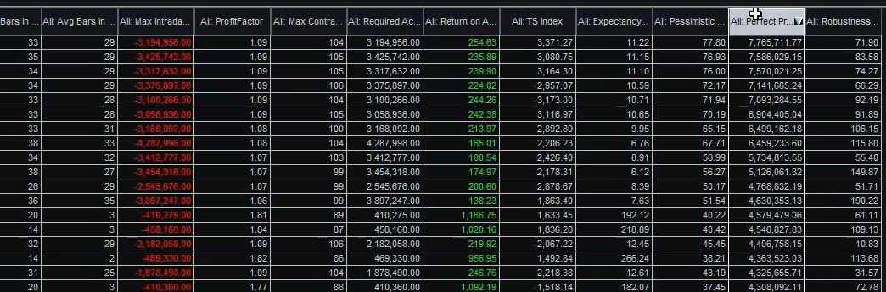 

ver mapas etcétera pero al final claro aquí hay una cosa que no está correcta porque hemos guardado 8000, entonces claro entre los 8000 hay combinaciones no no está bien pero ya digo simplemente es para ver un poco el potencial del sistema 

`all_data`  
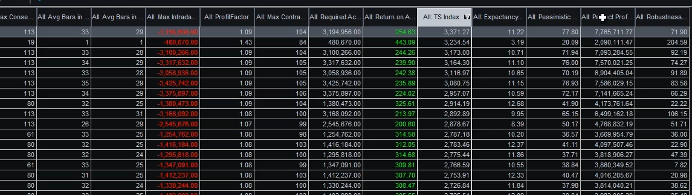 

esto no estamos viendo una optimización bien hecha al uso sino simplemente ver el potencial del sistema a ver qué capacidades nos nos ofrece no

`all_data`  
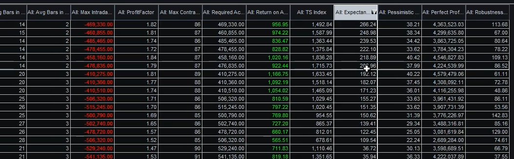 

además hemos bloqueado la hora de entrada la hora de salida no hemos elegido una y está sin más

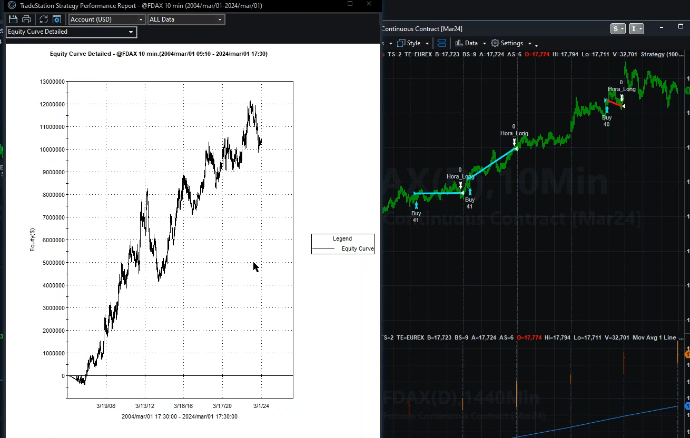 
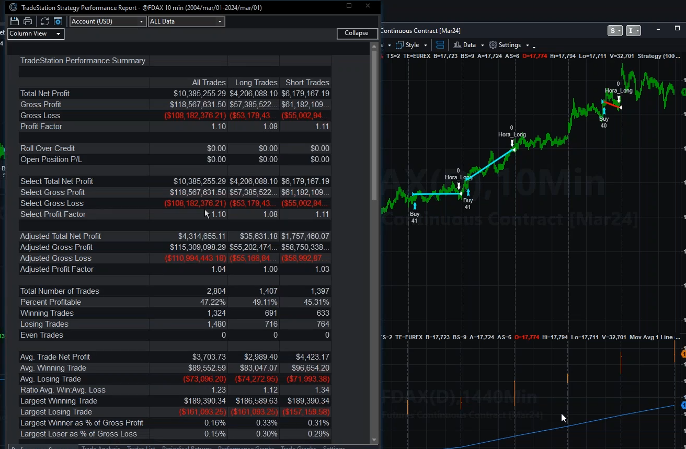 


bueno sí da la sensación de ir algo mejor no alberto algo mejor 1,10 Profit factor, nos ha quedado ahora 

tampoco es una gran mejora pero sí da la sensación de ir algo mejor que antes habría que ver, ya digo no está ni tan solo le hemos dejado madurar y habría que primero mirar las entradas, trabajarlas bien además en el dax hay bastante trabajo porque habría que mirar lo que os digo , primero mirar un poco, valorar el histórico trataremos de hacerlo un poco, es ir a hacer una una optimización tratando de usar también el premarket,,, sin usarlo,,,, ahora está sin usarlo, ahora está directamente abriendo en horario lo que nosotros llamamos horario regular, que es que es eso, el equivalente con la con el contado, vale, es decir de 9 a 5 y media, porque, porque aquí es cuando hay más volumen, es cuando hay más volumen y es donde suele no suele cortarse más el bacalao.

**Experimentación con ventanas de mercado**

pero bueno es verdad que en un orb puede tener sentido a lo mejor te evaluar evaluar evaluar también ese premarket, además curiosamente es bastante simétrico en el largo que en el corto 

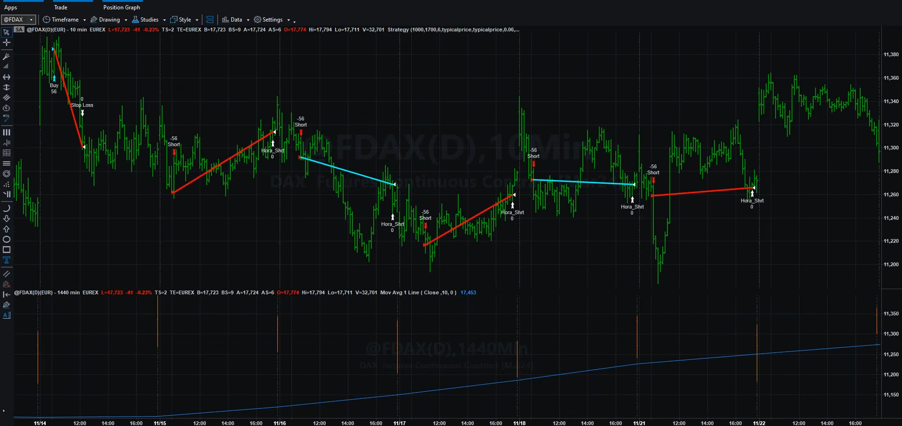 

si además a mí la hora del dax que aqui no la he trucado pero es verdad que empezando a probar una cosa vamos a ir muy muy fuerte es decir empezar muy pronto es que le vamos a dejar sólo tres velitas tres velitas de margen tres velitas de margen y le vamos a salir a las 12 aquí ya vamos a otra cosa mariposa y le voy a quitar todos los filtros le voy a dejar esto sp y tp 
no lo optimizo que quiero verlo así pero le pasaremos el optimizador 

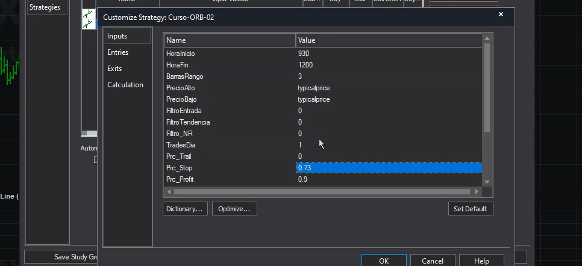 
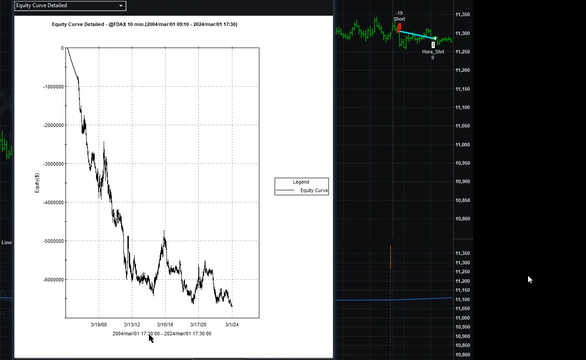 
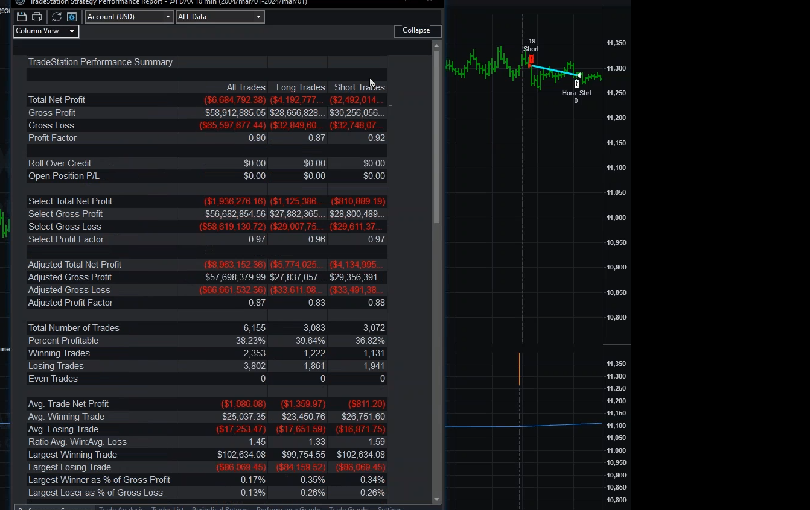 
va de puta madre ... 

voy a probar

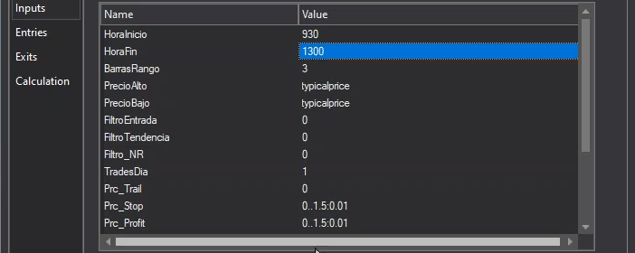 
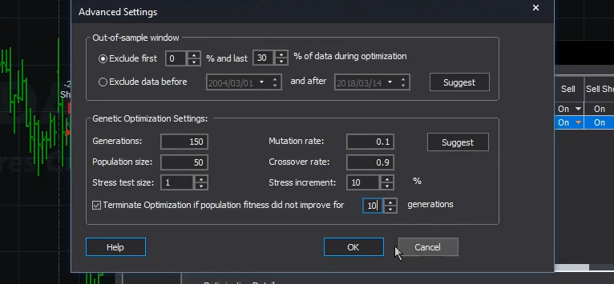 

ahí los unos cuantos papers del de krabbel 

`1.37 Profit factor` coño!
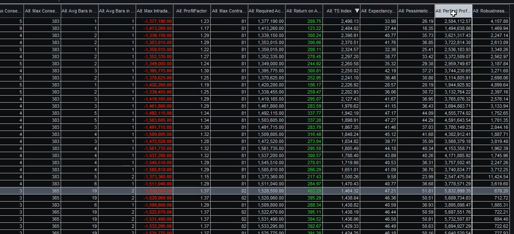 
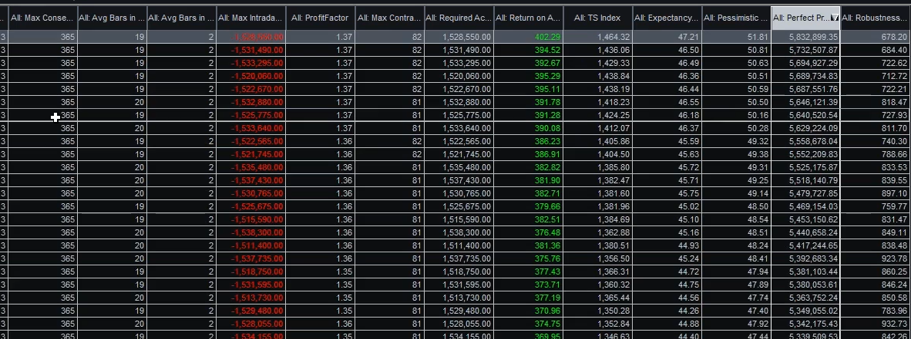  
ni tan mal pues el mejor que hemos sacad, es el mejor que hemos sacado, 

¿con 6.300 trades?  
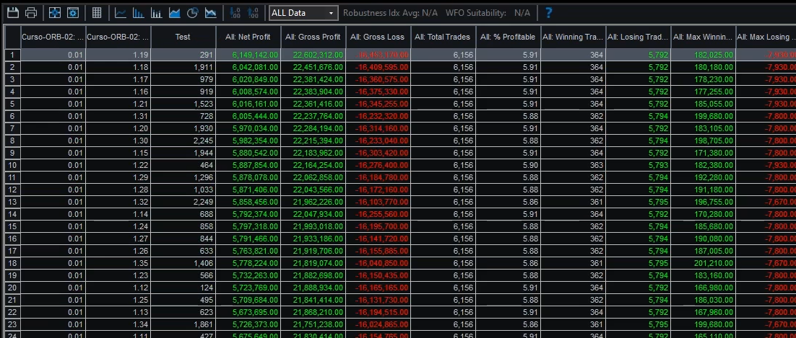 

a esto le falta el lift! hombre claro, está muy muy pegado, nada no os creais nada, y no lo he puesto porque no ajustaba tanto los SP pero ahora los he ajustado ,no me ha acordado, si si 

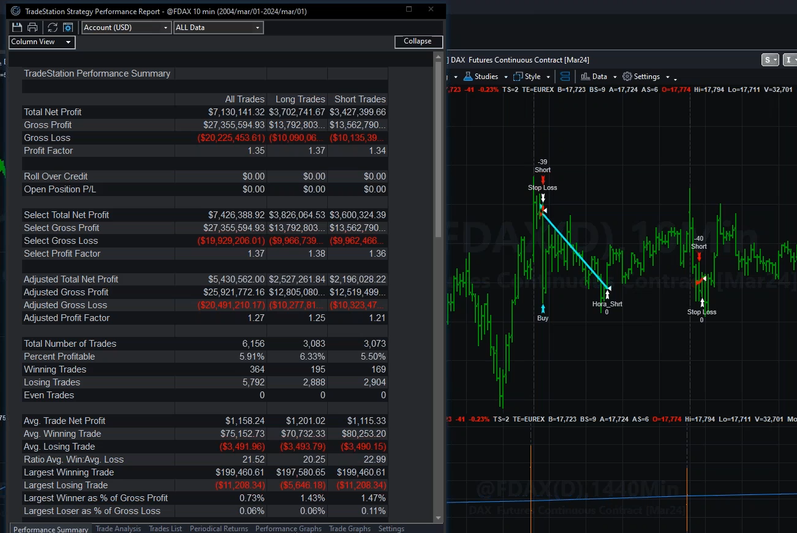 
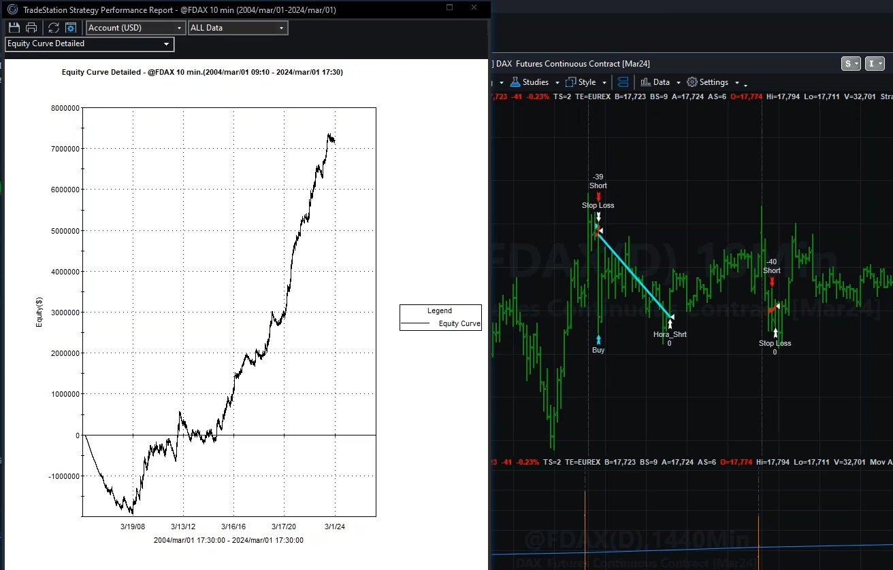 

ahora verán le pongo el lift y veréis si si si ahora veréis ahora veréis ahora veréis ahora veréis en que se queda la curva ahora veréis cuando llega la fucking realidad

`Properties for All`  
`Use Look-Inside-Bar Back-testing` > `Minute`
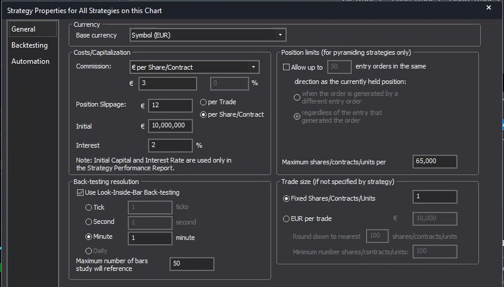 

**Reflexión sobre validación realista y ejemplos de falsos positivos**  
bueno y en un minuto cuidado porque estando en 10... bueno yo creo que sí sí para aquí es poco, pero pero yo creo que le va a dar, le va a dar para, no hay que dejarlo tan abajo el SP ahora lo subo y está... 

veréis en que queda el 1.35

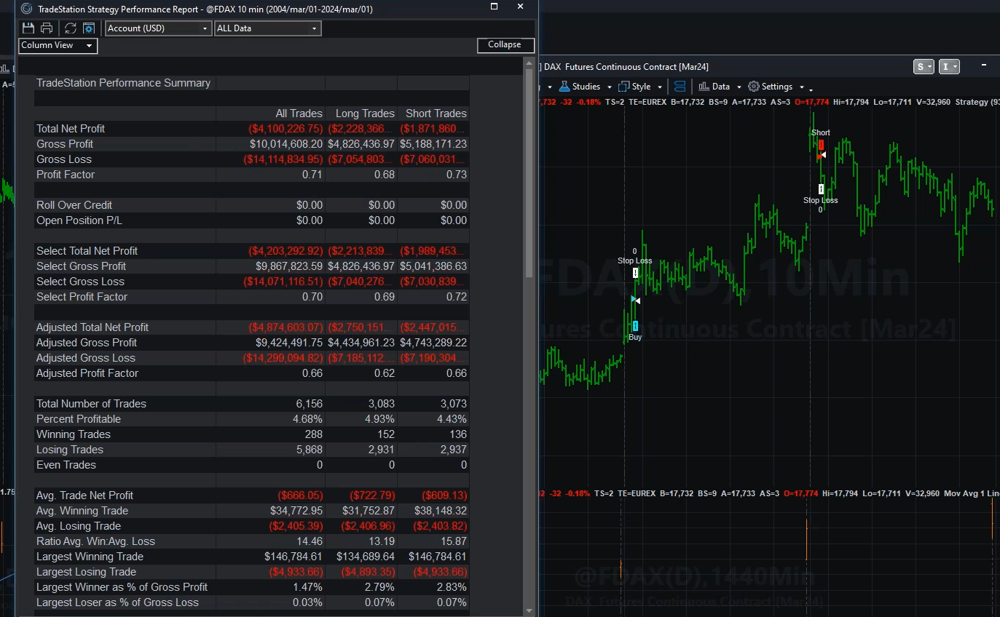 
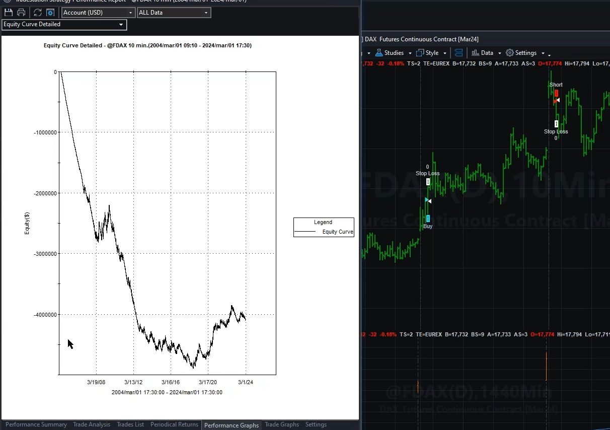 
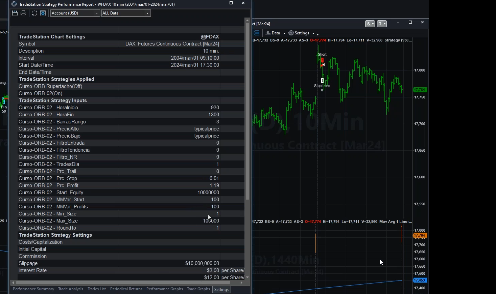 

habéis visto la realidad es un buen ejemplo de lo que supone la realidad sin querer sin querer, en la teórica os dije os enseñé alguno que estaba forzado pues mirar sin forzar me ha salido sin querer, pero esto porque yo lo he visto ya rápido porque ya por la experiencia lo ves pero pero hay que vigilar que vigilar `Prc_Sto : 0.01` nada eso es mentira eso es mentira incluso así podría ser mentira incluso así puede ser mentira

a ver a ver el horario como ha cerrado , no ha dejado correr alguno no ha dejado correr ninguno 

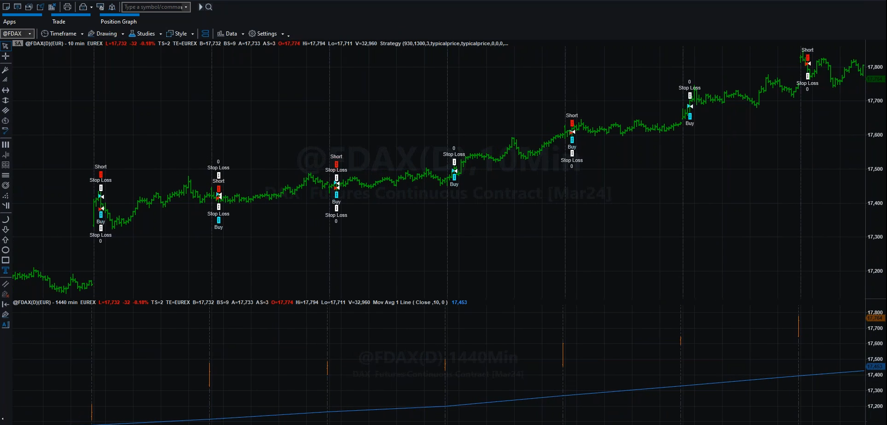 

es que 

tenía un estudio de máximos y mínimos pero no me acuerdo me parece que es de muchos años pero si lo encuentro no te acordas para qué revista lo hice verdad oberto hice un estudio de máximos el que lo hice con el con el de este de con el sobre de Kaufman y que esto lo haremos aquí,,, ya lo haremos aquí,,, cuando lo hagamos lo veréis para este tipo de sistemas biene muy bien porque es es un código que te permite analizar lo que pues yo que sé en qué en qué hora se hace máximos en que hora se hace mínimos y sacas un histograma la mar de apañado pero se hace muchísimos años que lo dice que no estaría actualizado pero pero sería chulo verlo

<div style="border-left: 4px solid #f1c40f; background: #fff9e6; padding: 10px 15px; margin: 10px 0;">
<strong>Data Analysis:</strong>
<br>
<br>
Tenía un estudio de máximos y mínimos, aunque no recuerdo exactamente de cuántos años es. Si lo encuentro… ¿te acuerdas, Alberto, para qué revista lo hice? Era aquel estudio de máximos que desarrollé usando el trabajo de Kaufman.
<br>
<br>
Esto lo haremos aquí más adelante, ya lo veréis, porque para este tipo de sistemas resulta realmente útil. Es un código que permite analizar, por ejemplo, **a qué hora se producen los máximos o mínimos del día**, y genera un histograma muy práctico. Lo hice hace muchísimos años, así que probablemente no esté actualizado, pero sería interesante revisarlo porque sigue siendo un enfoque muy útil.

Para esto viene muy bien. La verdad es que en el DAX muchos máximos y mínimos se forman en la apertura, pero recuerdo que en esa franja entre las 12 y las 13 horas solían aparecer con frecuencia puntos de inflexión.

Por eso lo digo: hay que estudiarlo y analizar esas posibles ventanas de comportamiento. Si identificas una franja con una pauta repetitiva, puedes desarrollar un sistema específico para ese tramo del mercado. Y eso resulta ***extremadamente útil***, porque este tipo de estrategias funcionan realmente bien cuando se adaptan a las características horarias del activo.

Pero ya no me refiero a este sistema en concreto, sino quizá a un *mean reversion* muy específico, centrado en una hora determinada. Hay activos en los que esto ocurre con frecuencia —por ejemplo, en las divisas—, y de hecho se puede aplicar a cualquier activo. Al final, solo se trata de analizar en qué momentos del día suele marcar los máximos o los mínimos, y a partir de ahí construir la estrategia.


</div>
<br>


lo voy a probar más forzado, ahora que ya tenemos el lift ahora que también va a tardar más 

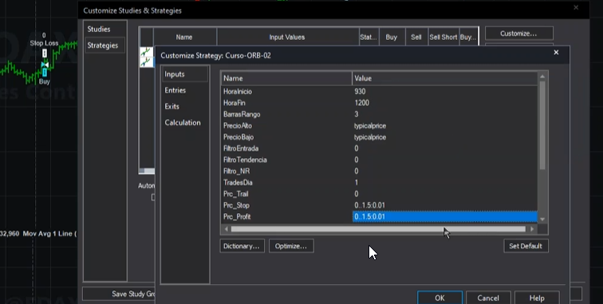 
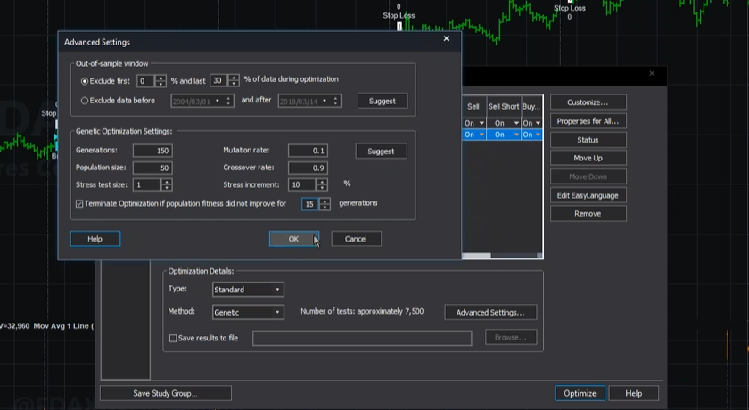 

> ---
>la sesion que viene cerraremos este y haremos breakout de que no sea ORB presentando alguna versión más aprovechable 
> ---

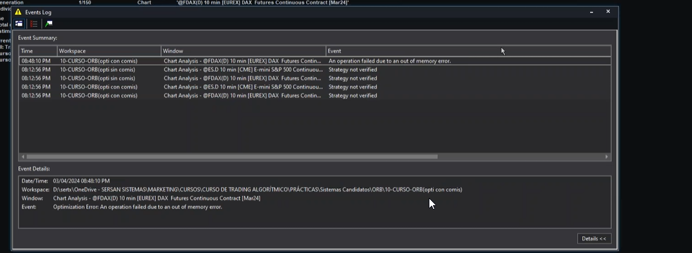 

autos memory error bueno esto está probablemente es fruto de cuando sé ahora ya no ya no hay nada que hacer o sea ya pues que si ahora vuelves a optimizar pasa lo mismo hay que cerrarla asegurarte que se han cerrado los procesos todos los procesos y ya está `PC Administrador de Tareas: todo cerrado en TRadeStation y WhareHouse (EasyLengauje)` 

**Recomendaciones sobre lecturas y método histórico**

ya tengo de hecho por ahí alguno y os recomiendo que os leáis todo esto de claro que me voy a ver a ser muy antiguos es curioso como lo hacía él no porque él no era bien bien un rango no sino sentado mucho la apertura y mucha comparativa de con las velas anteriores de lo que había pasado antes de lo que había pasado antes porque al final esto define mucho a los ORB es el fin de mucho la sorpresa y bueno básicamente haremos eso haremos eso

**Pruebas con nuevos softwares y plataformas**
stamos probando el software y a lo largo del año confío también en probar el de `weblab` porque como se vea que va bien y pueda más o menos integrarlo para lo que hacemos pues igual nos pasamos a web lab para a nivel de ***análisis y backtest*** digo sobre todo una plataforma realmente muy muy guapa en su momento vale y ahora cuando acabemos esto lo lo iremos sacando


**Despedida final y planificación próxima clase**

bueno pues nada hoy acabamos un poquito antes y ya lo recuperaremos que habrá tiempo no se ocupeis y os voy a ir ya dejando hasta el lunes que viene donde como os digo acabaremos el revés y con total seguridad empezaremos otra estrategia ya digo que esta o muy parecida a esta trataremos de presentar una muy parecida a esta que sea algo aprovechable vale que es aprovechable y ya explicaremos un poco lo que he dicho trataremos de tenerlo bastante avanzado que lo enseñaremos aquí pero tendremos de tenerlo avanzado porque si no es imposible por tiempo pero porque ya veis vete por esa que optimizar un poco se te va se te va la hora en un momento entonces trataremos de tenerlo hecho y veremos a ver lo explicando paso a paso pero como os digo primero entradas filtros salidas de acuerdo así que nada más familia hasta el lunes que viene a ver espera espera
