**Introducción**

***como se ve en la imagen tiene un profit factor de 1.09 y un 66.0%  percent profite... que da a entender que el sistema puede tener opciones de valóralo metiéndole mas variables  a lo tengo en e mini sp500***

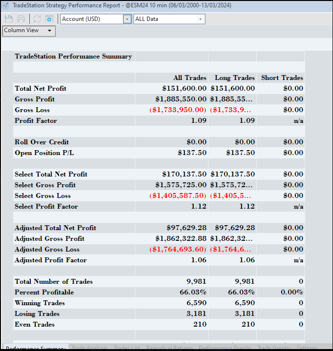
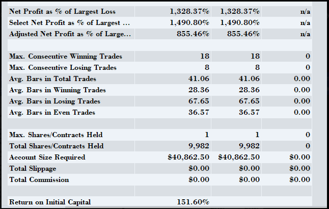

***creo que podría empeorar el beneficio para bajar el riesgo***

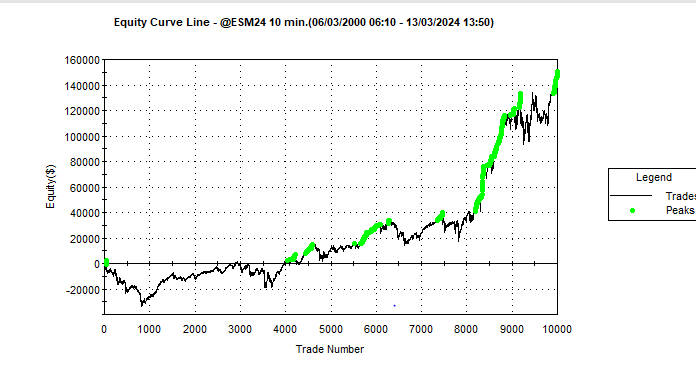


es complicado que sólo ***bollinger bans*** así te rente es complicado te faltan comisiones hay muchos trades bueno 1.09 en todo caso no sería operable, pero bueno no es mal comienzo tampoco hay que decir, que es lo que tú decías, ahí, bueno para punto de partida seguramente no no es malo, no, podías empeorar el beneficio para bajar el riesgo,,, 

***quería entender que se puede tener opciones metiéndole más variables a lo que tengo en el mini sp*** 

si ese criterio estoy de acuerdo, es decir, un setup que lo pones te da 1,09 con 9000 operaciones estoy de acuerdo, estoy de acuerdo que es un setup prometedor, vale, es decir para seguir, de acuerdo, pero bueno habría que mirar lógicamente más cosas como bien dices no hay variables, estoy de acuerdo, estoy de acuerdo, en que probablemente es bueno setup. 

El ***bollinger bans*** es una muy buena señal ya lo comenté en la teoría y tengo pensado, lo que pasa que no sé yo creo que en algún en algún momento no sé dónde va a ser el límite pero en algún momento tendré que decidir no hacer todo lo que quería hacer porque lo que estoy viendo es que si hago todo lo que tenía que hacer será un curso de 500 horas en práctica, entonces no no no puede ser no puede ser, entonces en algún momento habrá que ir ya diciendo bueno esto no, esto sí, porque va a ser imposible es imposible, ya os lo comenté queríamos sobre la marcha y tenía intención de hacerlo todo pero cada vez tengo más dudas de conseguirlo, sinceramente, porque ya llevamos muchas horas siguen quedando muchas tranquilos siguen quedando muchas pero es que aun quedando muchas no creo que haga todo lo que quiero hacer de verdad entonces sigo

***Hola, un par de cosas, hay un error en el codigo de Curso-ORB-04 , donde dice `` barrasRangoDesdeInicio = timetominutes(HoraInicioTrading - sessionstarttime(0,1))/barinterval;` debe ser `barrasRangoDesdeInicio = (timetominutes(HoraInicioTrading) - timetominutes(sessionstarttime(0,1)))/barinterval;`se puede probar el error poniendo `HoraInicio 1000`, y devuelve 7 barras desde las 930***

***Otra cosa, en el codigo Curso-VB-01, hay 2 lineas que comentasteis en las practicas que eran para que no abriera posición y cerrar al instante al haber logrado el objetivo de profit.***
`Open of next bar < High Then`  
`Open of next bar > Low Then`  
***entiendo para que son, pero tenía pensado que EasyLanguage estaba diseñado para impedir leer datos futuros, no existe otra manera de lanzar ordenes condicionando su ejecucion en un rango de precios?***

**Open of Next Bar y lectura de datos**

Aquí tienes el texto **con el léxico mejorado**, **más claro y preciso**, **sin perder ni modificar ninguna palabra original** (solo reorganizo ligeramente algunas comas y conectores para darle fluidez, pero **no elimino ninguna palabra**).

**Open of Next Bar y lectura de datos**

Sí, claro, hay otra manera, otras maneras de hacerlo, y hay veces que no se puede utilizar `open nextbar` por distintos motivos, por ejemplo tener dos datas o algún otro factor. Pero muy importante, `open of next bar` no lee futuro, vale, es muy importante entender bien esto. Esto no es leer futuro. Lo que hace `open of next bar` no deja de ser un truco de lenguaje en el que lo que hace es que, al cierre de la vela en cuestión, retrasa el cierre al tick de apertura, simplemente. No es que lea futuro: es que espera al tick de apertura para leer el código, de acuerdo, y “lee tres datos”, esto en el mastering sale, en el mastering sale en la clase de mastering, se trata porque eso es normal, es algo que no tienen todos los lenguajes, es una utilidad bastante interesante, pero no siempre se puede usar, aunque hay veces que sí viene bien.

Lo que hace es leer del tick de apertura tres datos: el precio de apertura, la hora y la fecha, sólo esos tres datos. Entonces tú puedes usar esos tres datos del tick de apertura para procesarlo en la barra de cierre del día anterior, pero de la barra anterior. Entonces no lee futuro: simplemente espera procesarlo. Por lo tanto yo ahí lo que hago es llamar al `open of next bar` y le digo: si el `open of next bar` es menor que tanto… haz X cosa… pero no lee futuro, ¿se entiende?, espera ese tick, sólo eso. Leer futuro sería usar un dato que no dispones en el momento de ejecutar el código; aquí sí que dispone, por eso se espera, entonces espera, lo lee, y entonces ejecuta la regla que tú le digas, de acuerdo.

Así que es perfectamente útil, y en este caso simplemente es para decir: oye, si hay un gap que supera el precio que yo tengo pensado ya cerrar, ¿para qué voy a abrir? Entonces le pregunto: oye, ¿has abierto por encima de tal precio? Me dice: sí, pues no, no tienes la orden, entonces no la tires. Ya está. Esta manera tiene un poco eso, o para otras cosas se puede usar, pero para sistemas de gaps va fantástico, claro, para sistemas de gaps es fantástico. Pero insisto, no se puede usar en dos datas, por ejemplo. Entonces espero que haya quedado claro esto.


**Optimización de filtros**

***a)Tras ver un video en yt donde se mostraba una función de EL con 500 filtros  me surgió una duda. Tomando como ejemplo el listado en EL de entradas y salidas que se controlaban mediante inputs mostrado en la teoría, me preguntaba si haciendo lo mismo con un listado de filtros e intentar optimizar todos mediante su input para ver cual funcionaría mejor, si esto es una buena práctica o es sobre optimizar. Es decir se busca qué filtro de un listado predeterminado va mejor para el sistema atendiendo a su opti para luego solo quedarnos con el mejor.***

***b)sobre los filtros, a la hora de elegir alguno(en caso de que así sea) tenéis algún listado estándar o varios que por consenso uséis generalmente o los filtros  los elegís  según vuestro criterio o ideas personales en el momento, es decir en que basarse para elegir que tipo de filtro usar dada la gran diversidad de estos que hay.***


bien, filtros, lo que comentas de usar un optimizador de filtros, sí puede hacerse, sí puede hacerse y, de hecho, puede ser buena práctica, puede ser buena práctica y no tiene por qué ser *sobre optimizar*, vale, pero debería estar todo bastante acotado, es decir, no optimicemos ya el filtro también, es decir, si el filtro depende de un parámetro de *volatilidad* encima no optimicemos el parámetro, de acuerdo, es decir, optimicemos el filtro en un parámetro estándar, o sea, probemos ese filtro en un parámetro estándar, otro en otro parámetro estándar, de acuerdo, y lógicamente, como siempre, como cualquier regla, habrá que ver el tema de *significación estadística*, etcétera, etcétera, el número de *trades* que tenemos y podríamos hacer alguna otra prueba de evaluación como *z-score* o cualquiera de estas, pero se puede hacer, se puede, se puede hacer, esto no deja de ser un *builder* y por eso yo, y de hecho en el debate interno, es en algún momento usar algún *builder* para hacer algo de esto, porque esto al final no deja de ser un *builder* implementado en *easylenguaje*; por cierto, el código ese de 500 filtros, si nos lo quieres pasar, sería interesante verlo, yo no sé a cuál te refieres, yo no lo he visto, ya digo, en general no sé si, 500, 500, pero al final, esto es un *builder* implementado en código, un *builder* externo como sabéis, *builder* que hay [XtrategyQuant](https://strategyquant.com/), [AdapterBuilder](https://www.adaptrade.com/Builder/), nosotros tenemos comprado hace muchos años, se puede usar pero se puede usar ya teniéndolo muy cerrado, de acuerdo, es decir, el problema de los *builders* es dejarlos buscar libremente, entonces ya digo, esto por ejemplo hecho en un *builder* no sería mala práctica, no sería mala práctica, pero quiere decir que tú ya tienes tu *setup* de entrada, de salida, y tratas de buscar filtro para mejorar la entrada entiendo lo que estamos hablando, puede ser buena práctica, pero como con todo hace falta buen criterio y *prudencia*, vigilar,,, un buen filtro debe quitar más malas que *buenas*, hay que ver, hay que ver una vez siempre cuando comparas filtro es cómo va el sistema antes de filtrado y filtrado... ver un poco los parámetros clave, proteger aciertos, beneficio medio de positivas y negativas, número de positivos, número de negativos, es lo típico porque ahí lo que buscas en un filtro es quitar malos, estamos de acuerdo no, es decir, buscas quitar malos, pero hombre, si solo quita malos es un poco sospechoso también, tiene que quitar más malos que buenos, pero algún bueno también tiene que quitar, si solo se quitan malos eso es feo,

entonces, a cuál filtro elegir, bueno, no tenemos una lista porque nosotros no hemos sido nunca muy amantes de los filtros, eso es verdad, hemos filtrado poco, por esa como sabéis siempre *prudencia estadística* que tenemos, donde siempre tratamos, nos pesa mucho la significación estadística, y filtrar es perder *trades*, eso es obvio, pero siempre nos ha costado o, dicho de otra manera, los filtros no acaban de aportar mucho o lo suficiente para aplicarlo, pero al final más o menos si podemos en algún momento, si queréis, tratar de dar algunas referencias, con el ORB por ejemplo ya lo dimos, y a medida que vayamos viendo sistemas lo iremos dando, pero lógicamente a cada tipo de sistema lo vamos dando, pero al final no me complicaría en demasiada vida, me explico, es decir, porque entonces sí que 500 filtros me parece una locura, no me complicaría en exceso la vida y si tenemos que complicarla tanto seguramente ya es que el sistema no vale, si tienes que filtrar tanto y buscarle tantos filtros mejor busca otro sistema, entiendes, entonces filtros que hay al final?  pues las cosas obvias,,,

* ***la volatilidad***, en casi todos los tipos de sistema suele ir bien filtrar o puede ser una cosa a evaluar, de acuerdo, filtrar volatilidad y desde ahí cuidado puede ser
    * vía ***atr*** interna
    * vía externa vía ***vix*** por ejemplo  
    también hay de este tipo en *intermarkets* con por ejemplo la curva del vix, es decir, los distintos periodos de eso quería, es una de las cosas que tengo apuntadas ver, pero es bastante avanzada y si lo vemos lo veremos de lo último, de acuerdo, porque es una cosa bastante avanzada pero tiene que ver con filtrar la volatilidad pero por lo externo, vale, un poco externo con los distintos vencimientos del vix
* ***tendencia*** lógicamente el *régimen de mercado*, lo que técnicamente se llama régimen de mercado, que podemos simplificar que recordaréis que hay seis: 
    * volatilidad a la baja, 
    * volatilidad al alza, 
    * tendencia alcista, 
    * tendencia bajista, 
    * y neutral, 
    * en ambos casos pues esa mezcla de todo pues se puede dar seis, nueve,   
    es al final un poco porque puedes hacer alta subiendo, alta bajando, baja subiendo, baja bajando por ejemplo,,,

<div style="border-left: 4px solid #27ae60; background: #ecf9f1; padding: 10px 15px; margin: 10px 0;">
  <strong>📏 Nota técnica ampliada</strong><br>
  En análisis cuantitativo, el <em>régimen de mercado</em> suele modelarse mediante indicadores de estado como volatilidad realizada, volatilidad implícita, pendientes de curva VIX, ratios VIX/VVIX, coeficiente de Hurst, medias móviles de estado o filtros de Kalman para detectar cambios estructurales.
</div>

pero bueno, en los dos vectores principales siempre son volatilidad y tendencia, y eso al final te da un régimen de mercado, entonces ahí pues hay muchos, régimen de mercado, desde los más *sencillos* con una media *móvil*, hasta los más complejos con coeficientes de *Hurst*,,, o sea, al final hay muchas cosas a mirar, pero repito, yo soy muy amante de la simplicidad como sabéis, y por lo tanto, eso aplica a todo también a los filtros, también a los filtros.


# Revisión de Apolo short

**Inicio de la revisión de Apolo Short**

Apolo es un sistema que está hoy en día operando; es un sistema que opera largo y corto, pero que de hace bastante tiempo —aunque al principio no era así— se decidió hacerlo, se decidió hacerlo en determinado momento, se decidió probar si aportaba valor hacerlo, como ya sospechábamos, pero al principio operaba con el mismo *set* en el largo y en el corto. Algo que hay autores que recomiendan —y que en sí es verdad que puede ser una buena práctica— pero que no necesariamente no hacerlo es mala, se entiende; es decir, es preferible… puede serlo, pero sobre todo en *equity* normalmente hay *especialistas de cortos*, *especialistas de largos*, porque, por lo de la *volatilidad* que os decía realmente, y por la dinámica propia del mercado, donde el régimen de mercado es muy alcista y por lo tanto es distinto, es decir, el largo normalmente deja correr, quiere correr; en cambio el corto pues no quiere correr. Al final, *corto* es un sistema más de *oportunidad rápida*. Es bastante obvio, es bastante obvio.

**Sesgo alcista y dinámica de mercado**

Pues bueno, bastante obvio, pues por esto, por esto:


Aquí sólo he cargado un periodo de… bueno, si cargo un *workspace* de largo plazo que tengo por ahí:

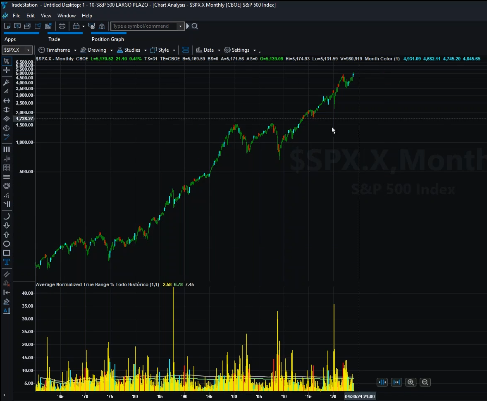

Pues esto, de acuerdo? Por esto, porque digamos que el sesgo de largo plazo es ligeramente alcista, ligeramente ligeramente alcista, *viento de cola*. Claro que hay periodos que pueden ser de muchos años de lateral, de corrección, o congestión, etcétera; hay muchas, muchas variedades, pero en el largo plazo pues es más bien tendente a subir, por lo tanto ya añade un sesgo distinto, distinto.

**Separación de parámetros largos y cortos**

Entonces bien, Apolo, Apolo opera ya hace tiempo con parámetros para corto, parámetros para largo, y hay distintos *sets* dentro del mismo sistema; en este caso, el mismo *set* opera con distintos sistemas.

De hecho, hemos hecho un pequeño cambio en Apolo que no es de las revisiones que hay pendientes —de cosas de evoluciones— sino una *simplificación del código* que implica al final quitarle un *input*, y de hecho os lo digo abiertamente: en este caso este sistema usa el *ATR*, y el ATR en algunas épocas se ha utilizado y ahora ya hace un tiempo que no recuerdo que no se optimiza, y está fijo, de acuerdo? Está fijo en —creo— que está fijo en 15 y en 15 barras, porque en su momento ya se hizo un estudio muy exhaustivo y se ha revisado hace poco y es una zona que está bastante estabilizada, con mapa —que luego veremos mapas y demás— y por lo tanto nos gusta que esté ahí.

**Diferencia entre TP largos y TP cortos**

Entonces lo que os digo: tiene largo y corto.

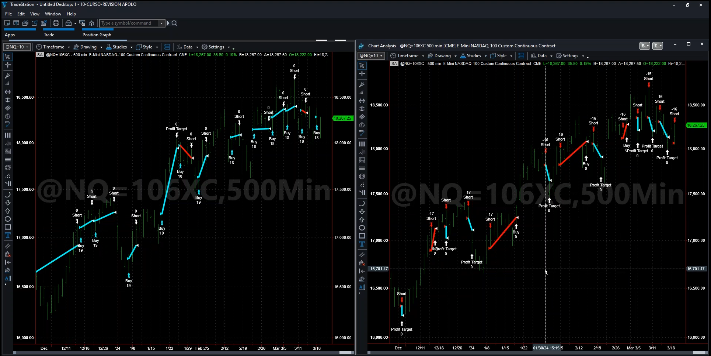

Bien, el corto lleva una época mala y que en algunos *sets* se ha convertido en demasiado mala, vale? Entonces “demasiado mala” se ha ido degradando.

El sistema de largos —ya digo— tiene distintos tipos, pero como veis, en general… por ejemplo este, este *trade* es este *trade* por ejemplo; no es un *trade* de tres o cuatro días que hace un *TP* bastante interesante, interesante:

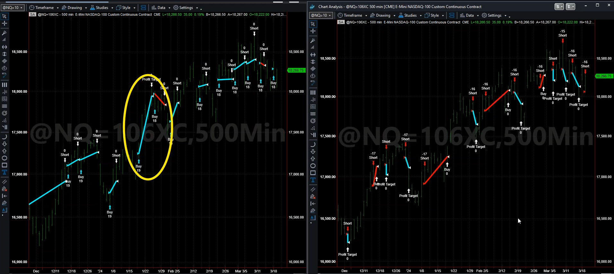

En cambio los *TPs* —a ver si hay alguno aquí— aquí hay algún TP claro; los TPs del corto es que es otra cosa: es de muy poco recorrido.

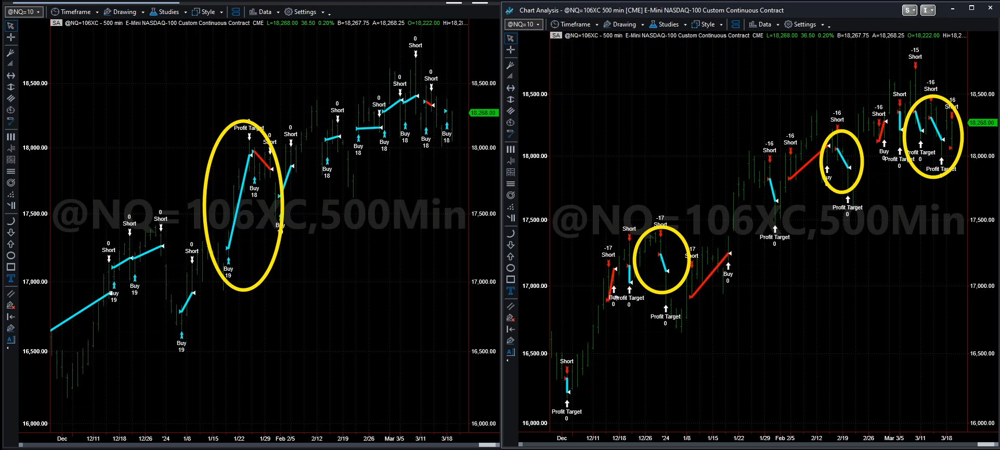

Esto es lo que busca el corto: corto tiene un TP siempre más cercano, y os lo comentaba varias veces en la teoría, también en la práctica y de cierta manera pensando en Apolo. Es decir, realmente una de las mejores maneras de bajar el riesgo es tener un *TP cercano*, de acuerdo? Es decir, en datos de riesgo lo baja mucho porque sale rápido, y de hecho Apolo trabaja con *ST en el lado corto mayor que TP*, es un *stop* que salta pocas veces, y ese es su problema: que en los *sets* que van… hay *sets* que dejan correr un poco más, hay *sets* un poco más parecidos al largo… no tanto, pero hay algún *set* más parecido, y hay *sets* como este de la derecha que veis que es muy muy rápido, de acuerdo?, que hace TP muy rápido. Entonces, cuando tiene 2, 3, 4 fallos, y son fallos de cierta importancia —como alguno que veis aquí— pues bueno, duele más.

**Protocolo de supervisión**

Entonces, a lo que vamos: ¿dónde empieza esto? Bueno, esto empieza con el *protocolo de supervisión*. El protocolo de supervisión, ya os lo comenté en la teoría, es algo en lo que tenemos campo de mejora; ya tenemos cosas hechas, pero tenemos campo de mejora, y de hecho pues mira una de esas cosas que os comenté que en el curso nos puede servir a nosotros aprovecharlo es esta, de acuerdo?, es esta. Más que mejorar en darnos cuenta es *automatizarlo* un poco, porque es verdad que el protocolo de supervisión lo puedes complicar todo lo que tú quieras, pero a la hora de la verdad —no solo, pero normalmente— si tú… digo para vosotros que empezando, que no os volváis locos, de acuerdo? Sobre todo aquellos que estáis empezando: hay muchas maneras de hacer esto y *mirando un performance report* es una de ellas.

***mirando un performance report***
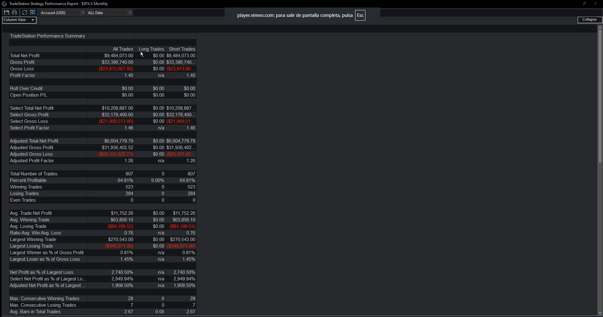

***mirando la curva de drawdown***


***mirando la curva del sistema***
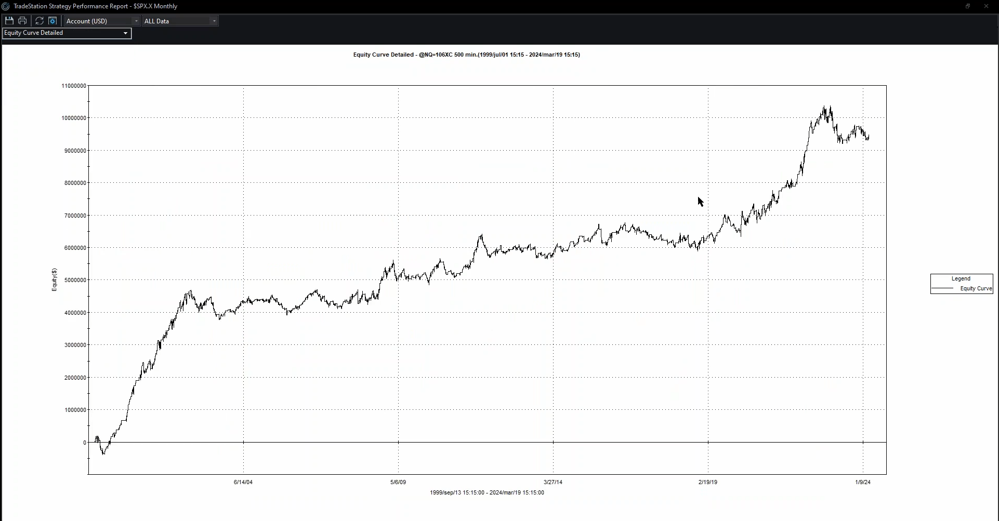

***los trades***

* tú si vas aquí puedes ir a buscar el trade más largo
* puedes buscar el peor trade, el *largest losing trade*
* puedes ver cuándo ha sido marzo, el 16, etcétera

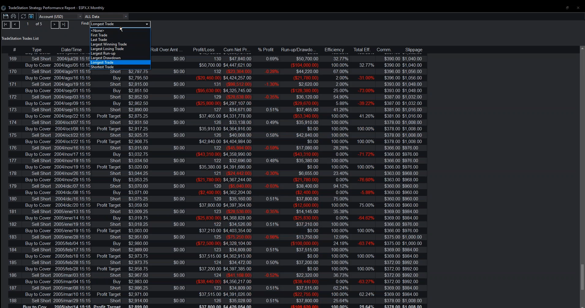

De acuerdo?? Puedes, puedes mirarlo. Una de esas maneras es esta, lo cual tampoco penséis que obligatoriamente hace falta tener un código y todo súper complicado; pero bueno, sí que es verdad que una de las cosas que caracteriza la profesionalización es esta: automatizar más las cosas.

Pero como al final aquellos que ya nos conocéis —no sólo de ahora del curso sino hace tiempo— ya sabéis que me quejo siempre de la falta de recursos y de tiempo, es así. Porque al final todo esto lleva trabajo y hay que decidir, cuando eres una empresa o un proyecto, es igual, tienes que decidir en qué gastarse el tiempo, los recursos, y al final no es infinito, igual que no lo es el dinero tampoco lo es el tiempo, y hay que decidir dónde haces cosas, y por eso tenemos siempre una reunión mensual, damos prioridad a una cosa, a otra, y hay cosas que están en reuniones de hace años porque no hay manera de que se considere que es prioritario respecto a otras cosas, y esto hace que hayan cosas que a lo mejor podrían hacerse mejor pero ya están bien así, porque dedicarle un montón de horas pues no te renta.

**Código de extracción de métricas**

Vale, entonces aquí por ejemplo nosotros hoy en día sacamos estos datos:

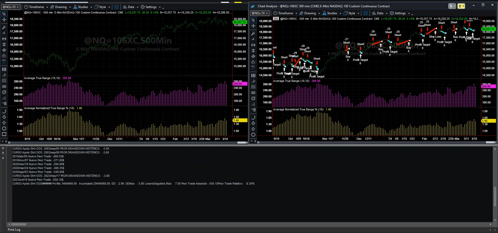

¿Qué datos sacamos? Sacamos simplemente datos que ya veíais ahí en el *performance report*:

Pero que los sacamos vía el `print`, de acuerdo? Que esto es todo vía código. Este código —ya me adelanto por si alguien lo pregunta— Alberto no me ha autorizado a entregarlo todavía, todavía, porque es que lo quiere mejorar antes de entregarlo. Esto se llama *orgullo de programador*. Entonces yo entiendo que antes de acabar el curso —ya os lo dijimos— que lo haremos, ya os daremos un código y puede que algo mejor. Yo creo que ya está bastante bien, pero Alberto dice que no, que si me ocurre entregarlo ya, que lo quiere mejorar. Entonces… pero bueno, al final informa del mayor *drawdown*, cuándo lo hace, cuándo hace peor *trade*, y cuándo hace peor serie de *trades*, de acuerdo?, que son datos de riesgo bastante importantes.


**Métrica N-trades y porcentaje**

tenemos uno que hacemos en revisiones más profundas vía excel ya os lo comenté en práctica, perdón la teoría y creo que lo dije en la teoría que teníamos planes es una de esas cosas pendientes, a ver si aprovechando lo acabamos de desarrollar, que es lo de contar n trades, n trades, vale, pero no en valor absoluto sino en porcentaje, acuerdo, en porcentaje porque en valor absoluto es muy complicado porque se desvirtúa este es un problema a veces hay que calcularlo en porcentaje, y cuando acumulas trades eso ya no es tan fácil a nivel de histórico pero creo que lo conseguiremos,,,

**Puntos clave detectados en Apolo**

entonces aquí ahora mismo pues vemos que este sistema hizo peor trade en octubre del 23 y que su drawdown record lo hizo histórico en 380 en mayo del 23 

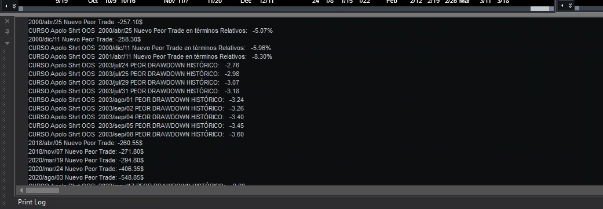

tras ese se revisó y este ahora vuelve a estar cerca y ese set estando justo sigue operativo 

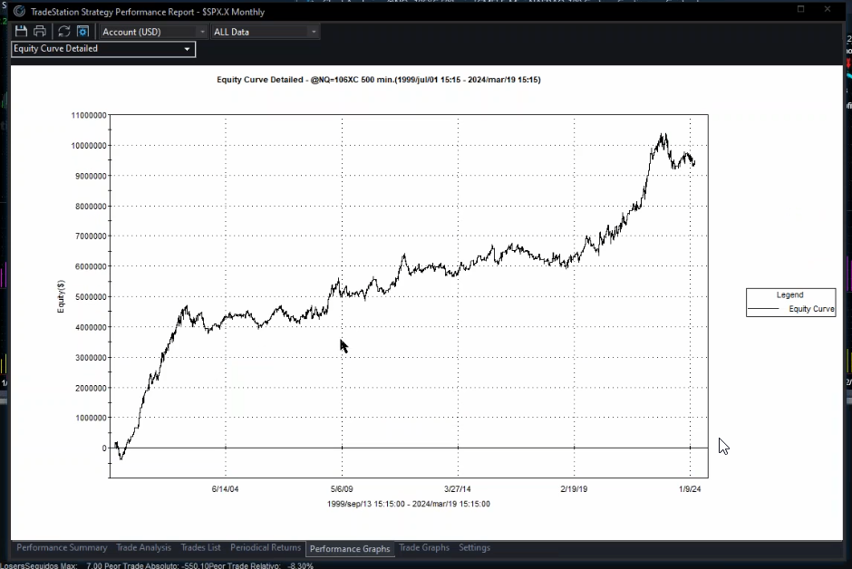

luego llegaremos a esto porque hoy veréis incluso os enseñaremos los sets que cambiamos y toda la manera en que lo analizamos vale


Entonces en un momento determinado salta la alerta, que ya nosotros ya veíamos que no iban finos, de acuerdo, es decir ya lo ves, es que la mayoría de veces tú ya lo ves, pero lo cual no quita que no vaya bien tener un código que te avise porque así pues puedes olvidarte, 

Estos son distintos sets exactamente y son dos sets, distinta combinación de parámetros de la misma estrategia, sí Apolo hace esto 

## Inicio de la revisión y preparación del mapa de optimización

bien pues entonces vamos con la revisión, la primera cosa que hacemos es 

***un mapa de optimización de prácticamente o sino prácticamente todo el histórico***

`mapa short`  
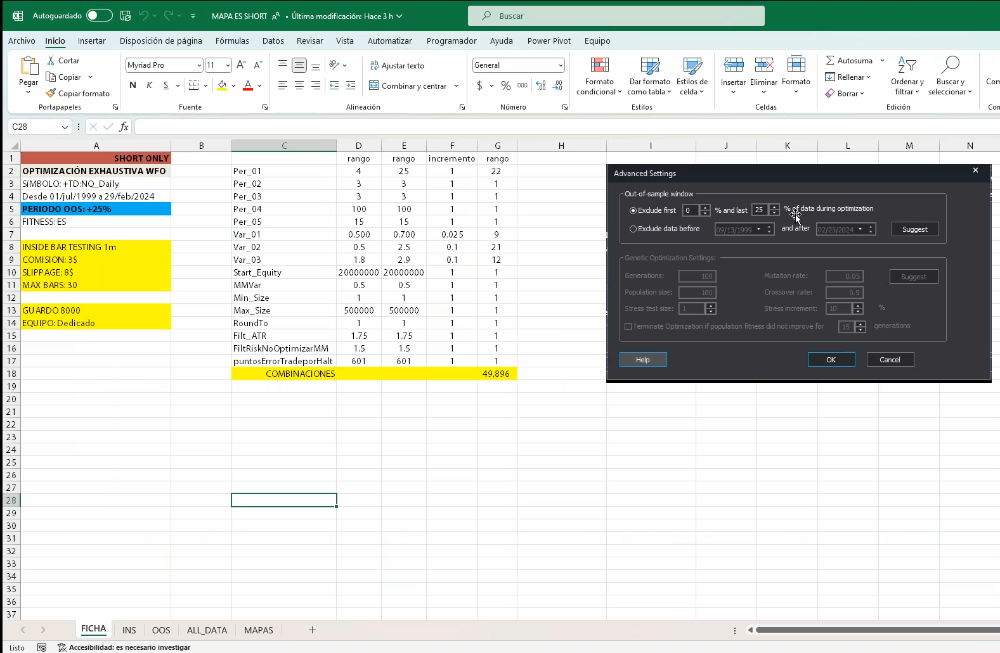


todo parte lógicamente de una optimización que la hacemos con `out of sample` detrás, es decir, cercano del 25% por ciento porque mirando los cortes pues se ve que puede estar ahí interesante y todo el histórico disponible, desde julio del 99 hasta el 29 de febrero del 2024 esto lo hacemos en datos de tic data que nosotros compramos pero podría haberse hecho perfectamente en los datos de TradeStation con ***tres dólares de comisión*** con ***ocho dólares de slippage*** etc


**Inputs seleccionados para la optimización**

Pero no se hace de todos los *inputs*, no se hacen de todos los *inputs*; los *inputs* que tiene el sistema son todos estos,

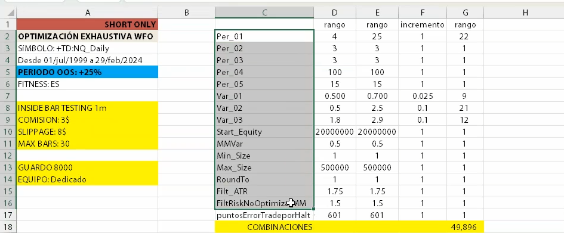

no todos son optimizables; los que les hemos dejado el nombre

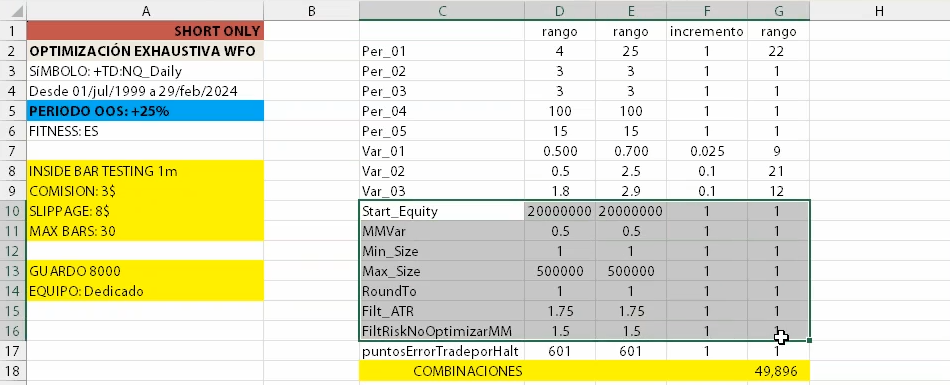

son del algoritmo. Bueno, este último `puntosErrorTradeporHalt` es cuando hubo el *halt* en el *covid*; tuvieron varios *halt* y hubo problemas de ejecución, y entonces consideramos que ahí hay un factor que se benefició de manera artificial y lo penalizamos, lo penalizamos en 600 puntos ahí porque la ejecución no fue real. Eso puede pasar, probablemente pasa, por un *tic* y el *Slipage* lo controla; en este caso no fue así, el gráfico marcó ejecutado y ese día, para que me entendáis —y digo porque esto…—

Imaginaos que aquí se cierra una operación:

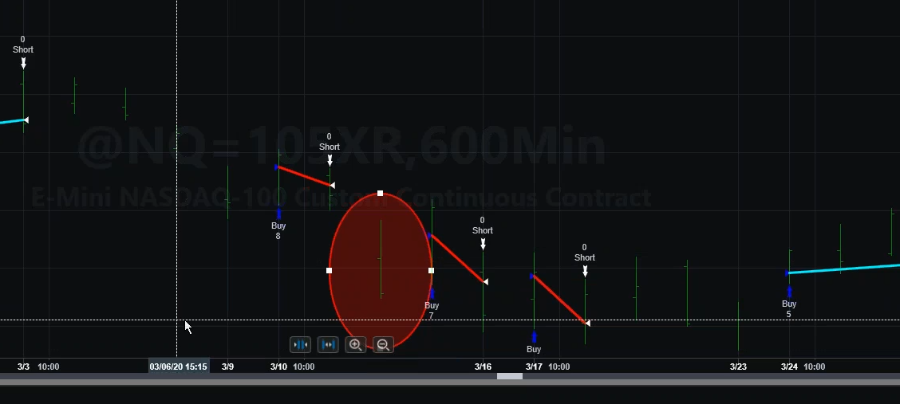

imaginad que habría aquí, pero realmente, como el mercado es falso, no te deja ejecutar: ejecuta 600 puntos por debajo. Entonces, bueno, pues eso lo implementamos en el código para que en el optimizador no sacara partido de una situación que fue falsa; no pudiste operar ese precio, aunque ponga que abrió ahí. Entonces, cuando hay algo así que no es real, que te has podido aprovechar, o que penaliza, pues es mejor dejarlo puesto en el código porque así, si tú optimizas, no saque partido de una cosa que no fue real. Es una cosa muy puntual, pero bueno, os explico para que lo sepáis: es ese, esos puntos que está implementado y está como *input* `puntosErrorTradeporHalt`.

**Inputs que sí se optimizan**

Y luego el resto `filtRiskNoOptimizarMM`; esos son variables de la gestión monetaria, al igual que esta `MMVar`, que es el porcentaje, es la *f*, la *f* de la gestión monetaria, el saldo de la cuenta inicial, el lote mínimo, el lote máximo, de tal manera que si le pones uno, pues lo bloqueas, redondea a uno si quieres redondear a otro número, y ya está. Todas estas son variables de la gestión monetaria, vale, que veremos en algún momento, veremos en algún momento en detalle; esto lo comenté en la teoría cuando haremos alguna clase dedicada solo a la gestión monetaria.

**Variables realmente evaluadas en el mapa**

Entonces, ¿qué variables tocamos? Hay una variable del indicador; hay otras dos variables que no se suelen tocar; esta tampoco; esta es, de hecho, una prueba que se hizo una vez de un filtro que está ahí, no sé, creo que alguna vez lo hemos configurado, pero nuevamente quiere decir que no actúa. Ese es el valor que os decía de la *atr* que tampoco se optimizaba. Y luego vienen los tres —podemos decir— filtros… filtros en el sentido estricto, sino que es un porcentaje multiplicador: *bar 01* al final es un modificador de la orden de entrada, y *bar 02* es *tp* y *bar 03* es *stop*, no hay más. Entonces aquí solo se analizan en el mapa estas cuatro variables: el indicador, el multiplicador de entrada, el multiplicador del *tp* y el multiplicador del *stop*; esos cuatro es lo que se hace en el mapa.


<div style="border-left: 4px solid #27ae60; background: #ecf9f1; padding: 10px 15px; margin: 10px 0;">
  <strong>📏 Nota técnica</strong><br>
  La estructura descrita —un indicador principal y tres multiplicadores paramétricos— se ajusta a arquitecturas comunes en sistemas cuantitativos de diseño modular. Es frecuente en frameworks inspirados en autores como *Howard Bandy* (autor de “Quantitative Trading Systems”), donde se separa el núcleo determinista del sistema (*signal core*) de los modificadores de escala (*scaling layers*) aplicados en entrada, TP y Stop.
</div>

<br>
<br>

**Cantidad de combinaciones y por qué se usan tantas**

para hacer un mapa guardamos `GUARDO 8000` todo lo que nos deja TradeStation que son 8.000 porque? porque al final en el mapa me interesa ver realmente cuántas más combinaciones posibles mejor acuerdo en el mapa es importante que haya los menos huecos posibles  entre combinaciones, por eso idealmente hay que hacer la exhaustiva vale exhaustiva,  entonces bueno esto al final da 49.000 combinaciones que en exhaustiva pues se hace depende del equipo pero tardaba unas horas, con el lift activado y todo, que eran unas horas depende lógicamente de la potencia de la máquina, 

como ya visteis en la teoría o veis en cualquier optimización de tres sesiones

* Una que es `AllData` que reúne los dos periodos, 
* el periodo `InSample` que es el optimizado, 
* el periodo `OutOfSample` que es el no optimizado, 

en este caso el último 25% del histórico. InSample, OutOfSample, y OldData que los suma todos. Estos datos al final los llevamos a Excel.

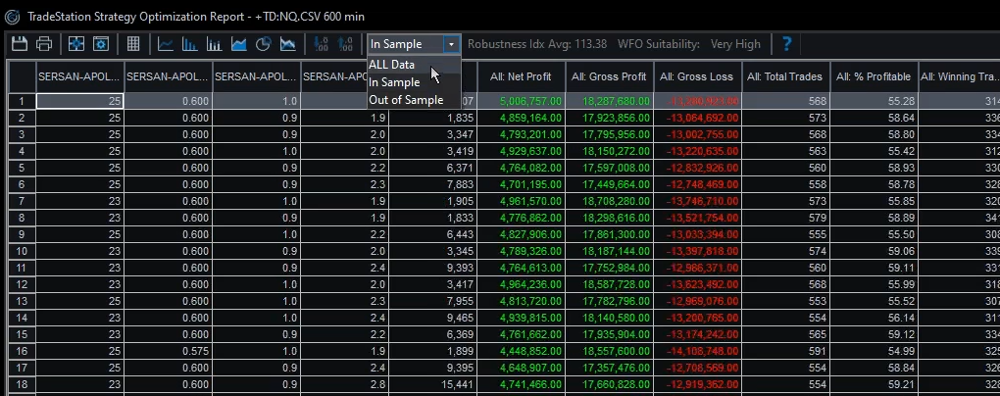
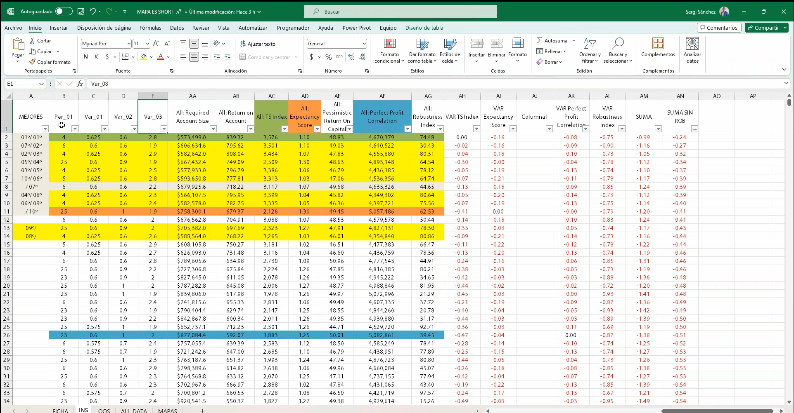


todas las hojas simplemente hacemos una estadística descriptiva abajo del todo también cuando hay 8.000 

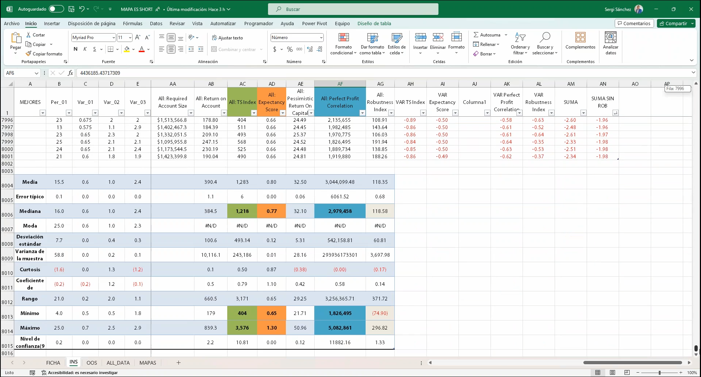  
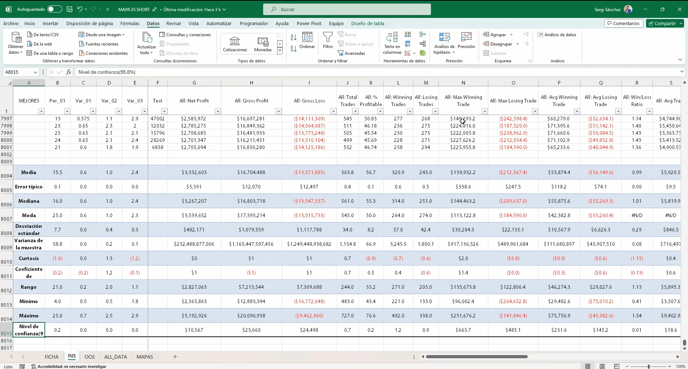  

esto sale directamente del propio excel en datos en análisis de datos, estadística descriptiva, que saca todos los parámetros que tú le has puesto. Aquí abajo 

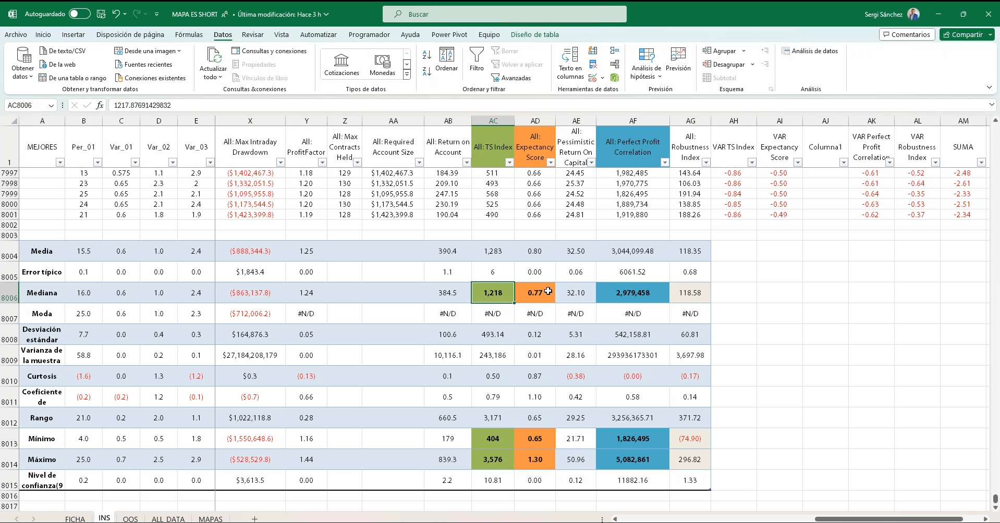  

pues marcamos por ver más rápido mínimo máximo y mediana es mejor estimador para la mayoría de casos la mediana que la media la mediana es mejor estimador nuevamente cuando hay outliers cosas bastante habitual en el trading pero bueno que también si usas la media no pasa nada si la media si la media la media no son iguales la moda recordar que eso es en este caso una moda pero si eso será recordar que es una de las características que tiene una distribución normal que lo visteis o lo vimos esto en la clase de porfolio en la práctica hay una ***clase de porfolio*** donde se habla del bar el bar todo esto y ahí se ve bastante todo este tema vale

**Normalización de métricas y selección de parámetros**

hacemos como ya os expliqué por norma siempre los exes no creo que ya hacemos de manera en los ex y es un excel de búsqueda de zonas muy inicial 

en un sistema que no conocemos mucho mejor no lo hacemos pero normalmente hacemos esto : normalizamos las diferencias entre tanto tsi expectancy como ppc y robustness, recordar que robustness compara beneficio medio analizado con beneficio medio analizado out of sample con in sample, y automáticamente se normaliza con el valor máximo, y de ahí sale una suma de los cuatro de las diferencias respecto a su máximo 

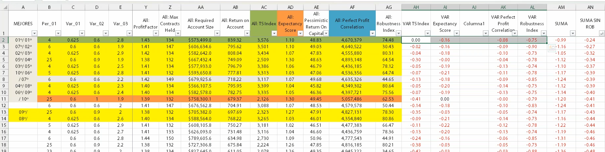  

aquí lo veis a ver aquellos que entran con este valor si veis que sale la fórmula 

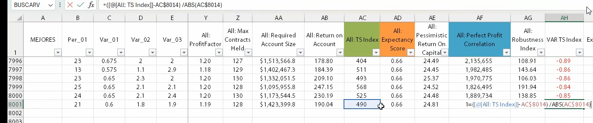  
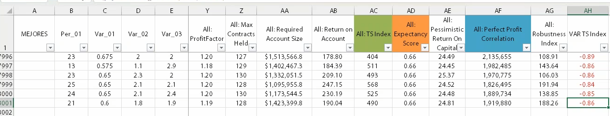  

y es este valor menos este valor dividido por este valor vale dividido por este valor  
eso es normalización típica respecto al máximo lo cual te dice que este valor es del máximo es un 0.86 del máximo simplemente para pues sumarlos todos y de esta manera buscas un equilibrio entre todos el que tiene un valor de suma más bajo quiere decir que en estas cuatro referencias cumple más equilibrio y todos da buenas notas vale buenas notas

este por ejemplo es en verde pintamos el mejor tsi en naranja pintamos el mejor expectancy score y en azul pintamos el mejor ppc 

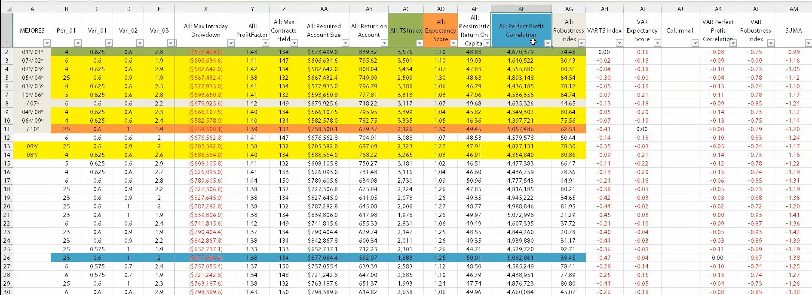 

pero luego repito se ordena o bien por `suma` o bien por `suma sin rob`, ¿cuándo se usa uno u otro? cuando optimizamos con el `Out of sample` al final es decir ahora en la actualidad o lo más cercano a la actualidad entonces usamos `SUMA` porque? porque el `Out of sample` es cercano y nos interesa. 

al final usar el valor de `robustness` o no usarlo para los cálculos de esta suma, es simplemente si yo quiero sobreponderar o darle importancia a algún dato que compare el `insample` con el `Out of sample`, el único dato aquí que compara eso es el robustness, robustness compara justamente el rendimiento de un periodo con el rendimiento del otro por lo tanto, si yo quiero darle más peso al auto sample vale usando esta variable LO HAGO, luego de hecho si ordeno por esta variable 

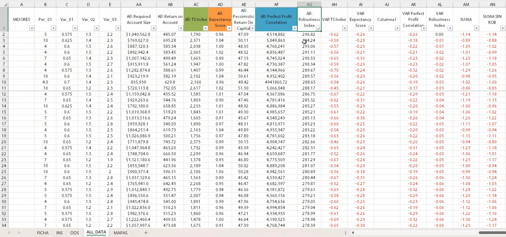

pues al final ***estos son los sets que han ido mejor en el `Out of sample`***   
pero sólo eso tampoco lo quiero porque también quiero tener en cuenta las otras variables que tienen en cuenta todo el histórico y por eso eso lo hace la `SUMA` porque la suma tiene en cuenta este este este y además este 

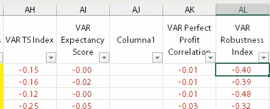 

en cambio este último `SUMA SIN ROB` no tiene en cuenta, provoca otra ordenación distinta que lógicamente es parecida muchas veces no pero no es exactamente 

**Por qué se usan 8.000 combinaciones**

bien esto, (ahora vamos al mapa luego iremos a los sets), aquí no me importa los sets, no me importa si los sets son iguales o sino porque he elegido 8.000, elegir 8.000 es elegir muchos valores, elegir 8.000 al final recordar que esto funciona que optimiza por una función,,, (este creo que es el MAPA ES SHORT pero se ha hecho para los tres, he escogido este que ha sido aleatorio)  

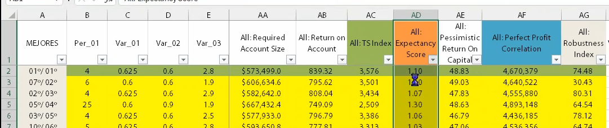 
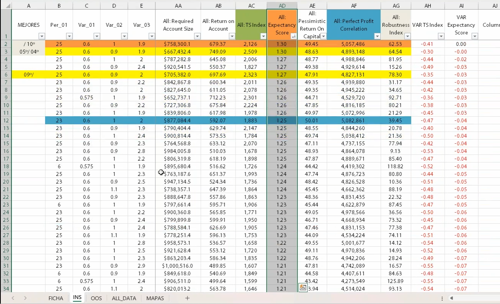 

yo optimizo por esta variable por `expectancy score` y escoge los 8.000 mejores en `in sample` los 8.000 mejores y de ahí de esos 8.000 que ha encontrado calcula qué hubieran rendido en el periodo `Out of sample`, lo pone aquí 

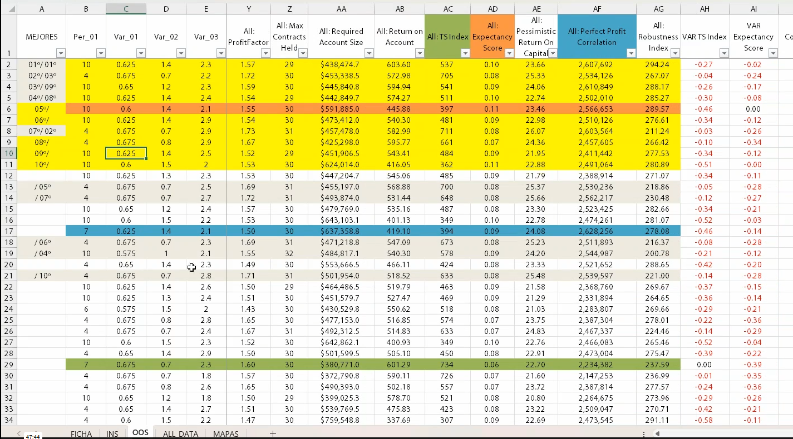 

y luego suma los dos aquí 

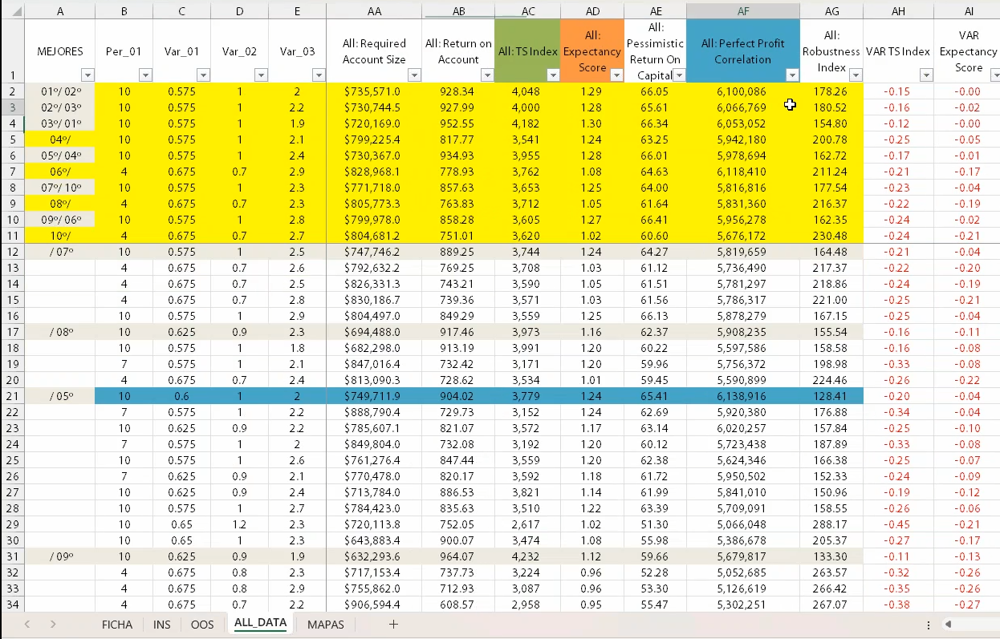 

el que manda es el `in sample` el que manda en el sentido que es el que controla el resto de datos 


por lo tanto estaremos de acuerdo que lo bueno es que el `OutOfSample` e `in sample` se parezca pero eligiendo 8.000 me da igual igual porque además he dejado elegir demasiado por lo tanto lo que encuentre como mejor dato aquí puede ser fruto de una sobreoptimización luego veremos que no es tan distinto pero podría ser

**Utilidad real de tener tantas combinaciones**

a mí para qué me sirve tener 8.000 pues para hacer esto 

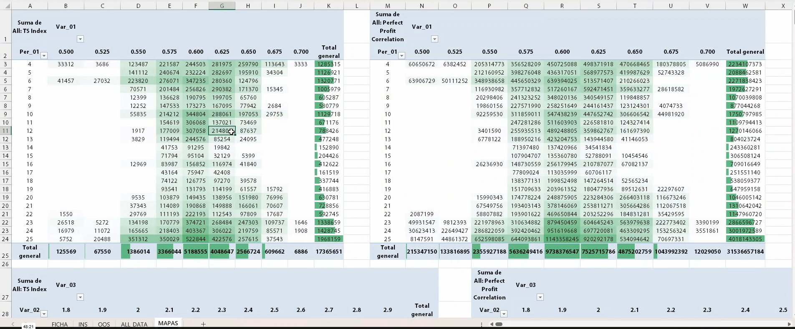 

para hacer mapas

**Construcción del mapa y por qué preferimos tablas dinámicas**

Los mapas en esta estrategia cómo planteamos los mapas? yo ya os comenté en la teoría que nos gusta mucho verlos en tablas a nosotros, tablas dinámicas, no es necesario hacer el típico mapa gráfico y visual, 

por ejemplo multicharts lo hace está bastante chulo, está bien, es muy aprovechable de multicharts, pero TradeStation no lo hace entonces nosotros lo hacemos en excel y para hacerlo en excel o sea este mapa a mí no me dice nada más 

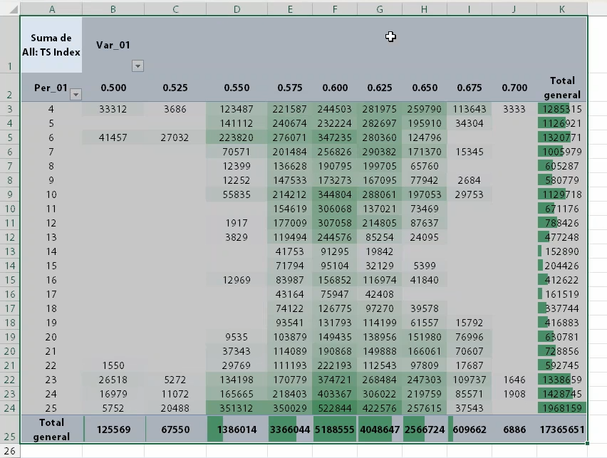

si hago un mapa aquí que esto es tan fácil como seleccionar la tabla dinámica hacerle así que me lo encuentro aquí superficie y ya está hecho vale a mí esto me dice más un poco me dice lo mismo que aquí pero lo veo mejor aquí

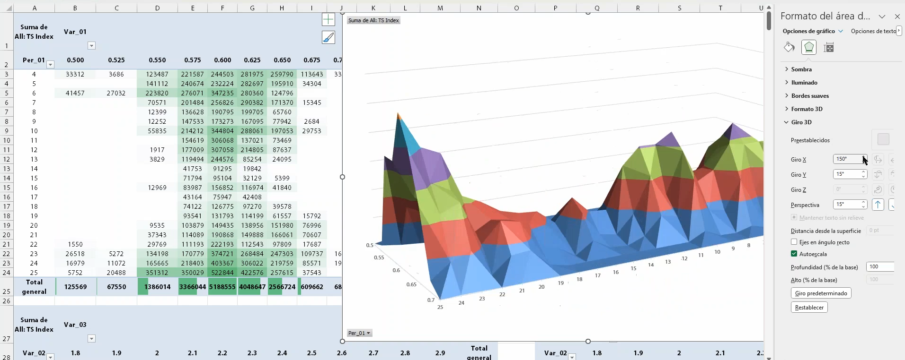

ahora os explico por qué entonces

**Problemas del efecto “escala” al visualizar mapas 3D**

además del efecto mapa es el efecto escala que siempre se llama de los gráficos pasa igual aquí, vale porque tú dices joder está muy puntiagudo,,, seguro?? vamos a hacerlo menos puntiagudo 

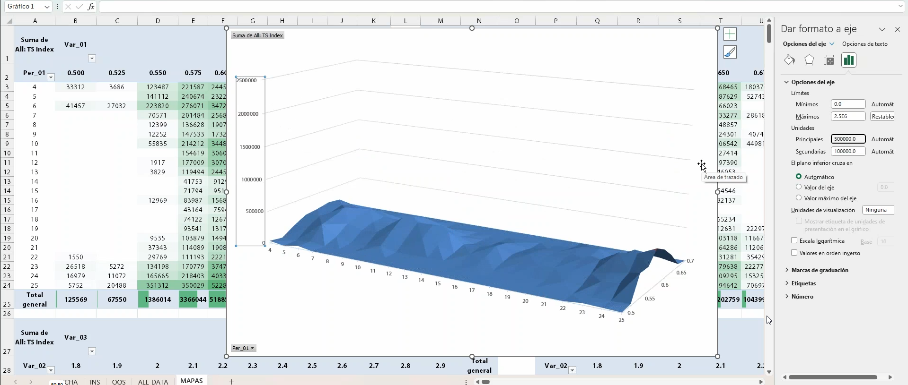

(ironía) "ya está mucho mejor fíjate qué llanura más magnífica de parámetros tenemos es una cosa súper estable y súper robusta en que ya está sistema a operar,,," (ironía) me entendéis no es decir que al final el efecto escala condiciona totalmente el efecto visual 

**El truco de Multicharts: la marca de agua**

para eso tiene multicharts aquello de la del nivel, ya lo visteis en la teoría en algún sistema lo hemos enseñado, bueno creo que el otro día en el sistema que hicimos al principio lo enseñamos también, lo enseñamos que ahí enseñamos multicharts por eso aquí pues vamos otra vez más a excel, vamos enseñando un poco de todo, eso es lo de la marca de agua, os acordáis 

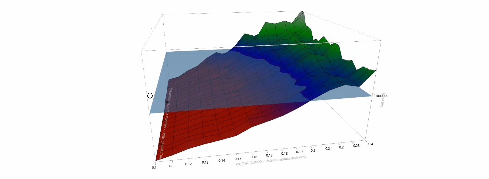

la marca de agua que viene muy bien, evitas un poco ese efecto con esto ese efecto escala lo puedes tú jugar así porque el efecto visual cambia totalmente la mente la mente entonces así con esto puedes jugarlo entonces aquí sí viene muy bien porque es una herramienta que ya se ha pensado para eso tiene esto para mitigar y viene bien pero en excel a mí me gusta más la tabla

**Por qué preferimos tabla dinámica frente al gráfico**

prefiero la tabla la tabla en excel, recordar que es una tabla dinámica que excel hoy en día hace de manera automática tú simplemente seleccionas los valores y le dices aquí insertar tabla dinámica y ya está hecha de verdad no estoy exagerando es un poco saber de excel 

lo peor es el blanco al final lo peor es que no haya valores a nivel de mapa , solo blanco verde y entonces ya claro el blanco es el que tiene poco valor es casi blanco es parecido a este pero no está entonces este es perfecto este es perfecto
así pues bueno se ve muy bien por un único color 

3 mapas, los he hecho por :
1. ***Suma de All : TS Index***
2. ***Perfect Profit Correlation*** 
3. ***Expectancy Score*** 

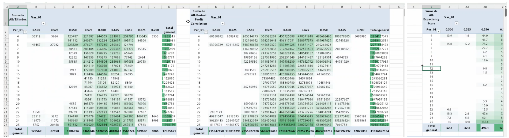

esto realmente no es necesario lo he hecho para demostraros que no es necesario porque al final el vector clave que hace que el mapa sea bueno o malo es el hecho de ***aparecer*** y lógicamente su valor también tiene importancia pero es al final lo que hace es 


acumular todos los


**Origen del valor “suma” y cómo se genera en la tabla dinámica**

valores que dan 4.05 en el resto de variables, todas, y la relación a uno y te dice qué valor da la variable de la suma podría podría usar el producto podría usar otros ahora si yo veáis de dónde viene esto porque ya está montado porque si lo montamos todo no hacemos clase ya lo vimos en la teoría es aquí 

En una columna esta `Var_01`  
en fila está `Per_01`   
y los valores que calcula es suma de `All_ppc (Perfect_Profit_Correlation)`


esto es configurable esto ya digo es pelearse también poco usar la ayuda de los programas de acuerdo es decir los programas la mayoría tienen buenas ayudas usar la dinámica y poco a poco mirar vídeos decir hay cosas 

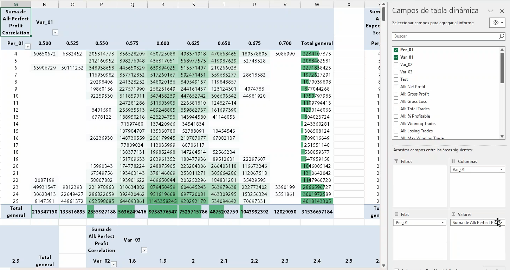

o sea el curso tratamos que sea completo pero es imposible que sea profundo en excel profundo en estadística profundo en econometría profundo es imposible no hacemos mil horas o más no más entonces claro damos las puntas las cosas clave enseñamos lo que nosotros hacemos es así esto es lo que hacemos nosotros y a partir de ahí claro mira voy flojo de excel bueno pues vamos a buscar un curso de excel y mejoro mi excel voy justo de programación bueno pues voy a buscar un curso voy justo tienes que ir reforzando un poquito aquellas áreas aquellas áreas porque tratamos de explicarlo por encima lo que no es propiamente la actividad como en este caso excel no lo usamos como actividad principal lo explico un poco pero claro no puedo en profundidad porque si no es que como digo estaríamos 2000 horas vale

**Por qué se usa “suma” como agregación y qué aporta visualmente** 59:36

entonces aquí dentro de `suma` yo podría haber elegido otro elegir el recuento promedio máximo mínimo producto vamos suma y ya está eso es la suma de todos los valores entonces al final colorcito es muy visual y también los totales generales porque esto cuando hay la dinámica aquí en el diseño hay una configuración de tabla dinámica nosotros aquí usamos el esquema que nos gusta usamos totales generales para filas y columnas y subtotales para ninguno entonces porque ese total al final te está diciendo todos los valores que tiene 0 5 todos los valores tal todos valores tal pues esto es muy visual vale rápidamente yo veo per 1 con bar 1 cómo relaciona per 1 con bar 1 cómo relaciona ignorando el resto ahora veremos el resto

**Primeras zonas fuertes del mapa y necesidad de comprobar vecinos**

y aquí rápidamente pues yo veo que hay dos zonas de per 1 buenas está aquí 

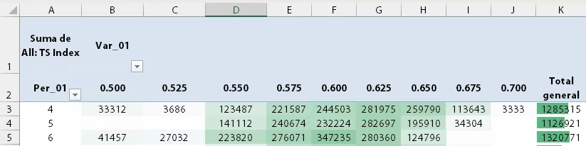

en ambas me toca a lo que veremos en ambas me toca esto no es deseable 

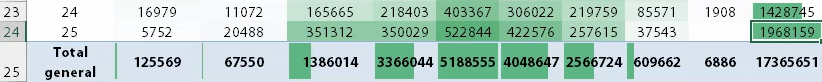

quiero decir que aquí me está diciendo que me he quedado corto debería haber ido al menos a 26 o 27 porque a mí me interesan mucho en los mapas los ***vecinos*** los vecinos me interesan mucho el mapa no es tanto elegir un set, al final puedo elegir un set por mapa pero no es elegir un set, sino que el mapa sobre todo me sirve para ver claramente lo que descarto, vale, y para ver dónde están las zonas más estables, es un ***análisis de sensibilidad***, aquí quiere decir... "a ver pero este"... bueno... luego veremos si ese me gusta, si tiene un perfil más adecuado al riesgo,,, pero hombre sí está lo que yo pero lo deseable es que esté dentro de las buenas zonas del mapa, eso es lo deseable lo muy deseable.

**Necesidad de evaluar estabilidad y degradación entre parámetros cercanos**

pues el mapa es para ver cuán estables son los parámetros, pues aquí el 4 lo mismo debería ver el 3 para ir bien

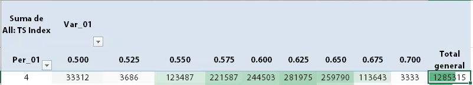

si luego al final quiero operar con el 4 debería ver el 3 vale porque si en el 3 me pasa como ahora vais a ver en otro parámetro que me degrada en picado, el 4 no me interesa, entendéis. Como un poco este caso, el 10 que este aquí saca la cabeza pero sus vecinos justito

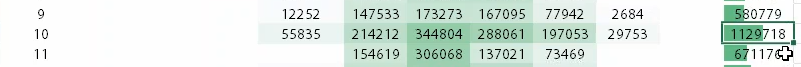

luego lo veremos lo veremos, lo veremos si me lo quedo o no me lo quedo, bueno tampoco es un desastre final recordar que ya estar aquí en esa zona ya es bueno , lo pero es no estar.

***Mapa de entrada:***

bien aquí relaciono **Per_1** con **Var_1** ese es el valor del indicador y **0.500** es el multiplicador del indicador por lo tanto al final es ***entrada*** de acuerdo esta tabla de aquí `Sume de All : TS Index` me está evaluando un poco la entrada y ver qué combinación de entrada puede ir mejor

***Mapa de salida:***

y aquí tengo stop contra tp ***salida*** 

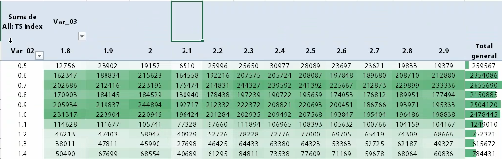

stop contra tp, este sistema solo sale por SP o por TP por la salida contraria, que no está contemplada,,, salida contraria es decir cuando aunque sean solo cortos si fuera largo pues cierra, cuando iría largo cierra, por esa combinación de parámetros.  Entonces aquí ya veis lo que os decía, parece que 0.60 de los 60 es muy bueno también es su vecino 0.625 no está mal su vecino 0.565 y tampoco está mal su vecino es decir aquí tenemos cuatro zonitas bien rodeadas

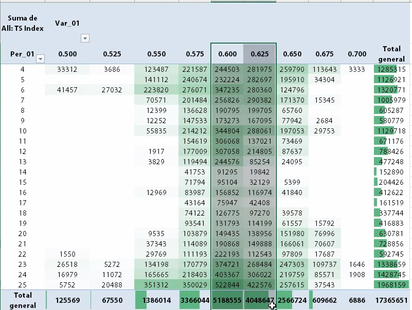

**Detección de zonas débiles y vecinos inestables**

a partir de aquí ya 0.650 bueno ya su vecino no es tan bueno y aquí 0.565 su vecino ya no es malo del todo pero ya este vecino es malos malos vecinos entonces bueno lo ideal lo ideal lo ideal son estos dos son estos dos 


**Mapa TP–Stop: holgura, tolerancia y degradación progresiva**

lo primero que se ve es que el stop pues el stop da igual porque es un stop bastante holgado 

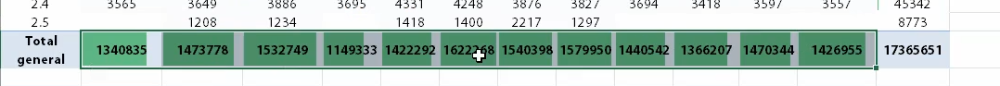

aunque lógicamente salta más 1.8 que 1 que 2.9 

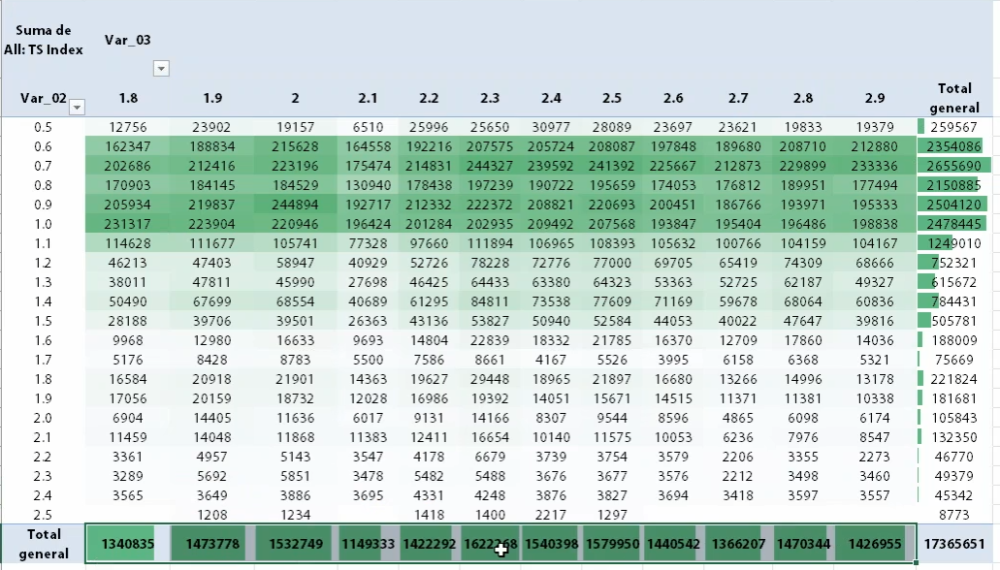

y de hecho reconozco que esperábamos un poquito más de granularidad aquí 


esperábamos un poco más porque casi no la hay esto casi dice da igual elige el que quieras casi elige el que quieras además en todos los valores. apenas en `2.5` hay algún blanco yson valores muy altos ya de tp valores muy altos de tp vale

**Lectura del TP: sensibilidad y estabilidad por rangos**

y en el tp pues sí, un tp bajo, algo que nos sorprende algo que no sorprende 


pero pero dentro de no sorprender es muy positivo esta progresión, pero fijaros lo que os digo en el 0.60 que os decía antes el 0.5 es drama se me hunde, por lo tanto pero el 0.60 estoy operando muy justo, estoy operando muy justo, es decir, no es recomendable como mínimo habría que coger 0.70, pero podría elegir 0.70, 0.80, 0.90, incluso 1 porque aquí degrada pero podemos decir que degrada de una manera más tolerable pero bueno a partir de ahí lo ideal ideal sería de 0.70 a 0.90 pero yo aceptaría 1 en este caso

**Consideraciones específicas por activo: Nasdaq y comportamiento histórico**

más en un sistema recordar que es un sistema que va en el nasdaq corto que va en muchos más índices y activos cuando se creó se creó así pero ahora lo estamos estudiando en el nasdaq y está operando el sistema, de hecho ha abierto cortos hoy, en algún set, entonces bueno como veis en tp pues más bien rápido, a medida que va degradando también degrada de manera bastante progresiva (fíjate en `Total general`),  esto está bien es más o menos progresiva hasta llegar a un punto donde realmente degrada mucho, pero es muy bueno que haya valores hay valores en la zona de blancos abajo, de acuerdo, es decir en todos los casos hay valores. Fijaros en TSIndex en muchos no hay valores, cuando aquí en toda la zona de tp stop en todos prácticamente aparecen apenas aquí todos aparecen valores entre los 8.000. ***está muy bien distribuido*** el `tp` y el `SP`, tiene mucho margen tiene bastante tolerancia , son parámetros con tolerancia. En el mapa TSIndex no la hay tanto, sobre todo en este filtro de entrada Per_01 es un filtro que tiene una tolerancia justa

**Revisión adicional: el input duplicado, el indicador modificado y los incrementos**

una de las cosas que hemos revisado en esta revisión vale donde primero lógicamente se plantean , todo al 100% no podemos hablarlo por razones obvias pero también por tiempo, entonces aquí hubo un replanteamiento de este ayudante input `Per_01` al final antes eran dos y nos dimos cuenta de que de hecho era hasta incorrecto el código que eran demasiado rebuscado usar dos y decidimos sacar uno y cambiar el indicador no usar el que es original y crear uno propio para hacerlo distinto y ahora pues operar con un indicador propio que tiene una pequeña modificación que usa el mismo parámetro para esto

**Incrementos de parámetros: prudencia, sensibilidad y ajuste fino**

y también revisamos analizamos revisar los incrementos de estos tres filtros 

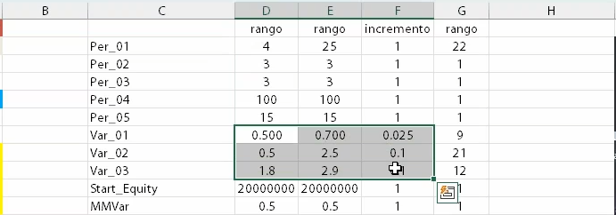

esto recordar que lo detallamos bastante en la clase de desarrollo teórico  donde hablamos de prudencia con los incrementos con las optimizaciones, porque yo puedo poner aquí en `Var_01` 0.0025, o puedo poner aquí 0.00001, entonces al final usar uno u otro no deja de ser un análisis de sensibilidad que también se hace con mapa 

Es decir, ver mapas que varían, `MAPA ES SHORT` este lo hicimos previamente, y ver los sets que hay, qué variación, también se mira mucho aquí en la tabla, es decir cómo varía el mismo set con el siguiente incremento, por ejemplo ordene primero por este `Var_01` ,  

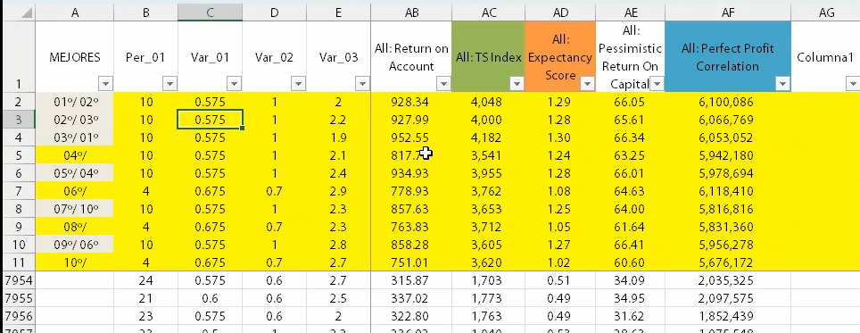

y ordeno luego por este 

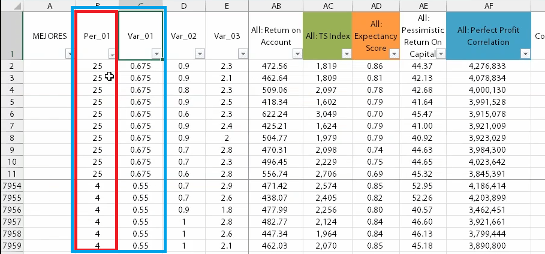

y entonces automáticamente aquí me quedan todos estos ordenados vale entonces ordeno `Var_02`

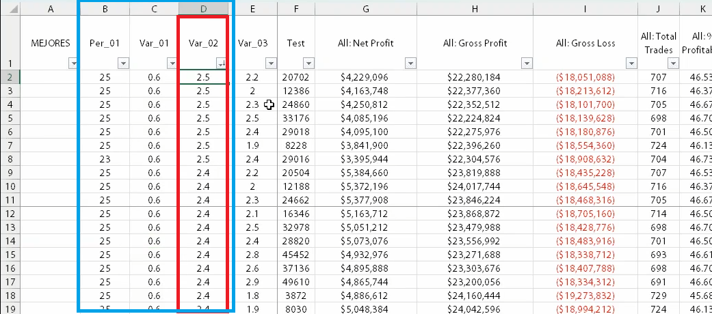

ahora tengo los cuatro ordenados y bloqueados 

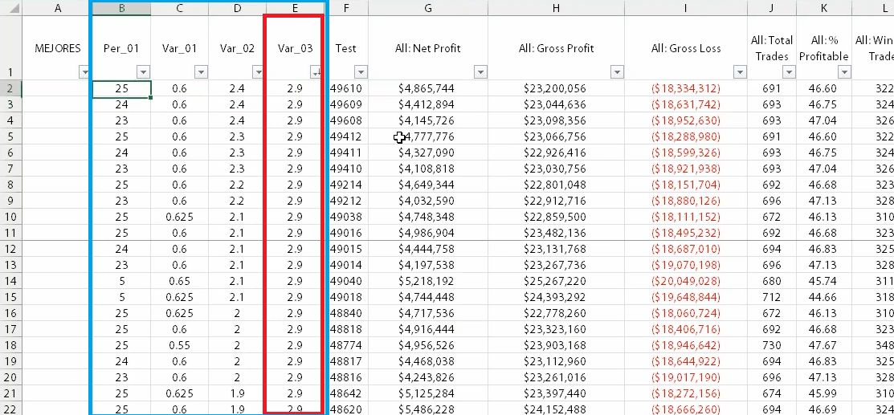


bueno en `Per_01`  no hay debate porque el incremento no puede ser, 


> `Per_01` es un parámetro de ENTRADA del sistema. 
> Concretamente es el período (la longitud) que usa el *indicador de entrada* para calcular su valor.
>
>`Per_01` = número de barras que usa el indicador para calcular su señal de entrada.
>
>* Si `Per_01 = 4`, entonces el indicador se calcula con *4 barras*.  
>* Si `Per_01 = 25`, se calcula con *25 barras*.  
>
> Cambiar Per_01 cambia la ***sensibilidad*** del indicador:
>* Valores bajos (4–7):  Más rápido, más reactivo, más señales.
>* Valores altos (20–25): Más lento, más “filtro”, menos ruido, menos señales.  
>
> El Mapa de Entrada ***Suma de all : TSIndex***:  
> `Per_01` (filas) vs `Var_01` (columnas)  
>Eso significa:
>
>* Las *filas* representan distintos períodos del indicador de entrada.
>* Por eso él analiza qué valores de Per_01 son estables.
>* Y por eso habla de *vecinos* (Per_01=4 vs 5 vs 6 vs 7, etc.).

este en `Var-01` sería donde hay debate, en concreto sobre la instancia 5 : `0.625` 

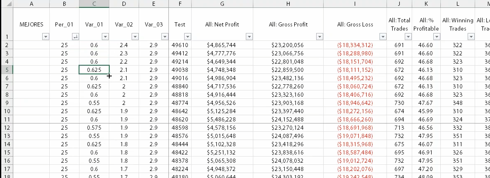

> ---  
> `Var_01` es un multiplicador del indicador de entrada (probablemente algo como: media, ATR normalizado, rango, volatilidad, etc.)→ Es el umbral que determina cuándo se activa la señal de entrada.
>  
> ---  

**Ejemplo de variación: impacto de un solo tick en trades y estabilidad**

entonces yo aquí por ejemplo tengo que buscar, este por ejemplo veis estos dos veis son iguales todo es igual 25 2 1 2.9 y sólo cambia el incremento, 


entonces ahí analizar cómo varían los resultados es importante.  
Fijaros que un tick varía 20 trades un cambio bastante importante 

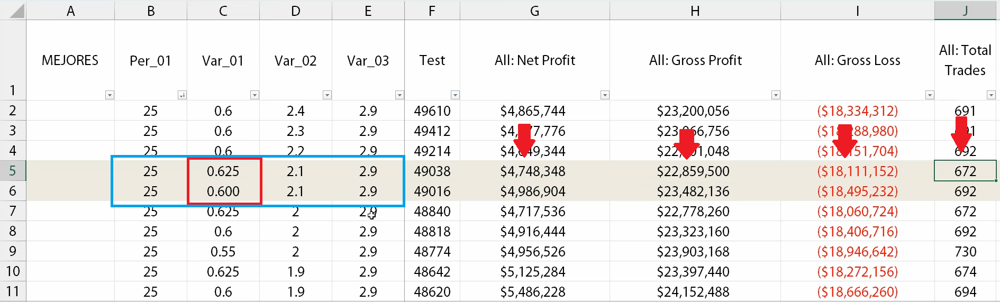

> UN PASO DE INCREMENTO entre parámetros. Eso es lo que él llama “un tick” de diferencia, un salto en tu incremento de optimización
>Es decir:  
>→ Cambiar UN paso del parámetro Var_01  
>→ Produce 20 operaciones más o menos  
>→ Eso es “significativo”  
>→ Por eso el mapa tiene sensibilidad 

¿esto cómo estaría mal? que cambiara o ningún trade o un trade, y todo fuera casi igual.  
***Hay que buscar un incremento que provoque cierto cambio***   
¿cuánto es cierto? no sé, no no lo tengo medido el porcentaje, no sé si decir un 10% sería correcto, puede puede estar ahí 10% incremento mínimo vale, pero en variación de significación pero no sé no no no lo toméis como una cosa sagrada porque depende al final simplemente que varíe

**Conclusión sobre incrementos: mejor quedarse corto que excederse**

entonces hay que ver que haya cierta variación, y a veces te puedes pasar, aquí en el incremento del número de Trades podríamos pensar que a lo mejor es demasiado y a lo mejor puedes granularlo un poco más, pues puede ser, a lo mejor podría haber en vez de 0.0025 granular a 0.002 

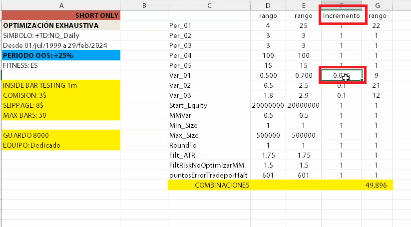

y entonces haría otro mapa y vería para regularlo un poco más,,, en vez de esas nueve sería 11. Vendría aquí 


y vería el mapa a ver,,, a lo mejor es eso también, que hay saltos demasiado grandes en `Var_01` pero ya digo mejor pecar de conservador en esto que de excesivo vale? porque lo importante es que haya cierto cambio en el incremento 

**Variable crítica: bar 0 1 como parámetro más sensible del mapa**

entonces esta es un poco la variable en estos datos que estamos viendo, estoy leyendo los datos como los veo, trato de no tener (aunque es complicado) pero de verdad que trato de no tener sesgo de saber el sistema que hace y al final este dato `Var_01` aquí en el mapa es el que parece más sensible, ***que sí tiene su zona de trabajo*** pero es muy estrecha 

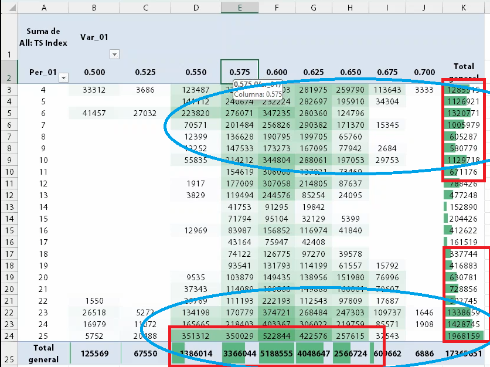

en el tp también hay una ***zona*** de trabajo en la parte de arriba pero también es bastante larga teniendo zona en todos, está completo de numeros en todas las instancias 


y en el mapa de `Per_01 / Var_01`  fijaros que hay muchos blancos   
y no en tp como stop que tiene más margen de maniobra. Entonces en el mapa `Per_01 / Var_01` la variable delicada podemos decir que es `var_01` 

Pero se podría volver a hacer un análisis de sensibilidad como habéis visto ahí pues decir " quizá me pasé nos hemos pasado con 0.0025 a lo mejor vamos a reducirlo a la mitad el incremento a ver a ver qué tal" eso es un multiplicador 

**Definición de zonas de trabajo previas a la selección final**

bien visto esto, yo aquí tengo unas zonas de trabajo bien definidas. A nosotros nos gusta montar el mapa completo de todos los inputs, es decir que aquí recoge las 8000.

Esto como yo tengo cuatro monitores ahora no lo vais a ver pero lo que hago es abrirlo así lo estiro y me lo estiro a los cuatro monitores aquí lógicamente no puedo porque estoy compartiendo un monitor y lo único que puedo hacer es esto 

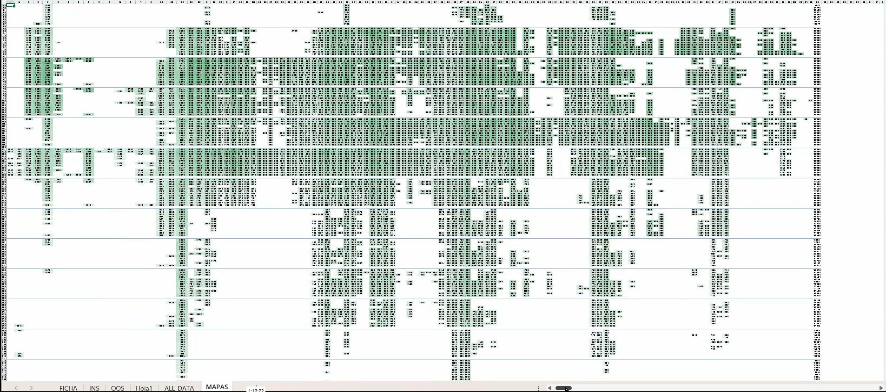

que parece que no pero es bastante útil igualmente 

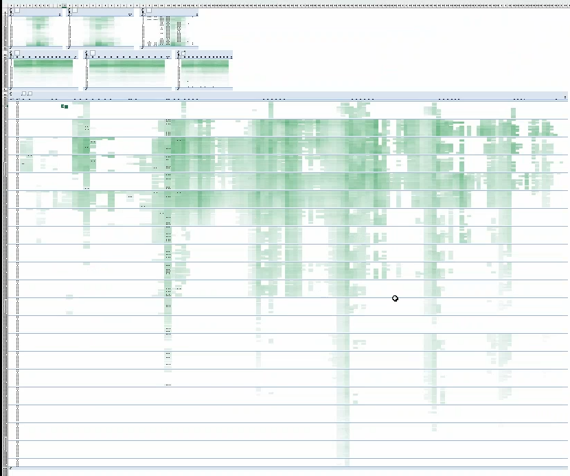

porque al final a mí no me interesan tanto los valores y me interesan las zonas entender las zonas

**Explicación de ejes y estructura del mapa global**

pero antes vamos a ver, porque sin explicar los ejes es complicado que entendáis de qué estamos hablando.
Aquí que tenemos tenemos? por un lado aquí tenemos bar 2 y bar 3 y aquí tenemos bar 1 y per 1 es decir que tenemos las entradas y tenemos las salidas 

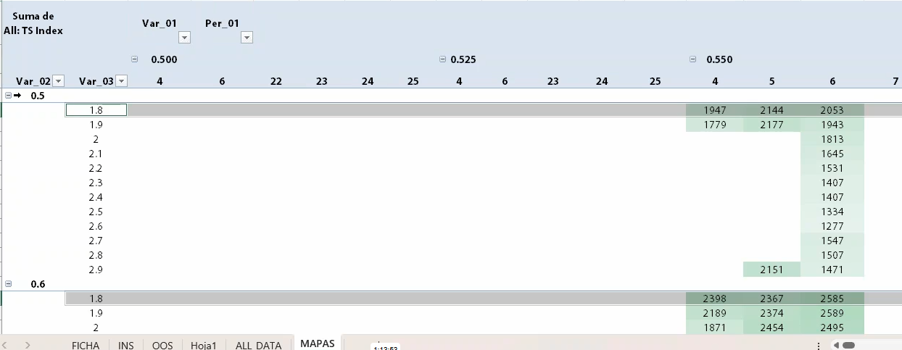

lógicamente hay uno que es el que condiciona más, porque así yo aquí recojo y puedo ir recogiendo ver los distintos voy agrupando si quiero 

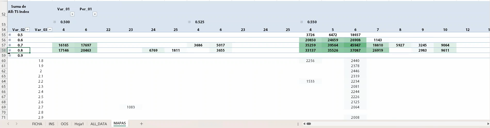

puedo filtrar expandir o contraer todos expandir todo el campo 


vale puedo filtrar y de hecho una de las cosas, aquellas zonas que ya me gustan cosas tengo claras pues mira esta de aquí 


bueno pues vale pues la filtro la voy a bloquear ahí

**Identificación rápida de parámetros con pocos valores (zonas débiles)**

antes quería que mirárais el mapa teniendo en cuenta lo que os digo, aquí tenéis 0.5, luego 0.5 con el 4, con el 6, con el 2, con los que aparecen, los que hay huecos es que no aparece, 


`0.525` con el `4`, con el `6` con el… esos son los que aparecen y ya te está diciendo que aparecen pocos. 

Esto se podían poner los ceros, no me acuerdo pero que sí que había un sitio pero bueno que es igual no importa no importa porque es mejor así porque así ves cuando hay pocos de 0.5 que visto así un poco si os fijáis lo veis veis aquí ves uno aquí ves el otro aquí ves el otro entonces ves que hay pocos entendéis

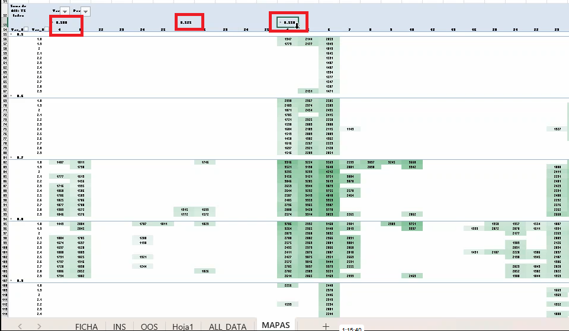

**Cómo se localizan rápidamente los huecos del mapa**

y esto es lo que te da información a medida que lo vas reduciendo, aquí fijaros tiene muchos muchos 

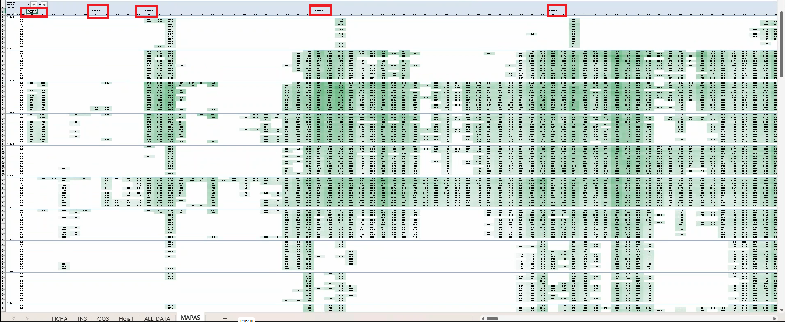

está que llega al final que también casi no tiene, en el filtro en el filtro de entrada por entendernos 

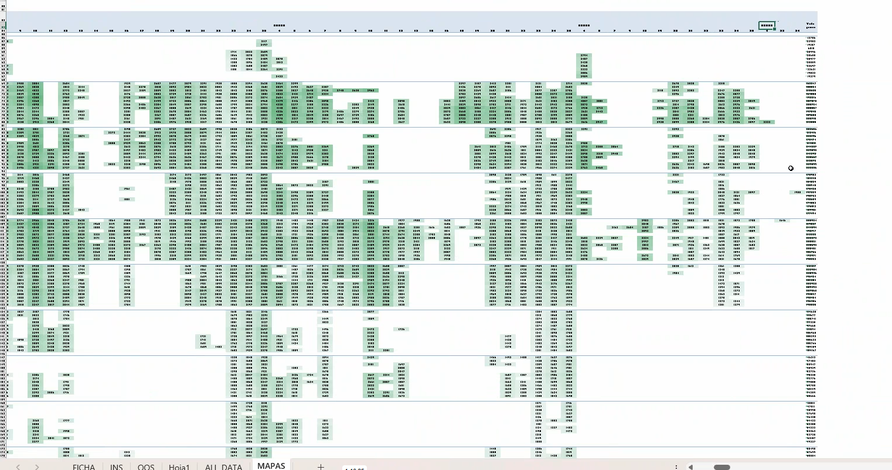

Aquí, insisto, no importa tanto leer los valores, no se ve nada, vale, vale, es igual, no importa

**Visualización conceptual: no importan los números, importa el dibujo global**

sabes dónde está cada cosa 

aquí claramente es donde está el 0.60 de arriba y donde es más ancha 


***¿y porque el 0.60?"*** ahora veréis veíais arriba de acuerdo aquí en la pequeñita quedaba más porque veis el 0.60 tiene aquí donde tiene zona de tp baja 

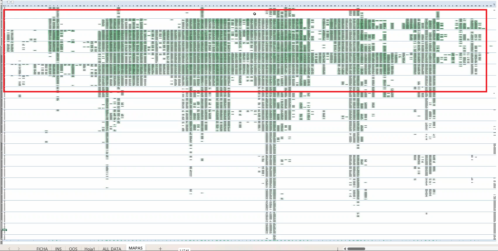

vale que es donde está esta es la zona de tp baja espera que voy a pintar esto evidentemente es la zona de tp bajo es evidente vale

**Por qué 0.60 aparece como valor dominante incluso con TP alto**

pero fijaros que el 0.60 incluso en zonas de tp altas tiene valores 


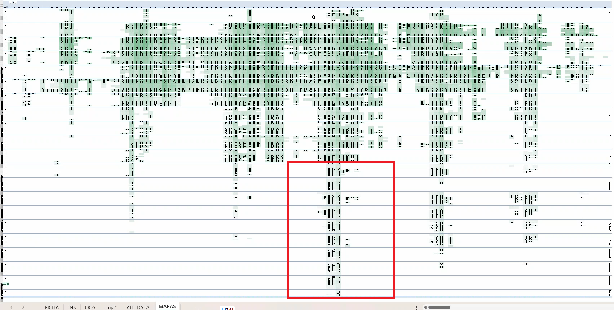

en cambio su vecino en 0.575 a la izquierda no tanto, 0.55 tampoco, 


y para arriba a la derecha mejor 

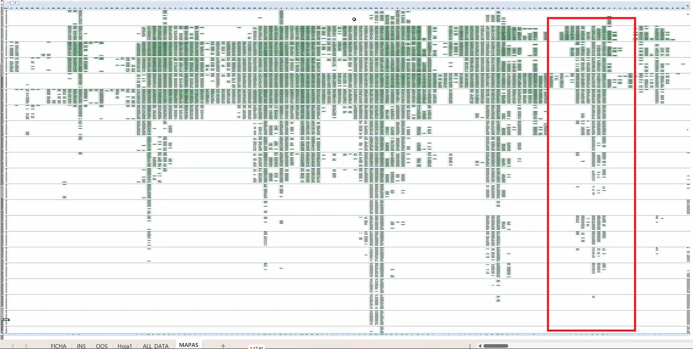

y piensas "pues oye cuidado..."   es verdad que en la zona `1` tampoco tiene tanto pero es progresiva , el 1 en sí es bastante progresivo también. 

Entonces esto es lo que nos permite ver el mapa un poco global que se ve mejor en 4 en 4 monitores.

## Filtrando inputs claros 

### `Var_01`

Vamos a filtrarlo para que lo veáis mejor y vamos a limitar, a bloquear los inputs que son más claros: 
  
`Var_01` que es el filtro de entrada (para entenderlo)   

Entonces, los bloqueos se hacen aquí.  
Puedo venir a la variable y decir: “en `Var_01` solo quiero analizar desde **0.55 hasta 0.65**”.

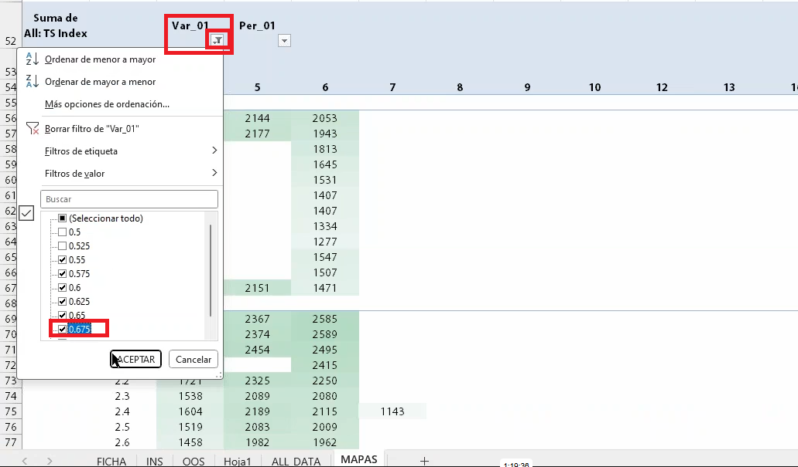

Incluso podría añadir también este valor: **0.675**, para observar otro vecino adicional.
Así tendría 0.55, 0.60, 0.625, 0.65 y 0.675, y vería toda la zona y sus transiciones.

Bloqueo únicamente esos valores porque, aunque **0.55 ya no es bueno**, me interesa ver su *vecino*.
Siempre me interesa revisar el comportamiento del vecino.

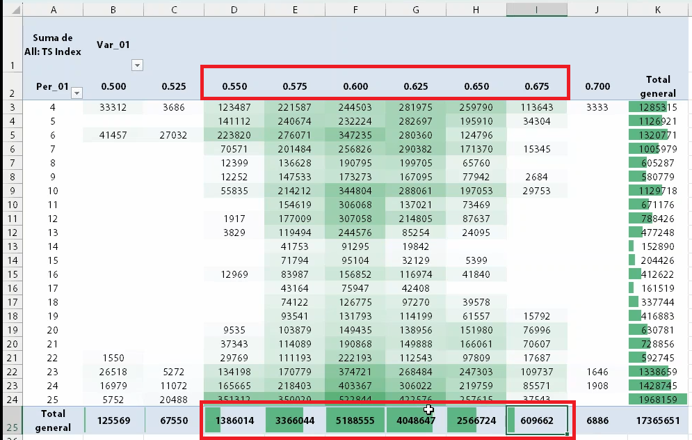

### `Var_02` 

recordar es el `TP` y `SL` 

Lo mismo haré con el parámetro del **TP** `Var_02 / Var_03`:  
aunque **0.5 es malísimo**, quiero verlo igualmente.  
Quiero analizarlo porque me interesa ver el caso extremo y cómo se comporta el sistema a su alrededor.  

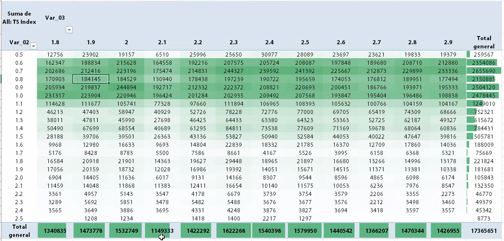

En realidad, para este parámetro quizá no haría falta —es evidente que 0.5 es muy pobre— pero aun así quiero revisarlo para observar el **vecino de 1.0**.
Quiero ver qué ocurre justo a su lado, y ese vecino es **1.1**, es la instancia `1.1` de la comuna `Var_02`.

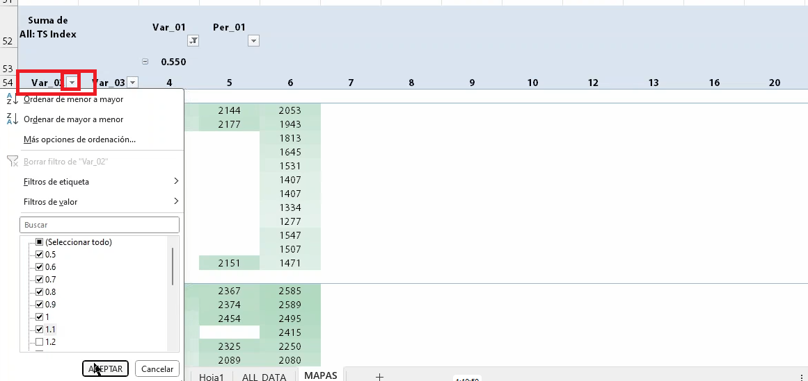

Una vez definidos, ya quedan bloqueados, y ahora sí, vamos a trabajar con esos tamaños seleccionados.

### Mapa filtrado: `Var_01` vs `Var_02` 

* instancias : `Var_02` con filas de `TP` y su `SL`.
* columnas : `Var_01` variables de `entrada`. 

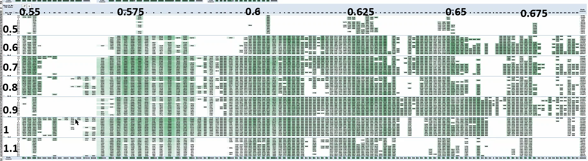

esta fila que vemos aquí **tan flojita** es el `0.5` de tp y sl,  
entonces es `0.5` para cada distinto rango o variable de `entrada`.  

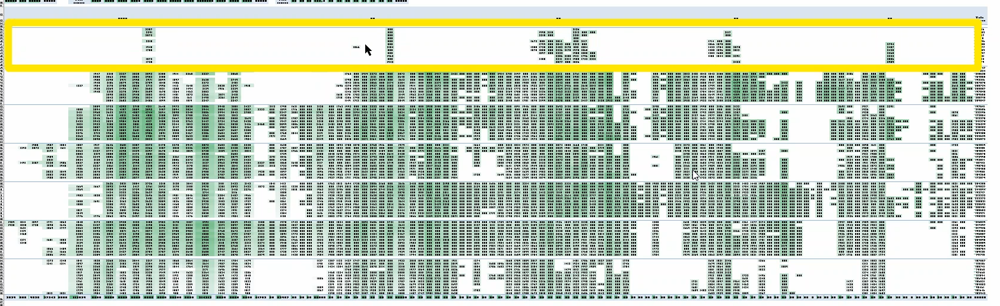


lógicamente aquí donde tiene `Var_01 - 0,6` pues es donde tiene mejor `TP/SL : 0.5`

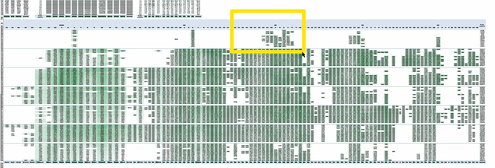

eso es lo bueno,  habla de la robustez de la variable `TP/SL`  
> ***robustez de una variable***:  
> que no sólo funciona donde le va bien sino también en otras zonas de la muestra. Esto indica que es zona robusta de ese parámetro. 

Pero es verdad que, como veis, como decía, si sacas la instancia del `0.5 de tp`,  
casi que ha sido igual en `0.6 de tp`,  `0.7 de tp`, ... 


Fíjate que en la variable `Var_01 - 0.55` hay pocos números en cada instancia de `TP/SL : 0.5`  
pero hay números en ***toda*** la columna, en todos los niveles de `TP/SL`, hay números;   
esto es el motivo por el que `TP–SL` es ***poco sensible***, porque en todas las zonas, póngas donde póngas el filtro `Var_01`, salen elementos de `TP–SL`´s.  

Lógicamente hay columnas `Var_01` donde salen con más elementos de `TP–SL` que en otros, pero en todos hay zonas con elementos de `TP–SL`, entonces es un parámetro que da bastante margen de maniobra, tiene ***buena tolerancia***. Y a medida que aumenta el valor de `Var_01` hacia la derecha pues ya van apareciendo menos. 

<div style="border-left: 4px solid #27ae60; background: #ecf9f1; padding: 10px 15px; margin: 10px 0;">

* **Sensible**  
Cuando cambiar el parámetro altera MUCHO los resultados.  
Ejemplo: Var_01 (0.575 → 0.600 → 0.625) cambia la estructura del mapa rápidamente.  
* **Poco sensible**  
Cuando cambiar el parámetro apenas altera los resultados.  
Hace casi lo mismo pongas el valor que pongas (no destruye nada con pequeños cambios). 

* ***robusto*** : funciona bien en un rango amplio.   
Tiene *tolerancia* alta (puedes moverlo sin romper el sistema)  

`Var_01` vs `TP–SL`

1. **Var_01**
   * Muy sensible
   * Poco tolerante
   * Si te equivocas ligeramente: BOOM → degradación
   * Hay que bloquear bien vecinos y analizar fino

2. **TP–SL**
   * Poco sensibles
   * Muy tolerantes
   * Muy robustos
   * Cambiarlos apenas altera el sistema
   * Se puede operar más “tranquilo”
</div>


**Comparación de dos zonas del mapa: por qué 0.575 parece mejor pero 0.60 domina en robustez?**

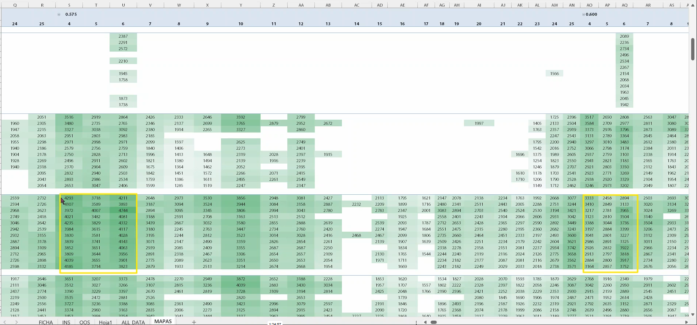

aquí en el  `0.575` de filtro, con el indicador en `4`, `5`, `6`, `7` que ya hemos visto que era buena zona, 

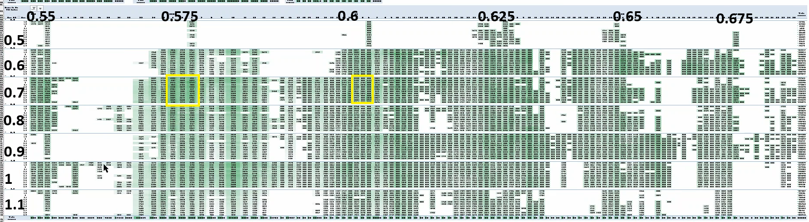

fijaros que en esta zona de `0.575` con `4`, `5`, `6`, tiene hasta mejores valores que en la variable de `0.6`  
`0.575` tiene valores de 4000 y en `0.6` de 3000, por el color más oscuro ya se ve 

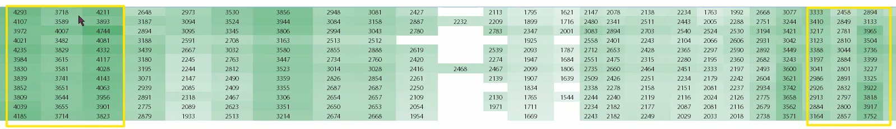

es decir en esta zona es mejor, es mejor `0.575`, tiene valores realmente elevados

**Razón matemática: 0.60 distribuye valores en todo el mapa (no sólo en su zona óptima)**

¿porque 6 cuando lo agrupas aquí arriba sale mejor? ¿porque cuando lo ves aquí resumido,,, cuando aquí pinta sólo `per_1` contra `Var_01` ignorando el resto, es decir todas están recogidas aquí, veis claro que 6 es mejor que 5. 7 5 

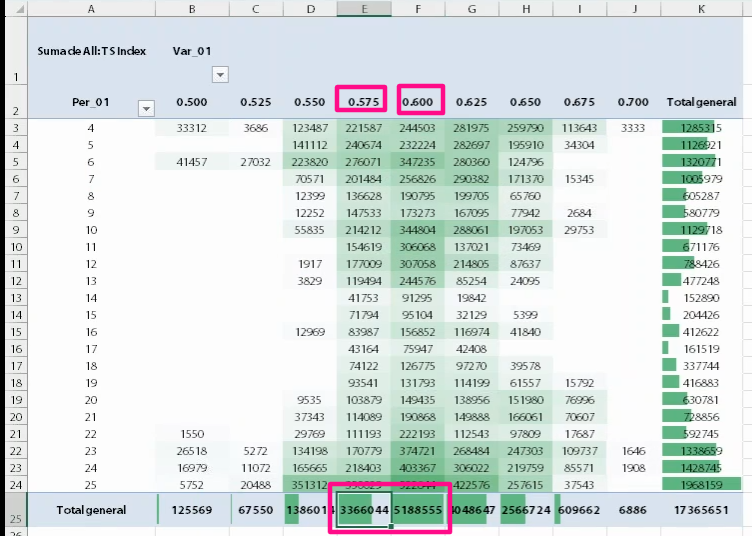

bueno la respuesta es muy muy sencilla la habéis visto antes, que el 0.6 distribuye mucho en todos no sólo en los buenos. En su zona óptima `0.575` parece hasta mejor pero 6 es un todoterreno espectacular en todas las zonas mete bastantes valores en todas en todas incluso las que no están aquí ahora las hemos quitado antes sellecionando solo las variables que vemos ahora, si las pongo todas mira como se ve también.

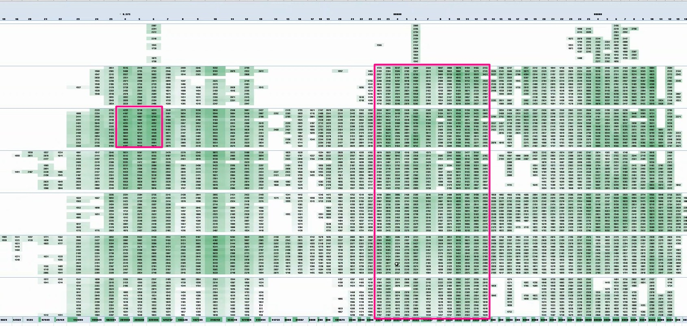


recordar que lo hemos visto antes lo voy a volver a poner el mapa completo para que lo veáis lo que quiero decir, eso es porque 0.6 en la zona óptima no es el mejor, mejor es 0.575, pero aquí en el mapa lo veis, hasta hasta cuando no es bueno el 0.6 mete más y realmente 0 6 es el que tiene mejor tolerancia mejor tolerancia es un valor bueno

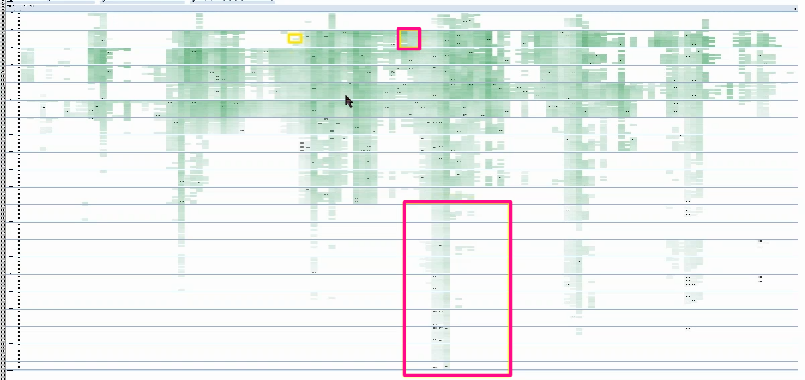


**Advertencia: el mapa va “por zonas”, no por sets individuales**

pero cuidado que es muy muy importante, en un mapa vamos por zonas, si luego metemos un set que está ahí, pues de coña, pero son las zonas, entender dónde me muevo yo mejor, donde mis sets pueden estar más justos 


<div style="border-left: 4px solid #27ae60; background: #ecf9f1; padding: 10px 15px; margin: 10px 0;">
  <strong>% incrementos de los inputs</strong><br><br>

  ***Pregunta : hablando de los incrementos en los inputs***   
  ***¿hay alguna forma de elegir en cuánto poner los incrementos?***

  no no hay, vaya nosotros no no no no tenemos ningún método, que puede ser que lo haya, nosotros explicamos lo que lo que hacemos, al final lo normal es que un porcentaje sea razonable cuando ese incremental lo permita, porque si usas un indicador imagínate que eso sea una media móvil pues número entero, pero si tú estás metiendo aquí un porcentaje como es el caso es un multiplicador, un multiplicador es un porcentaje, 

  **Regla práctica para incrementos: usar el sentido común y evitar extremos**

  entonces al final como los regulas? a .001 a 0.1 a 0.001? tienes hay que buscar sentido común. aquí la verdad que como os he dicho voy a hacer otra seguramente haremos una prueba porque me ha parecido que la variación es bastante notable. 

  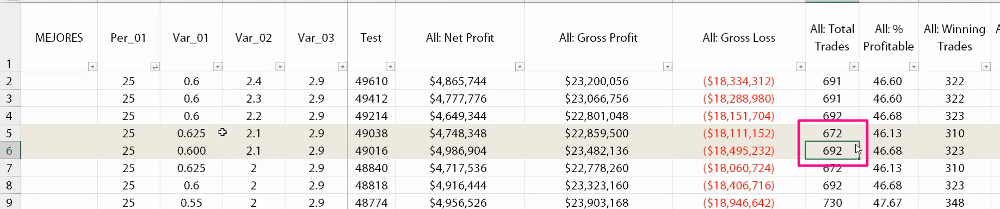

  a mí esta variación ha parecido bastante notable hay que ver que realmente depende de los otros inputs hay que mirarlo en distintas zonas ahora habría que buscar uno en el 4, o en el 4.4 o algo así, que actúe muy distinto o con el filtro más cercano no sé distintas combinaciones no con tp cercanos,,, pero es verdad que este nivel es elevado para ser el incremento, 20 trades sobre sobre 600 y pico son bastantes

  **Posible ajuste futuro: reducir incremento para aumentar granularidad**

  pudiera ser que aceptara un poco más de granularidad, entonces casi con total seguridad lo tenemos que hablar luego con con alberto porque,,, pero es posible que podamos evaluar reducirle un poco más, porque como digo 20 trades y pico son bastantes y es verdad que es el incremento que se ve va un poco justo, con lo cual puede ser que sea justo. ***Al final esto esto siempre va todo esto siempre va de señal y de ruido***.

  **Equilibrio entre evitar sobreoptimización y no restringir demasiado la señal**

  entonces no hay que pasarse, con o sea igual que no hay que pasarse con la sobre optimización, es decir en el sentido de que le permites ajustarse tanto, tienes que dejarle suficientes grados de libertad para que se ajuste, me entendéis, para que se ajuste a la señal, si yo no le permito un mínimo vale imagínate que yo este filtro le pongo de de 5 en 5 es imposible no puedo, no soy capaz de contar nada ahí, porque me estás obligando a trabajar en parámetros de locura, o como si yo digo pues si el mercado cae un 5 por ciento pones largo, bueno, cuántas veces cae un 5 por ciento? al final todo tiene su nivel

  **Contexto del sistema: años de evolución y robustez comprobada**

  como todo en la vida al final tanto es malo como poco, siempre mejor pecar de prudencia y protegerse contra la sobre optimización mucho, pero aquí en un sistema que tenemos que conocemos más que a mi hija casi, vale, que lleva 15 años en el mercado, con algunas pequeñas modificaciones pero ha demostrado operar todo tipo de mercados, es un sistema muy muy robusto vale, que lógicamente en fin cuando pues hay que ajustarlo, pero es muy robusto, entonces bueno se puede se puede apretar un poco más las tuercas pero siempre prudencia...

  pero es verdad que ya digo 23 sobre 600 y pico insisto que es el menor incremento posible parece demasiado así visto así en eso parece demasiado, pero claro esto hay que mirarlo en más sets de más zonas, y concluir,,, a lo mejor esto ha sido una casualidad y resulta que normalmente se mueve tres trades, pero bueno, si fuera a cinco trades estaría mejor, estos 20 trades para ser el menor incremento puede ser demasiado, así que lo miraremos lo miramos y nos pareció que era el adecuado 
</div>


## Retorno al mapa grande, filtrado y reconstrucción final del análisis

Una vez definidos, ya quedan bloqueados, y ahora sí, vamos a trabajar con esos tamaños seleccionados.

A nosotros nos gusta partir del grande luego ir filtrando y hasta que ahora lo vamos a volver a hacer porque como he tenido que abrirlo porque no sé lo que había liado pues lo volvemos a lo volvemos a ver

### `Var_02` 

recordar es el `TP` y `SL` 


---


### `Var_01`

Vamos a filtrarlo para que lo veáis mejor y vamos a limitar, a bloquear los inputs que son más claros: 
  
`Var_01` que es el filtro de entrada (para entenderlo)   

Entonces, los bloqueos se hacen aquí.  
Puedo venir a la variable y decir: “en `Var_01` solo quiero analizar desde **0.55 hasta 0.65**”.


### `Per_01`  

No tiene mucho sentido tocar el SL porque es linea pero tiene sentido dejar estas zonas

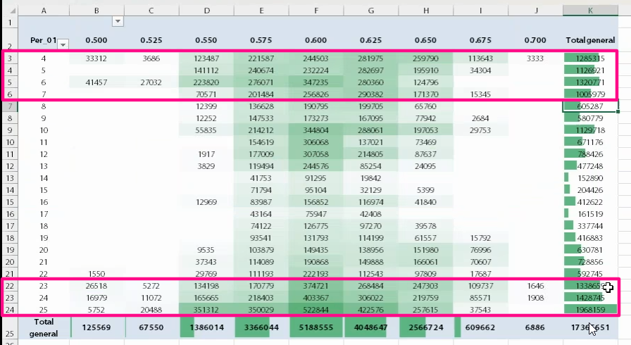   

---

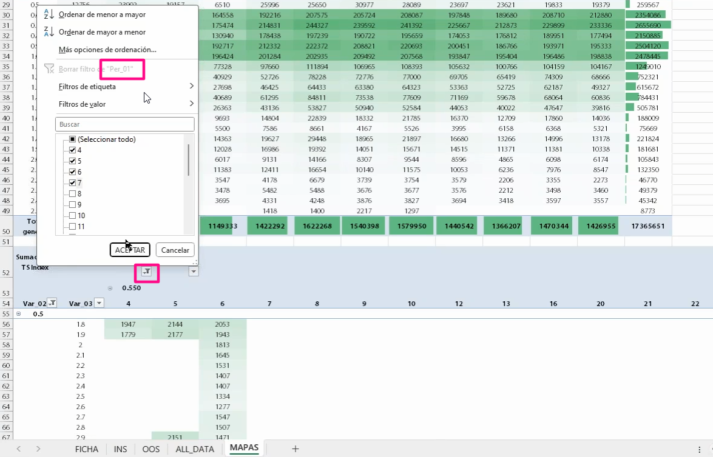    

bueno así pues el mapa de abajo es un poquito más manejable ya pues se queda todo como veis bastante bastante agrupado porque nos hemos cargado los buenos hemos dejado los límites de acuerdo y vemos un poco la misma información que teníamos queda más limpio queda más más limpio el mapa pero nada nada más

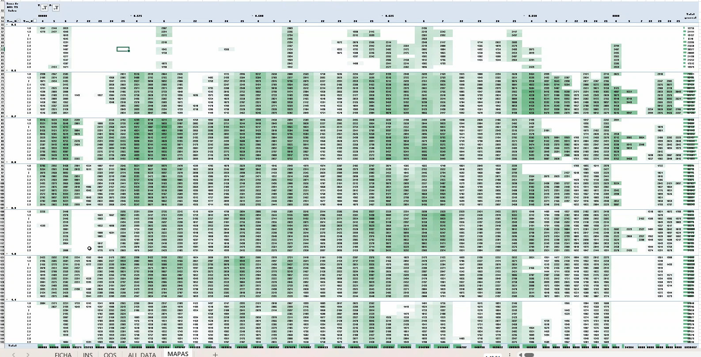 

**Marcado visual del set ideal y construcción de zona candidata**

bien aquí podemos marcar un poco nuestro set ideal vale nuestro set ideal  
que aquí tenemos una duda que mira, os la voy a enseñar ya, porque la he hecho esta zona 2 porque quería ver ese 25   
aquí sí que hemos apuntado los out of sample`OOS` 

`MAPA ES SHORT zona 2` 

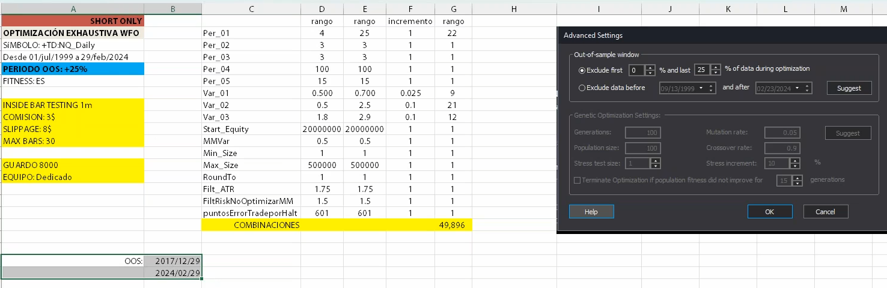 

que eso me gusta el otro se nos ha olvidado pero en este veo que sí que lo ha puesto con muy buen criterio porque nos gusta ponerlo esto nos gusta ponerlo y antes de empezar igual que se mira los incrementos se analiza esto se analiza esto donde están los cortes, donde se analiza? pues lo que habéis visto antes 


vale espera me lo voy a poner aquí para yo verlo gráfico idealmente si uno no le tiene una gran sensibilidad al sistema no lo conoce tanto pues se puede hacer en distintos cortes (hice el corte del OutOfSample)

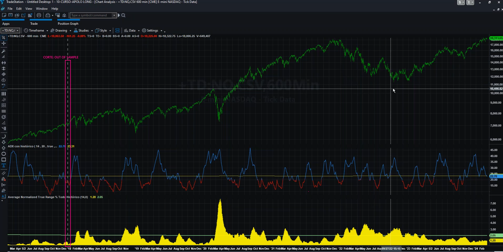 

pues veis un poquito las dinámicas que lleva el mercado aquí pues ha tenido ciclos bajistas ha tenido crack del covid en ese ciclo bajista y de hecho hay bastante ciclo bajista recuerdo bastante ciclo bajista, y aquí en el histórico pues hay también un poco de todo 

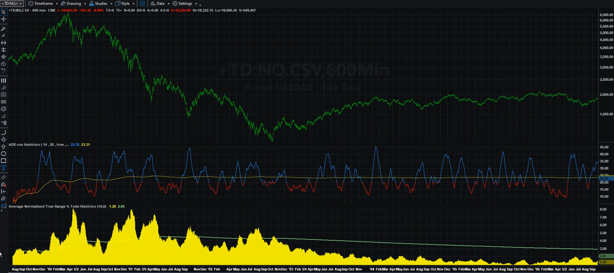 

porque hay una gran crisis primera del 2000 muy larga vale luego un período lateral bastante duro bastante duro otra nueva caída y luego un ciclo bajista espectacular por eso que hay un poquito de todo se pueden hacer distintos estudios de aquí.  Dejar out sample en la parte inicial, los cortos normalmente hace un out sample bestialmente bueno, vale, bestialmente buen,o aquí no no es fácil porque es verdad que ahora en proporción hay bastante corto vale y no estaría tampoco mal alargarlo un poco más y es a lo mejor a 30 por ciento

el problema del porcentaje es que si tú le dejas muy poco in sample hay autores incluso pardo que comenta alguna vez y nosotros alguna vez lo hemos hecho es como prueba de 50 a 50 es 50 a 50, y si es un sistema con muchísimos trades es bien, de acuerdo, es válido, vale pero aquí hablamos de un diario es un sistema que tiene muchos trades pero que operan diario, pero que te operan diario, y esta optimización tiene muchos trades, están hablando de la mayoría de 700, 800, 500, depende, hasta mil en algún set, pero son muchos, pero tampoco son tantos, por decir realmente yo en el in sample metido así pues estoy metiendo 500, 600, claro, si lo pongo menos outsample le meto menos. entonces capto menos señal. este es el equilibrio de señales entonces es complicado en esos sistemas y en este tipo por ejemplo el 50 a 50

**Impacto del sesgo bajista y la estructura histórica reciente**

este por mercado, este estaría chulo porque es verdad que ahora tiene un poquito de sesgo bajista 

 

aunque ha subido mucho porque es como bajista poder desde aquí aquí ha subido un montón sí pero ha tenido bastantes tramos de caída y hay en el insample también, en el sample también, pero es verdad que tiene un tramo de montonazo de años veis o a súper alcistas, y luego cambio tiene dos tramos súper bajistas, para un mercado de bolsa súper bajistas este es súper bajista

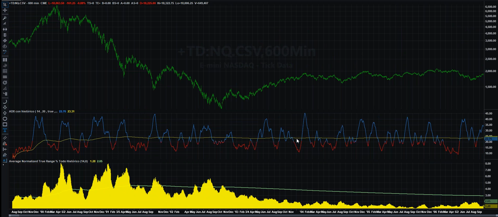 

y este es súper bajista 

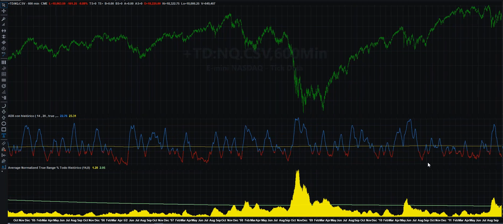 

entonces realmente todos súper bajistas uno muy muy largo luego un poco de todo pero un poco de todo
pero veis aquí en el corte outofsample tiene momentos de elevada volatilidad de muy baja volatilidad tiene un poquito de todo 

y lo mismo en el ADX lo mismo lo ves en el in sample que veréis periodos de muchísima volatilidad y periodos de muy poca volatilidad pero en porcentaje en el in sample tiene un poquito más de periodo de poca volatilidad que ahora es un poquito el único sesgo que tiene la muestra pero es complicada quitársela aquí es complicada...

...como vamos aumentando el histórico seguramente ya para las siguientes ya lo podemos anotar en nuestras notas alberto que le llevaremos cinco más, porque ya vas ganando histórico por lo tanto cada vez tienes más trades siempre, y meterle ir a ir abriendo a llevarlo un poco más atrás el 30 para ganar periodos sin volatilidad, de acuerdo, en el out of sample, pero claro yo necesito suficientes trades en el in sample, también pero ese es un poco el problema que plantean los sistemas de este tipo

**Retorno al mapa filtrado y determinación del set ideal preliminar**

bien volviendo al mapa 


aquí ya lo tenemos filtrado y lo que os decía yo aquí puedo tener un poquito mi set ideal mi set ideal que está claro que está en la zona de `0.6` del `var_1` y que en la zona del en la zona del indicador no es tan claro no es tan claro pero bueno pues ahí tenemos 6 tenemos 5, 4, y 25 es muy bueno el problema es que no tengo vecinos,

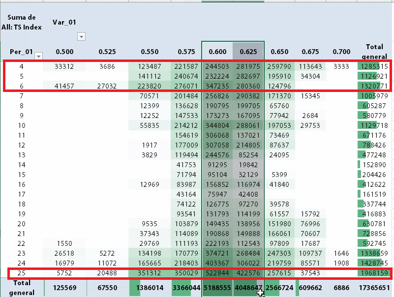

## Revisión del mapa “zona 2” y detección de un posible error al copiar inputs

el `mapa es short zona 2` está 23 a 30 esto es la que se ha hecho dejando todos los demás igual para ver ese más allá del 25 a ver qué pasaba

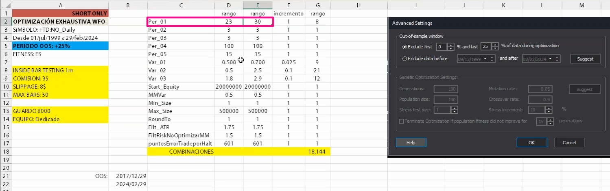

**Comprobación de la extensión de parámetros entre 23 y 30**

bien fijaros que lo primero que vemos es que el `0.6` sigue sigue dominando en toda la zona da igual el valor que le des al indicador que él sigue siendo el rey, vale, y que vemos que el `25` efectivamente destaca, y sí que vemos que degrada, `Total general` degrada bueno degrada, no, no creo que degrada de manera para no usarlo, no creo que degrada para la manera de no usarlo, pero sí que hay una cierta ahí degradación, no, no menor, vale, no menor (fíjate en la columna Total general como del 25 al 26 hay una degradacion, hay bastantes menos)

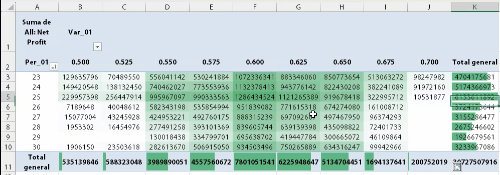

lo único queríamos ver es cómo evolucionaba más allá del 25 y bueno pues no hay una gran hecatombe sí que hay cierta degradación se parece claro que el 25 es una zona muy muy top pero bueno aguanta bien tiene bastantes valores y sería mejor que degradara menos? sí pero no es tampoco muy dramático,

```sh
como queremos ver este parámetro `Var_01` 

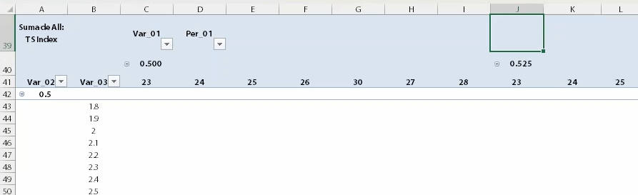

[lo que os decía a veces de los de los datos, ahora voy a poner el per 1 arriba porque pues nada pues porque así el que manda primero es el per 1 entonces ya la dejo sólo per 1

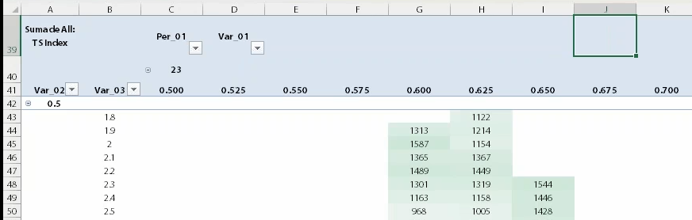

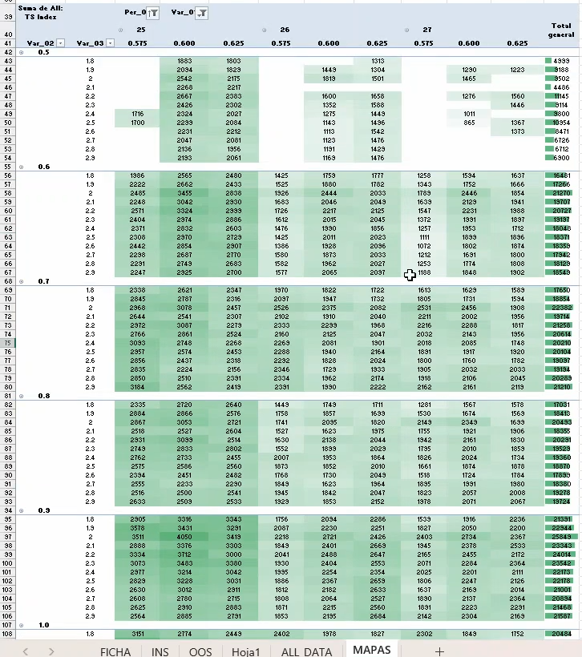
```
y fijaros que quí el `0.6` es más estable,  

fijaros que en la zona elevada esto es bastante interesante fijaros que el `tp` y el `stop` como que degrada menos, lo veis, 

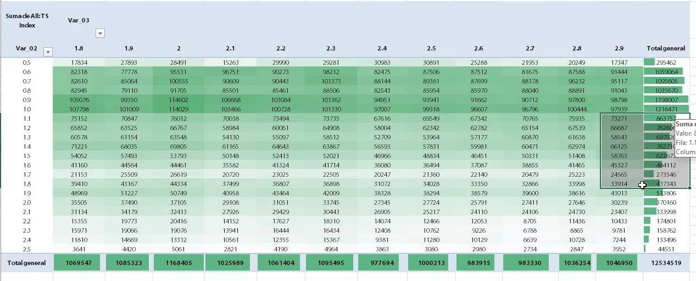


por eso el `25` en la otra salía tan bueno, es porque en la zona de `tp` a partir del `1` también va degradando, pero degrada de manera bastante más progresiva que antes cuando estaba la zona del `4` al `25` 

la zona sigue siendo igual, es en la zona de de `Var_02` que tenemos `tp bajo: 0.6, 0.7, 0.8, 0.9, 1` que también degrada mucho en el `0.5` que quizá un poco menos pero degrada mucho. En el `1.1` empieza a degradar pero fijaros que empieza de manera de manera mucho más progresiva que antes

aquí el `1` es mejor en la zona de `25`.  Quizás por la zona del `23` en este segundo rango. Antes ya habiamos visto algo bueno por la zona del `25` , por debajo de la tabla


lo que pasa es que acababa en 25, vale , queríamos ver más allá acababa en 25, pero ya veíamos que ahí había aquí había algo bueno, es como ya salía claro 25 era era la leche, ahora hemos ido más allá para ver qué pasa tras esto, y nos hemos dado cuenta que a la que vimos de 23 a 25,  automáticamente veis esa degradación que es mucho menor aquí 


`ANTES`
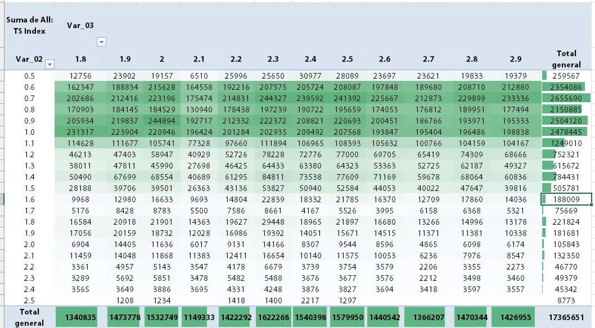

`AHORA`
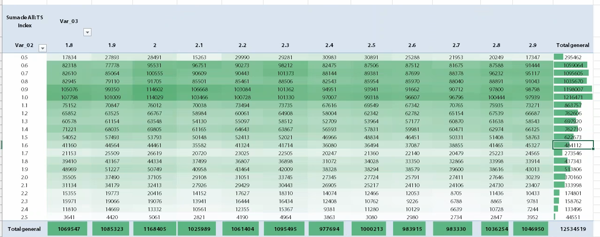
y ya más adelante fijaros aquí en la zona de `tp` es incluso el 1.6 aquí ya prácticamente no no sale casi 

realmente degrada de manera mucho más progresiva en la zona del indicador, a más de 23 vale, es decir, elegir 24, 25, está bastante bien aquí, es una zona muy buena,

**Comparación final entre las zonas óptimas del indicador**

bueno parece 26 mejor pero fijaros 25 también 25 muy bien 25 muy bien y su vecino 24 es bastante bueno también hay su vecino 23 

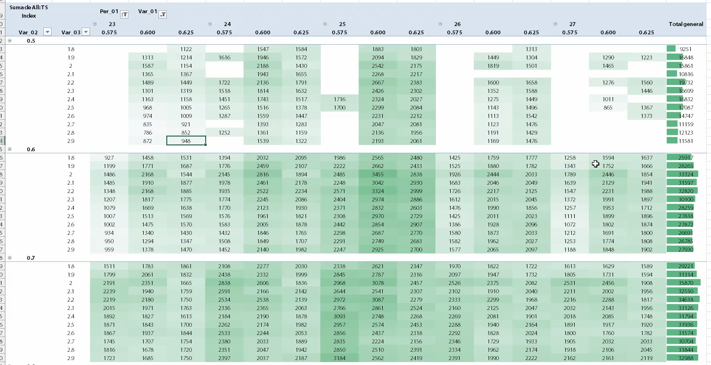

todo muy progresiva va degradando va degradando lógicamente va degradando pero fijaros que degrada de manera PROGRESIVA

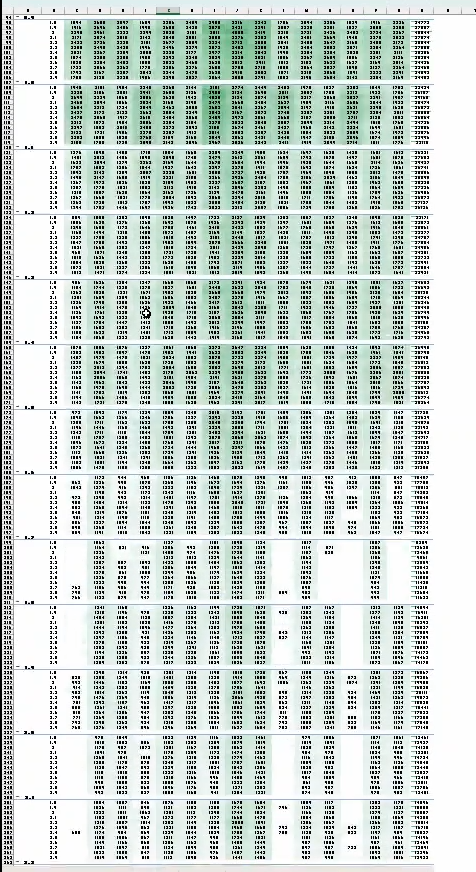


**Ajuste de rangos finales y confirmación de homogeneidad en la matriz**

el stop es que no sabes ni dónde cortarlo no sabes ni de dónde cortarlo 


**Identificación de las zonas finales recomendadas para per1**

estaría bien también esto mismo que hemos hecho hacerlo, hacer de 1 a 7 por ejemplo de 1 a 7 todo igual entendés decir hacer esto de 1 a 7 

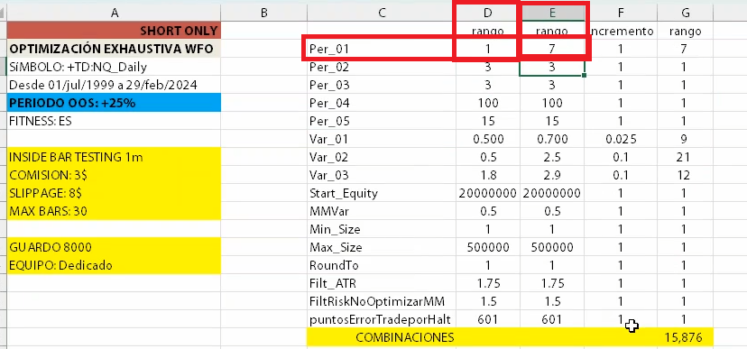

esta misma que la vamos a dejar ahora puesta alberto en ordenador de 1 a 7 para mañana analizarla y así veremos un poco qué pasa en ese 4 


pero bueno en principio vemos que 4 5 6 sobre todo 5 6 de acuerdo 4 5 6 está está bastante bien no 4 5 6 pues parece parece ser buena buena zona no 4 5 6 porque incluso 7 pues es una degradación bastante aceptable aceptable

por el lado de las ***x*** ya hemos visto que entre `0.575` lo consideramos aceptable `0.6`, y `0.650` pero bastante por los pelos bastante por los pelos idealmente, `0,625` pero bueno `0.650` aún podría aún podría valer

**Síntesis del TP óptimo y límites aceptables por tolerancia**

en cuanto al lado del tp `0,6` este sí que lo vamos a descartar por el enorme barranco que supone`0.5` 


y aceptaríamos hasta `1`  hasta uno 


tenemos esta zona que nos está nos está diciendo que 24 incluso 23 no cosa 23 porque el 22 una degradación aún aceptable aún aceptable yo de 23 24 25 23 


además tiene un plus que de hecho es lo queríamos haber dejado preparado pero pero no sabemos porque eso nos bloqueaba la optimización y no hemos podido

porque eso ya os lo digo este sistema lleva mucho tiempo operando esta zona de 23 24 y 25 es una zona top del lado largo, el lado largo opera varios sets no sólo operan sino que han operado durante años en esa zona de acuerdo es una zona muy fina para el lado largo, entonces eso también está, y de hecho hay algún set también el corto operando en esa zona hoy en día, es decir que sé que esto no es nuevo esto como os digo viene de siempre y así por eso pues estos datos al final van saliendo y vas analizarlos 


bien esto al final repito es zonas de trabajo pero ***¿elegiríamos los sets con esto?*** no, para operar no, por qué no? por un motivos : primero ni con el mapa, ni con este excel, 
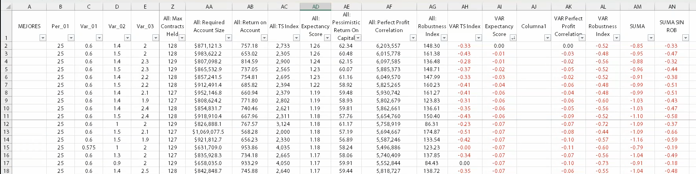

**Limitación fundamental: dejar elegir entre 8.000 combinaciones es sobreoptimizar**

dejarle elegir 8.000 como os he dicho antes es un ejercicio sobre optimización bastante notable, es poco como lo que os decía de dejarlo variar los incrementos, al final es un poco lo mismo,

si yo le dejo elegir entre 8.000 `insamples` cuáles van mejor y los mezclo en `all_data` y luego me los ordeno al final esto esta ordenación que yo he hecho aquí en excel pues mira que hay un 10 y un 4 hemos hablado del 4 antes hemos hablado del 10 también pero teníamos dudas 

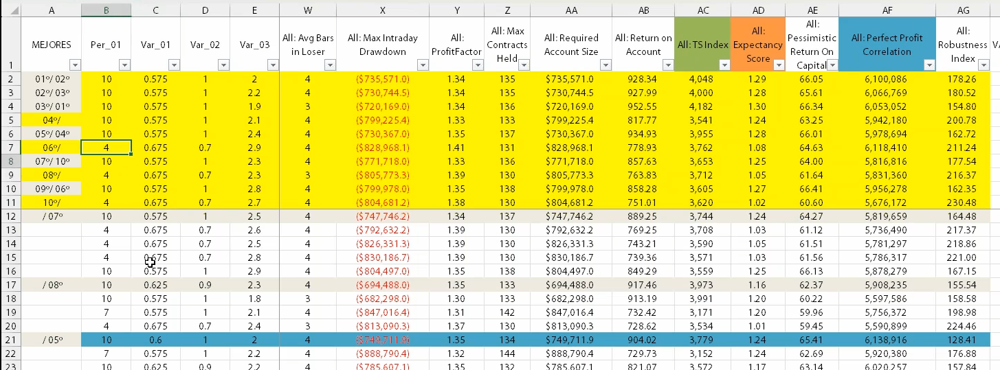

vale no sale más por aquí salen 4 a 10, salen 0.575 que bueno, está ahí en el límite que hemos considerado apto, 0.675 estaría fuera estaría fuera, en `Var_02` el uno también estaría apto. 0,7 también, son zonas operativas el 10 dudoso

**Advertencia: un set concreto sólo es válido si está dentro de su zona robusta**

aún así si ahora que compara el insample con el out sample 

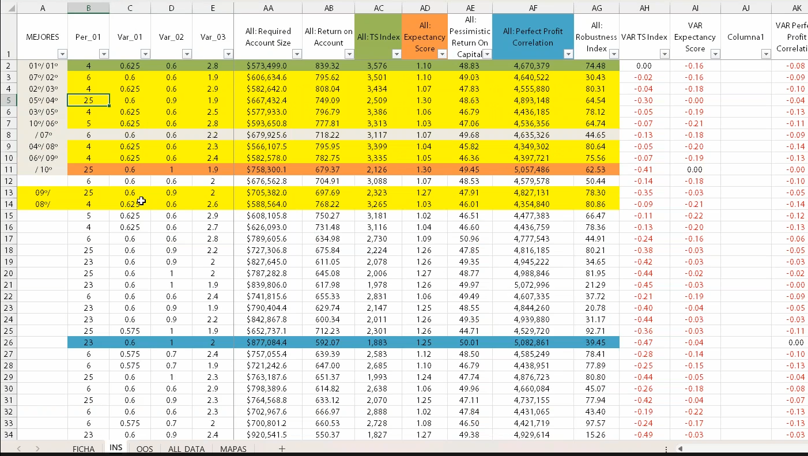
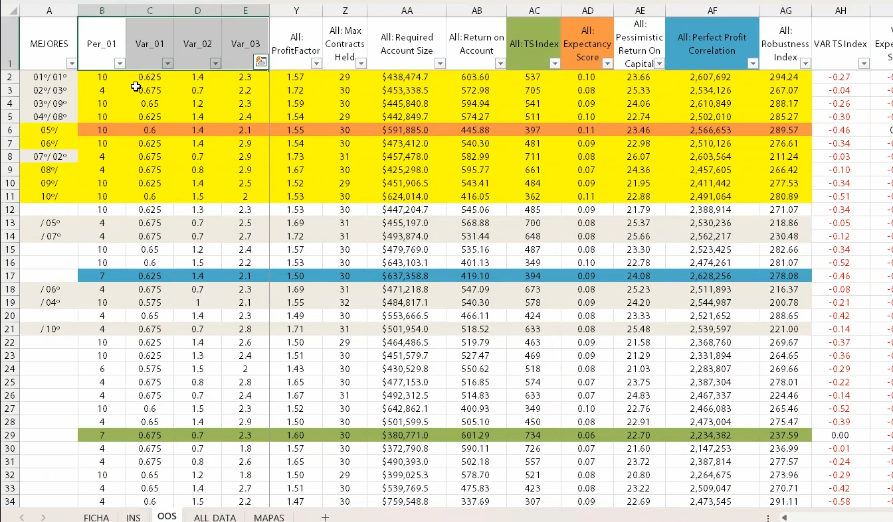

bueno pueden ser los mejores, o no, no lo son de hecho, pero pero este puede ser que sí si está en la zona, es decir no son lejanos de uno de los mejores in sample que es 25 pero en out sample no aparece ninguno

el problema es que son 8000 entonces ahí nunca elegimos de este de este set, lo que hacemos es hacer o la misma opti o otra, de acuerdo? que a lo mejor ya con el mapa yo he podido acotar y a lo mejor podría mejor si fuera más grande imaginaos que hubiera sido una optimización genética la anterior mucho mayor, podía ahora acotar y hacer una exhaustiva, pero como yo ya la tengo hecha, yo la he hecho, Y eso de dos maneras de hacerla

**Creación de la optimización exhaustiva recortada (250 mejores)**

esta es la misma exactamente la misma exactamente la misma , la 1

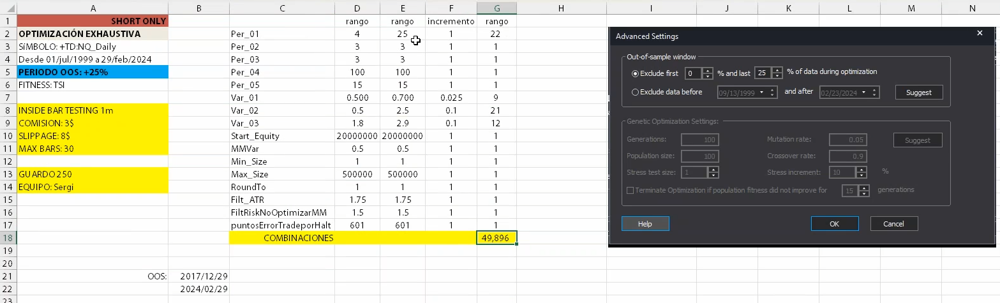

es sin esta extensión porque ya la teníamos hecha si no la hubiéramos hecho con la extensión vale porque esta ahora viendo esto lo mejor pues sería hacer esto más o menos 29 

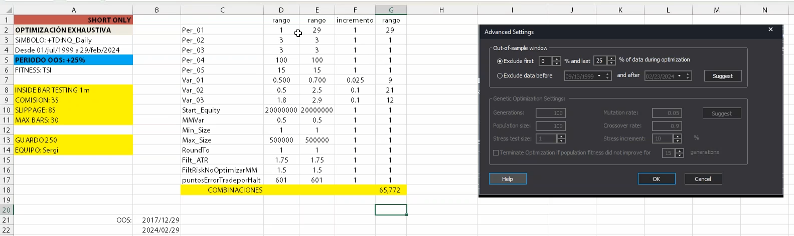

para que son `65,772`combinaciones pero esto acaba son unas horas en ordenadores potentes horas pues el 12 horas 14 horas y 27 horas en el mío a lo mejor en el dedicado que es un poco más lento pues dura 15 horas entonces se podía hacer esta ya y lo tienes todo en uno 


pero bueno no se ha hecho se ha hecho esta


**Por qué reducir a 250 sets: evitar sobreoptimización y facilitar selección**

entonces se ha hecho sólo guardando 250 es un número que aún 200 si quieres 100 puedes coger perfectamente 100 y hacemos lo mismo pero claro aquí ya en el insample solo hay 200 

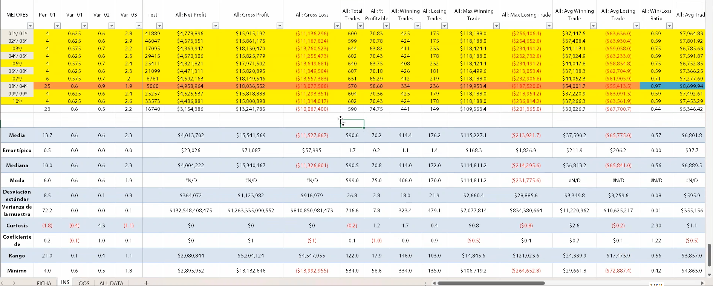

esto nosotros hemos construido seleccionándolo con una función buscar, pero no, no, no complicaros

**Explicación técnica para quien domina Excel (opcional)**

hay dos datos lo explico para que lo sepáis simplemente aquel que domine excel porque esto ya esto sí que si no dominas excel pues te olvidas vale no hace falta meterse en complicarse la vida necesariamente pero aquí hay dos variables que se comparten entre las tres hojas una es el `test`, 

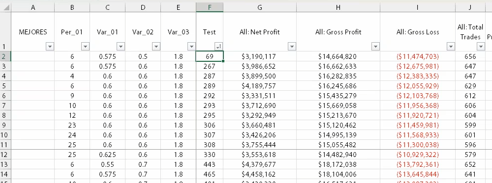

el test se comparte sin equivoco es el test que recoge cada combinación vale y luego el `Robustness` también es igual en todas las hojas vale 

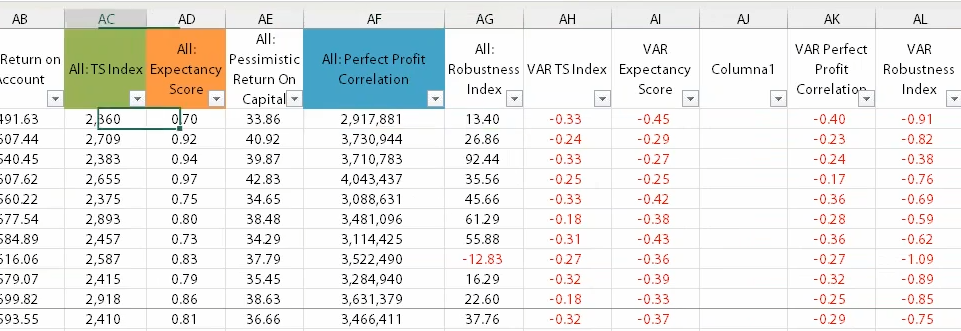

entonces buscando el número de `test` ordenas tú por el fitness que has hecho por tsi ordenas por tsi que es el fitness que hemos usado en este excel vale ordeno por tsi 

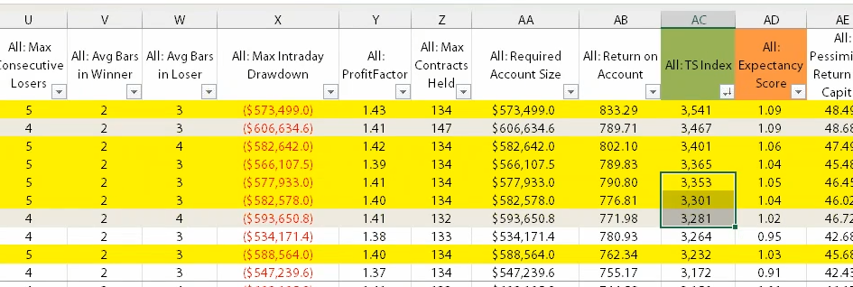

y automáticamente busco con la función buscar
de las borro abajo hasta me quedo con 250 

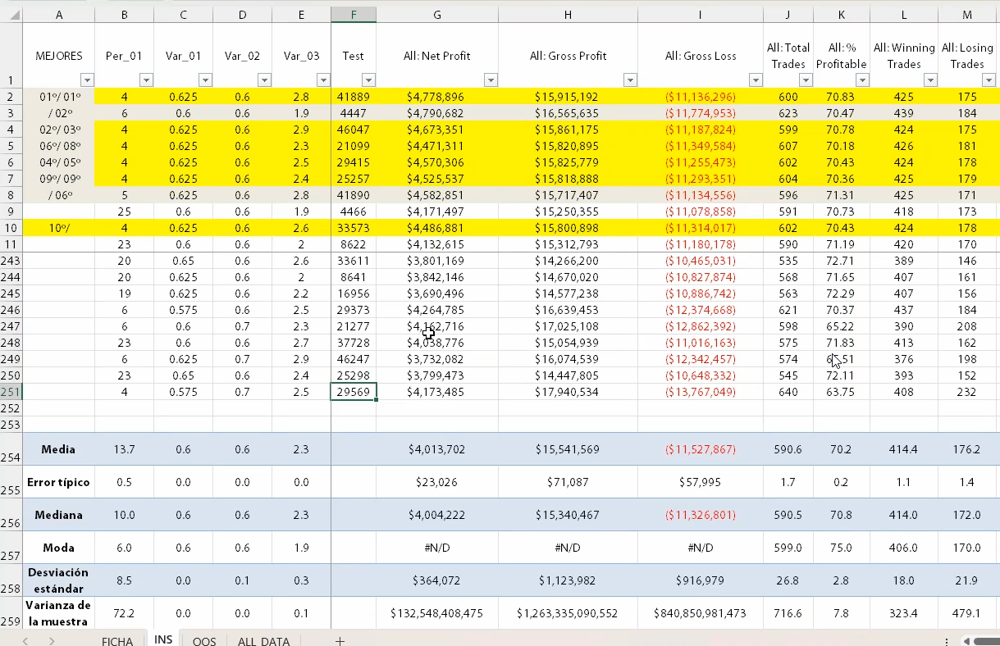

y luego con una función *buscar* busco estas `test` en la otra hoja y me quedo con esas. 

Si no sabes ni de qué te hablo no te rompas la cabeza, pero el que sepa de excel sabe de qué le hablo y con una función buscar hemos buscado estos test en el outofsample y en all_data y hemos eliminado el resto por una sencilla selección así, vale y ya está, pero si no pues vuelves a hacer la optimización.

**Cierre del bloque: equivalencia entre esta reducción y rehacer la optimización**

entonces ahora aquí nos hemos quedado con las 250  
es decir esto es lo mismo que si hubiéramos hecho la optimización porque ésta es exhaustiva 

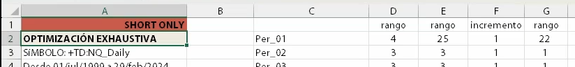

que no hay no hay un algoritmo que seleccione son todas, entonces las 250 que mejor `tsi` tenían se han quedado y por lo tanto yo sí que tengo aquí unos datos `insample` unos datos `all_data` `outofsample` y los datos all data y los tengo ordenados también por suma porque el auto sample está detrás y cuando pongo el `outofsample` detrás me gusta más usar la suma incluyendo el `Robustness` en el cálculo y por lo tanto veo cuáles son los mejores in sample que como veis lógicamente los mejores in sample los mejores sí son los mismos 

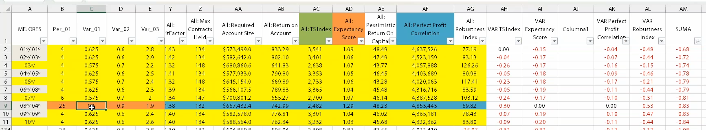

porque los que eran mejores en 8.000 son mejores en 250 lo que cambia o lo que puede cambiar es el `outofsample`

entonces ya ordenamos por por suma el in sample lógicamente son los mismos eso es obvio no el que es mejor con mil es mejor con 8.000 y con 250 mil pero no el `outofsample` porque aquí ahora ya sólo hay 250 y 

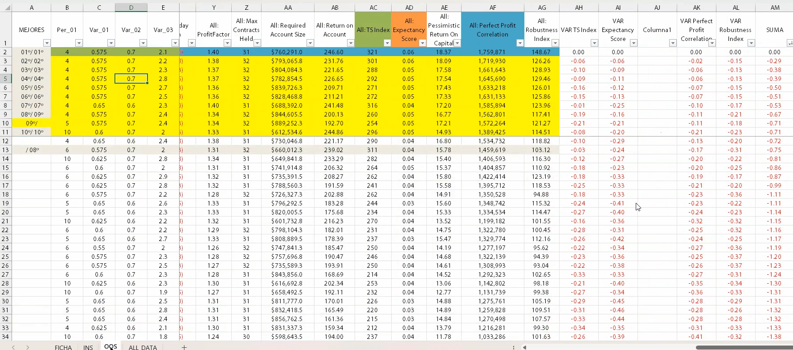

**Comparación visual de los mejores sets en in-sample y out-of-sample**

fijaros que tengo 406 25 con varios y aquí tengo no sé si exactamente el mismo no es pero por ahí andan por ahí es evidentemente la zona bastante bastante parecida si vamos al data pues nuevamente son los cuatro 

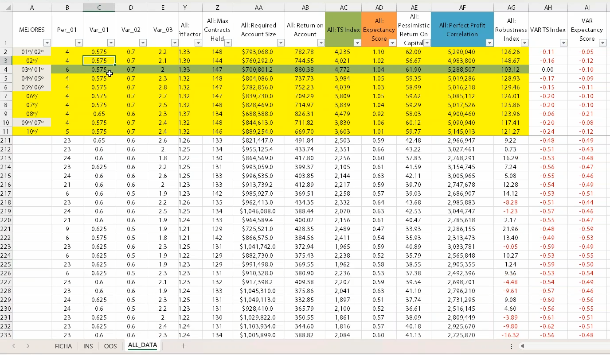

en este tsi son los los cuatro 

¿que hacemos nosotros en este en este caso? nótese que no hablado de vol forward al final sí os hablo de vol forward vale pero de momento de momento yo normalmente en Apolo solemos elegir así, solemos elegir así, por el mapa yo tengo claras mis zonas y ahora tengo mediante all_data pues aquellos sets que trabajan mejor en equilibrio en  `insample` y `outofsample`


====================================OJO NO ETIENDO LA EXPLICACION DEL VIDEO - DESDE AQUI===================

porque con la suma pondero sobrepondero un poco el `Robustness` ya que me añade y lo tengo por un fitness que este sí son estos y lo tengo por el fitness ese que lógicamente muchas ocasiones en algunos en común pero no siempre aquí de hecho como veis no los hay no hay en ese común pero en este en el ppc sí que hay en común entre los dos hay un poco de mezcla de los dos aquí nos sale más el 25 el ppc siempre tira más para para el retorno recuerdo el ppc te tira mucho para el retorno

====================================OJO NO ETIENDO LA EXPLICACION DEL VIDEO - HASTA AQUI===================

**La ficha de resumen: herramienta clave para comparar de un vistazo**

una cosa que nos gusta mucho que esto creo que lo enseñé un poco en la práctica lo enseño también aquí que tengo mis notas está es la ficha que tenemos en el whatnot 

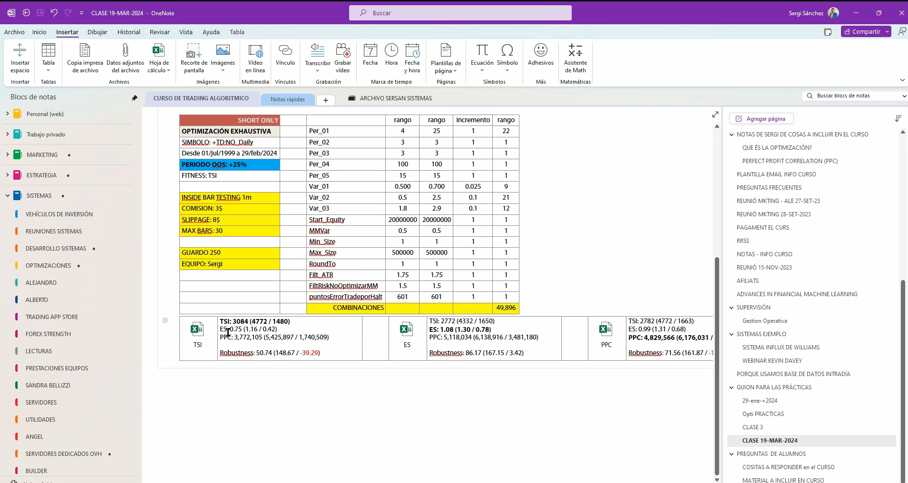

y aquí a modo de resumen recogemos siempre cuando cuando lo hacemos con TradeStation estos `tres excel` y el resumen de las tres variables y el `Robustness`  esto es muy interesante porque de un vistazo de un vistazo te puedes hacer una idea de cuál es el mejor


**Comparación por medianas: utilidad en exhaustivas de 250 sets**

aquí al estar en `250`y ser `exhaustiva` en la mediana que es el valor primero `ES:0.75` es bastante útil vale y aquí también tanto en las funciones fitness (`TSI, ES, PPC`) como en el robustness fijaros que te paliza respecto al tsi el s es el que mejor robustness tiene 

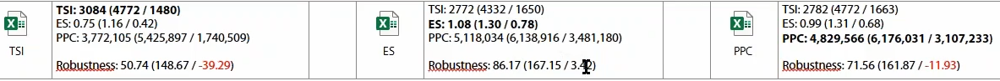

de hecho no tiene ni un solo robustness negativo ni uno solo entre los 250, muy destacable, su mejora 167, pero tenés pero es que su mediana es 86, recordar que `100` es igual `insample` que `outofsample`, bien vale bastante bien su valor medio de `tsi 2700` mediano su valor mediano `PPC 5 millones` este ppc del ***ES*** incluso supera al ***PPC***

**Interpretación: por qué el fitness “s” supera a PPC y TSI en esta optimización**

digamos que incluso supera al ppc que es el que el que se ha optimizado en él, ¿eso como puede ser? bueno porque ha tenido más capacidad predictiva del `outofsample` osea el `insample` ha predicho mejor, entonces en este de estos tres excels aunque vamos a mirar los tres, el `ES` es el mejor, eso es lo que os digo se hablaba en el curso de la supervisión de los fitness, de acuerdo, esto lógicamente de la supervisión de todos los protocolos, es decir este tipo de cosas también sirven para eso, para ir viendo con el tiempo que predice mejor a un tipo de sistema o a otro, aquí predice ***ES*** predicho ha tenido una mejor capacidad predictiva del `outofsample`, pero repito que miramos los tres 

**Reflexión: por qué normalmente TSI es un buen equilibrio, pero no siempre**

es verdad que normalmente a mí se me dice es un caso de duda normalmente ***TSI*** suele ser un buen equilibrio pero también nos gusta mucho ***PPC*** y nosotros nos tiramos mucho por el ppc, porque si tú tienes cartera y puedes cubrir el riesgo con otras maneras, gestión monetaria, exposición, diversificación, retorno, al final vía sistema puede ser un muy buen vector, de acuerdo, porque yo riesgo ya lo controlaré vía cartera, vía exposición, y vía gestión monetaria, entonces el sistema puede ser una manera de verlo, pero ahí están los tres insisto ahí están los tres 

**Selección de *performance reports*: parte visual y subjetiva del proceso**

vale bien entonces nosotros vamos a mirar estos ***performance report*** 

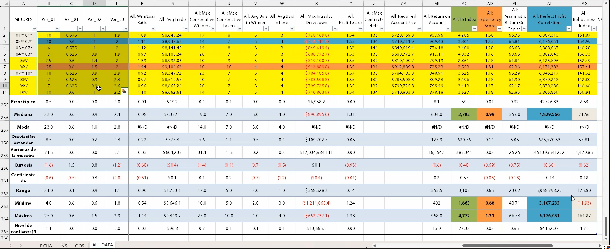

porque al final hay que ver el ***performance report*** hay que ver el gráfico el gráfico me refiero el comportamiento de la curva, el gráfico ahora de hecho lamentablemente en las últimas versiones de tradestation han decidido sacarnos una cosa que a nosotros nos gustaba mucho, que era simplemente cuando tienes aquí una función fitness y le das aquí a guardar 

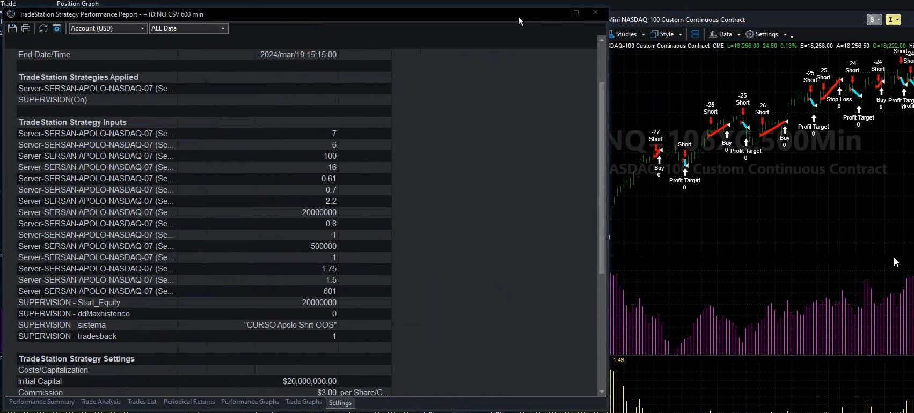  
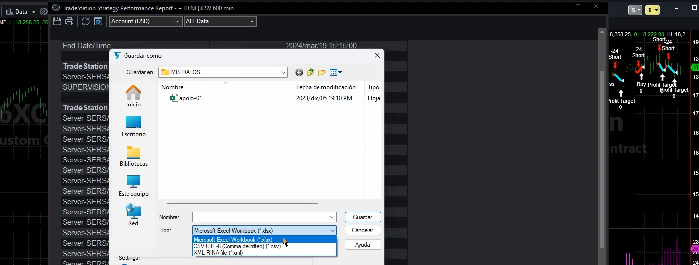  
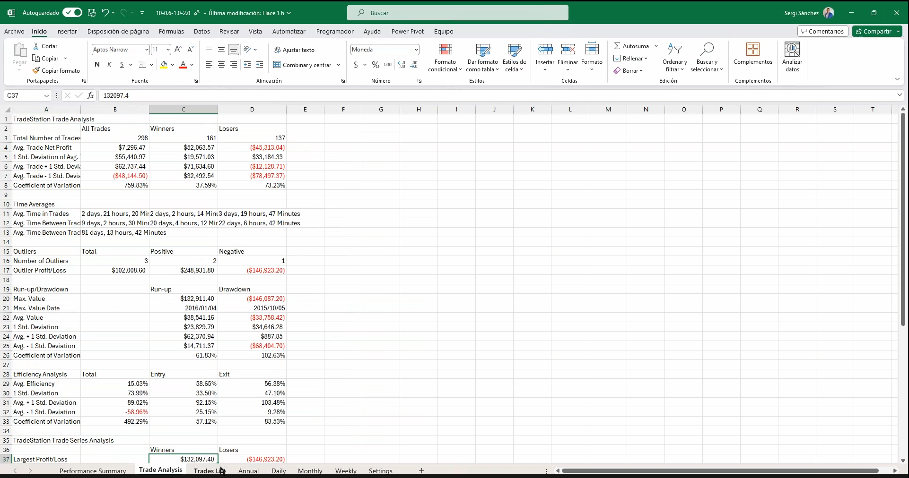  

puedes puedes decir exportar en excel pues en csv puedes usar en un xml Y antiguamente generaba en un formato que era de microsoft que te generaba un archivo html y entonces te dejaba ver html donde tú abrías los gráficos y era muy exportado muy chulo ahora pues han decidido solo excel entonces podías graficarlo pero no te grafica entonces te exporta performance report exporta los datos tal que está muy bien toda la información que quieras pero no te exporta los gráficos y la verdad que los gráficos pues vienen bien también

**Método alternativo: pegar los gráficos manualmente en Excel**

bien bien para verlo a nosotros nos gusta mucho pero ahora puedes poner aquí pegado que es lo que normalmente hacemos pero hoy por lo que os decía por el tiempo no lo hemos hecho le hacemos. 

Entonces nosotros lo que hacemos es sobre esos mejores y recogemos los ***performance report*** también de los sets que de hecho no solemos hacerlo así hoy lo hemos hecho así pero normalmente no ponemos que es el set es decir le ponemos su combinación y lo mezclamos aquí entre todos

**Evitar el sesgo: comparar sin mirar qué parámetros son hasta el final**

tratamos de no mirar o sea no lo miramos los vamos abriendo y alberto esto lo expliqué en la teoría es la única cosa más subjetiva que hay en el sentido de que al final alberto hace su selección y ahora mía tiene su selección aquí y yo tengo la mía todavía no las hemos puesto en común todavía nos hemos puesto en común lo vamos a hacer ahora 

yo fijaros que me he quedado con tres de los set que operan 

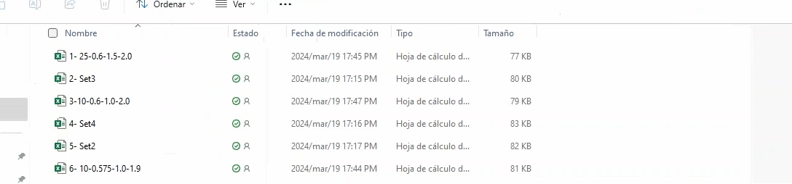  

que eso tiene su gracia pero hay sets operando me he quedado con ellos o sea esto es la manera en la que valoramos si cambiamos o no cambiamos, es decir incorporando en la fase final lo que opera, y entonces decido si me los quedo o no me los quedo, Que aunque los que me quedo luego se consideran que no son aptos para operar, pues entonces el tema no vale, de acuerdo, pero así es como lo hemos lo hemos visto, de acuerdo, alberto ha visto estos y yo he visto estos, yo los tengo ordenados de menos a más trades no no es por calidad 

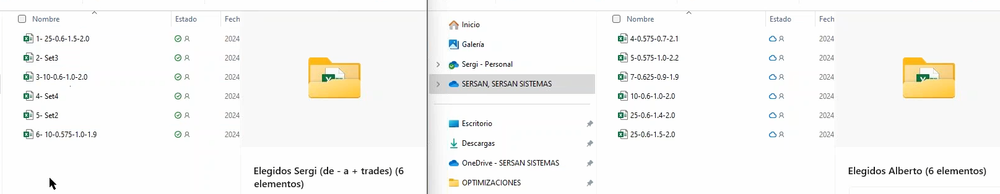  

**Cruce entre listas: sets en común y sets que difieren**

por ejemplo este lo tenemos en común `25-0.6-1.5-2.0` pero bueno alberto me ha dicho que luego los set no nos ha considerado esa que no se sabe si se los elegiría o no que no se ha considerado `10-0.6-1.0-2.0` también lo tenemos estos dos lo tenemos los dos y este 10 0 5 este no lo tengo yo lo tengo yo y tú no vale y luego pues tú tienes varios como has elegido otros y demás bueno bueno esta es un poco la selección que hacemos de set

**Dificultad: pocos sets en la zona 4 pese a ser robusta**

aquí el problema es que en esta selección fijaros que no se nos ha quedado a mí no me ha quedado ninguno del 4 aunque esos que operan puede ser que alguno lo sea alberto sí 4 5 que esa zona es buena esta 4 5 y 7 es buena 

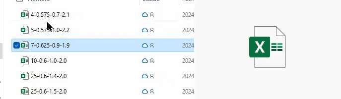  

lo hemos visto antes aunque `25` estaba muy bien y de hecho ese sino recuerdo mal es el que iba mejor, NO podemos ver la curva pero es el que iba mejor fíjate que se lleva el tp a 1.5 `25-0.6-1.5-2.0`, este además nos gusta mucho porque no hay muchos los cortos cuesta encontrar un set ahí con o tp y aguanta lo suficiente.  
este es probable que aunque se salga un poco de la zona lo lleváramos a operar 

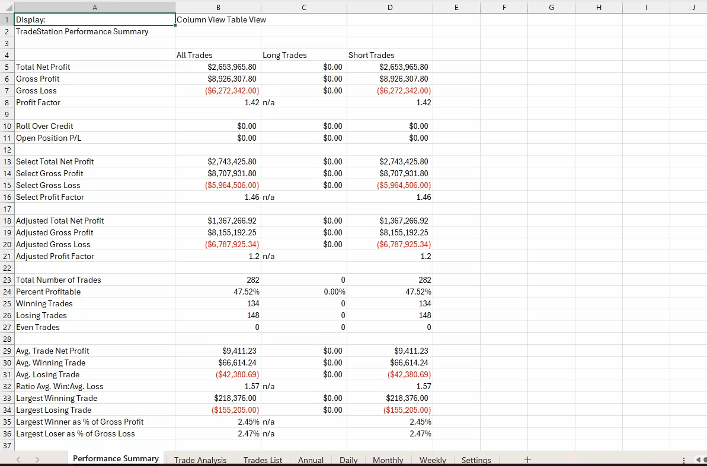  

porque en esta zona aguantaba bastante tiene `0.6` y tener tp de `1.5`  en cortos si realmente funciona que creemos que se puede funcionar porque lo ha hecho se ha operado en esa zona estaría estaría muy bien

**Proceso de sustitución: qué sets entran y qué sets salen**

y el resto de sets ya digo están operando el único yo al final es cupido el 1 y el 5 

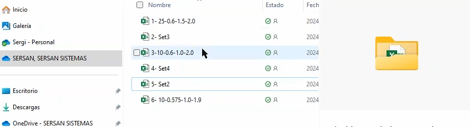 

el 1 es el que estaba en alerta se ha lavado y el 2 3 y 4 se quedan entonces el 1 y el 5 pues se podrían sustituir por estos hay que ahora ponerlo en común para que por lo común, pero sería el procedimiento normal que haríamos ahora íbamos una revisión de estos en pantalla

**Selección vía Porfolio Maestro: última fase**

y a veces nos quedamos con más y hoy me he quedado a ver nos quedamos con puedes quedar con 10 porque luego puede haber otra fase digo verlo en pantalla conjuntamente y como ya os dije vía portfolio,,, de acuerdo, es decir, vía portfolio, ver ya cuál le pasa más, es decir, meter meterlos todos, distintas combinaciones con tu mezcla de portfolio y ver cuál de ellos va mejor a la cartera, va mejor la cartera, porque a lo mejor este `25-0.6-1.5-2.0` es mejor por sí solo pero resulta que este `3-10-0.6-1.0-2.0` a la cartera le va mejor porque diversifica más porque esto ya lo tiene otro sistema que operas entendéis?

**Revisión de *incrementos*: técnica correcta para detectar granularidad incorrecta**

una de las maneras de mirar los incrementos entonces lo hemos hecho aquí all_data yo miro la variación , si yo tengo aquí un número entero vale es decir variar un punto del número entero cómo varía es decir estabilizo todas menos la que es el número entero que es el indicador aquí mira aquí tengo otro que varía el número entero no varía

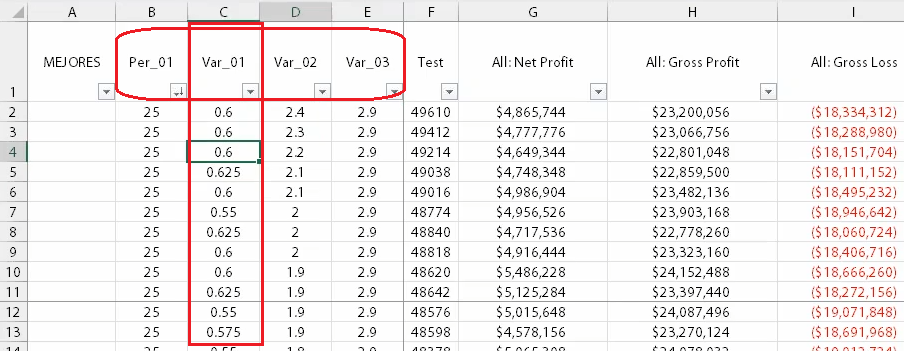

este es el que hemos visto antes que hemos visto antes vale entonces esta es una una variación

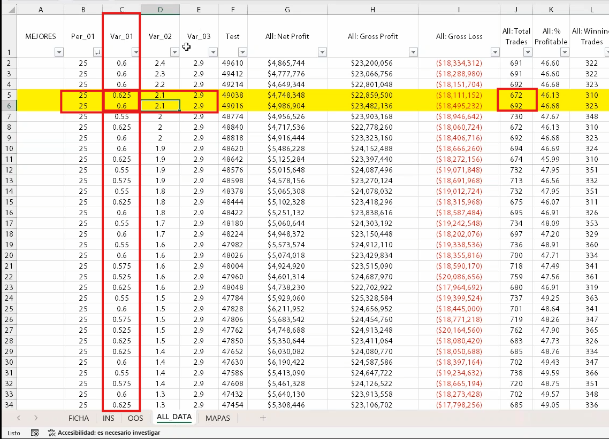

**Segunda técnica: observar cómo varían las otras columnas cuando cambia un input**

pero lo que te decía otra de las maneras es ver cómo varían las otras entiendes que eso es lo que no hemos caído antes es decir si yo tengo aquí un número entero vale es decir variar un punto del número entero cómo varía es decir estabilizo todas menos la que es el número entero que es el indicador aquí mira aquí tengo otro que varía el número entero no varía solo dos trades 

  

entonces desde este punto habría que ver también el valor bajo desde este punto de vista eso que te decía la sensación que me daba es que ese 0 0 25 era un poco alto entiendes

pero hay que mirarlo mejor entonces pero es bastante probable bastante probable que volvamos a trabajar un poco esto 

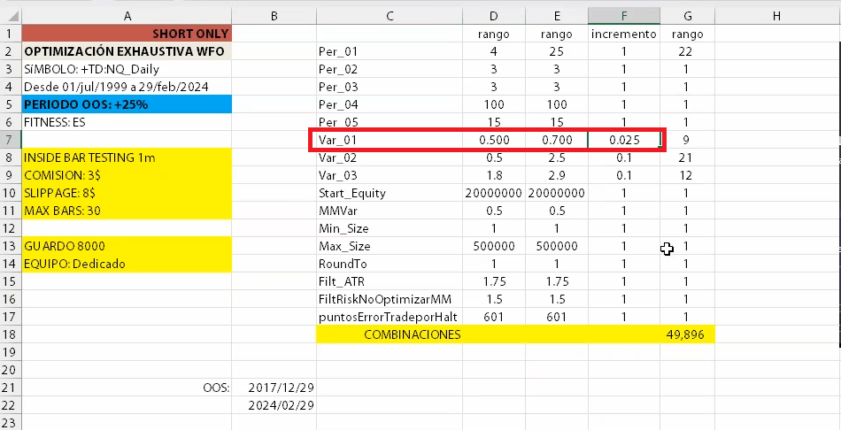  

a ver si lo bajamos un poco ya de paso volveremos a analizar `Var_02, Var_03` y como hemos visto esta zona `Per_01` el rango lo abriremos hasta 29 la abriremos, es probable que la volvamos a hacer con estos dos criterios pero bueno lo que va a salir va a ser de este entorno que esto pasa a veces analizando los datos pues te das cuenta que te has equivocado que la zona que has tocado un límite que tal es así

**Confirmación empírica: variaciones excesivas en increments evidencian mala granularidad**

y aquí aunque esto lo revisamos hace unas semanas sobre los incrementos pues no sé ahora deciros por qué pero mirando estos datos yo mi sensación ahora mismo es que el incremento es un poco elevado mira aquí tengo otra variación del corto solo ser el 6 25 y me varía nuevamente un montón de trades 

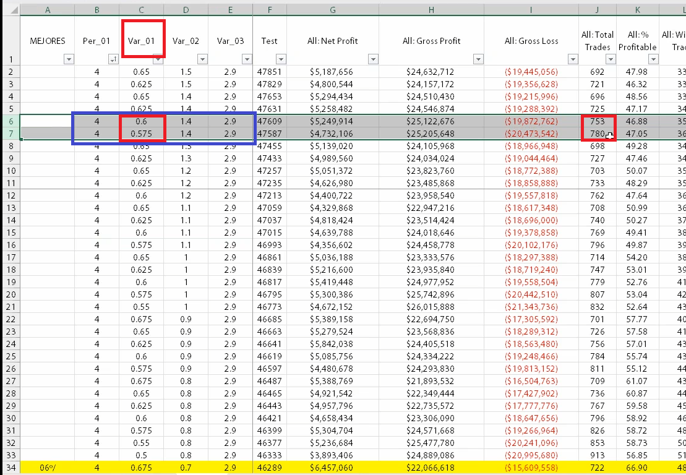  


me varía otra vez 27 trades es demasiado en la parte baja no te varía más

**Comparación con inputs discretos (enteros) para calibrar variación esperada**

cuando en el que es de un número entero que es así que menos no puede ser podía ser más pero no menos a ver aquí en la parte baja mira aquí tenemos 45 aquí en la parte baja bueno un poquito más que antes pero pero como veis estamos en menos son 11 trades 

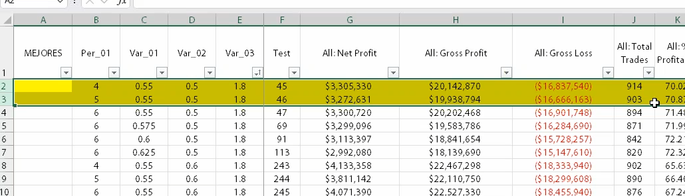

y en 5, 10 trades yo lo encuentro que puede estar una zona razonable en esta magnitud de que son más 900, pero que bueno es eso, no, cuando era antes 20 sobre 680 es un 3% 

**Límite superior razonable: incremento máximo basado en input entero equivalente**

no es fácil encontrar una pauta rígida pero es lo que decía una manera que puedes buscar es ver que si tienes algún otro parámetro que va por número entero, no puede granular, podía ir a de 2 en 2 o 3 en 3 pero no puede ir a menos de 1 pues ver ese 1 cuánto varía entonces ese como mucho ese es el límite

**Diferencia entre incrementos lineales y porcentuales en distintos indicadores**

entonces también es depende no porque no es una media pero imagínate que es una media no es lo mismo de 4 a 5 que de 25 a 26 esto por ejemplo en algún sistema lo hablamos quiero que lo enseñamos tenemos un código para granular el incremento porcentualmente es un poco más complejo pero pero bueno al final no es más que programación, en variarlo por eso que varía más de 4 a 5 que de 20 a 26 al revés perdón que varía menos de 4 a 5 y que se va haciendo exponencial luego llega a 20 y a 3 en 3 por ejemplo, porque esto tiene tiene bastante sentido

**Conclusión: el incremento actual de bar1 es demasiado amplio y debe reducirse**

pero bueno eso es un poco lo que hablamos de los incrementos así que sí que da la sensación que ese es un poco alto y mira ya que estamos vamos a mirar también los de 0.10 y aquí tenemos este por ejemplo este está ahí en 12 trades de diferencia 

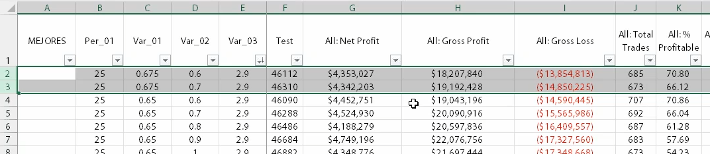 

este este este parece más razonable parece más razonable 10 15 trades eso es que parece más razonable parece más razonable

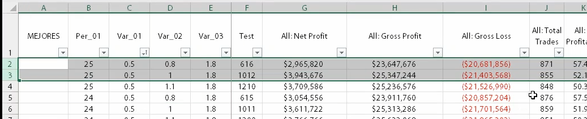 

**Zona baja: variaciones correctas; zona alta: variaciones excesivas**

si bajamos mucho de stop en aquí tenemos variación de 2 tics 

 

son más o menos como el otro era 1, osea, este el Var_1, da sensación que está demasiado amplio, vale? y ese puede ser y probablemente es uno de porque le saltas demasiado de cadena , fíajte la diferencia entre 0.525, 0.550 y 0.575


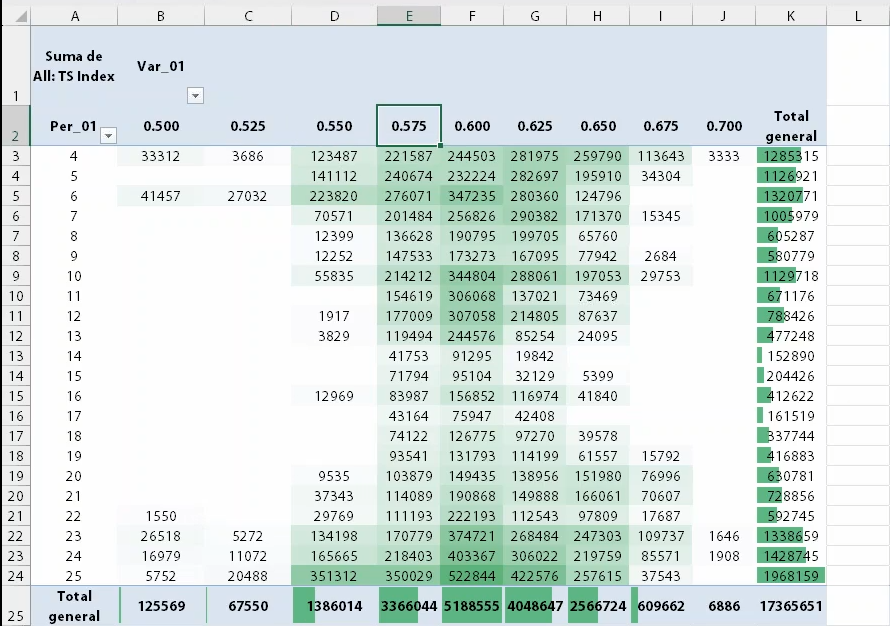 

y esto sin querer porque no se ha previsto los incrementos, pues nos ha salido que que quizá los incrementos de este input no están bién, y veis un poco lo que os hablaba en la teoría que muchas veces de la importancia de los incrementos normalmente la prudencia de no pasarse, pero que también lo comentamos, es necesario captar las señales, y al final puedes pasarte y como todo tiene su,,, tampoco es que esto sea una burrada ponerlo no sería una burrada operarlo con este incremento ni mucho menos, pero está un poquito justito, vale, está un poquito justito y deberíamos de seguramente bajarlo un poco más, o incluso hasta la mitad de 125 hay que verlo

  


***-Una vez os salta una alarma (cuál?) para indicaros que una estrategia con un set de parámetros no está rindiendo:***
  ***-Realizáis una optimización de todo*** 
  ***-En base a esta optimización concluís, revisado por dos pares de ojos (gafas a parte), que un nuevo juego de parámetros irá mejor? Es así?***

sí sí bueno es que es que es depende o sea salta una alarma cual? la alarma os lo he mostrado aquí al principio, nosotros la mayoría de veces que revisamos, revisamos sin alarma de acuerdo es decir porque tú ya le tienes sensibilidad al sistema lo va siguiendo, lo que te digo ves los gráficos y ves que no está yendo bien vale

pero aún así, hay alarmas en los códigos, que es eso que habéis visto, que cuando salta peor drawdown, peor trade, y peor serie de fallos,,,, salta un aviso vale? y lo vemos pero lo normal es que cuando salte ese aviso ya está revisado

ahora queremos implementar ,que sí que cuando hacemos un análisis tenemos dudas bajamos una lista de trade en excel y eso lo enseñamos en una práctica y lo hacemos, lo que llamamos la revisión más completa, pero ya digo, normalmente antes de eso ya ya nos salta, nosotros os explicamos en manera transparente las cosas que hacemos, como hacemos, y también os explicamos cómo hay que hacer algunas, que a lo mejor no lo hacemos pues porque no hay tiempo porque consideramos que no que no renta el esfuerzo que con que vale hacerlo por para porque ya lo miro con este código que habéis visto, me entendéis?

pero aún así en la teoría os hemos explicado las maneras ortodoxas de hacerlo, y la que si tú tienes un equipo o tienes tiempo suficiente para desarrollarlo y demás, pues,,, vale la pena hacerlo pero por eso digo que no os volváis locos con eso porque mirando un performance report, vigilando el drawdown, vigilando los resultados del sistema, se puede hacer, la manera ortodoxa de hacer es llevando un control de operaciones y que a partir de 30 trades, ya os lo os lo expliqué, hay distintos análisis estadísticos y también me suena que dimos el excel de eso, pero ahora tengo dudas, y se pueden hacer distintas pruebas de evaluación y con eso sale, pero de verdad, los que tengáis un nivel avanzado bien, los que estéis en una fase inicial no os comáis la cabeza con eso, de verdad, no os comáis la cabeza y basaros en cosas: drawdown, racha de fallos, etcétera,

**Procedimiento real de revisión para este sistema concreto**

entonces el proceso de revisión de este sistema ya digo es un sistema que lleva mucho tiempo operando y consiste en eso, revisar nuevamente los mapas, y no lo he dicho eso por cierto los sets que elegimos que están hechos en una optimización que viene desde el 99, ***se miran solo en los últimos 10 años***, lo ponía en la carpeta pero no lo he dicho no este performance report que cogemos no es de todo el histórico es de los últimos 10 y si el sistema es intradía puede ser de 5 incluso de 2, vale? depende del sistema

porque? porque a mí yo ya he elegido yo ya he optimizado he hecho los mapas de todo el histórico, pero para acabar de elegir sets y ver, me interesa dentro de esa muestra de todo el histórico, es decir no no optimizo sólo los últimos 10 años, yo he optimizado todo, pero dentro de esa muestra del histórico me centro sólo en el último periodo más cercano que son los últimos 10 años, no ves el 99, son pues 25, final es la mitad, y podía ser un poco menos pero bueno como es un sistema diario que al final eso tiene 303 trades , estas combinaciones aquí pueden tener 303 280 de ese orden entonces bueno menos ya... preferimos que sea una muestra de ese tipo, pero si fuera intradía a lo mejor y pues lo haríamos con más con más trades.

***Qué pasa cuando salta una alarma y cuándo se reoptimiza todo***

sí, realmente hemos hecho más cosas, como os decía antes, que por ejemplo revisamos el tema de los incrementos, revisamos miramos los miramos los que están operando para evaluar si estaban rotos o podían estar todavía dentro de una zona normal, concluimos que alguno podría estar ya demasiado desviado, y ahí se inicia este proceso de optimización de todo, porque se sospecha que puede haber algún set fuera de rango

y de hecho se ve que alguno está un poco forzado ahí en el mapa, un poco justo, de acuerdo, que está ahí en la zona un poco justa, porque ahí esto ahora no no he querido tampoco decirlo porque no lo he enseñado pero de las últimas veces el 3 degrada mucho, es decir normalmente la vamos a ahora hacer para arriba para arriba ya sospechaba que saldría bien lo que para arriba sospecho que va a salir bien para abajo sospecho que va a salir mal, para abajo sospecho que va a salir mal, entonces los cuatro ahí están un poquito más más justos entonces ese son sets muy inestables y bueno pues ahí sí es el resumen en esta estrategia que es una estrategia que opera en gráfico diario que lleva muchos años operando y que es extremadamente sencilla o sea que es un sistema extremadamente sencillo el sistema de operar no son ni tres líneas y digo tres por no decir dos

***Por qué no se hace walk-forward para Apolo***

sí que se ha hecho walk forward para apolo el problema que tiene de hecho tenemos pendiente intentar e intentar hacerlo lo que pasa que en tradestation nos ha petado porque tiene demasiadas lo que ya creo que ya os lo conté nos reventó entonces ahora hemos bajado una demo que tiene buena pinta y estamos en ello entonces vamos aprendiendo un poco pero pero porque tenía que ser más estrecha no me convence estrecharla tanto al final lo trucas

pero el walk forward en este tipo de sistema, uno es diario, el número de trades va muy justo, vale ,hay que hacerlo sin gestión monetaria, porque la gestión monetaria al hacer rolling la mayoría lo cuentan por dinero y entonces se rompe, se carga el drawdown, no es comparable, porque el drawdown claro va subiendo, va subiendo el retorno va subiendo el drawdown a magnitudes enormes, entonces digamos que no sé si este programa lo hará pero el tradestation no homogeniza los resultados bien los toma en valor absoluto entonces al final no se pueden comparar los distintos periodos y más en un diario que mezcla muchos años

entiendes entonces los periodos in sample y out of sample haciendo el rolling que va haciendo no son comparables y al final da datos de comparar peras con manzana,s entonces, hay que hacerlos sin gestión monetaria, y el otro problema que tiene un equity en short, vale, es que es muy inestable, es decir, te pasa muchos periodos de mercado largo, o sea, encontrar una ventana óptima es complejo porque es un mercado como os he enseñado antes que no es nada estable no es nada estable

entonces el short es muy complicado de pasar en un walk forward en un equity, es muy complicado, pero aún así tenemos pendiente mirarlo, sí que lo ha pasado seguro cuando operaba o sea cuando lo optimizamos junto, que esto ya os he comentado antes el inicio que lo hacíamos así lo pasaba, porque lo tenía más trades, y entonces tenía la capacidad de ir a los dos lados y adaptarse mejor

pero así es extremadamente complicado semanalmente complicado porque porque que un periodo tenga capacidad predictiva para el otro, en el largo es más fácil, pero en el corto es muy complicado porque depende de ventanas muy estrechas, y entonces claro cuando entra un periodo muy alcista se pone en modo muy alcista, pega una pequeña corrección un poco fuerte y como está en modo alcista no entra, entonces bueno, es complicado que los parámetros vayan adaptando haciendo rolling

**Opción alternativa: Anchored Walk Forward en lugar de Rolling**

entonces aquí sí que suele ser mejor, puede ser que vaya mejor en el anchored, eso lo tenemos pendiente de mirar, puede ir mejor vale, porque al final el periodo es mucho más largo, entiendes, y eso es lo que necesita un sistema de este tipo parámetros muy largos o sea que sea muy muy largo el periodo para poder adaptarse , para poder encontrar todo tipo de mercados con los parámetros que se muevan de manera distinta en todo tipo de mercados porque al final se está moviendo en un territorio que es hostil para él

o sea esto es obvio es obvio que un sistema de cortos para equity es una zona hostil, no es un no es una zona ideal, de hecho hay mucha gente que defiende en no hacerlo esto, es lo que claro, lo explicado porque nosotros lo hacemos, pero vais a leer mucha gente entendida incluso que te va a decir que no operes nunca en corto en bolsa te lo va a decir mucha gente

**Nuestra lógica: alfa y descorrelación para carteras de clientes**

no es incorrecto pero yo vuelvo un poco a decir lo que te decía antes del portfolio y lo que tú quieres hacer a nivel de producto cuando tú de una manera u otra tratas de obtener rentabilidad para otra gente de acuerdo para terceros entonces nosotros al final esa es nuestra intención, nosotros es ganar dinero a través de que clientes que operan nuestras estrategias ganan dinero y por eso yo tengo dos perfiles tengo un perfil que es ***smart beta*** y tengo un perfil que es ser ***alfa***

entonces claro la alfa es eso la alfa sobre todo es batir a la renta variable, es decir tener correlación cero o negativa con la renta variable, entonces claro si tú buscas alfa, ya sé que cuesta, pero meter cortos da mucha alfa, que tú quieres beta? pues ya tienes ***smart beta*** que hace eso.

**Recomendación personal para traders en formación**

que haces entonces es un poco depende de lo que tú quieras ahora tú estás haciendo un portfolio estás empezando? olvídate de los cortos en bolsa, olvídate, o sea no es el sitio fácil, las cosas fáciles no es buscar cortos en bolsa no es buscar cortos, ahora que tú ya tienes una cartera y buscas algo para diversificar tu cartera de bolsa pues adelante, a por ello , pero no es la primera cosa a hacer ni mucho menos, ni probablemente la segunda

aunque el otro día, lo comentó Senen en el discord y nosotros también en el ***ORB*** digamos nos fue más fácil sacar cortos que largos, pero eso tiene el sentido de que es lo que se explicaba, al final a los ***ORB*** les está escapando, que pasa aquí con con el tp? lo habéis visto de apolo no, que quiere corto el TP, lo quiere cerca ,porque el corto necesita en bolsa operar rápido y salirse rápido

en cambio un ***ORB*** que hace hace eso, nosotros probamos un ***ORB*** que cerraba a final de día ese fue lo que intentamos encontrar, entonces claro si yo te estoy obligando a cerrar a fin de día, pues en el lado largo normalmente estás escapando mucho rendimiento, porque si va a subir va a subir va a subir cinco días pues para qué cerrar a fin de día entonces luego hay gaps etcétera

en cambio en el corto es al revés, eso es lo que le gusta le gusta hacer rápido perfecto, pues es más fácil si tú obligas a cerrar en el día con encontrar con roturas de volatilidad hagas tp te salgas y ganas en corto, entonces un ***ORB*** intradía cerrando a fin de día es más fácil en corto que largo

pero esto no es contrario el otro, justamente es lo mismo, refuerza, es por la obligación a cerrar a fin de día entiendes, porque yo lo obligo, si yo le hago mantener la posición dos días completamente se invierte la tortilla, entonces el corto le va a costar una vida un montón, en el largo te va a ser muy fácil, entiendes, es un poco la diferencia de dejar correr o no dejar correr, los cortos no quieren correr no quieren dejar correr beneficios, en cambio los largos quieren dejar correr porque el mercado no hace más que subir en el largo plazo de acuerdo?


