**El Debate entre Builders y No Builders en el Trading Algorítmico**

Es interesante porque se abrió un debate ahí entre builders y no builders. Para quien no lo sepa, Drauger es un trader algorítmico bastante conocido que también, como Ivan Sherman, ha ganado el campeonato del mundo de trading varias veces y que está considerado pues uno de los grandes, de acuerdo, en *Stocks & Commodities* encontrarás varios artículos de él, entre él, Kevin Davey, Kauffman (probablemente Perry Kaufman), hay bastantes, Larry Williams, distintos pero más antiguos quizás. Drauger ya es mayor pero es más moderno que Perry Kaufman o Williams, son grandes grandes estrellas del trading algorítmico podemos decir, vale, que destacan por su formación, por el caso de Kevin Davey y Andrea Unger pues tienen bastante bastante formación, son conocidos conocidos por ello, pero también pues, han ganado o bien han ganado el campeonato, tienen operativa y demás, entonces es verdad que Andrea Unger al final sobre todo es conocido por sus formaciones, pero como digo ha ganado ha ganado el campeonato del mundo, no es no es fácil, no es fácil ganarlo porque es un año de operativa real, pero pero sí que es verdad que le pues es *focus* academia y de hecho incluso yo estoy dado de alta y esa está un poco, en mi opinión mareante, es muy agresivo, es decir si tú no, yo pero yo os lo digo, si yo no supiera que Andrea ha ganado ha ganado el campeonato, supiera que es un buen trader porque lo sé de buena tinta, no sé, no tengo ninguna duda de ello, pensaría que es que humo porque su marketing es tan agresivo, de verdad es de los más agresivos que yo que yo he visto, normalmente cuando ves tanta agresividad con con la venta de cursos de material, tanto spam, tienes a pensar que que no hay nada, pero bueno, ya digo que cero dudas respecto respecto, pero vaya que sí que tienen un *focus* venta de producto muy *heavy*, están muy muy muy enfocados en eso, tiene un equipo enorme de gestión de la de la academia además no, y esto en mi opinión puede ser pero sólo puede ser es una teoría, que que genere un cierto sesgo, no, un cierto sesgo a la necesidad de siempre estar generando contenido, nuevas ideas, tienen como un concurso además para los alumnos, siempre hay que estar como generando generando movimiento, porque si no pues no puede, si tú si nosotros ahora por ejemplo nuestro, imaginaos que ahora nuestro *focus* cambiara y de pasar a dedicarnos principalmente a la operativa decidiéramos dedicarnos principalmente a la formación, pues claro habría que estar todo el rato generando cosas, y habría que seguramente tener mucha más gente trabajando para poder hacerlo porque es que sería imposible, entonces para generar el producto formativo pues hay que estar todo el rato dedicado a ello, y hace falta muchísimo muchísimo trabajo, vale.

Entonces este mi opinión pues genera un cierto cierto sesgo, él tiene un método porque le ha puesto nombre que se llama *Andrea Unger Method* también que sí que el de Andrea tiene una particularidad que ellos tienen unas especies de librerías de filtros o de señales de entrada de *setups* y es interesante, no digo que que no lo sea, es es interesante, y ahí se abrió el debate respecto a esto.

**Comentarios del Debate sobre Filtros y Optimización**

***Al hilo de la pregunta de Juan Manuel que se comentó al comienzo del último directo dice Sergi que no es recomendable optimizar también los valores del filtro. Al final esto es una optimización implícita, entiendo que sería aconsejable hacer aunque sea pequeñas variaciones de ese valor del filtro para comprobar la robustez. Que el filtro funcione es una cosa, pero que sea robusto es otra.***

***Siguiendo con el hilo este de los filtros, hay algunos traders famosos como Andrea Unger que tiene su propia base de datos con múltiples entradas y lo que hace es un poco lo que ha propuesto Juan Manuel. Tiene un switch (también se puede hacer con if then) para probar cuál de sus entradas funciona mejor en ese activo/tf. Para mí esto es muy interesante, por si alguien quiere investigar...***

***O sea, ya no se trata de un filtro en sí sino de seleccionar el gatillo de entrada. Y esto se puede extrapolar a otros bloques de la estrategia, claro.***

Comentó primero que tenía una base de datos y que le parecía un tema interesante a nivel de *switch*, que es que es cero, buscas aquí *switch*

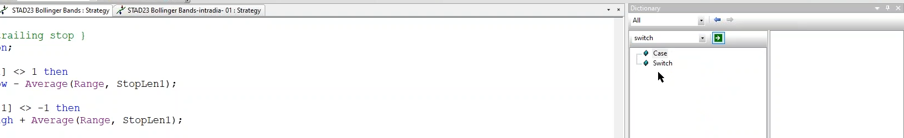

  <strong>📏 Función Switch en EasyLanguage</strong> 
  La función <code>switch</code> permite evaluar múltiples casos de forma eficiente, especialmente útil para probar diferentes condiciones de entrada y salida sin necesidad de anidar múltiples declaraciones <code>if-then-else</code>. Es fundamental para implementar sistemas de trading con múltiples estrategias seleccionables.

Sirve para probar distintos tipos de entrada y salida, nosotros de mucho menos evolucionado que esto que comentaba Rubén, enseñamos algo en la clase 5.6.3 la evaluación preliminar y dijimos que lo haríamos en la práctica y lo haremos, la práctica tenemos pendiente una práctica exclusivamente de eso, decidimos empezar de esta manera haciendo algún sistema y luego irá ir aprovechando también las nuestro propio trabajo para hacer cosas, como la revisión de Apollo que hicimos la semana pasada, iremos iremos haciendo distintos temas que complementa la teoría porque al final la teoría que queremos que creemos que en general está bastante desarrollada, entonces al final la práctica lo que pretende es complementar, añadir añadir contenido a lo que ya hemos hecho la teoría, y también pues el tener acceso a vosotros a poder preguntar abiertamente sobre todo. Entonces haremos una práctica de eso en la que evaluaremos señales de entradas y esto se hace siempre con `case` como viste ya digo en el 5.63 hacia la parte final pero habrá muchas más, habrá muchas más que las que viste es ahí pero se hace así.

entonces pues bueno él tiene un montón de setups y él lo va probando de manera para mí hasta un poco exagerada probando distintos y lo optimiza y demás, no bueno el aspecto que concretaba y rubén ahora luego voy a mi respuesta y se abre otro debate pero el el concepto que preguntaba de eso de del switch para probar distintas entradas que funciona y dice que para él esto es muy interesante por si alguien quiere investigar, sí que es interesante vale pero más que investigar es un camino que insisto visteis en el 5,6,3 y que veréis en la práctica es correctos, eso está bien, ya en la respuesta Juan Manuel le comentamos en directo la clase pasada que sí, que eso es buena práctica, que como todo pues hace falta buen criterio y prudencia, pero es buena práctica y que esto la evaluación preliminar está bien, de acuerdo, ir probando distintos gatillos triggers o setups, pues enfocarlo de distintos puntos de vista y también pues porque no con las salidas, de acuerd,o se puede se puede probar con cualquier cosa, 

entonces ahí en mi respuesta ahí pues no sé si quizá no me no me explique bien 

  <strong>📏 Respuesta Builders</strong> 
Hola Rubén,
Gracias por la aportación, pero intentemos dejar la sección de preguntas solo con preguntas por favor.
Es un tema interesante como dijimos en la pregunta de Juan Manuel. Mañana profundizamos en ello en la clase, pero a ver si podemos dejar claro nuestro punto de vista aquí en el Discord.

Tanto en la teoría como en la pregunta de Juan Manuel dijimos que sí se puede hacer eso. Al final eso no deja de ser una especie de Builder, pero hecho directamente en el EasyLanguage y mucho más acotado y dirigido que un Builder externo. Lo que no haría es meter un montón de tipos de entrada distintas y encima optimizar también el input en ese momento en cada uno de los setups.

En nuestro procedimiento se haría un un poco en la evaluación preliminar. Tu ahí puedes buscar que tipo de entrada le va mejor a un activo y puedes usar un código que pruebe distintos tipos de entrada con un parámetro general. Pero o no optimizaría el valor del input o lo haría muy ligeramente, pero claro, esto siempre depende de grados de libertad, trades, histórico...

En la teoría vimos un ejemplo de esto en el vídeo 5.6.3 hacía la parte final de la clase, incluso enseñamos un código de EasyLanguage sencillo. Dijimos entonces y sigue en pie, que haremos una práctica de esto, de búsqueda de entradas con código (también puede hacerse con las salidas). Esto también puede servir para ver qué características tiene un activo.

Una vez evalúas esto en la evaluación preliminar ya sigues para adelante en la evaluación con la idea ya más definida y ahí si que podrías optimizar el input o no.
Y obviamente, como hemos dicho varias veces, hay veces que las fases se mezclan y se puede hacer casi conjuntamente porque el sistema ya es muy sencillo o tiene pocos trades y no lo vamos a optimizar, con lo cual la evaluación preliminar y la evaluación son muy similares.

Lo que comentas de Unger es la máxima expresión de esto, ya que él tiene una biblioteca enorme de setups lo cual puede ser interesante si se usa correctamente y si se tiene las bases para saber elegir y manejar toda esa información, que es lo que pretendemos con este curso.
Es un poco como decimos de los Builders. ¿Pueden ser útiles? Sí, pero no para empezar y siempre con mucha prudencia.
Mañana en la clase más y mejor 

diciendo que es una especie de builder sí sí que eso para mí eso sí que es una especie de builder en el sentido de que es un buscador de acuerdo es un buscador pero es un builder bueno de acuerdo se está mucho mejor hecho que un builder porque un builder al final tiene millones de combinaciones, de acuerdo, millones de combinaciones y lo reoptimiza todo y lo puede reoptimizar todo, que también lo puedes acotar tú y ahí es donde puede tener sentido builder, ya lo he comentado en la teoría, pero para mí es para mí el objetivo del curso que lo decía aquí es una de las cosas que quiero dejar claras, es esta frase de aquí :

Lo que comentas de Unger es la máxima expresión de esto, ya que él tiene una biblioteca enorme de setups lo cual puede ser interesante si se usa correctamente y si se tiene las bases para saber elegir y manejar toda esa información, que es lo que pretendemos con este curso.

  

esa es la máxima expresión el derecho de combinar un montón de posibilidades y hacer un case que tiene una biblioteca enorme y que puede ser interesante si se usa correctamente y si se tiene las bases para saber elegir y manejar esa información y ese es el objetivo es siempre ha sido nuestro objetivo del curso, al final enseñaros a tener criterio 

pero el criterio al final se consigue mediante conocimiento y práctica, pero al final todo depende de eso, porque por mucho que todo sea objetivo, o perdón mejor dicho por más que tratemos de objetivizarlo todo al máximo siempre va a haber un grado de subjetividad porque quien a quien decide es un sujeto aún basado en reglas objetivas, y esto lo veis en la lo explicado otras veces con muchas cosas y es así, quizá haya gente que se acerca al económico que le parezca extraño pero si pensáis en la vida real veréis que no es tan extraño y lo lo podéis pensar lo puse como ejemplo, yo que sé, el tema del covid por ejemplo, con las mismas con la misma información hay gente que defiende una cosa de gente que defiende justo a la contraria y tienen exactamente la misma información, entonces y bueno y con muchas más cosas, y bueno no digo ya con una imagen de un de fútbol porque entonces ya nos volvemos locos, es decir, o sea, hasta con un fuera de juego o hasta con un con un con un penalti gente que dice que es gente que dice que no es, todo el mundo tiene la misma información disponible, vale, entonces al final evidentemente esto es esto del fútbol es un extremo, porque además incluyen sentimientos, pero eso vale tú dices pero es que hay sentimientos, ya, ya, pero es que el sentimiento si hablamos de ciencia o hablamos de datos se traduce mediante sesgos, vale, y también los hay, y también los hay con los datos, también los hay con los datos, y también los hay con el hecho de que un sistema sea tuyo, etcétera, entonces lo mismo que un equipo tuyo, un sistema tuyo, etcétera, entonces al final lo hay,pero lógicamente con más información con viendo distintas opciones, conviendo ejemplos y tratando de hablar de ello pues insisto los conocimientos y procedimientos adecuados pues se se puede reducir a la máxima expresión que es lo que lo que intentamos, 

entonces aquí repreguntaba hablaba de `mean reversal`  por ejemplo es verdad que yo lo he hablado muchas veces él por eso seguramente me lo soltó y decía si creía que era igual que un builder, y yo digo que no, no es igual que un builder, no es igual que un builder, de acuerdo? al final lo que hace Unger es, 

el que enseñé durante durante la clase [18-practice-08](02_practice/02_workshops/18-practice-08/code/STRATEGY_VB_01.ELD)

esto es es plantilla con cinco diferentes entradas estándar y 12 salidas aquí con esto le das un input y esto cada que es va del 1 al 5 normalmente lo ponemos en comentarios elegir de 1 a 5 salida a 0 elegir de 0 a 11 de acuerdo y aquí aquí de un indicador para bueno eso es un código que permite pintar pintar directamente el gráfico desde un sistema es un poco complicado no nos paramos pero aquí ves que tienes aquí tu swich aquí eligiendo 1 o 2 pues eliges una distinta entrada o eliges una distinta salida 

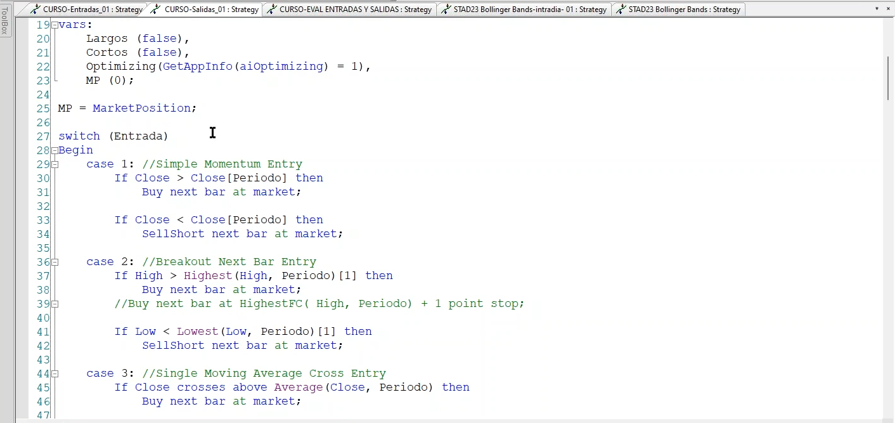

esto es un código de este tipo, que él al final lo que importa es lo que hay en cada `case`, pues pues para que me entendáis uno que en total pues tiene 100 y 200, de acuerdo, que son todos los distintos setups, y eso es interesante porque tú puedes crearte unos filtros, 10 filtros que tú crees que son potentes para tal, te los pones aquí y los puedes probar rápidamente a un sistema, poniéndole aquí en el input 1, perfecto probó volatilidad tal, 2 probó volatilidad 3, de acuerdo? es es buena práctica es buena es buena práctica hacerlo hacerlo así, nosotros un código como tal ya os lo dije no tenemos porque nunca hemos sido especialmente amantes de los filtros, pero eso también es porque nosotros nuestros la mayoría de los sistemas que que hemos operado a lo largo de los años, vale, tienen un sesgo más bien de medio plazo, también los a intradía, pero hay más hay más de diario que de intradía, entonces al final a medida que vas aumentando en diario, que también se puede filtrar, es más complicado de acuerdo, es más complicado y aunque por ejemplo Ungr sé que lo hace y otros otros lo hacen, a mí me cuesta mucho, reconozco que a mí ahí, cuando ya tengo un número de yo que sé inferior a 500 trades por poner un número filtrar me cuesta mucho, si ya tengo algo algo aceptable prefiero lo aceptable sin filtrar que lo muy bueno muy filtrado y quitando la mitad de trades, me entiendes, entonces es verdad que ese sesgo lo tenemos y puede estar bien puede estar mal , como decía en la respuesta " no siempre es seguro sí o no" de acuerdo? sí que sabemos cosas que no están bien, pero a veces este ejemplo que te digo yo, es malo filtrar? no no es malo filtrar pero evidentemente sabemos que aumenta el riesgo es sobre optimizar, eso es así, ahora es malo no, no, no es malo filtrar, entonces siempre hay esa se balanza no esa balanza donde tienes que jugar y a lo mejor pues si si si si fuerzas un poco pues no necesitas mayor seguridad mediante más pruebas de robusted o más tiempo de paper trading, o a lo mejor paper pero probado con un lotaje inferior en real para ver cómo va,  es decir bueno al final dependiendo de lo que saques pues tienes que jugarlo de una manera o de otra, pero no no quiere decir que necesariamente esté mal, no, quiere decir que necesariamente esté mal, no, entonces, 

***Por si quieres recoger el guante, te lanzo desde ya la pregunta, me gustaría saber exactamente en qué consideras que fuerza y en qué discrepas. Sé que no forma parte del contenido del curso pero ahí lo dejo por si de forma directa o indirecta quieres comentarlo..Saludos 😉***

me pinchaba que le dijera bueno a mí la metodología en sí,,, para mí cuando él va probando y probando y probando él tiene una metodología en intradía como una especie de plantillas, aunque él dice que,,, por ejemplo él no optimiza los inputs pero luego optimiza mucho las pautas, entonces para mí sigue teniendo el riesgo de sobre optimización en lo que hace lo que él hace, de acuerdo, es decir acepto que es inferior a modificar el input, entiendo que tiene más riesgo optimizar,,, yo que sé ,,, una media por poner un dato o el valor de un `atr` si quieres, vale que el hecho de probar entre 10 pautas distintas que detectan un patrón de volatilidad, etcétera, sin optimizar el input, de acuerdo, que pero claro si tú vas constantemente optimizando utilizando utilizando al final para mí también también tiene el riesgo, no 

yo creo que él simplifica mucho algunas partes y algunas aparentemente las quiere simplificar y también cae en el riesgo sobre optimización, y luego la prueba que hace de `outofsample` pues para mí es demasiado poco laxa, es decir, haría falta un perfil de optimización,,, para mí en la evaluación tiene una evaluación poco laxa, vale, me gusta mucho la metodología de búsqueda de patrones pero yo luego eso lo llevaría a una metodología más convencional de evaluación, de acuerdo, es decir hacerte un perfil, hacerte un mapa, etcétera, el mapa aunque puede parecer que no los hace los hace, los hace,,,, luego en una optimización lo enseña, vale luego en una optimización lo enseño, vale 

no sólo de esto es esta y además no sólo de andrea ha hecho un montón de artículos sobre eso, estoy totalmente en desacuerdo d,e esto estoy totalmente en desacuerdo, de esta idea que tanto él como, esto lo hablé con con ivan con ivan, en no no no recuerdo no que no lo digo porque no recuerdo cuál era su punto de vista exacto porque hablamos un poco de esto de tal y, yo le dije que que yo no era partidario, él no no no me lo dijo exactamente, pero esto para mí cae en un error tanto kevin davey como andrea unger que dicen que las pruebas que han hecho les sale mejor resultado usar SL fijo que esto porcentual o variable,,, para mi caen en un error absolutamente clarísimo 

[Stock & Commodities V. 42:03 --> "Fixed Stop-Loss  And Percentage StopLoss In Comparation by Andrea Unger"](../docs/FIXED%20STOP-LOSS%20vs%20PERCENTAGE.pdf)

que, es una de esas cosas que yo veo tan obvias a veces que no necesitan y ser demostrada, pero parece ser que sí, parece ser que sí, 

al final nos conocemos un poco todos de cada el estilo, tampoco es que sean contrarios siempre dicen que les da mejor resultado de stop monetario igualmente que andrea es contrario a wall forward y Kevin es muy favorable a wall forward de acuerdo es decir es decir que cada cada maestrío tiene su librillo y ambos son grandes profesionales ya que al final 

tengo ya una un pequeño detalle para que lo veis,,, intento demostrar visualmente visualmente el por qué les pasa eso vale a la izquierda creo que teníamos un stop en dólares 4000 vale y a la derecha están % vale

más o menos bueno más o menos es el mismo activo como veis he tratado de calcular el porcentaje que aproximadamente ahora vale me parece que es uno más o menos aproximadamente ahora daría esto similares se ven al punto rojo bastante parecido a precios actuales claro esa es la gran diferencia a precios actuales a más o menos valores parecidos veis 4000 dólares y tal desde el máximo desde el máximo anterior calmos desde algún sitio que contarlo entonces desde el máximo anterior calcula una caída de ese valor de 4000 dólares o de un 105 por ciento vale 

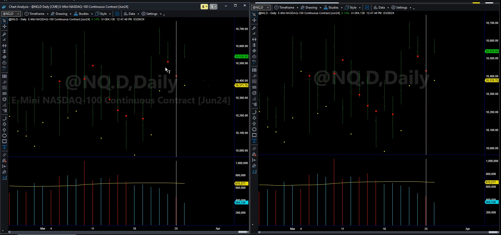

entonces ahora están igualados vale y qué pasa cuando está rojo es que ha saltado y cuando está amarillo es que no ha saltado vale es la manera visual de verlo vale, entonces ahora me voy separando vale y a la izquierda y derecha pues vemos poco más o menos cosas relativamente similares relativamente similares si quizá aquí abajo se vea un puntito más pero se ven cosas relativamente similares vale 

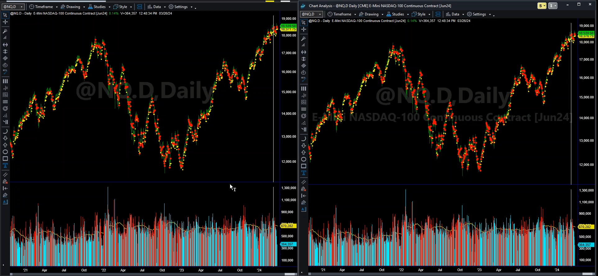

pero qué va a pasar si yo me voy yendo hacia la izquierda oh! misterio 

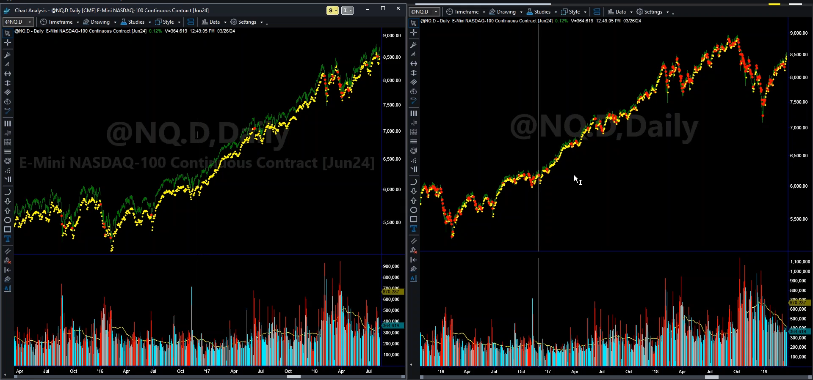

aquí ya casi no saltan stops mismo valor 4000 dólares vale esto lo tengo lo tengo puesto para que se me muevan conjuntamente aquí a la derecha también saltan pocos porque porque no lo he ajustado por volatilidad que sería otra sería otro otro debate por y lógicamente un mercado cista tiene menos volatilidad y por tanto menos veces cae un 1 pero así como veis alguna vez cae, a la izquier aquí apenas tenemos un SL, en toda esta subida no hay ni una sola vez donde el mercado caiga 4000 dólares

En la derecha, aquí en cambio como veis hay muchas y fijaros aquí en la en la caída que esta es la más heavy de todas cuando vemos que ahí también hay volatilidad por lo tanto no era ese vector veis aquí apenas hay unos pocos puntos y fijaros ahí como salta sin parar  (la linea vertical es el mismo punto en cada grafico)

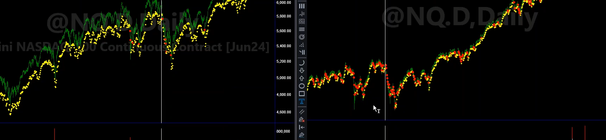

casi cada día salta cada día salta el stop, cada día salta el stop, vamos yendo hacia atrás claro el precio cae el precio cae y lógicamente 4000 dólares veis la línea ahora lo lejos que está está lejísimos del precio 

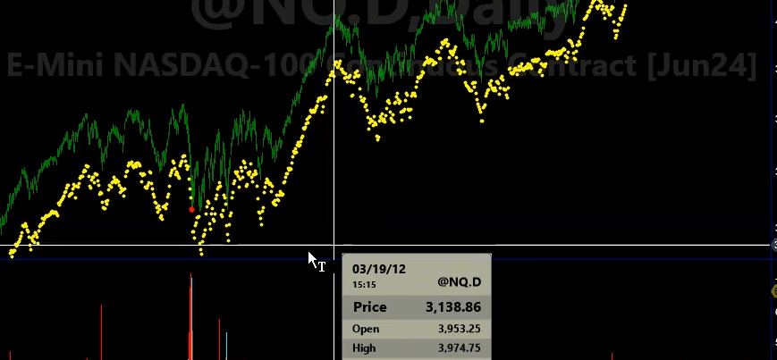

y por lo tanto deja de tener sentido entendéis sólo salta uno aquí y es que no salta nunca cuando a la derecha sigue saltando todo el tiempo todo el tiempo porque es un 1% todo el tiempo vale esto sigue sigue hasta incluso aquí en el 2008 donde es un crack como una casa y ahí salta cada día o nuevamente cada día aquí ni salta a quien es alta el stop de 4000 

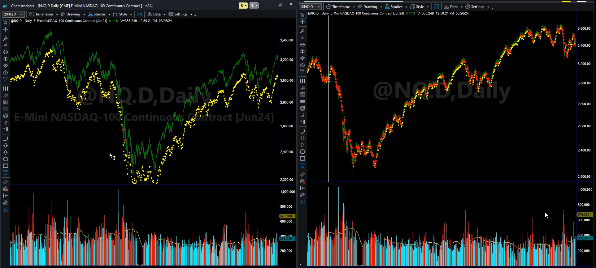

dices "claro porque porque es esto no tiene sentido a ese nivel de precios" exacto1 exacto1 no tiene sentido no tiene sentido porque no se ajusta a la base del precio,,, entonces claro que pasa si yo hago una optimización como hace aquí en ese artículo, el bueno de andrea, concretamente que fechas usa usa, desde él además pone el 2008 justamente, vale dice ves la diferencia hace esa explicación que los hago yo dice son 4000 dice "la lógica dice que sería mejor" pero claro jaimito con perdón perdona andrea perdona de perdona me andrea jaimito es que... 

estás evitando que actúe! decir si tú le haces buscar al optimizador! si tú optimizas, que lo hace, vale, no, no estás ecualizando no estás ecualizando el riesgo igual, entonces claro que te va a salir mejor este, pero por qué te sale, porque no salta, en la gran mayoría de sistemas, usar stop es peor a nivel de profit, salvo en casos donde no haya salida y entonces claro el salir por ejemplo en el caso de bowling era hora de que veremos después veréis un ejemplo donde puede ser porque porque no hay más que salida en límite de profit, entonces claro, evidentemente, si a mí no me dejas salir de ninguna manera, y te pongo un stop, pues mejora porque es que no me dejaba salir en caso de fallo, vale pero si yo tengo el la salida contraria del sistema es también el lado perdedor, imaginaros un sistema que sea un cruce de medias, cuando se acaben cortando se sale , pues vale a lo mejor no tiene un esto monetario pero se acaba saliendo , porque va yendo a la contra, en cambio si yo compro en la banda de bowling de abajo luego lo veréis y automáticamente el precio sigue cayendo y yo solo salgo en profit en la banda contraria, para que pase eso es muy difícil, tiene que rebotar mucho el precio, si no rebota sigue sigue sigue sigue perdiendo, en ese caso un stop suele aportar pero en la mayoría de casos donde la salida contraria ncontempla también salir a la contra, pues ya digo, el stop suele restar vale suele restar rendimiento, en algunos casos puede mejorar los ratios de retorno riesgo pero en el mejor de los casos el profit lo deja aparecido, poco ,en la zona, no hay una gran ventaja prácticamente nunca en beneficio  en poner stop prácticamente nunca, beneficio viene por el riesgo, entonces claro y no siempre es visible en ratios de retorno riesgo, no siempre es visible, pero entonces qué pasa? 

que en este gráfico de la izquierda si yo optimizo el stop de 1000 a 5000 por decir algo normalmente me va a salir un valor alto porque porque me va a salir el valor que se ajusta a la parte alta del precio, no necesariamente a la actual, a la parte que el precio esté más alto, vale a la, porque si no imaginaros aquí ya salta mucho si le pongo 1000 

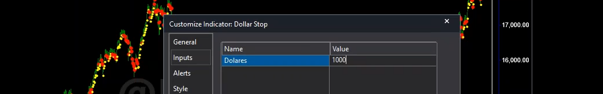

es que ni abre entendéis, si yo pongo un esto aquí para que salte en la parte baja del precio, es que ni abre, es que ni abre, es que cierra abre y cierra, entendéis, entonces es absurdo este a lo mejor sí que salta aquí en el 2008 entendéis este a lo mejor sí que salta,,, aquí sí que en el 2008 salta es claro pero le he tenido que poner 1000 y aún así fijaros que aquí muchos sitios donde no salta 

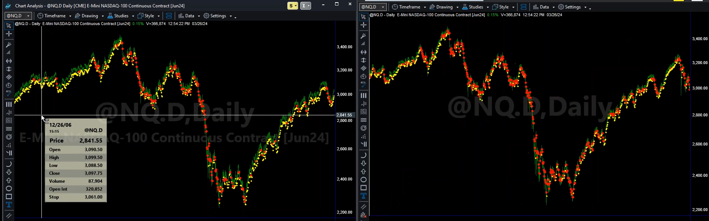

cuando aquí en la izquierda con un 1 salta, entonces simplemente es que no salta el stop, entonces porque le da mejores resultados en monetario? porque salta menos, simplemente por eso, nos parece obvio? a mí me parece obvio pues hay muchos autores que defienden eso, entre ellos andrea unguer. Es que es de cajón, si te poniendo este indicador ya lo ves claro, aquí fijaros yo le he puesto 1000 ahora que podemos decir que estaría más o menos tampoco mucho pero fijaros parece más razonable en la zona baja de los precios, que son precios que tocaron 2008, porque es que hace años pero que en un sistema diario, ya no te digo semanal tenía mucho sentido que lo cargarás hasta ahí, no, pero claro a la parte alta ya es que fijaros aquí es que ni operamos casi no hay puntos amarillos casi no hay puntos amarillos 

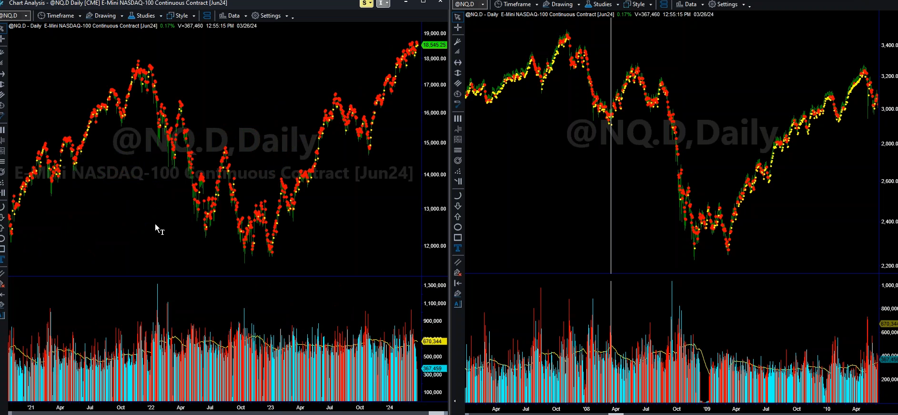

entonces ese es el motivo por lo tanto no es que sea mejor o no mejor a mí no me da igual si es mejor o no es que es absurdo usarlo es absurdo, solo tiene sentido como ya os comenté, era mejor en un sistema intradariario donde el movimiento entre del precio no sea tampoco muy exagerado porque porque a lo mejor se mantiene en rango, porque su vale porque su rango entre el máximo y el mínimo no es demasiado elevado, entonces puede ser que tenga sentido pero no en un histórico que la mayoría es así, que se haya movido mucho de máximo a mínimo, hay que usar porcentuala, por volatilidad, o cualquier caso que se ajuste al precio de cada momento, y usar un valor monetario andrea lo hace siempre así todos sus sistemas, para mí no tiene sentido aunque aunque te de mejores resultados, aunque te de mejores resultados, porque tú no estás backtesteando bien, tú no estás backtesteando bien, para mí no estás evaluando de verdad si es esto tiene sentido en el histórico, o es que me da mejor el resultado, bueno claro, pues mira, pues no sé, pues lee futuro y todavía te dará mejor sabes que si lees a futuro te da mejor, pero no es reproducible, no es verdad, entonces este es un caso típico de esto y entonces bueno entre otras muchas cosas hablaremos de esta, una de las cosas cuando me refería a Andrea, una que no me gusta andrea es esta esta continua persistencia, en usar SP monetario por más que te de mejor resultado, es que me da igual, me da igual, en muchos sistemas si no utilizas `look inside bar backtesting` también da mejor resultado, que es que no sé o sea al final hay cosas que pasan por delante del resultado, esto lo he dicho, muchas veces cosas que pasa por delante del resultado, no se trata de conseguir un buen backtest eso es fácil ,yo lo he dicho muchas veces es fácil si me la pela todo, como este caso entiendes me da igual, pues pues fácil, no es fácil si se hace bien hecho, pero, pero si si el objetivo es ese es muy fácil el objetivo es conseguir un buen backtest es fácil,, pero ese no es el objetivo,, 

### Apolo - tema cerrado

El tema de apolo quedó claro no hay porque si alguien tiene algo que hable ahora o calle para siempre ya si lo preguntáis disco le contestaré pero pero general ya digo que dejamos cerrada la clase vale ya os deje el 

[MAPA excel subido](../../19-practice-09/data/MAPA%20ES%20SHORT%20zona%203.xlsx)

[Sesion : 19-practice-09](https://github.com/alexjust-data/Professional-Trading-System/blob/clean-main/02_practice/02_workshops/19-practice-09/transcripts/practice_09_revised.md)

excel subido hicimos un par de cambios , nosotros lo hemos hecho otra con 30 vale que os lo comenté en directo que nos dimos cuenta que el corte era un poco asimétrico en los tipos de mercado y vimos que probablemente era mejor acortar 30 para ganar más más mercado alcista en la parte en la parte OUTOFsample vale porque había quedado un poco cojo de mercado de mercado alcista, era un pequeño matiz no no cambia no prácticamente nada pero queríamos verlo, 

y luego también en la regulación de los incrementos de acuerdo que sí que al final optamos por bajar un punto este a recordar que os expliqué que viendo la análisis vi que había un salto demasiado grande y optamos por bajarlo, vale, está en la nuestra lo hemos hecho simplemente comentarlo, este ya estaba bien las mapas y las conclusiones son interesantes y nosotros en el otro pues hemos sacado conclusiones bastante bastante similares, pero simplemente comentaros eso y daros cuenta que esa es la realidad, que hay veces que pues tomas una decisión a hacer una cosa lo bien analizando los datos pues para eso hay que analizarlos lo más de la forma más estéril posible, para no no empeñarte no ofuscarte ofuscarte tratar de ser al analizar la información lo más estéril y tal oye pues aquí lo aumenté yo esto hacía en la revisión preliminar decidí subirlo y ahora he vuelto a decir bajar porque pues la verdad que no sé porque ahora lo he visto clarísimo lo hemos analizado y lo hemos visto clarísimo que tenía que ser 0.0125 

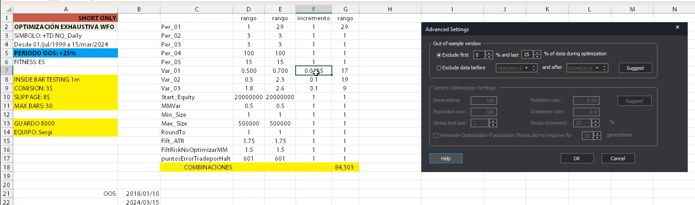

pero ya os digo que esto pues puede puede pasar porque al final ya tratas de no sobre optimizar por eso en caso de duda siempre mejor incrementos más altos pero también hace falta la suficiente señal ya que en el mapa sí que se veía un poco aquí ya estaba bajado un poco pero estos saltos al final apuntaban un poco en esa dirección apuntaban por apuntaban viendo el mapa pero luego había que ver que efectivamente era así como vimos que habían saltos de bastante trades de un tic a otro tic entonces esto ya lo doy por por cegado. 

47:43

obsesionarte estaría bien joaquín gracias obsesionarte también vale si es decía roben ahí de si había drop down relativamente iguales bueno pero es que el perfil era seguro que no era igual puede ser que el valor absoluto roben porque al final el ejemplo en ese ejemplo podríamos mirarlo algún día con algunos se llama nosotros en alguno lo he mirado pero no lo tengo no lo tengo ahora listo pero sí que a ver si lo puedo abrir ahora esto rápido es que probablemente sí porque al final el problema es que el otro se ajusta bueno tiene tiene menos tiene menos con el fixe tiene menos con el fixe tiene menos con el fixe pero es que igualmente no me sirve roben de verdad no me sirve a mí me gustaría ver el gráfico se había que ver que de hecho para la parada botella ya lo enseñaremos aquí porque lo tiene aquí lo trataré de reproducir exactamente lo que ha hecho en el sistema es que es que lo que te he enseñado en el gráfico para mí es clarísimo es decir al final simplemente no es homogéneo no está no estás probando igual que tú en el resto de variables tratas de hacerlo esa variable no se ajusta bien o sea tu cualquier dato que usas al final está estandarizado porque yo que sé un mac un estocástico un atr un a media móvil un doncha al final utiliza el precio de manera que se va normalizando normalizando al precio de ese momento en cambio esa variable no se normaliza al precio de ese momento luego lo puedes normalizar de una manera otra tú puedes decir que no te gusta por dentro que te gusta más atr que te gusta más trailing que no oye pero un valor monetario por sí solo no se homogeniza no sé no se normaliza perdón al precio no se normaliza y en esa imagen para mí era muy evidente entonces es que a mí me dan igual los datos de verdad en este caso está bien analizarlos y lo haremos lo haremos este ya digo tenía si lo hubiera leído para ellos enseñaría hoy pero ya como el martes que viene seguro que ya lo tendré preparado para el miércoles espero porque si no estaré a horas de dar la ponencia juego trader entonces os lo enseñaré vale este trataré de reproducir este mismo y si no buscaré dos artículos porque este artículo lo he hecho varias veces ya yo se lo he leído varias veces a él y también a que vendí me he leído varias veces este artículo con ejemplos y tal y ya digo es que para mí es lo que te digo al final en este caso se va a ajustar a uno de los mercados y dices hombre tiene menos de hablar ya pero es que el problema es que este drawdown 

lo que habrá hecho es haber que fixe le ha puesto 1100 vale bueno hay que ver el tipo de sistema lo que sea y en el otro le ha puesto un 1 no cuando le he dado 2% no 2 y medio son valores extraños porque un 1% del nasdaq bueno habría que ver cómo está calculado ya lo miraré pero 2% esto los a valores del nasdaq esto era un 1% si no tengo bien calculado igual lo que con el mal pero el principio era un 1% y aquí está hablando de mil dólares solo el nasdaq no bueno no es el sp es el sp es el sp que no cambia cambia un poco cambia un poco porque 50 el punto cambia un poco habría que habría que mirarlo vale pero bueno ya te digo al final el si tú optimizas el fijo se te va a adaptar a una parte del histórico te va a saltar en una y en otra no te va a saltar prácticamente siempre te va a pasar eso no te va a saltar y por eso va mejor porque como no salta y el esto acostumbra como te digo a restar pues le va le va mejor y el drama pues el drama no en valor absoluto nuevamente ya digo que muchas plataformas es eso la primera aunque multichars lo da en porcentaje pero aquí no vale en valor absoluto nuevamente en un histórico largo así comparando uno con otro no nos dice absolutamente nada porque depende en qué momento lo tengas es decir 25 mil volviendo al ejemplo que estábamos antes pero lo ves un poco lo ves un poco lo ves un poco lo ves un poco no lo ves porque no lo abierto pero ahora lo verás ahora lo verás vamos a hacer un poco de trampa para verlo hacer un poco de trampa yo tengo esto un valor monetario vale calculado desde los máximos vamos a suponer que yo a esto ahora le pongo línea le pongo línea y le pongo 20.000 vale 20.000 para que me veas entonces tú fíjate a cuánto está del precio vale a cuánto sea el precio cuánto está el precio no esto puesto 2500 no vamos a por 50.000 es igual por por se es exagerado expresamente es exagerado expresamente pero es para que veas esto claro claro este de la onda de 50.000 aquí no es el mismo que aquí es relacionado al precio no tiene nada que ver no estamos de acuerdo aquí ya ni lo veo aquí ni lo veo no tiene nada que ver entonces el valor absoluto en un histórico largo nuevamente el dragón no nos dice nada hasta aquí ni aparece aquí ni aparece porque 25.000 es una locura de diferencia respecto al máximo cuando el precio está 5000 no tiene nada que ver lo que nos falta es que esto es el cómit estaba a 8.000 más de doblar es más de doblar del cómit aquí entonces claro al final la referencia de la una sí mirada tampoco nos dice mucho habría que verla en porcentaje habría que ver medio y habría que verlo el gráfico que esto como ya os he comentado muchas veces es una otra es que para que no con algunos colegas también bastante reputados que yo los he oído decir que no miran el código que no miran gráficos de verdad yo alucino algunas cosas que los datos las medias disimulan mucho las cosas las medias disimulamos las cosas que sólo se ven en el gráfico como esta por ejemplo el hecho que el dragón sea 20.000 es muy bien pero 20.000 si lo tiene aquí es una cosa si lo tiene en el 2008 es otra cosa allí es un porcentaje abrumador a mejor de un 70 por ciento me entiendes y ahora aquí pues es 20% igual estoy inventando totalmente entonces al final no tiene nada nada nada que ver vale esto está estamos al día y de preguntas viendo nada lo que hemos hablado nada no es todo vps ya lo dejo para ti eh pues damos un poco a lo que nos ocupa hoy bueno nos ocupa todo y esas charlas yo bueno me equivoco pero creo que aportan mucho mucho valor bueno y os había hablado mucho de las bandas de bollinger en el curso yo os dije la teoría nos dije que haríamos y os dije que haríamos de los dos lados vale y lo haremos vale hoy vamos a empezar por la parte antitenencial tengo abierto no tengo ningún abierto para que lo voy a dejar que se abra a ver si nos revienta a ver si nos revienta vamos a empezar bueno voy a abrir voy a abrir este objeto voy a abrir este que creo que tendré todo a ver aquí muy bien aquí tengo el que ya tengo abierto pero voy a ir poco a poco porque instalar una versión nueva de multichars mira que multichars no daba problemas casi nunca y ésta me está dando algún problema se me ha colgado alguna vez pero cada vez no es la 15 que le han puesto y es verdad que quizá no debería haberle instalado debería haberle instalado porque ya es habitual es una nueva es nuevo número vale de 14 y consultado a 15 y ahí sí que va bien un paro 1 o 2 de revisiones que entonces solucionan algunos más que de hecho ya están beta también podía haber estado la beta porque seguramente hubiera ido mejor que ésta la beta porque la beta seguro que la lanzamos rápido para solucionar los típicos errores de cambio de versión y demás pero bueno bueno lo que os decía os hablaba de de bandas de bollinger y aprovecho para enseñaros estas esto yo creo que sí que lo podemos dar alberto porque esto esto esto es del siglo pasado literalmente es el siglo pasado literalmente veces del 98 yo creo que esto ya no debe tener ni copyright no sé con cuántos años caduca los copyrights pero pero yo casi estaría seguro que esto ya ha vencido el copyright entonces eso os lo voy a subir vale os lo voy a subir esto está hecho de hecho en el easy language antiguos a que incluso hay algún código que no funcionará como tal habría que hacer pequeños cambios pero bueno pero es fantástica esto es una serie de artículos que hizo tres station que era un mega reserts de acuerdo y pues saqueo a la misma empresa que hizo pues como una especie de boletines que de hecho hay el trading concept que es así que no os lo puedo subir aunque enseñado alguno en directo y alguna cosa subido vale intentó volver a hacer más modelo y tal pero esto ya te digo esto lo tengo lo tengo todo es súper antiguo vale lo tenemos aquí todo y entonces ya os lo subiré esto ya os lo subiré lo paquetaremos en un a ver cómo porque no deja subir de todo veces el primero que aquí explica un poco de que va y tal era como un club como un club pero está fantástico porque estamos hablando de 87 páginas habla de indicadores tipos de sistema está muy bien a nivel de la plataforma es una versión mega antigua pero está muy bien la verdad que lo que explica está muy bien está muy bien es muy completo y de consulta tiene al final habla de todo tipo de indicadores y eso es lo mismo no hay muchas novedades en ese sentido vale entonces estamos y nos lo subiré enterita todas estas ya digo cada una tiene se está en total no sé si me va a decir el total de páginas esto no no sé si va a ser tan listo el windows ahora decirme el número de páginas que tiene esto no no no está listo vale no está listo me dice que tiene 20 megas y ya está no me dice nada más vale no me dice nada más entonces pero ya digo pueden ser de 70 a 100 páginas cada uno así que ya veis que tenemos más de 1000 páginas de contenido la número 3 hablaba de las bandas de bolíguer la número 3 entre otras muchas cosas hablaba de bandas de bandas de bolíguer entonces aquí es como en toda esta biblioteca en todo este club del estat pues primero pues hablaba el indicador lo explicaba luego pues explicaba un poco el sistema vale entonces a raíz de él pues hemos partido vale para como siempre os dije ir partiendo de ideas algunas de libros otras de experiencia tal pues está podemos decir que es súper antigua clásica aporta nada en concreto ahora mismo está pero aquel que empiece que no sepa de qué de qué de qué va nada pues pues un sitio fantástico para empezar porque además tienen y tiene una cosa muy interesante que es revisar ideas antiguas como ya os he dicho pues te da mucha fuera de muestra ya de empezar no y eso es un pactés de mucho valor o sea directamente poner el sistema como está y ponerlo que no va a este por ejemplo pero imaginaos que contas uno que va que a veces encuentras hostia tienes un auto sample bueno más que un auto sample en ese caso es un for war testing para mí aunque también hay otros que dicen que no pero para mí eso es un for war testing como una casa de fantástico hay que revisar bien que no lea futuro que sea reproducible todo que sea bien vale revisarlo bien pero si conseguimos eso y el sistema funciona sin ajuste en hacer la optimización y nada imaginaros sacas un montón de años de for war testing que te dan muchísima tranquilidad para ir a operar con el sistema y eso pasa eso pasa vale entonces además esto incorpora una cosa que no vamos a perder mucho tiempo vale pido por favor voy a explicar lo que hace una función que se llama m ro y el 80% el 80% o el 90% de el que lo va a oír sea en directo sea después no lo va a entender no lo va a entender y por su cuenta tendrá que entenderlo vale a ver podemos explicar lo explicaré un par de veces para el 3 lo enseñaré la ayuda y tal vale pero eso no es curso de programación esa función sale en el curso de ese lenguaje creo que en el inicial no quiero y también sale en el máster pero creo que ya salen inicial al final y siempre es una clase los que te hayas hecho ya el lenguaje ya os ha salido así que seguro que ya se os ha se os ha atragantado allí y bueno a lo mejor al final pues en la explicación con un profesor de extrema calidad y lenguas como yo pues seguro y modesto entre muy modesto pues lo entendiste vale vale entonces vamos a ver la versión inicial a ver en qué aquí no tendré el inicial lo metido espérate que en este a ver por qué tengo aquí tengo aquí yo creo que en el en el del en el del ese en el de brostox lo he dejado metido lo dejamos a ver si no no se nos cuelga y todo va bien de verdad voy a enseñar el código y a partir de ahí vamos vamos tirando vale todo esto si si no se lo meto ya está ese es un poco el original esto hoy no lo tenemos listo en pdf pero lo pondré entonces bueno la versión la versión principal que la revista bien explicado también os la pondré al final es un sistema que si lo vemos en la pantalla de manera general ahora veremos entraremos en el detalle pero de manera general compra este yo creo que sí que tiene a ver dónde está el ballinger bans uno bolígar normal es este vale es este lo que valores tengo puesto yo aquí a ver qué valores tengo puesto yo aquí vale tengo 14 tru tru un long un short al pin 4 3 salobo stop no y filter a et filter tengo 18 pues lo voy a no filtro de momento sin filtrar perfecto es en su ver ellos lo hicieron piramidando vale es decir que añade nos da igual eso ahora mismo simplemente para que hemos respetado un poco la lo que ellos lo que ellos hicieron vale lo que ellos hicieron ballinger bans ballinger bans close close si se acumula close 14 entonces esto que hace esto que hace esto hace que cuando hay un cierre por encima de la de la banda vende básicamente y cuando cuando hay un cierre por debajo compra pero pero esto hay muchas maneras de abordarlo muchas maneras de abordarlo y vamos a dar algunas ideas de unos consejos y para que cada uno explore vale esto vamos a operar bandas de ballinger de manera en reversión de acuerdo que es la más habitual diría y ya digo funciona en general bastante bien por ejemplo en el lado largo de bolsa es espectacular es espectacular en cualquier activo le metes un sistema de compra normal y corriente nada nada y vender en la banda de arriba lo vais a ver y ganar bastante dinero es decir en un sistema muy sencillo y muy bueno de acuerdo es decir poco este trade poco se trae el que veis aquí es bastante habitual es bastante habitual este tipo de operativa hay que ver aquí en qué rango que tal pero estos euros stocks que tampoco es que sea especialmente bueno pero ahí está vale pero tiene una particularidad aquí hay varias maneras de abordar la banda de bolígina una que lo voy a poner aquí entre eso que ya me ha cargado a ver cuál tengo aquí tengo el uno aquí tengo el uno entonces tengo el uno perfecto pues no era este tampoco bueno es igual se lo voy a meter yo a uno y bomben y barca y barca a ver cuál de estos tenía que estar más en forma este está muy bien este vale pues me lo voy a meter en este de aquí de la derecha y acabaremos pues muchísimo antes a ver cómo se llama esto está está está toco solo he puesto esto delante hemos puesto curso este está de parece si si si ya lo veo está 23 perfecto este es el está el está desactivo el 0 1 y este lo dejo bueno mira lo voy a dejar en su versión original para explicaros el explicaros el robo el en su versión original creo que lo metía en cinco minutos no lo has probado eso no creo que lo metía en cinco minutos en el sb si no lo ha probado eso no va a ir pero bueno lo voy a probar voy a probar a ver dónde lo ponían de fin de tal tal tal tal para ti para tapar poder pues posteo que lo veo ahora yo que yo me es una crea aquí que aquí saldrá sb h esto que es sb cinco minutos en el sb debía ser el índice cinco minutos en el sb pero la verdad que no lo he probado y bueno tengo puesto aquí el original con 10 vale pues vamos a poner las bandas de bowling en 10 y así veremos el claro de esta manera tiene que ir bastante rápido más piramida piramida piramida pero es que opera poco porque por la por la función mro ahora se explica la función mro sirve en este caso para contar el número de veces que cierra por encima por debajo de la banda pero lo hace de una manera que a veces no es del todo intuitiva porque es negándola un poco vale esto como siempre es muy utilizado esto siempre para contar casos en el para contar cosas digamos es muy utilizada y casi siempre se usa por pasiva me explico mejor vale es decir lo que lo que analiza la función mro es de las siglas de most resen occurrence aunque en realidad puede medir cualquier ocurrencia la más resen la primera la segunda etcétera eso se controla con el tercer parámetro de la función la función tiene tres parámetros 1 la señal que evalúa es decir el test que hace el true false que puede ser cualquier cosa que yo evalúe en este caso es que el cierre sea mayor igual que la banda menor igual lo que yo quiera vale lo que yo estoy evaluando o sea que es la prueba que hace es esta cierre mayor o igual que banda baja en este caso vale luego el otro parámetro de los tres que tiene bueno mira como lo veis es que no lo vais a ver ahí no lo vais a ver ahí porque es muy es muy pequeño no lo vais a ver en el diccionario es muy pequeño así creo que lo podremos ver un poco vale de los tres de los tres aquí de los tres parámetros que tiene primero el test el número de barras que lo evalúa esto es un parámetro del sistema que ahora por efecto está en dos aunque como funciona mejor es en uno luego lo veremos y el tercer valor que casi siempre está en uno pero esto es lo que evalúa que instancia es decir si es la más reciente o la segunda más reciente la tercera más reciente normalmente es la más reciente vale y también está la función lr o que es la list resenocorrencia es la más reciente la menos reciente de acuerdo es un poco más y esta no me consta haberla utilizado pero pero pero es lo que os digo está esta función es una canción que cuando tú la consultas le dices a ver cuando ha cerrado por encima de la banda en las últimas tres barras vale y te devuelve el número de barras que hace que eso ha pasado entendido es decir si me devuelve 0 es que ha pasado en la actual si me devuelve 1 es que ha pasado en la anterior si me devuelve 2 es que ha pasado hace dos vale y si me devuelve menos uno quiere decir que no ha pasado y eso es lo que normalmente utilizamos es decir lo miramos por pasiva es decir yo me interesa mirar cuando da menos uno es decir cuando no ha pasado una determinada cosa en unas determinadas barras en este caso yo le digo el cierre está por debajo de la banda alta vale está por debajo de la banda alta en las últimas dos velas entendéis está por debajo si me devuelve que no que quiere decir que ha estado por encima que es lo que a mí me interesa vale entonces por qué se cuenta por pasiva porque yo así puedo contar varias barras porque el saber cuando ha pasado algo sólo es una entendéis también podría hacerla más complicada sería análogo y hacer m ro en la barra anterior y la barra anterior si dos funciones de m ro que no valieran menos uno sino que valiera cero y que valiera uno en la barra actual sería cero para que se va a programación el que no no salía o sea hay otro se puede hacer con dos funciones m ro lo mismo pero cada vez más eficiente hacerlo sólo con una entonces esto verifica eso verifica que no ha pasado algo en n barras qué utilidad tiene pues eso que yo puedo ponerle 5 si quiero vale y lo que lo que va a hacer es que las últimas 5 no haya pasado claro entonces no va a operar no va a operar pero yo le voy a poner 5 vale iba a hacer muy poco o sea o ninguna igual no sé si alguna vez ha estado cinco veces por encima de la cierre por encima de la banda es muy complicado es muy complicado porque bolinger siempre vuelve el precio pero bueno vamos a ver si ha pasado alguna vez bueno podría haber algo no ha pasado pero ha pasado una vez ha pasado una vez no ha pasado no ha pasado porque porque pita y verlo sumersión y está en cierre seguro vende aquí bueno esto es por el max bar creo no efectivamente es un es un es un error esto a veces en el código en algún tipo de indicadores tenemos que utilizar curren bar para para ver cuando estabiliza indicadores que no estabilizan las bandas de bolinger aunque hay estén bien pintadas todavía no deben estar bien calculadas porque no hay tutías es decir no puede vender ahí no puede vender es porque algunos están estabilizadas no están dando cálculo correcto seguramente eso pasa con algunos indicadores al principio de los gráficos pero bueno en definitiva se entiende la idea no yo busco por eso aquí prácticamente lo pasa si le pones tres por ser a tres al final lo dejamos otra vez en dos que es como estaba por defecto esa es un poco la versión de que mira ya que era como estamos poco probando lo alberto ya que hemos visto que lo probaba el índice sp lo que vamos a hacer es probarlo en el como decían en 5 o 6 meses no porque si no vamos a ver nada más que nada es curiosidad a ver qué hace esto ahora resulta que que va a ir bien y todo la verdad que lo veo poco probable eso es como estaba como estaba definido con dos cierres estaba así definido para asegurarme si sólo tiene los dos nosotros he puesto yo 10 cierre 10 menos 2 menos 2 y en dos barras dos barras y la salida en tres en tres veces y aquí en 4 4 3 esto lo he puesto yo como inputs pero lo he dejado lo he dejado como estaba por defecto 4 3 en menos 4 segundos 3 eso es 4 3 desviación como desviación a eso la desviación de la banda a coño pues ahí estaba el fallo ahí estaba el fallo antes es debe ser pero es que yo lo tenía puesto aquí en 2 eso no sé qué es eso me va a haber equivocado el sistema voy a quitar el otro va a quitar este ahora estaba estaba estaba estaba que decía yo digo si no me sonaba haber postos y es 2 2 4 3 a low stop cero y cero no es el vaca aquel no que dijimos hay un baño tres de verdad esto esto es esto es pero bueno ahora va bien no entiendo que me ponga así entiendo que si esto va añadiendo y cada vez que le produce si no cierre añade porque aquí cierra pero bueno esta es la versión original que la verdad que francamente le doy pocas opciones pero pocas opciones pero bueno esa era la versión original 15 15 es mucho no 15 es mucho no alberto bueno lo dicho vale con el mos resen ocurrens controlas un poco eso entonces maneras de tratar la banda la banda de bollinger la más habitual es trabajar el cruce pero éste estaba el original el mos resen y pues he preferido dejarla para que la para que la vierais vale para que la veas nosotros hemos hecho la versión donde hemos incorporado algunas otras cosas partiendo de esa de esa misma vale donde el setup de de largos cortos simplemente hemos mantenido la función m ro porque el m ro si le das un valor 1 si le das valor 1 es lo mismo que cerrar por encima por debajo de acuerdo entonces lo hemos dejado se podía haber quitado pero lo hemos dejado pero le hemos añadido además lo que pasa es que así va a quedar un poco lioso de entenderlo pero creo que se va a entender es decir lo que hemos añadido es que el mos resen ocurrens no lo evalúe en la barra actual sino en la anterior vale y que en la actual haya cruzado al alza vale sólo con sólo con el cruce ya ya ya se puede hacer de acuerdo ya se puede ya se puede hacer es decir realmente es rebundante de hecho si lo piensas no no aporta el mos resen no no aporta nada porque el cruce en sí el mos resen si le das valor 1 no aporta nada lo podías borrar del código y no haría nada vale porque me paso ahora al otro vale que era este por ejemplo o este vale porque no hace nada porque el cruce lo que está evaluando es esto está evaluando exactamente esto es decir que la que en la anterior esté por debajo pero que vuelto a caer en lo de que no se ve el gráfico no ya se ya se está aguanta esto es corte vale al final tres sesiones indicado el compuesto se ha comparado el compuesto que te evita hacer que el anterior usted cierre por debajo y el actual por encima eso es cross under cross under y acceso pero si no lo haces entonces si tú haces cross under por narices para ser true la anterior tiene que estar por debajo por lo tanto es rebundante mro el mro puede tener sentido poniéndole 2 pero pediéndole 2 es muy exigente puede tener sentido de mejor en un intradiario no activo además extremadamente volátil que se salga mucho de las bandas puede tener sentido y por lo tanto no está mal dejarlo porque te permite esa configuración pero ni mucho menos el ebro stock se encaja con este tipo de activo que es bastante pesado vale pero aun así ya digo debería de ser de esa manera si le fuerzas tanto lo que vas a tener que hacer es bajarle mucho el si yo aquí le pongo que tenga que hacer 2 al 0 1 es lo poco que opera yo tengo cargados aquí tengo cargado desde 10 años tengo cargado 10 años y he hecho 63 y solo por eso pero es como yo le pongo ahora uno es igual el resultado que no me importa ahora en este en este momento ya lo le pongo uno aquí y veréis cómo se va a multiplicar probablemente por bastante más más de doblar va a hacer seguramente es un poco más de doblar 141 ha hecho más del doble trade para añadirle una una barra que ahora sigue teniendo dos condiciones bueno el cruce son dos la barra anterior y la barra actual barra anterior y barra actual pero es lo que os digo si yo esto lo llevo otra manera es decir bueno pues yo le quiero dejar dos vale le quiero dejar dos ya faré porque quiero dos siglos quiero una una sobreventa bestial que el mercado ya ha caído como un animal entonces exige dos pero entonces ya pues a mejor a mejor la banda esta de 5 me lo estoy me lo estoy inventando o a lo mejor la desviación de que sea más estrecha para lógicamente las bandas de bollinger poniéndolo más bajo no va a cerrar más es porque siempre se van a adaptar al precio siempre recoge la normalización del precio entonces no no se va no va a saltar más al revés va a saltar hasta menos lo que habría que hacer es bajar el la desviación tip la desviación típica de acuerdo habría que bajar la desviación típica pero se tiene un poco lo quiero decir no es decir que si al final tú le obligas a más cierres a lo mejor tienes que reducir que se acerque en que la volatilidad que le pides no sea tanta entonces ahora mejor sería más sería más bajando la desviación aquí pues poniéndole 1.5 a generarse 1.5 es como ahora ya pasa un poco más seguirán habiendo poco estrecha porque pedirle dos cierres por debajo no es fácil pero evidentemente como veis ya aumentó bastante más la operativa y aumentó bastante más la operativa donde ahora aquí le he puesto 10 y aquí le he puesto 1.5 y aquí menos 1.5 ahí se ve 1 2 y vuelta veis aunque parece rara pero pero es así lo veis no un cierre fuera otro cierre fuera y el siguiente tiene que ser en principio siempre así un cierre fuera por poco un cierre fuera para dentro compra cierre fuera cierre fuera el siguiente dentro compra aquí es un luego lo veremos es un tipo de sistema donde filtrar por adx suele aportar suele aportar porque porque ese tipo de entradas cuando la de que se empieza a sumar puede puede saco de evitarte de entrar puede evitar que ver qué valores y demás pero pero ya digo es es un es un indicador donde puede puede puede tener cierto valor cierto valor aquí lo normal es trabajarlo en el mismo en el mismo periodo para no añadir inputs entonces ahora que la de que esté por encima del determinado valor hay que ver cuál decir oye no jugamos no jugamos incluso también funciona muy bien los mil reversa del filtro a la contraria es decir aquí podían funcionar los dos decir que tuviera una franja de trabajo de acuerdo es decir ni muy abajo ni muy arriba es decir a tener una una una franja que no te interesa no te interesa es decir porque te interesa que que la de x no esté no esté muy movido es donde es más probable que vaya bien pero cuando el mercado para las a nivel de entrada de acuerdo sea aquí me explico eso es un poco podemos decir experiencia vale aquí es donde normalmente es más probable que yo tenga un mercado adecuado vale pero si lo que busco es eficacia de entrada normalmente en los mil reversion se suele encontrar problemas identificarlo aquí entiendes decir se suele encontrar aquí cuando ya ha habido expansión el problema es que eso cómo lo identifico porque aquí también la equidad entonces bueno un truco aquí lo hemos hecho así bajando pero yo creo que el mejor filtro puede ser doble aquí en ese sentido usando de que sea usando este para entrar pero también que no esté demasiado alto que no sé demasiado hay que hay que verlo hay que ver bueno lo veremos entonces esto ya os digo es una una una variación de la de la entrada ahora vamos a ver las distintas opciones que tenemos para la salida pero ahora por ejemplo si esto mismo lo volvemos a pasar a cinco minutos y le cargamos vamos a pasar a cinco minutos 10 lo dejado sé cómo estaba así puede ser que sí que me estoy operando demasiado mejor aquí sí que ya no necesito dejarlo y medio bueno ya digo esto es lógicamente hay que hay que investigarlo pero sería otra otra opción son lo estoy mirando ahora por primera vez en cinco minutos y no nos pensé es que lo hemos trabajado muchos pero este no es lo comentado ahora para para verlo por por curiosidad porque era un poco como lo había definido el autor pero aparte que leo los stocks ya os digo que si no me parece no mejor aquí a ir al otro extremo vamos a ir al otro al otro extremo la verdad que aquí la sensación que da es que opera bastante que da es que opera bastante así que igual aquí ya le vamos a quitar que tenga dos y no tenemos salir de lo que tenemos es salir original true mira le voy a poner salida original false luego se salir en la banda y así ya os introduzco el otro caso típico de salida positiva de bolígara bolígara en tendencia vale que es salir en la banda contraria vale eso es un poco la entrada típica la entrada típica de este es un ejemplo clásico de operativa que está con dos esperamos que la banda no ahora no sé creo que lo dejado con dos y estos dos y van en dos entonces aquí lo tengo que poner en dos que lo he removido esta es ahora esa es la típica entrada que os decía de bolígara que sobre todo en el lado largo pues suele dar resultados bastante bastante buenos aquí por lo que hemos visto no no gana dinero porque no tiene salida lo que decía vos os decía antes claro ese es el ejemplo claro que os decía es en un sistema si esto va a añadir 100% porque no puede salir solo sale hasta que vuelva entonces es demasiado va a tener enganchadas y imaginaos el lado corto a tener algunas por lo saca casualmente es en el lado largo pero va a tener algunas pero claro en el lado largo pero por las caídas en el corto también porque el mercado va a subir va a subir y va a tener como enganchadas considerales a fin de día está pensado para para eso quizá aquí para operarlo así sería mejor operarlo en el nq continuo y hasta si vas continuo pues te quedas ahí y hasta pero es realmente para que veáis el clásico setup anti tendencial de bolígara vale este es el clásico setup que cierre por debajo aquí tiene el componente del mro que ahora está actuando porque está en dos pero que lo podemos quitar lo podemos quitar ahora lo vamos a quitar estamos aquí bueno no sé ni cómo ser de comisiones igual estoy aquí súper estoy aquí super metido de comisiones bueno seguimos con el 15 no viajan entonces pero bueno sigue siendo muy alto pasa vale y pues bueno todavía digo es bastante pasante churro en 5 minutos porque no estaba como os digo y estudiado ni ningún tipo de optimización simplemente que el autor aquí lo había puesto cinco minutos pues bueno vamos a vamos a ponerlo pero me parece demasiado sencillo para un 5 para un 5 minutos que ya se ve que sé que hay setups que tienen cierto que hay entradas que tienen cierto sentido aquí incluso jugando de asumiendo que dejamos esto en 10 2 2 y su salida bueno que la salida original suya la verdad que metido así metido así podría ser podría ser que aportar porque se le va a permitir salir a los malos también es que va a permitir salir a los malos entonces no aporta porque te sale te saca de los malos pero te evita te evita tener tener bastante recorrido con los con los buenos algunos tiene pero la mayoría salen antes de llegar al a la buena entonces y de poco straight realmente largos vamos a seguir evolucionando lo vale bien lo que os decía en su versión más convencional que podemos tener es salida a la media lógicamente un stop un stop que podemos regular que está lo voy a dejar en 1 y esto lo vamos a subir a 14 por usar un valor así más más clásico número de cierre es 1 esto me da igual porque la he anulado la desviación la dejo en 2 por defecto es decir de momento aquí no optimizado nada dejo todo por defecto por ser uso de aterre para la salida para pasar vamos a poner true vale y le vamos a dejar salido original fall salida en banda true y filtro vol filtro tren paso del vale vale pues esto lo tengo ahora mismo en cinco minutos y opera mucho más porque ahora estoy en cinco minutos lógicamente hay mucho más ruido y el mercado se sale muchas más veces de su banda pesar de ser dos desviaciones y 14 y esto es perdido al 100 por ciento en el largo en el largo parece asomar la cabeza parece asomar la cabeza pero en el corto es demolido lógicamente tiene el mercado en contra pero bueno empezamos ya a operar un poco más vamos a ver qué pasa simplemente una sencillísima y ligerísima optimización del stop vale del stop esto a este número de aterre se imagino que será un valor alto aunque no tengo dudas pero lo vamos a resolver de seguida muy breve esto no voy a hacer nada porque es sólo para evaluación preliminar evaluación preliminar nada nada especialmente sacables para ver un poquito si el esto respira le da un poquito de aire o no le hace nada vale bueno pues no sirve prácticamente no sé pero nada de hecho va mucho peor con con esto pero aunque número de tres tiene muchos más de decir actúa demasiado alberto es parece que no se viene bien ecualizado no con el aterre es todo supera lo mismo parece no funcionar parece no funcionar a ver el 5 si ves te saca te saca todo el rato casi te saca casi todo el rato oído oído espera que no sé si tengo el lift si lo tengo vale y porque saca tanto está está debo ser un baque ayer debo ser un baque aquí en el con porque ese es con aterre aterre el aterre está calculado si por el número de barras que tenga aterre a ver el vale bien y siento de cero y esto aterre porque aquí no va por cien no sirva por ciento y es puntos de divulgarlo pero si hacemos un cálculo rápido repuesto 10 por 5 10 por 5 claro lo divido por 100 es super pequeño super pequeño no porque con el aterre no tiene sentido meter la porción a ver creo puede ser que estés sonando la misma canción hace 74 horas alberto no no puede ser una en el en el alexa o me lo parece mejor todas son iguales no yo tampoco pero las veces que me fijo me da la sensación que suena siempre lo mismo ahora no salta nunca para perfecto le hemos quitado dos decimales ahora yo creo que va a ser ya más normal no le quito uno entonces le pongo dos pero es para ver solo si para ver solo se actúa pregunta franz con el guilliams y el guilliams es un estocástico el guilliams es una pequeña o sea disculpa gracias pregunta fran si guilliams porcentaje en franja central para activar operaciones puede ir bien guilliams es un estocástico al final sí o sea cualquier indicador es un indicador también de de rango podemos decir aunque también se puede usar en tendencias es que en la mayoría de esos recomendados es explorarlo nosotros hemos operado un sistema de estocástico que es muy parecido en tendencia vale con valores muy es muy duros es decir no con no con sus valores muy elevados al final también puede puede funcionar y un williams puede utilizarse del mismo manera de rango de tendencia pero sí sí es un buen indicador el guilliams es un buen indicador tiene una pequeña variación de la memoria pero creo que tiene una pequeña variación del estocástico simplemente es muy similar para aquí no sé si ahora hemos hecho algo no a ver más que nada para entenderlo como el interior no lo he mirado pues es lo que lo que pasa bueno ahora sí que se nota una variación de tres al menos vale se nota una una variación de trades aquí se acerca pero aún no llega es decir a un 5 aún está saltando ves porque tiene más tres que aquí es decir que aún le faltaría un poco pero bueno ya empieza a tener más sentido sigue siendo una porquería pero pero tiene más más sentido no ninguno ninguno aporta ninguna aporta no es curioso que no tenga ningún si el 5 parece ir mejor le faltaría un subir un poco para quitar alguno no quitar alguno pero bueno es igual lo volvemos 5 y está es igual si era por era por por verlo entonces era era por verlo era por verlo también es verdad que en 5 minutos pensar que el stop donde es más donde se nota más su efecto que os decía que se iba a notar es en gráficos de más largo plazo porque en 5 minutos aún en con enganchadas su pérdida entre tampoco es tan importante y el precio acaba volviendo de mucho más ruido aquí fíjate que ha salido por por el bueno no ha salido pero hubiera salido ya en nada ha salido muy cerca hecho está muy muy cerca de salirse aquí fijaros por poco no una pequeña corrección porque al final en 5 minutos hay tanto ruido que es más frecuente que hayan haya un movimiento a la contra suficiente para cerrarle la banda contraria lo cerca que está normalmente la banda contraria ahora el diario eso cambia totalmente el diario la banda contraria puede estar muy lejos entonces aunque lógicamente está todo autoescalado hay más ruido en 5 minutos que al final esto acaba provocando que el esto muchas veces no rente aquí por ejemplo renta el caso típico pero de manera general le cuesta le cuesta que rente pero bueno que ahora sí habéis visto que estaba cerca de que de que rentar esto aquí en 5 minutos es muy complicado es muy complicado creo que podrías creo que podría conseguirse que funcionara un 5 minutos con bolingar antitenencial creo que se podía conseguir creo que se podía conseguir pero había que trabajarlo mucho seguramente con pautas con pautas de precio habría que filtrar mucho que se habría que filtrar mucho a medida que bajas más de time frame es más imprescindible el filtro entendés y también tienes menos problema en usarlo porque fíjate aquí yo tengo en seis meses y tengo cuántos trechos cuántos tengo tengo 1500 trechos y sólo estoy en seis meses entonces el problema de tres no no tengo problema de tres no tengo entonces aquí yo tengo por ejemplo lo que os decía del simple filtro de adeques mira voy a pasar bueno le voy a dejar le voy a dejar ese ese film le voy a dejar ese stop y vamos a probar esto da por el número de adeques que filtraba aunque creo que no lo hemos puesto como decía creo que no lo hemos puesto como decía pero aún así yo creo que puede ser que aporte que aporte valor a ver que no creo que no lo hemos definido a ver para las entradas a lo miro que me reduce mucho produce mucho produce muchísimo muchísimos muchísimos straights y en todas las combinaciones todas las combinaciones reducen muchísimos de ver cómo tengo puesto el filtro de detención si tenía que la de que fuera mayor que un nivel para para habilitarlo bueno esto habría que trabajarlo bien y ya digo en cinco minutos lo bueno para este tipo de nos puede venir bien para hasta estudiar el activo de acuerdo es decir el antecedencial porque te va a dar mucha te va a dar mucha mucha información porque aunque la entrada sea distinta la entrada tiendencial es bastante obvia en este caso es muy bastante es bastante limpia de acuerdo a la entrada de mil reversión de bolinger bands porque bolinger bands al final es un indicador lo explico al final simplemente es la de las desviaciones sobre una media y por lo tanto ya sabes que recoge más del 90% el movimiento del precio etcétera es decir está un indicador que está muy bien normalizado entonces al final vender siempre en su banda es normalmente es vender en un nivel de desviación de precio muy bueno y sus estudios suelen ser bastante extrapolables quiero decir es decir si ahora aquí le pongo dos años y le hago un estudio al filtro del de la de que es en bruto es probable que ese filtro me sirva para otro titendencial no sé si me estoy explicando en el nasa que no no quiero decir que va a ser exacto pero es probablemente bastante extrapolable entonces aquí os voy a hacer ahora una pequeña prueba tenía dos cosas preparadas pero es que a mí no sé mejor mejor me equivoco pero yo es que creo que esto es lo más chulo de esto no de ir moviéndonos por el gráfico probando cosas que se me ocurre en este momento no os pensáis que que me lo invento que se me ocurre ahora porque es que se me ocurre ahora tengo un montón de cosas preparadas un montón de waspays ahí listos como veis como veis preparados para enseñaros de booty char de tal optimizaciones pero me he liado con esto y me ha parecido interesante verlo entonces pues nada le voy a quitar el esto a esta le voy a quitar el esto vamos a volver a jugar con el adx pero le voy a le voy a hacer tres lo voy a probar tres combinaciones le ve filtro 3 le voy a probar 3 tres combinaciones para ver si me aporta esta manera de poner los filtros es la que conviento mucho bueno en general porque así el cero se te queda se te queda dentro es decir usas que el cero el cero si es cero no no trabaje lo pones aquí comentado vale lo hemos puesto por cierto y ya está entonces le dices si es mayor que cero pan y si no es true y así y así no actúa entiendes es una manera bastante bastante chula entonces es que me da la sensación que sobre todo entraría va a aportar mejor al revés mira que te digo abierto aportar más al revés en lo que lo que mira juventa cuantas antes que te decía de los mapas de no mirarlo ves si una manera de cuando ya le tienes experiencia de mirar los mapas sin mirarlos se me entienda juego de palabra es en vez de ordenarte las tablas por tsi por ppc por lo que quieras vale te lo ordenas por el input de 0 a 40 y así tu en tu mente haces el mapa tienes que de hecho en 2d también lo puedes hacer aquí en 2d también lo puedes hacer aquí es cutre es cutre pero se puede es pero así ya lo ves pues ya ves un poco el mapa es el mapa aquí es que de aquí que salta mucho pero es que aquí pues hay una buena zona es que hay una buena zona en profit puedo mirar también el down aunque está el dragón monetario pero aquí es aquí es poco importante aquí yo si pusiera un esto monetario podría ir bien y no tendría problema porque estoy hablando de dos años que sí que se mueve pero es más adaptable de acuerdo es más adaptable hay tanto movimiento de precio vale entonces aquí por ejemplo en 8 me sabe tiene 2.000 operaciones pensar que con 0 voy con 5.000 la mitad vale pero veis cómo está portando es como está portando no está portando ahí tenemos 1500 1700 acuerdo está portando en en ese set up vale entonces ahora yo quiero aquí probar dos cosas quiero eliminar la condición de que esté bajando todo esto lo podremos hacer suponiendo que tres station no se cuelgue algo que ya os digo que es realmente muy poco probable porque cuando vas cambiando haciendo esto se satura es una cosa muy desesperante se va perdiendo como se cansara imagina vosotros vais subiendo la montaña pues igual es como si se cansara cuando llevas mucho rato con él haciéndole casos cargándole gráficos de pronto va siendo cada vez más lento más lento en serio lo cierras perfecto se va a tomar un repolo algo entonces va de lujo entonces este es el tema entonces este es un filtro que repito estamos sólo investigando ahora mismo el adx de acuerdo el adx porque tengo aquí una condición ahora estamos mirando que la de que sea mayor que un nivel mayor que un nivel que sea mayor es decir eso que os digo para aumentar la eficacia de entrada es buena pero es verdad que este tipo de filtros muchas veces son contra contra intuitivos por lo que os decía antes no es mejor que no haya tendencia sí pero muchas veces en muchos activos cuando no va a haber tendencias después de haber mucha tendencia tendéis contracción expansión pero no se está mucho tiempo con la de que es bajo puede ser que sí entonces esa es la es un poco la lauda y hay que hay que investigarlo entonces aquí volvemos por cero y como veis la condición que le he quitado que está así que sospechaba quería ver pero la tengo en bruto lo que le he añadido porque esta es la condición que la verdad que esa no lo hemos visto en muchos en muchos autores la explico brevemente que aportaba bastante como habéis visto es yo te digo que vaya alta yo te digo vale tú solo puedes comprar cuando la de que se esté pero perdón comprar o vender da igual mayor de cierto nivel es decir cuando está bajo de cierto nivel entiendo no no te dejo vale no quiero que quiero que estés que sea mayor que era 16 y cuando está muy muy bajo no me interesa no me interesa entonces eso es como está ahora pero ves ahora ya no acabo de aportar pero además le he añadido donde tengo otra condición que es vale que estés alto pero que estés bajando de acuerdo es que estés bajando y esa es la que ahora había quitado es es decir que la de que es actual sea menor que la de que es anterior se ha dado un valor mayor es decir aquí por ejemplo bueno aquí era creo que salía 16 vale para que para que veáis el nivel la de que es la que es igual que el sistema a ver que no sé si lo tengo bien puesto espérate a no se va a dejar en 14 14 sólo lo hemos dejado igual 14 pero el disparador era 16 el que nos ha salido pero no vale para que entendáis la jugada es decir decir cuando está que hacía el filtro vale que sólo puede sólo podría abrir sólo podría abrir cuando estuviera por encima de la línea verde cuando está en azul cuando está en azul sólo puede abrir por debajo no pero le añadimos el requisito que estuviera bajando y eso le aportaba bastante eso le aportaba bastante de hecho ahora se lo voy a añadir directamente así como veis bueno no sé si le dejaron valor puesto claro bueno como he visto que el 16 va bien mira le pongo ahora el 16 le pongo a bueno se ha quedado en 20 me da igual vale y en mente va como vaya vale y ahora si estamos en lo cierto añadirle la condición que se la voy a esa condición se la voy a volver a añadir vale se la voy a se la voy a quitar le quito esto vale que este menor ahora debería de mejorar va a recargar va a recargar y creo que sería algo mejor ahora confío aunque igual salía de zona recordaros que ahora el nivel puede ser otro puede ser otro pero principio a ver cuando recargue ha mejorado un poco ha mejorado un poco todavía está ahí justito pero es que ha subido ha subido porque salen la zona un poquito más más hasta aquí todo más más straight porque el éxito que esté que esté bajando este es un poco ese es un poco el tema que os decía vale estos estos los intradía que son muy necesarios pero hay bastante margen de investigación puedes tranquilamente jugar con ellos puedo decir porque tienes muchos tres es mucha significación y puedes todo el rato jugar con el filtro esto está bastante correcto y esto lo que hablaba antes hizo rubén con la librería de filtros lo puedes hacer así lo puedes hacer así y en un entradía no tienes ningún problema entonces ahora lo que vamos a invertir es la condición pero le voy a quitar la del más porque sí que os confieso tener bastantes dudas sobre sobre en un en un entradía por lo que os decía el ruido pero esa tendencia tan persistente a la lateralidad en los entradía donde es posible que perdure el suficiente tiempo para que le rente filtrar al revés filtrar sólo a que esté para debajo vale pues ahora esto así directamente ya está es positivo fijaros vale pero le vamos a dar otra optimización al filtro a los diseño a los diseño que voy simplemente le he invertido el signo ahora lo que voy a decirles que sólo puede abrir si está por debajo de la de que es de esa manera aquí yo yo lo creo que puede mejorar evolucionando un poco y como os doy una pista para que lo podemos tratar de sacarlo con el MRO es decir no sólo pidiéndole el MRO sí para este tipo de cosas pero no pedirle una vela algo y le varias velas es una manera de conseguirlo en las últimas cinco velas esté por debajo de cierto nivel por encima entonces esa manera yo le puedo pedir una cierta persistencia de algo no que sólo me pasé en una vela como veis como veis era bastante mejor el contrario que es el que aparentemente es contraintuitivo pero es que ya os digo las pruebas que hace siempre acaba pasando tenía dudas aquí y no al final sigue saliendo lo que lo que siempre sale lo que siempre sale que es por encima y con la volatilidad pasa igual vale los mil reversión va mejor filtrando a en volatilidad es decir que puedan operar en volatilidad alta porque porque a partir de ahí va a bajar ahí aumenta mucho el porcentaje de aciertos es lo mismo que hemos visto aquí aquí le hemos pedido que sólo puede abrir si el ADX es menor que cierto nivel y veis que nos está saliendo aquí 18 y tal se lo pongo aquí ahora para que lo veáis es decir sólo puede operar por debajo 18 ahora es al revés es por debajo ahora sólo puede operar con este rojo sólo puede operar con ese rojo por eso veis que no que sólo abre a saber no puede no puede abrir y como veis pues va peor en cambio ahora simplemente para que veáis el cambio ahora ya simplemente aunque sin el otro filtro cuidado porque aquí no tengo no tengo el filtro también podía añadirle el filtro a ver pedirle que estuviera dos bueno ya lo voy a empezar a abrirlo otro porque al final lo que lo que tenía listo lo voy a enseñar de todos los que tenemos preparados pero bueno ahí lo tenéis ahí lo tenemos ahí lo tenemos como a mejorar un poco más recordar que sólo hemos tocado el hemos tocado el ADX pero ahora le hemos añadido que esté en negativo y entiendo que así va a empeorar bastante esperaros lo quiero comprobar ahora debería dar peor el resultado os enseño es que todos podemos ser un monitor a la vez y si enseño esto no se ve el gráfico no se ve tal entonces bueno el gráfico de igual no más que más de que se va el gráfico ahora lo tenemos así es si si era como como esperaba es infiltrado pero además añadiendo ley que esté subiendo o bajando vale lo veis en el gráfico de hecho el nivel de trades así no no va a cambiar mucho es decir este pequeño cambio veréis que volviendo al que estaba ahora no debería cambiar muchísimo el número de trades vamos a 1000 1400 tenemos comisiones puestas ya sabéis que me gusta incluso la valoración preliminar a ponerlo a pero sí que me baja mucho espera te espera te espera te que no he entendido yo aquí que no he entendido bien yo aquí amigo claro claro claro porque en este nivel le cuesta mucho cuidado porque en este nivel le cuesta mucho que estés menor y que estés bajando aquí que más es bajando te pido claro ya le cuesta mucho ser bajando ahí me convence mucho ese filtro me convence mucho me da la sensación que está sobreutilizado quitado así habría que verlo habría que verlo que nos va a ir costando esto cargar un poco aprovecharé para hacer ahora un momentito una pausita y así cierro el 3 session y es que os he dicho que os he dicho cuando tú tienes un gráfico de intradía tienes que evitar acordaros cuando hablamos ahora un pequeño speed de los míos pero creo que es importante acordaros no recuerdo el vídeo exacto pero cuando hablamos de la de la de los datos de la muestra hablamos de dos características hablamos de representatividad y hablamos de significación y os dije tener en cuenta que cuando yo tengo un intradía es muy fácil tener significación pero no tanto tener representatividad hay que vigilar de no dejarse llevar por eso decir hostia 4000 trades esto es la hostia esto es indestructible no no porque ahora he dicho porque es lo que tenía antes tenía menos no porque al final sigo estando en seis meses de mercado bueno lo que esté en dos años y si esos dos años están muy sesgados respecto a la muestra y el mercado cambia por más que tenga no se va a comportar igual se entiende entonces el diario es un poco al revés yo tengo mucha representatividad es decir realmente lo he evaluado en muchos tipos de mercado por la teoría creciente de creciente alcista bajista lateral pensionista de todos los tipos a lo mejor tengo menos trade pero tengo un análisis de tipos de mercado muy representativo de lo que es él y es más probable que se sostenga en el tiempo se entiende si no es sobreutilizado siempre en cambio en la intradía yo me es muy fácil encontrar significación y esto es muy representativo pero si a lo mejor me quedo muy poco tiempo de mercado me he adaptado mucho a un estilo de mercado gente que le gusta hacer eso y en las técnicas más adaptativas etcétera se juega más eso vale es decir ahí porque porque al final yo me voy autoregulando el algoritmo va entrenando de acuerdo y la lógica o la teoría hace hace esto de manera permanente se va entrenando con los datos en principio más recientes aunque no tienen también pueden ser históricos pero pero digamos que lo más reciente lo va incorporando y por lo tanto va haciendo una adaptación a esos cambios entonces es importante que quede claro entonces aquí ahora se ha roto tanto pero porque seguramente lo que tenía cargado no era representativo de lo que le he cargado luego de acuerdo y simplemente hemos ido a tomar viento pero es correcto es decir no quiere decir que no que no esté bien mirarlo mirarlo y aquí ahora por ejemplo pues para simplificar ahora vamos a analizar el filtro en bruto ahora otra vez sin mayor o menor de acuerdo filtro bruto adx menor o adx mayor para que vaya un poco más rápido le voy a hacer de 3 en 3 menos y esto un poquito menos y ya sabe que le he metido cinco años en vez de dos pero tenemos muchísimas más barras vale y casi que mira aprovecho hago los cinco minutos de pausa mientras trabaja bueno lo preparo para la siguiente porque esto una vez empieza a arrancar fácil me lo preparo para la siguiente poder hacerlo así haré una pequeña pausita un momentito que iré a visitar así roca y cuando acabe la opti sacaré las conclusiones y lo y reiniciaré que si era un poco más acabamos esto acabamos esto ya y acabas que esto una vez empezaba más lo quería hacer en multicharts todo esto pero no sé por qué me le iba a hacerlo aquí de verdad porque muchas es un poquito más rápido y lo tengo preparado pero bueno es que soy así yo es pero no sería yo entonces claro no sería lo mismo sería mejor sería peor pero no sería distinto hemos quedado sin tres he hecho así así va mejor no pero y es perfecto es ha decidido no operar y está perfecto es el mejor mejor es no operar si vas para casa le pones una de x de 6 no operas y es como va mejor el sistema de razón de otra cosa de cinco minutos es muy complicado os lo digo que lo normal es que haya que filtrar por pautas a bueno una cosa que no estamos haciendo casi casi imprescindible en un intradía de cinco minutos la gracia es que tengo un código que permite hacerlo eso es lo que tiene más delito de verdad porque tengo un código que permite hacerlo pero yo estoy usando uno que no lo permite porque como os digo así para que es filtrar ventanas horarias ventanas horarias es ver y ver importantes entonces al final yo no lo estoy haciendo pero pues si no lo intentaré hacer ahora lo dejo le pongo la pausa y reinicio y cuando arranque arranco con otro lo miro en el otro también alberto me podías avisar igual podías avisar que tengo el otro código intradía pongo este ahora pongo este ahora a igual y si que mejor va a ir seguro porque francamente era fácil y le doy al relojito vale el relojito que ya pausita de cinco minutitos bien pues ya estamos de vuelta tras este breve descansito que he aprovechado para visitar a un amigo tenía ahí y de a poner que ya acaba por ahora y y ya está entonces pues nada mientras había visto así que esto con tantos tres y tal no aporta así no no queda claro cual aporta pero bueno de momento lo voy a dejar así es como creo yo que o sea que sea mayor y que la de kicks actual sea menor que antes si lo dejo así ahí no he mirado perdón no he mirado bueno esto es lo que lo pienso de un segundo por tanto cargar al servicio pero pasé el paso mientras no tendré el bueno miramiento es vez con los multichars aquí no he hecho nada antes ahora todo si que he hecho algo si que he hecho algo si lo guardo guardo es algo ya de este porque aquí que tengo aquí si el multichar se está yendo abajo esto que valor tengo el puesto el filtro aquí 30 nápolos demasiado alto vamos a probar una cosita rápida lo voy a dejar en una zona más o menos de equilibrio que es 20 menos equilibrio que es 20.b n más o menos de equilibrio que es 20 toco este bien perfecto pues ya como suponíamos este es el bueno así ha salido bueno antes pero si a lo que no me haces y también solo si si porque así no filtra así no filtra simplemente superando esta es ahora sí sí distintas combinaciones del mayor o menor que la de x y cayendo bajando simplemente ahora solo esa es la original es la que teníamos entre la de x mayor y cayendo es la es la original la que teníamos entrada vale si hemos llegado al mismo sitio simplemente que viendo el gráfico he querido evaluar otra otra cosa y ya está pero no me haces como queda y si ahora le quito esto es imposible aparte y así lo dejaré guardado el código de cómo ya como ya está esto alberto puntate por favor mañana hacer el de esos códigos que ahora veremos el paper todo el pdf todo esto el código y tal ahí vamos para que cargue y lo ciego si lo guardo y es que no vamos un momentito a media horita vamos a abrir ya las dos cositas que teníamos o tres preparadas a ver tengo que abrir todo lo ciego y que se ciove todo de 3d station ya está bien si el diario que voy a abrir el multichars se ve la batalla ahora ahora ahora se me ha salido que había un conflicto ahora lo veo bueno aquí tenemos el original y tenemos un poco todo no curiosamente gana en el corto solo con 1 a 1 ahí filtrando filtrando si es hemos hecho una se hemos hecho ese es el original que habéis visto ahora lo único que es en diario y tiene filtro el filtro de creo que era el día de que solo lo tenía implementado también se lo hemos puesto porque ellos en el paper que ya os he comentado que los haremos al final da unas sugerencias no dice bueno sugerencias de mejora tal como se tal tal tal tal la tendencia tal por lo tanto dice bueno lo mismo que hay que vigilar el comprar reiteradamente en una tendencia bajista o viceversa es filtrar los stage cuando hay una tendencia fuerte detectada y relajando los criterios de entrada cuando su porto resistencia y soportes liberos se empieza a aparecer entonces bueno pues ahí hay un poco de camino a seguir y bueno pues habíamos implementado esto de la de aquí entonces aquí en su versión original que ahora ya estamos en la otra pues simplemente le metimos dejamos el código puesto ahí original pero añadimos una variable como filter vale que dijimos bueno y un stop vale porque ven decían ellos de ponerlo lo puse monetario para el fácil y está y filter pues que lo mismo si es cero pues se activa el filtro este de la de que es mayor que el filtro y que esté cayendo que es el que habíais visto ahora vale y aquí pues se aprecia de cero a bien como bueno si que tiene una zona de cierta de cierta mejora vale sin ser tampoco muy radical porque los valores bajos lógicamente no actúa empieza a actuar aquí en 10 pero ya se sube mucho más pues de grada pero bueno sé que tiene aquí una cierta mejora muy pequeñita muy pequeñita de hecho ya con cero también da buenos valores sobre todo en el en el lado corto sobre todo en el lado curiosamente curiosamente donde da mejores valores en la corte recordar que este promedio que se promedio bien si vamos al siguiente aquí ya estamos en las versiones que hemos trabajado de manera normal podríamos haber puesto también el día que se pensó en una cadenita así guapa vale bueno aquí tenemos vamos a ver antes lo que lo que tenemos aquí tenemos un churro patotero tenemos un churro patotero aquí tenemos algo decente y aquí tenemos algo de centillo más bien en el lado en el lado largo a ver qué tenemos por aquí a eso con 34 bueno esto con un valor muy largo con esto con tp bueno que lo hemos utilizado un poco todo no alberto pero no es usada salida contraria aquí entiendo que si no exactamente salida con banda aquí salimos con banda y metiendo stop vale y allí le has puesto tp y stop sin banda perfecto muy bien pero con la media muy larga no media 34 dos desviaciones y demás ella muy larga media muy larga bueno esta es lo que lo que os digo a quería había que explorar el camino como os decía de los de los filtros vale hay que explorar el camino de los filtros pero sobre todo en el lado largo lógicamente en el corto es más difícil pero también se pueden se pueden sacar como veis se pueden explorar distintos distintos caminos sobre todo por el vía de filtrado vale a mí en el diario como os decía me cuesta más me cuesta más pero bueno sí que abordaría intentaría explorar el camino de filtrar bien de que es bien volatilidad de acuerdo bien volatilidad se puede hacer por varios caminos aquí no está filtrado ahora varios caminos el que hemos implementado aquí es no muy sencillo pero hay otros vale también vía vía figuras de congestión expansión poco lo que vimos en el que acordaros que allí sí que montemos un que os acordáis montamos un montamos un que es con el revés de este tipo de esto que decíamos con las setups te estaba hablando ahora que me acuerdo si estás todavía rubén del de la de la teoría y teníamos un ejemplo bastante más cercano esto que era todo esto no este no era debe ser uno tampoco era este este este este este vale este que yo creo que lo enseñamos esto no teníamos aquí veis todo un switch este es el caso ejemplo eso con el reveló lo enseñamos de distintos filtros que vimos en las revistas acordáis este es el lo que hablaba rubén de los filtros exactamente esto de aquí tenemos 19 casos para probar distintas elementos lo único que es lo que yo os decía aquí no metería de más optimizaría la media tal sabes decir se complica poco todo vamos a forzarlo demasiado pero probar distintas pautas de precio así para ver cómo se mueve y si puede ser distintos activos vale porque la idea debería de ser bastante extrapolable para que cada activo tiene su comportamiento pero pero deberían de ser filtros del mismo estilo y muy muy similares en activos similares y básicamente los distintos no pero esto es un poco con los con los es un plano plot que esos son los show me para ver las velas que se cumple un determinado caso entonces con esto luego en el sistema pues podemos usar uno podemos usar otro en su acordar es que eso lo vimos entonces esto proviene un poco de ese de esa idea que hablamos antes con cuando vemos más señales de entrada más evaluamos entrar pues lo haremos de esta manera porque es la manera más rápida hacerlo vale todo lo que os decía los fitos los hemos implementado estos dos pero el camino es infinito el camino hemos probado adx hemos probado volatilidad y mirando solo el porcentaje de volatilidad que no sea mayor que cierto nivel y que esté bajando junto simplemente es muy sencillo vale la volatilidad se puede explorar por muchos caminos como os decía como simplemente el concepto de contracción expansión no directamente una sino una figura que indique contracción que indica contracción pues el rango bajando como vimos en el rv el rango más pequeño una insight bar también los filtros con tal que no sea un día volátil que no sea un día de rango muy elevado el anterior cosa sino que eso es un poco lo que lo que miramos con este con el normalizado pero que hay distintas maneras de buscar un poco lo mismo el camino es bastante infinito aquí ahora mismo tenemos cargado desde el 99 al 24 y ya digo aquí habría que explorar brevemente pequeño filtro y es lo último que hago aquí para irme a multichars si esto es el bolingero del 34 me parece que lo alberto de un artículo mío bastante antiguo donde hice un análisis antitenencial así con tres medias fáciles en muchos activos y vimos muchos que iban que van bien esto lo podemos buscar alberto está por ahí me ha acordado está por ahí si buscas boling en artículos en la carpeta de marketing te sale seguro y lo publicó no sé qué revista no me acuerdo en cuál nos lo publicaron y estaba estaba todo es antiguo pero pero bueno pues sirve y era era simplemente muy muy muy sencillo este es el mismo filtro que hemos hecho antes ponemos 40 de 2 en 2 bueno esto como el no porque va a tardar entiendo que bastante poco va a tardar bastante poco bueno pues nada más lo que pensaba pensaba que sería más rápido va a tardar un minuto pero pero pensaba que sería bueno pues nada no aporta ciertamente nada para mí que debe estar al revés el filtro otra vez porque si no parece demasiado heavy no debe estar al revés del filtro cuál cuál he mirado el filtro tren el trotren trotren luego yo me he hecho que es todo más sencillo con esas cosas bien aquí tenemos y te va a ver en el día tenemos otra versión que es basada en esta también vale partiendo de la misma pero añadiendo alguna alguna evolución más que hemos comentado brevemente luego ya lo lo miraremos de demostrar el día siguiente y el paper y demás que la siguiente clase intentaremos hacer otra cosa porque si no no avanzamos pero que ya mostrarémos un poco mejor vale porque nos va a dar del todo del todo tiempo pero que es que es lo mismo de acuerdo es decir no no hay no hay cambios queríamos ver un poco toda la curva para que vierais que cambios puede tener un diario de un de un entradía al final la banda de bowling es igual funciona igual funciona muy bien el entradía antes hemos ya hemos visto una prueba de cinco minutos de que funciona muy bien que daba buenas entradas es un buen setup de entrada porque entradía el mercado de equity tiene bastante a la reversión y por lo tanto va bien el tema es lo que decía y hay que filtrar en el entradía así que hay que filtrar hay que buscar unos filtros de mucho camino para para explorarlo y cuáles hemos mostrado aquí de entrada bueno hemos programado los dos que habéis visto lo único que hemos incorporado otro data para hacerlo en base diario para no hacerlo en el mismo en el mismo entradía es decir analizar un poquito cuál es la volatilidad general de este mercado y la tendencia general de este mercado vale se puede referir al mismo data si también podías hacerlo con el mismo data vale pero bueno hemos querido incorporarlo así para pasarnos más en la tendencia de fondo del activo es una manera de mirar a otros días podría hacerse también buscando pautas del día anterior usando bien sin usar el data 2 porque ni si ya sabéis que está el close de el close de es el cierre diario el cross week es el cierre semanal el close es el cierre mensual vale eso en un entradía te puedes referir a cualquier vela diaria usando esto y lo mismo para el high para el low para open vale yo puedo hacer open daily es el open diario es decir todos los cuatro precios están construidos con arrays yo puedo llamarlos o usarlos en el gráfico entradía pero la manera más sencilla para que no se hagan muchos problemas es usar esto el data 2 en diario pero yo podría haber hecho un cálculo diario sin llamarlo usando casi meter el data 2 recuerdo si meter el data 2 utilizando estos campos del close de ejemplo el close de oja y de lo que era y lo mismo para figuras de velas o sea pautas de pautas de precio como hablamos en un site de un narrow range lo vimos para los revés todo esto sigue perfectamente aplicable vale yo puedo valorar entrar o no mil reversión dependiendo de si el día anterior o los días anteriores hubo mucha tendencia poca tendencia mucha volatilidad poca volatilidad y una manera de mirar mucho eso es los rangos vale ya vimos usando range recordar que ranges hike menos low y también los cuerpos de las velas puedes usar que es open menos close o close menos open vale esas comparaciones que son las figuras de velas podemos decir pues de los campos de la que define a una vela open o una barra open close high low pues te dan te dan juego para definir los rangos entonces el código tiene esto prácticamente igual aquí entra un poco el tema horario vale el tema horario una función que calcula las la sesión que nosotros definimos vale nuestro horario que decimos abrir posición esto en el intradía como os decía es bastante habitual y casi obligatorio vale casi obligatorio para una entradía al puro es verdad que si vamos sobre todo pensando en breakout y en breakout sea open red breakout o ahora mil reversión que es un poco el lado contrario vale ya vamos en tendencia pura es más complicado no digo que no se pueda no digo que no se pueda pero es un poco más complicado porque porque al final en un tendencia pura que al final va a ser casi un swing yo puedo estar varios días comprado que se entran y entonces en la hora que compre no es tan importante acuerdo al final donde es importante filtrarle el horario sobre todo si yo no voy a estar dentro del mercado demasiado tiempo me acuerdo entonces yo quiero maximizar mis oportunidades y por lo tanto es muy claro que los mercados tienen estacionalidad en todos los mensuales diarios y por supuesto diarios suelen tener ciertas pautas de comportamiento que pueden utilizarse para maximizar mis entradas de acuerdo es decir yo sé que el mercado habitualmente hay unas horas que suele estar tranquilo pues a lo mejor a mí para esas horas no me sirven para operar o si me sirven para mi reversión que hay que jugar un poco con ello y analizarlo y también por supuesto vía optimización entiendo que este código alberto está preparado para optimizar el horario no porque bueno para utilizar tiene su particularidad pero al final este código respecto al otro lo que decía plantea básicamente está esta diferencia tiene aquí un código tiene una función que le habilita para operar en caso de que esté dentro de su horario si no pues no puede abrir además también tenemos el alaulón al uso que no lo he explicado antes pero tenemos un true osor para decir sólo largos sólo cortos si quisiera para trabajar un lado sólo y además bueno tiene lo que tenía el otro acuerdo la misma entrada aquí ya directamente hemos planteado sólo el cruce vale se puede meter el mro para usar más de un día del final el mro recordar que lo único que ha es que puedo evaluar varias velas que sé por debajo lo hemos dejado así para que veáis la otra manera directa este es el cruce más típico de la manera de entrar más típica de bollinger en anti tendencia es esta vale que el cierre cruce para arriba la banda de abajo vale en ese caso yo voy largo y que cruce para abajo la banda de arriba en ese caso voy corto además tengo los filtros que ya habéis visto antes que hemos jugado un poco con ellos y poco más la salida original que tenía el otro sistema bueno esta no es la original original alberto esta es la una variación que tenían ellos te la voy a copiar lo mismo salida por stop y tp no trailing con atr notr en por centaje que este módulo pues ya lo habéis visto en muchos muchos códigos vale vamos a ver que tenemos por aquí todavía estamos cargando bueno pues nada tú a tu vuelo me abro el telesecho que creo que sí que lo tengo cargado tampoco lo tendré pues vamos pues me pasa por no haberlo abierto antes este que es el diario no lo no lo he abierto antes y ahí está pues dale que te va que se lo abro ahora entre este eso no creo que me vaya rápido abierto bueno tengo este abierto aquí de momento vamos a trabajar previamente previamente este que ya lo ya lo habéis visto la única la única gracia que tiene multichars que es bastante más rápido de optimizar y es verdad que para hacer pequeñas pruebas así a nivel de valoración preliminar viene bien a mí no me gusta que no tenga la chanpele no me gusta es decir que no te permita dejar a chanpele como te deja tres a sacar los datos ahí en tres hojas no me gusta mucho esa metodología y aquí pues no te permite lo tienes que hacer tú aparte entonces su poco es un poco más rollo bueno sí que te permite hacer luego el world forward y la matriz pero en una regular vale si ya puedo hacer esta cual forward y al final pues no deja de ser si lo depende cómo lo configure pues no puedo dejar una especie de optimización normal pero estaría bien aquí que te dejará poner autosample luego también tienes la matrix vale la más compleja pero a mí en esta me gustaría que me dejara me dejara más acceder a esto que es donde alberto ha optimizado antes a menos de esto creo y esto sigue sí sí sí esto sigue esto sigue eso sí paciencia es esto sí que me gusta bastante en multichars que por ejemplo puedes ver la curva de largo la curva de cortos bastante puedes ver juntarlo separado pues a nivel del performance por esta está más chulo ya ven como no que le puedas meter el fitness que quieras que puedas meter el fitness que quieras aquí que tenemos puesto el 1 control control control de 4 es el de 4 es un poco largo no lo has probado en 14 a ver fall true por el 0 0 0 y filtro stop te ha salido 2 y medio se ha optimizado no ya pero no se medio pues vamos a ver vamos a ver qué nos da y en dos y medio cuidado que nos ha metido un corto ayer ya que nos ha metido un corto ayer y va bien el también que es decir en la barra espera que aclare porque no me carga por eso aberto se ha muerto está por aquí está por aquí esto bueno esto como veis no lo quiero mucho hay una zona donde parece rendir algo que es muy poco pero bueno recordar que está por por defecto el por defecto no es porque es 20 de hecho porque le he puesto 14 bueno por la costumbre de las de los indicadores probablemente por defecto bowling eres es 20 por defecto bowling eres 20 así que vamos a ver ahora parecido parecido parecido así que aquí pues bueno quizá tener algún que tan cercano pero que pida tener una zona es lo que decía el mapa pues al final tú lo ves un poco ahí lo mismo que verlo así en una zona donde es bastante estable y tiene una cierta componente de actuación bastante alto porque mete muchos más muchas más operaciones entonces bueno podías dejarlo por aquí podías dejarlo por aquí habría que habría que verlo en esas dos zonas podría a lo mejor trabajar un poquito el nivel esto de la zona del 2 vamos a dejar de momento esta vamos a dejar de momento esta y ahora vamos a probar el filtro vamos a probar el de por atilidad pues están porcentaje no entiendo por lo tanto debería de filtro gol el data 2 no tienes oculto alberto entiendo no a no coño si es el diario de la vida esto es porcentaje no a ver todos y entonces el con tres ya debe ir muy bien es ahí no que utiliza los dos sin querer sin querer utilizar los dos se quiere optimizar los dos ahí se utiliza los dos me he equivocado se lo quería dejar en dos uno y ahora este lo activo así vamos allá y estoy utilizando así estoy utilizando por sortino no lo he mirado antes que me decías que me va a pasar bueno aquí empezamos a filtrar a filtrar a filtrar y bueno pues sí que parece no pero filtra mucho el tra muchísimo el tra muchísimo el tra muchísimo quizá aquí sí que igual valdría la pena a explorarlo sin sin añadirle la segunda condición no estamos todo el rato con 13 y de fitness que nos ha dado más mira 0 13 6 0 13 6 me gusta más que sortino 0 13 6 y aquí el bolo ahora se lo voy a quitar se lo voy a quitar porque para el bolo no me gusta tanto la condición 0 13 6 eso es que va tan rápido que me queda igual perfecto muy bien se queda igual porque lo he modificado en easy language pero es claro no no no no es lo que se dice una gemitada es el tal no me cierra porque no me cierra esto tengo abierto alguno utilizado por un lado aquí pero lo he cambiado en tres eso lo he cambiado tres no funciona entonces no lo que he hecho es quitar este segundo componente de acuerdo porque volatilidad es donde nada que sí que le veo más aquí tengo bastantes dudas tengo bastantes dudas y creo que aquí puede ser que vaya más en bruto entonces ahora vamos a ver igual mismo filtro antes tan 0 13 6 parecido muy parecido muy parecido algo mejor parece era 0 3 o 0 11 pues pues era mejor pero filtra menos es que de la otra manera me filtra mucho para mi gusto demasiado y más en un diario pero sí que aquí ves y que consigue algo menos algo mejor el resultado aunque tiene el peor peor pero sortino pero aquí sí que parece el traer un poco aquí no sigue siendo bastante bastante justita la cosa bastante justita la cosa pero bueno está yo algo mejor algo mejor sufre mucho en esta primera parte hasta el 2008 en el lado largo luego pues ya va mejor simplemente aguanta me pasa que en el corto tampoco acaba de aprovecharlo no acaba de aprovecharlo del todo no acaba de aprovecharlo del todo a ver si me ha cargado esto bueno ya ha cargado ya ha cargado perfecto pero si al menos podemos darle un vistazo rápido y que sea ni que sea tenemos un vistazo rápido aquí a la versión que os decía del lado del lado corto vale ahí perdón del lado de intradía entonces aquí bueno ya ya el código es lo enseñado antes antes aquí simplemente tenemos este ese por un lado pasando parecido al otro si os habéis fijado a lo mejor tiene alguna función mal o algo pero 0 sin esto para terrín 15 por sols y banda true y las horas 15 38 te ha quedado es que no se guarda las optis aquí tío a ver si lo puedo abrir aquí era este ahora que acabó el otro a ver si se abre este aquí aquí sé que tengo la base de datos creo ya bajada es vale es que yo creo que tenemos algo mal tenemos a lo mejor el bueno la primera parte también va justo pero no da lo mismo puede ser que la función del tiempo no es igual o que no o que no le hayas metido change acuérdate que las funciones de tiempo son bastante sensibles a eso que no sé que el local o algo no está en el change pues no sé que no tiene los mismos tres que se está operando aquí este no bueno ya lo miraremos porque la gracia de multichars porque lo puedes ver separado vale lo puedes ver lo aquí tenemos 123 está muy filtrado son 10 años últimos 10 años están todos los casos muy muy filtrado es el mismo los tres tengo el mismo pero los tres si aquí tienes la hora que has utilizado la sesión la sesión pues no filtra filtra mucha que mirar un poquito más de un poquito más de histórico haría que mirar un poquito más histórico porque está tenemos muy poco estrecha y bueno vamos a ir preguntaba jose por el tema de optimizar el frame no no me consta que haya una una forma ni sencilla ni complicada se me ocurre de hacerlo ni en uno ni en otro no alberto el multichars tampoco no se me no se me ocurre optimizarlo directamente si creo que ninja tiene esa esa capacidad bueno es una herramienta más puede puede puede estar bien no digo que no tampoco me volvería loco con ellos lo que te digo al final utilizando utilizando pues es lo que hablamos siempre más más riesgo de todo no pero me gusta me gusta más que como me gusta más como prueba de estrés como prueba de estrés lo veo bastante bueno de hecho me gusta mucho me gusta mucho probar a mejor barras parecidas sabes un al lado y tal y ir viendo a ver cómo como degradar el sistema igual que haces un mapa de optimización de los parámetros pues lo mismo en el tefe como prueba de estrés me gusta bastante me gusta bastante más que el hecho de optimizar a ver cuál va mejor como prueba de estrés sí que le veo bastante potenciales vale y bueno a ver a lo largo de la semana tratamos de daros los códigos os voy a subir todo el estat estat lo pondré ahí todo como material enterito a ver cómo lo subo porque es un montonazo de documentos pero os subiremos en material todo el código del estat bueno este lo subiré con él con el que volen que y tal vale entonces paper bollinger o sea el paper trading y todo todo el pdf bueno ya va a punto pdf bolinger y y hasta luego lo que lo que nos había pedido por ahí que lo crea jose también en el disco hay que hay que mirarlo a ver qué faltaba y demás vale y entonces veremos la semana que viene trataremos de de acabar este bueno de acabarlo de dejarlo de dejarlo un poquito más más maqueados con alguna con alguna combinación más más aprovechables solamente le haremos alguna optimización y demás poco más seria más que esto esto esto que hemos hecho encaja en la evaluación preliminar por el poquito de mirar investigar de cientos activos tal pero por donde se mueve probar filtros probar horario que ahora no hemos podido mucho y a partir de ahí quedaría pues ya evaluarlo un poco un poco mejor pero sobre todo al entraría faltan filtros en el en los diarios sí que algo se puede filtrar pero no filtraría mucho más aquí sí que hay que trabajar mejor los filtros probablemente añadiendo alguno como se decía de pauta de precio alguna de pauta de precio que identifique un poco las contracciones y expansiones porque al final en entraría es lo que lo que os explicaba es un poco lo que lo que explicaba hay que buscar maximizar un poquito las oportunidades y que aquí parece que está yendo bastante bien pero a nivel de salidas pues en alguna enganchada que no está mal por ejemplo hay que ver hay que ver cómo conseguimos solucionar estas enganchaditas pues esta es la típica entrada de entrada que deberías evitar que parece que viene con incremento de volatilidad es lo que lo que os decía es esta este es el típico comportamiento que a veces no funciona vez tras esto normalmente hay tendencia pero aquí fíjate tras esto normalmente contracción y en cambio de tendencia se la pega que nunca que nunca hay garantías nunca hay garantías siempre es una parte contraria pero bueno ya digo más veces después de contracción y expansión y viceversa es un poco lo que hay que lo que hay que jugar pero ves está este equipo porque aquí no sé si al final tenemos esto pero aquí hay que conseguir algún esto un poco más poco más eficaz aquí no hay esto todavía no no hay esto para que el huerto no me sale el esto ha sido aquí aquí perdón aquí no hay esto aquí seguramente a lo mejor un simple esto ya nos nos mejora un poquito la cosa nos mejora un poquito la cosa y se queda ya más apañado porque realmente claro sigue teniendo el problema de las de las enganchadas pero es aquí ya os digo habría que definir zona horaria habría que trabajar algún filtro por supuesto bajar a un esto sería un poquito en el lo que quedaría que en el en el intradía y yo creo que podemos conseguir algún algún set metaversión bastante aprovechable partiendo de boling hermanas entonces enseñaremos lo que hayamos conseguido de cara al día siguiente y le daremos la vuelta de acuerdo le daremos la vuelta y trabajaremos porque esto sí que lo dije en la teoría le daremos el boling hermanas tendencial haremos el lado el lado totalmente contrario vale idealmente idealmente pero no sé si podremos será combinarlos para ver un poquito el qué tal trabajo hacen junto un sistema partiendo de la del mismo indicador pero utilizando pues exactamente una operativa casi contra casi no totalmente contraria entonces ahí si lo consigues en otro activo podéis ver que puede ser una diversificación bastante aceptable bastante aceptable solamente dos estrategias solamente dos estrategias pero hay que primero conseguir esta y luego conseguir la tendencia la familia pues nada más no veo más preguntas no tengo nada marcado verdad alberto donde a la última se comenta que sí que utiliza la utilización del también para la prueba de estrés pero también para ver dónde va mejor bueno ya te digo si no no hombre entiendo que al final es una información que te puede te puede servir pero tendría que tendría que mirarlo poco con con calma pero para ver en qué tipo va mejor está bien está está está bien lo veo no lo veo mal también pues nada más familia hasta en principio el martes que viene de acuerdo os veo a ver que pongo la caraturita para que quede así grabado más chachi y por mi parte nada más hasta pronto chao